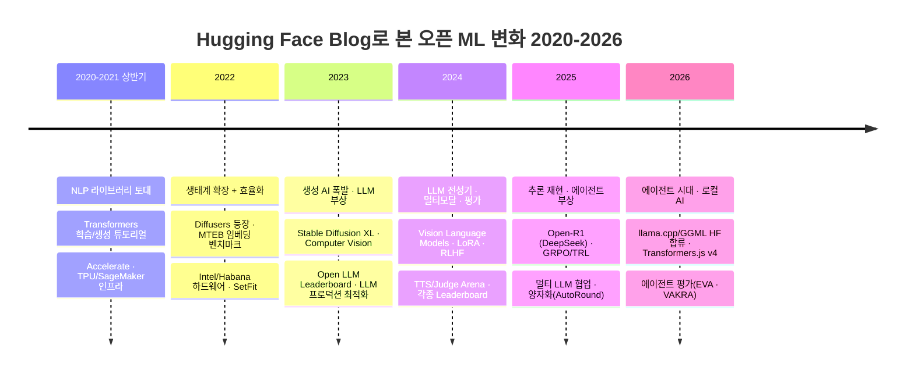

> 📌 **이 글에 대해**
>
> - **출처**: [huggingface.co/blog](https://huggingface.co/blog) (메인 큐레이션, `numTotalItems` 기준 전체)
> - **마지막 업데이트**: 2026-07-23
> - **갱신 주기**: 새 글이 게시될 때마다 자동 추가
> - **요약 방식**: NotebookLM을 통한 비공식 한국어 요약 (3문장). 정확한 내용은 항상 원문 링크를 참고해 주세요.
> - **분류**: 별도 카테고리 없이 시간순 단일 리스트. 현재 연도는 월별, 과거 연도는 통합으로 그룹화. 각 항목에 첫 작성자(개인/조직)를 함께 표기합니다.
> - **수집 범위**: HF blog 메인 큐레이션(`/blog/?p=N`)만 포함. 별도 영역인 Community Articles(`/blog/community`)는 본 노트에서 다루지 않습니다.

---

## 📈 Trends

> 아래 시간순 리스트의 요약문 831건(2020–2026)을 **연도별로 분석**해, Hugging Face 블로그가 비추는 오픈소스 ML 흐름의 변화를 정리했습니다. 집계 기준일은 sitemap의 `lastmod`라 일부 옛 글이 재게시 시점에 몰릴 수 있고, 2020–2021년은 표본(8·40건)이 작아 비율이 출렁이니, 개별 시점보다 **큰 추세** 위주로 읽어주세요.

### 한눈에 보는 시대 구분

> 💡 다이어그램 위 **＋ / －** 버튼으로 확대·축소, 확대한 뒤 **마우스로 끌어서 이동**할 수 있습니다. `Ctrl`/`⌘` + 마우스 휠로도 확대되며, **⛶ 새 탭**으로 전체 화면(드래그·휠로 자유 이동/확대)에서 볼 수도 있습니다.

### 테마 점유율 추세

연도별로 각 테마가 언급된 글의 비율(%)입니다. 최근으로 올수록 **Agent**가 가파르게 오르고(0→46%) **NLP·BERT**는 내려앉으며, **LLM**은 2024년 정점 뒤 에이전트·효율화 주제로 무게중심을 내주고 있습니다. 범례에서 테마 이름을 클릭하면 개별 추세선을 켜고 끌 수 있고, 차트에 마우스를 올리면 확대·팬·PNG 저장 도구가 나타납니다.



### 큰 줄기 요약

- **2020–2021 — "NLP 라이브러리 토대"**: Hugging Face = `transformers` 라이브러리 사용법. `How to train a LM from scratch`, `How to generate text`, Reformer, encoder-decoder 같은 **튜토리얼**이 중심이고, `Accelerate` 출시와 TPU·SageMaker·Graphcore 인프라 글이 받친다. NLP·BERT 점유율이 75%로 전 기간 최고.
- **2022 — 생태계 확장 + 효율화**: Hub·Spaces·Private Hub로 플랫폼이 넓어지고, `Diffusers`가 처음 등장(생성이미지 9%). `MTEB`(임베딩 벤치마크)·`SetFit`이 나오고 Intel·Habana 하드웨어 파트너십으로 **효율화** 색채가 짙어진다. 윤리(ethics) 담론도 이 시기 피크.
- **2023 — 생성 AI 폭발 · LLM 부상**: `Stable Diffusion XL`로 생성이미지가 24%까지 치솟아 **단발 피크**를 찍고, 동시에 LLM이 본격화(33%) — `Red-Teaming LLMs`, `Open LLM Leaderboard`, `Optimizing your LLM in production`, `SafeCoder`. ONNX로 13만 모델 가속 등 배포 인프라도 동반 성장.
- **2024 — LLM 전성기 · 멀티모달 · 평가**: LLM이 47%로 정점. `Vision Language Models`·`LoRA`·`RLHF`로 멀티모달과 정렬 기법이 확산되고, `TTS Arena`·`Judge Arena`·`Open Medical-LLM Leaderboard` 등 **평가(Arena/Leaderboard)** 가 하나의 장르로 자리 잡는다.
- **2025 — 추론 재현 · 에이전트 부상**: `Open-R1`로 DeepSeek 추론 모델을 오픈소스로 재현하고 `GRPO/TRL`로 RL 학습이 대중화(Reasoning·평가 33%). Agent가 25%로 점프하며 `Consilium`(멀티 LLM 협업) 같은 시스템형 글이 늘어난다.
- **2026 — 에이전트 시대 · 로컬 AI**: Agent가 46%로 최고치. `llama.cpp/GGML`의 HF 합류와 `Transformers.js v4`(브라우저 실행)로 **로컬·온디바이스 AI**가 전면에 서고, `EVA`·`VAKRA`처럼 **에이전트를 평가**하는 글이 나온다.

곁가지로 일관되게 흐르는 두 축:

- **Inference·효율화는 HF의 정체성** — 25–46%로 전 기간 항상 높다. `추론 100배 가속`(2021)부터 양자화·`continuous batching`·vLLM까지, "모델을 실제로 돌아가게 만드는 것"이 줄곧 중심이었다.
- **하드웨어 파트너십은 상수** — Intel·Habana·Graphcore·AWS·NVIDIA 협업 글이 매년 꾸준히 등장하며, 오픈 모델 생태계를 떠받치는 인프라 레이어 역할을 한다.

> 참고: **Diffusion·생성이미지**는 LLM과 달리 2023년 한 해에 솟았다 빠지는 **스파이크형**이었습니다(24% → 5–10%). 이미지 생성이 끝났다기보다, Hugging Face 블로그의 무게중심이 텍스트·LLM·에이전트로 빠르게 이동한 결과로 읽는 편이 정확합니다.

---

## 🗓️ 시간순 요약

> 아래는 개별 글의 한국어 요약입니다. 현재 연도는 월별, 과거 연도는 통합으로 묶었으며, 각 항목에 첫 작성자(개인/조직)를 함께 표기합니다.

<!-- AUTO-DIGEST:START -->

### 2026년 7월

- **2026-07-23** · _Pham Hong Vinh_ · [Bringing Nunchaku 4-bit Diffusion Inference to Diffusers](https://huggingface.co/blog/nunchaku-diffusers)

    Hugging Face는 Nunchaku Lite를 Diffusers에 기본 통합하여 별도의 inference engine 없이도 SVDQuant 기반의 4-bit diffusion transformer를 즉시 불러오고 실행할 수 있도록 지원한다. 이 방식은 W4A4 quantization을 적용하여 peak VRAM 사용량을 최대 50%까지 줄이면서도 denoising loop의 latency를 크게 개선하며 torch.compile을 결합할 경우 기존 대비 1.8배 향상된 속도를 달성한다. 향후 사용자들은 from_pretrained 메서드를 통해 pre-quantized checkpoint를 손쉽게 불러오고 diffuse-compressor 툴킷으로 새로운 아키텍처를 직접 quantize하여 제한된 소비자용 GPU 환경에서도 대규모 모델을 효율적으로 배포할 수 있을 것이다.

- **2026-07-21** · _NVIDIA_ · [The State of Simulation for Physical AI: An Overview](https://huggingface.co/blog/nvidia/state-of-simulation-for-physical-ai)

    NVIDIA는 physical AI 시스템 훈련에 필수적인 데이터 부족 문제를 극복하기 위해 고도화된 simulation 기술의 발전 동향과 주요 프레임워크 생태계를 종합적으로 분석했다. MuJoCo Warp의 contact-rich physics나 Isaac Sim 및 Isaac Lab의 OpenUSD 기반 photorealistic rendering을 지원하는 다양한 simulation engine들은 GPU-accelerated 연산을 통해 대규모 reinforcement learning과 synthetic data 생성을 효율적으로 수행한다. 향후 개발자들은 Newton과 같이 open-source로 구축되는 shared 인프라를 바탕으로 고품질의 policy를 신속하게 훈련하고 강력한 physical AI 모델을 실제 로봇 환경에 성공적으로 배포할 수 있을 것이다.

- **2026-07-21** · _Steve Nguyen_ · [Grabette: an open system to record robot-manipulation data](https://huggingface.co/blog/grabette)

    Pollen Robotics는 실제 로봇 없이도 사람의 손을 통해 robot-manipulation data를 손쉽게 수집할 수 있는 오픈소스 기반의 저비용 시스템인 Grabette를 공식적으로 공개했다. 이 기기는 두 개의 카메라와 SLAM 기술을 결합하여 6-DoF trajectory를 정밀하게 기록하며 브라우저 환경의 Hugging Face Space를 통해 수집된 시연 데이터를 LeRobot dataset 포맷으로 자동 변환해준다. 향후 커뮤니티의 누구나 이 시스템을 활용하여 대규모의 open manipulation dataset 구축에 원활하게 기여할 수 있으며 고가의 하드웨어 장벽 없이도 강력한 robot learning policy를 성공적으로 훈련할 수 있을 것이다.

- **2026-07-16** · _Dharma-AI_ · [Newer Models, Same Advantage](https://huggingface.co/blog/Dharma-AI/newer-models-same-advantages)

    DharmaOCR은 Brazilian Portuguese에 집중한 domain specialization 전략을 통해 Mistral OCR4 및 Unlimited-OCR과 같은 최신 다국어 범용 모델을 능가하는 benchmark 성능을 달성했다. 이 모델은 supervised fine-tuning으로 parameter 역량을 특정 언어에 온전히 집중시키고 DPO 훈련 단계를 결합하여 시각적으로 복잡한 문서에서 흔히 발생하는 text degeneration 문제를 성공적으로 방지한다. 향후 개발팀은 특화 모델이 가지는 이러한 구조적 우위를 바탕으로 새롭게 등장하는 architecture와 훈련 기법을 지속적으로 통합하여 특정 도메인 내에서 한정된 리소스를 가장 효율적으로 활용하는 AI 시스템을 발전시켜 나갈 것이다.

- **2026-07-16** · _system_ · [Security incident disclosure — July 2026](https://huggingface.co/blog/security-incident-july-2026)

    Hugging Face는 자사의 데이터 처리 파이프라인을 표적으로 삼은 자율적인 AI agent 시스템 기반의 침해 사고를 탐지하고 이를 성공적으로 차단했다. 공격자는 dataset 처리 과정의 취약점을 악용해 node-level 접근 권한을 얻고 credential을 탈취했으나 보안팀은 상용 API의 safety guardrail 제약을 피해 자체 인프라에서 open-weight 모델인 GLM 5.2를 활용하여 방대한 이벤트 로그를 신속하게 분석했다. 향후 기업들은 machine speed로 작동하는 AI 주도 공격에 대응하기 위해 제약 없이 안전하게 포렌식 분석을 수행할 수 있는 자체적인 open-weight 모델 기반의 방어 체계를 사전에 구축해야 할 것이다.

- **2026-07-15** · _Ai2_ · [What building Shippy taught us about building agents](https://huggingface.co/blog/allenai/shippy-tech-blog)

    Ai2의 Skylight 팀은 실시간 해양 도메인 인식을 위한 AI agent인 Shippy를 개발하며 단순한 모델 성능 향상보다 시스템의 신뢰성 확보와 예측 가능한 도구 제어 및 철저한 데이터 격리에 집중했다. Shippy는 system prompt인 soul과 markdown 형태의 skills로 구성되어 결정론적인 CLI를 통해 Skylight API와 통신하며 사용자 데이터 보호를 위해 Mothership이라는 전용 Kubernetes sandbox 환경에서 독립적으로 실행된다. 향후 개발팀은 Shippy에 agent 주도의 UI 제어와 cross-thread memory 기능을 도입할 예정이며 이러한 agent 호스팅 인프라를 EarthRanger 및 OlmoEarth와 같은 다른 환경 보호 플랫폼으로 지속적으로 확장해 나갈 것이다.

- **2026-07-15** · _IBM Research_ · [Model Routing Is Simple. Until It Isn’t.](https://huggingface.co/blog/ibm-research/model-routing-is-simple-until-it-isnt)

    IBM Research는 AI agent 시스템에서의 model routing이 단순한 task 난이도 기반의 분류가 아니라 cost, complexity, latency를 포괄적으로 다루어야 하는 최적화 문제임을 규명했다. 실제 운영 환경에서는 cache 적중률과 serving 인프라 상태가 최종 비용과 응답 시간에 결정적인 영향을 미치기 때문에 이들은 단순한 모델 가격표 대신 cost, quality, latency를 동시에 최적화하는 경량화된 router를 개발했다. 향후 개발자들은 이 router가 제공하는 다양한 configuration을 바탕으로 특정 task에 맞는 단일 모델을 찾는 것을 넘어 전체 시스템 관점에서 최적의 작동 지점을 유연하게 선택하여 효율적인 enterprise 배포를 성공적으로 수행할 수 있을 것이다.

- **2026-07-15** · _ben burtenshaw_ · [Welcome Inkling by Thinking Machines](https://huggingface.co/blog/thinkingmachines-inkling)

    Thinking Machines는 1M context window를 지원하며 image, text, audio 입력을 natively 처리할 수 있는 약 1T parameter 규모의 multimodal LLM인 Inkling을 Hugging Face를 통해 공개했다. 이 모델은 decoder-only 기반의 MoE 아키텍처를 적용해 active parameter를 41B로 제한하며 연산 효율을 극대화했으며, MTP layer를 활용한 빠른 inference와 Transformers, SGLang, vLLM 등 주요 framework 환경에 대한 즉각적인 통합을 제공한다. 향후 개발자들은 이 강력한 multimodal reasoning 역량을 바탕으로 복잡한 agentic 워크플로우를 구축하고 효율적인 fine-tuning을 통해 다양한 도메인에 특화된 모델을 성공적으로 배포할 수 있을 것이다.

- **2026-07-15** · _David Ayllon_ · [Introducing Real World VoiceEQ: Measuring the human quality of voice AI](https://huggingface.co/blog/real-world-voiceeq)

    Hume AI는 기존 benchmark가 포착하지 못하는 대화의 뉘앙스를 측정하여 voice AI의 사람다운 상호작용 품질을 종합적으로 평가하는 Real World VoiceEQ를 새롭게 공개했다. 이 시스템은 자체 평가 플랫폼인 Kairos를 통해 수집된 100만 건 이상의 human rating을 바탕으로 40여 개의 모델을 ASR, TTS, Speech-to-Speech 전반에 걸쳐 분석하여 최신 모델들이 여전히 paralinguistic 정보를 자연스럽게 처리하는 데 한계가 있음을 규명했다. 향후 개발자들은 단순한 WER이나 latency 최적화 기준을 벗어나 이러한 human-grounded metric을 적극 활용함으로써 실제 환경의 복잡한 감정과 문맥을 온전히 이해하는 고도화된 voice AI 모델을 성공적으로 구축할 수 있을 것이다.

- **2026-07-10** · _Aritra Roy Gosthipaty_ · [Profiling in PyTorch (Part 3): Attention is all you profile](https://huggingface.co/blog/torch-attention-profile)

    Hugging Face는 PyTorch의 profiler를 활용하여 다양한 attention 구현체들의 작동 방식을 분석하고 F.scaled_dot_product_attention의 backend별 성능 최적화 원리를 상세히 규명했다. Naive attention 구현에서는 in-place 연산으로 불필요한 memory copy를 제거할 수 있으며 SDPA의 flash 및 efficient backend는 여러 단계의 연산을 단일 fused kernel로 통합하여 HBM 접근에 따른 병목 현상을 획기적으로 줄인다. 향후 개발자들은 이러한 profiler 분석 기법을 바탕으로 low occupancy와 같은 표면적인 지표 이면의 실제 자원 활용도를 파악하고 각 모델 환경에 가장 최적화된 attention 구조를 효율적으로 구축할 수 있을 것이다.

- **2026-07-08** · _Harry Mellor_ · [Native-speed vLLM transformers modeling backend](https://huggingface.co/blog/native-speed-vllm-transformers-backend)

    Hugging Face는 transformers vLLM backend를 업데이트하여 모델 개발자가 별도의 커스텀 구현체 없이도 네이티브 vLLM과 동일하거나 더 빠른 속도로 모델의 inference를 수행할 수 있게 했다. 이 시스템은 torch.fx를 활용해 모델 그래프를 정적 분석하고 ast로 소스 코드를 런타임에 조작함으로써 TP 및 MoE 모델의 EP 등에 특화된 최적화 kernel과 fused operations를 자동으로 적용한다. 향후 사용자들은 transformers 코드를 training과 evals에 그대로 활용하면서도 번거로운 포팅 작업 없이 대규모 LLM을 최상의 효율로 즉시 서빙할 수 있을 것이다.

- **2026-07-07** · _Amazon_ · [From Hugging Face to Amazon SageMaker Studio in one click](https://huggingface.co/blog/amazon/one-click-to-sagemaker-studio)

    Hugging Face와 Amazon은 사용자가 Hugging Face 모델 페이지에서 클릭 한 번으로 Amazon SageMaker Studio로 이동해 모델을 실험하고 배포할 수 있는 통합 기능을 공식적으로 발표했다. 이 기능은 새로운 도메인 생성과 복잡한 IAM permission 설정을 자동으로 처리하며 GPU quota 가시성을 직접 제공하여 사용자가 곧바로 fine-tuning을 수행하거나 inference endpoint를 구축할 수 있게 지원한다. 향후 개발자들은 번거로운 수동 환경 설정이나 context switching에 따른 지연 없이 모델의 탐색부터 enterprise 수준의 배포에 이르는 전체 워크플로우를 빠르고 효율적으로 완수할 수 있을 것이다.

- **2026-07-07** · _Microsoft_ · [Hugging Face Models on Foundry Managed Compute](https://huggingface.co/blog/microsoft/foundry-managed-compute)

    Microsoft는 Hugging Face 생태계의 다양한 open-weight 모델을 단 한 번의 클릭으로 안전하게 배포할 수 있는 Foundry Managed Compute 환경을 공식적으로 발표했다. 이 플랫폼은 Microsoft가 직접 보안 검증을 완료한 SafeTensors 형태의 모델 가중치와 vLLM, SGLang 등 최적화된 runtime을 Azure 인프라에 사전 구축하여 복잡한 운영 부담 없이 enterprise 수준의 모델 서빙을 보장한다. 향후 기업 및 개발자들은 단일 endpoint와 SDK를 활용하여 최신 open-source 모델들을 Foundry Agent와 원활하게 통합하고 복잡한 agentic 애플리케이션을 안전하고 효율적으로 운용할 수 있을 것이다.

- **2026-07-07** · _Nikhil Jha_ · [Run AI workloads on any cloud, store on Hugging Face: zero-egress storage with SkyPilot](https://huggingface.co/blog/skypilot-hf-storage)

    Hugging Face와 SkyPilot은 Hugging Face Storage를 공식 백엔드로 통합하여 클라우드 간 데이터 전송에 따른 egress 비용 없이 어떤 GPU 환경에서든 AI 워크로드를 실행할 수 있는 환경을 구축했다. 사용자는 단일 hf:// URL과 HF_TOKEN을 통해 dataset이나 model을 직관적으로 마운트할 수 있으며 Xet 기반의 중복 제거 기술을 활용하여 checkpoint 저장 시 변경된 데이터만 전송함으로써 네트워크 효율을 극대화한다. 향후 개발자들은 데이터가 위치한 특정 클라우드 벤더에 종속되지 않고 다양한 인프라의 가용 GPU 리소스를 자유롭게 선택하여 대규모 training 및 inference 작업을 획기적으로 낮은 비용에 성공적으로 수행할 수 있을 것이다.

- **2026-07-07** · _Steven Palma_ · [LeRobot v0.6.0: Imagine, Evaluate, Improve](https://huggingface.co/blog/lerobot-release-v060)

    Hugging Face는 미래를 예측하는 world model policy와 작업 성공 여부를 평가하는 reward model을 도입하여 완전한 robot learning loop를 구축하는 LeRobot v0.6.0을 공식적으로 발표했다. 사용자는 VLA-JEPA 및 FastWAM과 같은 최신 아키텍처를 손쉽게 훈련할 수 있으며, lerobot-rollout CLI를 통한 즉각적인 deployment와 lerobot-eval을 활용한 광범위한 simulation benchmark 평가를 효율적으로 수행할 수 있다. 향후 개발자들은 자동화된 dataset 파이프라인과 FSDP 및 HF Jobs를 결합한 확장 가능한 cloud training 인프라를 바탕으로 고도화된 로봇 제어 모델을 실제 환경에 더욱 신속하고 안정적으로 배포할 수 있을 것이다.

- **2026-07-06** · _Photoroom_ · [PRX Part 4: Our Data Strategy](https://huggingface.co/blog/Photoroom/prx-part4-data)

    Photoroom은 7B 규모의 text-to-image diffusion 모델인 PRX를 pre-training하기 위해 다양한 출처의 데이터를 통합하고 VLM으로 전체 이미지를 re-captioning하는 효율적인 데이터 파이프라인 구축 과정을 공개했다. 이 파이프라인은 Lance 포맷을 활용해 대규모 데이터를 원활하게 탐색하고 Qwen3-VL 모델로 상세한 caption을 생성하며, 분산 훈련을 위해 최종 데이터를 Mosaic Data Shards 형태로 변환하여 스트리밍한다. 향후 개발팀은 이러한 대규모 데이터 처리 인프라를 바탕으로 VLM 기반의 고도화된 큐레이션 도구를 도입하여 supervised fine-tuning과 preference alignment에 최적화된 고품질 데이터셋을 성공적으로 구축할 것이다.

- **2026-07-06** · _Sayak Paul_ · [🤗 Kernels: Major Updates](https://huggingface.co/blog/revamped-kernels)

    Hugging Face는 커스텀 kernel의 패키징과 배포를 표준화하고 안전하게 관리하기 위해 Hub에 새로운 kernel repository 타입을 도입하며 Kernels 프로젝트의 대규모 업데이트를 단행했다. 이번 업데이트는 trusted publisher 제도와 Sigstore 기반의 kernel signing을 통해 보안을 획기적으로 강화했으며 CLI 구조를 개편하고 Torch Stable ABI 및 Apache TVM FFI와 같은 다양한 framework 지원을 새롭게 추가했다. 향후 사용자들은 확립된 인프라와 HF Jobs 연동을 바탕으로 AI agent가 직접 여러 하드웨어 환경을 테스트하고 코드를 최적화하는 고도화된 agentic kernel development를 성공적으로 주도할 수 있을 것이다.

- **2026-07-01** · _Amir Mahla_ · [Hugging Face and Cerebras bring Gemma 4 to real-time voice AI](https://huggingface.co/blog/cerebras-gemma4-voice-ai)

    Hugging Face와 Cerebras는 Gemma 4 모델을 활용한 real-time voice AI 파이프라인을 공개하며 자연스럽고 응답성이 뛰어난 speech-to-speech 대화 경험을 성공적으로 구현했다. 이 시스템은 NVIDIA의 Parakeet, Cerebras 인프라에서 구동되는 Gemma 4 VLM, Alibaba의 Qwen3TTS를 결합한 open-source 기반의 modular 아키텍처로 구성되어 inference 과정의 latency 병목 현상을 획기적으로 해결한다. 향후 개발자들은 이 개방형 생태계를 바탕으로 Reachy Mini와 같은 embodied AI 시스템에 예측 가능한 고속 모델을 손쉽게 통합하여 지연 없는 대규모 voice AI 애플리케이션을 배포할 수 있을 것이다.

### 2026년 6월

- **2026-06-30** · _IBM Research_ · [ScarfBench: Benchmarking AI Agents for Enterprise Java Framework Migration](https://huggingface.co/blog/ibm-research/scarfbench)

    IBM Research는 Enterprise Java 환경에서 AI agent의 framework migration 역량을 종합적으로 평가하는 새로운 benchmark인 ScarfBench를 공식적으로 공개했다. 이 시스템은 단순한 코드 생성을 넘어 Spring, Jakarta EE, Quarkus 간의 마이그레이션 결과물이 실제로 build, deploy 및 behavioral validation을 통과하는지 엄격히 검증하며, 평가 결과 최신 모델조차 10% 미만의 성공률을 기록하며 configuration과 dependency 해결에 큰 어려움을 겪는 것으로 나타났다. 향후 연구자와 실무자들은 ScarfBench의 dataset과 인프라를 적극 활용하여 AI agent의 구조적 추론 및 검증 능력을 개선함으로써 복잡한 enterprise 환경에서 진정한 autonomous application modernization을 성공적으로 가속화할 수 있을 것이다.

- **2026-06-30** · _Dharma-AI_ · [Why Specialization Is Inevitable](https://huggingface.co/blog/Dharma-AI/why-specialization-is-inevitable)

    Dharma AI는 2026년 발표된 논문을 바탕으로 최적화 이론과 진화 생물학 및 시장 경제와 machine learning 분야를 종합적으로 분석하며 제한된 자원 환경에서 AI 시스템의 specialization이 필연적이라는 결론을 도출했다. No Free Lunch 이론과 모델 훈련 과정의 negative transfer 현상이 증명하듯 무한한 범위에 연산량과 데이터를 분산시키는 것보다 특정 task 세트에 자원을 집중하여 완벽한 fit을 달성하는 것이 성능 향상에 구조적으로 유리하다. 향후 기업과 개발자들은 맹목적인 scaling에 의존하여 범용 모델을 구축하기보다 명확한 목표 범위를 가진 AI agent와 특화 모델을 설계함으로써 실제 enterprise 환경의 복잡한 요구사항을 가장 효율적이고 강력하게 해결할 수 있을 것이다.

- **2026-06-30** · _Sree Harsha Nelaturu_ · [Featuring Every Eval Ever Results on Hugging Face Model Pages](https://huggingface.co/blog/eee-community-evals)

    Hugging Face는 EvalEval Coalition의 Every Eval Ever와 자사의 Community Evals를 상호 호환되도록 통합하여 분산된 모델 benchmark 평가 결과를 표준화하고 쉽게 교차 게시할 수 있는 시스템을 구축했다. 새롭게 도입된 converter는 EEE의 JSON schema 기반 평가 데이터를 Hugging Face 환경에 맞는 YAML 형식으로 자동 변환하며 모델 페이지의 leaderboard 점수를 상세한 eval 기록 원본과 직접 연결한다. 향후 연구자와 개발자들은 번거로운 중복 보고 작업 없이 투명하고 재현 가능한 평가 결과를 효율적으로 공유할 수 있으며 이를 바탕으로 다양한 모델의 성능을 더욱 신뢰성 있게 비교하고 검증할 수 있을 것이다.

- **2026-06-29** · _Ai2_ · [DiScoFormer: One transformer for density and score, across distributions](https://huggingface.co/blog/allenai/discoformer)

    AllenAI는 단일 forward pass만으로 distribution의 density와 score를 동시에 추정하며 별도의 retraining 없이도 즉각적으로 작동하는 DiScoFormer를 공식적으로 공개했다. 이 모델은 cross-attention 구조와 두 개의 output head를 기반으로 inference 과정에서 label-free consistency loss를 활용하여 고차원 환경에서 기존 KDE 대비 score error를 6.5배 및 density error를 37배 이상 획기적으로 감소시킨다. 향후 연구자들은 매번 모델을 처음부터 다시 훈련할 필요 없이 이 pretrained 형태의 plug-in estimator를 활용하여 generative modeling이나 Bayesian inference 등 복잡한 score estimation이 요구되는 다양한 과학 연산 분야의 비용을 성공적으로 절감할 수 있을 것이다.

- **2026-06-26** · _Quentin Gallouédec_ · [Run a vLLM Server on HF Jobs in One Command](https://huggingface.co/blog/vllm-jobs)

    Hugging Face는 서버 프로비저닝이나 Kubernetes 없이 단일 명령어만으로 프라이빗 OpenAI 호환 LLM endpoint를 즉각적으로 구축할 수 있는 HF Jobs 기반의 vLLM 서버 배포 방식을 공개했다. 사용자는 hf jobs run 명령어를 통해 Qwen3와 같은 대규모 모델의 inference 환경을 손쉽게 실행하여 Gradio UI나 Pi 기반의 coding agent에 즉시 연동할 수 있으며 SSH 접속을 통해 실시간으로 시스템을 디버깅할 수 있다. 향후 개발자들은 비용 효율적이고 유연한 HF Jobs와 프로덕션 수준의 Inference Endpoints를 목적에 맞게 선택함으로써 복잡한 인프라 관리 부담 없이 다양한 모델을 빠르고 효율적으로 실험하고 활용할 수 있을 것이다.

- **2026-06-24** · _NVIDIA_ · [Accelerating Transformers Fine-Tuning with NVIDIA NeMo AutoModel](https://huggingface.co/blog/nvidia/accelerating-fine-tuning-nvidia-nemo-automodel)

    NVIDIA NeMo AutoModel은 Hugging Face Transformers v5를 기반으로 MoE 모델의 fine-tuning 성능을 극대화하여 기존과 동일한 API 환경에서 3.4–3.7배 높은 throughput과 최대 32%의 GPU memory 절감 효과를 달성했다. 이 시스템은 Expert Parallelism을 통해 expert 가중치를 여러 GPU에 분산시키며 DeepEP dispatch 및 TransformerEngine kernel을 결합해 통신과 연산을 효율적으로 중첩시킨다. 향후 개발자들은 단 한 줄의 import 변경만으로 대규모 모델의 full fine-tuning을 원활하게 수행하고 표준 HF 형태의 checkpoint를 vLLM이나 SGLang 같은 inference framework에 즉시 배포할 수 있을 것이다.

- **2026-06-24** · _Daniel Gert Nielsen_ · [Introducing the FFASR Leaderboard: Benchmarking ASR in the Real World](https://huggingface.co/blog/ffasr-leaderboard)

    Treble Technologies와 Hugging Face는 실제 환경의 복잡한 음향 조건을 반영하여 ASR 모델을 평가하는 최초의 오픈 커뮤니티 기반 benchmark인 FFASR Leaderboard를 공식적으로 출시했다. 이 시스템은 자체 simulation engine으로 14개의 공간과 다양한 SNR 조건에서 생성된 데이터를 활용해 far-field 환경의 WER과 RTFx를 동시에 측정하며 기존 near-field 평가와의 실제 성능 격차를 명확하게 규명한다. 향후 개발자들은 이 표준화된 평가 인프라를 바탕으로 multi-talker 환경이나 microphone array와 같은 복잡한 시나리오를 효과적으로 테스트하여 실제 환경에 강건한 voice AI 시스템을 성공적으로 구축할 수 있을 것이다.

- **2026-06-23** · _Lucain Pouget_ · [Shipping huggingface_hub every week with AI, open tools, and a human in the loop](https://huggingface.co/blog/huggingface-hub-release-ci)

    Hugging Face는 open-weights 모델과 결정론적 검증 코드 및 human-in-the-loop 방식을 결합하여 huggingface_hub의 주간 release를 자동화하는 CI 워크플로우를 성공적으로 구축했다. 이 시스템은 GitHub Actions와 OpenCode 기반으로 GLM-5.2 모델을 활용해 release notes 초안을 생성하며, 모델이 조작하거나 누락한 PR이 없도록 스크립트로 교차 검증하고 PyPI Trusted Publishing으로 보안을 획기적으로 강화했다. 향후 다양한 Python 패키지 메인테이너들은 특정 벤더에 종속되지 않은 이 개방형 워크플로우를 포크하여 번거로운 수동 작업을 최소화하고 안전하고 신속한 소프트웨어 배포 환경을 효율적으로 도입할 수 있을 것이다.

- **2026-06-23** · _Thomas Steiner_ · [Experimenting with the proposed Cross-Origin Storage API in Transformers.js](https://huggingface.co/blog/cross-origin-storage)

    Transformers.js는 Cross-Origin Storage API를 새롭게 도입하여 여러 origin의 web app 환경에서 AI model 및 Wasm runtime 리소스가 중복으로 다운로드되는 문제를 해결하는 실험적인 cache backend를 구축했다. 이 시스템은 URL이나 origin 대신 SHA-256 기반의 cryptographic hash로 파일을 식별함으로써 한 번 다운로드된 공용 리소스를 다양한 사이트 간에 안전하게 공유하고 데이터의 integrity를 자동으로 보장한다. 향후 개발자들은 간단한 opt-in 설정을 통해 불필요한 네트워크 비용과 저장 공간 낭비를 획기적으로 줄일 수 있으며 Chrome 등 주요 브라우저의 native 지원이 본격화되면 더욱 빠르고 효율적인 web AI 생태계를 성공적으로 조성할 수 있을 것이다.

- **2026-06-22** · _PaddlePaddle_ · [PP-OCRv6 on Hugging Face: 50-Language OCR from 1.5M to 34.5M Parameters](https://huggingface.co/blog/PaddlePaddle/pp-ocrv6)

    PaddlePaddle은 1.5M에서 34.5M parameter 규모로 50개 언어를 지원하는 경량 범용 모델인 PP-OCRv6를 Hugging Face에 공식적으로 공개했다. 이 모델은 PPLCNetV4 backbone을 기반으로 RepLKFPN detection과 EncoderWithLightSVTR recognition 구조를 결합해 최대 86.2%의 detection Hmean을 달성했으며 Transformers 및 ONNX Runtime 등 다양한 inference backend를 완벽하게 지원한다. 향후 개발자들은 이처럼 유연한 deployment 옵션과 가벼운 연산량을 바탕으로 document parsing, RAG 및 복잡한 agent workflow 등 다양한 downstream 시스템을 비용 효율적으로 구축할 수 있을 것이다.

- **2026-06-22** · _Onur Solmaz_ · [We got local models to triage the OpenClaw repo for FREE!*](https://huggingface.co/blog/local-models-pr-triage)

    Hugging Face는 gemma-4-26b-a4b 및 qwen3.6-35b-a3b와 같은 local model을 agent harness 환경에서 활용하여 OpenClaw repository의 대규모 issue와 PR을 실시간으로 자동 분류하는 시스템을 성공적으로 구축했다. 이 시스템은 pi와 읽기 전용으로 제한된 reposhell을 결합하여 prompt injection 위험을 안전하게 차단하며, 별도의 fine-tuning 없이도 모델이 직접 codebase를 탐색해 정확한 label을 할당하는 agentic classification을 높은 throughput으로 수행한다. 향후 사용자들은 이처럼 비용 효율적인 high throughput triage 접근법을 고객 지원이나 콘텐츠 모더레이션 등 다양한 도메인에 폭넓게 적용하여 방대한 실시간 데이터의 필터링 워크플로우를 성공적으로 자동화할 수 있을 것이다.

- **2026-06-18** · _ServiceNow_ · [MosaicLeaks: Can your research agent keep a secret?](https://huggingface.co/blog/ServiceNow/mosaicleaks)

    ServiceNow는 deep-research agent의 web query를 통한 프라이버시 유출을 평가하는 MosaicLeaks를 공개하며 성능 유지와 정보 보호를 동시에 달성하는 PA-DR 학습 기법을 제안했다. PA-DR은 단순한 prompt 의존 대신 situational task reward와 query log의 leakage 위험을 평가하는 learned privacy reward를 결합한 RL 기법을 적용하여 strict chain success를 향상시키면서도 answer 및 full-information leakage를 9.9%로 획기적으로 감소시켰다. 향후 개발자들은 이 평가 지표와 구조적인 RL 방식을 활용하여 복잡한 enterprise 환경에서 동작하는 agent가 task success를 희생하지 않고 안전하게 정보를 검색하도록 성공적으로 고도화할 수 있을 것이다.

- **2026-06-18** · _Benjamin Bossan_ · [Beyond LoRA: Can you beat the most popular fine-tuning technique?](https://huggingface.co/blog/peft-beyond-lora)

    Hugging Face는 PEFT 라이브러리에 새로운 benchmark를 도입하여 종합적으로 평가한 결과, 가장 대중적인 fine-tuning 기법인 LoRA가 모든 환경에서 항상 최선의 선택은 아니라는 결론을 발표했다. 실제 LLM 수학 추론 및 image generation benchmark에서 BEFT나 OFT와 같은 대안적인 PEFT 기법들이 메모리 효율성이나 test accuracy 측면에서 표준 LoRA를 능가하며 Pareto frontier에 도달하는 것으로 확인되었다. 향후 개발자들은 맹목적으로 LoRA를 채택하기보다 PEFT 라이브러리의 통합 API를 활용하여 간단한 설정 변경만으로 다양한 기법을 효율적으로 실험하고 자신의 데이터에 가장 적합한 방식을 성공적으로 적용할 수 있을 것이다.

- **2026-06-18** · _Lysandre_ · [Is it agentic enough? Benchmarking open models on your own tooling](https://huggingface.co/blog/is-it-agentic-enough)

    Hugging Face는 AI agent가 소프트웨어를 얼마나 효율적으로 사용하는지 종합적으로 평가하기 위해 transformers 라이브러리를 사례로 삼아 작업 소요 시간과 token 사용량 등 전체 과정을 측정하는 새로운 benchmark harness를 공개했다. 이 평가 환경을 통해 CLI와 Skill과 같은 agent 최적화 도구를 추가하는 것이 대규모 모델의 작업 효율을 높이는 반면 작은 모델에게는 오히려 혼란을 가중시켜 성능을 저하시킬 수 있다는 사실을 실증적으로 확인했다. 향후 개발자들은 공개된 agent-eval CLI를 활용하여 자신들의 라이브러리를 직접 테스트함으로써 다양한 모델 크기에 걸쳐 모호함 없이 효율적으로 동작하는 agent-facing API를 성공적으로 설계할 수 있을 것이다.

- **2026-06-17** · _Amazon_ · [From the Hugging Face Hub to robot hardware with Strands Agents and LeRobot](https://huggingface.co/blog/amazon/strands-lerobot-hub-to-hardware)

    AWS는 Strands Robots SDK에 LeRobot 스택을 통합하여 Hugging Face Hub의 데이터셋부터 실제 로봇 하드웨어 배포까지 단일 agent 루프로 제어하는 워크플로우를 공식적으로 발표했다. 이 시스템은 코드 상의 단순한 keyword argument 변경만으로 MuJoCo 기반의 simulation과 실제 하드웨어 환경 간의 유연한 전환을 지원하며 동일한 형태의 LeRobotDataset 포맷과 policy를 사용하여 완벽한 데이터 호환성을 유지한다. 향후 개발자들은 이 통합 인프라와 Zenoh 기반의 mesh 네트워크를 바탕으로 복잡한 구조적 장벽이나 변환 과정 없이 sim-to-real transfer를 가속화하고 대규모 로봇 군집을 원활하게 배포할 수 있을 것이다.

- **2026-06-17** · _Z.ai_ · [GLM-5.2: Built for Long-Horizon Tasks](https://huggingface.co/blog/zai-org/glm-52-blog)

    Z.AI는 long-horizon task에 최적화된 1M context 기반의 오픈소스 플래그십 모델인 GLM-5.2를 공식 발표했다. GLM-5.2는 IndexShare 아키텍처와 향상된 MTP layer를 결합하여 inference 연산 효율을 극대화했으며 slime 프레임워크 기반의 agentic RL을 통해 주요 coding benchmark에서 최상위 폐쇄형 모델들과 대등한 성능을 입증했다. 향후 개발자들은 맞춤형 effort level control이 가능한 이 개방형 모델을 다양한 agent 환경에 통합하여 복잡한 대규모 소프트웨어 엔지니어링 워크플로우를 성공적으로 자동화할 수 있을 것이다.

- **2026-06-17** · _ben burtenshaw_ · [Agentic Resource Discovery: Let agents search](https://huggingface.co/blog/agentic-resource-discovery-launch)

    Hugging Face는 AI agent가 runtime에 필요한 tool과 skill을 동적으로 탐색하고 연결할 수 있도록 지원하는 개방형 표준인 Agentic Resource Discovery를 도입하여 자사의 리소스를 통합한 Discover Tool을 공식적으로 공개했다. 이 도구는 Hugging Face Hub의 semantic search를 활용하여 수많은 Space와 MCP Server를 ARD catalog 항목으로 변환하며 사용자는 CLI나 REST API를 통해 자연어 형태의 intent 검색으로 모델에 필요한 리소스를 즉각적으로 제공할 수 있다. 향후 다양한 시스템 publisher들은 표준화된 ai-catalog.json manifest를 통해 자신들의 서비스를 생태계에 원활하게 노출할 수 있으며 이를 바탕으로 agent가 방대한 도구를 사전에 하드코딩할 필요 없이 스스로 검증하고 연동하는 고도화된 동적 탐색 생태계가 성공적으로 구축될 것이다.

- **2026-06-11** · _Aritra Roy Gosthipaty_ · [Profiling in PyTorch (Part 2): From nn.Linear to a Fused MLP](https://huggingface.co/blog/torch-mlp-fusion)

    Hugging Face는 PyTorch 환경에서 nn.Linear 및 MLP 블록을 profiling하여 eager 모드와 torch.compile 및 hand-tuned kernel의 연산 효율과 모델 최적화 방식을 종합적으로 비교 분석했다. 분석 결과 torch.compile은 여러 pointwise 연산을 단일 Triton kernel로 융합해 HBM 접근 비용을 획기적으로 줄이지만 입력 형태 변화에 따른 재컴파일 지연이 발생하며, 반면 kernels 라이브러리 기반의 Liger kernel은 컴파일 오버헤드 없이 하드웨어에 튜닝된 성능을 즉각적으로 제공한다. 향후 개발자들은 직관적인 profiling 방법론을 바탕으로 특정 입력 형태에 특화된 컴파일 방식과 다양한 형태에서 범용적으로 작동하는 hand-tuned kernel 중 자신의 인프라 요구사항에 가장 적합한 방식을 선택하여 GPU 연산 효율을 성공적으로 극대화할 수 있을 것이다.

- **2026-06-09** · _Mishig Davaadorj_ · [How an Agent Built a 3D Paris Gallery by Chaining Two Hugging Face Spaces](https://huggingface.co/blog/mishig/spaces-agents-md)

    coding agent는 Hugging Face Spaces에 도입된 agents.md를 활용하여 복잡한 연동 코드 없이 두 개의 모델을 chaining함으로써 3D 갤러리 웹사이트를 성공적으로 구축했다. 이 과정은 별도의 SDK나 client library 없이 agent가 직접 API 스키마를 파악해 image generation 모델의 결과물을 3D reconstruction 모델의 입력으로 자동 전달하고 최종적인 3D 뷰어까지 완성한다. 향후 개발자들은 Hub에 등록된 방대한 open-weights 모델들을 composable한 building block으로 조합하여 단순한 prompt만으로도 정교한 multimedia 애플리케이션을 신속하고 비용 효율적으로 배포할 수 있을 것이다.

- **2026-06-09** · _Abubakar Abid_ · [Migrating Your GitHub CI to Hugging Face Jobs](https://huggingface.co/blog/github-ci-hf-jobs)

    Hugging Face는 GitHub Actions 워크플로우를 자사의 서버리스 인프라에서 구동할 수 있는 jobs-actions 아키텍처를 공개하며 기존 대비 CPU CI 속도를 약 30% 향상시키고 비용 효율적인 GPU 기반 테스트 환경을 성공적으로 구현했다. 이 시스템은 dispatcher Space와 GitHub App을 통해 webhook을 수신하고 workflow에 지정된 하드웨어 사양에 맞춰 단기적으로 동작하는 ephemeral self-hosted runner를 즉각적으로 생성하여 작업을 처리한다. 향후 개발자들은 상시 구동되는 자체 runner를 유지할 필요 없이 맞춤형 Docker image와 Hugging Face Jobs의 유연한 하드웨어 환경을 활용하여 복잡한 ML 프로젝트의 CI 파이프라인을 효율적으로 구축할 수 있을 것이다.

- **2026-06-08** · _ben burtenshaw_ · [The Open Source Community is backing OpenEnv for Agentic RL](https://huggingface.co/blog/openenv-agentic-rl)

    OpenEnv는 오픈소스 커뮤니티의 폭넓은 지지를 받으며 특정 reward framework에 종속되지 않는 agentic RL을 위한 범용 interoperability layer로 공식 전환되었다. 이 시스템은 HTTP 및 WebSocket과 같은 표준 프로토콜과 Docker 기반 패키징을 통해 Gymnasium 스타일의 API를 제공하며 MCP와 완벽하게 호환되어 simulation과 프로덕션 환경에서 일관되게 동작한다. 향후 개발자들은 번거로운 통합 작업 없이 다양한 environment와 trainer를 유연하게 결합하여 특정 task에 최적화된 agent와 local model을 비용 효율적으로 훈련할 수 있을 것이다.

- **2026-06-04** · _NVIDIA_ · [Nemotron 3.5 Content Safety: Customizable Multimodal Safety for Global Enterprise AI](https://huggingface.co/blog/nvidia/nemotron-3-5-content-safety)

    NVIDIA는 multimodal 입력과 다국어 지원 및 맞춤형 정책 적용과 감사 가능한 reasoning 기능을 단일 4B parameter 모델로 통합한 Nemotron 3.5 Content Safety를 공식 출시했다. 이 모델은 특정 도메인에 맞춘 custom policy를 동적으로 해석할 수 있으며 THINK mode를 통해 간결한 reasoning trace를 제공하여 다양한 benchmark에서 높은 정확도와 low-latency inference를 동시에 달성한다. 향후 글로벌 enterprise 환경의 기업들은 이 모델과 함께 공개된 dataset을 활용하여 복잡한 규제 요구사항에 맞춘 자체적인 safety 시스템을 비용 효율적으로 구축하고 생성된 trace를 투명한 실무 감사에 성공적으로 적용할 수 있을 것이다.

- **2026-06-04** · _Célina Hanouti_ · [Designing the hf CLI as an agent-optimized way to work with the Hub](https://huggingface.co/blog/hf-cli-for-agents)

    Hugging Face는 AI coding agent가 Hub 환경에서 효율적으로 동작할 수 있도록 출력 포맷과 명령어 구조를 최적화한 새로운 hf CLI를 발표했다. 이 시스템은 agent 환경을 자동 감지하여 토큰 소모가 적은 TSV 형태와 다음 작업에 대한 hint를 제공하며 복잡한 다중 단계 task에서 curl이나 Python SDK를 사용할 때보다 token 사용량을 최대 6배까지 절감한다. 향후 개발자들은 hf CLI와 함께 제공되는 auto-generated skill을 활용하여 복잡한 API 연동 없이도 agent가 능동적으로 model과 dataset 및 Space를 관리하는 워크플로우를 비용 효율적으로 구축할 수 있을 것이다.

- **2026-06-03** · _Dharma-AI_ · [Direct Preference Optimization Beyond Chatbots](https://huggingface.co/blog/Dharma-AI/direct-preference-optimization-beyond-chatbots)

    Dharma-AI는 DharmaOCR 파이프라인에 SFT 이후 DPO 단계를 추가로 도입하여 structured generation 환경에서 발생하는 치명적인 오류인 text degeneration을 5개 모델 제품군에 걸쳐 평균 59.4% 감소시키는 데 성공했다. 이 시스템은 사람의 annotation에 의존하는 대신 SFT 모델이 inference 과정에서 자체적으로 생성한 degenerate output을 필터링하지 않고 명시적인 rejection pair로 활용하여 모델이 해당 failure mode를 직접적으로 회피하도록 훈련한다. 향후 ML 엔지니어들은 이 방법론을 응용하여 failure mode가 명확하게 식별되고 점수화 가능한 다양한 structured generation 파이프라인에서 막대한 데이터 구축 비용 없이도 모델의 안정성을 성공적으로 고도화할 수 있을 것이다.

- **2026-06-03** · _Alina Lozovskaya_ · [Adding MCP Tools to Reachy Mini](https://huggingface.co/blog/adding-mcp-tools-to-reachy-mini)

    Reachy Mini conversation app은 Hugging Face Space에 호스팅된 원격 tool을 MCP 기반으로 호출하는 기능을 도입하여 로컬 환경의 코드 수정이나 다운로드 없이도 로봇의 능력을 성공적으로 확장했다. 사용자는 단일 명령어만으로 표준 MCP endpoint를 제공하는 공개 Gradio Space를 설치할 수 있으며 tools.txt 파일과 prompt 구성을 통해 profile별로 모델의 tool 접근을 정교하게 제어할 수 있다. 향후 개발자들은 로컬 환경의 신뢰할 수 있는 핵심 코드를 보존하면서도 Hub를 통해 다양한 stateless tool을 손쉽게 배포하고 공유하여 유연한 로봇 생태계를 성공적으로 구축할 수 있을 것이다.

- **2026-06-02** · _H company_ · [Holo3.1: Fast & Local Computer Use Agents](https://huggingface.co/blog/Hcompany/holo31)

    Hcompany는 웹과 데스크톱 및 모바일 환경을 아우르며 로컬 실행에 최적화된 computer-use 모델인 Holo3.1 제품군을 공식적으로 출시했다. 이 시스템은 Qwen 기반으로 0.8B부터 35B-A3B까지 다양한 크기를 제공하며 빠른 로컬 inference를 위해 FP8과 Q4 GGUF 및 NVFP4 형태의 quantized checkpoint를 최초로 도입하여 성능 저하 없이 강력한 속도 향상을 달성했다. 향후 개발자들은 이처럼 최적화된 모델과 유연한 agent harness 연동성을 바탕으로 완벽한 데이터 프라이버시를 유지하면서 소비자용 하드웨어에 state-of-the-art 수준의 computer-use agent를 비용 효율적으로 배포할 수 있을 것이다.

- **2026-06-01** · _JetBrains_ · [Introducing Mellum2: A 12B Mixture-of-Experts Model by JetBrains](https://huggingface.co/blog/JetBrains/mellum2-launch)

    JetBrains는 자연어 처리 및 소프트웨어 엔지니어링 작업에 최적화된 12B 규모의 개방형 Mixture-of-Experts 모델인 Mellum2를 공식적으로 출시했다. 이 모델은 전체 12B parameter 중 token당 2.5B parameter만 활성화하여 동급 모델 대비 2배 이상 빠른 inference 속도를 달성하며 Apache 2.0 라이선스로 공개되었다. 향후 개발자들은 low-latency에 특화된 이 모델을 routing, RAG 파이프라인 및 agent sub-task에 유연하게 적용하여 복잡한 다중 모델 시스템을 빠르고 비용 효율적으로 구축할 수 있을 것이다.

- **2026-06-01** · _IBM Research_ · [Beyond LLMs: Why Scalable Enterprise AI Adoption Depends on Agent Logic](https://huggingface.co/blog/ibm-research/agent-logic-and-scalable-ai-adoption)

    IBM은 단순한 LLM을 넘어 knowledge graph와 program analysis 라이브러리 같은 agent logic을 활용해 모델의 context를 줄이고 방향성을 제어함으로써 확장 가능한 enterprise AI 시스템을 성공적으로 구현했다. 실제 WCA4Z, Aster, Instana I3 등 다양한 자사 솔루션에 이를 적용한 결과, baseline LLM 방식 대비 token 소비량을 최대 30배까지 획기적으로 절감하면서도 작업 정확도와 성능을 대폭 향상시켰다. 향후 기업들은 무분별한 LLM 확장에 의존하는 대신 도메인에 특화된 agent logic을 적극적으로 통합하여 복잡한 제약 조건 속에서도 최적의 운영 비용으로 신뢰도 높은 AI 자동화를 성공적으로 달성할 수 있을 것이다.

### 2026년 5월

- **2026-05-29** · _Aritra Roy Gosthipaty_ · [Profiling in PyTorch (Part 1): A Beginner's Guide to torch.profiler](https://huggingface.co/blog/torch-profiler)

    Hugging Face는 PyTorch 환경에서 모델의 성능 병목 현상을 파악하기 위해 CPU와 GPU의 실행 trace를 시각화하고 분석하는 torch.profiler 활용 가이드를 공개했다. 이 가이드는 기본적인 matmul과 add 연산을 통해 overhead-bound 및 compute-bound 상태를 진단하는 방법을 제시하며 torch.compile 적용 시 실제 GPU kernel이 아닌 dispatcher 레벨에서 operator fusion이 발생함을 실증적으로 분석한다. 향후 개발자들은 함께 제공된 trace reading cheatsheet를 바탕으로 불필요한 GPU 유휴 시간을 정확히 파악하고 kernel 실행을 최적화하여 복잡한 모델의 inference 효율을 성공적으로 극대화할 수 있을 것이다.

- **2026-05-27** · _Amir Mahla_ · [Reachy Mini goes fully local](https://huggingface.co/blog/local-reachy-mini-conversation)

    Hugging Face는 클라우드나 외부 API 연동 없이 Reachy Mini 로봇과 대화할 수 있는 완전한 로컬 기반의 speech-to-speech 파이프라인 구축 방법을 공식적으로 공개했다. 이 파이프라인은 Silero VAD, Parakeet-TDT 0.6B v3, Qwen3-TTS 등의 최적화된 모델을 cascade 방식으로 결합하며 llama.cpp나 vLLM을 활용한 유연한 LLM inference를 완벽하게 지원한다. 향후 개발자들은 오디오 데이터가 외부로 유출되지 않는 프라이버시 환경에서 API 사용료 없이 각 단계의 모델을 자유롭게 교체하며 low-latency 기반의 맞춤형 로봇 voice agent를 성공적으로 배포할 수 있을 것이다.

- **2026-05-27** · _Amine Dirhoussi_ · [Shipping a Trillion Parameters With a Hub Bucket: Delta Weight Sync in TRL](https://huggingface.co/blog/delta-weight-sync)

    Hugging Face는 async RL 과정에서 변경된 가중치만 추출하여 Hub Bucket을 통해 동기화하는 delta weight sync 기능을 TRL에 성공적으로 도입했다. 이 시스템은 bf16 환경에서 RL step 간 가중치의 99% 이상이 변하지 않는다는 점을 활용해 변경된 데이터만 sparse safetensors 형태로 전송함으로써 Qwen3-0.6B 기준 per-step payload를 1.2GB에서 최대 20MB 수준까지 대폭 축소했다. 향후 연구자들은 고가의 단일 클러스터나 RDMA 환경 없이도 trainer와 vLLM rollout server를 완전히 분리하는 disaggregated training을 통해 대규모 모델의 async RL 파이프라인을 비용 효율적으로 구축할 수 있을 것이다.

- **2026-05-25** · _Sergio Paniego_ · [Harness, Scaffold, and the AI Agent Terms Worth Getting Right](https://huggingface.co/blog/agent-glossary)

    Sergio Paniego와 Aritra Roy Gosthipaty는 AI agent 분야의 혼재된 용어를 정리한 glossary를 공개하며 model, scaffolding, harness 등의 핵심 개념에 대한 실용적인 이해의 틀을 제공한다. 특히 agent를 단순히 단일 model로 보지 않고 prompt와 tool 사용 등의 행동 방식을 정의하는 scaffolding과 실제 실행 루프를 담당하는 harness가 결합된 종합적인 시스템으로 명확히 구분한 점이 가장 큰 특징이다. 이러한 공통된 어휘와 개념적 기반은 개발자들이 서로 다른 framework 및 inference 환경을 정확히 이해하고 원활하게 소통할 수 있게 하여 향후 더욱 고도화된 AI agent 기술의 발전을 촉진할 것이다.

- **2026-05-19** · _Ai2_ · [OlmoEarth v1.1: A more efficient family of Earth observation models](https://huggingface.co/blog/allenai/olmoearth-v1-1)

    allenai는 기존 model의 성능을 유지하면서도 컴퓨팅 비용을 최대 3배 절감한 효율적인 지구 관측 model인 OlmoEarth v1.1을 공개하며 대규모 예측 작업의 효율성을 극대화했다. 이 model은 transformer 구조를 기반으로 여러 해상도의 Sentinel-2 데이터 band를 단일 token으로 병합하여 전체 token 수를 3분의 1로 줄였으며 이 과정에서 발생할 수 있는 성능 저하를 방지하기 위해 pre-training 방식을 새롭게 수정했다. 이러한 구조적 개선을 통해 개발자들은 fine-tuning 및 inference 단계에서 획기적인 속도 향상과 비용 절감 효과를 얻을 수 있어 향후 행성 규모의 지도 갱신과 같은 대규모 remote sensing 프로젝트가 더욱 활발하고 경제적으로 진행될 것이다.

- **2026-05-19** · _Tom Aarsen_ · [Introducing the Ettin Reranker Family](https://huggingface.co/blog/ettin-reranker)

    Hugging Face의 Tom Aarsen은 Ettin ModernBERT encoder 기반의 Sentence Transformers cross-encoder reranker 6종을 새롭게 공개하며 각 매개변수 규모에서 최고 수준의 텍스트 검색 성능과 처리 속도를 달성했다. 이 모델들은 강력한 teacher 모델을 활용한 pointwise MSE distillation 방식을 통해 훈련되었으며, 특히 17M 모델이 절반의 parameter만으로 기존 MiniLM 모델을 능가하는 MTEB 및 NanoBEIR benchmark 성적과 압도적인 inference 속도를 기록했다. 향후 개발자들은 기존 애플리케이션에 이를 손쉽게 도입하여 실시간 retrieve-then-rerank 파이프라인의 지연 시간을 최소화할 수 있으며, 함께 공개된 데이터셋과 스크립트를 바탕으로 고효율 커스텀 reranker 생태계가 한층 더 폭넓게 확장될 것이다.

- **2026-05-18** · _PaddlePaddle_ · [PaddleOCR 3.5: Running OCR and Document Parsing Tasks with a Transformers Backend](https://huggingface.co/blog/PaddlePaddle/paddleocr-transformers)

    PaddleOCR 3.5는 Hugging Face의 Transformers를 새로운 inference backend로 도입하며 자사의 OCR 및 문서 파싱 모델들을 보다 유연하게 실행할 수 있도록 생태계를 확장했다. 개발자들은 PP-OCRv5 및 PaddleOCR-VL 1.5와 같은 모델을 실행할 때 engine parameter와 engine_config를 설정하여 기존 PyTorch 및 Transformers 기반 인프라 환경에서 내부 pipeline을 손쉽게 구동할 수 있다. 이러한 변화는 문서 데이터 수집 단계의 통합 부담을 최소화하여 향후 RAG, agent, Document AI 등의 다운스트림 workflow 구축을 한층 더 원활하고 효율적으로 만들어 줄 것이다.

- **2026-05-14** · _IBM Granite_ · [Granite Embedding Multilingual R2: Open Apache 2.0 Multilingual Embeddings with 32K Context — Best Sub-100M Retrieval Quality](https://huggingface.co/blog/ibm-granite/granite-embedding-multilingual-r2)

    IBM은 ModernBERT 아키텍처를 기반으로 32K context window와 200개 이상의 언어를 지원하는 Granite Embedding Multilingual R2 모델 2종을 공개하며 다국어 텍스트 검색 품질을 획기적으로 향상시켰다. 97M parameter의 소형 모델은 100M 이하 오픈소스 모델 중 MTEB Multilingual Retrieval benchmark에서 최고 점수를 달성했고, 311M 모델은 Matryoshka Representation Learning을 도입하여 검색 품질 저하 없이 embedding dimension을 대폭 줄일 수 있게 설계되었다. Apache 2.0 라이선스로 배포된 이 모델들은 LangChain, LlamaIndex 등 기존 framework에 drop-in replacement로 즉시 적용 가능하여 향후 기업과 개발자들이 글로벌 환경에 맞춘 대규모 다국어 RAG 및 검색 파이프라인을 더욱 경제적이고 효율적으로 구축하는 데 크게 기여할 것이다.

- **2026-05-14** · _Rémi Ouazan Reboul_ · [Unlocking asynchronicity in continuous batching](https://huggingface.co/blog/continuous_async)

    Hugging Face는 기존 continuous batching의 한계인 CPU와 GPU의 대기 시간을 제거하기 위해 asynchronicity를 도입하여 LLM inference 성능을 획기적으로 향상시켰다. 이 방식은 non-default CUDA stream과 CUDA event를 활용해 CPU의 batch 준비와 GPU의 compute를 병렬로 실행하며 두 개의 input slot과 공유 memory pool을 사용하여 데이터 손상 없이 22%의 속도 개선을 달성한다. 개발자들은 Transformers 라이브러리를 통해 모델 구조 변경 없이 이 최적화 기술을 즉시 적용할 수 있어 향후 reinforcement learning과 같은 긴 문맥의 generation 작업에서 최고 수준의 throughput을 달성하는 데 핵심적인 역할을 할 것이다.

- **2026-05-11** · _Amazon_ · [Building Blocks for Foundation Model Training and Inference on AWS](https://huggingface.co/blog/amazon/foundation-model-building-blocks)

    AWS는 foundation model의 pre-training, post-training, inference 전반에 걸친 확장 요구사항을 효과적으로 지원하기 위해 infrastructure, resource orchestration, ML software stack, observability로 구성된 4계층 아키텍처 통합 구조를 제시한다. 이 시스템은 EC2 instance와 EFA networking 기반의 하드웨어 위에 Slurm 및 Kubernetes를 통한 resource orchestration을 결합하고, PyTorch와 NCCL 중심의 framework 및 Prometheus, Grafana를 활용한 observability 환경을 긴밀하게 연결한다. 향후 연구자와 엔지니어들은 이러한 각 계층 간의 통합 포인트를 명확히 파악함으로써 대규모 distributed training 및 inference 환경에서 발생하는 성능 병목 현상을 정확히 진단하고 최적화된 scaling 전략을 수립할 수 있을 것이다.

- **2026-05-06** · _ServiceNow-AI_ · [vLLM V0 to V1: Correctness Before Corrections in RL](https://huggingface.co/blog/ServiceNow-AI/correctness-before-corrections)

    ServiceNow-AI는 PipelineRL의 inference engine을 vLLM V0에서 V1으로 마이그레이션하는 과정에서 발생하는 RL 학습 불일치 문제를 해결하기 위해 objective 수정보다 backend correctness를 먼저 확보해야 한다고 결론지었다. 이를 위해 rollout 단계의 processed logprobs 설정과 prefix caching 등의 V1 전용 runtime default를 V0 기준에 맞추고, inflight weight update 방식과 fp32 lm_head 연산 경로를 일치시켜 원래의 학습 지표를 성공적으로 복구했다. 이러한 접근 방식은 향후 online RL 시스템을 구축할 때 inference 환경의 근본적인 오류를 무마하기 위해 불필요한 objective-side correction을 추가하는 위험을 방지하고 정확한 policy 최적화를 이끌어낼 것이다.

- **2026-05-06** · _Eric Bezzam_ · [Adding Benchmaxxer Repellant to the Open ASR Leaderboard](https://huggingface.co/blog/open-asr-leaderboard-private-data)

    Hugging Face는 모델이 특정 평가 지표에만 과적합되는 benchmaxxing을 방지하고 평가의 신뢰성을 높이기 위해 Appen Inc. 및 DataoceanAI와 협력하여 Open ASR Leaderboard에 고품질의 private dataset을 새롭게 도입했다. 이 dataset은 다양한 억양과 대화 스타일을 포함하며 특정 데이터에 대한 순위 조작을 막기 위해 기본 Average WER 계산에서는 제외되지만 사용자가 직접 활성화하여 세분화된 타겟 metrics를 확인할 수 있다. 향후 이러한 평가 방식은 개발자들이 단순한 benchmark 순위 경쟁에서 벗어나 실제 환경에서의 robustness를 개선하도록 유도하고 사용자가 자신의 목적에 가장 적합한 ASR 모델을 정확하게 식별하는 데 크게 기여할 것이다.

### 2026년 4월

- **2026-04-29** · _IBM Granite_ · [Granite 4.1 LLMs: How They’re Built](https://huggingface.co/blog/ibm-granite/granite-4-1)

    IBM은 데이터 품질을 최우선으로 한 다단계 pre-training 및 reinforcement learning 파이프라인을 거쳐 성능과 효율성을 극대화한 오픈소스 모델인 Granite 4.1 LLM을 공개했다. 엄격한 LLM-as-Judge 프레임워크 기반의 SFT 데이터 큐레이션과 다중 도메인 RL을 적용한 결과 8B parameter의 dense 모델이 이전 세대의 32B MoE 모델을 능가하는 뛰어난 benchmark 성적을 달성했다. 긴 chain-of-thought에 의존하지 않고도 강력한 instruction following 및 tool calling 능력을 제공하는 이 모델은 향후 예측 가능한 latency와 비용 통제가 필수적인 enterprise 워크로드에 폭넓게 도입될 것이다.

- **2026-04-29** · _Aray Sultanbekova_ · [DeepInfra on Hugging Face Inference Providers 🔥](https://huggingface.co/blog/inference-providers-deepinfra)

    Hugging Face는 업계 최고 수준의 가성비를 제공하는 서버리스 AI inference 플랫폼인 DeepInfra를 자사의 Inference Providers 생태계에 공식 편입하며 개발자들의 모델 접근성을 극대화했다. 이번 통합을 통해 사용자는 복잡한 연동 과정 없이 DeepSeek V4와 같은 100여 개의 모델을 웹 UI는 물론 client SDK 및 다양한 Agent Harness 환경에서 즉각적으로 실행할 수 있다. 향후 text-to-image를 비롯한 추가적인 task 지원이 예정되어 있어 개발자들은 별도의 중개 수수료 없이 자신이 선호하는 애플리케이션에 고성능 AI 기능을 한층 더 빠르고 경제적으로 구축하게 될 것이다.

- **2026-04-28** · _NVIDIA_ · [Introducing NVIDIA Nemotron 3 Nano Omni: Long-Context Multimodal Intelligence for Documents, Audio and Video Agents](https://huggingface.co/blog/nvidia/nemotron-3-nano-omni-multimodal-intelligence)

    NVIDIA는 텍스트, 이미지, 비디오, 오디오를 통합적으로 이해하고 처리하는 omni-modal 모델인 Nemotron 3 Nano Omni를 공개하며 복잡한 문서 분석과 다중 모달리티 reasoning에서 최고 수준의 성능을 달성했다. 이 모델은 Mamba-Transformer 구조의 MoE backbone에 C-RADIOv4-H vision encoder와 Parakeet-TDT-0.6B-v2 audio encoder를 결합하여 매우 긴 context를 효율적으로 처리하며 reinforcement learning을 통해 신뢰할 수 있는 agent 행동을 학습했다. 향후 개발자들은 Hugging Face에 공개된 이 모델의 checkpoint를 활용하여 장시간의 비디오 분석, 음성 인식, GUI 환경의 agentic workflow 등 복잡한 기업용 multimodal 애플리케이션을 더욱 빠르고 효율적으로 구축할 수 있을 것이다.

- **2026-04-27** · _yuvraj sharma_ · [How to build scalable web apps with OpenAI's Privacy Filter](https://huggingface.co/blog/openai-privacy-filter-web-apps)

    Hugging Face의 개발진은 OpenAI가 새롭게 공개한 1.5B parameter 규모의 PII detector 모델인 Privacy Filter와 gradio.Server를 결합하여 확장 가능한 프라이버시 보호 웹 애플리케이션을 손쉽게 구축할 수 있음을 입증했다. Privacy Filter는 단일 forward pass로 128k context 내의 8가지 PII 카테고리를 식별하며, 모델 inference를 담당하는 gradio.Server는 @server.api 데코레이터와 FastAPI 라우트를 통해 커스텀 frontend와의 유연한 통합을 완벽하게 지원한다. 향후 개발자들은 이러한 도구들을 활용하여 복잡한 backend 인프라 구축 없이도 대규모 텍스트나 이미지에서 민감한 데이터를 안전하게 처리하는 맞춤형 애플리케이션을 신속하고 효율적으로 배포할 수 있을 것이다.

- **2026-04-24** · _ben burtenshaw_ · [DeepSeek-V4: a million-token context that agents can actually use](https://huggingface.co/blog/deepseekv4)

    DeepSeek는 1M token 규모의 대형 context window를 지원하고 agent 작업에 최적화된 구조를 갖춘 DeepSeek-V4 모델들을 공개하며 대규모 context 처리의 효율성을 극대화했다. 이 모델은 CSA와 HCA를 교차 적용하는 hybrid attention 구조를 통해 KV cache 메모리를 2% 수준으로 압축했으며 다중 턴에 걸쳐 추론을 유지하는 interleaved thinking과 XML 기반의 tool-call schema를 새롭게 도입했다. 향후 커뮤니티의 다양한 agent framework들이 이 새로운 schema에 적응함에 따라 개발자들은 중단 없이 이어지는 장기적인 agentic workflow를 한층 더 빠르고 경제적으로 구축할 수 있을 것이다.

- **2026-04-23** · _Nico Martin_ · [How to Use Transformers.js in a Chrome Extension](https://huggingface.co/blog/transformersjs-chrome-extension)

    Nico Martin은 Manifest V3 제약 조건 하에서 Chrome 확장 프로그램에 Transformers.js를 통합하여 로컬 AI 기능을 효율적으로 구동하는 아키텍처 구축 가이드를 제시했다. 전체 시스템에서 model의 다운로드 및 inference와 agent의 tool 실행 루프 등 무거운 작업은 background service worker가 전담하고 side panel과 content script는 가벼운 클라이언트로 동작하게 분리함으로써 메모리 중복을 막고 UI의 반응성을 극대화했다. 이러한 명확한 역할 분담 구조는 향후 개발자들이 외부 API 의존 없이 사용자의 브라우저 내에서 프라이버시를 보호하며 작동하는 강력한 온디바이스 agent 생태계를 구축하는 데 핵심적인 표준으로 자리 잡을 것이다.

- **2026-04-21** · _Technology Innovation Institute_ · [QIMMA قِمّة ⛰: A Quality-First Arabic LLM Leaderboard](https://huggingface.co/blog/tiiuae/qimma-arabic-leaderboard)

    QIMMA는 기존 아랍어 benchmark의 번역 오류와 품질 검증 부재 문제를 해결하기 위해 evaluation 전 엄격한 validation pipeline을 적용하여 모델의 실제 아랍어 능력을 정확히 측정하는 quality-first LLM leaderboard를 구축했다. 이 시스템은 Qwen3와 DeepSeek-V3를 활용한 자동화 평가 및 원어민의 human review를 통해 5만 개 이상의 데이터를 정제했으며 아랍어 환경 최초로 HumanEval+ 및 MBPP+ 기반의 code evaluation을 통합했다. 향후 이러한 체계적인 검증 방식과 투명하게 공개된 inference output은 개발자들이 손상된 데이터로 인한 평가 왜곡을 방지하고 실제 아랍어권 문화와 언어 특성에 최적화된 고성능 모델을 신뢰성 있게 발전시키는 핵심 표준으로 자리 잡을 것이다.

- **2026-04-21** · _Margaret Mitchell_ · [AI and the Future of Cybersecurity: Why Openness Matters](https://huggingface.co/blog/cybersecurity-openness)

    Hugging Face는 Mythos와 같은 자율적인 AI 시스템의 등장으로 사이버 보안 환경이 급변하는 가운데 방어자가 공격자와의 역량 격차를 해소하기 위해서는 open-source 생태계의 도입이 필수적이라고 강조한다. 단일 실패 지점을 초래하는 폐쇄적인 시스템과 달리, open-source 기반의 scaffolding과 도구들을 활용하면 인간이 명확히 감독할 수 있는 semi-autonomous agent를 자체 인프라 내에 구축하여 안전하게 소프트웨어 취약점을 탐지하고 패치할 수 있다. 향후 AI 사이버 보안의 방어력은 단일 model의 역량이 아닌 투명한 공유 생태계에 의해 좌우될 것이며, 보안 전문가들은 개방된 인프라를 바탕으로 고도화되는 AI 기반 공격을 선제적이고 효과적으로 통제하게 될 것이다.

- **2026-04-16** · _Rahul Bajaj_ · [Ecom-RLVE: Adaptive Verifiable Environments for E-Commerce Conversational Agents](https://huggingface.co/blog/ecom-rlve)

    EcomRLVE-GYM은 단일 턴 중심의 기존 평가 방식을 넘어 e-commerce 대화에 특화된 multi-turn 및 tool 기반의 8가지 verifiable environment를 제공하며 쇼핑 agent의 실질적인 task 완료 능력을 극대화한다. 이 시스템은 reinforcement learning 과정을 위해 LLM-as-a-judge 없이 코드로 직접 task, efficiency, hallucination을 검증하는 reward 구조와 12가지 축의 adaptive difficulty curriculum을 도입했으며, Qwen 3 8B 모델에 DAPO를 적용한 테스트로 그 실효성을 입증했다. 향후 개발자들은 이 프레임워크를 활용하여 단순한 대화 생성을 넘어 복잡한 상거래 workflow를 정확하게 처리하고 다중 제약 조건을 스스로 해결하는 고성능 e-commerce agent를 더욱 효과적으로 구축할 수 있을 것이다.

- **2026-04-16** · _Pedro Cuenca_ · [The PR you would have opened yourself](https://huggingface.co/blog/transformers-to-mlx)

    Pedro Cuenca와 Awni Hannun은 transformers의 language model을 mlx-lm으로 신속하게 변환하기 위해 Claude Code 기반의 Skill과 독립적인 test harness를 공개하며 agent를 활용한 고품질 오픈소스 기여 워크플로우를 구축했다. 이 Skill은 모델 다운로드부터 RoPE 설정 검증 및 per-layer 비교까지 복잡한 porting 과정을 체계적으로 지원하며 별도의 test harness를 통해 LLM의 hallucination 없이 변환된 코드의 신뢰성과 재현성을 투명하게 검증한다. 향후 이러한 접근법은 무분별한 agent 생성 PR로 인한 리뷰어의 병목 현상을 해소하고 mlx-vlm이나 llama.cpp 등 다양한 codebase에서 엄격한 품질 기준을 유지하며 기여 속도를 높이는 핵심 방법론으로 자리 잡을 것이다.

- **2026-04-16** · _Tom Aarsen_ · [Training and Finetuning Multimodal Embedding & Reranker Models with Sentence Transformers](https://huggingface.co/blog/train-multimodal-sentence-transformers)

    Hugging Face는 Sentence Transformers 라이브러리를 통해 multimodal embedding 및 reranker 모델을 특정 도메인 데이터로 fine-tuning하는 파이프라인을 공개하며 소형 특화 모델이 대형 범용 모델의 성능을 뛰어넘을 수 있음을 입증했다. Qwen3-VL-Embedding-2B 모델을 Visual Document Retrieval 작업에 fine-tuning한 결과 NDCG@10 평가에서 기존보다 향상된 0.947을 기록해 4배 더 큰 모델들을 능가했으며 학습 과정에서 CachedMultipleNegativesRankingLoss와 MatryoshkaLoss를 적용하여 메모리 한계를 극복하고 embedding dimension을 효율적으로 축소할 수 있는 유연성을 확보했다. 향후 기업과 개발자들은 대규모 VLM에 전적으로 의존하는 대신 이 프레임워크를 활용하여 자사 데이터에 최적화된 고성능 multimodal RAG 및 검색 파이프라인을 훨씬 더 경제적으로 구축하고 배포할 수 있을 것이다.

- **2026-04-15** · _IBM Research_ · [Inside VAKRA: Reasoning, Tool Use, and Failure Modes of Agents](https://huggingface.co/blog/ibm-research/vakra-benchmark-analysis)

    ibm-research는 기업 환경에서 AI agent의 reasoning 및 tool 사용 능력을 종합적으로 평가하는 실행 기반 benchmark인 VAKRA를 공개하며 현재 모델들이 복잡한 제약 조건 하에서의 구조적 추론에 여전히 취약하다는 결론을 제시했다. 이 시스템은 8,000개 이상의 로컬 API와 문서가 결합된 환경에서 multi-hop 및 multi-source 기반의 작업을 요구하며 최종 답변의 정확성뿐만 아니라 전체 tool call trajectory와 policy adherence까지 엄격하게 검증하는 execution-centric evaluation 파이프라인을 적용했다. 향후 개발자들은 이러한 평가 기준과 세분화된 error 분석을 바탕으로 단순한 단일 API 호출 능력을 넘어 실제 비즈니스 workflow와 복잡한 외부 제약 조건들을 안정적으로 해결하는 신뢰도 높은 enterprise agent를 더욱 효과적으로 구축할 수 있을 것이다.

- **2026-04-15** · _H company_ · [Meet HoloTab by HCompany. Your AI browser companion.](https://huggingface.co/blog/Hcompany/holotab)

    HCompany는 가장 진보된 computer-use 모델인 Holo3를 기반으로 사람처럼 웹을 탐색하며 작업을 자동화하는 무료 Chrome 확장 프로그램인 HoloTab을 출시했다. 이 agent는 사용자의 클릭과 설명을 실시간으로 캡처하여 작업의 맥락을 파악하는 routines 기능을 통해 별도의 기술적 설정 없이도 복잡하고 반복적인 웹 워크플로우를 스스로 실행한다. 이러한 직관적인 접근 방식은 엔지니어링 지식이 없는 일반 사용자도 강력한 computer-use AI의 혜택을 손쉽게 누릴 수 있게 하여 개인 및 기업의 업무 방식에 근본적인 혁신을 대중화할 것이다.

- **2026-04-09** · _Andrew Lapp_ · [Waypoint-1.5: Higher-Fidelity Interactive Worlds for Everyday GPUs](https://huggingface.co/blog/waypoint-1-5)

    Overworld는 일반 소비자용 하드웨어에서 실시간으로 구동 가능한 interactive video world model인 Waypoint-1.5를 공개하며 대규모 연산 자원 없이도 즉각적으로 반응하는 생성형 환경을 구현했다. 이 모델은 이전 버전 대비 100배 많은 데이터로 학습되어 frame 간의 일관성을 대폭 개선했으며 고성능 GPU를 위한 720p 버전과 범용 하드웨어를 위한 360p 버전을 함께 제공하여 local 환경에서의 접근성을 극대화했다. 향후 사용자들은 Overworld Biome 및 Overworld Stream을 활용하여 단순한 생성형 비디오 시청을 넘어 실제 상호작용과 탐험이 가능한 실시간 AI-native 환경을 더욱 손쉽게 구축하고 경험할 수 있을 것이다.

- **2026-04-09** · _Tom Aarsen_ · [Multimodal Embedding & Reranker Models with Sentence Transformers](https://huggingface.co/blog/multimodal-sentence-transformers)

    Sentence Transformers는 v5.4 업데이트를 통해 텍스트, 이미지, 오디오, 비디오를 동일한 API로 처리할 수 있는 multimodal embedding 및 reranker 기능을 새롭게 도입했다. 이 라이브러리는 다양한 형태의 입력을 자동 변환하여 하나의 공유된 embedding space에 매핑하며 빠른 검색을 수행하는 embedding 모델과 정확도 높은 reranker 모델을 결합해 혼합된 modality 문서를 효과적으로 평가한다. 향후 개발자들은 이 통합된 환경을 바탕으로 visual document retrieval이나 cross-modal 검색을 비롯한 강력한 multimodal RAG 파이프라인을 더욱 직관적이고 효율적으로 구축할 수 있을 것이다.

- **2026-04-08** · _Luc Georges_ · [Safetensors is Joining the PyTorch Foundation](https://huggingface.co/blog/safetensors-joins-pytorch-foundation)

    Hugging Face는 안전한 checkpoint 배포를 위해 개발한 Safetensors를 PyTorch Foundation에 편입시키며 특정 기업에 종속되지 않는 커뮤니티 주도의 거버넌스를 확립했다. 일반 사용자의 기존 포맷과 API는 변경 없이 그대로 유지되며 현재 PyTorch core의 기본 serialization 시스템으로 통합하기 위한 기술적 협력이 진행되고 있다. 향후 이 프로젝트는 CUDA 등 가속기로의 직접 로딩 기능과 Tensor Parallel 및 Pipeline Parallel을 위한 전용 API를 구축하고 다양한 quantization 포맷 지원을 공식화하여 글로벌 오픈소스 ML 생태계의 효율적인 발전을 이끌어낼 것이다.

- **2026-04-02** · _merve_ · [Welcome Gemma 4: Frontier multimodal intelligence on device](https://huggingface.co/blog/gemma4)

    Google DeepMind는 Hugging Face를 통해 텍스트, 이미지, 비디오 및 오디오를 통합적으로 처리할 수 있는 최고 수준의 오픈소스 multimodal 모델인 Gemma 4 제품군을 공개했다. 이 모델은 Per-Layer Embeddings와 Shared KV Cache 아키텍처를 도입하여 긴 context 처리 효율성을 극대화했으며 4가지 parameter 크기로 제공되어 transformers, llama.cpp, MLX 등 다양한 생태계 도구들과 완벽하게 통합된다. 향후 개발자들은 이 모델의 뛰어난 tool calling 능력과 Multi-Token Prediction 기반의 빠른 inference 속도를 활용하여 on-device 환경부터 클라우드까지 아우르는 정교한 AI agent 시스템을 한층 더 손쉽고 효율적으로 구축할 수 있을 것이다.

- **2026-04-01** · _Technology Innovation Institute_ · [Falcon Perception](https://huggingface.co/blog/tiiuae/falcon-perception)

    Technology Innovation Institute는 단일 backbone으로 open-vocabulary grounding과 segmentation을 수행하는 0.6B parameter 규모의 early-fusion Transformer 모델인 Falcon Perception을 공개하며 복잡한 prompt 환경에서 SAM 3를 뛰어넘는 성능을 달성했다. 이 시스템은 image patch와 text를 hybrid attention mask로 묶어 처리하고 Chain-of-Perception 기반의 autoregressive 인터페이스로 기하학적 정보를 효율적으로 디코딩하며, 함께 공개된 0.3B parameter의 Falcon OCR 역시 document understanding 작업에서 최고 수준의 throughput과 정확도를 기록했다. 특화된 모듈을 이어 붙이는 기존의 복잡한 pipeline을 단일 sequence 모델로 대체한 이 프레임워크는 향후 데이터와 연산 규모 확장만으로도 고도화된 시각 인지 작업을 통합적으로 수행하는 perception 시스템의 새로운 방향성을 제시할 것이다.

- **2026-04-01** · _yuvraj sharma_ · [Any Custom Frontend with Gradio's Backend](https://huggingface.co/blog/introducing-gradio-server)

    Hugging Face는 React나 Svelte 같은 custom frontend와 Gradio의 강력한 backend 인프라를 완벽하게 결합할 수 있는 gradio.Server를 공개하며 UI 디자인의 자유와 안정적인 시스템 운영을 동시에 지원하는 환경을 구현했다. 이 시스템은 FastAPI를 기반으로 확장되어 @app.api() 데코레이터를 통해 queuing 및 ZeroGPU 할당과 같은 concurrency 제어를 자동화하며 개발자가 Gradio JS client를 활용해 복잡한 API 통신을 브라우저에서 안전하게 처리하도록 돕는다. 향후 개발자들은 Gradio의 기본 component 제약에서 벗어나 자신이 선호하는 frontend framework를 자유롭게 도입하면서도 Spaces 호스팅과 API 생태계의 이점을 온전히 누리며 독창적인 AI 웹 애플리케이션을 효율적으로 구축할 수 있을 것이다.

### 2026년 3월

- **2026-03-31** · _IBM Granite_ · [Granite 4.0 3B Vision: Compact Multimodal Intelligence for Enterprise Documents](https://huggingface.co/blog/ibm-granite/granite-4-vision)

    IBM은 기업용 문서의 복잡한 시각적 정보를 정확하게 추출하고 구조화하는 데 최적화된 소형 VLM인 Granite 4.0 3B Vision을 공개했다. 이 모델은 언어 모델인 Granite 4.0 Micro 위에 LoRA adapter 형태로 결합되며 대규모 합성 데이터셋인 ChartNet과 해상도별로 시각적 특징을 분리 주입하는 DeepStack architecture를 적용해 테이블 및 차트 분석 benchmark에서 대형 모델들을 능가하는 성능을 달성했다. 향후 기업들은 이 모델을 단독으로 활용하거나 Docling과 통합된 pipeline을 구축하여 복잡한 multimodal 문서 처리 workload를 한층 더 빠르고 경제적으로 자동화할 수 있을 것이다.

- **2026-03-31** · _OpenMed_ · [Training mRNA Language Models Across 25 Species for $165](https://huggingface.co/blog/OpenMed/training-mrna-models-25-species)

    OpenMed는 ESMFold와 ProteinMPNN을 결합하고 독자적인 CodonRoBERTa 모델을 개발하여 단백질 구조 예측부터 mRNA codon optimization까지 아우르는 end-to-end AI pipeline을 구축했다. 핵심 모델인 CodonRoBERTa는 25개 종의 데이터를 처리하는 species token 기반의 vocabulary로 확장되었으며 단 55 GPU-hour의 학습만으로 HUMAN, ECOLI, CHO 환경에 최적화된 fine-tuning을 완료해 뛰어난 CAI correlation을 입증했다. 향후 연구자들은 이 오픈소스 프레임워크를 활용하여 치료용 mRNA 백신이나 재조합 단백질 생산을 위한 최적의 DNA sequence를 단일 GPU 환경에서도 매우 빠르고 경제적으로 설계할 수 있을 것이다.

- **2026-03-31** · _Quentin Gallouédec_ · [TRL v1.0: Post-Training Library Built to Move with the Field](https://huggingface.co/blog/trl-v1)

    Hugging Face는 빠르게 변화하는 post-training 생태계에 유연하게 대응하면서도 실제 production 환경을 위한 안정적인 인프라를 제공하는 TRL v1.0을 공식 출시했다. 이 라이브러리는 무리한 추상화를 지양하고 명시적인 구현을 장려하는 아키텍처를 채택하여, SFT, DPO, GRPO를 비롯한 75개 이상의 최신 방법론을 stable 및 experimental 영역에 효율적으로 통합했다. 향후 TRL은 asynchronous GRPO 도입 및 agent 친화적인 훈련 지표 구조화를 통해 인간의 개입을 최소화하며 자동화된 대규모 AI 모델 정렬 시스템을 구축하는 핵심 표준으로 자리 잡을 것이다.

- **2026-03-27** · _Clem 🤗_ · [Liberate your OpenClaw](https://huggingface.co/blog/liberate-your-openclaw)

    Hugging Face는 Anthropic의 Claude 접근 제한으로 인해 작동이 멈춘 OpenClaw 등의 agent를 오픈소스 모델로 원활하게 마이그레이션할 수 있는 해결책을 제시했다. 사용자는 Hugging Face Inference Providers를 통해 GLM-5와 같은 고성능 모델을 빠르게 연동하거나 Llama.cpp를 활용하여 Qwen3.5-35B-A3B 기반의 완전한 local inference 환경을 구축할 수 있다. 향후 개발자들은 값비싼 폐쇄형 API에 의존하지 않고도 데이터 프라이버시를 보장하며 강력하고 경제적인 open source 기반의 agent 생태계를 안정적으로 운영할 수 있을 것이다.

- **2026-03-24** · _ServiceNow-AI_ · [A New Framework for Evaluating Voice Agents (EVA)](https://huggingface.co/blog/ServiceNow-AI/eva)

    ServiceNow-AI는 음성 agent의 task completion과 대화 경험을 동시에 평가하는 최초의 end-to-end framework인 EVA를 공개하며 다양한 모델들 사이에서 두 지표 간의 일관된 상충 관계가 존재함을 입증했다. 이 시스템은 실제 환경과 유사한 bot-to-bot 아키텍처를 기반으로 multi-turn 대화를 시뮬레이션하며 LLM-as-Judge 및 LALM-as-Judge를 활용하여 50개의 항공 도메인 scenario에서 agent의 발화 품질과 policy adherence를 정밀하게 검증한다. 향후 이 프로젝트는 운율 평가 및 다양한 환경 조건에서의 robustness 테스트를 추가하고 평가 도메인을 확장하여 개발자들이 단순한 목적 달성을 넘어 사용자 경험까지 완벽하게 충족하는 고성능 음성 agent를 안정적으로 구축하는 표준 benchmark로 자리 잡을 것이다.

- **2026-03-20** · _NVIDIA_ · [Build a Domain-Specific Embedding Model in Under a Day](https://huggingface.co/blog/nvidia/domain-specific-embedding-finetune)

    NVIDIA는 단일 GPU 환경에서 수작업 라벨링 없이 하루 만에 RAG 시스템을 위한 도메인 특화 embedding 모델을 fine-tuning할 수 있는 파이프라인을 공개했다. 이 시스템은 NeMo Data Designer를 활용한 합성 데이터 생성 과정에서 hard negative mining과 multi-hop 질문 unrolling을 적용하여 검색 성능을 대폭 향상시키며 최종적으로 NVIDIA NIM을 통해 최적화된 형태로 배포된다. 향후 기업과 개발자들은 막대한 비용이 드는 수동 데이터 구축 없이도 자사 고유의 문서 환경에 완벽하게 최적화된 고성능 retrieval 파이프라인을 매우 빠르고 경제적으로 구축할 수 있을 것이다.

- **2026-03-17** · _Hugging Face_ · [State of Open Source on Hugging Face: Spring 2026](https://huggingface.co/blog/huggingface/state-of-os-hf-spring-2026)

    Hugging Face는 2026년 봄 기준 1300만 사용자 및 200만 개 이상의 model을 돌파하며 open source AI 생태계가 텍스트 생성을 넘어 robotics와 과학 분야 등 물리적이고 실험적인 영역으로 급격히 확장되고 있음을 발표했다. 특히 DeepSeek R1 출시 이후 중국 기반 model들이 미국을 추월하여 전체 다운로드의 41%를 차지하는 지정학적 주도권 변화가 일어났으며 비용 및 latency 제약으로 인해 1-9B parameter 규모의 소형 model이 압도적인 채택률을 보였다. 향후 이러한 open source 인프라의 발전과 상호 운용성은 각국의 AI 주권 확보 전략과 맞물려 고도화된 agent 시스템이 글로벌 환경에서 성공적으로 안착하고 진화하는 핵심 기반으로 작용할 것이다.

- **2026-03-17** · _H company_ · [Holotron-12B - High Throughput Computer Use Agent](https://huggingface.co/blog/Hcompany/holotron-12b)

    H Company는 NVIDIA의 Nemotron-Nano-2 VL 모델을 기반으로 production 환경에서의 확장성과 성능에 최적화된 multimodal computer-use agent 모델인 Holotron-12B를 공개했다. 이 모델은 hybrid SSM과 attention 아키텍처를 결합해 KV Cache 메모리 부담을 최소화했으며, WebVoyager benchmark에서 긴 context와 다수의 이미지를 처리하며 기존 Holo2-8B 대비 2배 이상의 throughput을 달성했다. 향후 이들은 새롭게 공개된 Nemotron 3 Omni를 바탕으로 모델의 reasoning 능력과 multimodal 정밀도를 고도화하여, 기업들이 대규모 자율 computer-use 환경을 지연 없이 안정적으로 구축하도록 지원할 것이다.

- **2026-03-10** · _Lucain Pouget_ · [Introducing Storage Buckets on the Hugging Face Hub](https://huggingface.co/blog/storage-buckets)

    Hugging Face는 ML 파이프라인에서 지속적으로 생성되는 checkpoint나 agent trace 같은 가변적인 중간 산출물들을 효율적으로 관리할 수 있는 S3 형태의 Storage Buckets를 Hub에 공식 출시했다. 이 시스템은 Xet 기반의 chunk 단위 중복 제거 기술을 적용해 저장 비용과 전송 속도를 크게 개선했으며 Python, CLI 및 HfFileSystem과 완벽하게 연동되어 기존 데이터 워크플로우 변경 없이 즉각적인 도입이 가능하다. 향후 개발자들은 Storage Buckets와 기존 versioned repo 간의 직접적인 데이터 전송 기능을 활용하여 중간 실험 과정부터 최종 배포까지 끊김 없는 통합 워크플로우를 더욱 경제적으로 구축할 수 있을 것이다.

- **2026-03-10** · _Amine Dirhoussi_ · [Keep the Tokens Flowing: Lessons from 16 Open-Source RL Libraries](https://huggingface.co/blog/async-rl-training-landscape)

    Hugging Face는 16개의 오픈소스 RL 라이브러리를 분석하여 generation bottleneck을 극복하기 위해 inference와 training을 분리하는 disaggregated 기반의 새로운 TRL async trainer 설계 방향을 공개했다. 이들은 orchestration, weight sync, staleness management 등 7가지 핵심 축을 기준으로 기존 생태계를 비교한 후, 무거운 외부 프레임워크 의존성을 최소화하면서 per-token model_version이 적용된 bounded queue와 packed NCCL을 활용하는 weight sync 구조를 채택했다. 향후 이러한 인프라는 단순한 GRPO 최적화를 넘어 process reward 평가나 on-policy distillation, 복잡한 MoE 훈련 과정에서 발생하는 다양한 병목과 일관성 문제를 효과적으로 해결하는 범용적인 기반 시스템으로 자리 잡을 것이다.

- **2026-03-09** · _Kashif Rasul_ · [Ulysses Sequence Parallelism: Training with Million-Token Contexts](https://huggingface.co/blog/ulysses-sp)

    Hugging Face는 수백만 token 규모의 긴 문맥 학습 시 발생하는 GPU 메모리 한계를 극복하기 위해 Ulysses Sequence Parallelism을 Accelerate, Transformers Trainer 및 TRL의 SFTTrainer에 공식 통합했다. 이 기술은 sequence 차원과 attention head를 여러 GPU에 분할하고 all-to-all communication을 활용하여, Qwen3-4B 모델 benchmark 결과 4개의 GPU 환경에서 동일 sequence length 대비 3.3배의 메모리 절감과 64K token 구간에서 3.7배의 throughput 향상을 달성했다. 향후 개발자들은 FlashAttention 및 DeepSpeed ZeRO와 결합된 이 인프라를 통해 document understanding이나 복잡한 RAG 워크플로우에 필수적인 대규모 long-context AI 모델을 단일 GPU의 제약 없이 효율적으로 훈련할 수 있을 것이다.

- **2026-03-09** · _Steven Palma_ · [LeRobot v0.5.0: Scaling Every Dimension](https://huggingface.co/blog/lerobot-release-v050)

    Hugging Face는 Unitree G1 humanoid를 비롯한 다양한 하드웨어 지원과 최신 policy 라인업을 추가한 LeRobot v0.5.0을 공개하며 탁상용 로봇 팔을 넘어 전신 제어 기반의 범용 embodied AI 생태계로 영역을 본격 확장했다. 이 릴리스는 Pi0-FAST와 같은 autoregressive VLA 모델과 Real-Time Chunking을 적용해 즉각적인 inference 반응성을 확보했으며 streaming video encoding을 도입해 대기 시간 없는 dataset 파이프라인을 구축하고 Hub에서 시뮬레이션 환경을 직접 로드하는 EnvHub 기능을 새롭게 제공한다. 향후 연구자와 개발자들은 Python 3.12 및 Transformers v5로 현대화된 이 프레임워크를 바탕으로 복잡한 로보틱스 작업부터 대규모 시뮬레이션 훈련까지 아우르는 고성능 robot learning 시스템을 한층 더 유연하고 효율적으로 구축할 수 있을 것이다.

- **2026-03-05** · _NXP_ · [Bringing Robotics AI to Embedded Platforms: Dataset Recording, VLA Fine‑Tuning, and On‑Device Optimizations](https://huggingface.co/blog/nxp/bringing-robotics-ai-to-embedded-platforms)

    NXP는 ACT 및 SmolVLA와 같은 VLA 모델을 제한된 embedded 환경에 효율적으로 배포하기 위한 실무 최적화 가이드를 공개하며 성공적인 로봇 제어를 위해서는 단순한 모델 압축이 아닌 복합적인 시스템 엔지니어링 접근이 필수적이라는 결론을 제시했다. 이 프레임워크는 i.MX 95 프로세서 환경에서 모델을 기능적 블록으로 분할해 선택적인 quantization을 적용하고 asynchronous inference 기반의 scheduling을 도입함으로써 최적화된 ACT 모델 기준 0.32초의 짧은 inference latency와 89%의 높은 전반적 정확도를 달성했다. 향후 연구진은 NPU 기반의 심층적인 최적화와 함께 simulation 환경, RL, sim-to-real transfer를 순차적으로 도입하여 단일 작업을 넘어 복잡하고 긴 시나리오를 안정적으로 수행하는 고성능 embedded robotics AI 생태계를 한층 더 확장해 나갈 것이다.

- **2026-03-05** · _YiYi Xu_ · [Introducing Modular Diffusers - Composable Building Blocks for Diffusion Pipelines](https://huggingface.co/blog/modular-diffusers)

    Hugging Face는 재사용 가능한 block들을 자유롭게 조합하여 diffusion pipeline을 구축할 수 있는 Modular Diffusers를 새롭게 공개했다. 이 시스템은 사용자가 독립적인 custom block을 직접 작성하고 동적으로 연결할 수 있도록 지원하며, 새롭게 도입된 Modular Repository 및 시각적 node 기반 UI인 Mellon과의 통합을 통해 복잡한 workflow를 직관적으로 구성할 수 있게 한다. 향후 개발자들은 전체 pipeline을 처음부터 개발할 필요 없이 Hub에 공유된 다양한 block들을 결합하여 자신만의 독창적인 AI 생성 아키텍처를 한층 더 빠르고 유연하게 구축할 수 있을 것이다.

- **2026-03-03** · _Photoroom_ · [PRX Part 3 — Training a Text-to-Image Model in 24h!](https://huggingface.co/blog/Photoroom/prx-part3)

    Photoroom은 32개의 H200 GPU와 약 1500달러의 예산을 활용하여 단 24시간 만에 text-to-image diffusion 모델을 훈련하는 speedrun 결과를 공개하며 고성능 생성 모델 학습의 진입 장벽이 크게 낮아졌음을 입증했다. 이들은 VAE 없이 직접 pixel space에서 훈련을 진행하며 LPIPS 및 DINO 기반의 perceptual loss, TREAD를 통한 token routing, REPA를 활용한 representation alignment, 그리고 Muon optimizer를 결합하여 제한된 compute 환경 내에서 훈련 효율과 품질을 극대화했다. 향후 연구자들은 함께 오픈소스로 공개된 PRX 프레임워크를 바탕으로 자신만의 dataset을 자유롭게 적용하고 개별 기술 요소들을 수정하며 빠르고 경제적인 diffusion 연구를 한층 더 원활하게 수행할 수 있을 것이다.

### 2026년 2월

- **2026-02-26** · _Aritra Roy Gosthipaty_ · [Mixture of Experts (MoEs) in Transformers](https://huggingface.co/blog/moe-transformers)

    Hugging Face는 Transformers 라이브러리에서 Mixture of Experts 모델을 완벽하게 지원하기 위해 weight loading 구조를 전면 개편하고 새로운 expert backend 시스템을 도입했다. WeightConverter 기반의 비동기적 weight loading pipeline은 분산된 expert weight를 단일 tensor로 결합하여 로딩 속도와 메모리 효율을 극대화했으며 새롭게 추가된 expert parallelism 및 pluggable backend 기능은 다중 GPU 환경에서 최적화된 routing과 inference를 지원한다. 향후 개발자들은 Unsloth와 통합되어 training 속도까지 대폭 향상된 이 인프라를 바탕으로 대규모 MoE 모델의 병목 현상을 해결하고 한층 더 고도화된 sparse 아키텍처를 안정적으로 구축 및 확장할 수 있을 것이다.

- **2026-02-20** · _Georgi Gerganov_ · [GGML and llama.cpp join HF to ensure the long-term progress of Local AI](https://huggingface.co/blog/ggml-joins-hf)

    Hugging Face는 Local AI의 장기적인 발전을 보장하기 위해 llama.cpp를 개발한 GGML 팀을 자사에 공식적으로 영입했다. 기존 개발팀은 완전한 자율성을 바탕으로 커뮤니티 주도의 open-source 프로젝트를 그대로 유지하며 model 정의를 위한 Transformers와 local inference를 수행하는 llama.cpp를 매끄럽게 통합하는 기술적 고도화에 주력한다. 향후 이 파트너십은 ggml 기반 소프트웨어의 패키징 및 사용자 경험을 개선하여 누구나 개인 기기에서 강력한 open-source superintelligence를 효율적으로 구동할 수 있는 생태계를 확립할 것이다.

- **2026-02-20** · _ben burtenshaw_ · [Train AI models with Unsloth and Hugging Face Jobs for FREE](https://huggingface.co/blog/unsloth-jobs)

    Hugging Face는 Unsloth와 Hugging Face Jobs를 결합하여 Claude Code 및 Codex 같은 coding agent를 통해 프롬프트만으로 LLM fine-tuning 과정을 자동화하는 워크플로우를 공개했다. 이 시스템은 Unsloth를 활용해 기존 방식 대비 훈련 속도를 2배 향상시키고 VRAM 사용량을 60% 절감하며 agent가 스스로 훈련 스크립트를 생성하고 클라우드 GPU 환경에 작업을 제출하도록 지원한다. 향후 개발자들은 복잡한 인프라 설정이나 직접적인 코드 작성 없이도 비용 효율적인 환경에서 on-device 배포에 최적화된 맞춤형 소형 AI 모델을 매우 빠르고 직관적으로 구축할 수 있을 것이다.

- **2026-02-18** · _IBM Research_ · [IBM and UC Berkeley Diagnose Why Enterprise Agents Fail Using IT-Bench and MAST](https://huggingface.co/blog/ibm-research/itbenchandmast)

    IBM과 UC Berkeley는 IT 환경에서 agent가 실패하는 근본적인 원인을 진단하기 위해 ITBench와 MAST framework를 결합하여 단순한 benchmark 지표를 구체적인 failure signature로 구조화하는 연구 결과를 공개했다. 평가 결과 Gemini-3-Flash 같은 고성능 모델은 incorrect verification과 같은 단일 문제로 실패하는 경향을 보였으나, GPT-OSS-120B와 Kimi-K2 같은 오픈소스 모델들은 reasoning과 action의 불일치 및 대화 history 손실로 인해 연쇄적인 실패 패턴을 나타냈다. 향후 개발자들은 이 분류 체계를 바탕으로 맹목적인 prompt engineering을 넘어 external verification gate 도입이나 state machine 기반의 제어 구조를 설계하여 enterprise 환경에 더욱 견고하고 안정적인 agent 시스템을 구축할 수 있을 것이다.

- **2026-02-18** · _yuvraj sharma_ · [One-Shot Any Web App with Gradio's gr.HTML](https://huggingface.co/blog/gradio-html-one-shot-apps)

    Gradio 6는 custom template과 JavaScript interactivity를 지원하는 gr.HTML 기능을 새롭게 도입하여 LLM을 통해 frontend, backend, state 관리가 결합된 web component를 단일 Python 파일로 한 번에 생성하는 환경을 구현했다. 이 기능은 별도의 build 과정 없이 CSS와 JavaScript를 Python state와 직관적으로 동기화하며 object detection 뷰어나 3D 카메라 제어 같은 복잡한 ML component는 물론 다채로운 애플리케이션을 손쉽게 구축하도록 돕는다. 향후 개발자들은 LLM 기반의 vibe coding과 Hugging Face Spaces 배포를 결합하여 기존 component의 제약을 넘어 자신만의 독창적인 AI web app을 단 몇 분 만에 빠르게 프로토타이핑하고 서비스할 수 있을 것이다.

- **2026-02-13** · _ben burtenshaw_ · [Custom Kernels for All from Codex and Claude](https://huggingface.co/blog/custom-cuda-kernels-agent-skills)

    Hugging Face는 Claude와 Codex 같은 coding agent가 production 수준의 CUDA kernel을 직접 작성하도록 지원하는 새로운 agent skill을 공개하며 복잡한 하드웨어 최적화 과정을 자동화했다. 이 skill을 활용해 생성된 RMSNorm kernel은 H100 GPU 환경의 Diffusers 및 Transformers 파이프라인에 완벽하게 통합되며 PyTorch baseline 대비 약 1.9배의 benchmark 속도 향상을 달성했다. 향후 개발자들은 이 agent skill을 통해 고성능 kernel을 빠르게 개발하고 Kernel Hub에 배포함으로써 복잡한 compilation 과정 없이 단일 코드로 최적화된 하드웨어 인프라를 누구나 쉽게 공유하고 도입할 수 있을 것이다.

- **2026-02-12** · _Christian Washington_ · [OpenEnv in Practice: Evaluating Tool-Using Agents in Real-World Environments](https://huggingface.co/blog/openenv-turing)

    Meta와 Hugging Face는 AI agent가 실제 환경에서 도구를 사용하는 능력을 정밀하게 평가하기 위해 Turing과 협력하여 오픈소스 framework인 OpenEnv와 Calendar Gym을 공개했다. Calendar Gym 기반의 benchmark 평가 결과, agent는 명시적인 식별자가 주어진 작업에서 약 90%의 성공률을 달성했지만 자연어 기반의 모호한 지시나 multi-step reasoning이 요구되는 복잡한 워크플로우에서는 성능이 40% 수준으로 크게 하락했다. 향후 개발자들은 단순한 단일 tool call 검증을 넘어 권한 제어와 다중 단계의 제약 조건을 모두 반영한 이 평가 인프라를 활용하여 production 환경에서도 안정적으로 동작하는 신뢰도 높은 agent 시스템을 구축할 수 있을 것이다.

- **2026-02-09** · _Joshua_ · [Transformers.js v4: Now Available on NPM!](https://huggingface.co/blog/transformersjs-v4)

    Hugging Face는 C++ 기반의 새로운 WebGPU runtime을 채택하여 브라우저뿐만 아니라 Node, Bun, Deno 등 다양한 환경에서 하드웨어 가속을 지원하는 Transformers.js v4를 공식 출시했다. 이 릴리스는 esbuild 시스템 도입으로 핵심 bundle 크기를 절반 이상 줄였으며, MoE와 Mamba 같은 최신 아키텍처 지원 및 독립적인 @huggingface/tokenizers 분리, ModelRegistry 추가를 통해 production 수준의 pipeline 관리를 최적화했다. 향후 개발자들은 크게 향상된 이 인프라를 활용하여 8B parameter 이상의 대규모 모델까지 사용자 기기에서 직접 처리하며 매우 빠르고 경제적인 local inference 기반의 WebML 애플리케이션을 손쉽게 구축할 수 있을 것이다.

- **2026-02-05** · _ServiceNow-AI_ · [Introducing SyGra Studio](https://huggingface.co/blog/ServiceNow-AI/sygra-studio)

    ServiceNow-AI는 YAML 파일과 터미널 기반의 수동 작업을 직관적인 캔버스로 대체하여 synthetic data generation workflow를 시각적으로 구축할 수 있는 SyGra Studio를 새롭게 공개했다. 사용자는 Hugging Face 등의 데이터 소스를 연결하고 LLM node를 배치해 prompt를 작성하며 실시간 모니터링을 통해 end-to-end 실행과 디버깅을 단일 환경에서 완벽하게 수행할 수 있다. 향후 개발자들은 복잡한 설정 파일을 직접 수정할 필요 없이 model training 및 evaluation pipeline에 필수적인 고품질의 synthetic data를 한층 더 빠르고 투명하게 생성할 수 있을 것이다.

- **2026-02-04** · _ben burtenshaw_ · [Community Evals: Because we're done trusting black-box leaderboards over the community](https://huggingface.co/blog/community-evals)

    Hugging Face는 투명하고 일관된 모델 평가를 위해 커뮤니티 누구나 PR을 통해 평가 결과를 제출하고 dataset 기반의 leaderboard를 구축할 수 있는 분산형 Community Evals 시스템을 Hub에 공식 도입했다. 이 시스템은 모델 repo 내에 YAML 형태로 eval 결과를 저장하며, Inspect AI 포맷을 기반으로 평가 스펙을 정의하여 누구나 쉽게 결과를 재현하고 검증할 수 있도록 지원한다. 향후 커뮤니티와 연구자들은 Hub API를 통해 개방된 eval 데이터를 다양하게 집계 및 활용함으로써, 폐쇄적인 기존 benchmark의 한계를 극복하고 새롭고 재현 가능한 투명한 평가 인프라를 확고히 구축할 수 있을 것이다.

- **2026-02-03** · _H company_ · [H Company's new Holo2 model takes the lead in UI Localization](https://huggingface.co/blog/Hcompany/introducing-holo2-235b-a22b)

    H Company는 UI element localization에 특화된 최대 규모의 모델인 Holo2-235B-A22B Preview를 공개하며 ScreenSpot-Pro 및 OSWorld G benchmark에서 새로운 SOTA를 달성했다. 이 모델은 agentic localization을 통해 예측을 반복적으로 정제하여 고해상도 4K 인터페이스에서의 정확도를 10-20% 향상시켰으며 복잡한 다중 클라우드 환경에서의 대규모 training을 효율적으로 조율하기 위해 SkyPilot과 Kubernetes를 도입했다. 향후 연구자들은 인프라 관리에 대한 부담 없이 모델 개발에 집중함으로써 고해상도 환경에서도 정밀하게 동작하는 GUI grounding 기반의 고도화된 agent 시스템을 한층 더 빠르게 구축할 수 있을 것이다.

- **2026-02-03** · _Hugging Face_ · [The Future of the Global Open-Source AI Ecosystem: From DeepSeek to AI+](https://huggingface.co/blog/huggingface/one-year-since-the-deepseek-moment-blog-3)

    중국의 AI 기업들은 DeepSeek R1 출시를 기점으로 단일 성능 경쟁을 넘어 대규모 deployment와 engineering 효율성을 극대화하는 자생적인 open source 생태계를 구축하고 있다. 특히 Alibaba의 Qwen이 11만 개 이상의 파생 model을 배출하며 범용 foundation으로 자리 잡았고, 국가적 규모의 compute 인프라와 결합되어 AI가 단순한 chatbot을 넘어 agent 및 workflow 중심의 산업 시스템으로 깊숙이 통합되고 있다. 향후 open source model이 재사용 및 결합 가능한 component로 시스템 설계에 기본 채택되는 이러한 흐름은, 확장 가능한 AI+ 환경을 실현하며 글로벌 AI 커뮤니티와의 상호작용 방식을 근본적으로 재편할 것이다.

- **2026-02-03** · _Photoroom_ · [Training Design for Text-to-Image Models: Lessons from Ablations](https://huggingface.co/blog/Photoroom/prx-part2)

    Photoroom은 text-to-image 모델인 PRX의 훈련 효율과 품질을 극대화하기 위한 다양한 ablation 연구 결과를 공개하며 representation alignment와 token routing을 비롯한 핵심 최적화 기법들이 모델 훈련의 성패를 좌우한다는 결론을 제시했다. 이들은 REPA를 활용한 초기 수렴 가속화, 1024 해상도에서의 안정적인 학습을 돕는 x-prediction, 연산 비용을 줄이는 TREAD 및 SPRINT 기반의 token sparsification, 그리고 상세한 long caption의 조합이 전반적인 생성 성능과 throughput을 강력하게 향상시킴을 검증했다. 향후 이들은 검증된 최적화 요소들을 모두 통합한 PRX 훈련 프레임워크의 전체 소스 코드를 오픈소스로 공개하고 24시간 speedrun 프로젝트를 진행하여 누구나 제한된 환경에서 빠르고 경제적으로 diffusion 모델을 학습할 수 있는 생태계를 확장해 나갈 것이다.

### 2026년 1월

- **2026-01-29** · _merve_ · [Introducing Daggr: Chain apps programmatically, inspect visually](https://huggingface.co/blog/daggr)

    Hugging Face는 Gradio 앱과 ML 모델 및 커스텀 함수를 Python 코드로 연결하여 AI workflow를 구축하는 동시에 자동으로 시각화 캔버스를 생성해주는 오픈소스 라이브러리인 Daggr를 새롭게 공개했다. 이 라이브러리는 GradioNode, FnNode, InferenceNode를 지원하여 다양한 작업 단계를 손쉽게 결합하며, 전체 pipeline을 재실행할 필요 없이 특정 node의 중간 결과물을 직접 확인하고 수정 및 개별 재실행할 수 있는 환경을 제공한다. 향후 개발자들은 무거운 orchestration 도구 없이도 state가 자동 저장되는 이러한 직관적인 인프라를 바탕으로 복잡한 다단계 AI 애플리케이션을 한층 더 빠르고 유연하게 구축하고 Hugging Face Spaces에 배포할 수 있을 것이다.

- **2026-01-28** · _ben burtenshaw_ · [We Got Claude to Build CUDA Kernels and teach open models!](https://huggingface.co/blog/upskill)

    Hugging Face는 Claude Opus 4.5와 같은 고성능 모델을 활용해 CUDA kernel 작성과 같은 복잡한 작업을 수행하는 agent skill을 생성하고 이를 소형 open source 모델에 이식할 수 있는 upskill 도구를 공개했다. 이 도구는 agent trace를 기반으로 skill 파일과 test case를 자동 생성하여 적용 전후의 모델 정확도와 token 사용량을 평가하며 실제 GLM-4.7-Flash-GGUF 모델에 적용했을 때 45%의 성능 향상을 입증했다. 향후 개발자들은 강력한 모델을 통해 전문적인 domain knowledge를 portable한 skill 형태로 추출한 뒤 이를 저렴한 local 모델과 결합하여 비용 효율적인 맞춤형 AI workflow를 손쉽게 구축할 수 있을 것이다.

- **2026-01-27** · _Hugging Face_ · [Architectural Choices in China's Open-Source AI Ecosystem: Building Beyond DeepSeek](https://huggingface.co/blog/huggingface/one-year-since-the-deepseek-moment-blog-2)

    중국의 AI 기업들은 DeepSeek R1 출시 이후 단일 모델의 성능 한계 돌파를 넘어 실제 운영 환경에 최적화된 자생적인 open source AI 생태계 구축으로 전략적 전환을 꾀하고 있다. 이들은 비용 대비 성능을 극대화하기 위해 MoE 아키텍처를 기본 채택하고 0.5B에서 30B 규모의 소형 모델과 다양한 modality로 영역을 확장하며 Apache 2.0 라이선스를 통해 상업적 통합의 마찰을 최소화했다. 향후 모델과 inference 프레임워크 및 자국산 칩이 긴밀하게 결합되는 이러한 hardware-first 접근 방식은 글로벌 AI 경쟁의 축을 단순한 모델 가중치 확보에서 종합적인 deployment 및 시스템 설계 역량으로 근본적으로 재편할 것이다.

- **2026-01-27** · _Technology Innovation Institute_ · [Alyah ⭐️: Toward Robust Evaluation of Emirati Dialect Capabilities in Arabic LLMs](https://huggingface.co/blog/tiiuae/emirati-benchmarks)

    tiiuae 연구진은 아랍어 LLM이 아랍에미리트 방언과 문화적 맥락을 얼마나 잘 이해하는지 정밀하게 평가하기 위해 실생활 언어 사용을 반영한 독자적인 benchmark인 Alyah를 새롭게 공개했다. 이 dataset은 원어민을 통해 수집된 1,173개의 객관식 sample로 구성되어 있으며, 53개의 model에 대한 evaluation 결과 instruction-tuned model이 base model보다 전반적으로 높은 accuracy를 보였지만 복잡한 은유나 희귀 표현에서는 여전히 취약함을 나타냈다. 향후 연구자들은 단순한 순위 평가를 넘어 진단 도구로 설계된 이 benchmark를 바탕으로 표면적인 방언 처리를 넘어 깊이 있는 문화적 맥락까지 포괄적으로 이해하는 고성능 지역 맞춤형 Arabic LLM 생태계를 한층 더 정교하게 구축할 수 있을 것이다.

- **2026-01-27** · _LinkedIn_ · [Unlocking Agentic RL Training for GPT-OSS: A Practical Retrospective](https://huggingface.co/blog/LinkedIn/gpt-oss-agentic-rl)

    Hugging Face 연구진은 GPT-OSS 모델의 agentic RL 훈련 과정에서 발생하는 불안정성 문제를 해결하기 위한 디버깅 결과를 공개하며 성공적인 훈련을 위해서는 단순한 모델 학습을 넘어 정밀한 시스템 엔지니어링이 필수적이라는 결론을 제시했다. 이들은 verl 프레임워크 내 MoE 아키텍처의 log-probability 불일치를 수정하여 PPO의 on-policy 무결성을 복원하고 FlashAttention v3에 attention sink의 backward pass를 구현하여 training과 inference 간의 치명적인 불일치를 해소하는 동시에 FSDP 환경의 메모리 병목 현상을 sequence parallelism으로 최적화했다. 향후 개발자들은 이처럼 철저하게 검증된 엔지니어링 인프라를 바탕으로 GPT-OSS를 고성능 backbone으로 활용하여 복잡한 다중 단계 의사결정을 수행하는 차세대 intelligent agent 생태계를 한층 더 안정적으로 구축할 수 있을 것이다.

- **2026-01-21** · _IBM Research_ · [AssetOpsBench: Bridging the Gap Between AI Agent Benchmarks and Industrial Reality](https://huggingface.co/blog/ibm-research/assetopsbench-playground-on-hugging-face)

    IBM Research는 단순한 task 성공 여부를 넘어 실제 산업 환경에서 multi-agent의 협력과 failure mode를 깊이 있게 평가하는 AssetOpsBench를 새롭게 공개했다. 이 benchmark는 230만 개의 sensor telemetry와 140개 이상의 시나리오를 바탕으로 6가지 차원에서 agent를 평가하며, TrajFM 파이프라인을 통해 전체 실행 trajectory 상의 failure pattern을 정밀하게 분석한다. 향후 개발자들은 구조화된 feedback을 제공하는 이 benchmark를 활용하여 agent workflow의 취약점을 진단하고 개선함으로써 고위험 산업 현장에서도 안정적으로 동작하는 신뢰도 높은 multi-agent 시스템을 구축할 수 있을 것이다.

- **2026-01-20** · _Hugging Face_ · [One Year Since the “DeepSeek Moment”](https://huggingface.co/blog/huggingface/one-year-since-the-deepseek-moment)

    DeepSeek의 R1 모델은 전 세계 AI 생태계에 유례없는 open source 확산을 촉발하며 기술 경쟁의 중심을 단순한 모델 성능에서 시스템 및 생태계 역량으로 완전히 전환시켰다. 이 모델은 reasoning을 재사용 가능한 모듈로 만들고 distillation과 fine-tuning의 진입 장벽을 대폭 낮추어 Baidu, Alibaba의 Qwen, Moonshot AI 등 여러 기업이 고성능 open-weight 모델을 주도적으로 배포하도록 이끌었다. 향후 이러한 흐름은 글로벌 AI 커뮤니티가 비용 효율적인 상용화 대안으로 해당 생태계를 적극 채택하도록 유도하며 OpenAI나 Meta와 같은 서구권 조직들 또한 새로운 open source 개발 경쟁에 깊이 동참하게 만들 것이다.

- **2026-01-20** · _Microsoft_ · [Differential Transformer V2](https://huggingface.co/blog/microsoft/diff-attn-v2)

    Microsoft 연구진은 별도의 custom attention kernel 없이 FlashAttention을 직접 사용할 수 있도록 구조를 개선하여 inference 속도와 대규모 training 안정성을 극대화한 Differential Transformer V2를 새롭게 공개했다. 이 모델은 key-value head 증가 없이 query head만 추가하여 decoding 속도를 기준 Transformer 수준으로 유지했으며 per-head RMSNorm을 제거하고 token-specific λ를 도입하여 pretraining 과정의 gradient spike 현상과 attention sink 문제를 효과적으로 완화했다. 향후 연구진은 30A3 MoE 등을 포함한 대규모 모델의 pretraining 실험을 통해 mid-training 및 post-training 단계의 학습 효율성을 검증하고 long-context benchmark 성능을 높여 context rot 현상을 해결하는 데 기여할 수 있을 것으로 전망한다.

- **2026-01-20** · _Andrew Lapp_ · [Introducing Waypoint-1: Real-time interactive video diffusion from Overworld](https://huggingface.co/blog/waypoint-1)

    Overworld는 텍스트와 마우스 및 키보드 입력을 통해 제어 가능한 real-time interactive video diffusion 모델인 Waypoint-1을 새롭게 공개했다. 이 모델은 diffusion forcing과 self forcing을 결합하여 autoregressive rollout 과정의 오차 누적을 해결했으며 함께 공개된 Python 기반의 WorldEngine inference 라이브러리를 통해 소비자용 하드웨어에서도 지연 없는 고속 프레임 생성을 지원한다. 향후 개발자들은 높은 throughput과 낮은 latency로 최적화된 이 인프라를 바탕으로 단순한 비디오 생성을 넘어 사용자 제어에 즉각적으로 반응하는 매끄러운 interactive world 애플리케이션을 손쉽게 구축할 수 있을 것이다.

- **2026-01-15** · _shaun smith_ · [Open Responses: What you need to know](https://huggingface.co/blog/open-responses)

    Hugging Face는 기존 Chat Completion 포맷의 한계를 극복하고 agent 중심의 워크플로우를 지원하기 위해 OpenAI의 Responses API를 확장한 새로운 개방형 inference 표준인 Open Responses를 공식 도입했다. 이 표준은 provider 환경에서 자율적으로 tool call을 실행하고 결과를 반환하는 sub-agent loop를 공식화하여 단일 요청으로 다단계 작업을 처리하며 숨겨져 있던 raw reasoning 과정의 가시성을 크게 높였다. 향후 개발자들은 문서화되지 않은 레거시 API의 제약을 벗어나 일관된 routing과 표준화된 inference 환경을 바탕으로 더욱 강력하고 유연한 agent 애플리케이션을 손쉽게 구축할 수 있을 것이다.

- **2026-01-05** · _NVIDIA_ · [NVIDIA Cosmos Reason 2 Brings Advanced Reasoning To Physical AI](https://huggingface.co/blog/nvidia/nvidia-cosmos-reason-2-brings-advanced-reasoning)

    NVIDIA는 physical AI를 위한 최신 reasoning vision-language model인 Cosmos Reason 2를 공개하며 Physical AI Bench 및 Physical Reasoning leaderboard에서 최고 성능을 달성했다. 이 모델은 처리 가능한 input token을 256K까지 확장하여 long-context understanding 능력을 크게 높였으며 2D/3D point localization과 trajectory 데이터 및 OCR 기능을 통합하여 복잡한 시공간적 인지 성능을 극대화했다. 향후 산업계는 이 모델을 VLA 기반의 로봇 기획이나 비디오 분석 agent 생태계에 적극 도입하여 자율주행과 같은 역동적인 물리적 환경에서 정밀한 의사결정을 수행하는 시스템을 성공적으로 구축할 수 있을 것이다.

- **2026-01-05** · _Technology Innovation Institute_ · [Introducing Falcon-H1-Arabic: Pushing the Boundaries of Arabic Language AI with Hybrid Architecture](https://huggingface.co/blog/tiiuae/falcon-h1-arabic)

    tiiuae는 Mamba와 Transformer attention을 결합한 하이브리드 아키텍처 기반의 Falcon-H1-Arabic 모델 3종을 공개하며 아랍어 NLP 분야에서 새로운 SOTA를 달성했다. 이 모델은 최대 256K token으로 context window를 대폭 확장하여 긴 문서의 추론 능력을 극대화했으며 고품질 데이터 기반의 SFT와 DPO를 포함하는 정밀한 post-training을 거쳐 다양한 아랍어 방언을 안정적으로 처리한다. 향후 개발자들은 3B부터 34B parameter 규모로 구성된 이 모델 라인업을 활용하여 edge 디바이스의 경량 agent부터 복잡한 문서를 분석하는 대규모 enterprise 시스템까지 고성능 아랍어 AI 애플리케이션을 폭넓게 구축할 수 있을 것이다.

- **2026-01-05** · _Jeff Boudier_ · [NVIDIA brings agents to life with DGX Spark and Reachy Mini](https://huggingface.co/blog/nvidia-reachy-mini)

    NVIDIA는 DGX Spark 컴퓨팅 환경과 Nemotron 모델을 Reachy Mini 로봇과 결합하여 현실 세계에서 실시간으로 상호작용하는 물리적 AI agent 구축 가이드를 새롭게 공개했다. 이 시스템은 NeMo Agent Toolkit의 ReAct agent를 활용해 복잡한 tool call과 모델 routing을 효율적으로 오케스트레이션하며 Pipecat 프레임워크를 통해 실시간 multimodal 입출력 및 하드웨어 제어를 매끄럽게 통합한다. 향후 개발자들은 폐쇄적인 서비스에 의존하지 않고 완벽한 데이터 프라이버시와 하드웨어 제어권을 제공하는 이 개방형 인프라를 바탕으로 고도화된 맞춤형 로보틱스 agent 생태계를 더욱 빠르고 안전하게 확장할 수 있을 것이다.

### 2025년

- **2025-12-23** · _ServiceNow-AI_ · [AprielGuard: A Guardrail for Safety and Adversarial Robustness in Modern LLM Systems](https://huggingface.co/blog/ServiceNow-AI/aprielguard)

    ServiceNow-AI는 복잡한 agentic 환경에서 전통적인 콘텐츠 안전과 고도화된 적대적 공격을 동시에 탐지하는 8B parameter 규모의 통합 보안 모델인 AprielGuard를 새롭게 공개했다. 이 모델은 최대 32k token의 long context와 다국어 입력을 지원하며 단일 prompt뿐만 아니라 multi-turn 대화와 tool call을 포괄하는 전체 agentic workflow 내의 prompt injection이나 jailbreak 같은 위협을 구조화된 reasoning과 빠른 분류 모드로 정밀하게 식별한다. 향후 개발자들은 여러 개의 개별 필터나 정적 규칙에 의존하던 기존의 제한적인 방식에서 벗어나 이 단일화된 safeguard 파이프라인을 활용하여 production 환경에서도 신뢰할 수 있는 안전한 AI agent 시스템을 한층 더 확장하고 구축할 수 있을 것이다.

- **2025-12-18** · _Ita Zaporozhets_ · [Tokenization in Transformers v5: Simpler, Clearer, and More Modular](https://huggingface.co/blog/tokenizers)

    Hugging Face는 Transformers v5를 공개하며 PyTorch의 nn.Module과 유사하게 tokenizer architecture와 trained vocabulary를 분리하는 대대적인 재설계를 단행했다. 이번 업데이트는 기존의 이원화된 slow 및 fast 버전을 Rust 기반의 TokenizersBackend를 사용하는 단일 파일로 통합하고 내부 구성 요소에 대한 가시성을 크게 향상시켰다. 향후 개발자들은 불투명한 체크포인트 파일에 의존하지 않고 명시적인 architecture template을 활용하여 특정 model과 도메인에 최적화된 custom tokenizer를 바닥부터 손쉽게 training할 수 있을 것이다.

- **2025-12-17** · _NVIDIA_ · [The Open Evaluation Standard: Benchmarking NVIDIA Nemotron 3 Nano with NeMo Evaluator](https://huggingface.co/blog/nvidia/nemotron-3-nano-evaluation-recipe)

    NVIDIA는 Nemotron 3 Nano 30B A3B 모델의 투명하고 재현 가능한 benchmark 결과를 보장하기 위해 NeMo Evaluator 기반의 개방형 evaluation 방법론을 전격 공개했다. 이 시스템은 특정 inference 환경에 종속되지 않고 다수의 평가 도구를 단일 파이프라인으로 통합하며, 정확한 YAML configuration과 prompt 및 결과 artifact를 투명하게 제공하여 누구나 동일한 조건에서 평가를 실행할 수 있도록 지원한다. 향후 연구자들과 커뮤니티는 폐쇄적인 평가 방식에서 벗어나 이처럼 명확하게 문서화된 evaluation 표준을 바탕으로 모델 간의 성능을 공정하게 비교하고 더욱 신뢰할 수 있는 오픈 모델 생태계를 구축할 수 있을 것이다.

- **2025-12-15** · _IBM Research_ · [CUGA on Hugging Face: Democratizing Configurable AI Agents](https://huggingface.co/blog/ibm-research/cuga-on-hugging-face)

    IBM Research는 엔터프라이즈 환경에서 복잡한 워크플로우를 유연하게 처리할 수 있는 오픈소스 기반의 범용 AI agent인 CUGA를 Hugging Face Spaces와 Langflow에 통합하여 새롭게 공개했다. 이 agent는 AppWorld 및 WebArena benchmark에서 최고 수준의 성능을 입증했으며 OpenAPI 및 MCP 서버를 통한 multi-tool 통합과 UI 상호작용을 결합하여 Groq와 같은 고성능 inference 환경에서 지연 없이 작동한다. 향후 개발자들은 직관적인 drag-and-drop 인터페이스와 경제적인 open model을 활용하여 복잡한 orchestration 부담 없이도 정밀하게 제어되는 강력한 맞춤형 AI agent 시스템을 한층 더 손쉽게 구축하고 배포할 수 있을 것이다.

- **2025-12-11** · _ggml-org_ · [New in llama.cpp: Model Management](https://huggingface.co/blog/ggml-org/model-management-in-llamacpp)

    llama.cpp server는 router mode를 새롭게 배포하며 서버 재시작 없이 다수의 model을 동적으로 로드하고 전환할 수 있는 Ollama 스타일의 model management 환경을 공식 지원한다. 이 아키텍처는 GGUF 파일의 auto-discovery와 on-demand loading을 제공할 뿐만 아니라 설정된 최대 model 수를 초과할 경우 VRAM 확보를 위해 가장 오래전에 사용된 model을 자동으로 해제하는 LRU eviction 기능을 포함하고 있다. 향후 사용자들은 이 기능을 바탕으로 서버 중단 없이 다양한 model 버전의 A/B test를 수행하거나 multi-tenant deployment를 유연하게 운영함으로써 로컬 환경에서의 LLM 활용 효율성을 한층 더 극대화할 수 있을 것이다.

- **2025-12-11** · _ben burtenshaw_ · [Codex is Open Sourcing AI models](https://huggingface.co/blog/hf-skills-training-codex)

    Codex는 Hugging Face Skills와 통합되어 데이터셋 검증부터 모델 배포까지 전 과정을 아우르는 end-to-end Machine Learning 실험을 자동화할 수 있게 되었다. 이 agent는 SFT 및 RL 기반의 fine-tuning을 수행하고 Trackio를 통해 진행 상황을 모니터링하며 최종적으로 모델을 GGUF로 변환하여 Hub에 배포하는 동시에 실시간으로 training report를 업데이트한다. 향후 엔지니어들은 이러한 인프라를 바탕으로 복잡한 학습 과정에 대한 수동 개입을 최소화하고 agent에게 주요 실험을 위임함으로써 더욱 효율적이고 자동화된 모델 개발 워크플로우를 구축할 수 있을 것이다.

- **2025-12-05** · _Mattt_ · [Introducing swift-huggingface: The Complete Swift Client for Hugging Face](https://huggingface.co/blog/swift-huggingface)

    Hugging Face는 기존 Swift 환경의 불안정한 다운로드 문제와 독립적인 캐시 구조를 해결하고 완전한 Hugging Face Hub API를 지원하는 새로운 패키지인 swift-huggingface를 공개했다. 이 라이브러리는 작업의 resume 기능을 포함한 견고한 파일 처리와 명확한 TokenProvider 기반의 인증을 제공하며, 특히 Python 클라이언트와 완벽하게 연동되는 shared cache를 도입하여 model의 중복 저장을 방지한다. 향후 swift-huggingface는 swift-transformers 내부의 레거시 HubApi를 완전히 대체하고 고속 전송을 지원하는 Xet storage backend를 통합하여 대규모 model 기반의 AI 애플리케이션 구축을 강력하게 지원할 것이다.

- **2025-12-04** · _Daniel Fleischer_ · [DeepMath: A lightweight math reasoning Agent with smolagents](https://huggingface.co/blog/intel-deepmath)

    Intel은 Qwen3-4B Thinking 모델을 기반으로 GRPO fine-tuning을 적용하고 smolagents 라이브러리를 활용하여 수학적 reasoning 과정의 연산을 Python executor로 오프로딩하는 경량 agent인 DeepMath를 새롭게 공개했다. 이 agent는 장황한 텍스트 대신 짧은 Python snippet을 생성하여 안전한 sandbox 환경에서 실행한 뒤 결과를 통합하며, 정확도와 짧은 길이에 보상을 주는 훈련 방식을 통해 output 길이를 최대 66% 단축하면서도 주요 benchmark 성능을 향상시켰다. 향후 커뮤니티는 대규모 모델이나 무거운 도구 없이도 computation 중심의 짧은 trace와 제한된 실행 환경을 결합한 이 방법론을 채택하여 연산 오류가 적고 해석 가능한 고효율 math-solving agent를 성공적으로 구축할 수 있을 것이다.

- **2025-12-04** · _ben burtenshaw_ · [We Got Claude to Fine-Tune an Open Source LLM](https://huggingface.co/blog/hf-skills-training)

    Hugging Face는 Claude Code와 같은 coding agent가 데이터 검증부터 GPU 하드웨어 선택, 작업 제출 및 모니터링까지 LLM fine-tuning의 전체 과정을 자동화할 수 있는 Hugging Face Skills를 새롭게 공개했다. 이 도구는 SFT, DPO, GRPO와 같은 다양한 훈련 방식을 지원하여 최대 7B 규모의 model을 fine-tuning할 수 있으며, Trackio를 통한 실시간 모니터링과 로컬 환경 배포를 위한 GGUF 변환 기능까지 포괄적으로 제공한다. 향후 개발자들은 복잡한 MLOps 인프라 관리에 대한 부담 없이 agent에게 핵심 실무를 위임함으로써 비용 효율적이고 신속한 맞춤형 AI model 개발 workflow를 성공적으로 구축할 수 있을 것이다.

- **2025-12-01** · _Lysandre_ · [Transformers v5: Simple model definitions powering the AI ecosystem](https://huggingface.co/blog/transformers-v5)

    Hugging Face는 모델 정의의 단순성과 생태계 전반의 상호운용성을 극대화하기 위해 PyTorch를 단일 백엔드로 채택하고 아키텍처를 전면 개편한 Transformers v5를 새롭게 공개했다. 이번 업데이트는 AttentionInterface 도입과 tokenizer 백엔드 통합을 통해 코드 복잡도를 크게 낮추었으며, continuous batching과 새로운 transformers serve API를 추가하고 quantization을 최우선 기능으로 편입시켰다. 향후 개발자들은 이처럼 획기적으로 개선된 호환성을 바탕으로 Unsloth를 이용한 fine-tuning부터 vLLM이나 llama.cpp를 활용한 최고 수준의 inference에 이르기까지 원활하게 연결되는 end-to-end AI 파이프라인을 더욱 손쉽게 구축할 수 있을 것이다.

- **2025-11-25** · _YiYi Xu_ · [Diffusers welcomes FLUX-2](https://huggingface.co/blog/flux-2)

    Hugging Face는 완전히 새로운 아키텍처로 구축된 Black Forest Labs의 FLUX.2 모델을 Diffusers 라이브러리에 공식적으로 통합하여 공개했다. 이 모델은 단일 text encoder로 Mistral Small 3.1을 사용하고 개선된 DiT 구조를 채택했으며, Diffusers가 제공하는 4-bit quantization과 CPU offloading 등의 메모리 최적화 기법을 통해 80GB가 넘는 기본 VRAM 요구량을 소비자용 GPU 환경에서도 실행할 수 있도록 대폭 낮추었다. 향후 개발자들은 이러한 고도화된 inference 인프라와 최적화된 LoRA fine-tuning 기법을 활용하여 제한된 하드웨어 리소스 환경에서도 정밀한 제어가 가능한 고품질 image generation 시스템을 성공적으로 구축할 수 있을 것이다.

- **2025-11-25** · _Rémi Ouazan Reboul_ · [Continuous batching from first principles](https://huggingface.co/blog/continuous_batching)

    Continuous batching은 KV cache, chunked prefill, ragged batching 및 dynamic scheduling을 결합하여 LLM serving 환경에서 throughput을 극대화하는 핵심 최적화 기법이다. 이 기술은 attention mask를 활용하여 padding으로 인한 연산 낭비를 제거하고 긴 prompt를 분할하는 chunked prefill을 적용함으로써 prefill과 decoding 단계를 단일 batch 내에서 효율적으로 병렬 처리한다. 향후 개발자들은 이러한 최적화 인프라를 바탕으로 수많은 사용자의 동시 요청을 지연 없이 처리하는 고성능 시스템을 구축하고 나아가 asynchronous batching을 도입해 LLM inference 효율을 한층 더 끌어올릴 수 있을 것이다.

- **2025-11-24** · _Tavily_ · [Building Deep Research: How we Achieved State of the Art](https://huggingface.co/blog/Tavily/tavily-deep-research)

    Tavily는 불필요한 token 누적을 방지하는 context engineering 기법을 도입하여 DeepResearch Bench에서 최고 성능을 달성한 고효율 deep research agent를 새롭게 공개했다. 이 agent는 전통적인 ReAct 아키텍처와 달리 tool call의 원본 데이터를 계속 누적하는 대신 핵심만 요약된 reflection만을 다음 단계의 context로 전달함으로써 Open Deep Research 대비 token 소비량을 66%까지 획기적으로 감축했다. 향후 개발자들은 무분별한 도구 확장을 지양하고 이처럼 최적화된 context 관리와 단순화된 toolset을 결합하여 비용과 지연 시간을 최소화한 production 수준의 안정적인 자율형 AI agent를 성공적으로 구축할 수 있을 것이다.

- **2025-11-24** · _OVHcloud_ · [OVHcloud on Hugging Face Inference Providers 🔥](https://huggingface.co/blog/OVHcloud/inference-providers-ovhcloud)

    OVHcloud는 Hugging Face Hub의 새로운 Inference Provider로 공식 통합되며 serverless inference 생태계의 확장을 알렸다. 이 서비스는 유럽 데이터 센터 기반의 안전한 AI Endpoints를 통해 DeepSeek R1과 같은 open-weight 모델을 제공하며 경쟁력 있는 pay-per-token 요금과 200ms 이하의 빠른 첫 token 응답 속도를 보장한다. 향후 개발자들은 Python 및 JS SDK와 연동되는 이 인프라를 바탕으로 custom key나 Hugging Face 자동 routing을 유연하게 선택하여 지연 없는 대화형 애플리케이션과 agentic workflow를 안정적으로 구축할 수 있을 것이다.

- **2025-11-21** · _Kamran Bigdely_ · [20x Faster TRL Fine-tuning with RapidFire AI](https://huggingface.co/blog/rapidfireai)

    Hugging Face는 TRL에 RapidFire AI를 공식 통합하여 단일 GPU에서도 여러 config를 동시에 실행하고 비교할 수 있는 환경을 구축함으로써 fine-tuning 및 post-training 실험 속도를 최대 20배 향상시켰다. 이 시스템은 adaptive chunk-based scheduling을 통해 데이터셋을 분할하여 병렬로 학습을 진행하며 dashboard의 Interactive Control Ops를 활용해 실시간으로 불필요한 run을 중단하거나 유망한 config를 clone할 수 있도록 지원한다. 향후 개발자들은 순차적인 실험으로 인한 시간과 리소스 낭비 없이 최고 성능의 hyperparameter를 신속하게 탐색하고 검증하여 최적화된 LLM을 한층 더 효율적으로 구축할 수 있을 것이다.

- **2025-11-21** · _Eric Bezzam_ · [Open ASR Leaderboard: Trends and Insights with New Multilingual & Long-Form Tracks](https://huggingface.co/blog/open-asr-leaderboard)

    Hugging Face는 Open ASR Leaderboard에 multilingual 및 long-form transcription 트랙을 새롭게 추가하고 60개 이상의 모델에 대한 성능과 효율성 동향 분석 결과를 공개했다. 분석 결과 Conformer encoder와 LLM decoder를 결합한 아키텍처가 가장 뛰어난 정확도를 기록한 반면 CTC 및 TDT decoder는 압도적인 inference 속도를 제공했으며 특정 언어에 특화된 fine-tuning과 폭넓은 다국어 지원 사이에는 분명한 tradeoff가 존재함이 확인되었다. 향후 커뮤니티는 이처럼 투명하게 제공되는 benchmark 데이터를 바탕으로 아직 closed-source 시스템이 강세를 보이는 long-form ASR 영역의 한계를 극복하고 다양한 언어에 최적화된 고성능 음성 인식 모델 생태계를 한층 더 발전시킬 수 있을 것이다.

- **2025-11-20** · _Mattt_ · [Introducing AnyLanguageModel: One API for Local and Remote LLMs on Apple Platforms](https://huggingface.co/blog/anylanguagemodel)

    Hugging Face는 Apple 플랫폼에서 로컬 및 클라우드 LLM을 단일 API로 통합하여 사용할 수 있는 Swift 패키지인 AnyLanguageModel을 새롭게 공개했다. 이 패키지는 Apple의 Foundation Models 프레임워크를 기반으로 Core ML, MLX, llama.cpp 등의 다양한 backend를 지원하며, Swift 패키지 trait을 활용해 불필요한 의존성 없이 필요한 환경만 선택적으로 구성할 수 있다. 향후 개발자들은 이 통합된 inference API를 바탕으로 tool calling과 MCP integration을 포괄하는 고도화된 agentic workflow를 Apple 생태계 내에서 한층 더 원활하게 구축할 수 있을 것이다.

- **2025-11-19** · _ServiceNow-AI_ · [Apriel-H1: The Surprising Key to Distilling Efficient Reasoning Models](https://huggingface.co/blog/ServiceNow-AI/apriel-h1)

    ServiceNow-AI는 기존 15B reasoning model을 Mamba hybrid 아키텍처인 Apriel-H1으로 변환하여 최소한의 성능 저하만으로 2.1배의 throughput 향상을 달성했다. 이 과정에서 일반적인 pretraining 데이터 대신 SFT 데이터셋의 고품질 reasoning trace와 reverse KL divergence를 결합한 staged distillation 기법을 적용하여 복잡한 다단계 추론 패턴을 성공적으로 보존했다. 향후 개발자들은 막대한 컴퓨팅 비용 없이도 오픈소스 Fast-LLM 프레임워크와 이 실용적인 방법론을 활용하여 제한된 하드웨어 환경에 최적화된 고효율 reasoning model을 성공적으로 구축할 수 있을 것이다.

- **2025-11-17** · _Abdennacer Badaoui_ · [Easily Build and Share ROCm Kernels with Hugging Face](https://huggingface.co/blog/build-rocm-kernels)

    Hugging Face는 복잡한 build 과정 없이 PyTorch 환경에 원활하게 통합되는 고성능 ROCm kernel을 손쉽게 구축하고 공유할 수 있는 kernels 라이브러리 워크플로우를 공개했다. 이 시스템은 build.toml 파일과 Nix 기반의 flake.nix를 활용하여 재현 가능한 build 환경을 구성하며, AMD Instinct MI300X에 최적화된 RadeonFlow GEMM과 같은 custom kernel을 Hugging Face Hub에 직접 배포하고 PyTorch operator로 자동 등록할 수 있게 해준다. 향후 개발자들은 CMake나 ABI 호환성 문제 등 번거로운 설정에 리소스를 낭비하지 않고 최적화에 집중할 수 있으며, Hub에서 직접 kernel을 로드하는 방식을 통해 고성능 GPU 연산의 활용 효율성을 한층 더 극대화할 수 있을 것이다.

- **2025-11-13** · _AMD_ · [Join the AMD Open Robotics Hackathon](https://huggingface.co/blog/amd/openroboticshackathon)

    AMD와 Hugging Face는 Data Monsters와 협력하여 LeRobot 및 다양한 AMD AI 솔루션을 활용해 창의적인 프로젝트를 구축하는 AMD Open Robotics Hackathon을 개최한다. 도쿄와 파리에서 순차적으로 열리는 이 대회는 참가자들에게 SO-101 로보틱스 키트와 AMD Ryzen AI 노트북 및 AMD Instinct MI300X GPU 환경을 제공하며 각 도시의 우승 팀에게 1만 달러의 상금을 수여한다. 향후 다양한 배경의 개발자들은 이 해커톤이 제공하는 강력한 하드웨어와 PyTorch 및 ROCm 기반의 인프라를 바탕으로 model training과 inference를 직접 수행하며 자신들의 혁신적인 아이디어를 실제 edge AI 생태계에서 작동하는 데모로 성공적으로 구현할 수 있을 것이다.

- **2025-11-13** · _Jeff Boudier_ · [Building for an Open Future - our new partnership with Google Cloud](https://huggingface.co/blog/google-cloud)

    Hugging Face는 Google Cloud와 새로운 전략적 파트너십을 체결하며 기업들이 open model을 활용하여 자체 AI를 더욱 쉽게 구축할 수 있는 기반을 마련했다. 이번 협력을 통해 양사는 다운로드 속도를 대폭 단축하는 CDN Gateway를 공동 구축하고 Inference Endpoints에 TPU 지원을 포함한 고효율 인프라를 통합하는 동시에 VirusTotal 기반의 보안 기술로 플랫폼 전반의 안전성을 강화한다. 향후 기업들은 Vertex AI나 GKE 등의 유연한 배포 환경에서 이러한 최적화된 통합 인프라를 바탕으로 강력한 통제권을 가진 맞춤형 AI 시스템을 한층 더 빠르고 안전하게 구축할 수 있을 것이다.

- **2025-10-30** · _MiniMax_ · [Aligning to What? Rethinking Agent Generalization in MiniMax M2](https://huggingface.co/blog/MiniMax-AI/aligning-to-what)

    MiniMax는 MiniMax M2를 개발하며 진정한 agent generalization이 단순한 tool 확장이 아니라 prompt와 environment를 포함한 전체 운영 공간의 perturbation에 적응하는 것임을 입증했다. M2는 단발성 reasoning 대신 작업 전반에 걸쳐 지속적으로 사고하는 Interleaved Thinking을 도입하여 예측 불가능한 외부 tool output에 대응하고 필수적인 긴 context를 성공적으로 유지한다. 향후 개발자들은 사고 과정이 보존된 전체 session history와 full-trajectory generalization 파이프라인을 바탕으로 낯선 scaffolding framework 환경에서도 안정적으로 작동하는 실용적인 AI agent를 한층 더 효과적으로 구축할 수 있을 것이다.

- **2025-10-29** · _Hugging Face_ · [On the Shifting Global Compute Landscape](https://huggingface.co/blog/huggingface/shifting-compute-landscape)

    중국의 AI 생태계는 미국의 반도체 수출 통제에 직면하여 Huawei의 Ascend와 같은 자체 칩과 고효율 open-weight model을 결합한 자립적인 인프라를 구축하며 글로벌 compute 지형을 근본적으로 재편하고 있다. 제한된 compute 환경을 극복하기 위해 DeepSeek는 Multi-head Latent Attention과 GRPO 등의 혁신적인 기법을 도입하여 model 효율성을 극대화했으며, 산업 전반에서 NVIDIA의 CUDA를 대체하는 새로운 소프트웨어 생태계가 빠르게 확산되고 있다. 향후 글로벌 커뮤니티는 특정 하드웨어에 종속되지 않는 이러한 다원화된 인프라를 바탕으로 미국 중심의 독점적 구조에서 벗어나 한층 더 유연하고 비용 효율적인 model training 및 inference 환경을 맞이하게 될 것이다.

- **2025-10-29** · _Steven Palma_ · [Building a Healthcare Robot from Simulation to Deployment with NVIDIA Isaac](https://huggingface.co/blog/lerobotxnvidia-healthcare)

    NVIDIA Isaac for Healthcare는 의료용 로봇 개발의 데이터 부족 문제를 해결하고 자율 수술 보조 로봇을 구축할 수 있는 end-to-end 파이프라인인 SO-ARM starter workflow를 새롭게 공개했다. 이 워크플로우는 LeRobot을 통한 실제 환경의 원격 조작 데이터와 93% 비중의 simulation 기반 합성 데이터를 결합하는 sim2real mixed training 방식을 적용하여 GR00T N1.5 model을 효과적으로 fine-tuning하고 하드웨어에 배포한다. 향후 MedTech 개발자들은 이러한 통합된 data collection 및 training 인프라를 바탕으로 실제 수술실 도입 이전에 안전하고 반복 가능한 환경에서 로봇의 policy를 검증하며 실용적인 의료 AI 시스템을 한층 더 빠르게 구축할 수 있을 것이다.

- **2025-10-28** · _NVIDIA_ · [How to Build a Healthcare Robot from Simulation to Deployment with NVIDIA Isaac for Healthcare](https://huggingface.co/blog/nvidia/nvidia-isaac-for-healthcare)

    NVIDIA는 의료용 로봇의 시뮬레이션부터 하드웨어 배포까지 전 과정을 지원하는 Isaac for Healthcare와 SO-ARM starter workflow를 새롭게 공개했다. 이 파이프라인은 93% 비중의 simulation 합성 데이터와 LeRobot을 활용한 실제 환경의 원격 조작 데이터를 결합하는 sim-to-real mixed training 방식을 통해 GR00T N1.5 model을 성공적으로 post-training한다. 향후 MedTech 개발자들은 이러한 end-to-end 인프라를 바탕으로 실제 수술실 도입 전에 가상 환경에서 안전하게 policy를 검증함으로써 자율 수술 보조 로봇의 개발 기간을 획기적으로 단축할 수 있을 것이다.

- **2025-10-28** · _IBM Granite_ · [Granite 4.0 Nano: Just how small can you go?](https://huggingface.co/blog/ibm-granite/granite-4-nano)

    IBM은 edge 및 on-device 애플리케이션에 최적화된 초소형 모델인 Granite 4.0 Nano를 공개하며 제한된 parameter 규모로도 뛰어난 성능을 달성할 수 있음을 입증했다. 이 모델은 hybrid-SSM 기반 및 전통적인 transformer 아키텍처를 모두 지원하는 1B 및 350M 크기의 instruct 모델과 base model로 구성되며, 15T token 이상의 데이터로 훈련되어 instruction following과 tool calling benchmark에서 동급 모델 대비 우수한 성과를 기록했다. 향후 개발자들은 Apache 2.0 라이선스로 개방된 이 고효율 모델을 활용하여 거대한 인프라 없이도 복잡한 agentic workflow를 원활하게 처리하는 강력한 로컬 AI 애플리케이션을 성공적으로 구축할 수 있을 것이다.

- **2025-10-28** · _Margaret Mitchell_ · [Voice Cloning with Consent](https://huggingface.co/blog/voice-consent-gate)

    Hugging Face는 voice cloning 과정에서 발생할 수 있는 악용을 방지하고 투명한 동의 절차를 시스템에 내재화하기 위해 voice consent gate라는 새로운 인프라와 데모를 공개했다. 이 시스템은 language model을 통해 명시적인 동의 문구와 phonetic variety를 갖춘 고유한 문장을 생성하며, 사용자가 이를 직접 녹음하여 ASR 시스템이 인식한 후에만 TTS model의 voice cloning이 실행되도록 설계되었다. 향후 개발자들은 이처럼 사용자 동의 절차를 AI workflow에 직접 통합하는 방식을 바탕으로 악의적인 deepfake 생성을 억제하고 사용자 자율성이 기본적으로 보장되는 안전한 voice generation 생태계를 성공적으로 구축할 수 있을 것이다.

- **2025-10-27** · _Andres Marafioti_ · [Streaming datasets: 100x More Efficient](https://huggingface.co/blog/streaming-datasets)

    Hugging Face는 datasets 라이브러리의 streaming 기능을 전면적으로 개선하여 startup 요청을 최대 100배 줄이고 데이터 처리 속도를 10배 향상시키며 로컬 SSD와 맞먹는 고속 데이터 로딩을 달성했다. 이 업데이트는 여러 DataLoader worker 간에 파일 목록을 공유하는 persistent cache를 도입해 중복 통신을 완벽히 제거하고, Parquet 데이터에 대한 prefetching과 configurable buffering을 적용하여 streaming 과정의 throughput을 극대화했다. 향후 개발자들은 Xet 기반의 중복 제거 스토리지와 결합된 이 파이프라인을 바탕으로 데이터를 다운로드하는 데 소요되는 시간이나 로컬 디스크 용량의 제약 없이 대규모 데이터셋에 대한 model training을 즉각적이고 효율적으로 수행할 수 있을 것이다.

- **2025-10-27** · _Lucain Pouget_ · [huggingface_hub v1.0: Five Years of Building the Foundation of Open Machine Learning](https://huggingface.co/blog/huggingface-hub-v1)

    Hugging Face는 지난 5년간 20만 개 이상의 라이브러리를 지원해온 핵심 패키지인 huggingface_hub의 v1.0을 공식 출시하며 다가올 10년의 오픈 머신러닝 생태계를 위한 새로운 아키텍처 기반을 확립했다. 이번 업데이트는 백엔드를 httpx로 마이그레이션하여 동기 및 비동기 API를 통합하고 hf_xet를 기본 전송 프로토콜로 채택했으며, 새롭게 개편된 hf CLI와 더불어 MCP 및 tiny-agents를 도입해 agent 구축 과정을 획기적으로 단순화했다. 향후 개발자들은 이처럼 현대화된 인프라를 바탕으로 대규모 model과 dataset을 한층 효율적으로 관리하고 복잡한 framework 의존성 없이도 강력한 agentic workflow를 원활하게 구축할 수 있을 것이다.

- **2025-10-24** · _Steven Palma_ · [LeRobot v0.4.0: Supercharging OSS Robot Learning](https://huggingface.co/blog/lerobot-release-v040)

    Hugging Face는 대규모 dataset 처리 인프라와 강력한 VLA policy를 통합하여 오픈소스 로봇 학습 생태계를 획기적으로 혁신하는 LeRobot v0.4.0을 새롭게 공개했다. 이번 업데이트는 chunked episode 포맷과 streaming 기능을 갖춘 Datasets v3.0을 바탕으로 PI0.5 및 GR00T N1.5와 같은 최첨단 VLA policy를 통합했으며 외부 하드웨어를 손쉽게 연동할 수 있는 독자적인 plugin 시스템을 새롭게 도입했다. 향후 연구자들과 개발자들은 이처럼 확장된 simulation 환경과 간소화된 multi-GPU training 인프라를 활용하여 다양한 물리적 환경에서 원활하게 작동하는 고도화된 embodied AI 시스템을 한층 더 효율적으로 구축할 수 있을 것이다.

- **2025-10-23** · _Joseph Spisak_ · [Building the Open Agent Ecosystem Together: Introducing OpenEnv](https://huggingface.co/blog/openenv)

    Meta와 Hugging Face는 AI agent가 안전하고 통제된 환경에서 tool을 실행할 수 있도록 지원하는 커뮤니티 기반의 공유 플랫폼인 OpenEnv Hub를 새롭게 공개했다. 이 시스템은 OpenEnv 규격을 바탕으로 명확한 agentic environment를 정의하며 TorchForge, TRL, verl 등 주요 RL 라이브러리와 원활하게 연동되어 training과 inference 전 과정을 통합적으로 지원한다. 향후 개발자들은 이처럼 표준화된 environment 생태계를 통해 안전성이 보장된 sandbox 내에서 RL post-training을 효율적으로 수행하며 확장 가능한 강력한 open agent 시스템을 성공적으로 구축할 수 있을 것이다.

- **2025-10-22** · _Adrien Carreira_ · [Hugging Face and VirusTotal collaborate to strengthen AI security](https://huggingface.co/blog/virustotal)

    Hugging Face는 VirusTotal과 협력하여 Hub에 등록된 220만 개 이상의 공개 model 및 dataset repository를 지속적으로 스캔함으로써 오픈소스 AI 생태계의 보안을 대폭 강화했다. 이 시스템은 사용자의 개인정보를 보호하기 위해 원본 파일을 전송하는 대신 file hash를 VirusTotal의 threat-intelligence database와 대조하여 악성 payload와 감염된 binary를 안전하게 식별한다. 향후 조직들은 확인된 위협 정보를 자체 CI/CD 및 deployment workflow에 손쉽게 통합하여 악성 asset의 확산을 차단하고 한층 더 신뢰할 수 있는 AI 협업 환경을 구축할 수 있을 것이다.

- **2025-10-22** · _Tom Aarsen_ · [Sentence Transformers is joining Hugging Face!](https://huggingface.co/blog/sentence-transformers-joins-hf)

    Sentence Transformers는 TU Darmstadt의 UKP Lab을 떠나 Hugging Face 생태계로 공식 편입되며 더욱 안정적인 발전 체제를 구축하게 되었다. 이 라이브러리는 기존과 동일한 Apache 2.0 license 기반의 open-source 프로젝트로 유지되며 Hugging Face의 견고한 infrastructure를 통해 continuous integration 및 testing 환경을 전폭적으로 지원받는다. 향후 연구자들과 개발자들은 이처럼 강화된 기반을 바탕으로 고품질의 embedding model을 한층 더 원활하게 활용하여 natural language processing 및 information retrieval 분야의 혁신을 가속화할 수 있을 것이다.

- **2025-10-21** · _merve_ · [Supercharge your OCR Pipelines with Open Models](https://huggingface.co/blog/ocr-open-models)

    Hugging Face는 vision-language model의 발전으로 단순한 텍스트 추출을 넘어 복잡한 문서 구조까지 이해하게 된 최신 open-weight OCR 모델 생태계와 종합적인 활용 가이드를 공개했다. OlmOCR, DeepSeek-OCR 등의 모델들은 표나 차트 같은 복잡한 요소를 Markdown 및 HTML 포맷으로 정확히 변환하며, vLLM 환경이나 Inference Endpoints를 활용하여 대규모 데이터셋에 대한 비용 효율적인 batch inference를 원활하게 지원한다. 향후 개발자들은 값비싼 closed-source API에 의존하는 대신 투명하게 제공되는 benchmark와 최적화된 파이프라인을 바탕으로 각자의 목적에 맞는 multimodal RAG 및 document AI 시스템을 한층 더 효율적으로 구축할 수 있을 것이다.

- **2025-10-21** · _Ame Vi_ · [Unlock the power of images with AI Sheets](https://huggingface.co/blog/aisheets-unlock-images)

    Hugging Face는 AI Sheets에 vision 기능을 새롭게 통합하여 사용자가 코딩 없이 스프레드시트 환경에서 이미지 데이터를 직접 추출하고 변환할 수 있는 open-source 도구를 공개했다. 이 플랫폼은 Inference Provider를 통해 수천 개의 open model을 지원하며 문서에서 구조화된 데이터를 추출하는 작업부터 prompt 기반의 이미지 생성 및 image-to-image 편집까지 단일 workflow 내에서 모두 수행할 수 있도록 해준다. 향후 사용자들은 복잡한 파이프라인을 별도로 구축할 필요 없이 친숙한 인터페이스에서 고도화된 vision 작업을 처리하고 최종 결과물을 Hub로 즉각 export함으로써 고품질의 dataset을 한층 더 효율적으로 구축할 수 있을 것이다.

- **2025-10-16** · _Hugging Science_ · [AI for Food Allergies](https://huggingface.co/blog/hugging-science/ai-for-food-allergies)

    Hugging Face는 AI 기반의 식품 알레르기 연구를 촉진하기 위해 최초의 오픈 데이터셋 컬렉션인 Awesome Food Allergy Datasets를 새롭게 공개했다. 이 데이터셋은 단백질 및 분자 수준의 구조 데이터, 임상 및 면역학적 치료 데이터, 그리고 식품 성분 및 규제 데이터를 포괄하는 3개의 layer로 구성되어 transformer 기반의 model 학습과 drug discovery를 광범위하게 지원한다. 향후 연구자들과 개발자들은 이 커뮤니티 주도의 오픈 사이언스 인프라를 바탕으로 조기 진단 모델 구축, 면역 치료제 개발, 그리고 저알레르기성 식품의 지능형 설계 등 다양한 biomedical 혁신을 한층 더 빠르게 달성할 수 있을 것이다.

- **2025-10-16** · _Jiqing.Feng_ · [Google Cloud C4 Brings a 70% TCO improvement on GPT OSS with Intel and Hugging Face](https://huggingface.co/blog/gpt-oss-on-intel-xeon)

    Intel과 Hugging Face는 협력을 통해 Google Cloud C4 VM에서 GPT OSS MoE 모델의 inference 성능을 최적화하여 이전 세대인 C3 대비 1.7배 향상된 TCO를 달성했다. 이들은 expert 실행 과정의 불필요한 연산을 제거하는 최적화를 적용했으며 그 결과 최대 64의 batch size 환경에서 C3 대비 1.4배에서 1.7배 높은 vCPU 당 throughput을 기록했다. 향후 기업들은 이러한 framework 최적화와 차세대 범용 CPU를 기반으로 막대한 비용 증가 없이도 대규모 MoE 모델을 고효율로 원활하게 서비스할 수 있을 것이다.

- **2025-10-15** · _Ezequiel Lanza_ · [Get your VLM running in 3 simple steps on Intel CPUs](https://huggingface.co/blog/openvino-vlm)

    Intel과 Hugging Face는 Optimum Intel과 OpenVINO를 활용하여 SmolVLM과 같은 VLM을 로컬 CPU 환경에서 효율적으로 실행할 수 있는 모델 변환 및 quantization 워크플로우를 공개하며 획기적인 inference 성능 향상을 입증했다. 이 파이프라인은 모델을 OpenVINO IR로 변환한 뒤 weight-only quantization이나 static quantization을 적용하여 최적화하며, 8-bit weight-only quantization을 거친 모델은 기본 PyTorch 환경 대비 time to first token과 decoding throughput을 압도적으로 개선했다. 향후 사용자들은 고가의 GPU나 외부 서버에 의존하지 않고도 이러한 최적화 기법을 바탕으로 데이터 프라이버시가 보장되는 제한된 로컬 디바이스 환경에서 고효율 VLM 애플리케이션을 성공적으로 구동할 수 있을 것이다.

- **2025-10-13** · _NVIDIA_ · [Nemotron-Personas-India: Synthesized Data for Sovereign AI](https://huggingface.co/blog/nvidia/nemotron-personas-india)

    NVIDIA는 인도 사회의 실제 인구 통계학적 및 문화적 분포를 반영한 최초의 개방형 synthetic dataset인 Nemotron-Personas-India를 공개하며 Sovereign AI 생태계 구축을 위한 데이터 격차를 성공적으로 해소했다. NeMo Data Designer를 통해 구축된 이 dataset은 영어와 힌디어를 모두 지원하는 2100만 개의 페르소나와 77억 개의 토큰으로 구성되어 있으며, 개인정보 유출 위험 없이 안전하게 활용할 수 있도록 CC BY 4.0 라이선스로 배포된다. 향후 개발자들은 이 고품질 데이터를 바탕으로 model을 fine-tuning하여 인도의 복잡한 다국어 환경과 문화적 맥락을 정확히 이해하는 region-aware AI agent와 domain-specific copilot을 한층 더 효과적으로 구축할 수 있을 것이다.

- **2025-10-10** · _Arm_ · [Arm will be @ PyTorch Conference, Join Us!](https://huggingface.co/blog/Arm/arm-at-pytorch-conference)

    Arm은 다가오는 PyTorch Conference에 참가하여 개발자들이 PyTorch 및 ExecuTorch를 활용해 AI 애플리케이션을 손쉽게 구축하고 배포할 수 있는 통합 환경을 선보인다. 현장에서는 제품 사용성 향상과 Yellow Teaming 기반의 책임 있는 AI 개발을 돕는 1대1 워크숍을 비롯해 edge 및 모바일 환경에서의 마이그레이션 경험을 직접 나누는 Voice of the Developer 세션이 함께 진행된다. 향후 커뮤니티는 이러한 현장 피드백을 바탕으로 고도화될 Arm의 차세대 AI 플랫폼과 SDK를 활용하여 다양한 디바이스 환경에서 한층 더 안전하고 최적화된 AI 서비스를 성공적으로 구현할 수 있을 것이다.

- **2025-10-07** · _BigCode_ · [BigCodeArena: Judging code generations end to end with code executions](https://huggingface.co/blog/bigcode/arena)

    Hugging Face는 실제 code execution 결과를 바탕으로 code generation model의 성능을 평가하는 최초의 human-in-the-loop 플랫폼인 BigCodeArena를 새롭게 공개했다. 이 시스템은 Python 및 React를 포함한 10개 언어와 8개 framework 환경에 대한 실시간 샌드박스 실행과 multi-turn interaction을 지원하며 자동화된 평가를 위한 BigCodeReward 및 AutoCodeArena benchmark를 함께 제공한다. 향후 커뮤니티는 이처럼 투명한 execution 기반의 평가 생태계를 바탕으로 복잡한 runtime 환경에서 발생하는 오류를 정확히 식별하고 더욱 신뢰할 수 있는 실용적인 AI 코딩 어시스턴트를 성공적으로 구축할 수 있을 것이다.

- **2025-10-02** · _Christopher Fleetwood_ · [SOTA OCR with Core ML and dots.ocr](https://huggingface.co/blog/dots-ocr-ne)

    Hugging Face는 Apple 기기의 Neural Engine에서 고성능 OCR을 수행하기 위해 3B parameter 규모의 dots.ocr model을 Core ML과 MLX로 변환하는 on-device 최적화 과정을 공개했다. 이 변환 과정은 PyTorch 환경에서 model 구조를 단순화하여 단일 이미지 처리에 맞게 attention과 masking 연산을 수정한 뒤 Core ML 포맷으로 변환하는 데 성공하지만 초기 size가 5GB를 초과하는 한계를 확인한다. 향후 개발자들은 후속 단계에서 다뤄질 MLX 연동 및 quantization 등의 최적화 기법을 바탕으로 네트워크나 외부 API 의존 없이 제한된 로컬 디바이스 자원 내에서도 강력한 on-device AI 애플리케이션을 성공적으로 구축할 수 있을 것이다.

- **2025-10-01** · _Frank Liu_ · [Introducing RTEB: A New Standard for Retrieval Evaluation](https://huggingface.co/blog/rteb)

    Hugging Face는 기존 benchmark의 generalization gap 문제를 해결하고 embedding model의 실제 retrieval 성능을 객관적으로 평가하는 새로운 표준인 RTEB를 새롭게 공개했다. 이 benchmark는 투명성을 보장하는 open dataset과 model의 overfitting을 감지하기 위한 private dataset을 결합한 hybrid 평가 전략을 채택했으며 법률, 의료, 금융 등 주요 enterprise 도메인과 20개 언어를 폭넓게 포괄한다. 향후 AI 커뮤니티는 특정 훈련 데이터에 편향되지 않은 이러한 신뢰할 수 있는 평가 지표를 바탕으로 실제 RAG 환경과 다양한 산업 애플리케이션에서 안정적으로 작동하는 robust한 retrieval model을 성공적으로 구축할 수 있을 것이다.

- **2025-09-29** · _Igor Margulis_ · [Accelerating Qwen3-8B Agent on Intel® Core™ Ultra with Depth-Pruned Draft Models](https://huggingface.co/blog/intel-qwen3-agent)

    Intel과 Hugging Face는 OpenVINO 환경에서 speculative decoding과 depth-pruned draft model을 활용하여 Qwen3-8B 기반 agent의 inference 속도를 1.4배 향상시키는 데 성공했다. 이 최적화 파이프라인은 Qwen3-0.6B draft model에서 중요도가 낮은 layer 6개를 제거한 뒤 fine-tuning하여 generation 과정의 지연 시간을 대폭 줄이고 이를 smolagents 라이브러리와 결합하여 실질적인 agent workflow를 구현한다. 향후 개발자들은 이처럼 고도화된 모델 경량화 및 추론 가속 기법을 바탕으로 고비용의 외부 인프라에 의존하지 않고도 로컬 AI PC 환경에서 원활하게 작동하는 강력하고 효율적인 AI agent를 성공적으로 구축할 수 있을 것이다.

- **2025-09-29** · _Dylan Ebert_ · [VibeGame: Exploring Vibe Coding Games](https://huggingface.co/blog/vibegame)

    Dylan Ebert는 AI를 활용한 vibe coding 게임 개발 과정에서 발생하는 context 한계와 추상화 문제를 해결하기 위해 특화된 고수준 선언형 게임 엔진인 VibeGame을 새롭게 공개했다. 이 엔진은 three.js와 rapier를 바탕으로 AI model이 명확하게 이해할 수 있는 XML 형태의 syntax와 ECS 아키텍처를 채택하여 프로젝트가 커지더라도 codebase를 효율적으로 관리하고 유지할 수 있도록 설계되었다. 향후 개발자들과 사용자들은 interaction이나 multiplayer와 같은 다양한 built-in 기능이 확장될 이러한 인프라를 바탕으로 복잡한 domain knowledge 없이도 강력한 AI model을 활용하여 다채롭고 창의적인 게임을 한층 더 손쉽게 구축할 수 있을 것이다.

- **2025-09-26** · _NVIDIA_ · [Nemotron-Personas-Japan: ソブリン AI のための合成データセット](https://huggingface.co/blog/nvidia/nemotron-personas-japan-ja)

    NVIDIA는 일본 사회의 실제 인구 통계와 문화적 특성을 반영한 최초의 개방형 synthetic dataset인 Nemotron-Personas-Japan을 공개하며 프라이버시 제약 없이 Sovereign AI를 구축할 수 있는 확고한 기반을 마련했다. NeMo Data Designer를 통해 구축된 이 dataset은 식별 가능한 개인정보를 완벽히 배제하면서도 600만 개의 다양한 페르소나와 14억 개의 token을 포괄하며 CC BY 4.0 라이선스로 투명하게 제공된다. 향후 개발자들은 이 고품질 데이터를 바탕으로 model을 fine-tuning하여 일본의 고유한 문화적 맥락을 정확히 이해하는 domain-specific AI agent와 다양한 맞춤형 애플리케이션을 한층 더 효과적으로 구축할 수 있을 것이다.

- **2025-09-26** · _Pedro Cuenca_ · [Swift Transformers Reaches 1.0 – and Looks to the Future](https://huggingface.co/blog/swift-transformers)

    Hugging Face는 Apple 디바이스 환경에서 local LLM의 원활한 통합을 지원하는 swift-transformers v1.0을 공식 출시하며 패키지의 안정성을 확립했다. 이번 업데이트에서는 Tokenizers와 Hub를 최상위 모듈로 분리하고 대폭 고속화된 swift-jinja 라이브러리를 도입해 chat template 처리를 최적화했으며, Modern Core ML API를 채택하여 KV-caching을 비롯한 상태 저장 model 지원을 한층 강화했다. 향후 개발자들은 MLX 통합 및 MCP 기반의 agentic workflow 확장에 주력할 이 프레임워크를 바탕으로 시스템 리소스를 효과적으로 활용하는 강력한 on-device AI 애플리케이션을 성공적으로 구축할 수 있을 것이다.

- **2025-09-23** · _Amir Mahla_ · [Smol2Operator: Post-Training GUI Agents for Computer Use](https://huggingface.co/blog/smol2operator)

    Hugging Face는 가벼운 vision-language model에 GUI 자동화 및 agentic reasoning 능력을 부여하는 2단계 훈련 파이프라인인 Smol2Operator를 새롭게 공개했다. 이 프로젝트는 다양한 dataset의 불규칙한 형식을 통일된 action space로 변환한 뒤, perception과 cognition을 순차적으로 학습시키는 2단계 fine-tuning을 적용하여 ScreenSpot-v2 benchmark에서 모델의 성능을 0%에서 61%로 대폭 향상시켰다. 향후 커뮤니티는 전면 open-source로 공개된 model, dataset, training recipe를 바탕으로 특정 도메인에 최적화된 강력한 차세대 GUI agent를 한층 더 원활하게 구축할 수 있을 것이다.

- **2025-09-22** · _ServiceNow-AI_ · [SyGra: The One-Stop Framework for Building Data for LLMs and SLMs](https://huggingface.co/blog/ServiceNow-AI/sygra-data-gen-framework)

    ServiceNow-AI는 복잡한 코딩 없이 LLM 및 SLM 학습에 필요한 데이터의 생성, 변환, 정렬 과정을 획기적으로 단순화하는 low-code 기반의 통합 framework인 SyGra를 새롭게 공개했다. 이 라이브러리는 사용자가 prompt engineering에 전념할 수 있도록 vLLM, Hugging Face TGI, Ollama 등 다양한 inference backend를 원활하게 지원하며, SFT 데이터 준비부터 DPO 정렬, RAG 파이프라인 구축 및 데이터 quality filtering까지 폭넓은 작업을 일괄적으로 처리한다. 향후 개발자들은 이처럼 유연한 워크플로우를 바탕으로 수동 데이터 큐레이션에 소모되는 엔지니어링 시간을 대폭 단축하여 특정 도메인에 최적화된 강력한 AI 모델을 한층 더 효율적으로 구축할 수 있을 것이다.

- **2025-09-22** · _Clémentine Fourrier_ · [Gaia2 and ARE: Empowering the community to study agents](https://huggingface.co/blog/gaia2)

    Hugging Face는 복잡한 AI agent의 동작을 심층적으로 평가하고 분석할 수 있는 새로운 read-and-write benchmark인 Gaia2와 이를 구동하는 오픈소스 framework인 ARE를 새롭게 공개했다. Gaia2는 단순한 정보 검색을 넘어 모호성 처리와 시간 추론 등 실제 환경의 복잡성을 평가하며, ARE는 스마트폰 환경 시뮬레이션과 MCP 연동을 통해 agent의 tool calling 및 상호작용 과정을 투명하게 기록하고 디버깅할 수 있도록 지원한다. 향후 연구자들과 개발자들은 이처럼 투명하고 확장 가능한 평가 인프라를 바탕으로 실제 환경의 다양한 제약 속에서도 유연하게 적응하며 신뢰할 수 있는 고도화된 AI agent를 성공적으로 구축할 수 있을 것이다.

- **2025-09-19** · _Guillaume Noale_ · [Scaleway on Hugging Face Inference Providers 🔥](https://huggingface.co/blog/inference-providers-scaleway)

    Scaleway는 Hugging Face Hub의 공식 Inference Provider로 새롭게 합류하며 사용자들이 플랫폼 내에서 serverless inference를 원활하게 수행할 수 있는 생태계를 구축했다. 이 서비스는 유럽 데이터 센터 기반의 인프라를 통해 sub-200ms의 빠른 first token 응답 속도를 제공하며, 사용자는 자체 API key 또는 Hugging Face 계정 라우팅을 통해 gpt-oss, Qwen3, DeepSeek R1과 같은 최신 model을 손쉽게 호출할 수 있다. 향후 개발자들은 이처럼 최적화된 infrastructure와 유연한 SDK 연동을 바탕으로 복잡한 서버 관리 없이도 강력한 interactive 애플리케이션과 agentic workflow를 한층 더 효율적으로 구축할 수 있을 것이다.

- **2025-09-18** · _Gal Moyal_ · [Democratizing AI Safety with RiskRubric.ai](https://huggingface.co/blog/riskrubric)

    Cloud Security Alliance와 Noma Security는 AI model 생태계의 투명한 위험 평가를 위한 표준화된 플랫폼인 RiskRubric.ai를 새롭게 공개했다. 이 시스템은 보안, 프라이버시 등 6대 지표를 바탕으로 model을 평가하며 자동화된 검사를 통해 prompt injection과 jailbreak 같은 취약점을 분석하여 A부터 F까지의 종합 등급을 산출한다. 향후 개발자들과 조직들은 이 평가 기준을 자체 CI/CD 파이프라인에 통합하여 배포를 위한 최소 보안 임계값을 설정하고 커뮤니티 주도의 안전한 fine-tuning을 통해 더욱 신뢰할 수 있는 open-source 생태계를 성공적으로 구축할 수 있을 것이다.

- **2025-09-17** · _Joseph Low_ · [Public AI on Hugging Face Inference Providers 🔥](https://huggingface.co/blog/inference-providers-publicai)

    Hugging Face는 Swiss AI Initiative와 AI Singapore 등의 public 및 sovereign model을 지원하는 비영리 프로젝트인 Public AI를 Hub의 공식 Inference Provider로 새롭게 통합했다. 이 서비스는 vLLM 기반의 분산 인프라를 통해 OpenAI 호환 API를 제공하며 웹 인터페이스 및 SDK 연동을 거쳐 현재 별도의 추가 요금 없이 원활한 serverless inference 환경을 지원한다. 향후 개발자들과 연구자들은 이러한 개방형 인프라를 바탕으로 상업용 API에 대한 의존도를 낮추고 공공 주도로 구축된 고품질 model을 다양한 애플리케이션에 한층 더 손쉽게 적용할 수 있을 것이다.

- **2025-09-16** · _Francesco Capuano_ · [`LeRobotDataset:v3.0`: Bringing large-scale datasets to `lerobot`](https://huggingface.co/blog/lerobot-datasets-v3)

    Hugging Face는 대규모 robotics dataset 처리 시 발생하는 파일 시스템의 한계를 극복하기 위해 여러 episode를 단일 파일로 통합한 새로운 규격인 LeRobotDataset:v3.0을 새롭게 공개했다. 이 포맷은 관계형 metadata를 활용하여 대규모 Parquet 및 MP4 파일 내에서도 개별 episode 단위의 데이터를 정확히 검색하며 StreamingLeRobotDataset을 통해 방대한 데이터의 실시간 streaming을 원활하게 지원한다. 향후 커뮤니티는 이러한 최적화된 인프라를 바탕으로 막대한 용량의 데이터를 로컬 디스크에 다운로드할 필요 없이 수백만 개의 episode를 활용한 robot learning model을 한층 더 효율적으로 학습시킬 수 있을 것이다.

- **2025-09-15** · _Margaret Mitchell_ · [Visible Watermarking with Gradio](https://huggingface.co/blog/watermarking-with-gradio)

    Hugging Face는 Gradio를 활용하여 generative AI가 생성한 이미지, 비디오, 텍스트에 간편하게 visible watermark를 추가할 수 있는 기능을 새롭게 지원한다. 개발자는 Space 환경에서 간단한 watermark parameter를 추가하는 것만으로 시각적 결과물에 QR 코드 등을 덧씌우거나 text generation 결과물이 복사될 때 자동으로 출처가 남도록 설정할 수 있다. 향후 커뮤니티는 이처럼 손쉬운 watermark 도입을 바탕으로 합성 콘텐츠의 출처를 투명하게 밝히고 사용자가 실제 데이터와 AI 생성물을 명확히 구분할 수 있는 신뢰성 높은 생태계를 성공적으로 구축할 수 있을 것이다.

- **2025-09-11** · _Writer_ · [Introducing the Palmyra-mini family: Powerful, lightweight, and ready to reason!](https://huggingface.co/blog/Writer/announcing-palmyra-mini)

    WRITER는 효율적인 inference를 지원하면서도 강력한 성능을 발휘하는 1.5B에서 1.7B parameter 규모의 오픈 모델 제품군인 Palmyra-mini family를 새롭게 공개했다. 이 제품군에는 범용적인 base model인 palmyra-mini와 더불어 Chain of Thought 기법 및 RL fine tuning을 통해 복잡한 reasoning 성능을 극대화한 thinking 모델들이 포함되며 다양한 구동 환경을 위한 GGUF 및 MLX quantization 포맷도 함께 제공된다. 향후 커뮤니티는 이러한 small parameter model을 바탕으로 성능 저하 없이 고효율 애플리케이션을 구축하고 훈련 과정에서 확인된 정확도와 샘플링 다양성 간의 trade-off 현상을 분석하여 mode collapse를 극복하기 위한 심도 있는 후속 연구를 활발히 이어나갈 수 있을 것이다.

- **2025-09-11** · _Aritra Roy Gosthipaty_ · [Tricks from OpenAI gpt-oss YOU 🫵 can use with transformers](https://huggingface.co/blog/faster-transformers)

    Hugging Face는 OpenAI의 GPT-OSS 모델을 효과적으로 지원하기 위해 zero-build kernels, MXFP4 quantization, 다양한 parallelism 기법을 도입하여 transformers 라이브러리를 대폭 업그레이드했다. 이번 업데이트를 통해 사용자들은 Hub에서 pre-built kernel을 직접 다운로드하여 컴파일 오버헤드를 없앨 수 있으며, MXFP4와 dynamic cache를 활용해 대규모 모델의 memory footprint를 극적으로 줄이고 inference 성능을 가속할 수 있다. 향후 AI 커뮤니티는 프레임워크 내에 투명하게 통합된 이러한 최적화 도구들을 바탕으로 고비용의 인프라에 의존하지 않고도 차세대 대규모 모델을 한층 더 효율적으로 fine-tuning하고 원활하게 배포할 수 있을 것이다.

- **2025-09-10** · _Together_ · [Fine-tune Any LLM from the Hugging Face Hub with Together AI](https://huggingface.co/blog/togethercomputer/together-ft)

    Together AI와 Hugging Face는 Hugging Face Hub에 등록된 100B parameter 미만의 모든 호환 가능한 CausalLM을 Together AI의 인프라에서 직접 fine-tuning할 수 있는 강력한 통합 기능을 새롭게 공개했다. 사용자는 학습 최적화를 위한 템플릿 역할의 base model과 실제 훈련할 custom model을 지정하여 손쉽게 학습을 진행할 수 있으며, 훈련이 완료된 model을 다시 Hugging Face Hub로 자동 push하는 완벽한 양방향 연동을 활용할 수 있다. 향후 개발자들과 기업들은 복잡한 인프라 구축에 소모되는 시간을 대폭 줄이고 open-source 커뮤니티의 다양한 최신 model을 적극 활용하여 특정 도메인에 최적화된 맞춤형 AI 모델을 한층 빠르고 비용 효율적으로 배포할 수 있을 것이다.

- **2025-09-10** · _Baptiste Colle_ · [Jupyter Agents: training LLMs to reason with notebooks](https://huggingface.co/blog/jupyter-agent-2)

    Hugging Face는 Qwen3-4B model을 기반으로 data science 작업에 특화된 Jupyter Agent를 개발하여 DABStep benchmark에서 소형 model의 성능을 대폭 향상시키는 데 성공했다. 이를 위해 방대한 Kaggle notebook 데이터를 정제하여 교육적 가치가 높은 5만여 개의 trace 및 QA 쌍을 구축했으며 의존성을 줄인 간소화된 scaffolding을 적용하여 full-parameter fine-tuning을 수행했다. 향후 개발자들과 연구자들은 투명하게 공개된 이 dataset과 model checkpoint를 바탕으로 reinforcement learning이나 knowledge distillation 기법을 결합하여 실제 환경의 복잡한 문제를 해결하는 강력한 차세대 AI agent를 한층 더 원활하게 구축할 수 있을 것이다.

- **2025-09-09** · _Marc Marone_ · [mmBERT: ModernBERT goes Multilingual](https://huggingface.co/blog/mmbert)

    mmBERT는 1,800개 이상의 언어와 3T 이상의 token으로 학습된 최고 수준의 대규모 다국어 encoder model로 이전 세대 모델인 XLM-R 대비 획기적인 성능 및 속도 향상을 달성했다. 이 model은 ModernBERT 아키텍처를 도입하여 텍스트 처리 속도를 최대 4배까지 높였으며 마지막 decay phase에 다국어 데이터를 집중적으로 추가하는 점진적인 학습 전략을 통해 low-resource 언어에서도 거대 언어 모델에 필적하는 강력한 성능을 입증했다. 향후 커뮤니티는 극대화된 연산 효율성과 뛰어난 다국어 이해 능력을 제공하는 이 model을 바탕으로 대규모 다국어 환경에 최적화된 고성능 retrieval 시스템 및 다양한 NLP 애플리케이션을 한층 더 효율적으로 구축할 수 있을 것이다.

- **2025-09-04** · _Tom Aarsen_ · [Welcome EmbeddingGemma, Google's new efficient embedding model](https://huggingface.co/blog/embeddinggemma)

    Google은 308M parameter와 2K context window를 갖춘 고효율 다국어 embedding model인 EmbeddingGemma를 새롭게 공개하며 제한된 on-device 환경에서도 모바일 RAG 파이프라인과 agent를 위한 최고 수준의 성능을 달성했다. 이 model은 Gemma3 기반의 bi-directional attention을 적용한 encoder 아키텍처를 채택하여 100개 이상의 언어를 지원하며, Matryoshka Representation Learning을 통해 성능 저하 없이 embedding 차원을 유연하게 축소할 수 있다. 향후 개발자들은 Sentence Transformers를 비롯한 다양한 프레임워크를 통해 이 model을 특정 도메인에 맞게 손쉽게 fine-tuning함으로써 가벼우면서도 강력한 다국어 retrieval 시스템을 한층 효율적으로 구축할 수 있을 것이다.

- **2025-09-02** · _SandboxAQ_ · [SAIR: Accelerating Pharma R&D with AI-Powered Structural Intelligence](https://huggingface.co/blog/SandboxAQ/sair-data-accelerating-drug-discovery-with-ai)

    SandboxAQ는 분자 구조와 실험적 약물 효능 데이터를 직접 연결하는 500만 개 이상의 3D 단백질-리간드 복합체 dataset인 SAIR를 Hugging Face에 새롭게 공개했다. 이 dataset은 최적화된 NVIDIA H100 인프라를 통해 생성된 후 PoseBusters 검증을 97% 통과하는 높은 신뢰성을 입증했으며 기존 데이터베이스에 존재하지 않던 단백질 표적을 40% 이상 포괄하여 모델 학습의 데이터 부족 한계를 극복한다. 향후 연구자들과 산업계는 투명하게 개방된 이 데이터를 바탕으로 강력한 AI model을 훈련시켜 신약 R&D pipeline을 획기적으로 가속하고 미개척 질환에 대한 새로운 치료제를 한층 더 효율적으로 설계할 수 있을 것이다.

- **2025-09-02** · _Charles Bensimon_ · [Make your ZeroGPU Spaces go brrr with ahead-of-time compilation](https://huggingface.co/blog/zerogpu-aoti)

    Hugging Face는 ZeroGPU Spaces 환경에서 발생하는 JIT(just-in-time) 컴파일의 지연 문제를 해결하기 위해 PyTorch의 ahead-of-time (AoT) compilation을 적용하여 generative AI model의 inference 속도를 1.3배에서 최대 1.8배까지 대폭 향상시켰다. 이 최적화 파이프라인은 spaces 패키지 내의 래퍼 함수들을 통해 model을 한 번 export 및 compile하여 반복적인 콜드 스타트 오버헤드를 제거하며 FP8 quantization과 dynamic shapes 및 FlashAttention-3와 같은 고급 기법을 원활하게 결합하여 성능을 극대화한다. 향후 개발자들은 미리 컴파일되어 Hub에 공유된 model graph와 이러한 최적화 인프라를 바탕으로 고비용의 H200 GPU 리소스를 효율적으로 공유하면서도 반응성이 뛰어난 serverless AI 데모를 한층 더 원활하게 배포할 수 있을 것이다.

- **2025-08-20** · _NVIDIA_ · [NVIDIA Releases 6 Million Multi-Lingual Reasoning Dataset](https://huggingface.co/blog/nvidia/multilingual-reasoning-v1)

    NVIDIA는 기존 영어 reasoning 데이터를 5개 언어로 번역한 600만 개 규모의 Nemotron Post-Training Dataset V2를 새롭게 공개하며 다국어 open ecosystem의 확장을 주도했다. 이 dataset은 번역 과정에서 빈번하게 발생하는 hallucination을 최소화하기 위해 줄 단위 번역, 괄호를 통한 출력 포맷 강제, fastText 언어 식별 등 엄격한 데이터 필터링 pipeline을 적용하여 구축되었다. 향후 커뮤니티는 투명하게 개방된 이 고품질 데이터와 함께 제공된 고효율의 NVIDIA Nemotron Nano 2 9B 모델을 활용하여 다양한 환경에 적합한 강력한 다국어 AI agent를 한층 성공적으로 구축할 수 있을 것이다.

- **2025-08-19** · _shaun smith_ · [Generate Images with Claude and Hugging Face](https://huggingface.co/blog/claude-and-mcp)

    Hugging Face는 MCP Server를 통해 Claude와 자사의 Spaces를 직접 연동하여 사용자가 최신 AI model을 활용해 고품질의 이미지를 간편하게 생성할 수 있는 통합 환경을 새롭게 구축했다. 이 시스템을 통해 사용자는 인위적인 느낌을 배제한 FLUX.1 Krea [dev]와 정확한 텍스트 렌더링에 특화된 Qwen-Image를 직접 호출할 수 있으며 Claude와 상호작용하여 최적의 prompt를 손쉽게 구성할 수 있다. 향후 창작자들은 이러한 대화형 AI와 ZeroGPU 인프라의 결합을 바탕으로 새로운 image generation 기술이 출시되는 즉시 복잡한 설정 없이 이를 자신의 워크플로우에 적용하여 한층 더 효율적이고 다채로운 콘텐츠를 성공적으로 생산할 수 있을 것이다.

- **2025-08-18** · _David Holtz_ · [From Zero to GPU: A Guide to Building and Scaling Production-Ready CUDA Kernels](https://huggingface.co/blog/kernel-builder)

    Hugging Face는 production-ready custom CUDA kernel을 손쉽게 구축하고 다중 아키텍처로 확장하여 Hugging Face Hub를 통해 원활하게 배포할 수 있는 kernel-builder 라이브러리를 새롭게 공개했다. 이 라이브러리는 작성된 코드를 native PyTorch operator로 등록하여 torch.compile 기능과 완벽하게 통합되도록 지원하며 flake.nix를 활용한 재현 가능한 빌드 환경을 바탕으로 다양한 PyTorch 및 CUDA 버전에 호환되는 결과물을 자동으로 생성한다. 향후 개발자들은 복잡한 의존성 문제에 얽매이지 않고 semantic versioning과 lock 파일 시스템을 적극 활용하여 안정적이고 유지보수가 용이한 고성능 GPU 최적화 시스템을 한층 더 효율적으로 구축할 수 있을 것이다.

- **2025-08-18** · _Dylan Ebert_ · [MCP for Research: How to Connect AI to Research Tools](https://huggingface.co/blog/mcp-for-research)

    Model Context Protocol (MCP)은 agentic model이 자연어를 통해 외부 tool 및 데이터 소스와 직접 통신하도록 지원하여 여러 플랫폼을 오가며 수행하던 수동적인 연구 탐색 과정을 혁신적으로 자동화한다. 이 프로토콜은 기존의 manual research와 scripted tool이 지닌 데이터 수집의 한계를 극복하기 위해 자연어 기반으로 AI가 복수의 tool을 직접 오케스트레이션하도록 구현되었으며 사용자는 Hugging Face MCP Settings를 통해 Research Tracker MCP를 다양한 환경에 간편하게 연동할 수 있다. 향후 연구자들은 이와 같은 MCP integration을 바탕으로 플랫폼 간의 복잡한 전환 없이 AI의 추론 능력을 적극 활용하여 방대한 문헌 검토와 연구 데이터 수집을 한층 더 효율적이고 체계적으로 수행할 수 있을 것이다.

- **2025-08-14** · _Project-Numina_ · [Kimina-Prover-RL](https://huggingface.co/blog/AI-MO/kimina-prover-rl)

    Hugging Face는 DeepSeek-R1에서 영감을 받은 구조화된 추론 및 생성 패러다임을 바탕으로 Lean 4 환경의 formal theorem proving을 지원하는 오픈소스 training pipeline인 kimina-prover-rl을 새롭게 공개했다. 이 시스템은 GRPO 기반의 reinforcement learning 과정에 format reward와 error correction 메커니즘을 도입하여 모델이 스스로 오류를 수정하도록 학습시켰으며 그 결과 1.7B parameter 모델이 MiniF2F benchmark에서 76.63%의 Pass@32를 달성하며 최고 성능을 경신했다. 향후 연구자들과 개발자들은 함께 공개된 dataset과 Verl 프레임워크에 호환되는 training recipe를 바탕으로 formal reasoning 분야의 RL 학습을 자유롭게 실험하며 차세대 automated theorem proving 기술을 한층 더 성공적으로 발전시킬 수 있을 것이다.

- **2025-08-13** · _Arm_ · [Arm & ExecuTorch 0.7: Bringing Generative AI to the masses](https://huggingface.co/blog/Arm/executorch-0-dot-7)

    Arm과 ExecuTorch는 KleidiAI와 SDOT instruction을 결합하여 최신 플래그십 기기뿐만 아니라 수십억 대의 구형 모바일 및 edge device에서도 효율적으로 GenAI를 구동할 수 있는 환경을 새롭게 구축했다. 이번에 도입되는 ExecuTorch 0.7 베타 버전은 KleidiAI를 기본적으로 활성화하며 2015년부터 하드웨어에 탑재된 SDOT 기능을 통해 Int4 matrix multiplication을 최적화하여 Llama 3.2와 같은 LLM의 구동 성능을 대폭 향상시킨다. 향후 개발자들은 이러한 최적화 인프라를 바탕으로 인터넷 연결이나 프라이버시 침해 우려 없이 오프라인에서 작동하는 실용적인 on-device GenAI 애플리케이션을 광범위한 하드웨어 생태계에 한층 더 손쉽게 배포할 수 있을 것이다.

- **2025-08-12** · _Arm_ · [Neural Super Sampling is here!](https://huggingface.co/blog/Arm/neural-super-sampling)

    Arm은 그래픽 및 게임 개발자를 위한 차세대 AI 기반 upscaling 솔루션인 Neural Super Sampling을 새롭게 공개했다. 이 model은 실시간 temporal super sampling을 통해 저해상도 입력을 고품질 프레임으로 재구성하여 GPU 작업량을 50%가량 절감하며 Unreal Engine 및 Vulkan용 플러그인 형태로 원활하게 통합된다. 향후 개발자들은 함께 공개된 Neural Graphics Dataset을 바탕으로 전력 제약이 엄격한 모바일 게임과 XR 환경에서도 낮은 연산 비용으로 고해상도 rendering을 구현하는 최적화된 그래픽 파이프라인을 성공적으로 구축할 수 있을 것이다.

- **2025-08-12** · _Long Phan_ · [TextQuests: How Good are LLMs at Text-Based Video Games?](https://huggingface.co/blog/textquests)

    Hugging Face는 25개의 고전 Infocom 대화형 픽션 게임을 기반으로 구축된 TextQuests benchmark를 새롭게 공개하며 복잡하고 탐색적인 환경에서 작동하는 자율 agent로서의 LLM 성능을 평가하는 새로운 기준을 제시했다. 이 benchmark는 100K token을 초과하는 방대한 context window 내에서 모델의 long-context reasoning과 탐색 능력을 측정하며, 평가 결과 최신 프런티어 모델들조차 과거의 상호작용 기록을 hallucination하거나 효율적인 dynamic thinking을 수행하는 데 여전히 뚜렷한 한계가 있음을 보여준다. 향후 연구자들은 open-source로 투명하게 공개된 이 평가 환경과 leaderboard를 바탕으로 장기적인 문맥 속에서도 일관된 성능과 추론 효율성을 유지하는 강력한 차세대 AI agent를 한층 더 성공적으로 발전시킬 수 있을 것이다.

- **2025-08-12** · _Lj V. Miranda_ · [🇵🇭 FilBench - Can LLMs Understand and Generate Filipino?](https://huggingface.co/blog/filbench)

    FilBench는 Tagalog와 Cebuano 등 필리핀 언어에 대한 LLM의 이해도와 생성 능력을 검증하는 종합 benchmark로 20개 이상의 최신 모델을 평가하여 필리핀어 자연어 처리의 현주소와 발전 방향을 명확히 제시했다. 이 시스템은 Cultural Knowledge 및 Classical NLP 등을 포함한 4개 카테고리의 12개 task를 통해 모델을 분석하며, 평가 결과 지역 특화 데이터 기반의 fine-tuning이 성능 향상에 유효하고 Llama 4 Maverick과 같은 open-weight LLM이 상용 모델을 대체할 뛰어난 비용 효율성을 제공함을 입증했다. 향후 커뮤니티는 Lighteval 프레임워크에 통합된 이 평가 도구와 투명하게 공개된 leaderboard를 바탕으로 모델의 번역 한계를 집중적으로 개선하고 필리핀 지역 환경에 최적화된 고성능 언어 모델을 한층 더 효율적으로 구축할 수 있을 것이다.

- **2025-08-08** · _Daniel Vila_ · [Introducing AI Sheets: a tool to work with datasets using open AI models!](https://huggingface.co/blog/aisheets)

    Hugging Face는 spreadsheet 형태의 직관적인 인터페이스를 통해 코딩 없이 다양한 AI model을 활용하여 dataset을 구축하고 변환할 수 있는 오픈소스 도구인 AI Sheets를 새롭게 공개했다. 이 도구는 Hugging Face Hub와 긴밀하게 연동되어 수천 개의 open model과 gpt-oss 등을 직접 호출할 수 있으며 사용자가 셀의 생성 결과를 직접 수정하거나 평가하면 이를 prompt의 few-shot 예제로 자동 반영하여 결과물의 품질을 향상시킨다. 향후 사용자들은 이러한 직관적인 환경을 바탕으로 복잡한 파이프라인 구축 없이 신속하게 여러 model을 비교 평가하고 최적화된 config를 Hub로 직접 추출하여 대규모 data generation 워크플로우를 한층 더 효율적으로 간소화할 수 있을 것이다.

- **2025-08-08** · _Salman Mohammadi_ · [Accelerate ND-Parallel: A guide to Efficient Multi-GPU Training](https://huggingface.co/blog/accelerate-nd-parallel)

    Hugging Face는 Accelerate와 Axolotl에 다양한 parallelism 전략을 자유롭게 결합할 수 있는 ND-Parallelism 기능을 새롭게 통합하여 복잡한 multi-GPU 훈련을 획기적으로 간소화했다. 사용자는 ParallelismConfig나 간단한 설정 필드를 통해 FSDP, TP, CP 등의 단일 기법을 다차원 topology로 손쉽게 조합하여 memory 사용량과 communication overhead를 유연하게 최적화할 수 있다. 향후 개발자들은 이러한 최적화 인프라를 바탕으로 하드웨어 통신 병목을 최소화하며 수십억 개의 parameter를 가진 거대 모델이나 극도로 긴 sequence length를 요구하는 모델을 한층 더 효율적으로 fine-tuning할 수 있을 것이다.

- **2025-08-07** · _Sergio Paniego_ · [Vision Language Model Alignment in TRL ⚡️](https://huggingface.co/blog/trl-vlm-alignment)

    Hugging Face는 기존의 DPO 방식을 넘어 Vision Language Model의 alignment 성능을 극대화하기 위해 TRL 라이브러리에 MPO, GRPO, GSPO 등의 최신 multimodal alignment 기법을 새롭게 추가했다. 이번 업데이트에는 여러 loss를 결합하여 reasoning 능력을 개선한 MPO와 reward 노이즈에 강한 그룹 기반의 GRPO 및 GSPO가 포함되었으며, 학습 중 빠른 생성을 지원하는 vLLM integration 및 native SFT 기능이 함께 통합되었다. 향후 개발자들과 연구자들은 함께 제공되는 훈련 스크립트와 이러한 고도화된 최적화 도구들을 바탕으로 복잡한 multimodal dataset 환경에서도 모델의 추론 및 정렬 성능을 한층 더 효율적으로 확장하고 고도화할 수 있을 것이다.

- **2025-08-05** · _Vaibhav Srivastav_ · [Welcome GPT OSS, the new open-source model family from OpenAI!](https://huggingface.co/blog/welcome-openai-gpt-oss)

    OpenAI는 강력한 reasoning 성능과 agentic task에 특화된 open-weights 모델 제품군인 GPT OSS를 Apache 2.0 라이선스로 새롭게 공개했다. 이 제품군은 117B 및 21B parameter 규모의 MoE 아키텍처를 기반으로 하며, MXFP4 quantization을 적용해 20B 모델은 16GB GPU에서 구동 가능하고 120B 모델은 단일 H100 GPU에서 효율적인 inference를 제공한다. 향후 개발자들은 transformers 및 vLLM을 비롯한 다양한 프레임워크와 완벽하게 통합된 이 모델을 활용하여 로컬 환경에서도 맞춤형 모델을 비용 효율적으로 fine-tuning하고 강력한 차세대 애플리케이션을 성공적으로 배포할 수 있을 것이다.

- **2025-08-04** · _NVIDIA_ · [Measuring Open-Source Llama Nemotron Models on DeepResearch Bench](https://huggingface.co/blog/nvidia/ai-q-top-ranking-open-portable-deep-research-agent)

    NVIDIA의 AI-Q Blueprint는 두 개의 고성능 모델을 결합하여 DeepResearch Bench의 LLM with Search leaderboard에서 1위를 달성하며 open-source 기반 agent가 폐쇄형 대안을 능가할 수 있음을 입증했다. 이 아키텍처는 보고서 생성에 뛰어난 Llama 3.3-70B Instruct와 다단계 reasoning 및 tool 사용에 특화된 Llama-3.3-Nemotron-Super-49B-v1.5를 융합하여 방대한 long-context retrieval과 복잡한 agentic 워크플로우를 효율적으로 조율한다. 향후 개발자들은 Hugging Face에 투명하게 공개된 이 모델들과 인프라를 바탕으로 프라이버시 제약이나 성능 타협 없이 특정 도메인에 최적화된 강력한 맞춤형 research agent pipeline을 한층 성공적으로 구축할 수 있을 것이다.

- **2025-08-01** · _Technology Innovation Institute_ · [📚 3LM: A Benchmark for Arabic LLMs in STEM and Code](https://huggingface.co/blog/tiiuae/3lm-benchmark)

    tiiuae는 STEM 및 code generation 영역에서 Arabic LLM의 structured reasoning 능력을 심층적으로 평가하기 위해 세 가지 하위 dataset으로 구성된 다목적 benchmark인 3LM을 새롭게 공개했다. 이 benchmark는 실제 교육 자료 기반의 Native STEM과 LLM 파이프라인으로 생성된 고난이도의 Synthetic STEM 및 엄격한 번역 검증을 거친 Arabic Code Benchmark로 구성되며 40여 개의 모델을 평가한 결과 Qwen2.5-72B-Instruct와 GPT-4o가 최고 성능을 달성했다. 향후 연구자들은 Hugging Face에 open-source로 투명하게 공개된 이 dataset과 lighteval 및 evalplus 기반의 평가 도구를 바탕으로 아랍어 환경에 최적화된 고성능 언어 모델을 한층 더 체계적이고 신뢰성 있게 구축할 수 있을 것이다.

- **2025-07-31** · _Freddy Boulton_ · [Implementing MCP Servers in Python: An AI Shopping Assistant with Gradio](https://huggingface.co/blog/gradio-vton-mcp)

    Gradio는 Model Context Protocol (MCP) 연동 기능을 도입하여 Python 개발자가 API 엔드포인트를 LLM tool로 자동 변환하고 Hugging Face Hub의 수많은 model 및 Space와 직접 연결할 수 있는 효율적인 환경을 새롭게 구축했다. 이 프레임워크는 함수의 docstring을 활용해 tool 설명을 자동 생성하고 실시간 진행 상태 알림을 지원하며, 튜토리얼에서는 VS Code 환경에서 playwright 및 IDM-VTON model과 결합하여 맞춤형 AI 쇼핑 어시스턴트를 성공적으로 구현했다. 향후 개발자들은 Gradio와 MCP 및 강력한 AI model의 결합을 바탕으로 LLM의 범용적인 추론 능력을 특화된 기능과 융합하여 실생활의 복잡한 문제를 해결하는 지능적인 AI 어시스턴트를 한층 더 손쉽게 구축할 수 있을 것이다.

- **2025-07-29** · _Abubakar Abid_ · [Introducing Trackio: A Lightweight Experiment Tracking Library from Hugging Face](https://huggingface.co/blog/trackio)

    Hugging Face는 기존 wandb를 대체할 수 있는 가벼운 무료 오픈소스 experiment tracking 라이브러리인 Trackio를 새롭게 공개했다. 이 도구는 로컬 Gradio dashboard를 통해 metric을 시각화하고 이를 Hugging Face Spaces와 동기화하여 결과를 손쉽게 공유할 수 있으며 Transformers 및 Accelerate 프레임워크와 네이티브하게 통합된다. 향후 개발자들과 연구자들은 투명하게 개방된 이 라이브러리를 바탕으로 독점적인 API의 제한 없이 훈련 데이터를 자유롭게 추출 및 분석하며 한층 더 유연하고 효율적인 모델 학습 생태계를 성공적으로 구축할 수 있을 것이다.

- **2025-07-25** · _Lucain Pouget_ · [Say hello to `hf`: a faster, friendlier Hugging Face CLI ✨](https://huggingface.co/blog/hf-cli)

    Hugging Face는 기존의 긴 huggingface-cli를 hf로 새롭게 개편하며 명령어 구조를 직관적이고 일관되게 재구성했다. 이 새로운 CLI는 hf 명령어 뒤에 resource와 action을 명시하는 패턴을 도입하여 auth 및 cache 관리를 체계화했으며 스크립트나 Docker 이미지를 Hugging Face Infrastructure에서 직접 실행할 수 있는 hf jobs 기능을 새롭게 추가했다. 향후 사용자들은 한층 간결해진 도구를 바탕으로 모델의 upload 및 download 작업을 효율적으로 수행하고 클라우드 인프라 워크플로우를 더욱 손쉽게 제어할 수 있을 것이다.

- **2025-07-25** · _Krisztian Szucs_ · [Parquet Content-Defined Chunking](https://huggingface.co/blog/parquet-cdc)

    Hugging Face는 PyArrow와 Pandas에서 새롭게 지원하는 Parquet Content-Defined Chunking 기능을 자사의 Xet storage layer와 결합하여 dataset의 deduplication 효율을 극대화했다. 이 기능은 row의 삽입이나 삭제로 인해 발생하는 바이트 수준의 데이터 변형 문제를 논리적 내용 기반의 chunking으로 해결하며 오직 변경된 데이터 chunk만 upload 및 download하도록 보장한다. 향후 사용자들은 이러한 최적화 인프라를 바탕으로 방대한 규모의 dataset을 다룰 때 발생하는 storage 비용과 전송 시간을 획기적으로 절감하며 한층 더 효율적인 데이터 파이프라인을 구축할 수 있을 것이다.

- **2025-07-23** · _Orr Zohar_ · [TimeScope: How Long Can Your Video Large Multimodal Model Go?](https://huggingface.co/blog/timescope-video-lmm-benchmark)

    TimeScope는 vision-language model의 장기 영상 이해도를 정밀하게 측정하는 새로운 benchmark로 대부분의 최신 모델들이 실제 긴 문맥의 temporal comprehension 과정에서 여전히 뚜렷한 한계를 보인다는 점을 입증했다. 이 평가 환경은 기존의 단순 이미지 삽입 방식을 넘어 1분에서 최대 8시간 분량의 베이스 영상 속에 짧은 비디오 클립을 삽입하여 localized retrieval과 information synthesis 및 fine-grained temporal perception 능력을 심층적으로 분석한다. 향후 연구자들은 투명하게 오픈소스로 공개된 이 dataset과 leaderboard를 바탕으로 시간적 추론 및 모션 분석에 취약한 모델들의 약점을 개선하여 진정한 장기 영상 분석이 가능한 차세대 multimodal 시스템을 한층 더 성공적으로 구축할 수 있을 것이다.

- **2025-07-23** · _Sayak Paul_ · [Fast LoRA inference for Flux with Diffusers and PEFT](https://huggingface.co/blog/lora-fast)

    Hugging Face는 Flux.1-Dev 모델의 LoRA inference 속도를 최적화하기 위해 Diffusers와 PEFT를 활용한 새로운 recipe를 공개하며 H100 GPU 기준 최대 2.23배의 속도 향상을 달성했다. 이 최적화 방법은 Flash Attention 3, torch.compile, FP8 quantization을 결합하고 recompilation 문제를 방지하는 hotswapping 기능을 도입했으며, RTX 4090과 같은 소비자용 GPU 환경을 위해 T5 text encoder에 NF4 quantization을 추가로 적용했다. 향후 사용자들은 이러한 최적화 파이프라인을 바탕으로 제한된 VRAM 환경에서도 다양한 LoRA 어댑터를 유연하게 교체하며 고성능의 image generation 워크플로우를 한층 효율적으로 구축할 수 있을 것이다.

- **2025-07-21** · _NVIDIA_ · [Accelerate a World of LLMs on Hugging Face with NVIDIA NIM](https://huggingface.co/blog/nvidia/multi-llm-nim)

    NVIDIA는 Hugging Face에 등록된 10만 개 이상의 LLM을 신속하고 안정적으로 배포할 수 있도록 단일 컨테이너 기반의 NIM inference microservice를 새롭게 제공한다. NIM은 Hugging Face Transformers Checkpoints 및 GGUF 등의 다양한 모델 포맷을 자동으로 분석하고 quantization 상태를 감지하여 NVIDIA TensorRT-LLM, vLLM, SGLang 중 최적의 inference backend를 스스로 선택해 구동한다. 향후 개발자들은 이러한 자동화된 최적화 인프라를 바탕으로 복잡한 수동 설정 없이 NVIDIA 가속 하드웨어 환경에서 고성능 AI 애플리케이션을 한층 더 빠르고 효율적으로 구축 및 배포할 수 있을 것이다.

- **2025-07-18** · _Christopher Fleetwood_ · [Arc Virtual Cell Challenge: A Primer](https://huggingface.co/blog/virtual-cell-challenge)

    Arc Institute는 CRISPR를 이용한 유전자 silencing 효과를 예측하는 Virtual Cell Challenge를 개최하며 생물학적 배경 지식이 없는 엔지니어들의 참여를 독려하기 위한 가이드와 베이스라인 모델인 STATE를 공개했다. 이 챌린지의 핵심인 STATE는 단백질 언어 모델인 ESM2를 활용해 의미 있는 cell embedding을 생성하는 State Embedding Model과 Llama 기반 구조로 perturbation 전후의 transcriptome 변화를 시뮬레이션하는 State Transition Model로 구성된다. 향후 참가자들은 제공된 300k 규모의 single-cell RNA sequencing 데이터셋을 바탕으로 정확한 예측 모델을 개발함으로써 실제 배양 접시 없이도 수많은 신약 후보 물질을 효율적으로 테스트할 수 있는 획기적인 생물학 연구 환경을 구축하는 데 기여할 것이다.

- **2025-07-17** · _Andreas_ · [Consilium: When Multiple LLMs Collaborate](https://huggingface.co/blog/consilium-multi-llm)

    Consilium은 Gradio Agents & MCP Hackathon에서 개발된 다중 LLM 플랫폼으로 여러 AI 모델이 시각적인 원탁 테이블에서 토론을 거쳐 복잡한 문제에 대한 합의를 도출하도록 지원한다. 이 플랫폼은 맞춤형 Gradio component 및 MCP 서버로 작동하며 모델에 명확한 역할을 부여하고 외부 데이터를 탐색하는 전용 research agent를 통합하여 효율적인 debate 워크플로우를 완성했다. 향후 사용자들은 Open Floor Protocol이 연동된 이 환경을 바탕으로 다양한 multi-agent 협업 시나리오를 구성할 수 있으며 특정 작업에 특화된 SLM들의 논의가 범용 대형 언어 모델을 대체하는 강력한 대안으로 자리 잡을 것이다.

- **2025-07-17** · _Federico Bianchi_ · [Back to The Future: Evaluating AI Agents on Predicting Future Events](https://huggingface.co/blog/futurebench)

    FutureBench는 과거 데이터 암기에 의존하는 기존 평가 방식의 한계를 극복하기 위해 AI agent의 실제 미래 사건 예측 능력을 측정하는 새로운 benchmark를 제시했다. 이 시스템은 실시간 뉴스에서 자동 도출한 질문과 Polymarket의 예측 데이터를 결합하여 평가 task를 구성하며, smolagents 기반의 baseline을 통해 framework, tool, model 수준에서 LLM의 정보 탐색 및 reasoning 능력을 3단계로 심층 평가한다. 향후 연구자들은 data contamination이 원천적으로 차단된 이 동적인 평가 환경을 바탕으로 모델 간의 고유한 정보 수집 전략과 추론 패턴을 분석하며 현실 세계의 불확실성을 해결할 수 있는 강력한 차세대 AI agent를 한층 더 성공적으로 발전시킬 수 있을 것이다.

- **2025-07-17** · _Freddy Boulton_ · [Five Big Improvements to Gradio MCP Servers](https://huggingface.co/blog/gradio-mcp-updates)

    Gradio는 Hugging Face Spaces에서 AI 기반 MCP 서버를 구축하고 호스팅하는 환경을 개선하기 위해 버전 5.38.0에서 5가지 주요 기능을 새롭게 업데이트했다. 이번 업데이트에는 로컬 파일 처리를 위한 전용 File Upload MCP 서버 도입, 실시간 progress notification 스트리밍, OpenAPI 스키마를 단 한 줄의 코드로 MCP tool로 변환하는 기능 및 header 기반의 authentication 개선이 포함되었다. 향후 개발자들은 이러한 기능들을 바탕으로 복잡한 수동 매핑 없이 기존 비즈니스 API를 LLM과 신속하게 연동하며 한층 더 강력한 AI agent 애플리케이션을 효율적으로 구축할 수 있을 것이다.

- **2025-07-16** · _Orion Weller_ · [Ettin Suite: SoTA Paired Encoders and Decoders](https://huggingface.co/blog/ettin)

    Hugging Face는 2T token의 동일한 데이터와 ModernBERT 훈련 방식을 적용한 paired encoder 및 decoder 모델 제품군인 Ettin을 새롭게 공개하며 두 아키텍처 모두에서 state-of-the-art 성능을 달성했다. 17M부터 1B parameter 규모로 제공되는 이 모델들을 철저히 통제된 조건에서 비교한 결과 classification과 retrieval에서는 encoder가 우세하고 generation에서는 decoder가 뛰어나다는 아키텍처 고유의 강점을 명확하게 입증했다. 향후 연구자들은 완전히 개방된 이 pre-training dataset과 수많은 훈련 체크포인트를 바탕으로 훈련 목적이 모델 행동에 미치는 영향을 심층적으로 분석하고 각자의 특화 작업에 맞춰 효율적인 fine-tuning을 성공적으로 수행할 수 있을 것이다.

- **2025-07-15** · _Jared Sulzdorf_ · [Migrating the Hub from Git LFS to Xet](https://huggingface.co/blog/migrating-the-hub-to-xet)

    Hugging Face는 대규모 AI 환경에 대응하기 위해 Hub의 스토리지 시스템을 Git LFS에서 Xet으로 전환하며 사용자 불편이 없는 매끄러운 migration을 성공적으로 수행하고 있다. 이번 전환의 핵심인 Git LFS Bridge와 백그라운드 처리 시스템은 기존 클라이언트와의 호환성을 완벽히 보장하여 작업 중단 없이 50만 개 이상의 repository와 20 PB 규모의 데이터를 안정적으로 이동시켰다. 향후 Hugging Face는 모든 사용자에게 Xet을 기본 스토리지로 적용하여 파일 upload 및 download 효율을 획기적으로 높이고 전체 Xet 프로토콜과 인프라 스택을 open-source로 공개함으로써 차세대 데이터 생태계를 한층 공고히 구축할 것이다.

- **2025-07-10** · _Project-Numina_ · [Kimina-Prover: Applying Test-time RL Search on Large Formal Reasoning Models](https://huggingface.co/blog/AI-MO/kimina-prover)

    Kimina-Prover는 Test-Time Reinforcement Learning Search와 능동적인 에러 수정 기능을 도입하여 Lean 언어 기반의 miniF2F benchmark에서 92.2%의 state-of-the-art pass rate를 달성했다. 이 시스템은 TTRL search 프레임워크를 통해 복잡한 증명 과정을 여러 lemma로 재귀적으로 분해 및 결합하며 Batched Failure Replay 전략을 활용한 error-fixing 메커니즘으로 단순 brute-force 탐색 대비 월등한 sample efficiency를 입증했다. 향후 연구자들은 이러한 혁신적인 탐색 및 피드백 구조를 바탕으로 단순한 sampling 규모 확장에 의존하던 기존의 한계를 극복하고 고차원적인 수학적 증명을 자동화하는 차세대 formal reasoning 모델을 한층 더 성공적으로 구축할 수 있을 것이다.

- **2025-07-10** · _Francesco Capuano_ · [Asynchronous Robot Inference: Decoupling Action Prediction and Execution](https://huggingface.co/blog/async-robot-inference)

    Hugging Face는 로봇 제어 모델에서 action prediction과 execution을 분리하는 asynchronous inference 기법을 새롭게 도입하여 기존 방식 대비 작업 완료 속도를 약 2배 향상시켰다. 이 시스템은 온보드 환경의 RobotClient와 가속 하드웨어 기반의 PolicyServer가 gRPC 프로토콜로 통신하며, 로봇이 현재의 action chunk를 실행하는 동안 서버가 다음 동작을 병렬로 추론하여 idle 상태를 완전히 제거한다. 향후 연구자들과 개발자들은 LeRobot 프레임워크에 개방된 이 아키텍처를 바탕으로 실시간 replanning과 한층 더 adaptive한 제어가 가능한 고성능 로보틱스 시스템을 효율적으로 구축할 수 있을 것이다.

- **2025-07-10** · _Amir Mahla_ · [ScreenEnv: Deploy your full stack Desktop Agent](https://huggingface.co/blog/screenenv)

    ScreenEnv는 GUI agent를 테스트하고 배포할 수 있도록 Docker 컨테이너 내에 격리된 Ubuntu 데스크톱 환경을 제공하는 강력한 Python 라이브러리이다. 이 도구는 Model Context Protocol 및 직접적인 Sandbox API 연동을 모두 지원하며 smolagents와 네이티브하게 통합되어 사용자가 복잡한 설정 없이도 손쉽게 맞춤형 Desktop Agent를 구축하도록 돕는다. 향후 연구자들과 개발자들은 Linux를 넘어 Android와 macOS 및 Windows로 확장될 이 라이브러리를 바탕으로 진정한 cross-platform GUI 자동화를 달성하고 agent 평가를 위한 재현 가능한 벤치마킹 환경을 한층 더 효율적으로 구축할 수 있을 것이다.

- **2025-07-10** · _shaun smith_ · [Building the Hugging Face MCP Server](https://huggingface.co/blog/building-hf-mcp)

    Hugging Face는 AI Assistant가 Hub와 Spaces에 등록된 수많은 애플리케이션에 단일 URL로 쉽게 접근할 수 있도록 지원하는 공식 MCP Server를 새롭게 구축 및 배포했다. 이 서버는 시스템 배포 과정의 리소스 오버헤드를 최소화하고 유연성을 극대화하기 위해 최신 프로토콜인 Streamable HTTP transport를 채택하였으며 Stateless 기반의 Direct Response 구성으로 설계되었다. 향후 사용자들과 개발자들은 오픈소스로 투명하게 공개된 이 인프라를 바탕으로 복잡한 설정 없이 LLM을 다양한 Gradio Spaces와 직접 연동하여 한층 더 강력하고 확장된 AI agent 워크플로우를 효율적으로 구축할 수 있을 것이다.

- **2025-07-09** · _Thomas Wolf_ · [Reachy Mini - The Open-Source Robot for Today's and Tomorrow's AI Builders](https://huggingface.co/blog/reachy-mini)

    Hugging Face와 Pollen Robotics는 인간-로봇 상호작용과 AI 애플리케이션 프로토타이핑에 최적화된 데스크탑 크기의 오픈소스 로봇인 Reachy Mini를 새롭게 공개했다. 299달러부터 시작하는 이 로봇은 카메라와 마이크 등 다수의 센서를 탑재하고 있으며 Python 기반의 open-source SDK 및 Hugging Face의 최신 model들과 완벽하게 연동되어 고도화된 multimodal interaction을 지원한다. 향후 개발자들과 연구자들은 투명하게 개방된 이 하드웨어 및 소프트웨어 생태계를 바탕으로 책상 위에서도 물리적인 차세대 AI agent를 손쉽게 구축하고 다채로운 로봇 행동을 글로벌 커뮤니티와 자유롭게 공유할 수 있을 것이다.

- **2025-07-09** · _Rémi Ouazan Reboul_ · [Creating custom kernels for the AMD MI300](https://huggingface.co/blog/mi300kernels)

    Hugging Face는 AMD와 협력하여 MI300X GPU 환경에서 Llama 3.1 405B 모델의 FP8 inference 성능을 극대화하기 위한 최적화된 custom kernel들을 새롭게 공개했다. 새롭게 개발된 fused RMS norm과 SwiGLU 및 skinny GEMM kernel들은 coalesced load와 packed instruction 및 warp specialization과 같은 고급 최적화 기법을 적용하여 기존 Torch 대비 획기적인 latency 절감 효과를 입증했다. 향후 개발자들은 hf-rocm-kernels 저장소에 투명하게 개방된 이 코드와 VLLM 연동을 바탕으로 특정 하드웨어 독점의 한계를 넘어 대규모 LLM serving 워크플로우를 한층 더 효율적으로 구축할 수 있을 것이다.

- **2025-07-09** · _Freddy Boulton_ · [Upskill your LLMs With Gradio MCP Servers](https://huggingface.co/blog/gradio-mcp-servers)

    Gradio는 version 5.28.0부터 Model Context Protocol을 공식적으로 지원하며 Hugging Face Spaces를 수많은 LLM tool을 제공하는 거대한 앱 스토어로 새롭게 변모시켰다. 사용자들은 Cursor 및 Claude Code와 같은 LLM client에 Flux.1 Kontext[dev] 등의 특화된 모델을 직접 연동하여 단순한 텍스트 prompt만으로도 복잡한 이미지 편집 작업을 수행할 수 있다. 향후 개발자들과 사용자들은 이러한 수천 개의 오픈소스 MCP server를 바탕으로 기존 질의응답의 한계를 넘어 무한히 확장 가능한 다재다능한 AI 어시스턴트를 한층 더 손쉽게 구축할 수 있을 것이다.

- **2025-07-08** · _Elie Bakouch_ · [SmolLM3: smol, multilingual, long-context reasoner](https://huggingface.co/blog/smollm3)

    Hugging Face는 128k long context와 6개국어 multilingual 기능을 지원하며 Llama-3.2-3B 등 경쟁 모델의 성능을 뛰어넘는 3B 규모의 완전한 오픈소스 reasoning 모델인 SmolLM3를 새롭게 공개했다. 이 모델은 11.2T token을 활용한 3단계 pretraining과 NoPE 및 YaRN을 통해 컨텍스트 길이를 최적화하여 확장했으며, Anchored Preference Optimization을 적용하여 think 및 no_think 모드를 유연하게 전환하는 dual instruct 구조를 성공적으로 완성했다. 향후 연구자들과 개발자들은 투명하게 개방된 이 전체 훈련 recipe와 dataset 및 checkpoint를 바탕으로 복잡한 독점적 강화학습 방식에 의존하지 않고도 고효율의 reasoning 모델을 한층 더 손쉽게 구축할 수 있을 것이다.

- **2025-07-08** · _Jeremy Udit_ · [Three Mighty Alerts Supporting Hugging Face’s Production Infrastructure](https://huggingface.co/blog/infrastructure-alerting)

    Hugging Face는 자사의 프로덕션 infrastructure의 안정성과 확장성을 보장하기 위해 네트워크와 로그 및 클러스터 상태를 철저히 감시하는 핵심 alert 시스템 운영 사례를 공개했다. 이 시스템은 NAT gateway의 egress 트래픽을 모니터링하여 비용을 최적화하고 ALB 요청량과 성공적으로 저장된 로그 수를 비교해 logging pipeline의 무결성을 검증하며 kube-rs 기반의 Kubernetes API 에러율을 추적해 cascading failure를 사전에 방지한다. 향후 엔지니어들은 이러한 선제적인 모니터링 전략을 바탕으로 복잡한 cloud-native 환경에서 발생하는 잠재적 장애 요인을 조기에 식별하며 한층 더 신뢰성 높은 대규모 인프라를 효율적으로 운영할 수 있을 것이다.

- **2025-07-08** · _Aritra Roy Gosthipaty_ · [Efficient MultiModal Data Pipeline](https://huggingface.co/blog/mmdp)

    Hugging Face는 모델 훈련 시 발생하는 padding 낭비와 GPU 유휴 상태를 해결하기 위해 knapsack packing 알고리즘을 도입하여 multimodal data pipeline의 효율성을 극대화했다. 이 최적화 방식은 단순한 최대 길이 기준의 padding을 탈피하고 batch 내의 token 수와 image 할당량을 동시에 고려하는 balanced greedy knapsack 전략을 ConstantLengthDataset 클래스로 구현하여 빈 공간을 최소화했다. 향후 연구자들과 개발자들은 오픈소스로 공개된 이 데이터 처리 구조를 바탕으로 복잡한 multimodal dataset을 다룰 때 발생하는 고비용의 컴퓨팅 자원 낭비를 방지하며 한층 빠르고 경제적인 모델 훈련 환경을 성공적으로 구축할 수 있을 것이다.

- **2025-07-04** · _Technology Innovation Institute_ · [Announcing  NeurIPS 2025 E2LM Competition: Early Training Evaluation of Language Models](https://huggingface.co/blog/tiiuae/e2lm-competition)

    NeurIPS 2025 E2LM Competition은 LLM의 early training 단계에서 scientific knowledge 도메인의 유의미한 성능 변화를 정확히 포착하기 위한 새로운 benchmark를 구축한다. 참가자들은 lm-evaluation-harness 라이브러리를 기반으로 솔루션을 제출해야 하며 제출된 시스템은 과적합을 방지하기 위해 hidden checkpoint 환경에서 signal quality와 ranking consistency 및 compliance with scientific knowledge라는 세 가지 주요 지표로 종합 평가된다. 향후 연구자들은 이 대회를 통해 완성된 평가 도구들을 바탕으로 초기 학습 과정의 ablation 실험 결과를 명확하게 분석하며 방대한 컴퓨팅 자원 낭비 없이 최적의 LLM 개발 파이프라인을 한층 더 효율적으로 설계할 수 있을 것이다.

- **2025-07-01** · _Tom Aarsen_ · [Training and Finetuning Sparse Embedding Models with Sentence Transformers](https://huggingface.co/blog/train-sparse-encoder)

    Hugging Face는 Sentence Transformers 라이브러리를 통해 특정 도메인과 언어에 최적화된 sparse embedding 모델을 효율적으로 fine-tuning할 수 있는 포괄적인 pipeline을 공개했다. 이 framework는 SPLADE와 CSR 등의 다양한 모델 아키텍처에 맞춰 dataset 및 loss function 설정을 지원하며 SparseEncoderTrainer를 활용해 도메인 특화 용어를 정확히 확장하는 query expansion 능력을 집중적으로 학습시킨다. 향후 개발자들은 최적화된 이 모델들을 Qdrant와 같은 vector database에 통합함으로써 기존 dense 기반 접근법의 한계를 보완하고 한층 더 효율적이고 강력한 hybrid search 및 retrieve and rerank 시스템을 성공적으로 구축할 수 있을 것이다.

- **2025-06-27** · _NVIDIA_ · [Welcome the NVIDIA Llama Nemotron Nano VLM to Hugging Face Hub](https://huggingface.co/blog/nvidia/llama-nemotron-nano-vl)

    NVIDIA는 지능형 문서 처리와 고정밀 OCR 작업에 최적화된 8B 규모의 VLM인 Llama Nemotron Nano VL을 Hugging Face Hub에 새롭게 공개했다. 이 모델은 Llama-3.1-8B-Instruct LLM과 고해상도 시각적 특징 추출을 위한 C-RADIOv2-VLM-H ViT를 결합하여 구축되었으며, 광범위한 dataset을 활용한 pre-training과 SFT를 거쳐 OCRBench v2 benchmark에서 뛰어난 성능을 입증했다. 향후 기업 및 개발자들은 단일 GPU에서도 효율적인 배포가 가능한 이 모델과 NVIDIA NeMo를 활용한 fine-tuning을 바탕으로 청구서 처리부터 계약서 검토에 이르는 복잡한 대규모 문서 자동화 워크플로우를 한층 더 성공적으로 구축할 수 있을 것이다.

- **2025-06-26** · _Aritra Roy Gosthipaty_ · [Gemma 3n fully available in the open-source ecosystem!](https://huggingface.co/blog/gemma3n)

    Gemma 3n은 텍스트와 이미지 및 오디오와 비디오 입력을 모두 지원하는 온디바이스용 multimodal 모델로 Hugging Face를 비롯한 주요 오픈소스 생태계에 공식적으로 출시되었다. 이 모델은 MatFormer 아키텍처와 Per-Layer Embeddings를 적용하여 실제 parameter 수보다 훨씬 적은 2GB 및 3GB의 VRAM만으로도 E2B와 E4B 크기에서 고성능 inference를 수행하며 MobileNet-v5 기반의 vision encoder와 USM 기반의 audio encoder를 새롭게 탑재했다. 향후 개발자들은 transformers와 MLX 및 llama.cpp 등 다양한 라이브러리와 새롭게 제공되는 Hugging Face Gemma Recipes를 바탕으로 제한된 로컬 하드웨어 환경에서도 특화된 도메인에 맞춰 효율적인 fine-tuning을 수행하며 다재다능한 AI 애플리케이션을 성공적으로 배포할 수 있을 것이다.

- **2025-06-23** · _Yineng Zhang_ · [Transformers backend integration in SGLang](https://huggingface.co/blog/transformers-backend-sglang)

    SGLang은 Hugging Face의 transformers 라이브러리를 backend로 공식 통합하여 모델의 유연성과 고성능 inference를 동시에 달성하는 환경을 새롭게 구축했다. 이 시스템은 네이티브 지원이 없는 새로운 모델도 자동으로 transformers 기반으로 전환하여 처리함으로써 번거로운 구조 변경 없이 RadixAttention과 같은 메모리 효율적인 최적화 기법을 즉시 적용할 수 있게 돕는다. 향후 개발자들은 지속적인 성능 개선과 함께 LoRA 및 VLM 통합이 예정된 이 유연한 아키텍처를 바탕으로 Hub에 공개되는 수많은 최신 모델들을 한층 더 신속하고 효율적으로 프로덕션 환경에 배포할 수 있을 것이다.

- **2025-06-19** · _Derek Liu_ · [(LoRA) Fine-Tuning FLUX.1-dev on Consumer Hardware](https://huggingface.co/blog/flux-qlora)

    Hugging Face는 FLUX.1-dev 모델을 일반 소비자용 하드웨어 환경에서도 효율적으로 fine-tuning 할 수 있는 QLoRA 기반의 훈련 방법론을 새롭게 공개했다. 이 파이프라인은 diffusers 라이브러리와 bitsandbytes 기반의 4-bit quantization 및 8-bit AdamW optimizer와 cache latents 기법을 결합하여 단일 RTX 4090 GPU에서 VRAM 사용량을 10GB 미만으로 획기적으로 낮추었다. 향후 사용자들은 이 최적화된 접근법과 torchao를 활용한 FP8 훈련을 바탕으로 고비용의 컴퓨팅 자원 없이도 자신만의 독창적인 스타일을 반영한 고성능 모델을 손쉽게 구축하고 커뮤니티와 자유롭게 공유할 수 있을 것이다.

- **2025-06-16** · _Ben Ankiel_ · [Groq on Hugging Face Inference Providers 🔥](https://huggingface.co/blog/inference-providers-groq)

    Groq는 Hugging Face Hub의 Inference Provider로 새롭게 공식 통합되며 사용자가 웹 UI와 client SDK를 통해 다양한 오픈소스 모델의 초고속 inference 기능을 직접 사용할 수 있는 환경을 제공한다. 이 플랫폼은 고유의 LPU 시스템을 통해 GPU의 구조적 한계를 극복하고 Llama 4 및 QwQ-32B와 같은 LLM의 latency를 획기적으로 낮추었으며, 자체 API key와 Hugging Face 자동 routing 기반의 두 가지 유연한 청구 옵션을 지원한다. 향후 개발자들은 이 결합된 인프라를 바탕으로 복잡한 설정 없이 최신 오픈소스 모델들을 on-demand 방식으로 신속하게 연동하며 실시간 AI 애플리케이션을 한층 더 효율적으로 구축할 수 있을 것이다.

- **2025-06-12** · _TNG Technology Consulting GmbH_ · [How Long Prompts Block Other Requests - Optimizing LLM Performance](https://huggingface.co/blog/tngtech/llm-performance-blocked-by-long-prompts)

    TNG는 동일한 GPU에서 prefill과 decode를 동시에 처리할 때 긴 prompt가 다른 요청을 지연시키는 근본적인 문제를 해결하기 위해 두 단계를 분리하는 disaggregated prefill 아키텍처를 제시했다. 기존의 chunked-prefill이나 request-parallel prefill 전략과 달리 이 방식은 전용 GPU worker에서 prefill을 수행한 후 KV cache를 decode worker로 전송하여 진행 중인 token generation의 속도 저하를 완벽히 차단한다. 향후 엔지니어들은 추가적인 GPU 자원을 투입하더라도 vLLM 내에서 고도화될 이 기술을 바탕으로 개별 요청의 latency 목표를 엄격하게 충족하는 안정적인 대규모 LLM serving 시스템을 성공적으로 운영할 수 있을 것이다.

- **2025-06-12** · _David Holtz_ · [Learn the Hugging Face Kernel Hub in 5 Minutes](https://huggingface.co/blog/hello-hf-kernels)

    Hugging Face는 복잡한 빌드 과정이나 종속성 관리 없이 최적화된 연산 kernel을 Hub에서 바로 로드하고 실행할 수 있는 Kernel Hub를 새롭게 공개했다. 이 플랫폼은 단일 함수 호출만으로 FlashAttention이나 RMSNorm과 같은 pre-compiled kernel을 손쉽게 적용할 수 있도록 지원하여 PyTorch 기본 구현 대비 획기적인 속도 향상을 입증했으며 이미 Text Generation Inference 및 Transformers 라이브러리에 성공적으로 통합되었다. 향후 개발자들은 이 인프라를 바탕으로 번거로운 로컬 컴파일에 시간을 낭비하지 않고 고성능 model 훈련 및 inference 환경을 한층 더 효율적으로 구축하며 자신만의 최적화된 kernel을 커뮤니티와 자유롭게 공유할 수 있을 것이다.

- **2025-06-12** · _Wesley George_ · [Featherless AI on Hugging Face Inference Providers 🔥](https://huggingface.co/blog/inference-providers-featherless)

    Featherless AI는 Hugging Face Hub의 공식 Inference Provider로 새롭게 통합되며 사용자들에게 방대한 오픈소스 모델을 serverless 기반으로 제공하는 환경을 성공적으로 구축했다. 이 플랫폼은 고유의 모델 로딩 및 GPU 오케스트레이션 기능을 통해 DeepSeek과 Meta 등 다양한 최신 모델을 지원하며 자체 API key를 사용하거나 Hugging Face의 자동 routing을 거치는 두 가지 유연한 연결 방식을 제공한다. 향후 개발자들과 사용자들은 웹 UI와 client SDK에 완벽하게 통합된 이 인프라를 바탕으로 복잡한 서버 관리나 추가적인 비용 부담 없이 무한히 확장 가능한 다재다능한 AI 애플리케이션을 한층 더 손쉽게 구축할 수 있을 것이다.

- **2025-06-11** · _NVIDIA_ · [Post-Training Isaac GR00T N1.5 for LeRobot SO-101 Arm](https://huggingface.co/blog/nvidia/gr00t-n1-5-so101-tuning)

    NVIDIA는 범용 휴머노이드 로봇 제어를 위한 foundation model인 Isaac GR00T N1.5를 새롭게 공개하며 오픈소스 로봇 팔인 LeRobot SO-101에 이를 적용하는 post-training 튜토리얼을 선보였다. 이 모델은 언어 및 이미지 등의 multimodal 입력을 통합적으로 처리하며, EmbodimentTag 시스템을 도입하여 초기 pre-training에 포함되지 않은 새로운 로봇 환경이라도 자체 dataset을 활용한 fine-tuning을 통해 완벽하게 최적화할 수 있다. 향후 연구자들과 취미 개발자들은 개방된 이 파이프라인과 접근성 높은 오픈소스 하드웨어를 바탕으로 자신만의 독자적인 로보틱스 플랫폼에 고도화된 AI 조작 능력을 한층 더 유연하게 연동할 수 있을 것이다.

- **2025-06-11** · _Jeff Boudier_ · [Introducing Training Cluster as a Service - a new collaboration with NVIDIA](https://huggingface.co/blog/nvidia-training-cluster)

    Hugging Face와 NVIDIA는 전 세계 연구 기관들이 foundation model을 원활하게 구축할 수 있도록 대규모 GPU cluster의 접근성을 극대화하는 Training Cluster as a Service를 공동으로 발표했다. 이 서비스는 NVIDIA DGX Cloud Lepton을 통해 최신 하드웨어 인프라를 제공하며, 사용자가 직접 필요한 자원을 요청하고 실제 training run이 진행되는 기간에 대해서만 비용을 지불하도록 설계되었다. 향후 고성능 컴퓨팅 자원이 필요했던 다양한 분야의 연구자들과 기업들은 이 통합된 인프라를 바탕으로 거대한 초기 투자 없이도 차세대 AI 모델 훈련 워크플로우를 한층 더 효율적으로 수행하고 확장할 수 있을 것이다.

- **2025-06-06** · _Amir Mahla_ · [ScreenSuite - The most comprehensive evaluation suite for GUI Agents!](https://huggingface.co/blog/screensuite)

    Hugging Face는 VLM의 다채로운 GUI agent 능력을 종합적으로 평가할 수 있는 가장 포괄적인 benchmark인 ScreenSuite를 새롭게 공개했다. 이 시스템은 perception부터 multi-step agent 작업까지 아우르는 13개의 benchmark를 하나로 통합했으며, smolagents 프레임워크와 Docker 기반의 Ubuntu 및 Android 가상 환경을 결합하여 DOM이나 접근성 트리 없이 보다 현실적이고 엄격한 vision-only 평가를 수행한다. 향후 연구자들과 커뮤니티는 일관되고 재현 가능한 이 평가 환경을 바탕으로 GUI agent 기술을 신속하게 발전시키며, 로컬 환경에서도 다양한 컴퓨터 작업을 안정적으로 처리할 수 있는 강력한 오픈소스 모델들을 성공적으로 구축할 수 있을 것이다.

- **2025-06-04** · _Aritra Roy Gosthipaty_ · [KV Cache from scratch in nanoVLM](https://huggingface.co/blog/kv-cache)

    Hugging Face는 PyTorch 기반의 소규모 코드베이스인 nanoVLM에 KV Cache를 새롭게 구현하며 autoregressive generation 속도를 38% 향상시켰다. 이 최적화 방식은 attention 계산 시 발생하는 중복 연산을 방지하기 위해 generation 과정을 prefill과 decode 단계로 분리하고 이전 token들의 Key와 Value를 캐싱하여 재사용한다. 향후 개발자들은 투명하게 공개된 이 코드를 바탕으로 긴 시퀀스 처리 시 발생하는 병목 현상을 극복하고 연산 효율성이 극대화된 LLM inference 시스템을 한층 더 성공적으로 구축할 수 있을 것이다.

- **2025-06-03** · _Arm_ · [Real-Time AI Sound Generation on Arm: A Personal Tool for Creative Freedom](https://huggingface.co/blog/Arm/ai-sound-gen-on-arm)

    Arm의 Michael Gamble은 클라우드나 GPU 자원에 의존하지 않고 Arm 기반 CPU 환경에서 실시간으로 작동하는 on-device AI 사운드 생성 애플리케이션을 성공적으로 구축했다. 이 시스템은 Hugging Face를 통해 제공되는 Stable Audio Open 모델과 PyTorch를 활용하여 텍스트 prompt만으로 고유한 오디오를 신속하게 생성하고 그 결과를 Ableton Live 워크플로우에 직접 연동한다. 향후 창작자들은 이러한 고효율의 on-device inference 환경을 바탕으로 데이터 프라이버시를 완벽히 통제하며 지연 시간 없이 자신만의 독창적인 창작 프로세스를 한층 더 유연하게 확장할 수 있을 것이다.

- **2025-06-03** · _H company_ · [Holo1: New family of GUI automation VLMs powering GUI agent Surfer-H](https://huggingface.co/blog/Hcompany/holo1)

    H Company는 정밀한 UI 로컬라이제이션과 웹 이해를 위해 설계된 오픈소스 Action VLM 제품군인 Holo1과 WebClick benchmark를 Hugging Face Hub에 새롭게 공개했다. Qwen2.5-VL 아키텍처를 기반으로 transformers와 완벽히 호환되는 이 모델들은 Policy와 Localizer 및 Validator로 구성된 모듈형 웹 자동화 agent인 Surfer-H의 핵심을 이루며 저비용으로 높은 수준의 실제 웹 작업 정확도를 달성한다. 향후 사용자들은 개방된 이 모델들을 바탕으로 별도의 맞춤형 API에 의존하지 않고 브라우저를 통해 사람처럼 상호작용하는 최고 수준의 고효율 웹 자동화 솔루션을 한층 더 경제적으로 구축할 수 있을 것이다.

- **2025-06-03** · _Dana Aubakirova_ · [SmolVLA: Efficient Vision-Language-Action Model trained on Lerobot Community Data](https://huggingface.co/blog/smolvla)

    Hugging Face는 일반 소비자용 하드웨어에서도 구동 가능한 450M 규모의 소형 오픈소스 VLA 모델인 SmolVLA를 새롭게 공개하며 기존의 거대한 독점 모델들을 뛰어넘는 뛰어난 로봇 제어 성능을 입증했다. 이 모델은 LeRobot 커뮤니티의 오픈소스 dataset만을 활용해 pretraining되었으며 flow matching 기반의 action expert 구조와 asynchronous inference를 도입하여 지연 시간을 30% 단축하고 작업 처리량을 2배 향상시켰다. 향후 연구자들과 취미 개발자들은 저렴한 오픈소스 하드웨어와 투명하게 개방된 이 파이프라인을 바탕으로 고비용의 컴퓨팅 자원 없이도 범용 로보틱스 AI agent를 한층 더 손쉽게 구축하고 발전시킬 수 있을 것이다.

- **2025-06-03** · _Mert Toslali_ · [No GPU left behind: Unlocking Efficiency with Co-located vLLM in TRL](https://huggingface.co/blog/vllm-colocate)

    TRL은 GRPO 훈련 시 발생하는 GPU 유휴 상태를 극복하기 위해 훈련과 inference가 동일한 디바이스를 공유하는 co-located vLLM 환경을 새롭게 도입하여 하드웨어 효율성을 획기적으로 극대화했다. 이 아키텍처는 비효율적인 외부 HTTP 통신을 배제하고 in-process로 vLLM을 실행하며 sleep API를 활용한 GPU 메모리 확보 및 DeepSpeed ZeRO Stage 3 최적화를 결합하여 Qwen2.5-Math-72B 규모의 거대한 모델에서도 뛰어난 throughput 향상을 달성했다. 향후 연구자들과 개발자들은 inference를 위한 추가적인 전용 GPU 자원 없이도 완벽하게 통합된 이 분산 훈련 파이프라인을 바탕으로 고성능 LLM을 한층 더 신속하고 경제적으로 구축할 수 있을 것이다.

- **2025-05-28** · _Aksel Joonas Reedi_ · [CodeAgents + Structure: A Better Way to Execute Actions](https://huggingface.co/blog/structured-codeagent)

    Hugging Face는 CodeAgents가 thoughts와 code를 구조화된 JSON 형식으로 생성하도록 강제하는 새로운 방식을 제시하며 기존 agent 접근법 대비 크게 향상된 성능을 입증했다. 이 구조화된 접근법은 markdown 파싱 에러를 완벽히 제거하고 agent의 명시적인 추론을 유도하여 대형 모델들의 benchmark 성공률을 눈에 띄게 높였으나 소형 모델에서는 과도한 인지적 부하로 인해 구문 오류를 유발하는 structure tax 현상을 동반한다. 향후 개발자들은 smolagents 라이브러리를 통해 즉시 사용할 수 있는 이 기능을 바탕으로 우수한 instruction-following 능력을 갖춘 모델들을 활용하여 복잡한 reasoning과 code execution이 요구되는 강력한 AI agent를 한층 더 안정적으로 구축할 수 있을 것이다.

- **2025-05-25** · _Shivam Sahni_ · [🐯 Liger GRPO meets TRL](https://huggingface.co/blog/liger-grpo)

    Hugging Face는 TRL의 GRPO Trainer에 Liger Kernel을 통합하여 모델 품질의 저하 없이 메모리 사용량을 40% 절감하는 최적화된 훈련 환경을 새롭게 공개했다. 이 파이프라인은 lm_head의 입력을 batch 차원에서 나누어 연산하는 Liger Chunked Loss를 도입해 peak memory를 최소화했으며 FSDP와 PEFT 및 vLLM 지원을 추가하여 다중 GPU 확장성과 generation 속도를 동시에 극대화했다. 향후 개발자들은 이 효율적인 시스템을 바탕으로 고비용의 컴퓨팅 자원 추가 없이 기존보다 최대 1.8배 더 큰 batch size를 적용하며 대규모 LLM의 RL 훈련을 한층 더 신속하고 경제적으로 수행할 수 있을 것이다.

- **2025-05-23** · _Jeff Boudier_ · [Dell Enterprise Hub is all you need to build AI on premises](https://huggingface.co/blog/dell-ai-applications)

    Dell Enterprise Hub는 Dell AI 서버 및 AI PC를 활용하여 on-premises 환경에서 최신 모델과 애플리케이션을 손쉽게 구축할 수 있도록 지원하는 포괄적인 플랫폼으로 새롭게 업데이트되었다. 이 플랫폼은 Llama 4와 같은 최신 LLM을 NVIDIA와 AMD 및 Intel 가속기에 최적화된 container 형태로 즉시 제공하며 OpenWebUI와 AnythingLLM 기반의 애플리케이션 카탈로그 및 dell-ai Python SDK를 새롭게 지원한다. 향후 기업들은 이 강력한 툴킷을 바탕으로 외부 클라우드 없이도 완벽히 격리된 사내 네트워크 내에서 RAG 및 agent 시스템과 on-device AI를 아우르는 맞춤형 엔터프라이즈 애플리케이션을 단축된 시간 안에 안전하게 배포할 수 있을 것이다.

- **2025-05-23** · _Célina Hanouti_ · [Tiny Agents in Python: a MCP-powered agent in ~70 lines of code](https://huggingface.co/blog/python-tiny-agents)

    Hugging Face는 LLM과 외부 도구를 통합하는 표준 프로토콜인 MCP를 지원하는 Python 기반의 Tiny Agents를 새롭게 공개했다. 이 프레임워크는 huggingface_hub SDK를 MCP Client로 확장하여 단 70줄 안팎의 간단한 코드 루프만으로 stdio 및 http 서버를 통한 tool 호출을 효율적으로 처리한다. 향후 개발자들은 agent.json 기반의 직관적인 설정을 바탕으로 복잡한 커스텀 통합 과정 없이 다양한 inference provider와 로컬 모델을 결합하여 자신만의 강력한 agent를 한층 더 신속하게 구축할 수 있을 것이다.

- **2025-05-21** · _Technology Innovation Institute_ · [Falcon-H1: A Family of Hybrid-Head Language Models Redefining Efficiency and Performance](https://huggingface.co/blog/tiiuae/falcon-h1)

    TII는 Transformer 기반의 attention 메커니즘과 SSM을 결합한 하이브리드 아키텍처를 채택하여 성능과 연산 효율성을 극대화한 Falcon-H1 시리즈를 새롭게 공개했다. 이 모델들은 attention과 Mamba-2 head를 병렬로 구성하여 최대 256K의 긴 context length를 지원하며, 맞춤형 μP 최적화를 거친 1.5B-Deep과 같은 소형 모델이 기존의 7B 규모 모델들을 뛰어넘는 강력한 benchmark 성능을 입증했다. 향후 개발자들은 긴 시퀀스 처리 시 기존 대비 최대 8배 향상된 generation 속도를 제공하는 이 오픈소스 모델들을 바탕으로 제한된 edge 디바이스 환경에서도 고성능의 다국어 AI 애플리케이션을 한층 더 효율적으로 구축할 수 있을 것이다.

- **2025-05-21** · _Technology Innovation Institute_ · [Falcon-Arabic: A Breakthrough in Arabic Language Models](https://huggingface.co/blog/tiiuae/falcon-arabic)

    TII는 Falcon 3 아키텍처를 기반으로 7B parameter 규모의 다국어 언어 모델인 Falcon-Arabic을 공개하며 아랍어 NLP 분야에 새로운 benchmark를 제시했다. 이 모델은 기존 tokenizer에 32,000개의 아랍어 전용 token을 추가하고 텍스트 유사도 기반의 embedding 초기화 전략을 적용했으며 100% 네이티브 아랍어 dataset으로 continuous pretraining과 DPO를 수행하여 성능을 극대화했다. 향후 개발자들은 32,000 token의 긴 context length를 지원하는 이 모델을 바탕으로 RAG 기술을 접목하여 아랍어 문화권에 완벽하게 최적화된 다재다능한 AI 애플리케이션을 성공적으로 구축할 수 있을 것이다.

- **2025-05-21** · _Derek Liu_ · [Exploring Quantization Backends in Diffusers](https://huggingface.co/blog/diffusers-quantization)

    Hugging Face는 거대한 diffusion 모델의 메모리 요구량을 줄이고 하드웨어 접근성을 높이기 위해 Diffusers 라이브러리에 다양한 quantization backend를 새롭게 통합했다. 이 업데이트는 bitsandbytes, torchao, Quanto, GGUF 및 FP8 layerwise casting을 지원하여 FLUX.1-dev와 같은 대형 모델의 메모리 사용량을 획기적으로 낮추었으며 CPU offloading과 torch.compile을 결합하여 inference 효율성을 극대화한다. 향후 사용자들은 이러한 다양한 최적화 옵션을 바탕으로 고비용의 컴퓨팅 자원 없이도 제한된 기기 환경에서 고품질 이미지 생성 모델을 손쉽게 구동하고 자신만의 애플리케이션을 효율적으로 구축할 수 있을 것이다.

- **2025-05-21** · _Aritra Roy Gosthipaty_ · [nanoVLM: The simplest repository to train your VLM in pure PyTorch](https://huggingface.co/blog/nanovlm)

    nanoVLM은 순수 PyTorch 환경에서 누구나 쉽게 Vision Language Model을 훈련하고 이해할 수 있도록 설계된 직관적이고 경량화된 toolkit이다. 이 시스템은 SigLIP 등의 vision backbone과 SmolLM2 기반의 language backbone을 Modality Projection 모듈로 정렬하며, pixel shuffle 연산을 도입해 이미지 token 수를 줄이고 연산 비용을 크게 최적화했다. 향후 초보자와 개발자들은 코드가 간결한 이 codebase를 바탕으로 복잡한 설정 없이 VLM의 훈련 과정을 파악하고 자신만의 dataset을 활용한 커스텀 모델을 손쉽게 구축하여 Hub에 공유할 수 있을 것이다.

- **2025-05-19** · _Jeff Boudier_ · [Microsoft and Hugging Face expand collaboration](https://huggingface.co/blog/azure-ai-foundry)

    Microsoft와 Hugging Face는 Azure 인프라에서 다양한 open model을 손쉽게 deploy할 수 있도록 협력을 확장하며 Azure AI Foundry에 1만 개 이상의 Hugging Face model을 새롭게 통합했다. 이 플랫폼에 포함된 model들은 엄격한 취약점 스캐닝을 거치고 safetensors 형식으로 저장되어 enterprise 환경에 맞게 최적화되었으며, 사용자는 클릭 몇 번만으로 Phi-4 Reasoning Plus와 같은 인기 model의 inference를 즉시 수행할 수 있다. 향후 양사는 Day-0 release와 새로운 modality 지원을 통해 trending model을 지속적으로 업데이트할 예정이며, 이를 바탕으로 기업들은 자체 데이터 통제권을 유지하면서 강력하고 안전한 AI agent와 application을 한층 더 원활하게 구축할 수 있을 것이다.

- **2025-05-15** · _Technology Innovation Institute_ · [Falcon-Edge: A series of powerful, universal, fine-tunable 1.58bit language models.](https://huggingface.co/blog/tiiuae/falcon-edge)

    TII는 BitNet 아키텍처를 기반으로 단일 pre-training 과정을 통해 bfloat16 포맷과 1.58bit ternary 가중치를 동시에 산출하는 초고효율 언어 모델인 Falcon-Edge 시리즈를 새롭게 공개했다. 1B 및 3B parameter 규모로 제공되는 이 모델들은 inference에만 국한되던 기존의 한계를 극복하기 위해 pre-quantized checkpoint와 경량 Python 패키지인 onebitllms를 함께 제공하여 사용자가 직접 손쉽게 fine-tuning할 수 있도록 지원한다. 향후 연구자들과 개발자들은 이 개방된 도구들을 바탕으로 막대한 컴퓨팅 자원 없이도 edge 디바이스에 최적화된 자신만의 1-bit LLM을 한층 더 신속하고 경제적으로 구축할 수 있을 것이다.

- **2025-05-15** · _Lysandre_ · [The Transformers Library: standardizing model definitions](https://huggingface.co/blog/transformers-model-definition)

    Hugging Face는 Transformers 라이브러리를 전체 ML 생태계의 모델 정의를 위한 표준 중심으로 발전시켜 다양한 프레임워크 간의 상호 운용성을 극대화할 계획이다. 이를 위해 vLLM 및 TGI와 같은 다양한 inference engine이 Transformers를 backend로 채택하도록 통합을 진행하고 있으며, 코드를 모듈화하여 새로운 architecture의 기여 장벽을 대폭 낮추었다. 향후 모델 제작자와 사용자들은 이러한 표준화된 생태계를 바탕으로 파편화의 위험 없이 단 한 번의 기여만으로도 training부터 inference 및 production에 이르는 일련의 작업들을 한층 더 원활하고 효율적으로 연결할 수 있을 것이다.

- **2025-05-14** · _Vincent Roseberry_ · [Improving Hugging Face Model Access for Kaggle Users](https://huggingface.co/blog/kaggle-integration)

    Kaggle은 Hugging Face 플랫폼과의 직접적인 통합을 통해 사용자들에게 향상된 model 가시성과 발견성을 제공하는 새로운 연동 기능을 공식 출시했다. 사용자들은 Hugging Face model 페이지에서 단일 클릭만으로 pre-populated 코드가 포함된 Kaggle notebook을 즉시 실행할 수 있으며, 적절한 인증 절차를 거쳐 private 및 consent-gated model 역시 간편하게 활용할 수 있다. 향후 Kaggle은 offline notebook 제출이 필수적인 competition 환경에서도 data leakage 위험 없이 Hugging Face model들을 안전하게 사용할 수 있는 솔루션을 도입하여 엄격한 AI 평가의 무결성을 한층 더 강화할 예정이다.

- **2025-05-13** · _Morgan Funtowicz_ · [Blazingly fast whisper transcriptions with Inference Endpoints](https://huggingface.co/blog/fast-whisper-endpoints)

    Hugging Face는 Inference Endpoints에 vLLM 기반의 새로운 OpenAI Whisper deployment 옵션을 공개하며 기존 대비 최대 8배 향상된 속도를 달성했다. 이 시스템은 최신 NVIDIA GPU 환경에서 torch.compile과 CUDA graphs를 적용하고 float8 KV cache를 활용한 dynamic quantization을 도입하여 transcription 품질의 저하 없이 메모리 요구량과 inference 효율을 획기적으로 개선했다. 향후 개발자들은 복잡한 설정 없이 비용 효율적인 이 endpoint를 배포하고 FastRTC와 결합하여 강력한 실시간 transcription 애플리케이션을 한층 더 신속하게 구축할 수 있을 것이다.

- **2025-05-12** · _merve_ · [Vision Language Models (Better, faster, stronger)](https://huggingface.co/blog/vlms-2025)

    Hugging Face는 지난 1년간의 Vision Language Models 발전 동향을 종합하며 이들이 단순한 시각적 이해를 넘어 any-to-any 처리와 복잡한 reasoning 및 물리적 환경을 제어하는 VLA로 눈부시게 진화했다고 밝혔다. 특히 parameter를 최소화한 소형 모델들이 consumer GPU 환경에서도 효율적으로 구동되도록 발전했으며 multimodal RAG와 smolagents 기반의 GUI agent 및 고도화된 benchmark들이 생태계 전반에 새롭게 도입되었다. 향후 연구자들과 개발자들은 이처럼 다채롭게 확장된 오픈소스 모델들을 바탕으로 막대한 컴퓨팅 자원 없이도 복잡한 시각적 추론과 실세계 상호작용이 요구되는 강력한 AI agent를 한층 더 신속하게 구축할 수 있을 것이다.

- **2025-05-11** · _Dana Aubakirova_ · [LeRobot Community Datasets: The “ImageNet” of Robotics — When and How?](https://huggingface.co/blog/lerobot-datasets)

    Hugging Face의 LeRobot은 로보틱스 분야의 ImageNet moment를 달성하기 위해 커뮤니티 주도의 dataset 구축을 장려하며 generalization을 모델 구조가 아닌 데이터 다양성의 문제로 재정의했다. 이 프로젝트는 불완전한 task annotation이나 feature mapping 불일치와 같은 기존 community dataset의 주요 한계를 극복하기 위해 이미지 품질 및 네이밍 규칙 등이 포함된 엄격한 data collection 가이드라인을 새롭게 제시한다. 향후 연구자들과 커뮤니티는 이처럼 개방되고 표준화된 파이프라인을 바탕으로 고비용의 실험실 환경에 의존하지 않고 sim-to-real gap을 효과적으로 해소하며 다양한 물리적 환경에 적응하는 강력한 generalist VLA 모델을 한층 더 성공적으로 구축할 수 있을 것이다.

- **2025-04-30** · _Abubakar Abid_ · [How to Build an MCP Server with Gradio](https://huggingface.co/blog/gradio-mcp)

    Gradio는 mcp_server=True 파라미터 설정만으로 파이썬 애플리케이션을 LLM이 직접 호출할 수 있는 MCP server로 즉시 전환하는 통합 기능을 새롭게 공개했다. 이 시스템은 애플리케이션의 API endpoint를 LLM 전용 tool로 자동 변환하며 파일 데이터 처리와 성능 지표 모니터링 및 Hugging Face Spaces를 통한 안전한 private 호스팅 환경을 완벽하게 지원한다. 향후 개발자들은 복잡한 연동 과정 없이 이 직관적인 프레임워크를 바탕으로 다양한 맞춤형 tool을 결합하여 복잡한 작업 수행이 가능한 강력한 AI agent를 한층 더 신속하고 효율적으로 구축할 수 있을 것이다.

- **2025-04-30** · _Caleb Fahlgren_ · [The 4 Things Qwen-3’s Chat Template Teaches Us](https://huggingface.co/blog/qwen-3-chat-template-deep-dive)

    Qwen-3는 이전 모델들보다 훨씬 정교해진 chat template을 새롭게 도입하여 유연한 reasoning 제어와 지능적인 context 관리 및 향상된 tool 상호작용을 달성했다. 이 모델은 enable_thinking 플래그를 통해 reasoning 과정을 선택적으로 구동할 수 있으며, 최신 tool 호출과 관련된 think 블록만 보존하고 과거의 기록은 삭제하는 rolling checkpoint 시스템으로 token을 효율적으로 절약한다. 향후 개발자들은 이처럼 최적화된 chat template 구조를 바탕으로 불필요한 token 낭비를 방지하고 한층 더 안정적이고 효율적인 agentic workflow를 성공적으로 구축할 수 있을 것이다.

- **2025-04-29** · _merve_ · [Welcoming Llama Guard 4 on Hugging Face Hub](https://huggingface.co/blog/llama-guard-4)

    Meta는 부적절한 이미지와 텍스트 콘텐츠를 감지하기 위해 12B 규모의 dense multimodal safety 모델인 Llama Guard 4와 prompt injection 탐지에 특화된 Llama Prompt Guard 2를 Hugging Face Hub에 새롭게 공개했다. Llama Guard 4는 Llama 4 Scout의 MoE 아키텍처에서 routed expert들을 제거하는 pruning을 통해 구축되었으며 단일 24GB VRAM GPU에서 구동되어 14가지 hazard 카테고리를 유연하게 분류한다. 향후 개발자들은 제공된 transformers 기반의 pipeline을 활용하여 LLM의 input과 생성된 output을 모두 필터링하고 악의적인 공격을 안전하게 방어하는 맞춤형 moderation 시스템을 한층 더 손쉽게 구축할 수 있을 것이다.

- **2025-04-29** · _wenhua cheng_ · [Introducing AutoRound: Intel’s Advanced Quantization for LLMs and VLMs](https://huggingface.co/blog/autoround)

    Intel은 LLM과 VLM의 효율적인 배포를 위해 정확도 손실을 최소화하면서도 속도와 호환성을 극대화한 가중치 전용 post-training quantization 도구인 AutoRound를 공개했다. 이 시스템은 signed gradient descent를 활용하여 weight rounding과 clipping 범위를 동시에 최적화함으로써 INT2와 같은 low-bit 환경에서도 뛰어난 정확도를 달성하며, A100 GPU에서 72B 모델을 37분 만에 처리하는 고속 연산 및 GPTQ와 AWQ 등의 다양한 포맷 변환을 지원한다. 향후 사용자들은 이 유연하고 강력한 quantization 프레임워크를 바탕으로 과도한 리소스 소모 없이 대규모 LLM을 대량으로 배포하거나 VLM을 활용한 edge inference를 한층 더 효율적으로 수행할 수 있을 것이다.

- **2025-04-25** · _ServiceNow_ · [PipelineRL](https://huggingface.co/blog/ServiceNow/pipelinerl)

    PipelineRL은 LLM의 대규모 RL 훈련 시 발생하는 inference throughput과 on-policy data collection 간의 절충 문제를 극복하기 위해 inflight weight update 방식을 새롭게 도입하여 빠르고 안정적인 훈련 성능을 달성했다. 이 시스템은 inference 과정을 중단하지 않고 가중치를 실시간으로 갱신해 최적의 batch size를 유지하며, 복잡한 보상 체계 없이 단순화된 GRPO 알고리즘만으로도 AIME 2024 및 MATH 500 benchmark에서 Open-Reasoner-Zero를 능가하는 뛰어난 결과를 입증했다. 향후 연구자들은 inference와 trainer가 명확한 API 기반으로 분리된 이 모듈형 아키텍처를 바탕으로 다양한 최신 프레임워크를 유연하게 결합하여 자신만의 맞춤형 RL 파이프라인을 한층 더 신속하고 효율적으로 구축할 수 있을 것이다.

- **2025-04-25** · _Julien Chaumond_ · [Tiny Agents: an MCP-powered agent in 50 lines of code](https://huggingface.co/blog/tiny-agents)

    Hugging Face는 MCP와 LLM의 native tool calling 기능을 결합하여 단 50줄의 코드로 구동되는 TypeScript 기반의 Tiny Agents를 선보였다. 이 agent는 복잡한 framework 없이 Inference Client 위에 system prompt와 단순한 while loop만을 결합하여 LLM이 tool 호출을 완료할 때까지 그 결과를 반복적으로 처리한다. 향후 개발자들은 이 직관적인 코드를 바탕으로 다양한 inference provider와 외부 MCP 서버를 유연하게 연결하여 자신만의 강력한 agent를 한층 더 신속하게 구축할 수 있을 것이다.

- **2025-04-22** · _TNG Technology Consulting GmbH_ · [Finetuning olmOCR to be a faithful OCR-Engine](https://huggingface.co/blog/tngtech/finetuning-olmocr-to-be-a-faithful-ocr-engine)

    TNG는 기존 olmOCR 모델이 문서의 헤더와 푸터 정보를 누락하는 한계를 극복하기 위해 모든 텍스트를 정확하게 추출하는 맞춤형 fine-tuning 모델을 새롭게 공개했다. 이들은 Qwen2.5-VL-72B-Instruct를 활용하여 8,000개의 문서 dataset을 생성한 뒤 기존의 olmOCR-7B-0225-preview 모델을 학습시켜 복잡한 레이아웃과 표는 물론 부가적인 텍스트까지 온전히 인식하도록 개선했다. 향후 기업들은 Hugging Face에 오픈소스로 제공되는 이 tngtech/olmOCR-7B-faithful 모델을 바탕으로 송장 처리 등의 비즈니스 환경에서 기존 pipeline 방식의 OCR 엔진을 대체하며 한층 더 신뢰할 수 있는 정보 추출을 성공적으로 수행할 수 있을 것이다.

- **2025-04-16** · _TNG Technology Consulting GmbH_ · [Prefill and Decode for Concurrent Requests - Optimizing LLM Performance](https://huggingface.co/blog/tngtech/llm-performance-prefill-decode-concurrent-requests)

    TNG는 LLM inference 환경에서 concurrent request를 효율적으로 처리하기 위해 연산 집약적인 prefill 단계와 메모리 집약적인 decode 단계를 병렬로 수행하는 chunked prefill 기법을 적용하여 전체 성능을 극대화했다. 이 기법은 긴 prompt를 여러 chunk로 분할 처리하여 다른 request의 decode 과정이 중단되는 것을 방지하며 실제 vLLM 배포 환경에서 전체 token throughput을 50% 향상시키는 결과를 입증했다. 향후 개발자들은 chunk size를 세밀하게 조정하는 이 최적화 전략을 바탕으로 예측 불가능한 load pattern 속에서도 GPU 자원 효율을 극대화하며 대규모 LLM 애플리케이션을 한층 더 안정적으로 서비스할 수 있을 것이다.

- **2025-04-16** · _yuvraj sharma_ · [17 Reasons Why Gradio Isn't Just Another UI Library](https://huggingface.co/blog/why-gradio-stands-out)

    Gradio는 단순한 UI 라이브러리를 넘어 자동 API 생성, SSR, 자동 queue 관리 및 고성능 streaming 기능을 통합한 강력한 ML framework로 진화했다. 이 시스템은 Groovy를 통한 Python에서 JavaScript로의 자동 변환으로 즉각적인 UI 반응성을 제공하며, Gradio Lite를 활용해 별도의 서버 환경 없이 사용자 브라우저 내에서 직접 inference를 수행할 수 있도록 지원한다. 향후 ML 개발자들은 복잡한 web 개발 전문 지식 없이도 이 framework를 바탕으로 엔터프라이즈 수준의 보안을 갖춘 production 단계의 application을 한층 더 신속하고 효율적으로 구축하고 배포할 수 있을 것이다.

- **2025-04-16** · _Vaibhav Srivastav_ · [Cohere on Hugging Face Inference Providers 🔥](https://huggingface.co/blog/inference-providers-cohere)

    Cohere는 Hugging Face Hub의 공식 Inference Providers로 새롭게 합류하여 사용자들이 엔터프라이즈 환경에 최적화된 자사의 모델들에 대해 서버리스 inference를 직접 수행할 수 있도록 지원한다. 이 통합을 통해 256K context length와 검증 가능한 RAG 기능을 갖춘 c4ai-command-a-03-2025나 다국어 멀티모달 모델인 aya-vision-32b 등을 웹 UI와 Python SDK 및 OpenAI client에서 직관적으로 호출하고 다양한 tool을 활용할 수 있다. 향후 기업들과 개발자들은 별도의 복잡한 인프라 구축 없이 Hugging Face 생태계의 통합된 환경과 투명한 과금 체계를 바탕으로 강력하고 안전한 AI agent를 한층 더 효율적으로 배포할 수 있을 것이다.

- **2025-04-16** · _Howard Yen_ · [Introducing HELMET: Holistically Evaluating Long-context Language Models](https://huggingface.co/blog/helmet)

    Princeton NLP와 Intel 연구진은 기존 synthetic task 위주의 평가 방식이 지닌 한계를 극복하기 위해 LCLM의 실질적인 성능을 종합적으로 측정하는 새로운 benchmark인 HELMET을 발표했다. 이 프레임워크는 RAG를 비롯한 다양한 downstream task를 바탕으로 입력 길이를 128K token까지 조절하며, 불안정한 n-gram metric 대신 신뢰도 높은 model-based evaluation을 적용하여 59개의 LCLM을 엄밀하게 비교 분석했다. 향후 연구자들은 Hugging Face transformers 및 vLLM 등과 유연하게 연동되는 이 평가 도구를 바탕으로 과도한 컴퓨팅 비용 없이도 모델의 성능을 빠르고 정확하게 비교하며 한층 더 고도화된 LCLM 생태계를 효율적으로 구축할 수 있을 것이다.

- **2025-04-14** · _Thomas Wolf_ · [Hugging Face to sell open-source robots thanks to Pollen Robotics acquisition 🤖](https://huggingface.co/blog/hugging-face-pollen-robotics-acquisition)

    Hugging Face는 지난 9년간 open-source 로봇과 hardware를 개발해 온 Pollen Robotics를 인수하며 누구나 접근할 수 있는 로봇 판매를 공식적으로 시작했다. 이 인수를 통해 처음으로 제공되는 Reachy 2는 LeRobot 라이브러리와 원활하게 통합되며 embodied AI 실험과 연구에 최적화된 최첨단 휴머노이드 로봇이다. 향후 연구자들과 개발자들은 폐쇄적인 시스템 대신 이 통합된 open-source 솔루션을 바탕으로 비용 효율적이고 혁신적인 맞춤형 로봇 어시스턴트를 한층 더 자유롭게 구축할 수 있을 것이다.

- **2025-04-14** · _Sean Morgan_ · [4M Models Scanned: Protect AI + Hugging Face 6 Months In](https://huggingface.co/blog/pai-6-month)

    Protect AI와 Hugging Face는 파트너십 체결 후 6개월 동안 447만 개의 model 버전을 스캔하고 35만 2천 건의 의심스러운 취약점을 식별하며 open source AI 생태계의 보안을 크게 강화했다. 이들은 Guardian 시스템에 4개의 새로운 위협 탐지 모듈을 도입하여 payload obfuscation 기법이나 Keras와 같은 framework 확장성을 악용한 복합적인 code execution 위협을 한층 더 정밀하게 탐지해냈다. 향후 사용자들은 각 model 페이지에 제공되는 보안 경고와 Insights DB의 취약점 보고서를 바탕으로 안전성을 명확히 검증하고 한층 더 신뢰할 수 있는 AI 프로젝트를 구축할 수 있을 것이다.

- **2025-04-11** · _Language Technologies Laboratory @ Barcelona Supercomputing Center_ · [Visual Salamandra: Pushing the Boundaries of Multimodal Understanding](https://huggingface.co/blog/BSC-LT/visualsalamandra7b)

    Language Technologies Lab은 기존 Salamandra LLM에 이미지 및 비디오 처리 능력을 결합하여 multimodal 기능을 확장한 7B parameter 규모의 Visual Salamandra를 새롭게 공개했다. 이 모델은 SigLIP encoder와 2-layer MLP projector를 결합한 late-fusion architecture를 기반으로 4단계의 training을 거쳤으며 특히 유럽어 중심의 multilingual 데이터를 적극 활용하여 언어적 다양성을 극대화했다. 향후 연구자들과 개발자들은 Apache License 2.0으로 개방된 이 모델을 바탕으로 VQA 및 OCR과 같은 다양한 시각적 추론 과제를 효율적으로 수행하고 소외된 언어의 multimodal AI 격차를 해소하는 포용적인 시스템을 성공적으로 구축할 수 있을 것이다.

- **2025-04-09** · _Freddy Boulton_ · [Hugging Face and Cloudflare Partner to Make Real-Time Speech and Video Seamless with FastRTC](https://huggingface.co/blog/fastrtc-cloudflare)

    Hugging Face와 Cloudflare는 파트너십을 통해 FastRTC 개발자들이 Hugging Face token만으로 엔터프라이즈급 WebRTC 인프라에 즉각적으로 접근할 수 있는 환경을 새롭게 구축했다. 유효한 token을 보유한 사용자는 신용카드 등록 없이 매월 10GB의 데이터를 무료로 streaming할 수 있으며, 335개 이상의 글로벌 위치에 분산된 Cloudflare의 TURN 네트워크를 통해 빠르고 안정적인 연결을 보장받는다. 향후 AI 개발자들은 복잡한 인프라 관리 부담 없이 이 최적화된 환경을 바탕으로 low-latency 기반의 실시간 음성 비서 및 multimodal 애플리케이션을 한층 더 신속하게 배포할 수 있을 것이다.

- **2025-04-08** · _Ali El Filali_ · [Arabic Leaderboards: Introducing Arabic Instruction Following, Updating AraGen, and More](https://huggingface.co/blog/leaderboard-3c3h-aragen-ifeval)

    Inception은 MBZUAI와 협력하여 아랍어 AI 모델 평가를 통합하는 Arabic-Leaderboards Space를 출시하고 최신 AraGen 업데이트 및 Arabic Instruction Following benchmark를 새롭게 공개했다. 새롭게 개편된 AraGen-03-25는 dataset 확장을 통해 한층 더 엄격한 평가 기준을 도입했으며, 최초 공개된 Arabic IFEval은 아랍어 고유의 형태론적 특징과 문화적 맥락을 정교하게 반영하여 LLM의 instruction adherence를 객관적으로 측정한다. 향후 연구자들은 지속적으로 확장될 이 플랫폼을 바탕으로 공정하고 체계적인 평가를 수행하며 다양한 modality를 지원하는 신뢰성 높은 아랍어 AI 모델을 한층 더 효율적으로 구축할 수 있을 것이다.

- **2025-04-05** · _ben burtenshaw_ · [Welcome Llama 4 Maverick & Scout on Hugging Face](https://huggingface.co/blog/llama4-release)

    Meta는 17B active parameter를 지닌 차세대 multimodal MoE 모델인 Llama 4 Maverick과 Scout을 Hugging Face 생태계에 공식적으로 공개했다. 이 모델들은 NoPE layer와 chunked attention을 결합한 혁신적인 아키텍처를 도입하여 최대 10M의 context length를 지원하며, transformers 및 TGI와의 완벽한 연동과 더불어 Xet Storage 기반의 효율적인 배포 환경을 제공한다. 향후 개발자들은 제공된 quantization 기술과 친숙한 API 환경을 바탕으로 방대한 context 처리가 요구되는 고성능 multimodal 애플리케이션을 한층 더 신속하고 효율적으로 배포할 수 있을 것이다.

- **2025-04-04** · _Abubakar Abid_ · [Journey to 1 Million Gradio Users!](https://huggingface.co/blog/gradio-1m)

    Gradio는 머신러닝 분야의 웹 프레임워크라는 명확한 타겟에 집중하여 월간 100만 명 이상의 사용자가 활용하는 대표적인 오픈소스 라이브러리로 눈부신 성장을 달성했다. 이 프로젝트는 유지보수 부담을 가중시키는 high-level abstraction 대신 모듈식 제어가 가능한 low-level API인 Gradio Blocks에 집중하고 Hugging Face Spaces와의 통합을 통해 강력한 커뮤니티 확산을 이끌어냈다. 향후 사용자들은 자동으로 생성되는 API endpoint와 새로운 MCP 연동 기능을 바탕으로 AI agent가 직접 접근하고 활용할 수 있는 더욱 고도화된 머신러닝 애플리케이션을 유연하게 배포할 수 있을 것이다.

- **2025-04-03** · _ben burtenshaw_ · [The NLP Course is becoming the LLM Course](https://huggingface.co/blog/llm-course)

    Hugging Face는 최근의 인공지능 기술 돌파구를 반영하여 지난 3년간 운영해 온 기존의 NLP 코스를 The LLM course로 전면 개편한다고 발표했다. 새롭게 개편된 코스는 classification과 retrieval 같은 고전적인 NLP 과제들을 Sentence Transformers 및 ModernBert를 포함해 최신화하는 동시에, LlamaIndex와 LangChain 등의 외부 도구와 연계하여 fine-tuning, inference, reasoning 모델에 관한 신규 챕터들을 대폭 추가했다. 향후 오픈소스 커뮤니티의 학습자들은 인터랙티브 연습 문제와 라이브 세션 및 새롭게 도입될 수료 인증 과정을 바탕으로 특정 프레임워크에 국한되지 않은 최신 LLM 생태계 전반을 한층 더 폭넓고 실질적으로 학습할 수 있을 것이다.

- **2025-04-02** · _TNG Technology Consulting GmbH_ · [Efficient Request Queueing – Optimizing LLM Performance](https://huggingface.co/blog/tngtech/llm-performance-request-queueing)

    TNG는 다수의 사용자가 LLM을 동시에 사용할 때 특정 사용자의 request가 자원을 독점하는 문제를 해결하기 위해 inference 엔진 앞단에서 fair scheduling을 수행하는 별도의 LLM-Server를 도입했다. 이 시스템은 사용자별로 독립적인 queue를 구성하여 round-robin 방식으로 request를 처리하며, vLLM의 backend metric을 실시간으로 수집하여 scheduling 속도를 동적으로 조절하고 유연한 priority 제어를 수행한다. 향후 개발자들은 이와 같은 upstream 계층의 맞춤형 queueing 및 scheduling 전략을 바탕으로 복잡한 부하 패턴 속에서도 GPU 자원 효율을 극대화하며 대규모 다중 사용자 환경에 최적화된 inference 서비스를 한층 더 안정적으로 운영할 수 있을 것이다.

- **2025-03-31** · _Thomas Segura_ · [How Hugging Face Scaled Secrets Management for AI Infrastructure](https://huggingface.co/blog/scaling-secrets-management)

    Hugging Face는 multi-cloud 환경에서 급증하는 secrets를 안전하고 유연하게 관리하기 위해 Infisical을 전격 도입하여 인프라 전반의 보안을 성공적으로 중앙화했다. 이 시스템은 Infisical Kubernetes Operator를 활용해 secret 업데이트를 동기화하며 Okta 기반의 세밀한 RBAC와 Terraform을 결합하여 로컬 개발부터 CI/CD pipeline까지 일관된 무결함 배포 환경을 구현했다. 향후 엔지니어들은 수동 관리나 불안정한 로컬 환경의 부담 없이 이 최적화된 self-serve 워크플로우를 바탕으로 혁신적인 AI 플랫폼 구축에 한층 더 집중할 수 있을 것이다.

- **2025-03-28** · _Baptiste Colle_ · [🚀 Accelerating LLM Inference with TGI on Intel Gaudi](https://huggingface.co/blog/intel-gaudi-backend-for-tgi)

    Hugging Face는 Intel Gaudi 하드웨어 지원을 TGI 메인 코드베이스에 직접 통합하여 별도의 fork 없이도 고성능 LLM inference를 수행할 수 있는 환경을 구축했다. 새롭게 도입된 multi-backend 아키텍처를 통해 Gaudi 전체 라인업을 지원하며, Llama 3.1 및 Mixtral 등의 모델 최적화와 더불어 Intel Neural Compressor 기반의 FP8 quantization 및 multi-card inference와 같은 고급 기능을 제공한다. 향후 사용자들은 지속적으로 추가될 DeepSeek-r1과 QWen-VL 등의 최신 모델들을 바탕으로 기존 GPU를 넘어 더욱 유연하고 비용 효율적인 production-ready 배포를 성공적으로 수행할 수 있을 것이다.

- **2025-03-26** · _Open R1_ · [Open R1: Update #4](https://huggingface.co/blog/open-r1/update-4)

    DeepSeek은 R1 모델의 기반이 되는 새로운 베이스 모델인 DeepSeek-V3-0324를 MIT 라이선스로 Hugging Face Hub에 공식 배포했다. 이 모델은 instruction following과 code 및 math 능력을 집중적으로 개선하여 주요 benchmark에서 탁월한 성과를 달성했으며 TGI와 SGLang 및 Unsloth의 quantization을 통해 효율적인 inference를 지원한다. 향후 개발자들은 Safetensors 포맷으로 안전하게 제공되는 이 모델을 바탕으로 code generation과 agent 환경에서 적절한 보안 가이드라인을 준수하며 한층 더 강력한 오픈소스 기반의 애플리케이션을 구축할 수 있을 것이다.

- **2025-03-26** · _Tom Aarsen_ · [Training and Finetuning Reranker Models with Sentence Transformers](https://huggingface.co/blog/train-reranker)

    Sentence Transformers는 특정 도메인 데이터에 맞춰 reranker 모델을 fine-tuning하는 구체적인 프레임워크를 제공하며 기존의 대규모 범용 모델을 뛰어넘는 압도적인 성능 향상을 입증했다. 이 시스템은 CrossEncoderTrainer를 기반으로 BinaryCrossEntropyLoss와 hard negatives mining 기법을 유기적으로 결합하여 ModernBERT 등의 베이스 모델을 단시간 내에 고성능 cross-encoder로 학습시킨다. 향후 사용자들은 이 효율적인 fine-tuning 방법론을 바탕으로 과도한 컴퓨팅 자원 없이도 자체 데이터에 특화된 맞춤형 모델을 구축하여 전체 search 시스템의 정확도와 latency를 한층 더 효과적으로 개선할 수 있을 것이다.

- **2025-03-24** · _hannah_ · [Introducing Gradio's new Dataframe!](https://huggingface.co/blog/gradio-dataframe-upgrade)

    Gradio는 사용자 경험과 상호작용을 대폭 개선하기 위해 70개 이상의 이슈를 해결한 새로운 gr.Dataframe 업데이트를 공개했다. 이번 업데이트는 multi-cell selection, column pinning, search 및 filter 기능과 같은 다양한 편의 기능을 추가하여 복잡한 데이터 탐색과 조작의 효율성을 크게 높였다. 향후 개발자들은 접근성과 스타일링 제어 기능이 한층 강화된 이 component를 바탕으로 사용자 친화적인 interactive dashboard나 데이터 시각화 application을 더욱 직관적으로 구축할 수 있을 것이다.

- **2025-03-21** · _Erik Kaunismäki_ · [The New and Fresh analytics in Inference Endpoints](https://huggingface.co/blog/endpoint-analytics)

    Hugging Face는 사용자들의 원활한 모니터링과 디버깅을 지원하기 위해 Inference Endpoints의 analytics dashboard를 전면 개편하여 새롭게 공개했다. 새로운 시스템은 latency 및 error rate와 같은 metric을 real-time으로 제공하며 auto-refresh 기능과 각 인스턴스의 상태를 추적하는 상세한 replica lifecycle view를 도입했다. 향후 개발자들은 지연 없이 즉각적으로 데이터가 로드되는 이 시각화 도구를 바탕으로 high-traffic 환경에서도 복잡한 inference 배포 상태를 한층 더 투명하고 안정적으로 관리할 수 있을 것이다.

- **2025-03-20** · _ben burtenshaw_ · [Open R1: How to use OlympicCoder locally for coding](https://huggingface.co/blog/olympic-coder-lmstudio)

    Open R1 프로젝트의 OlympicCoder는 LiveCodeBench 평가에서 뛰어난 성능을 입증하며 개발자들이 로컬 환경에서 직접 구동할 수 있는 강력한 코딩 어시스턴트로 주목받고 있다. 이 모델은 CodeForces-CoTs dataset을 기반으로 학습되어 고난이도 알고리즘 문제 해결에 최적화되어 있으며 LM Studio와 VS Code의 Continue extension을 활용하여 quantized GGUF 버전으로 손쉬운 local inference 환경 구축을 지원한다. 향후 개발자들은 Claude와 같은 상용 API에 전적으로 의존하는 대신 이 특화된 오픈소스 모델을 다른 모델들과 유연하게 결합하여 외부 서버 연결 없이도 복잡한 프로그래밍 작업의 효율성을 한층 더 극대화할 수 있을 것이다.

- **2025-03-19** · _Yacine Jernite_ · [AI Policy @🤗: Response to the White House AI Action Plan RFI](https://huggingface.co/blog/ai-action-wh-2025)

    Hugging Face는 White House의 AI Action Plan에 대한 공식 답변을 제출하며 open AI 시스템과 open science가 모델의 성능 향상과 폭넓은 도입 및 강력한 보안 달성에 필수적이라고 강조했다. 이들은 open source 기반의 모델이 상용 API의 성능을 뛰어넘는 사례를 제시하며, 공공 연구 인프라 투자와 작은 규모의 모델을 통한 컴퓨팅 효율성 극대화 및 투명한 시스템 기반의 보안 강화를 핵심 권고사항으로 제안했다. 향후 정책 입안자들과 기업들이 이러한 open source 인프라와 투명한 생태계를 적극적으로 지원한다면 소규모 조직들도 특화된 시스템을 안전하게 배포하며 광범위한 혁신을 한층 더 가속화할 수 있을 것이다.

- **2025-03-18** · _Ming-Yu Liu_ · [NVIDIA's GTC 2025 Announcement for Physical AI Developers: New Open Models and Datasets](https://huggingface.co/blog/nvidia-physical-ai)

    NVIDIA는 GTC 2025에서 physical AI 개발을 가속화하기 위해 Cosmos Transfer 모델, Physical AI Dataset, 그리고 범용 휴머노이드 로봇 제어를 위한 NVIDIA Isaac GR00T N1을 새롭게 공개했다. 7B 파라미터 규모의 Cosmos Transfer는 multicontrol을 통해 정밀한 가상 환경 생성을 지원하며, NVIDIA Isaac GR00T N1은 Vision-Language Model과 Diffusion Transformer를 결합한 이중 아키텍처를 기반으로 다양한 multimodal 입력을 처리하여 복잡한 로봇 조작을 수행한다. 향후 개발자들은 Hugging Face를 통해 개방된 이 모델들과 15TB 규모의 dataset을 바탕으로 맞춤형 post-training을 수행하여 특정 환경에 최적화된 자율주행 및 로보틱스 시스템을 한층 더 효율적으로 구축할 수 있을 것이다.

- **2025-03-18** · _Assaf Vayner_ · [Xet is on the Hub](https://huggingface.co/blog/xet-on-the-hub)

    Hugging Face는 Hub의 저장소를 기존 LFS에서 byte 수준의 deduplication을 지원하는 Xet storage로 성공적으로 마이그레이션하여 대용량 파일의 전송 속도를 혁신적으로 개선했다. 마이그레이션 과정에서 발생한 block 포맷의 다운로드 overhead와 pod의 load 불균형 문제는 chunk 길이 메타데이터 업데이트와 동시 업로드 제한 등의 아키텍처 개선을 통해 성공적으로 해결되었다. 향후 사용자들은 huggingface_hub에 공식 통합될 hf_xet 패키지를 바탕으로 기존의 workflow를 유지하면서도 한층 더 빠르고 효율적인 대용량 모델 및 데이터셋 기반의 AI 개발 협업을 수행할 수 있을 것이다.

- **2025-03-12** · _Aritra Roy Gosthipaty_ · [Welcome Gemma 3: Google's all new multimodal, multilingual, long context open LLM](https://huggingface.co/blog/gemma3)

    Google은 multimodal 기능과 multilingual 지원 및 최대 128K token의 context window를 갖춘 새로운 open LLM인 Gemma 3를 공식적으로 발표했다. 1B부터 27B parameter 규모로 제공되는 이 모델은 텍스트와 이미지 입력을 동시에 처리하며, instruction-tuned 버전은 주요 benchmark에서 Gemini 1.5-Pro를 뛰어넘는 탁월한 성능을 달성했다. 향후 개발자들은 Hugging Face transformers와의 유기적인 연동 및 MLX와 Llama.cpp를 활용한 on-device 지원을 바탕으로 이 강력한 vision-language model을 다양한 inference 환경에 한층 더 효율적으로 배포할 수 있을 것이다.

- **2025-03-11** · _Open R1_ · [Open R1: Update #3](https://huggingface.co/blog/open-r1/update-3)

    Hugging Face의 Open R1 팀은 DeepSeek-R1의 code reasoning 역량을 재현하기 위해 CodeForces-CoTs 데이터셋과 IOI 벤치마크를 구축하고 강력한 성능의 OlympicCoder 모델을 공식적으로 발표했다. 이 모델은 Qwen2.5 Coder를 기반으로 fine-tuning되었으며 특히 32B 버전은 복잡한 IOI 문제 평가에서 Claude 3.7 Sonnet과 같은 폐쇄형 모델을 뛰어넘는 탁월한 성과를 달성했다. 향후 연구자들은 이번 프로젝트를 통해 공유된 학습 최적화 노하우와 TRL 라이브러리에 새롭게 도입된 GRPO 업데이트를 바탕으로 대규모 범용 reasoning 모델을 한층 더 효율적으로 구축할 수 있을 것이다.

- **2025-03-11** · _Harsimrat Sandhawalia_ · [LeRobot goes to driving school: World’s largest open-source self-driving dataset](https://huggingface.co/blog/lerobot-goes-to-driving-school)

    Yaak는 Hugging Face와 협력하여 자율주행 도메인의 spatial intelligence 구축을 목표로 세계 최대 규모의 오픈소스 multimodal dataset인 L2D를 공식적으로 발표했다. 총 90TB 이상의 방대한 주행 정보로 구성된 이 dataset은 6개의 RGB 카메라 및 다양한 센서 데이터와 함께 expert 및 student policy를 모두 포함하며 각 상황에 대응하는 natural language instruction을 제공한다. 향후 AI 커뮤니티는 LeRobot pipeline과 유기적으로 연동되는 이 dataset을 바탕으로 복잡한 중간 perception 단계를 우회하고 직접 action을 예측하는 혁신적인 end-to-end 자율주행 모델을 한층 더 효율적으로 구축할 수 있을 것이다.

- **2025-03-07** · _Mohamed Mekkouri_ · [LLM Inference on Edge: A Fun and Easy Guide to run LLMs via React Native on your Phone!](https://huggingface.co/blog/llm-inference-on-edge)

    Hugging Face는 모바일 기기에서 LLM을 로컬로 구동할 수 있도록 지원하는 React Native 기반의 EdgeLLM 애플리케이션 구축 가이드를 공식적으로 발표했다. 이 프로젝트는 llama.rn을 활용하여 Hugging Face Hub에서 GGUF 포맷의 quantization 모델을 직접 다운로드하고 이를 바탕으로 효율적인 on-device inference를 수행하는 과정을 상세히 구현했다. 향후 개발자들은 제공된 오픈소스 코드를 바탕으로 외부 API에 의존하지 않고 완전한 오프라인 환경에서 작동하는 사용자 privacy 중심의 AI 애플리케이션을 한층 더 손쉽게 구축할 수 있을 것이다.

- **2025-03-04** · _Luc Georges_ · [Hugging Face and JFrog partner to make AI Security more transparent](https://huggingface.co/blog/jfrog)

    Hugging Face는 JFrog와의 파트너십을 통해 Hugging Face Hub의 보안을 한층 더 투명하게 강화하고 false positives를 줄이기 위해 JFrog 스캐너를 플랫폼에 새롭게 통합했다. 이 시스템은 단순 패턴 매칭에 의존하던 기존의 picklescan과 달리 model weights 내부의 코드를 직접 파싱하고 분석하여 pickle 및 Keras Lambda 레이어의 serialization 과정에서 발생할 수 있는 arbitrary code execution과 같은 실질적인 위협을 정밀하게 탐지한다. 향후 커뮤니티 사용자들은 별도의 추가 설정 없이 public 모델 저장소에 자동 적용되는 이 심층적인 스캐닝 환경을 바탕으로 악의적인 코드 실행의 위험 없이 더욱 안전하게 model을 공유하며 전체 ML 생태계의 성장을 이끌어갈 수 있을 것이다.

- **2025-03-04** · _Saurabh Dash_ · [A Deepdive into Aya Vision: Advancing the Frontier of Multilingual Multimodality](https://huggingface.co/blog/aya-vision)

    Cohere For AI는 23개 언어를 지원하는 open-weight 기반의 다국어 vision-language model인 Aya Vision 8B 및 32B를 공식적으로 공개했다. 이 모델은 SigLIP2 기반의 vision encoder와 Aya Expanse 언어 모델을 결합하고 synthetic annotation 및 multimodal model merging 기법을 적용하여 주요 benchmark에서 자신보다 2배 이상 큰 모델들을 능가하는 탁월한 성능을 달성했다. 향후 연구자들과 개발자들은 개방된 모델 가중치와 새롭게 제공되는 AyaVisionBench를 바탕으로 언어 장벽 없이 실생활에 적용 가능한 고성능 multimodal 애플리케이션을 한층 더 효율적으로 구축할 수 있을 것이다.

- **2025-02-28** · _Sri Chavali_ · [Trace & Evaluate your Agent with Arize Phoenix](https://huggingface.co/blog/smolagents-phoenix)

    Arize Phoenix는 AI agent의 복잡한 내부 워크플로우를 실시간으로 trace하고 evaluate할 수 있는 중앙화된 플랫폼을 제공하여 시스템의 실질적인 성능 향상을 이끌어낸다. 이 플랫폼은 smolagents 및 OpenInference와 연동하여 tool 호출의 모든 단계를 투명하게 시각화하며, GPT-4o를 활용한 LLM-as-a-judge 방식으로 response의 정확도와 적합성을 정밀하게 측정한다. 향후 개발자들은 제공된 다양한 evaluation template을 바탕으로 단순한 agent 구축을 넘어 실제 서비스 환경에서 정확하고 유효하게 작동하는 고도화된 애플리케이션을 한층 더 안정적으로 운영할 수 있을 것이다.

- **2025-02-27** · _Prasanta Kumar Ghosh_ · [HuggingFace, IISc partner to supercharge model building on India's diverse languages](https://huggingface.co/blog/iisc-huggingface-collab)

    IISc와 ARTPARK는 Hugging Face와 협력하여 인도의 언어 다양성을 광범위하게 반영한 대규모 오픈소스 multi-modal dataset인 Vaani에 대한 글로벌 접근성을 성공적으로 확대했다. Google과 공동으로 구축 중인 이 프로젝트는 인도 전역 773개 지역 100만 명으로부터 15만 시간 분량의 음성과 1만 5천 시간 분량의 transcribed text를 수집하는 것을 목표로 하며, 현재 1단계로 80개 지역의 데이터를 우선적으로 공개했다. 향후 전 세계 개발자들은 54개 언어를 포괄하는 이 방대한 실생활 dataset을 바탕으로 speech-to-text 모델을 fine-tuning하거나 고도화된 multimodal LLM을 구축하여 더욱 포용적이고 실용적인 다국어 AI 애플리케이션을 효과적으로 개발할 수 있을 것이다.

- **2025-02-25** · _Freddy Boulton_ · [FastRTC: The Real-Time Communication Library for Python](https://huggingface.co/blog/fastrtc)

    Hugging Face는 Python 환경에서 real-time audio 및 video AI 애플리케이션을 손쉽게 구축할 수 있도록 지원하는 전용 통신 라이브러리인 FastRTC를 공식적으로 발표했다. 이 라이브러리는 내장된 WebRTC 기반의 Gradio UI와 자동 voice detection 및 turn taking 기능을 제공하여 복잡한 설정 과정을 간소화하며 단일 코드 라인만으로 FastAPI에 직접 mount하여 손쉽게 배포할 수 있는 편의성을 갖추었다. 향후 개발자들은 제공되는 text-to-speech 및 speech-to-text 유틸리티를 다양한 LLM과 유기적으로 결합하여 통신 프로토콜에 대한 깊은 전문 지식 없이도 강력하고 사용자 친화적인 real-time AI 서비스를 한층 더 효율적으로 구축할 수 있을 것이다.

- **2025-02-24** · _hlky_ · [Remote VAEs for decoding with Inference Endpoints 🤗](https://huggingface.co/blog/remote_vae)

    Hugging Face는 latent-space diffusion 모델의 VAE decoding 과정에서 발생하는 막대한 VRAM 소모 문제를 해결하기 위해 Inference Endpoints를 활용하는 remote VAE 기능을 새롭게 도입했다. 이 실험적인 기능은 Diffusers 라이브러리에 통합되어 Stable Diffusion과 Flux 및 HunyuanVideo 등의 모델을 지원하며 로컬 환경에서 다수의 generation 요청을 동시에 queueing하여 전체적인 inference 동시성을 극대화한다. 향후 사용자들은 이 원격 아키텍처를 바탕으로 offloading으로 인한 latency 증가나 tiling에 따른 이미지 품질 저하 없이 제한된 소비자용 GPU 환경에서도 고해상도 이미지 및 video 생성을 한층 더 원활하게 수행할 수 있을 것이다.

- **2025-02-21** · _Aritra Roy Gosthipaty_ · [SigLIP 2: A better multilingual vision language encoder](https://huggingface.co/blog/siglip2)

    Google은 이전 모델을 모든 규모에서 능가하는 탁월한 zero-shot classification 및 image-text retrieval 성능을 갖춘 다국어 vision-language encoder인 SigLIP 2를 공식적으로 발표했다. 이 모델은 decoder 도입과 함께 Global-Local loss 및 Masked Prediction을 활용한 self-distillation 기법을 적용하여 fine-grained local semantics를 획기적으로 개선했으며 다양한 해상도에 유연하게 대응하는 dynamic resolution 변형인 naflex 라인업을 새롭게 추가했다. 향후 연구자들은 향상된 spatial awareness와 정밀한 visual representation을 제공하는 이 모델들을 활용하여 PaliGemma 2와 같은 더욱 강력하고 정교한 Vision Language Model을 한층 더 효율적으로 구축할 수 있을 것이다.

- **2025-02-20** · _Orr Zohar_ · [SmolVLM2: Bringing Video Understanding to Every Device](https://huggingface.co/blog/smolvlm2)

    Hugging Face는 다양한 기기에서 효율적으로 구동할 수 있는 비디오 이해 모델인 SmolVLM2를 2.2B, 500M, 256M의 세 가지 parameter 규모로 공식 발표했다. 이 중 2.2B 버전은 Video-MME benchmark에서 기존 2B 모델들을 능가하는 성능을 입증했으며, 역대 가장 작은 비디오 모델인 500M과 256M 버전은 Transformers 및 MLX를 기반으로 원활한 local inference를 지원한다. 향후 개발자들은 막대한 컴퓨팅 자원이나 클라우드 환경에 의존하지 않고 이 모델들을 활용하여 스마트폰을 비롯한 다양한 기기에서 직접 작동하는 강력한 영상 분석 애플리케이션을 한층 더 손쉽게 구축할 수 있을 것이다.

- **2025-02-19** · _merve_ · [PaliGemma 2 Mix - New Instruction Vision Language Models by Google](https://huggingface.co/blog/paligemma2mix)

    Google은 SigLIP과 Gemma 2를 기반으로 다양한 vision language task에 맞춰 fine-tuning을 거친 새로운 PaliGemma 2 Mix 모델을 공식적으로 발표했다. 3B에서 28B parameter 규모와 다중 resolution으로 제공되는 이 모델은 OCR 및 document understanding과 같은 복잡한 시각적 작업에서 open-ended prompt를 활용하여 탁월한 성능을 달성한다. 향후 개발자들은 Transformers 라이브러리와 원활하게 연동되는 이 모델들을 바탕으로 특정 downstream task에 최적화된 pre-trained checkpoint의 fine-tuning 성능을 미리 확인하고 강력한 맞춤형 시각 언어 애플리케이션을 한층 더 효율적으로 구축할 수 있을 것이다.

- **2025-02-18** · _Julien Chaumond_ · [Introducing Three New Serverless Inference Providers: Hyperbolic, Nebius AI Studio, and Novita 🔥](https://huggingface.co/blog/inference-providers-nebius-novita-hyperbolic)

    Hugging Face는 Hyperbolic, Nebius AI Studio, Novita를 새로운 serverless inference provider로 Hub에 공식 통합하며 생태계를 확장했다. 이번 업데이트를 통해 사용자들은 DeepSeek-R1이나 Flux.1과 같은 최신 모델들을 website UI와 client SDK에서 손쉽게 호출할 수 있으며 자체 API key를 사용하거나 Hugging Face 계정을 통한 자동 routing 방식으로 유연하게 결제를 관리할 수 있다. 향후 개발자들은 기존 코드에서 provider 이름만 변경하는 간편한 방식을 바탕으로 다양한 고성능 모델을 자유롭게 전환하며 자신에게 최적화된 serverless inference 환경을 한층 더 효율적으로 구축할 수 있을 것이다.

- **2025-02-14** · _Teo Feliu_ · [Welcome Fireworks.ai on the Hub 🎆](https://huggingface.co/blog/fireworks-ai)

    Hugging Face는 Fireworks.ai를 Hub의 새로운 serverless inference provider로 공식 통합했다. 사용자들은 이번 업데이트를 통해 DeepSeek-R1이나 Llama-3.2-90B-Vision-Instruct와 같은 주요 모델들을 website UI와 client SDK에서 손쉽게 호출할 수 있으며 Hugging Face 토큰 기반의 자동 routing이나 자체 API key를 통한 직접 결제 방식으로 유연하게 과금을 관리할 수 있다. 향후 개발자들은 복잡한 인프라 설정 없이도 Hugging Face 생태계와 긴밀하게 연동되는 이 초고속 serverless inference 환경을 바탕으로 다양한 고성능 오픈소스 모델 기반의 애플리케이션을 한층 더 효율적으로 구축할 수 있을 것이다.

- **2025-02-14** · _Hynek Kydlicek_ · [Fixing Open LLM Leaderboard with Math-Verify](https://huggingface.co/blog/math_verify_leaderboard)

    Hugging Face는 Open LLM Leaderboard의 수학 평가 문제를 해결하기 위해 새로운 평가 도구인 Math-Verify를 도입하여 3,751개의 모든 제출 model을 전면 재평가했다. 기존 SymPy 기반의 parsing 및 extraction 오류로 인해 오답 처리되던 문제들이 수정되면서 전체 평균 점수가 4.66점 상승했으며, 특히 DeepSeek와 Qwen 모델의 점수가 급상승하고 NVIDIA의 AceMath가 MATH-Hard leaderboard의 상위권을 장악하는 등 순위의 대대적인 재편이 이루어졌다. 향후 개발자들과 연구자들은 공개된 Math-Verify를 자체적인 math evaluation에 도입함으로써 형식적인 포맷의 제약 없이 LLM의 실질적인 추론 성능을 한층 더 정확하고 신뢰성 있게 검증할 수 있을 것이다.

- **2025-02-13** · _Derek Thomas_ · [1 Billion Classifications](https://huggingface.co/blog/billion-classifications)

    Hugging Face는 10억 건 이상의 대규모 classification 및 embedding 작업을 비용 효율적으로 처리하기 위한 inference 최적화 프레임워크와 벤치마크 결과를 공개했다. K6와 Infinity 서버를 활용해 batch size와 VUs를 조정하며 load testing을 수행한 결과, NVIDIA L4가 T4 대비 최적의 비용 효율을 달성하며 텍스트 모델의 대규모 처리 단가를 획기적으로 낮출 수 있음을 입증했다. 향후 사용자들은 이 최적화 방법론을 바탕으로 RAG나 대규모 document classification 파이프라인을 구축할 때 클라우드 예산 초과 없이 GPU throughput을 한층 더 극대화할 수 있을 것이다.

- **2025-02-12** · _Jared Sulzdorf_ · [From Chunks to Blocks: Accelerating Uploads and Downloads on the Hub](https://huggingface.co/blog/from-chunks-to-blocks)

    Hugging Face는 Hub의 파일 전송 속도를 극대화하기 위해 단순한 chunk 단위의 deduplication을 넘어 데이터를 block 단위로 aggregation하는 새로운 Xet 기반의 저장 아키텍처를 도입했다. 이 시스템은 최대 64MB의 block으로 데이터를 묶어 CAS 항목 수를 1000배 줄이고 전체의 0.1%인 key chunk와 shard를 활용하여 network overhead를 혁신적으로 감소시켰다. 향후 개발자들은 quantization 모델과 같이 중복도가 높은 대용량 파일을 다룰 때 기존 대비 2배 빠른 업로드 및 다운로드 속도를 경험하며 인프라 병목 없이 AI 모델 및 데이터셋 구축에 한층 더 집중할 수 있을 것이다.

- **2025-02-12** · _Sayak Paul_ · [Build awesome datasets for video generation](https://huggingface.co/blog/vid_ds_scripts)

    Hugging Face는 video generation 모델의 fine-tuning을 위한 소규모의 고품질 dataset을 손쉽게 구축할 수 있도록 지원하는 3단계 오픈소스 파이프라인을 새롭게 공개했다. 이 파이프라인은 영상의 acquisition부터 watermark 및 aesthetic score 기반의 엄격한 filtering을 거쳐 Florence-2를 활용한 frame 단위의 captioning과 OCR 처리까지 데이터 구축의 전 과정을 체계화한다. 향후 커뮤니티 개발자들은 개방된 이 tooling을 바탕으로 특정 목적에 최적화된 맞춤형 dataset을 구축하여 자신만의 독창적인 video generation 파이프라인을 한층 더 효율적으로 개발할 수 있을 것이다.

- **2025-02-10** · _Open R1_ · [Open R1: Update #2](https://huggingface.co/blog/open-r1/update-2)

    Hugging Face의 Open R1 팀은 DeepSeek R1의 training pipeline과 synthetic data를 오픈소스로 재현하기 위해 대규모 math reasoning dataset인 OpenR1-Math-220k를 공식적으로 발표했다. 이 dataset은 512개의 H100을 활용한 로컬 환경에서 생성되고 Math Verify와 Llama-3.3-70B-Instruct 기반의 엄격한 filtering을 거쳐 구축되었으며, 이를 바탕으로 fine-tuning된 OpenR1-Qwen-7B 모델은 기존 DeepSeek-Distill-Qwen-7B와 대등한 우수한 성능을 달성했다. 향후 연구자들은 성공적으로 입증된 이 데이터 생성 파이프라인과 활발하게 논의 중인 GRPO 최적화 기법을 바탕으로 수학을 넘어 다양한 도메인에서 작동하는 강력한 open reasoning 모델을 한층 더 효율적으로 구축할 수 있을 것이다.

- **2025-02-10** · _Ali El Filali_ · [The Open Arabic LLM Leaderboard 2](https://huggingface.co/blog/leaderboard-arabic-v2)

    Hugging Face, 2A2I, TII는 기존 benchmark의 한계를 극복하고 아랍어 LLM에 대한 보다 객관적인 평가 환경을 제공하기 위해 Open Arabic LLM Leaderboard의 두 번째 버전을 공식적으로 발표했다. 이번 버전에서는 문화적 편향을 유발할 수 있는 기계 번역 task를 전면 제거하고 Native Arabic MMLU 및 AraTrust 등의 고품질 native benchmark를 추가했으며, 특히 LLM-as-a-judge 기반으로 RAG 성능을 평가하는 ALRAGE benchmark를 새롭게 도입했다. 향후 AI 커뮤니티는 이 고도화된 leaderboard를 바탕으로 각 모델의 실질적인 아랍어 이해 능력을 명확히 검증할 수 있으며, 수학 및 reasoning을 포함한 더욱 다채로운 도메인의 benchmark 생태계를 한층 더 효율적으로 확장해 나갈 수 있을 것이다.

- **2025-02-04** · _Aymeric Roucher_ · [Open-source DeepResearch – Freeing our search agents](https://huggingface.co/blog/open-deep-research)

    Hugging Face는 OpenAI의 Deep Research를 오픈소스로 재현하기 위해 강력한 agentic framework를 구축하고 고난도의 GAIA benchmark에서 55.15%라는 우수한 성능을 달성했다. 이 시스템은 JSON 대신 코드로 action을 생성하는 code agent 구조를 도입하여 작동 단계를 획기적으로 줄였으며 텍스트 기반의 web browser와 파일 분석 tool을 결합하여 복잡한 다단계 추론 작업을 효율적으로 수행한다. 향후 커뮤니티 사용자들은 개방된 이 프레임워크와 새롭게 추가될 GUI agent 기술을 바탕으로 외부 환경에 종속되지 않고 로컬에서 선호하는 오픈소스 LLM을 활용하여 강력한 맞춤형 search agent를 자유롭게 구축할 수 있을 것이다.

- **2025-02-04** · _Dana Aubakirova_ · [π0 and π0-FAST: Vision-Language-Action Models for General Robot Control](https://huggingface.co/blog/pi0)

    Hugging Face는 Physical Intelligence가 개발한 범용 로봇 제어용 VLA 모델인 π0와 π0-FAST를 LeRobot에 공식적으로 통합했다. π0는 flow matching을 활용해 정밀한 action trajectory를 생성하며, autoregressive 버전인 π0-FAST는 FAST tokenizer를 통해 action sequence를 압축하여 기존 대비 5배 빠른 training 속도를 달성한다. 향후 연구자들은 LeRobot 생태계에 도입된 이 모델들과 FAST tokenization 기술을 바탕으로 다양한 embodiment에 적용 가능한 실시간 범용 로봇 정책을 한층 더 효율적으로 구축할 수 있을 것이다.

- **2025-02-04** · _Alex Egg_ · [DABStep: Data Agent Benchmark for Multi-step Reasoning](https://huggingface.co/blog/dabstep)

    Adyen과 Hugging Face는 AI agent의 복잡한 데이터 분석 능력을 평가하기 위해 450개 이상의 실제 비즈니스 사례를 기반으로 설계된 multi-step reasoning benchmark인 DABstep을 공식적으로 발표했다. 이 benchmark는 정형 데이터와 비정형 문서를 교차 검증해야 하는 고난도의 task를 제공하며 현재 최상위 reasoning 모델들조차 20% 미만의 낮은 정확도를 기록해 해당 분야의 발전 필요성을 명확히 드러냈다. 향후 연구자들은 실시간 leaderboard와 무료 inference API가 제공되는 이 환경을 바탕으로 금융을 넘어 다양한 도메인에서 실질적인 업무를 자동화하는 강력한 agentic workflow를 한층 더 효율적으로 구축할 수 있을 것이다.

- **2025-02-02** · _Open R1_ · [Open-R1: Update #1](https://huggingface.co/blog/open-r1/update-1)

    Hugging Face는 DeepSeek-R1의 training pipeline과 synthetic data 생성 과정을 오픈소스로 재현하기 위한 Open-R1 프로젝트의 첫 주간 성과를 공식적으로 발표했다. 연구팀은 MATH-500 benchmark에서 원본 모델의 평가 점수를 성공적으로 재현했으며 TRL에 GRPO를 통합하고 vLLM 기반의 streaming inference를 도입하여 대규모 데이터 생성 환경을 최적화했다. 향후 커뮤니티 개발자들은 이 완성된 training pipeline과 고도화된 inference 환경을 바탕으로 고품질 dataset을 구축하고 다양한 소형 모델을 fine-tuning하여 독자적인 오픈소스 reasoning 모델을 한층 더 효율적으로 개발할 수 있을 것이다.

- **2025-01-31** · _Open R1_ · [Mini-R1: Reproduce Deepseek R1 „aha moment“ a RL tutorial](https://huggingface.co/blog/open-r1/mini-r1-contdown-game)

    Hugging Face의 Philipp Schmid는 DeepSeek-R1의 reasoning 능력이 발현되는 과정을 재현하기 위해 GRPO와 Qwen2.5-3B-Instruct 모델을 활용한 reinforcement learning 튜토리얼을 성공적으로 공개했다. 이 실험은 Countdown Game을 해결하기 위해 TRL과 Deepspeed 및 vLLM 기반의 distributed training을 수행했으며, 모델이 스스로 reasoning 형식을 학습하여 50%의 성공률을 달성하는 과정을 명확히 보여주었다. 향후 커뮤니티 개발자들은 성공적으로 입증된 이 방법론을 바탕으로 특정 task에 특화된 소형 reasoning 모델을 효율적으로 구축할 수 있으며, reinforcement learning의 대중화를 통해 오픈소스 생태계의 혁신을 한층 더 가속화할 수 있을 것이다.

- **2025-01-31** · _Linoy Tsaban_ · [The AI tools for Art Newsletter - Issue 1](https://huggingface.co/blog/ai-art-newsletter-jan-25)

    Hugging Face는 2024년 open source AI 창작 도구들의 비약적인 발전을 조명하고 앞으로의 기술 동향을 전망하는 새로운 월간 뉴스레터를 공식적으로 발행했다. 지난 한 해 동안 image generation 분야는 Unet에서 DiT 및 flow matching으로 아키텍처가 전환되며 Flux.1과 같은 혁신적인 성과를 거두었으며, 상대적으로 높은 컴퓨팅 자원이 요구되는 video 및 audio generation 영역에서도 다수의 유의미한 open source 모델들이 새롭게 등장했다. 향후 2025년에는 효율적인 연산과 quantization 기술의 발전을 바탕으로 open source video 모델의 성능이 크게 도약할 것이며, image generation의 고도화를 넘어 3D 및 음악과 같은 다양한 modality를 포괄하는 AI 창작 생태계가 한층 더 활성화될 것이다.

- **2025-01-30** · _Simon Pagezy_ · [How to deploy and fine-tune DeepSeek models on AWS](https://huggingface.co/blog/deepseek-r1-aws)

    Hugging Face는 AWS와 협력하여 DeepSeek-R1 및 다수의 distilled 모델을 다양한 AWS 서비스에 손쉽게 deploy하고 fine-tuning할 수 있는 가이드를 공식적으로 공개했다. 사용자들은 Hugging Face Inference Endpoints를 통해 인프라 관리 없이 모델을 배포할 수 있으며 Amazon SageMaker AI 및 EC2 Neuron을 활용하여 GPU와 Inferentia 환경에 최적화된 endpoint를 구축할 수 있다. 향후 개발자들은 현재 도입을 준비 중인 공식 fine-tuning 기능과 함께 이 통합된 클라우드 배포 방법론을 바탕으로 강력한 reasoning 능력을 갖춘 generative AI 애플리케이션을 한층 더 효율적으로 개발할 수 있을 것이다.

- **2025-01-28** · _Burkay Gur_ · [Welcome to Inference Providers on the Hub 🔥](https://huggingface.co/blog/inference-providers)

    Hugging Face는 fal, Replicate, Sambanova, Together AI 등 4개의 serverless inference provider를 Hub의 모델 페이지와 클라이언트 SDK에 직접 통합하는 기능을 공식적으로 론칭했다. 사용자들은 자체 API key를 사용하거나 Hugging Face를 통한 자동 routing 방식을 선택하여 DeepSeek-R1이나 FLUX.1-dev와 같은 최신 모델을 website UI 및 SDK 환경에서 손쉽게 호출할 수 있다. 향후 개발자들은 복잡한 개별 인프라 설정 없이도 통합된 Hugging Face 생태계 내에서 다양한 오픈소스 모델의 serverless inference를 한층 더 유연하게 탐색하고 프로토타이핑할 수 있을 것이다.

- **2025-01-28** · _Elie Bakouch_ · [Open-R1: a fully open reproduction of DeepSeek-R1](https://huggingface.co/blog/open-r1)

    Hugging Face는 DeepSeek-R1의 training data와 code가 비공개된 한계를 극복하기 위해 해당 모델의 데이터 구축 및 training pipeline을 완벽히 오픈소스로 재현하는 Open-R1 프로젝트를 공식 출범했다. 이 프로젝트는 DeepSeek-R1으로부터 고품질 reasoning dataset을 distillation하여 R1-Distill 모델을 재현하는 것을 시작으로 대규모 dataset 큐레이션을 통한 순수 RL 파이프라인 구축 및 base model에서 SFT와 RL로 이어지는 multi-stage training 과정을 체계적으로 검증한다. 향후 연구자들과 커뮤니티는 투명하게 공개되는 이 synthetic dataset과 training recipe를 바탕으로 기존 LLM을 reasoning 모델로 fine-tuning하거나 수학 및 코딩을 비롯한 다양한 도메인에 특화된 새로운 모델을 한층 더 효율적으로 구축할 수 있을 것이다.

- **2025-01-27** · _Sayak Paul_ · [State of open video generation models in Diffusers](https://huggingface.co/blog/video_gen)

    Hugging Face는 Diffusers 라이브러리를 통해 오픈소스 video generation 모델의 발전 현황을 조명하고 고사양 모델의 대중화를 위한 inference 최적화 방안을 공식 발표했다. Diffusers는 quantization, CPU offloading, VAE tiling 등의 기술을 결합하여 HunyuanVideo와 같은 대규모 모델의 VRAM 요구량을 극적으로 낮췄으며 finetrainers를 도입해 효율적인 fine-tuning 환경을 제공한다. 향후 커뮤니티 개발자들은 ControlNets와 Adapters 등의 기능이 추가될 이 고도화된 파이프라인을 바탕으로 고품질 open video generation 모델을 제약이 큰 하드웨어에서도 한층 더 손쉽게 구동하고 맞춤화할 수 있을 것이다.

- **2025-01-24** · _Aymeric Roucher_ · [We now support VLMs in smolagents!](https://huggingface.co/blog/smolagents-can-see)

    Hugging Face는 smolagents에 vision language model 지원을 공식적으로 추가하며 agentic pipeline에서 시각적 처리 능력을 원활하게 활용할 수 있도록 만들었다. 이 업데이트를 통해 agent 시작 시점에 이미지를 한 번에 전달할 수 있을 뿐만 아니라 callback 함수를 활용하여 각 step의 action 이후에 동적으로 이미지를 memory에 추가함으로써 helium 기반의 웹 브라우징 agent와 같은 복잡한 시스템을 구현할 수 있다. 향후 개발자들은 이 강화된 vision 기능을 바탕으로 텍스트 추출만으로는 파악하기 힘든 시각적 환경을 자율적으로 탐색하는 강력한 CodeAgent 및 다목적 AI 애플리케이션을 한층 더 유연하게 구축할 수 있을 것이다.

- **2025-01-23** · _NVIDIA_ · [Mastering Long Contexts in LLMs with KVPress](https://huggingface.co/blog/nvidia/kvpress)

    NVIDIA는 LLM의 확장된 context window로 인해 급증하는 메모리 부담을 해결하기 위해 KV Cache를 효율적으로 압축하는 Python 툴킷인 KVPress를 공식적으로 발표했다. 이 툴킷은 pre-filling 단계에서 다양한 press 알고리즘을 활용해 KV Cache를 동적으로 압축하며 transformers 라이브러리와 원활하게 통합되어 최고 메모리 사용량을 대폭 줄이고 decoding 속도를 향상시킨다. 향후 연구자들과 개발자들은 모듈화된 이 프레임워크를 바탕으로 하드웨어 자원의 제약 없이 long-context LLM을 효율적으로 배포하고 새로운 압축 기법을 한층 더 자유롭게 설계할 수 있을 것이다.

- **2025-01-23** · _Andres Marafioti_ · [SmolVLM Grows Smaller – Introducing the 256M & 500M Models!](https://huggingface.co/blog/smolervlm)

    Hugging Face는 세계에서 가장 작은 크기의 Vision Language Model인 SmolVLM-256M과 성능을 한층 강화한 SmolVLM-500M을 공식적으로 발표했다. 이 모델들은 기존보다 작은 93M 규모의 SigLIP vision encoder를 탑재하여 더 큰 해상도의 이미지를 처리하며 tokenization 최적화와 데이터 혼합 비율 조정을 통해 뛰어난 효율성을 달성했다. 향후 사용자들은 하드웨어 제약이 큰 디바이스나 브라우저 기반 환경에서도 이 초경량 모델들을 활용해 다양한 multimodal inference 및 fine-tuning 작업을 인프라 부담 없이 효율적으로 수행할 수 있을 것이다.

- **2025-01-22** · _Ahnjae Shin_ · [Hugging Face and FriendliAI partner to supercharge model deployment on the Hub](https://huggingface.co/blog/friendliai-partnership)

    Hugging Face는 FriendliAI와 파트너십을 체결하고 Hub의 모델 배포 옵션에 FriendliAI의 고성능 inference 인프라를 공식적으로 통합했다. 사용자들은 1-click deployment 기능을 통해 NVIDIA H100 기반의 Friendli Dedicated Endpoints에 자체 모델을 배포하거나 Friendli Serverless Endpoints를 활용하여 최적화된 open-source model의 inference를 저비용으로 손쉽게 수행할 수 있다. 향후 개발자들은 복잡한 인프라 관리의 부담을 해소하는 이 초고속 inference 솔루션을 바탕으로 다양한 generative AI 애플리케이션을 한층 더 효율적으로 구축하며 혁신을 가속화할 수 있을 것이다.

- **2025-01-20** · _Hugging Face_ · [Yay! Organizations can now publish blog Articles](https://huggingface.co/blog/huggingface/blog-articles-for-orgs)

    Hugging Face는 조직이 직접 blog Article을 발행할 수 있는 새로운 기능을 공식적으로 도입했다. 이 기능은 Enterprise Hub를 구독 중인 조직만 사용할 수 있으며 글 작성 시 셀렉터로 소속을 지정하면 해당 조직의 프로필에 Article이 공개된다. 향후 기업과 연구 단체들은 개인이 아닌 공식 조직 단위로 기술적 성과와 소식을 공유하며 커뮤니티 생태계 내에서 브랜드 인지도를 한층 더 강력하게 구축할 수 있을 것이다.

- **2025-01-16** · _Aritra Roy Gosthipaty_ · [Timm ❤️ Transformers: Use any timm model with transformers](https://huggingface.co/blog/timm-transformers)

    Hugging Face는 방대한 컴퓨터 비전 모델을 제공하는 timm 라이브러리를 transformers 생태계와 완벽하게 통합하는 TimmWrapper를 공식적으로 발표했다. 이 도구를 통해 사용자들은 pipeline API를 활용한 간편한 inference부터 bitsandbytes 기반의 즉각적인 quantization, 그리고 Trainer API와 LoRA를 적용한 효율적인 fine-tuning까지 단 몇 줄의 코드로 실행할 수 있다. 향후 커뮤니티 개발자들은 transformers에 내장되지 않은 다양한 최신 vision 모델들을 익숙한 Hugging Face 환경에서 자유롭게 활용하며 강력한 AI 애플리케이션을 한층 더 효율적으로 구축할 수 있을 것이다.

- **2025-01-16** · _Morgan Funtowicz_ · [Introducing multi-backends (TRT-LLM, vLLM) support for Text Generation Inference](https://huggingface.co/blog/tgi-multi-backend)

    Hugging Face는 다양한 inference 생태계의 파편화 문제를 해결하기 위해 Text Generation Inference에 vLLM, TensorRT-LLM 등 여러 엔진을 단일 frontend로 묶어주는 multi-backend 지원을 공식적으로 발표했다. 이 새로운 아키텍처는 Rust 기반의 Backend trait을 도입해 HTTP 서버와 스케줄러를 유연하게 분리하며 유입되는 요청을 각 하드웨어와 실행 엔진으로 원활하게 라우팅한다. 향후 사용자들은 조만간 Inference Endpoints에 직접 통합될 이 기능을 바탕으로 특정 하드웨어나 모델링 요구사항에 맞춰 최적화된 backend를 자유롭게 전환하며 최고 수준의 LLM 배포를 한층 더 손쉽게 수행할 수 있을 것이다.

- **2025-01-15** · _Tom Aarsen_ · [Train 400x faster Static Embedding Models with Sentence Transformers](https://huggingface.co/blog/static-embeddings)

    Hugging Face는 Sentence Transformers를 활용해 기존 attention 기반 모델 대비 85% 이상의 성능을 유지하면서도 CPU에서 최대 400배 빠른 속도로 inference가 가능한 static embedding 모델 2종을 새롭게 공개했다. 이 모델들은 복잡한 연산 대신 사전에 계산된 token embedding을 조회하는 방식을 사용하며, contrastive learning과 Matryoshka Representation Learning을 적용해 차원 축소 시에도 성능 저하를 최소화하도록 설계되었다. 향후 커뮤니티 개발자들은 이 극도로 효율적인 static embedding 기술을 바탕으로 on-device, in-browser 및 edge computing 환경에서 하드웨어 제약 없이 초고속 retrieval 및 similarity task를 자유롭게 구현할 수 있을 것이다.

- **2025-01-13** · _Margaret Mitchell_ · [AI Agents Are Here. What Now?](https://huggingface.co/blog/ethics-soc-7)

    Hugging Face는 AI agent의 autonomy 스펙트럼과 윤리적 가치에 따른 위험 및 이점을 분석하며 인간의 통제력을 완전히 벗어나는 fully autonomous agent의 개발은 지양해야 한다는 결론을 제시했다. 모델의 autonomy가 높아질수록 privacy 및 security와 관련된 예측 불가능한 연쇄적 위험이 커지므로 시스템을 검증할 엄격한 evaluation protocol과 투명한 정보 공개가 필수적으로 요구된다. 향후 open source 생태계의 활성화는 소수 기업의 독점을 방지하고 안전한 기술 표준을 확립하는 데 기여할 것이며 개발자들은 다양한 modality를 포괄하여 행동과 추론을 통합 수행하는 강력한 base model을 더욱 활발하게 구축할 것이다.

- **2025-01-10** · _Marco Cimolai_ · [Visual Document Retrieval Goes Multilingual](https://huggingface.co/blog/vdr-2b-multilingual)

    Hugging Face와 LlamaIndex는 다국어 visual document retrieval을 위한 최고 성능의 embedding 모델인 vdr-2b-multi-v1과 50만 개의 샘플을 포함하는 최대 규모의 오픈소스 synthetic dataset인 vdr-multilingual-train을 공식적으로 발표했다. 이 모델들은 OCR 없이 문서의 시각적 요소를 dense vector로 직접 인코딩하며 Matryoshka Representation Learning을 적용해 vector 차원을 줄여도 retrieval 품질을 98% 유지하고 영어 전용 모델인 vdr-2b-v1은 inference 속도를 3배 향상시켰다. 향후 사용자들은 이 고효율 모델들을 바탕으로 다양한 언어가 혼재된 환경에서 강력한 cross-lingual retrieval 시스템을 자유롭게 구축할 수 있으며 최소한의 데이터 자원만으로도 특정 도메인에 특화된 시각적 검색 환경을 한층 더 효율적으로 개발할 수 있을 것이다.

- **2025-01-09** · _Alina Lozovskaya_ · [CO₂ Emissions and Models Performance: Insights from the Open LLM Leaderboard](https://huggingface.co/blog/leaderboard-emissions-analysis)

    Hugging Face는 Open LLM Leaderboard에 CO₂ 배출량 평가를 통합하여 분석한 결과, community fine-tuning 모델이 공식 base model보다 inference 과정에서 더 높은 탄소 효율성을 보인다는 사실을 밝혀냈다. Qwen2와 Llama 같은 base model은 instruction tuning이 부족해 장황하고 반복적인 출력을 생성하는 반면, fine-tuning을 거친 모델은 간결하고 일관된 텍스트를 생성하여 연산 부하를 크게 줄이는 특징을 보였다. 향후 커뮤니티와 연구자들은 공개된 이 데이터를 바탕으로 MoE 모델의 높은 배출량 요인이나 fine-tuning 모델의 정확한 효율성 증가 원인을 심층 분석하여 에너지 효율적인 AI 개발을 한층 더 가속화할 수 있을 것이다.

### 2024년

- **2024-12-31** · _Aymeric Roucher_ · [Introducing smolagents: simple agents that write actions in code.](https://huggingface.co/blog/smolagents)

    Hugging Face는 language model이 외부 도구를 활용해 작업을 수행할 수 있도록 지원하는 간결한 agent 구축 라이브러리인 smolagents를 공식적으로 발표했다. 이 라이브러리는 JSON 대신 code로 action을 작성하여 composability를 극대화한 CodeAgent를 중점적으로 지원하며 E2B를 통한 안전한 실행 환경과 LiteLLM을 활용한 폭넓은 모델 연동 기능을 제공한다. 향후 커뮤니티 개발자들은 기존 transformers.agents를 대체하게 될 이 직관적인 프레임워크를 바탕으로 강력한 open-source model 기반의 agentic workflow를 한층 더 손쉽게 구축할 수 있을 것이다.

- **2024-12-24** · _Quentin Gallouédec_ · [Visualize and understand GPU memory in PyTorch](https://huggingface.co/blog/train_memory)

    Hugging Face의 Quentin Gallouédec은 PyTorch 환경에서 모델 학습 시 발생하는 GPU memory 사용 패턴을 시각화하고 전체 요구량을 정확히 추정하는 분석 가이드를 공개했다. 학습 시 요구되는 전체 memory는 model parameters와 optimizer state를 기본적으로 포함하며, forward pass 과정에서 생성되는 activations와 optimizer step 과정의 gradients 및 optimizer intermediates 중 더 큰 값에 의해 최고 peak가 결정된다. 향후 개발자들은 이 profiling 방법론과 parameter 수 기반의 예측 도구를 바탕으로 학습 중 발생하는 memory 병목 원인을 명확히 파악하고 효율적인 최적화 전략을 한층 더 수월하게 수립할 수 있을 것이다.

- **2024-12-23** · _Aritra Roy Gosthipaty_ · [Controlling Language Model Generation with NVIDIA's LogitsProcessorZoo](https://huggingface.co/blog/logits-processor-zoo)

    NVIDIA는 언어 모델의 텍스트 generation 과정을 정밀하게 제어하기 위해 확률 분포의 원시 logit을 직접 조작하는 도구 모음인 LogitsProcessorZoo를 발표했다. 이 라이브러리는 Hugging Face의 generate 메서드와 완벽하게 호환되며 GenLengthLogitsProcessor 및 MultipleChoiceLogitsProcessor와 같은 모듈을 활용해 sequence 길이를 조절하거나 특정 prompt 인용 및 답변 형식을 강제할 수 있다. 향후 개발자들은 이 모듈화된 프로세서를 바탕으로 agent workflow나 구조화된 task에서 모델의 출력이 지정된 제약 조건을 엄격히 준수하도록 유도하여 한층 더 정교한 AI 애플리케이션을 효율적으로 구축할 수 있을 것이다.

- **2024-12-20** · _Micah Hill-Smith_ · [Evaluating Audio Reasoning with Big Bench Audio](https://huggingface.co/blog/big-bench-audio-release)

    Artificial Analysis는 audio language model의 reasoning 능력을 평가하기 위한 새로운 dataset인 Big Bench Audio를 공개하며 native Speech to Speech 모델이 텍스트 기반 모델에 비해 아직 상당한 성능 격차를 보인다는 점을 입증했다. 해당 benchmark에서 GPT-4o는 Text to Text 환경에서 92%의 정확도를 기록한 반면 native Speech to Speech 환경에서는 66%로 하락했으며, 오히려 Whisper와 GPT-4o 및 TTS-1을 결합한 전통적인 pipeline 방식이 native 모델보다 더 우수한 reasoning 성능을 달성했다. 향후 reasoning 정확도가 중요한 환경에서는 당분간 pipeline 접근 방식이 최적의 대안이 될 것이며, 연구자들은 지속적인 평가를 통해 native audio 모델의 성능 격차를 점진적으로 해소해 나갈 것이다.

- **2024-12-19** · _Benjamin Warner_ · [Finally, a Replacement for BERT: Introducing ModernBERT](https://huggingface.co/blog/modernbert)

    Answer.AI와 LightOn은 기존 BERT 계열 encoder-only 모델의 속도와 정확도를 모두 개선하고 최대 8192 토큰의 긴 context를 지원하는 차세대 모델인 ModernBERT를 공식적으로 공개했다. 이 모델은 RoPE, GeGLU, Alternating Attention 등의 최신 transformer 아키텍처와 unpadding 기술을 적용하여 DeBERTaV3 대비 훨씬 적은 메모리로 2배 이상 빠른 inference 속도를 달성했으며, 코드 데이터를 포함한 2조 개의 토큰으로 학습되어 프로그래밍 및 검색 task에서 뛰어난 성능을 입증했다. 향후 개발자들은 이 고효율 모델을 바탕으로 RAG pipeline이나 대규모 코드 검색을 비롯한 다양한 encoder 기반 애플리케이션을 하드웨어 제약 없이 한층 더 빠르고 경제적으로 구축할 수 있을 것이다.

- **2024-12-18** · _LINSONG CHU_ · [Bamba: Inference-Efficient Hybrid Mamba2 Model](https://huggingface.co/blog/bamba)

    IBM, Princeton, CMU, UIUC 연구진은 완전한 open data로 학습되어 KV-cache 병목 현상을 극복하고 기존 transformer 모델과 견줄 만한 성능을 달성한 inference 특화 Hybrid Mamba2 모델인 Bamba-9B를 공식 발표했다. 이 모델은 vLLM 환경에서 기존 모델 대비 2.5배 향상된 throughput과 2배 빠른 latency를 입증했으며 원활한 커뮤니티 활용을 위해 transformers, TRL, llama.cpp 연동 및 stateful data loader를 함께 제공한다. 향후 연구진은 고품질 데이터 기반의 추가적인 pre-training과 SFT를 통해 수학 등 일부 영역의 성능 격차를 지속적으로 개선할 예정이며 개발자들은 투명하게 공개된 이 모델과 레시피를 바탕으로 하드웨어 제약 없이 고효율 long-context 애플리케이션을 한층 더 자유롭게 구축할 수 있을 것이다.

- **2024-12-17** · _Falcon LLM TII UAE_ · [Welcome to the Falcon 3 Family of Open Models!](https://huggingface.co/blog/falcon3)

    TII는 파라미터 10B 이하의 고효율 decoder-only 모델 제품군인 Falcon3 패밀리를 공식적으로 발표했다. 이 라인업은 대규모 pre-training을 거친 7B base model을 중심으로 depth up-scaling을 적용한 10B, knowledge distillation을 활용한 1B 및 3B, 그리고 순수 SSM 구조의 Mamba-7B로 구성되며 복잡한 수학과 코딩 task에서 향상된 reasoning 성능을 달성했다. 향후 커뮤니티 개발자들은 Llama 아키텍처와 호환되는 이 오픈소스 모델들을 바탕으로 강력한 애플리케이션을 한층 더 효율적으로 구축할 수 있으며, 다가오는 업데이트를 통해 이미지와 비디오 처리까지 포괄하는 multi-modal 생태계에서 더욱 유연한 활용이 가능할 것이다.

- **2024-12-17** · _Matrix Yao_ · [Benchmarking Language Model Performance on 5th Gen Xeon at GCP](https://huggingface.co/blog/intel-gcp-c4)

    Intel과 Hugging Face는 Google Cloud의 5세대 Xeon 기반 C4 인스턴스가 기존 N2 인스턴스 대비 agentic AI 워크로드에서 압도적인 성능과 TCO 우위를 달성함을 공식 입증했다. Intel AMX 기술이 적용된 C4 인스턴스는 text embedding에서 10배에서 24배, text generation에서 2.3배에서 3.6배 더 높은 throughput을 기록하여 가격을 고려한 TCO 측면에서도 N2 대비 강력한 효율성을 제공한다. 향후 개발자들은 이러한 고성능 CPU 환경을 바탕으로 호스트와 가속기 간의 트래픽 오버헤드를 방지하며 SLM을 활용한 경량화된 agentic AI 시스템을 가속기 없이 온전히 CPU 위에서 효율적으로 배포할 수 있을 것이다.

- **2024-12-16** · _David Berenstein_ · [Introducing the Synthetic Data Generator - Build Datasets with Natural Language](https://huggingface.co/blog/synthetic-data-generator)

    Hugging Face는 자연어 prompt만으로 맞춤형 dataset을 구축할 수 있는 노코드 기반의 도구인 Synthetic Data Generator를 공식 발표했다. 이 도구는 distilabel 파이프라인을 활용해 text classification 및 chat dataset을 생성하며, Argilla 플랫폼과의 통합을 통한 데이터 검수 및 AutoTrain을 연계한 손쉬운 fine-tuning 환경을 제공한다. 향후 사용자들은 복잡한 코딩 과정 없이도 고품질의 synthetic data를 손쉽게 확보할 수 있으며, RAG와 LLM-as-a-judge 등의 기능이 추가될 이 오픈소스 도구를 바탕으로 자신만의 AI 모델을 한층 더 효율적으로 구축할 수 있을 것이다.

- **2024-12-10** · _Alexandre Duval_ · [LeMaterial: an open source initiative to accelerate materials discovery and research](https://huggingface.co/blog/lematerial)

    Entalpic과 Hugging Face는 머신러닝을 활용한 신소재 발견 및 연구를 가속화하기 위해 오픈소스 협업 프로젝트인 LeMaterial을 공식적으로 발표했다. 이 프로젝트의 첫 단계로 공개된 LeMat-Bulk dataset은 Materials Project, Alexandria, OQMD 등의 주요 데이터베이스를 통합 및 표준화하여 670만 개의 항목과 7개의 materials properties를 단일 형식으로 제공한다. 향후 연구자들은 이 정제된 open ecosystem을 바탕으로 방대한 데이터에 대한 ML 기반 screening을 수행하며 배터리 및 태양전지와 같은 혁신적인 신소재 개발 사이클을 획기적으로 단축할 수 있을 것이다.

- **2024-12-09** · _Simon Pagezy_ · [Hugging Face models in Amazon Bedrock](https://huggingface.co/blog/bedrock-marketplace)

    Hugging Face는 새로운 Bedrock Marketplace를 통해 83개의 open model을 Amazon Bedrock에 공식적으로 제공하며 Generative AI 애플리케이션 구축을 위한 배포 환경을 새롭게 마련했다. 내부적으로 Amazon Sagemaker Jumpstart를 통해 endpoint를 관리하는 이 시스템은 사용자가 Sagemaker 컴퓨팅 리소스 비용만 지불하면서 Amazon Bedrock의 fully managed 인프라와 API를 원활하게 결합하도록 지원한다. 향후 AWS 고객들은 Agents 및 Knowledge Bases와 같은 Amazon Bedrock의 고급 API 기능과 Hugging Face의 다양한 모델들을 활용하여 강력한 AI 솔루션을 한층 더 효율적으로 개발 및 배포할 수 있을 것이다.

- **2024-12-09** · _David Berenstein_ · [Open Preference Dataset for Text-to-Image Generation by the 🤗 Community](https://huggingface.co/blog/image-preferences)

    Hugging Face의 Data is Better Together 커뮤니티는 text-to-image generation을 위한 Apache 2.0 라이선스 기반의 open preference dataset을 공식적으로 공개했다. 이 dataset은 distilabel을 활용해 prompt의 복잡도와 카테고리를 다양화한 뒤 Stable Diffusion 3.5-large와 FLUX.1-dev 모델을 통해 이미지를 생성하여 커뮤니티 주도로 1만 개의 preference pair를 구축했다. 향후 개발자들은 함께 제공된 LoRA 어댑터와 이 고품질 데이터를 바탕으로 SFT 및 DPO와 같은 최적화된 fine-tuning을 수행하며 혁신적인 text-to-image 모델을 한층 더 효율적으로 구축할 수 있을 것이다.

- **2024-12-05** · _merve_ · [Welcome PaliGemma 2 – New vision language models by Google](https://huggingface.co/blog/paligemma2)

    Google은 강력한 SigLIP 이미지 인코더와 최신 Gemma 2 텍스트 디코더를 결합한 새로운 vision language model인 PaliGemma 2를 공식적으로 공개했다. 이 모델은 3B, 10B, 28B의 다양한 parameter 크기와 세 가지 input resolution을 지원하며, DOCCI dataset으로 fine-tuning된 checkpoint를 함께 제공하여 세밀하고 정확한 캡션 생성 능력을 입증했다. 향후 커뮤니티 개발자들은 transformers 환경과 완벽하게 통합된 이 유연한 모델들을 바탕으로 품질과 효율성의 균형을 자유롭게 조정하며 다양한 downstream task에 특화된 애플리케이션을 한층 더 손쉽게 구축할 수 있을 것이다.

- **2024-12-05** · _Martin Görner_ · [How good are LLMs at fixing their mistakes? A chatbot arena experiment with Keras and TPUs](https://huggingface.co/blog/keras-chatbot-arena)

    Martin Görner는 Keras와 TPU를 활용하여 소형 LLM이 대화형 환경에서 자신의 오류를 스스로 수정할 수 있는지 평가하는 실험을 진행했으며 그 결과 Gemma 2 9B-instr 모델이 가장 완벽에 가까운 성능을 달성했다는 결론을 제시했다. 평가 대상인 10B parameter 미만의 모델들은 sharding 기법을 통해 TPU 메모리에 동시에 로드되었으며 자연어 prompt를 API 호출로 변환한 후 사용자의 피드백을 반영해 실수를 교정하는 능력을 집중적으로 테스트받았다. 향후 개발자들은 공개된 Keras Chatbot Arena 환경과 추가적인 fine-tuning 기법을 바탕으로 특정 task에 맞춰진 경량 모델들의 inference 및 오류 교정 성능을 한층 더 고도화할 수 있을 것이다.

- **2024-12-04** · _Ali El Filali_ · [Rethinking LLM Evaluation with 3C3H: AraGen Benchmark and Leaderboard](https://huggingface.co/blog/leaderboard-3c3h-aragen)

    Hugging Face와 Inception은 아랍어 LLM의 factuality와 usability를 포괄적으로 평가하기 위해 새로운 3C3H measure 기반의 AraGen Benchmark와 leaderboard를 공식적으로 발표했다. AraGen Benchmark는 3개월 주기의 dynamic blind testing을 통해 데이터 오염을 방지하며 자체 평가 결과 가장 높은 일관성과 낮은 편향성을 입증한 Claude-3.5-sonnet을 LLM-as-a-judge로 채택하여 평가의 신뢰성을 극대화했다. 향후 연구진은 dataset 생성을 반자동화하여 평가 scale을 지속적으로 확장하고 이 프레임워크를 자원이 부족한 다른 언어로도 적극 도입하여 언어적 제약 없는 투명한 모델 평가 생태계를 새롭게 구축할 것이다.

- **2024-12-03** · _Oussama Ahouzi_ · [Investing in Performance: Fine-tune small models with LLM insights  - a CFM case study](https://huggingface.co/blog/cfm-case-study)

    CFM은 Hugging Face 생태계와 Llama 3.1 기반의 LLM-assisted labeling을 통해 GLiNER 및 SpanMarker와 같은 소형 모델을 fine-tuning하여 대형 LLM과 대등한 성능의 financial NER 시스템을 최대 80배 저렴한 inference 비용으로 구축했다. 이들은 Hugging Face Inference Endpoints로 Llama 3.1-70b 모델을 배포해 dataset의 label을 생성하고 Argilla를 통해 이를 효율적으로 검수했으며 구축된 고품질 데이터를 활용하여 GLiNER 모델의 F1-score를 zero-shot 환경의 87.0%에서 93.4%로 대폭 향상시켰다. 향후 기업 및 개발자들은 이처럼 대형 모델의 능력을 활용해 소형 모델을 최적화하는 파이프라인을 바탕으로 컴퓨팅 자원 제약이 엄격한 실제 비즈니스 환경에서도 정확도와 효율성을 모두 충족하는 확장 가능한 AI 애플리케이션을 한층 더 손쉽게 도입할 수 있을 것이다.

- **2024-12-02** · _Bruna Trevelin_ · [Open Source Developers Guide to the EU AI Act](https://huggingface.co/blog/eu-ai-act-for-oss-developers)

    Hugging Face는 공식 발효된 EU AI Act가 open source 커뮤니티에 미치는 영향을 분석하며 limited risk AI system 및 non-systemic risk GPAI 모델 개발자들이 투명한 문서화와 저작권 준수를 통해 새로운 규제 환경에 대비해야 한다는 가이드를 제시했다. 개발자들은 사용자가 AI와 상호작용 중임을 명확히 고지하고 Gradio 등을 활용해 생성물에 watermarking을 적용해야 하며, 모델 학습 시 copyright 관련 opt-out 정책을 엄격히 준수하고 학습 데이터의 상세 요약본을 제공해야 한다. 향후 커뮤니티 개발자들은 Hugging Face 플랫폼에 통합된 opt-out 및 데이터 보호 도구들을 적극 활용하여 compliance 요구 사항을 한층 더 효율적으로 충족할 수 있으며 규제가 본격 시행되기 전 실무 중심의 가이드라인을 확립하는 논의에 주도적으로 참여할 수 있을 것이다.

- **2024-11-26** · _Banerjee_ · [Rearchitecting Hugging Face Uploads and Downloads](https://huggingface.co/blog/rearchitecting-uploads-and-downloads)

    Hugging Face는 기존 CDN의 크기 제한을 극복하고 방대한 모델 및 데이터셋을 효율적으로 전송하기 위해 content-addressed store(CAS)를 도입하여 Hub의 upload와 download 아키텍처를 전면 재설계하고 있다. 새로 도입된 커스텀 프로토콜은 파일을 byte 단위로 분석하여 필요한 chunk만 전송하는 방식으로 upload 효율을 극대화하며, 글로벌 트래픽 패턴을 기반으로 3개의 주요 AWS 리전에 CAS 노드를 분산 배치해 네트워크 지연을 최소화한다. 향후 개발자들은 Safetensors와 같은 tensor 파일의 압축 기법을 통해 전송 시간을 추가적으로 단축할 수 있으며, 강화된 검증 시스템과 telemetry가 적용된 새로운 인프라를 바탕으로 한층 더 안전하고 투명한 데이터 관리 환경을 경험하게 될 것이다.

- **2024-11-26** · _Andres Marafioti_ · [SmolVLM - small yet mighty Vision Language Model](https://huggingface.co/blog/smolvlm)

    Hugging Face는 메모리 사용량을 최소화하면서도 빠르고 효율적인 2B parameter 크기의 완전한 open-source vision language model인 SmolVLM을 공식적으로 발표했다. 이 모델은 언어 backbone으로 SmolLM2 1.7B를 채택하고 pixel shuffle 전략을 통해 시각적 정보를 9배로 압축하여 Qwen2-VL 등 기존 모델 대비 월등히 적은 memory footprint와 빠른 inference 속도를 달성했다. 향후 개발자들은 transformers 및 TRL 라이브러리와 완벽하게 통합된 이 경량 모델을 바탕으로 consumer GPU 환경에서도 사용자 맞춤형 multimodal 애플리케이션을 한층 더 쉽게 fine-tuning하고 배포할 수 있을 것이다.

- **2024-11-25** · _Christopher Fleetwood_ · [You could have designed state of the art positional encoding](https://huggingface.co/blog/designing-positional-encoding)

    Hugging Face의 Christopher Fleetwood는 transformer 모델의 positional encoding 발전 과정을 단계별로 분석하며 최신 기술인 Rotary Positional Encoding(RoPE)의 도출 과정과 핵심 원리를 규명했다. RoPE는 위치 정보를 단순히 더하는 기존 방식과 달리 self attention 과정에서 query와 key 쌍을 상대적 위치에 기반해 회전시키는 방식을 채택하여 token embedding의 semantic 정보를 훼손하지 않고 dot product 연산에 위치 관계를 효과적으로 반영한다. 향후 연구자들은 다차원 데이터 처리를 위해 이 메커니즘을 multimodal 영역으로 확장하는 한편, quantization 환경에서의 강건성 확보나 signal processing 기법 접목을 통해 기존 positional encoding의 한계를 지속적으로 개선해 나갈 것이다.

- **2024-11-20** · _Richeng Xuan_ · [Letting Large Models Debate: The First Multilingual LLM Debate Competition](https://huggingface.co/blog/debate)

    BAAI는 기존 정적 평가의 한계를 극복하기 위해 다국어 LLM 간의 직접적인 상호작용과 토론을 통해 reasoning 능력을 평가하는 새로운 플랫폼인 FlagEval Debate를 공식적으로 발표했다. 이 플랫폼은 영어와 한국어를 포함한 다국어 환경을 지원하며 expert review와 user feedback을 결합한 이중 평가 체계 및 개발자 맞춤형 fine-tuning 기능을 제공하여 모델 간의 실제 성능 격차를 정밀하게 분석한다. 향후 연구자들과 개발자들은 이 혁신적인 토론 기반의 evaluation 생태계를 바탕으로 adversarial 상황에서의 논리적 오류를 식별하고 차세대 모델의 성능 향상과 평가 표준화를 한층 더 가속화할 수 있을 것이다.

- **2024-11-20** · _Jared Sulzdorf_ · [From Files to Chunks: Improving HF Storage Efficiency](https://huggingface.co/blog/from-files-to-chunks)

    Hugging Face는 기존 Git LFS의 비효율적인 파일 단위 저장 방식을 개선하기 위해 Content-Defined Chunking 기술을 활용한 새로운 스토리지 아키텍처를 도입했다. 이 기술은 데이터를 가변적인 chunk로 분할하여 변경된 부분만 전송하고 중복을 제거함으로써, fine-tuned 모델이나 checkpoint 환경에서 최대 85%의 deduplication 효율을 달성한다. 향후 개발자들은 2025년 초부터 도입될 이 새로운 인프라를 바탕으로 방대한 모델과 dataset의 upload 및 download 시간을 획기적으로 단축하며 한층 더 빠르고 경제적인 버전 관리 환경을 경험할 수 있을 것이다.

- **2024-11-20** · _Aritra Roy Gosthipaty_ · [Faster Text Generation with Self-Speculative Decoding](https://huggingface.co/blog/layerskip)

    Hugging Face는 별도의 소형 모델 없이 단일 LLM의 early layer를 활용해 draft token을 생성하고 후반부 layer로 이를 검증하여 inference 속도와 메모리 효율을 극대화하는 LayerSkip 기반의 self-speculative decoding 기법을 transformers 라이브러리에 공식 통합했다. 이 접근 방식은 layer dropout과 early exit loss를 적용한 특수한 학습 레시피를 요구하며, shared weights와 KV cache를 재사용하는 최적화를 통해 전통적인 speculative decoding 대비 컴퓨팅 오버헤드를 획기적으로 줄여준다. 향후 개발자들은 모델과 목적에 맞춰 최적의 early exit layer를 유연하게 설정할 수 있으며, 이를 바탕으로 한정된 GPU 환경에서도 대규모 모델의 inference를 한층 더 빠르고 경제적으로 배포할 수 있을 것이다.

- **2024-11-20** · _Akim Mousterou_ · [Introducing the Open Leaderboard for Japanese LLMs!](https://huggingface.co/blog/leaderboard-japanese)

    LLM-jp와 Hugging Face는 일본어 LLM의 성능을 평가하고 연구 투명성을 높이기 위해 20개 이상의 dataset으로 구성된 Open Japanese LLM Leaderboard를 공식적으로 발표했다. 이 leaderboard는 llm-jp-eval을 기반으로 reasoning, 코딩, 수학 등 16개의 다양한 task를 다루며 Hugging Face Inference endpoints와 vLLM을 활용하여 모델을 자동으로 배포하고 평가한다. 향후 연구자들은 JHumanEval 및 MMLU와 같은 새로운 dataset과 Chain-of-Thought evaluation이 추가될 이 플랫폼을 바탕으로 일본어 특유의 언어적 복잡성을 극복하며 오픈소스 기반 일본어 LLM 생태계를 한층 더 발전시킬 수 있을 것이다.

- **2024-11-19** · _kyle_ · [Judge Arena: Benchmarking LLMs as Evaluators](https://huggingface.co/blog/arena-atla)

    AtlaAI와 Hugging Face는 LLM-as-a-Judge의 성능을 crowdsourcing 방식으로 직접 비교하고 순위를 매기는 플랫폼인 Judge Arena를 공식적으로 발표했다. 이 플랫폼은 18개의 주요 generative model을 대상으로 사용자 입력에 대한 scoring 및 critiquing 능력을 평가하며, 초기 테스트 결과 Llama 3.1과 Qwen 2.5 같은 오픈소스 모델들이 GPT-4 Turbo 등의 proprietary 모델들과 대등한 성능을 기록했다. 향후 개발자들은 이 leaderboard를 바탕으로 자신의 evaluation pipeline에 가장 적합한 모델을 선택할 수 있으며, 추후 공개될 익명화된 투표 데이터를 활용하여 인간의 판단 기준에 더욱 부합하는 evaluator를 한층 더 효율적으로 구축할 수 있을 것이다.

- **2024-11-12** · _Daniel van Strien_ · [Share your open ML datasets on Hugging Face Hub!](https://huggingface.co/blog/researcher-dataset-sharing)

    Hugging Face는 방대한 규모의 ML dataset을 안전하고 효율적으로 호스팅 및 공유할 수 있는 Hugging Face Hub의 다양한 핵심 기능과 이점을 공식적으로 소개했다. 이 플랫폼은 terabyte 규모의 데이터 streaming을 지원하며 브라우저에서 직접 데이터를 탐색할 수 있는 Dataset Viewer 및 SQL Console과 함께 Pandas나 DuckDB 같은 주요 서드파티 라이브러리와의 원활한 통합 환경을 제공한다. 향후 연구자들은 내장된 보안 스캐닝과 세밀한 접근 제어 기능이 적용된 이 인프라를 바탕으로 자신들이 구축한 dataset의 가시성을 극대화하며 전 세계 오픈소스 커뮤니티와 한층 더 긴밀하게 협업할 수 있을 것이다.

- **2024-11-05** · _Matthew Carrigan_ · [Hugging Face + PyCharm](https://huggingface.co/blog/pycharm-integration)

    Hugging Face는 PyCharm과의 통합 기능을 새롭게 선보이며 개발자들이 웹 브라우저를 거치지 않고도 IDE 내에서 직접 오픈소스 모델을 검색하고 코드에 적용할 수 있는 환경을 구축했다. 사용자는 Insert HF Model 기능을 통해 원하는 모델의 샘플 코드를 즉시 삽입할 수 있으며, 코드 위에 마우스를 올려 instant model card를 확인하거나 로컬 cache에 다운로드된 모델들을 편리하게 관리할 수 있다. 향후 개발자들은 복잡한 architecture와 학습 과정의 세부 사항을 추상화하여 모델을 마치 일반적인 Python 함수나 라이브러리처럼 자연스럽게 import하며 AI 애플리케이션을 한층 더 직관적으로 구축할 수 있을 것이다.

- **2024-11-04** · _Natalia Elvira_ · [Argilla 2.4: Easily Build Fine-Tuning and Evaluation Datasets on the Hub — No Code Required](https://huggingface.co/blog/argilla-ui-hub)

    Argilla는 코딩 없이도 Hugging Face Hub에서 fine-tuning 및 evaluation dataset을 손쉽게 구축할 수 있는 Argilla 2.4를 공식적으로 공개했다. 사용자들은 Argilla의 UI를 통해 Hub의 dataset을 즉시 불러와 데이터 필드와 질문을 설정하고, Hugging Face OAuth가 연동된 Spaces 배포 환경을 활용하여 원활하게 human feedback을 수집할 수 있다. 향후 코딩 지식이 없는 도메인 전문가들도 이 개방형 도구를 바탕으로 고품질의 dataset 큐레이션에 직접 참여하며 커뮤니티 주도의 혁신적인 AI 모델 생태계를 한층 더 발전시킬 수 있을 것이다.

- **2024-10-29** · _Daniel Korat_ · [Universal Assisted Generation: Faster Decoding with Any Assistant Model](https://huggingface.co/blog/universal_assisted_generation)

    Intel Labs와 Hugging Face는 tokenizer가 서로 다른 모델 제품군 간에도 소형 assistant 모델을 결합할 수 있는 Universal Assisted Generation을 공동으로 발표하며 LLM의 inference 속도를 최대 2배까지 향상시켰다. 이 기법은 2-way tokenizer translation을 도입하여 assistant 모델이 생성한 token을 텍스트로 변환한 뒤 target 모델의 tokenizer로 재인코딩 및 검증하는 과정을 거치며 현재 Transformers 라이브러리에 공식적으로 통합되었다. 향후 개발자들은 UAG에 새롭게 추가될 speculative sampling 지원과 Transformers pipeline 통합 기능을 바탕으로 모델 아키텍처의 제약 없이 다양한 조합을 활용하여 한층 더 효율적인 텍스트 생성 환경을 손쉽게 구축할 수 있을 것이다.

- **2024-10-28** · _Vineet Singh_ · [Expert Support case study: Bolstering a RAG app with LLM-as-a-Judge](https://huggingface.co/blog/digital-green-llm-judge)

    Digital Green과 Hugging Face는 소규모 농가를 위한 RAG 기반 챗봇인 Farmer.chat을 구축하고 LLM-as-a-judge 기법을 도입하여 대규모 시스템 평가를 성공적으로 자동화했다. 이들은 다양한 환경의 query dataset을 바탕으로 prompt clarity 및 RAG accuracy 등의 지표를 집중적으로 평가하여 faithfulness와 응답률의 균형이 가장 우수한 Gemini-1.5-Flash를 최종 모델로 채택했다. 향후 연구진은 이와 같은 데이터 중심의 평가 파이프라인을 바탕으로 knowledge base를 지속적으로 최적화하며 농업 분야에 한층 더 신뢰할 수 있는 사용자 맞춤형 AI 도구를 효율적으로 제공할 수 있을 것이다.

- **2024-10-24** · _John Dang_ · [A Deepdive into Aya Expanse: Advancing the Frontier of Multilinguality](https://huggingface.co/blog/aya-expanse)

    Cohere For AI는 다국어 모델의 성능 한계를 극복하기 위해 다년간의 연구 성과를 집약한 Aya Expanse 8B 및 32B 모델을 발표하며 multilingual 성능의 새로운 state-of-the-art를 달성했다. 연구진은 다양한 teacher 모델을 전략적으로 활용하는 data arbitrage 기법을 통해 synthetic data의 model collapse를 방지했으며, offline과 online DPO를 결합한 iterative preference training 및 언어군별 checkpoint의 장점을 결합하는 model merging을 훈련 파이프라인에 성공적으로 적용했다. 향후 전 세계 연구 커뮤니티는 open weights로 공개된 이 모델과 훈련 방법론을 바탕으로 언어 간 성능 격차를 해소하며 고성능 multilingual AI 생태계의 진전을 한층 더 가속화할 수 있을 것이다.

- **2024-10-23** · _Sumedh Ghaisas_ · [Introducing SynthID Text](https://huggingface.co/blog/synthid-text)

    Google DeepMind와 Hugging Face는 AI가 생성한 텍스트에 watermark를 부여하고 classifier로 이를 판별할 수 있는 SynthID Text를 Transformers 라이브러리에 공식적으로 출시했다. 이 기술은 g-function 기반의 logits processor를 활용하여 LLM의 generation 품질을 저하시키지 않으면서도 tournament sampling 과정에서 인간이 인식할 수 없는 watermark를 텍스트에 효율적으로 인코딩한다. 향후 개발자들은 model.generate API를 통해 기존 파이프라인에 이 watermarking 기술을 쉽게 통합하고 맞춤형 detector를 훈련시켜 배포함으로써, misinformation 확산을 방지하고 AI 생성 콘텐츠의 투명성과 신뢰도를 한층 더 높일 수 있을 것이다.

- **2024-10-23** · _Philipp Schmid_ · [Introducing HUGS - Scale your AI with Open Models](https://huggingface.co/blog/hugs)

    Hugging Face는 자체 인프라에서 오픈 모델의 inference를 복잡한 설정 없이 최적화하여 배포할 수 있는 zero-configuration inference microservices인 HUGS를 공식적으로 출시했다. Text Generation Inference 및 Transformers 기술을 기반으로 구축된 이 서비스는 OpenAI 호환 API를 제공하며 다양한 GPU 및 AI 가속기 환경에서 자동으로 최고 수준의 throughput을 달성하도록 설계되었다. 향후 기업과 개발자들은 AWS, GCP, DigitalOcean 등의 클라우드를 통해 엄격한 데이터 보안을 유지하면서도 다양한 LLM 기반 애플리케이션을 단 몇 분 만에 손쉽게 배포하고 확장할 수 있을 것이다.

- **2024-10-23** · _Ruchit Rawal_ · [CinePile 2.0 - making stronger datasets with adversarial refinement](https://huggingface.co/blog/cinepile2)

    CinePile 연구진과 Hugging Face는 시각 정보 없이도 정답을 유추할 수 있는 기존 dataset의 한계를 극복하기 위해 adversarial refinement 기법을 새롭게 적용한 장편 비디오 QA dataset인 CinePile 2.0을 공동으로 발표했다. 이들은 영상 시청 없이 질문과 선택지 텍스트만으로 정답을 도출하는 Deaf-Blind LLM으로 LLaMA 3.1 70B를 활용해 문항의 내재적 편향을 식별하고 GPT-4를 통해 이를 반복적으로 수정함으로써 test set의 degenerate 문제 중 90% 이상을 성공적으로 교정했다. 향후 커뮤니티의 연구자들은 오픈소스로 공개된 이 데이터 정제 파이프라인과 leaderboard를 바탕으로 다양한 dataset의 품질을 경제적으로 향상시키고 인간 수준의 시각적 내러티브 이해를 향한 비디오 모델의 발전을 한층 더 객관적으로 평가할 수 있을 것이다.

- **2024-10-22** · _Luc Georges_ · [Hugging Face Teams Up with Protect AI: Enhancing Model Security for the ML Community](https://huggingface.co/blog/protectai)

    Hugging Face는 Protect AI와 파트너십을 체결하고 ML 커뮤니티의 안전한 model 공유를 위해 보안 도구인 Guardian을 자사의 scanner 제품군에 공식적으로 통합했다. 이 시스템은 Pickle 및 Keras와 같은 serialization format의 취약점을 노린 arbitrary code execution을 차단하기 위해 Hub의 public repository에 push되는 파일들을 자동으로 검사하고 개편된 UI를 통해 그 결과를 명확히 제공한다. 향후 개발자들은 이처럼 강화된 보안 인프라를 바탕으로 잠재적인 악성 exploit의 위험 없이 마찰 없는 환경에서 model을 공유하며 전체 AI 생태계의 성장을 한층 더 가속화할 수 있을 것이다.

- **2024-10-22** · _Joshua_ · [Transformers.js v3: WebGPU Support, New Models & Tasks, and More…](https://huggingface.co/blog/transformersjs-v3)

    Hugging Face는 기존 WASM 대비 최대 100배 빠른 WebGPU 가속을 지원하는 Transformers.js v3를 공식적으로 발표했다. 새로운 버전은 120개의 architecture와 세밀한 설정이 가능한 quantization 포맷인 dtypes를 도입했으며 Node.js, Deno, Bun 등 주요 런타임과의 호환성을 확보함과 동시에 공식 NPM 및 GitHub 저장소로 이전되었다. 향후 개발자들은 브라우저 내 GPU 연산을 직접 활용할 수 있는 이 강력한 라이브러리와 1200개 이상의 사전 변환된 모델을 바탕으로 웹 생태계에서 고성능 머신러닝 애플리케이션을 한층 더 손쉽고 빠르게 구축할 수 있을 것이다.

- **2024-10-22** · _YiYi Xu_ · [Diffusers welcomes Stable Diffusion 3.5 Large](https://huggingface.co/blog/sd3-5)

    Hugging Face는 향상된 구조를 갖춘 Stable Diffusion 3.5 Large 및 timestep-distilled 모델을 Hub에 공개하며 Diffusers 라이브러리와의 공식적인 통합을 발표했다. 이 모델은 QK normalization과 dual attention layer를 새롭게 도입했으며 bitsandbytes를 활용한 quantization을 통해 메모리를 최적화하여 24GB VRAM 환경에서도 효율적인 inference와 LoRA fine-tuning을 완벽하게 지원한다. 향후 개발자들은 peft 라이브러리와 단일 checkpoint 로딩 기능이 결합된 이 최적화 환경을 바탕으로 일반적인 consumer GPU에서도 대규모 이미지 생성 모델을 한층 더 손쉽게 배포하고 맞춤형 애플리케이션을 구축할 수 있을 것이다.

- **2024-10-22** · _bwillard_ · [Releasing Outlines-core 0.1.0: structured generation in Rust and Python](https://huggingface.co/blog/outlines-core)

    dottxt와 Hugging Face는 LLM의 structured generation을 위한 핵심 알고리즘을 Rust로 포팅한 경량 라이브러리인 outlines-core를 공동으로 발표했다. 이 라이브러리는 기존 Numba 기반 컴파일 대신 Rust를 활용한 사전 컴파일 방식과 소유권 모델을 적용하여 메모리 안정성을 획기적으로 높이는 동시에 index compilation 속도를 평균 2배 향상시켰다. 향후 개발자들은 Python을 넘어 JS나 Swift 등 새롭게 확장될 언어 binding을 바탕으로 다양한 inference 환경에서 structured generation 기능을 LLM workflow에 한층 더 원활하게 통합할 수 있을 것이다.

- **2024-10-22** · _Andres Marafioti_ · [Deploying Speech-to-Speech on Hugging Face](https://huggingface.co/blog/s2s_endpoint)

    Hugging Face는 막대한 컴퓨팅 자원을 요구하는 다국어 Speech-to-Speech pipeline을 Inference Endpoints를 통해 성공적으로 배포하는 최적화 방법을 공개했다. 이들은 기본 Docker repository를 복제해 불필요한 패키지를 제거하고 dataset을 내장하는 방식으로 image를 최적화했으며, 지연 시간을 최소화하기 위해 websocket 연결을 지원하는 경량 webservice와 맞춤형 client를 새롭게 구축했다. 향후 개발자들은 이처럼 유연한 custom Docker 배포 환경을 바탕으로 복잡한 하드웨어 관리의 부담 없이 VAD, STT, LM, TTS가 결합된 고성능 애플리케이션을 한층 더 효율적으로 구축하고 확장할 수 있을 것이다.

- **2024-10-21** · _Martin Görner_ · [“Llama 3.2 in Keras”](https://huggingface.co/blog/keras-llama-32)

    Keras는 Hugging Face의 Llama 3.2 checkpoint를 별도 변환 없이 즉시 불러와 사용할 수 있도록 완벽하게 지원하며 JAX, PyTorch, TensorFlow 기반의 멀티 백엔드 환경을 제공한다. 이 프레임워크는 tokenizer와 preprocessor를 내장하여 문자열 데이터를 직접 다루는 직관적인 텍스트 생성 및 fine-tuning을 지원할 뿐만 아니라, JAX와 XLA 컴파일러를 활용해 대규모 모델을 다수의 GPU나 TPU에 분산시키는 model parallelism을 효율적으로 수행한다. 향후 개발자들은 Keras가 제공하는 내장 trainer와 Hugging Face Hub 연동 기능을 바탕으로 복잡한 하드웨어 환경에서도 강력한 LLM의 inference와 학습 파이프라인을 한층 더 손쉽게 구축할 수 있을 것이다.

- **2024-10-16** · _Lysandre_ · [Fixing Gradient Accumulation](https://huggingface.co/blog/gradient_accumulation)

    Hugging Face는 gradient accumulation 사용 시 발생하던 loss 계산 오류를 수정하기 위해 Transformers 라이브러리의 Trainer를 업데이트했다. 기존에는 default loss가 단순히 batch별 평균을 구하는 방식이었으나, 전체 batch의 총 loss를 전체 non-padding token의 수로 나누는 정확한 방식으로 계산을 개선하고 사용자 정의 loss 함수를 직접 전달할 수 있는 API를 추가했다. 향후 사용자들은 이 업데이트를 통해 gradient accumulation 환경에서도 full batch training과 수학적으로 동일한 loss 결과를 얻을 수 있으며, 다양한 사용 사례에 맞춰 모델 훈련을 한층 더 유연하게 제어할 수 있을 것이다.

- **2024-10-10** · _Mohit Sharma_ · [Introducing the AMD 5th Gen EPYC™ CPU](https://huggingface.co/blog/huggingface-amd-turin)

    AMD는 Zen5 아키텍처 기반의 5세대 EPYC CPU인 Turin을 새롭게 출시하며 이전 세대인 Genoa 대비 AI 워크로드에서 약 2배 향상된 throughput 성능을 달성했다. Hugging Face는 ZenDNN PyTorch 플러그인과 torch.compile을 결합한 다중 인스턴스 환경에서 Llama 3.1 8B Instruct 모델을 벤치마크하여 이러한 뛰어난 inference 가속 결과를 성공적으로 검증했다. 향후 기업과 개발자들은 곧 공개될 최적화된 Dockerfile과 코드를 바탕으로 LLM 및 RAG 애플리케이션을 배포할 때 latency를 줄이고 운영 비용을 한층 더 효율적으로 절감할 수 있을 것이다.

- **2024-10-10** · _Abubakar Abid_ · [A Security Review of Gradio 5](https://huggingface.co/blog/gradio-5-security)

    Hugging Face는 Trail of Bits와 협력하여 Gradio 5에 대한 독립적인 보안 감사를 진행하고 발견된 모든 취약점을 성공적으로 수정하여 공식 배포했다. 이번 감사에서는 local 실행, Hugging Face Spaces 배포, share link 공유 및 CI pipeline 등 4가지 주요 환경에서 발생할 수 있는 SSRF, XSS, RCE 등의 심각한 보안 위험이 식별되었으며 개발자가 별도의 CORS나 CSP 정책을 직접 설정하지 않아도 기본적으로 안전하게 보호되도록 패치되었다. 향후 개발자들은 fuzzer 테스트와 Semgrep 같은 static analysis 도구가 지속적으로 적용될 이 강력한 보안 환경을 바탕으로 취약점 노출의 우려 없이 다양한 ML app을 한층 더 안전하고 편리하게 구축할 수 있을 것이다.

- **2024-10-09** · _Abubakar Abid_ · [Welcome, Gradio 5](https://huggingface.co/blog/gradio-5)

    Hugging Face는 몇 줄의 Python 코드만으로 production-ready machine learning web application을 구축할 수 있는 Gradio 5를 공식적으로 출시했다. Gradio 5는 server-side rendering을 도입해 로딩 속도를 대폭 개선하고 최신 UI 디자인을 적용했으며 websockets와 WebRTC를 활용한 low-latency streaming 및 AI Playground 기능을 새롭게 지원한다. 향후 개발자들은 multi-page 지원, PWA 기반 모바일 호환성, 강화된 DataFrame 컴포넌트 등 지속적으로 확장될 이 프레임워크를 바탕으로 더욱 강력하고 안전한 ML 생태계를 손쉽게 구축할 수 있을 것이다.

- **2024-10-09** · _Sarah Johnson_ · [Scaling AI-based Data Processing with Hugging Face + Dask](https://huggingface.co/blog/dask-scaling)

    Hugging Face와 Dask는 메모리 용량을 초과하는 대규모 dataset의 원활한 처리를 위해 결합하여 FineWeb dataset 2억 1100만 행에 대한 parallel model inference를 성공적으로 시연했다. 사용자는 Dask DataFrame을 활용해 pandas와 유사한 API로 데이터를 분할하고 Coiled를 통해 클라우드 환경의 다중 GPU에 작업을 분산시킴으로써 대규모 text classification을 효율적으로 수행할 수 있다. 향후 연구자들은 이 강력한 파이프라인을 바탕으로 웹 데이터 정제나 multimodal model inference 등 방대한 컴퓨팅 자원이 요구되는 다양한 워크로드를 한층 더 손쉽게 확장할 수 있을 것이다.

- **2024-10-08** · _Jonathan Mamou_ · [Faster Assisted Generation with Dynamic Speculation](https://huggingface.co/blog/dynamic_speculation_lookahead)

    Intel labs와 Hugging Face는 텍스트 생성 속도를 최대 2.7배까지 가속화하는 dynamic speculative decoding 기법을 공동으로 발표하며 이를 Transformers 라이브러리의 기본 모드로 성공적으로 통합했다. 이 기법은 logits의 softmax를 통해 추정된 assistant 모델의 예측 confidence를 바탕으로 매 iteration마다 speculation lookahead 값을 동적으로 조절하여 기존의 static이나 heuristic 방식보다 월등한 inference 효율을 달성한다. 향후 연구진은 모델 아키텍처의 제약 없이 target 모델과 assistant 모델을 자유롭게 조합할 수 있는 새로운 assisted generation 기법을 도입하여 Hugging Face Hub의 수많은 오픈소스 생태계 전반에 speculative decoding을 폭넓게 확산시킬 것이다.

- **2024-10-05** · _yuchenglow_ · [Improving Parquet Dedupe on Hugging Face Hub](https://huggingface.co/blog/improve_parquet_dedupe)

    Hugging Face의 Xet 팀은 Hub 내 방대한 dataset 저장 공간을 최적화하기 위해 Parquet 파일의 dedupe 효율을 개선하는 실험적 방법론을 발표했다. 기존 방식은 데이터 수정이나 삭제 시 absolute offset 갱신과 row group 재배열로 인해 dedupe 성능이 크게 저하되었으나, 연구진은 특정 열의 hash 값을 기준으로 데이터를 분할하는 Content Defined Row Groups를 도입하여 이 문제를 성공적으로 해결했다. 향후 Hugging Face는 Apache Arrow 프로젝트와의 협력을 통해 relative offset 도입 및 새로운 chunking 방식을 공식 코드베이스에 통합함으로써 한층 더 효율적이고 확장성 있는 데이터 저장 생태계를 구축할 계획이다.

- **2024-10-04** · _Xie_ · [Introducing the Open FinLLM Leaderboard](https://huggingface.co/blog/leaderboard-finbench)

    Hugging Face는 일반적인 NLP benchmark가 다루지 못하는 금융 산업 특화 모델의 역량을 집중적으로 평가하기 위해 Open FinLLM Leaderboard를 공식적으로 공개했다. 이 시스템은 모델에 사전 fine-tuning을 적용하지 않고 범용성을 검증하는 zero-shot evaluation 방식을 도입하여 정보 추출, 감성 분석, 주가 예측 등 7개 카테고리에 걸친 40개의 실제 금융 task를 심층적으로 측정한다. 향후 금융 전문가와 개발자들은 특정 예측 task에서 대형 모델을 능가하기도 하는 소형 모델의 잠재력을 새롭게 파악하고 이처럼 투명한 평가 지표를 바탕으로 실제 비즈니스 환경에 최적화된 고성능 LLM 애플리케이션을 한층 더 효율적으로 도입할 수 있을 것이다.

- **2024-10-03** · _Adina Yakefu_ · [A Short Summary of Chinese AI Global Expansion](https://huggingface.co/blog/chinese-ai-expansion)

    중국 AI 기업들은 포화된 국내 시장의 치열한 가격 경쟁과 규제 압박을 극복하기 위해 글로벌 확장을 필수적인 생존 전략으로 삼고 해외 진출을 가속화하고 있다. 대형 기술 기업들은 중동과 동남아시아에서 클라우드 및 AI 인프라 확장에 집중하는 반면 스타트업들은 서구권 시장에 다양한 application을 출시하고 Qwen이나 DeepSeek과 같은 모델을 Hugging Face Hub에 open-source로 공개하며 글로벌 인지도를 높이고 있다. 향후 이들 기업이 해외 시장에서 장기적으로 성공하기 위해서는 각국의 데이터 프라이버시 규제와 인프라 환경에 맞춘 localization을 철저히 수행하고 현지 산업에 실질적인 가치를 제공하는 방향으로 발전해야 할 것이다.

- **2024-10-01** · _Martin Fajčík_ · [🇨🇿 BenCzechMark - Can your LLM Understand Czech?](https://huggingface.co/blog/benczechmark)

    BenCzechMark는 체코어 환경에서 LLM의 능력을 종합적으로 검증하기 위해 구축된 최초의 대규모 benchmark로 9개 카테고리에 걸친 50개의 task를 통해 모델 성능을 평가하는 leaderboard를 공식적으로 공개했다. 이 시스템은 단순 평균 대신 metric별 statistical significance test를 거친 duel win score 방식을 도입하여 평가의 신뢰도를 높였으며, 전반적인 1위는 Llama-405B가 차지한 가운데 Qwen-72B와 Gemma-2 9B 같은 모델들이 특정 분야에서 뛰어난 성능을 입증했다. 향후 전 세계의 연구자들은 누구나 활용할 수 있는 이 evaluation suite를 바탕으로 자사 모델의 체코어 이해도를 투명하게 측정하고 특정 언어에 특화된 고성능 AI 생태계의 발전을 한층 더 가속화할 수 있을 것이다.

- **2024-09-30** · _Dylan Ebert_ · [Converting Vertex-Colored Meshes to Textured Meshes](https://huggingface.co/blog/vertex-colored-to-textured-mesh)

    Hugging Face는 생성형 3D 모델이 주로 출력하는 vertex-colored mesh를 다양한 애플리케이션이 요구하는 UV-mapped 및 textured mesh로 빠르게 변환할 수 있는 InstantTexture 라이브러리와 세부 구현 방법을 공개했다. 이 변환 파이프라인은 xatlas를 활용해 UV map을 생성하고 barycentric interpolation으로 텍스처를 채운 뒤, inpainting과 Gaussian blur 등의 후처리 기법을 결합하여 텍스처의 빈 공간을 매끄럽게 보정한다. 비록 텍스처 품질에 일부 artifact가 남아 즉각적인 production 적용에는 제약이 따르지만, 향후 개발자들은 이 실용적인 솔루션을 바탕으로 3D 생성 모델의 결과물을 다양한 환경에 한층 더 손쉽고 빠르게 통합할 수 있을 것이다.

- **2024-09-25** · _merve_ · [Llama can now see and run on your device - welcome Llama 3.2](https://huggingface.co/blog/llama32)

    Meta와 Hugging Face는 시각적 이해 능력을 갖춘 11B 및 90B Vision 모델과 on-device 구동에 최적화된 1B 및 3B 텍스트 모델로 구성된 Llama 3.2 컬렉션을 공식적으로 출시했다. Vision 모델은 기존 Llama 3.1 아키텍처에 vision tower를 결합하여 뛰어난 visual reasoning 성능을 달성했으며 1B 및 3B 소형 모델은 llama.cpp와 Transformers.js를 활용하여 다양한 기기의 브라우저나 로컬 환경에서 직접적인 inference를 지원한다. 향후 개발자들은 Transformers 및 TRL 등 기존 생태계와의 완벽한 통합을 바탕으로 클라우드부터 엣지 디바이스에 이르는 폭넓은 환경에서 모델을 원활하게 fine-tuning하고 고성능 agentic 애플리케이션을 한층 더 손쉽게 배포할 수 있을 것이다.

- **2024-09-23** · _Miquel Farré_ · [FineVideo: behind the scenes](https://huggingface.co/blog/fine-video)

    Hugging Face는 오픈소스 비디오 AI 발전을 가속화하기 위해 4만 3천 개의 영상과 풍부한 주석으로 구성된 3,400시간 분량의 FineVideo dataset을 공식적으로 공개했다. 연구진은 YouTube-Commons의 방대한 데이터 중 역동적인 10분 이하의 콘텐츠를 선별해 Llama 3.1로 분류하고, Gemini 1.5 Pro의 텍스트 생성과 GPT-4o 및 Instructor를 결합한 파이프라인을 통해 고품질의 structured data를 성공적으로 구축했다. 향후 Hugging Face는 이 dataset으로 학습된 multimodal LLM의 가중치와 training recipe를 커뮤니티에 공유할 예정이며, 개발자들은 이를 바탕으로 비디오 이해 및 diffusion 모델을 한층 더 혁신적으로 발전시킬 수 있을 것이다.

- **2024-09-23** · _Adina Yakefu_ · [Exploring the Daily Papers Page on Hugging Face](https://huggingface.co/blog/daily-papers)

    Hugging Face는 AI 연구자와 개발자들이 최신 연구 동향을 원활하게 파악할 수 있도록 돕는 Daily Papers 페이지의 다양한 상호작용 기능들을 상세히 소개했다. 이 플랫폼은 저자의 논문 소유권 주장과 model 및 dataset 연동 기능을 제공할 뿐만 아니라, arXiv 통합 확장 프로그램과 다국어 번역 시스템을 지원하여 편의성을 극대화했다. 향후 전 세계의 커뮤니티 사용자들은 이처럼 유기적으로 연결된 시스템을 바탕으로 언어 장벽 없이 첨단 AI 연구 성과를 한층 더 긴밀하게 탐색하고 교류할 수 있을 것이다.

- **2024-09-20** · _Alexander_ · [Optimize and deploy with Optimum-Intel and OpenVINO GenAI](https://huggingface.co/blog/deploy-with-openvino)

    Hugging Face와 Intel은 엣지 및 클라이언트 환경에서 Transformers 모델을 효율적으로 배포할 수 있도록 Optimum-Intel과 OpenVINO GenAI를 활용한 최적화 솔루션을 공개했다. 이 솔루션은 모델을 OpenVINO IR 포맷으로 변환하고 NNCF를 통해 INT8 및 INT4 weight-only quantization을 적용하여 latency를 최소화하며 Python과 C++ 환경 모두에서 LLMPipeline을 통한 원활한 inference를 지원한다. 향후 개발자들은 Python 종속성을 최소화해야 하는 환경에서도 이 도구를 바탕으로 다양한 Intel 하드웨어 상에서 고성능 AI 애플리케이션을 한층 더 안정적으로 구축하고 배포할 수 있을 것이다.

- **2024-09-18** · _Mohamed Mekkouri_ · [Fine-tuning LLMs to 1.58bit: extreme quantization made easy](https://huggingface.co/blog/1_58_llm_extreme_quantization)

    Hugging Face는 막대한 비용이 드는 사전 학습 대신 기존 LLM을 1.58bit BitNet 아키텍처로 fine-tuning하여 메모리와 연산 비용을 획기적으로 줄이는 방법론을 성공적으로 구현했다. 연구진은 Llama 3 8B 모델에 warmup quantization 기법을 적용해 학습 과정의 지식 손실을 최소화했으며 inference 효율을 극대화하는 맞춤형 Triton 커널을 개발해 이를 Transformers 라이브러리에 공식 통합했다. 향후 개발자들은 이처럼 최적화된 extreme quantization 생태계를 바탕으로 막대한 컴퓨팅 예산 없이도 고성능 LLM을 제한된 하드웨어 환경에서 한층 더 원활하고 확장성 있게 배포할 수 있을 것이다.

- **2024-09-17** · _Caleb Fahlgren_ · [Introducing the SQL Console on Datasets](https://huggingface.co/blog/sql-console)

    Hugging Face는 Hub의 dataset에 직접 SQL query를 실행하여 데이터를 탐색할 수 있는 SQL Console을 새롭게 도입했다. 이 기능은 DuckDB WASM 엔진을 바탕으로 백엔드 서버 없이 브라우저에서 100% 로컬로 구동되며 데이터를 Parquet 포맷으로 변환해 빠르고 유연한 분석을 지원한다. 향후 개발자들은 복잡한 스크립트 작성 없이도 대규모 dataset을 손쉽게 가공하고 LLM fine-tuning을 위한 포맷으로 즉각 변환하는 등 데이터 전처리 workflow를 한층 더 효율적으로 개선할 수 있을 것이다.

- **2024-09-16** · _Nathan Sarrazin_ · [Introducing Community Tools on HuggingChat](https://huggingface.co/blog/community-tools)

    Hugging Face는 사용자가 즐겨찾는 Space를 HuggingChat 내의 model이 직접 사용할 수 있는 Community Tools 기능을 새롭게 출시했다. 사용자는 공개된 기존의 Space URL을 입력하여 간편하게 tool을 생성할 수 있을 뿐만 아니라, Python과 Gradio를 활용해 직접 custom tool을 만들고 문서 기반의 RAG tool을 구축하거나 assistant에 여러 tool을 결합할 수도 있다. 향후 사용자들은 이러한 기능을 바탕으로 multimodal 콘텐츠 생성부터 맞춤형 작업 수행까지 아우르는 강력한 AI 생태계를 한층 더 자유롭고 확장성 있게 구축할 수 있을 것이다.

- **2024-09-13** · _Zachary Mueller_ · [Accelerate 1.0.0](https://huggingface.co/blog/accelerate-v1)

    Hugging Face는 PyTorch 기반의 대규모 모델 훈련 및 inference를 통합적으로 지원하는 Accelerate 라이브러리의 1.0.0 release candidate를 공식적으로 발표했다. 이번 업데이트는 FP8 지원, DeepSpeed를 활용한 다중 모델 orchestration, torch.compile 연동 등 최신 기술을 통합하여 API의 안정성과 기능적 완성도를 대폭 강화했다. 향후 개발자들은 torchao와 torchtitan 같은 최신 PyTorch 생태계의 변화와 새로운 distributed sharding 및 FSDPv2 기술이 지속적으로 적용될 이 프레임워크를 바탕으로 복잡한 하드웨어 환경에서도 대규모 모델을 한층 더 효율적으로 학습하고 확장할 수 있을 것이다.

- **2024-09-04** · _Luc Georges_ · [Hugging Face partners with TruffleHog to Scan for Secrets](https://huggingface.co/blog/trufflesecurity-partnership)

    Hugging Face는 Truffle Security와 파트너십을 맺고 오픈소스 보안 도구인 TruffleHog를 플랫폼에 통합하여 코드 내 민감한 secret 유출을 탐지하고 차단하는 파이프라인을 새롭게 구축했다. 기존의 자동화된 scanning pipeline에 추가된 이 시스템은 repository에 발생하는 모든 push마다 유효한 secret을 검사하여 알림을 보낼 뿐만 아니라, 사용자가 직접 자신의 model, dataset, Space 및 PR을 점검할 수 있는 native Hugging Face scanner 기능을 제공한다. 향후 LFS 파일에 대한 스캔 지원이 추가되고 전용 명령어로의 통합이 완료되면, 전 세계의 개발자들은 이 강력한 보안 도구를 바탕으로 치명적인 데이터 유출 사고 없이 한층 더 안전한 오픈소스 AI 생태계를 구축할 수 있을 것이다.

- **2024-08-27** · _Simon  Alibert_ · [Scaling robotics datasets with video encoding](https://huggingface.co/blog/video-encoding)

    Hugging Face는 방대한 robotics dataset의 시각 데이터를 효율적으로 처리하기 위해 비디오 encoding 기술을 적용한 새로운 LeRobotDataset 포맷을 도입하여 원본 데이터 크기를 평균 14% 수준으로 대폭 압축하는 데 성공했다. 연구진은 심층적인 벤치마크를 거쳐 호환성이 뛰어난 yuv420p 픽셀 포맷과 AV1 encoding을 최종 채택했으며, 이를 통해 연속된 frame의 decoding 시간을 획기적으로 단축하고 policy 훈련 성능의 저하가 없음을 성공적으로 검증했다. 향후 연구자들은 시각화와 공유가 용이한 이 가벼운 데이터 포맷을 바탕으로 물리적 한계가 있었던 robotics 데이터의 규모를 폭발적으로 확장하고 고성능 AI 모델 학습 생태계를 한층 더 효율적으로 구축할 수 있을 것이다.

- **2024-08-22** · _Derek Thomas_ · [The 5 Most Under-Rated Tools on Hugging Face](https://huggingface.co/blog/unsung-heroes)

    Hugging Face는 사용자들이 AI 솔루션을 구축할 때 간과하기 쉽지만 매우 유용한 5가지 도구인 ZeroGPU, Multi-process Docker, Gradio API, Webhooks, Nomic Atlas를 소개하며 이를 활용한 통합 애플리케이션 구축 사례를 시연했다. 개발자는 Webhooks를 통해 dataset 업데이트를 감지하고 Multi-process Docker 환경에서 Gradio API를 활용해 ZeroGPU 기반의 embedding model을 호출한 뒤 그 결과를 Nomic Atlas로 시각화하는 자동화 파이프라인을 효율적으로 구축할 수 있다. 향후 개발자들은 이처럼 유기적으로 연결된 Hugging Face Hub의 생태계를 적극 활용함으로써 별도의 막대한 인프라 비용 없이도 혁신적이고 확장성 있는 AI 애플리케이션을 한층 더 손쉽게 배포할 수 있을 것이다.

- **2024-08-21** · _Rhui Dih Lee_ · [Improving Hugging Face Training Efficiency Through Packing with Flash Attention 2](https://huggingface.co/blog/packing-with-FA2)

    Hugging Face는 Flash Attention 2와 호환되면서 padding 없이 데이터 packing을 지원하는 새로운 DataCollatorWithFlattening을 도입하여 모델 훈련의 throughput을 최대 2배 향상시키는 데 성공했다. 이 기능은 position_ids를 활용해 sequence boundary를 인식함으로써 부적절한 cross-example attention을 방지하며 불필요한 padding token을 제거하여 training convergence의 저하 없이 peak memory 사용량도 효과적으로 절감한다. 향후 개발자들은 Transformers의 Trainer나 TRL의 SFTTrainer에서 간단한 설정 변경만으로 이 최적화된 기능을 적용하여 다양한 길이의 dataset 환경에서 대규모 모델을 한층 더 효율적으로 학습시킬 수 있을 것이다.

- **2024-08-19** · _Alvaro Bartolome_ · [Deploy Meta Llama 3.1 405B on Google Cloud Vertex AI](https://huggingface.co/blog/llama31-on-vertex-ai)

    Hugging Face는 Google Cloud Vertex AI에서 Text Generation Inference가 통합된 Deep Learning Containers를 활용하여 Meta Llama 3.1 405B 모델을 효율적으로 배포하는 방법론을 공개했다. 모델의 방대한 VRAM 요구량을 해결하기 위해 FP8 quantization이 적용된 버전을 채택했으며 8개의 H100 GPU가 탑재된 A3 인스턴스 환경에서 모델을 등록하고 online prediction을 수행하는 과정을 상세히 안내한다. 향후 개발자들은 이 최적화된 컨테이너 솔루션을 바탕으로 복잡한 하드웨어 설정 없이도 대규모 LLM을 원활하게 서빙하고 오픈소스 모델 기반의 AI 애플리케이션을 한층 더 손쉽게 배포할 수 있을 것이다.

- **2024-08-14** · _neuralink_ · [A failed experiment: Infini-Attention, and why we should keep trying?](https://huggingface.co/blog/infini-attention)

    Hugging Face는 모델의 context length를 극적으로 확장하기 위해 제안된 Infini-attention 기법을 Llama 3 8B에 적용하여 자체적인 실험을 진행했으나 결과적으로 충분한 신뢰성을 확보하는 데 실패했다. 연구진은 memory 압축 횟수가 증가할수록 성능이 저하되는 현상을 발견했으며, balance factor의 수렴을 돕고자 learning rate를 조정하고 weight decay를 제거하는 등 집중적인 최적화를 거쳤음에도 긴 context 환경에서 기존의 Ring Attention이나 YaRN 방식을 능가하지 못했다. 비록 이번 시도는 완벽한 성공에 이르지 못했지만, 향후 AI 커뮤니티는 막대한 컴퓨팅 자원이 요구되는 거대 모델의 한계를 극복하기 위해 memory compression과 같은 대안적 기술을 지속적으로 모색하고 발전시켜야 할 것이다.

- **2024-08-13** · _Xuan-Son Nguyen_ · [Introduction to ggml](https://huggingface.co/blog/introduction-to-ggml)

    ggml은 Transformer inference에 초점을 맞춰 C와 C++로 개발된 경량화된 open-source ML 라이브러리로 다양한 하드웨어 환경을 지원하며 뛰어난 호환성을 자랑한다. 이 프레임워크는 PyTorch에 비해 1MB 미만의 초소형 크기와 손쉬운 컴파일 과정을 제공하며, quantized tensor 기술과 ggml_cgraph 및 ggml_backend를 통한 세밀한 제어 구조로 극대화된 memory 효율을 달성한다. 향후 개발자들은 요구되는 높은 저수준 프로그래밍 지식과 잦은 업데이트 환경 속에서도 ggml의 강력한 구조와 GGUF 포맷을 적극 활용하여 한층 더 빠르고 독립적인 on-device LLM 애플리케이션 생태계를 널리 확산시킬 수 있을 것이다.

- **2024-08-12** · _Jingwei Zuo_ · [Welcome Falcon Mamba: The first strong attention-free 7B model](https://huggingface.co/blog/falconmamba)

    TII는 기존 Transformers의 attention mechanism이 지닌 sequence 확장성의 한계를 극복하고 SoTA 수준의 성능을 달성한 최초의 대규모 순수 SSM인 Falcon Mamba 7B를 공식 공개했다. 이 모델은 원본 Mamba 아키텍처에 RMS normalization을 추가하여 대규모 학습의 안정성을 확보했으며 sequential prefill 방식을 적용해 단일 A10 GPU에서도 추가적인 memory 소모 없이 무한한 길이의 prompt를 일정한 throughput으로 처리할 수 있다. 향후 개발자들은 Hugging Face 생태계에 통합된 이 모델과 bitsandbytes quantization 및 fine-tuning된 instruct 버전을 바탕으로 막대한 컴퓨팅 자원 없이도 긴 context를 요구하는 고성능 애플리케이션을 한층 더 효율적으로 구축할 수 있을 것이다.

- **2024-08-12** · _Matthew Carrigan_ · [Tool Use, Unified](https://huggingface.co/blog/unified-tool-use)

    Hugging Face는 다양한 모델 제품군에서 일관되게 사용할 수 있는 unified tool use API를 Transformers에 공식적으로 도입하여 기존의 파편화된 tool 통합 문제를 성공적으로 해결했다. 이 시스템은 개발자가 Python 함수를 chat template에 직접 전달하면 이를 자동으로 JSON schema로 변환해주며 assistant의 tool call과 그에 대한 tool response를 chat history에 추가하는 과정을 체계적으로 표준화했다. 향후 오픈소스 생태계의 개발자들은 이처럼 직관적이고 통합된 환경을 바탕으로 다양한 최신 LLM에 tool을 손쉽게 결합하여 한층 더 강력하고 유용한 AI 애플리케이션을 원활하게 구축할 수 있을 것이다.

- **2024-08-08** · _yuchenglow_ · [XetHub is joining Hugging Face!](https://huggingface.co/blog/xethub-joins-hf)

    Hugging Face는 대규모 AI 개발 및 데이터 관리에 특화된 XetHub를 인수하며 기존의 Git LFS를 대체할 새롭고 최적화된 storage 백엔드 통합을 공식화했다. XetHub의 핵심 기술인 chunked file 및 deduplication 기능이 Hub에 적용되면 대용량 Parquet 파일에 새로운 데이터를 추가하거나 GGUF 모델의 metadata를 수정할 때 변경된 부분만 업로드할 수 있어 데이터 처리 효율성이 극대화된다. 향후 커뮤니티와 기업 사용자들은 이 혁신적인 인프라를 바탕으로 다가오는 trillion parameter 모델 시대에도 방대한 dataset과 model을 한층 더 원활하게 관리하고 긴밀하게 협업할 수 있을 것이다.

- **2024-08-06** · _Jack Kumar_ · [2024 Security Feature Highlights](https://huggingface.co/blog/2024-security-features)

    Hugging Face는 사용자의 자산을 보호하고 신뢰할 수 있는 플랫폼을 구축하기 위해 2024년 기준의 전반적인 보안 기능 업데이트 현황을 공식적으로 발표했다. 이번 발표에는 모든 사용자가 활용할 수 있는 fine-grained token과 2FA 및 automated security scanning 등의 기본 방어 체계뿐만 아니라 기업 고객을 위한 SSO와 data residency 및 audit logs 같은 심층적인 제어 기능들이 상세히 포함되었다. 향후 전 세계의 개별 연구자와 기업들은 이처럼 지속적으로 강화되는 다층적 보안 프레임워크를 바탕으로 다양한 보안 위협으로부터 안전하게 AI 모델과 dataset을 한층 더 자신 있게 구축하고 배포할 수 있을 것이다.

- **2024-08-06** · _Dana Aubakirova_ · [Introducing TextImage Augmentation for Document Images](https://huggingface.co/blog/doc_aug_hf_alb)

    Hugging Face와 Albumentations AI는 Vision Language Models 학습을 위해 문서 이미지의 텍스트와 시각적 요소를 동시에 변형하는 multimodal data augmentation 파이프라인인 TextImage Augmentation을 공식적으로 도입했다. 이 기술은 문서 내 특정 bounding box의 텍스트에 Random Insertion, Deletion, Swap 등의 기법을 적용한 뒤 해당 영역을 inpainting으로 자연스럽게 보정하며 다양한 image transformation 기법들과 자유롭게 결합할 수 있다. 향후 개발자들은 이 파이프라인을 바탕으로 제한된 dataset 환경에서도 텍스트의 무결성을 유지하며 VLM fine-tuning을 위한 풍부한 synthetic data를 한층 더 효과적으로 생성할 수 있을 것이다.

- **2024-07-31** · _Joshua_ · [Google releases Gemma 2 2B, ShieldGemma and Gemma Scope](https://huggingface.co/blog/gemma-july-update)

    Google은 on-device 구동에 최적화된 경량 모델인 Gemma 2 2B와 안전성 분류를 위한 ShieldGemma, 그리고 모델 해석 도구인 Gemma Scope를 새롭게 공개하며 생태계를 공식적으로 확장했다. 2.6B parameter 규모의 Gemma 2 2B는 llama.cpp를 활용한 로컬 inference와 대규모 모델의 assisted generation을 지원하며, ShieldGemma는 유해한 콘텐츠를 필터링하고 Gemma Scope는 sparse autoencoder를 통해 모델 내부의 활성화 상태를 심층적으로 분석한다. 향후 개발자들과 연구진은 Transformers 생태계와 완벽히 호환되는 이 도구들을 바탕으로 제한된 환경에서도 안전하고 효율적인 AI 애플리케이션을 배포하는 동시에 mechanistic interpretability 연구를 한층 더 투명하게 발전시킬 수 있을 것이다.

- **2024-07-30** · _Sayak Paul_ · [Memory-efficient Diffusion Transformers with Quanto and Diffusers](https://huggingface.co/blog/quanto-diffusers)

    Hugging Face는 Diffusers 라이브러리의 Quanto 툴킷을 활용하여 고해상도 이미지 생성에 쓰이는 Transformer 기반 diffusion 파이프라인의 메모리 사용량을 획기적으로 절감하는 방법론을 제시했다. 연구진은 diffusion backbone과 Stable Diffusion 3 등 주요 파이프라인의 다중 text encoder에 FP8 및 INT8 quantization을 동시에 적용하여 생성 품질의 저하 없이 GPU 메모리 요구량을 절반 이상 크게 낮추고 저장되는 checkpoint 크기도 대폭 축소하는 데 성공했다. 향후 개발자들은 이러한 유연한 quantization 기법들을 바탕으로 막대한 컴퓨팅 자원 없이도 제한된 소비자용 하드웨어 환경에서 대규모 text-to-image 생성 모델을 한층 더 원활하게 실험하고 배포할 수 있을 것이다.

- **2024-07-29** · _Philipp Schmid_ · [Serverless Inference with Hugging Face and NVIDIA NIM](https://huggingface.co/blog/inference-dgx-cloud)

    Hugging Face는 Enterprise Hub 사용자가 NVIDIA DGX Cloud 인프라를 바탕으로 생성형 AI 모델의 inference를 손쉽게 실행할 수 있도록 지원하는 NVIDIA NIM API (serverless) 서비스를 새롭게 출시했다. 이 서비스는 fine-grained token 인증 방식과 OpenAI API 표준을 채택하여 개발 편의성을 극대화했으며 NVIDIA H100 GPU 환경에서 실제 소모된 compute time에 기반해 비용을 청구하는 pay-as-you-go 요금제를 도입했다. 향후 Hugging Face는 NVIDIA와의 지속적인 협력을 통해 Text Generation Inference 프레임워크에 NVIDIA TensorRT-LLM 라이브러리를 공식 통합함으로써 전 세계 개발자들에게 한층 더 빠르고 최적화된 AI inference 환경을 제공할 것이다.

- **2024-07-25** · _Dana Aubakirova_ · [LAVE: Zero-shot VQA Evaluation on Docmatix with LLMs - Do We Still Need Fine-Tuning?](https://huggingface.co/blog/zero-shot-vqa-docmatix)

    Hugging Face 연구진은 Docmatix와 같은 synthetic dataset에서 Vision Language Models의 zero-shot 성능을 평가할 때 기존 metric의 한계를 극복하기 위해 LAVE를 대안으로 제시했다. 연구진은 Llama-2-Chat-7b를 활용한 LAVE로 답변을 평가하여, CIDER나 ANLS 같은 전통적인 방식이 놓치는 의미적 일치도를 성공적으로 채점함으로써 약 50%의 accuracy 향상을 입증했다. 향후 AI 커뮤니티는 단순한 벤치마크 형식 맞춤용 fine-tuning에 의존하기보다 모델의 실제 능력을 인간의 판단과 유사하게 반영하는 이와 같은 유연한 evaluation metric을 지속적으로 발전시켜야 할 것이다.

- **2024-07-23** · _Philipp Schmid_ · [Llama 3.1 - 405B, 70B & 8B with multilinguality and long context](https://huggingface.co/blog/llama31)

    Hugging Face는 128K context length, 다국어 지원 및 tool calling 기능을 갖춘 Meta의 Llama 3.1 8B, 70B, 405B 모델 제품군을 자사 생태계에 공식적으로 통합했다. 특히 거대한 405B 모델의 효율적인 inference를 위해 FP8 및 AWQ 같은 quantization 기법을 지원하며, 새롭게 변경된 라이선스를 통해 다른 LLM의 성능 향상을 위한 synthetic data 생성과 distillation이 전면 허용되었다. 향후 개발자들은 Transformers와 TGI 등 최적화된 오픈소스 프레임워크와 결합된 이 강력한 파운데이션 모델들을 바탕으로 대규모 AI 애플리케이션을 원활하게 배포하고 맞춤형 소형 모델을 한층 더 효율적으로 학습시킬 수 있을 것이다.

- **2024-07-22** · _Pedro Cuenca_ · [WWDC 24: Running Mistral 7B with Core ML](https://huggingface.co/blog/mistral-coreml)

    Hugging Face는 Apple이 WWDC 24에서 발표한 Core ML의 최신 기능을 활용하여 Mistral 7B 모델을 Mac 환경에서 효율적으로 구동하는 방법론을 공개했다. 연구진은 Swift의 새로운 MLTensor 타입과 kv-cache 최적화를 위한 stateful buffer를 도입하고 4-bit block-wise quantization을 적용하여 inference 성능을 향상시키는 동시에 모델의 메모리 점유율을 4GB 미만으로 대폭 축소하는 데 성공했다. 향후 개발자들은 지속적으로 발전하는 swift-transformers 프레임워크와 파이썬 변환 도구인 exporters를 바탕으로 막대한 서버 인프라 없이도 다양한 대규모 LLM을 Apple 기기 기반의 on-device 환경에 한층 더 원활하게 배포할 수 있을 것이다.

- **2024-07-18** · _Andres Marafioti_ · [Docmatix - a huge dataset for Document Visual Question Answering](https://huggingface.co/blog/docmatix)

    Hugging Face는 기존 대비 240배 큰 규모의 Document Visual Question Answering (DocVQA) dataset인 Docmatix를 공개하며 Florence-2 모델의 fine-tuning에서 20%의 성능 향상을 입증했다. 이 dataset은 130만 개의 PDF 문서에서 추출한 240만 장의 이미지와 Phi-3-small 모델을 활용해 생성한 950만 개의 Q/A pair로 구성되며 hallucination을 제거하는 엄격한 필터링 과정을 거쳤다. 향후 open-source 커뮤니티는 이 방대한 dataset을 적극 활용함으로써 기존 독점적인 VLM과의 성능 격차를 줄이고 한층 더 뛰어난 고성능 DocVQA 모델을 성공적으로 학습시킬 수 있을 것이다.

- **2024-07-18** · _Derek Thomas_ · [TGI Multi-LoRA: Deploy Once, Serve 30 Models](https://huggingface.co/blog/multi-lora-serving)

    Hugging Face는 단일 base model 배포만으로 다수의 LoRA 모델을 동시에 서비스할 수 있는 TGI Multi-LoRA serving 기능을 공식적으로 도입했다. 이 기술은 들어오는 요청에 맞춰 적절한 LoRA adapter를 동적으로 선택해 적용하며, 30개의 adapter를 로드해도 VRAM 증가율이 약 3%에 불과해 막대한 인프라 비용 없이 여러 fine-tuning 모델을 통합 운영할 수 있게 해준다. 향후 기업과 개발자들은 이 혁신적인 배포 방식을 바탕으로 개별 모델 호스팅에 따른 운영 복잡성에서 벗어나 다양한 특화 작업에 맞춘 AI 애플리케이션을 한층 더 효율적이고 경제적으로 확장할 수 있을 것이다.

- **2024-07-16** · _Loubna Ben Allal_ · [SmolLM - blazingly fast and remarkably powerful](https://huggingface.co/blog/smollm)

    Hugging Face는 135M, 360M, 1.7B parameter 규모로 구성되어 동급 최고 수준의 성능을 달성한 소형 언어 모델 제품군인 SmolLM을 공식적으로 공개했다. 이 모델들은 합성 텍스트인 Cosmopedia v2와 고품질 교육용 데이터인 FineWeb-Edu 및 Python-Edu가 통합된 SmolLM-Corpus dataset으로 훈련되어 MobileLLM이나 Qwen2 등을 능가하는 강력한 benchmark 성능을 입증했다. 향후 개발자들은 낮은 메모리 점유율을 지닌 이 모델들을 바탕으로 스마트폰 등 제한된 하드웨어의 on-device 환경에서도 막대한 inference 비용 없이 사용자 프라이버시를 보호하는 AI 애플리케이션을 한층 더 효율적으로 구축할 수 있을 것이다.

- **2024-07-16** · _Agustín Piqueres Lajarín_ · [How we leveraged distilabel to create an Argilla 2.0 Chatbot](https://huggingface.co/blog/argilla-chatbot)

    Hugging Face는 distilabel을 활용하여 Argilla 2.0 기술 문서를 이해하고 사용자와 대화할 수 있는 맞춤형 chatbot 파이프라인을 성공적으로 구축하고 배포했다. 연구진은 distilabel을 통해 생성한 synthetic dataset으로 도메인 특화 embedding 모델을 fine-tuning한 뒤 lancedb 기반의 vector database 및 Gradio와 결합하여 Hugging Face Spaces에 통합 애플리케이션을 완성했다. 향후 개발자들은 이 검증된 접근법을 바탕으로 자체적인 기술 문서에 최적화된 conversational model을 손쉽게 구축하고 사용자 상호작용을 Argilla에 기록하여 모델의 성능을 지속적으로 향상시킬 수 있을 것이다.

- **2024-07-11** · _Yann Fleureau_ · [How NuminaMath Won the 1st AIMO Progress Prize](https://huggingface.co/blog/winning-aimo-progress-prize)

    Numina와 Hugging Face는 공동 개발한 NuminaMath 7B TIR 모델을 통해 고난도 수학 문제를 해결하는 AIMO의 첫 번째 Progress Prize에서 우승을 차지했다. 연구진은 DeepSeekMath-Base 7B 모델에 Chain of Thought와 Tool-Integrated Reasoning 형식의 방대한 dataset을 활용해 두 단계의 fine-tuning을 수행했으며 제한된 inference 환경을 극복하고자 8-bit quantization과 SC-TIR decoding 알고리즘을 도입했다. 향후 Numina 프로젝트는 학습에 사용된 수십만 개의 수학 dataset을 전면 open-source로 공개하고 글로벌 커뮤니티와 협력하여 AI의 수학적 reasoning 능력을 극대화하는 동시에 더욱 거대한 모델로 기술을 확장해 나갈 것이다.

- **2024-07-10** · _Aritra Roy Gosthipaty_ · [Announcing New Hugging Face and KerasHub integration](https://huggingface.co/blog/keras-hub-integration)

    Hugging Face는 Transformers와 KerasHub 간에 공유되는 model save format을 도입하여 30만 개 이상의 기존 모델을 KerasHub에서 직접 로드할 수 있는 새로운 통합 기능을 발표했다. 이 시스템은 내부적으로 config 변수와 weight 및 tokenizer를 자동으로 매핑하여 사용자가 Gemma나 Llama 3 같은 모델의 checkpoint를 TensorFlow, JAX, PyTorch backend 환경에서 손쉽게 실행할 수 있도록 지원한다. 향후 개발자들은 지속적으로 아키텍처 지원이 확장될 이 호환성을 바탕으로 특정 framework에 구애받지 않고 방대한 모델들을 다양한 연구 및 배포 파이프라인에 한층 더 유연하게 적용할 수 있을 것이다.

- **2024-07-10** · _Quentin Lhoest_ · [Experimenting with Automatic PII Detection on the Hub using Presidio](https://huggingface.co/blog/presidio-pii-detection)

    Hugging Face는 Dataset Hub에 호스팅된 machine learning dataset 내의 민감한 개인정보(PII)를 자동으로 감지하기 위해 오픈소스 도구인 Presidio를 활용한 리포트 기능을 실험적으로 도입했다. 이 기능은 detection pattern과 ML 모델을 기반으로 dataset에 포함된 PII의 존재를 추정하여 방대한 pre-training 과정에서 의도치 않게 유발될 수 있는 프라이버시 침해 및 편향 문제를 사전에 식별하도록 돕는다. 향후 ML 커뮤니티는 이 시스템이 제공하는 리포트를 바탕으로 학습 전 dataset을 효과적으로 필터링하고 검증하여 한층 더 윤리적이고 견고한 모델을 안전하게 구축할 수 있을 것이다.

- **2024-07-10** · _Quentin Gallouédec_ · [Preference Optimization for Vision Language Models](https://huggingface.co/blog/dpo_vlm)

    Hugging Face는 TRL 라이브러리에 Vision Language Models를 위한 DPO 기능을 새롭게 도입하여 기존 supervised fine-tuning의 한계를 극복하고 인간의 판단을 효과적으로 반영할 수 있는 최적화 방법론을 공개했다. 연구진은 Idefics2-8b 모델 훈련 과정에 bfloat16 quantization과 LoRA 기법을 적용해 memory 요구량을 32GB 수준으로 대폭 절감했으며 RLAIF-V-Dataset을 활용한 학습으로 AMBER benchmark에서 모델의 hallucination을 성공적으로 감소시켰다. 향후 개발자들은 지속적으로 발전하는 TRL 프레임워크를 바탕으로 Llava 1.5나 PaliGemma와 같은 다양한 Vision Language Models를 손쉽게 fine-tuning하여 오픈소스 커뮤니티에 최적화된 맞춤형 모델 생태계를 널리 확산시킬 수 있을 것이다.

- **2024-07-09** · _Simon Pagezy_ · [Google Cloud TPUs made available to Hugging Face users](https://huggingface.co/blog/tpu-inference-endpoints-spaces)

    Hugging Face는 Google Cloud TPUs를 Inference Endpoints와 Spaces에 도입하여 AI 애플리케이션 가속을 지원한다고 발표했으나 현재 Inference Endpoints에서의 서비스는 잠정 중단된 상태이다. 이 시스템은 Optimum TPU 라이브러리와 TGI를 결합해 Gemma, Llama, Mistral과 같은 대규모 모델의 inference를 최적화하며 여러 종류의 TPU v5e 인스턴스를 제공하도록 설계되었다. 향후 개발자들은 Spaces 환경이나 기타 대안적인 배포 솔루션을 활용하여 비용 효율적이고 강력한 TPU 성능을 바탕으로 다채로운 ML 데모와 AI 프로젝트를 원활하게 구축하고 공유할 수 있을 것이다.

- **2024-07-09** · _Anthony Truchet_ · [Banque des Territoires (CDC Group) x Polyconseil x Hugging Face: Enhancing a Major French Environmental Program with a Sovereign Data Solution](https://huggingface.co/blog/sovereign-data-solution-case-study)

    Banque des Territoires는 Polyconseil 및 Hugging Face와 협력하여 EduRénov 프로그램의 원활한 운영과 데이터 주권 확보를 위한 RAG 기반의 지원 애플리케이션을 성공적으로 구축했다. 이 시스템은 Hugging Face의 Text Generation Inference를 활용해 Mistral-7B-Instruct-v0.3과 같은 open-source LLM을 모듈형 아키텍처로 통합했으며 민감한 공공 데이터 보호를 위해 보안 인증을 갖춘 프랑스 현지의 NumSpot cloud 인프라에 안전하게 배포되었다. 향후 공공 기관들은 이처럼 독립적이고 검증된 sovereign AI 솔루션을 바탕으로 데이터 유출의 위험 없이 대규모 생태 전환 프로젝트와 같은 핵심 국가 정책을 한층 더 효율적이고 정밀하게 실행할 수 있을 것이다.

- **2024-07-08** · _Quentin Lhoest_ · [Announcing New Dataset Search Features](https://huggingface.co/blog/datasets-filters)

    Hugging Face는 Dataset Hub에서 데이터 접근성과 탐색 편의성을 향상시키기 위해 Modality, Size, Format, Library를 기준으로 필터링할 수 있는 4가지 새로운 dataset 검색 기능을 공식적으로 발표했다. 이 기능들을 통해 사용자들은 텍스트 및 이미지 등의 modality, 최소 및 최대 행 수 기반의 size, Parquet나 WebDataset 같은 특정 format, 그리고 Pandas나 Dask 등 호환되는 library 필터를 기존 조건들과 자유롭게 조합하여 정밀한 탐색을 수행할 수 있다. 향후 AI 개발자들과 연구진은 이처럼 고도화된 검색 도구를 바탕으로 18만 개 이상의 방대한 공개 dataset 중에서 LLM pre-training이나 모델 평가 등 각자의 use case에 최적화된 데이터를 한층 더 신속하고 효율적으로 발굴할 수 있을 것이다.

- **2024-07-03** · _Julien Simon_ · [Accelerating Protein Language Model ProtST on Intel Gaudi 2](https://huggingface.co/blog/intel-protein-language-model-protst)

    Intel과 MILA는 단백질 설계 언어 모델인 ProtST를 Hugging Face Hub에 새롭게 공개하며 Intel Gaudi 2 가속기를 활용한 최적화된 inference 및 fine-tuning 방법론을 성공적으로 입증했다. 연구진은 Optimum for Intel Gaudi 라이브러리를 통해 bfloat16 환경에서 모델을 구동하여 NVIDIA A100 대비 inference 속도를 1.76배, fine-tuning 속도를 2.92배 향상시켰다. 향후 생명과학 분야의 연구자들은 최소한의 코드 수정만으로 달성할 수 있는 이 최적화된 성능을 바탕으로 subcellular localization 예측과 같은 다양한 downstream task에서 단백질 언어 모델을 한층 더 원활하고 효율적으로 활용할 수 있을 것이다.

- **2024-07-01** · _Aymeric Roucher_ · [Our Transformers Code Agent beats the GAIA benchmark 🏅](https://huggingface.co/blog/beating-gaia)

    Hugging Face는 Transformers Agents 라이브러리를 활용해 구축한 Code Agent를 통해 가장 난이도가 높은 GAIA benchmark 평가에서 최고 점수를 기록하며 탁월한 성능을 입증했다. 이 시스템은 기존의 JSON 방식 대신 Python code로 action을 간결하게 표현하여 컴퓨팅 효율성을 극대화했으며 자체 개발한 LLM-safe Python interpreter와 multi-agent orchestration 및 planning 기법을 성공적으로 결합했다. 향후 AI 생태계에서는 이처럼 강력한 Code action 방식이 agent 설계의 새로운 표준으로 자리 잡을 것으로 기대되며 연구진은 open-source 모델의 fine-tuning과 web browser tool 고도화를 통해 시스템을 지속적으로 발전시켜 나갈 것이다.

- **2024-06-27** · _Philipp Schmid_ · [Welcome Gemma 2 - Google’s new open LLM](https://huggingface.co/blog/gemma2)

    Google은 9B 및 27B parameter 규모의 최신 open LLM인 Gemma 2를 공식 출시하며 Hugging Face 생태계에 이를 성공적으로 통합했다. 이 모델은 sliding window attention, logit soft-capping, knowledge distillation 및 WARP 기법을 활용한 model merging 등의 기술적 혁신을 적용하여 동급 규모에서 뛰어난 benchmark 성과를 달성했다. 향후 개발자들은 Transformers와 TRL 같은 오픈소스 도구를 바탕으로 제한된 소비자용 GPU 환경에서도 quantization을 통해 대규모 모델의 inference와 fine-tuning을 한층 더 효율적으로 수행할 수 있을 것이다.

- **2024-06-25** · _Andrew Reed_ · [XLSCOUT Unveils ParaEmbed 2.0: a Powerful Embedding Model Tailored for Patents and IP with Expert Support from Hugging Face](https://huggingface.co/blog/xlscout-case-study)

    XLSCOUT는 Hugging Face와 협력하여 특허 및 지식재산권 분석에 최적화된 강력한 embedding 모델인 ParaEmbed 2.0을 새롭게 공개했다. 특허 전문가가 큐레이션한 데이터로 fine-tuning을 거친 이 모델은 이전 버전 대비 정확도를 23% 향상시켰으며, Text Embedding Inference가 적용된 Inference Endpoints를 통해 초당 약 2700개의 embedding을 처리하는 고성능을 달성했다. 향후 기업과 법률 전문가들은 오픈소스 기반의 이 특화된 AI 솔루션을 바탕으로 특허 선행 기술 검색이나 문서 초안 작성과 같은 복잡한 IP 워크플로우를 한층 더 효율적이고 정밀하게 혁신할 수 있을 것이다.

- **2024-06-24** · _Andres Marafioti_ · [Fine-tuning Florence-2 - Microsoft's Cutting-edge Vision Language Models](https://huggingface.co/blog/finetune-florence2)

    Hugging Face는 Microsoft의 소형 vision-language 모델인 Florence-2를 DocVQA dataset으로 fine-tuning하여 기존에 지원하지 않던 VQA 작업에서 뛰어난 성능을 달성할 수 있음을 성공적으로 입증했다. 연구진은 제한된 GPU 환경에서 vision encoder를 고정하고 작은 learning rate를 적용해 훈련을 진행함으로써 모델의 Levenshtein similarity 점수를 0에서 57.0으로 대폭 향상시켰다. 향후 open-source 커뮤니티는 이러한 효율적인 fine-tuning 접근법을 바탕으로 Florence-2를 제한된 on-device나 프로덕션 환경에 경제적으로 배포하고 다양한 downstream task에 광범위하게 활용할 수 있을 것이다.

- **2024-06-24** · _Avijit Ghosh_ · [Ethics and Society Newsletter #6: Building Better AI: The Importance of Data Quality](https://huggingface.co/blog/ethics-soc-6)

    Hugging Face는 AI 모델 개발 과정에서 목적에 부합하는 고품질 데이터의 중요성을 강조하며 책임감 있고 투명한 AI 생태계 구축 방법론을 제시했다. 성공적인 데이터 큐레이션을 위해서는 DataTrove를 활용한 엄격한 필터링 및 deduplication, Argilla를 통한 참여형 human feedback 수집, 그리고 dataset card를 이용한 체계적인 문서화 과정이 필수적이다. 향후 AI 커뮤니티는 이러한 철저한 데이터 거버넌스와 개방적인 open-source 협력을 바탕으로 사회적 편향을 완화하고 일반화 성능이 뛰어난 윤리적인 AI 시스템을 지속적으로 발전시켜 나갈 것이다.

- **2024-06-20** · _Daniel van Strien_ · [Data Is Better Together: A Look Back and Forward](https://huggingface.co/blog/dibt)

    Hugging Face와 Argilla는 open-source 커뮤니티와 협력하여 고품질 dataset을 공동으로 구축하는 Data Is Better Together 이니셔티브의 주요 성과와 향후 방향성을 발표했다. 연구진과 커뮤니티는 prompt ranking 프로젝트를 통해 DIBT/10k_prompts_ranked dataset을 구축하여 SPIN 모델 등의 개발을 지원했으며 Multilingual Prompt Evaluation Project와 다양한 cookbook을 제공해 다국어 및 특화 domain의 데이터 불균형 문제를 해소하고 있다. 향후 글로벌 AI 커뮤니티는 이처럼 자발적인 협력과 제공된 도구들을 바탕으로 특정 언어나 task에 편향되지 않은 한층 더 포용적이고 견고한 open-source benchmark 및 dataset 생태계를 성공적으로 확장해 나갈 것이다.

- **2024-06-19** · _Violette_ · [Going multimodal: How Prezi is leveraging the Hub and the Expert Support Program to accelerate their ML roadmap](https://huggingface.co/blog/prezi-case-study)

    Prezi는 Hugging Face의 Expert Support Program을 도입하여 자사의 프레젠테이션 생성 시스템인 Prezi AI에 효율적인 open-source multimodal 모델들을 성공적으로 통합했다. 개발팀은 전문가의 지도를 바탕으로 파이프라인에 open-source re-ranker를 추가해 데이터 탐색 과정을 최적화했으며, Inference Endpoints를 활용하여 AWS보다 한층 더 편리하게 모델을 배포하고 운영 비용을 절감했다. 향후 전문적인 ML 엔지니어가 없는 조직들도 이와 같은 맞춤형 협력과 인프라를 적극 활용함으로써 복잡한 기술적 시행착오를 줄이고 사용자 경험을 혁신하는 AI 솔루션을 더욱 신속하게 구축할 수 있을 것이다.

- **2024-06-18** · _Terry Yue Zhuo_ · [BigCodeBench: The Next Generation of HumanEval](https://huggingface.co/blog/leaderboard-bigcodebench)

    BigCodeBench는 기존 HumanEval의 단순성과 데이터 오염 문제를 극복하기 위해 실제 소프트웨어 개발 환경을 반영하여 새롭게 개발된 차세대 code generation benchmark이다. 연구진은 인간 전문가와 LLM이 직접 협력하는 과정을 거쳐 139개의 라이브러리를 활용하는 1,140개의 복잡한 function-level task를 구축했으며 calibrated Pass@1 및 Elo rating을 적용하여 모델의 실질적인 코딩 능력을 엄격하게 평가한다. 향후 AI 커뮤니티는 다국어 지원과 최신 패키지 업데이트가 지속적으로 반영될 이 benchmark를 바탕으로 모델의 일반화 성능을 정밀하게 검증하고 LLM을 agent 환경에 성공적으로 통합하여 실전 프로그래밍 역량을 한층 더 극대화할 수 있을 것이다.

- **2024-06-13** · _Yu Chin Fabian Lim_ · [From DeepSpeed to FSDP and Back Again with Hugging Face Accelerate](https://huggingface.co/blog/deepspeed-to-fsdp-and-back)

    Hugging Face는 모델 훈련 시 DeepSpeed와 PyTorch FSDP 간에 발생하는 precision 차이 문제를 해결하기 위해 Accelerate 라이브러리를 업데이트하여 두 framework의 동작을 성공적으로 일치시켰다. 내부적으로 float32로 upcasting을 수행하는 DeepSpeed와 달리 FSDP는 이를 강제하지 않아 loss 수렴 양상에 차이가 있었으나, 이번 업데이트를 통해 FSDP에서도 mixed precision 환경 시 자동 upcasting을 지원하는 새로운 모드가 추가되었다. 향후 사용자들은 단순한 config 파일 수정과 새롭게 제공되는 concept guide를 바탕으로 두 framework를 원활하게 전환하며 대규모 모델의 tuning 및 alignment 작업을 한층 더 효율적으로 수행할 수 있을 것이다.

- **2024-06-12** · _Dhruv Nair_ · [Diffusers welcomes Stable Diffusion 3](https://huggingface.co/blog/sd3)

    Hugging Face는 2B parameter 규모의 Stable Diffusion 3 Medium 모델을 Diffusers 라이브러리에 공식적으로 통합하여 Hub에 공개했다. 이 모델은 텍스트와 이미지 데이터를 효과적으로 융합하는 새로운 MMDiT 아키텍처를 적용했으며 model offloading과 T5-XXL 인코더의 8-bit quantization 같은 최적화 기법을 도입하여 24GB 미만의 VRAM 환경에서도 원활한 inference를 지원한다. 향후 오픈소스 커뮤니티는 torch.compile을 통한 가속 성능과 새롭게 제공되는 Dreambooth 및 LoRA fine-tuning 스크립트를 바탕으로 다양한 제한적 하드웨어 환경에서도 고품질 이미지 생성 모델을 한층 더 효율적으로 맞춤화하고 배포할 수 있을 것이다.

- **2024-06-12** · _Shengyi Costa Huang_ · [Putting RL back in RLHF](https://huggingface.co/blog/putting_rl_back_in_rlhf_with_rloo)

    Hugging Face는 TRL 라이브러리에 새로운 online RLHF training 알고리즘인 RLOO Trainer를 도입하여 기존 PPO 대비 한층 더 효율적이고 접근성 높은 최적화 방법론을 공개했다. 이 알고리즘은 PPO와 달리 value model 없이 3개의 모델 복사본만 메모리에 로드하여 vRAM 사용량을 대폭 절감하고 속도를 최대 3배 향상시켰으며 개별 token 단위가 아닌 전체 completion을 단일 action으로 취급하여 DPO 같은 offline 방법론을 능가하는 성능을 입증했다. 향후 AI 커뮤니티는 bf16 환경에서 발생하는 일부 numerical stability 과제를 개선해 나감과 동시에 향상된 메모리 효율을 지원하는 RLOO를 바탕으로 강력한 online RL 방법론을 오픈소스 생태계에 더욱 활발하게 적용할 수 있을 것이다.

- **2024-06-07** · _Steven Liu_ · [Making sense of this mess](https://huggingface.co/blog/transformers-docs-redesign)

    Hugging Face는 방대하고 복잡해진 기존 Transformers 문서를 전면 재설계하여 AI 기반 제품을 구축하려는 개발자들에게 유기적이고 통합된 가이드를 제공할 계획이다. 기존 문서는 엄격한 구조와 지속적인 내용 추가로 인해 탐색이 어려워졌으나 새로운 설계는 초보자 친화적인 code 예제를 바탕으로 유연한 구조를 도입하고 여러 시대에 걸쳐 누적된 콘텐츠를 자연스럽게 통합하는 데 중점을 둔다. 향후 개발자들은 solution 중심의 직관적인 onboarding 경험을 제공하는 이 개편된 문서를 바탕으로 최신 LLM 및 machine learning 기술을 단계적으로 학습하여 혁신적인 AI 애플리케이션을 한층 더 원활하게 개발할 수 있을 것이다.

- **2024-06-07** · _Philipp Schmid_ · [Introducing the Hugging Face Embedding Container for Amazon SageMaker](https://huggingface.co/blog/sagemaker-huggingface-embedding)

    Hugging Face는 Amazon SageMaker 환경에서 embedding 모델을 안전하고 손쉽게 배포할 수 있는 Hugging Face Embedding Container의 공식 출시를 발표했다. 이 솔루션은 Text Embedding Inference를 기반으로 구동되어 별도의 model graph compilation 없이 최적화된 코드를 통해 높은 throughput과 낮은 latency의 강력한 inference 성능을 제공한다. 향후 AWS 고객들은 이 효율적인 container를 바탕으로 인프라 환경에 맞춰 비용을 절감하며 RAG를 포함한 고도화된 generative AI 애플리케이션을 한층 더 신속하게 구축할 수 있을 것이다.

- **2024-06-06** · _Micah Hill-Smith_ · [Launching the Artificial Analysis Text to Image Leaderboard & Arena](https://huggingface.co/blog/leaderboard-artificial-analysis2)

    Artificial Analysis는 인간의 선호도를 기반으로 다양한 이미지 생성 모델의 성능을 평가하고 비교하기 위해 Hugging Face에 Text to Image Leaderboard와 Image Arena를 새롭게 출시했다. 이 시스템은 crowdsourcing으로 수집된 4만 5천 건 이상의 데이터를 바탕으로 ELO score를 산출하며 평가 결과 Midjourney와 같은 proprietary 모델이 선두를 차지한 가운데 Playground AI v2.5를 비롯한 open-source 모델들도 DALL· E 3를 능가하는 뛰어난 경쟁력을 보여주었다. 향후 open-source 커뮤니티는 새롭게 공개될 Stable Diffusion 3 Medium 모델을 적극적으로 도입하고 다양한 fine-tuning 버전을 배포함으로써 이미지 생성 모델 생태계의 기술 혁신을 한층 더 가속화할 수 있을 것이다.

- **2024-06-05** · _Tristan Deborde_ · [Introducing NPC-Playground, a 3D playground to interact with LLM-powered NPCs](https://huggingface.co/blog/npc-gigax-cubzh)

    Cubzh와 Gigax는 Hugging Face Spaces를 기반으로 LLM이 탑재된 NPC와 상호작용할 수 있는 3D 데모 환경인 NPC-Playground를 공식적으로 공개했다. 이 시스템은 오픈소스 UGC game engine인 Cubzh와 function calling 기법으로 fine-tuning된 Gigax의 LLM을 결합하였으며 사용자는 간단한 Lua scripting만으로 NPC에게 새로운 행동을 직접 학습시킬 수 있다. 향후 게임 개발자들은 제공된 open-source stack을 자유롭게 복제하고 커스터마이징하여 한층 더 몰입감 있고 생동감 넘치는 차세대 AI 게임 생태계를 혁신해 나갈 것이다.

- **2024-06-04** · _Haim Barad_ · [Faster assisted generation support for Intel Gaudi](https://huggingface.co/blog/assisted-generation-support-gaudi)

    Intel은 Intel Gaudi 프로세서의 텍스트 생성 가속을 위해 assisted decoding 기법을 최적화하여 이를 Optimum Habana 라이브러리에 성공적으로 통합했다. 이 방식은 작은 draft model이 생성한 토큰을 큰 target model이 검증하는 speculative sampling을 활용하여 품질 저하 없이 대규모 transformer 기반 모델의 inference 속도를 약 2배 향상시킨다. 향후 사용자들은 Transformers와 같은 라이브러리 환경에서 이 기능을 손쉽게 활용하여 대규모 AI 모델의 inference 지연 시간을 줄이고 인프라 비용과 전력 소비를 획기적으로 절감할 수 있을 것이다.

- **2024-05-31** · _system_ · [Space secrets security update](https://huggingface.co/blog/space-secrets-disclosure)

    Hugging Face는 Spaces 플랫폼의 secret 데이터에 대한 무단 접근 정황을 포착하여 유출 가능성이 있는 token들을 즉각 폐기하고 대대적인 보안 조치에 돌입했다. 사고 조사를 위해 외부 사이버 보안 전문가 및 수사 기관과 협력하고 있으며, org token을 완전히 제거하고 Spaces secret에 KMS를 적용하는 등 infrastructure 전반의 방어 체계를 대폭 강화했다. 향후 시스템 보안 고도화를 위해 기존의 classic token 지원이 조만간 완전히 중단될 예정이므로 사용자들은 기존 key를 갱신하고 새로운 기본 규격인 fine-grained access token으로 신속히 전환해야 할 것이다.

- **2024-05-29** · _Derek Thomas_ · [Benchmarking Text Generation Inference](https://huggingface.co/blog/tgi-benchmarking)

    Hugging Face는 LLM 배포 환경의 성능을 정밀하게 분석할 수 있는 Text Generation Inference Benchmarking 도구를 소개하며 throughput과 latency 간의 최적화된 균형을 찾는 가이드를 제시했다. 사용자는 제공된 시각화 차트를 통해 batch size 증가에 따른 pre-filling 단계의 Time to First Token과 decoding 단계의 속도 변화를 파악하고 RAG나 chat 등 각자의 use case에 최적화된 서버 설정을 도출할 수 있다. 향후 AI 개발자들은 이 benchmark 도구를 적극적으로 활용하여 AWS나 Inference Endpoints 같은 인프라 환경에서 컴퓨팅 자원의 병목 현상을 방지하고 운영 비용을 획기적으로 절감할 수 있을 것이다.

- **2024-05-28** · _Tom Aarsen_ · [Training and Finetuning Embedding Models with Sentence Transformers](https://huggingface.co/blog/train-sentence-transformers)

    Sentence Transformers는 특정 task에 맞춰 embedding 모델의 성능을 향상시킬 수 있는 구체적인 fine-tuning 방법론과 이를 통합적으로 제어하는 SentenceTransformerTrainer를 새롭게 제공한다. 사용자는 Hugging Face Hub의 다양한 dataset과 목적에 맞는 loss function을 자유롭게 구성할 수 있으며 multi-dataset 훈련 방식을 통해 microsoft/mpnet-base와 같은 기본 모델의 평가 지표를 대폭 끌어올릴 수 있다. 향후 개발자들은 기존 방식을 대체하는 이 체계적인 훈련 framework를 바탕으로 RAG나 semantic search 등 다양한 downstream task에 최적화된 맞춤형 embedding 모델을 한층 더 효율적으로 구축하고 배포할 수 있을 것이다.

- **2024-05-24** · _Quentin Malartic_ · [Falcon 2: An 11B parameter pretrained language model and VLM, trained on over 5000B tokens and 11 languages](https://huggingface.co/blog/falcon2-11b)

    TII는 5000B token 이상의 데이터로 학습된 11B parameter 규모의 LLM 및 VLM인 Falcon 2를 새롭게 공개하며 오픈소스 기반의 강력한 멀티모달 모델 생태계 확장을 알렸다. 이 모델은 11개 언어를 지원하며 Open LLM Leaderboard에서 Llama3-8B 및 Mistral-7B를 능가하는 성능을 달성했을 뿐만 아니라 VLM 버전은 CLIP ViT-L/14 vision encoder를 통합하여 정밀한 이미지 이해 역량을 갖추었다. 향후 AI 커뮤니티는 허용적인 Apache 2.0 기반 라이선스가 적용된 이 모델을 바탕으로 inference 비용을 대폭 절감하고 다양한 downstream application을 한층 더 효율적으로 개발 및 배포할 수 있을 것이다.

- **2024-05-24** · _r34p3r_ · [CyberSecEval 2 - A Comprehensive Evaluation Framework for Cybersecurity Risks and Capabilities of Large Language Models](https://huggingface.co/blog/leaderboard-llamaguard)

    CyberSecEval 2는 LLM의 사이버 보안 위험을 포괄적으로 평가하는 새로운 benchmark로 공개되어 모델의 보안 취약점을 식별하고 업계 전반의 안전성 향상 추세를 성공적으로 입증했다. 이 시스템은 insecure code 생성, prompt injection 취약성, 사이버 공격 지원 여부 및 code interpreter 남용 위험 등을 정밀하게 측정하며 최신 평가를 통해 악의적인 요청에 대한 모델의 순응도가 기존 52%에서 28%로 크게 감소했음을 확인했다. 향후 AI 커뮤니티는 open-source로 제공되는 이 도구를 적극적으로 활용하여 prompt injection과 같은 미해결 취약점을 개선하고 한층 더 안전하고 신뢰할 수 있는 generative AI 생태계를 구축해 나갈 것이다.

- **2024-05-22** · _Jeff Boudier_ · [Deploy models on AWS Inferentia2 from Hugging Face](https://huggingface.co/blog/inferentia-inference-endpoints)

    Hugging Face는 Amazon SageMaker 및 Inference Endpoints를 통해 AWS Inferentia2 칩에 10만 개 이상의 모델을 손쉽게 배포할 수 있는 지원 업데이트를 공식 발표했다. 사용자들은 Text Generation Inference가 탑재된 Inference Endpoints를 활용하여 Meta Llama 3와 같은 대규모 LLM을 단 몇 번의 클릭만으로 배포할 수 있으며 replica autoscaling 기능을 통해 운영 비용을 유연하게 최적화할 수 있다. 향후 Hugging Face는 Diffusion 및 Embedding 모델에 대한 배포 지원을 추가하고 Neuronx 환경에서의 성능 개선을 지속하여 개발자들이 한층 더 빠르고 경제적으로 이미지 생성 및 semantic search 시스템을 구축할 수 있도록 도울 것이다.

- **2024-05-21** · _Simon Pagezy_ · [Introducing Spaces Dev Mode for a seamless developer experience](https://huggingface.co/blog/spaces-dev-mode)

    Hugging Face는 AI 데모 구축을 더욱 원활하게 만들기 위해 VS Code나 SSH를 통해 개발 환경에 직접 연결할 수 있는 Spaces Dev Mode를 새롭게 출시했다. PRO 구독자에게 베타 버전으로 제공되는 이 기능은 로컬 변경 사항을 git으로 push하고 container를 다시 빌드할 필요 없이 코드를 직접 수정하여 즉시 테스트한 후 commit 및 merge 할 수 있도록 지원한다. 향후 개발자들은 이 직관적인 기능을 바탕으로 번거로운 동기화 과정을 최소화하고 다양한 AI 기반 애플리케이션과 데모를 한층 더 빠르고 효율적으로 구축할 수 있을 것이다.

- **2024-05-21** · _Jeff Boudier_ · [Build AI on premise with Dell Enterprise Hub](https://huggingface.co/blog/dell-enterprise-hub)

    Hugging Face와 Dell Technologies는 기업이 안전한 on-premise 인프라에서 open model을 손쉽게 훈련하고 배포할 수 있도록 최적화된 플랫폼인 Dell Enterprise Hub를 새롭게 출시했다. 사용자는 Llama 3나 Mixtral 같은 최신 LLM을 선택한 후 제공된 최적화 container 스크립트를 실행하여 데이터 유출 없이 단 몇 분 만에 모델의 fine-tuning과 API endpoint 구축을 완료할 수 있다. 향후 기업들은 OpenAI 호환 API 지원과 NVIDIA, AMD, Intel 하드웨어 맞춤형 최적화를 바탕으로 기존 프로토타입을 강력하고 안전한 자체 AI 배포 환경으로 한층 더 신속하게 전환할 수 있을 것이다.

- **2024-05-21** · _Félix Marty_ · [Hugging Face on AMD Instinct MI300 GPU](https://huggingface.co/blog/huggingface-amd-mi300)

    Hugging Face는 AMD와 협력하여 최신 AMD Instinct MI300 GPU를 자사 플랫폼에 전면 통합하며 대규모 AI 모델의 inference 및 fine-tuning 성능을 획기적으로 향상시켰다. Azure ND MI300x V5 환경에서 text-generation-inference와 PyTorch의 TunableOp를 활용해 성능을 평가한 결과, Meta Llama 3 70B 모델 기준 이전 세대 대비 inference latency가 2–3배 단축되고 fine-tuning 속도는 2배 증가했다. 향후 Hugging Face는 float8과 같은 minifloat 최적화를 통해 key-value cache의 메모리 점유율을 대폭 줄임으로써 커뮤니티와 기업들이 LLM을 한층 더 효율적으로 운용할 수 있도록 지원할 것이다.

- **2024-05-21** · _Jeff Boudier_ · [From cloud to developers: Hugging Face and Microsoft Deepen Collaboration](https://huggingface.co/blog/microsoft-collaboration)

    Hugging Face와 Microsoft는 전략적 파트너십을 한층 더 강화하여 open-source AI의 접근성과 활용도를 클라우드부터 개발자 환경까지 전방위적으로 확대하는 다각적인 협력 방안을 발표했다. 두 기업은 Azure AI Studio의 Hugging Face Collection에 Llama 3를 비롯한 인기 LLM을 새롭게 추가하여 원클릭 배포를 지원하며 최신 AMD MI300X 기반의 최적화와 WebGPU를 활용한 로컬 inference 및 Spaces Dev Mode 통합을 성공적으로 구현했다. 향후 글로벌 개발자 생태계는 이처럼 매끄럽게 연결된 Azure 클라우드 인프라와 Phi-3 같은 고성능 open 모델들을 바탕으로 혁신적인 AI 애플리케이션을 제약 없이 더욱 신속하게 구축하고 배포할 수 있을 것이다.

- **2024-05-16** · _Raushan Turganbay_ · [Unlocking Longer Generation with Key-Value Cache Quantization](https://huggingface.co/blog/kv-cache-quantization)

    Hugging Face는 autoregressive 모델의 긴 문맥 처리 시 발생하는 메모리 한계를 극복하기 위해 Transformers 라이브러리에 새로운 kv cache quantization 기능을 도입했다. 이 기능은 KIVI 논문의 방법론을 기반으로 최근의 token 일부를 원래 정밀도로 유지하는 residual cache 기법을 적용하여 int4 정밀도 압축 시 fp16과 거의 동일한 텍스트 품질을 유지하면서도 메모리 사용량을 약 2.5배 절감한다. 향후 사용자들은 이 최적화 기법을 Flash-Attention과 함께 활용하여 제한된 GPU 환경에서도 품질 저하 없이 LLM의 context length를 대폭 확장하고 한층 더 효율적으로 generation 작업을 수행할 수 있을 것이다.

- **2024-05-14** · _merve_ · [PaliGemma – Google's Cutting-Edge Open Vision Language Model](https://huggingface.co/blog/paligemma)

    Google은 SigLIP 이미지 인코더와 Gemma 텍스트 디코더를 결합한 새로운 vision language model인 PaliGemma를 Hugging Face에 공식적으로 공개했다. 이 모델은 다양한 resolution과 precision을 지원하는 pretrained, mix, fine-tuned checkpoint 형태로 제공되며 image captioning부터 visual question answering 및 detection에 이르는 광범위한 task를 효과적으로 수행한다. 향후 AI 커뮤니티는 Transformers 라이브러리와 QLoRA 같은 PEFT 기술을 바탕으로 이 모델을 제한된 하드웨어 환경에서도 다양한 downstream task에 맞춰 효율적으로 fine-tuning하고 배포할 수 있을 것이다.

- **2024-05-14** · _Joffrey THOMAS_ · [Hugging Face x LangChain : A new partner package](https://huggingface.co/blog/langchain)

    Hugging Face와 LangChain은 최신 모델과 기술을 원활하게 통합하고 지속적으로 업데이트하기 위해 공식 파트너 패키지인 langchain-huggingface를 공동으로 출시했다. 이 패키지는 커뮤니티 주도의 개발로 인해 일부 기능이 deprecated되던 기존의 한계를 극복하며, HuggingFacePipeline 및 HuggingFaceEndpoint 등의 전용 클래스를 제공하여 로컬 컴퓨팅 자원과 serverless API를 활용한 text-generation 및 embedding 모델 구동을 포괄적으로 지원한다. 향후 개발자들은 두 조직이 직접 유지보수하는 이 신뢰성 높은 환경을 바탕으로 RAG나 Agent 등 다양한 use case에 최적화된 파워풀한 AI 파이프라인을 한층 더 안정적이고 효율적으로 구축할 수 있을 것이다.

- **2024-05-14** · _Ali El Filali_ · [Introducing the Open Arabic LLM Leaderboard](https://huggingface.co/blog/leaderboard-arabic)

    Hugging Face와 TII는 영어 중심의 NLP 생태계에서 벗어나 아랍어 기반 LLM의 성능을 전문적으로 평가하고 비교하기 위해 Open Arabic LLM Leaderboard를 공식적으로 공개했다. 이 시스템은 AlGhafa, ACVA, AceGPT 등 포괄적인 benchmark dataset을 활용하며 lighteval 라이브러리를 통해 다양한 평가 지표를 자동화하여 정밀하게 측정한다. 향후 AI 커뮤니티는 RAG 평가 및 chatbot arena 등 다각적으로 확장될 이 플랫폼을 바탕으로 적극적인 fine-tuning을 수행하며 아랍어의 언어적 특성을 반영한 오픈소스 모델 생태계를 한층 더 혁신해 나갈 것이다.

- **2024-05-13** · _Aymeric Roucher_ · [License to Call: Introducing Transformers Agents 2.0](https://huggingface.co/blog/agents)

    Hugging Face는 과거의 observation을 바탕으로 복잡한 task를 반복하여 해결할 수 있는 새로운 agent framework인 Transformers Agents 2.0을 발표했으며 현재 이는 독립적인 라이브러리인 smolagents로 업그레이드되었다. 이 시스템은 명확성과 모듈성을 극대화한 CodeAgent 및 ReactAgent 등의 요소를 제공하며 이를 적용한 Llama-3-70B-Instruct 모델이 GAIA leaderboard에서 GPT-4 기반 agent를 능가하는 강력한 성능을 입증했다. 향후 개발자들은 Hub를 통한 agent 공유 기능과 장기적인 memory 관리 및 multi-agent 협업 업데이트를 바탕으로 RAG를 비롯한 여러 영역에서 고도화된 open-source 기반 agent 생태계를 더욱 적극적으로 확장해 나갈 것이다.

- **2024-05-09** · _Violette_ · [Subscribe to Enterprise Hub with your AWS Account](https://huggingface.co/blog/enterprise-hub-aws-marketplace)

    Hugging Face는 사용자가 AWS Marketplace를 통해 기존 조직 account를 AWS account와 연동하여 Enterprise Hub로 간편하게 업그레이드할 수 있는 기능을 공식 지원한다. admin 권한을 가진 사용자는 AWS 환경에서 구독을 완료하고 플랫폼을 연동함으로써 Single Sign-On, Audit Logs 및 강력한 compute 옵션 등 엔터프라이즈급 보안과 협업 기능을 즉시 활성화할 수 있다. 향후 기업들은 통합된 billing 시스템을 통해 비용을 효율적으로 관리하며 GDPR 및 SOC2 표준을 준수하는 안전한 환경에서 open-source를 활용한 AI 프로젝트를 한층 더 원활하게 구축하고 확장할 수 있을 것이다.

- **2024-05-09** · _Julien Simon_ · [Building Cost-Efficient Enterprise RAG applications with Intel Gaudi 2 and Intel Xeon](https://huggingface.co/blog/cost-efficient-rag-applications-with-intel)

    Intel은 Intel Gaudi 2 가속기와 Intel Xeon CPU를 활용하여 비용 효율적이고 성능이 뛰어난 기업용 RAG 애플리케이션을 구축하는 방법론을 성공적으로 입증했다. 이 아키텍처는 LangChain framework를 기반으로 Intel Granite Rapids CPU에서 vector database와 embedding 모델을 처리하고 Intel Gaudi 2에서 Hugging Face Text Generation Inference를 통해 대규모 LLM을 구동하여 benchmark 결과 Nvidia H100 기반 시스템 대비 압도적으로 우수한 달러당 성능을 달성했다. 향후 기업들은 FP8 quantization 등의 추가적인 최적화가 지원되는 이 인프라를 바탕으로 TCO를 대폭 절감하며 안전하고 고도화된 GenAI 애플리케이션을 한층 더 효율적으로 배포할 수 있을 것이다.

- **2024-05-05** · _Shaltiel Shmidman_ · [Introducing the Open Leaderboard for Hebrew LLMs!](https://huggingface.co/blog/leaderboard-hebrew)

    Hugging Face와 이스라엘 연구진은 형태론적으로 복잡한 히브리어의 언어적 특성을 정확히 반영하여 LLM을 평가할 수 있는 히브리어 전용 open leaderboard를 공식적으로 공개했다. 이 시스템은 Hebrew Question Answering과 Sentiment Accuracy 등 4개의 특화된 dataset을 바탕으로 few-shot prompt 방식을 적용하며 Inference Endpoints와 lighteval 라이브러리를 통해 모델을 자동 배포하고 정밀하게 측정한다. 향후 AI 커뮤니티는 제공된 benchmark를 바탕으로 기존 tokenization 전략의 한계를 극복하고 언어적 다양성과 문화적 정확성을 모두 갖춘 고성능 히브리어 NLP 모델 생태계를 한층 더 혁신해 나갈 것이다.

- **2024-05-03** · _Micah Hill-Smith_ · [Bringing the Artificial Analysis LLM Performance Leaderboard to Hugging Face](https://huggingface.co/blog/leaderboard-artificial-analysis)

    Artificial Analysis는 100개 이상의 serverless LLM API endpoint 성능을 종합적으로 평가하는 LLM Performance Leaderboard를 Hugging Face에 공식적으로 도입했다. 이 leaderboard는 quality, context window, pricing, throughput, latency 등의 핵심 성능 지표를 바탕으로 다양한 prompt 길이와 parallel query 환경에서의 모델 구동 결과를 정밀하게 측정한다. 향후 AI 엔지니어들은 제공된 객관적인 평가 데이터를 적극적으로 활용하여 개별 애플리케이션의 요구사항에 맞춰 모델의 quality와 처리 속도 및 인프라 비용 간의 최적점을 찾아 한층 더 경제적이고 효율적인 시스템을 설계할 수 있을 것이다.

- **2024-05-01** · _Sergei Petrov_ · [Powerful ASR + diarization + speculative decoding with Hugging Face Inference Endpoints](https://huggingface.co/blog/asr-diarization)

    Hugging Face는 Inference Endpoints 환경에서 Whisper 모델을 기반으로 ASR, diarization 및 speculative decoding 파이프라인을 단일 API로 통합하는 custom inference handler 구축 방법을 공개했다. 이 모듈형 시스템은 Pyannote 모델을 결합하여 화자를 명확히 구분하며 짧은 오디오 처리 시 batch size를 1로 유지한 상태에서 작은 assistant 모델을 활용하는 speculative decoding을 통해 inference 속도를 획기적으로 높인다. 향후 개발자들은 제공된 코드를 바탕으로 각자의 환경에 맞춰 parameter를 유연하게 최적화함으로써 복잡한 다중 모델 기반의 음성 처리 시스템을 한층 더 손쉽고 효율적으로 배포할 수 있을 것이다.

- **2024-04-30** · _Will Kurt_ · [Improving Prompt Consistency with Structured Generations](https://huggingface.co/blog/evaluation-structured-outputs)

    Hugging Face와 Dottxt는 LLM benchmark 평가 시 prompt format이나 shot order의 미세한 변화에 따라 결과가 크게 달라지는 문제를 극복하기 위해 structured generation을 도입하여 평가의 일관성을 획기적으로 개선했다. 이들은 Outlines 라이브러리를 통해 출력 구조를 제어한 후 GSM8K 및 GPQA dataset에서 n-shot과 shot seed를 변경하며 실험한 결과, unstructured generation을 사용할 때보다 평균 성능이 상승하고 분산은 크게 감소하여 모델 간의 ranking이 안정적으로 유지됨을 입증했다. 향후 AI 연구진은 이처럼 성능 향상과 변동성 감소를 동시에 달성하는 방법론을 더 많은 모델과 task에 확대 적용함으로써 한층 더 공정하고 신뢰할 수 있는 evaluation 체계를 구축해 나갈 것이다.

- **2024-04-29** · _Yuxiang Wei_ · [StarCoder2-Instruct: Fully Transparent and Permissive Self-Alignment for Code Generation](https://huggingface.co/blog/sc2-instruct)

    StarCoder2-15B-Instruct는 독점적인 LLM의 distilled data나 인간의 주석 없이 완전히 투명하고 허용적인 파이프라인을 통해 학습된 최초의 self-aligned code LLM이다. 이 모델은 The Stack v1에서 추출한 seed 코드를 바탕으로 Self-OSS-Instruct를 적용해 명령어를 생성하고 실행 기반의 self-validation을 거친 SFT dataset으로 fine-tuning되어 HumanEval benchmark에서 CodeLlama-70B-Instruct를 능가하는 72.6점을 달성했다. 향후 AI 커뮤니티는 강력한 proprietary 모델에 의존하지 않고 자체 생성 데이터만으로 고성능을 입증한 이 self-alignment 방법론과 전면 공개된 파이프라인을 적극 활용하여 제약 없는 open-source code generation 생태계를 한층 더 혁신해 나갈 것이다.

- **2024-04-23** · _Gregor Betz_ · [Introducing the Open Chain of Thought Leaderboard](https://huggingface.co/blog/leaderboard-cot)

    Hugging Face는 LLM이 생성하는 chain-of-thought의 실제 효과를 정밀하게 평가하기 위해 절대적인 accuracy가 아닌 CoT 적용 전후의 accuracy 차이를 집중적으로 측정하는 Open CoT Leaderboard를 새롭게 공개했다. 이 시스템은 LogiQA와 LSAT 같은 복잡한 reasoning task를 바탕으로 다양한 prompt 전략과 decoding 파라미터를 결합하여 평가를 수행하며, Phi-2와 같은 소형 모델이나 fine-tuning된 모델이 CoT를 통해 큰 성능 향상을 얻을 수 있음을 확인했다. 향후 커뮤니티는 심층적인 데이터 분석과 대시보드 구축 및 tree-of-thought와 같은 다각적인 CoT chain 추가를 통해 이 평가 체계를 확장하며, 데이터 오염에 강건하고 진정한 reasoning 역량을 갖춘 LLM 생태계를 한층 더 효과적으로 발전시켜 나갈 것이다.

- **2024-04-22** · _Quentin Gallouédec_ · [Jack of All Trades, Master of Some, a Multi-Purpose Transformer Agent](https://huggingface.co/blog/jat)

    Hugging Face는 단일 Transformer 네트워크를 활용해 순차적인 의사 결정부터 NLP 및 CV task까지 광범위한 작업을 수행할 수 있는 다목적 agent인 JAT를 공식적으로 공개했다. 이 모델은 Atari 및 BabyAI 등 다양한 환경에서 수집된 수십만 개의 expert trajectory로 구성된 JAT dataset으로 학습되었으며, observation과 action embedding을 교차시키는 구조를 적용하여 높은 성능을 입증했다. 향후 AI 커뮤니티는 전면 공개된 이 모델과 dataset을 바탕으로 offline RL을 도입하거나 sampling 전략을 고도화하며 한층 더 강력한 generalist agent 생태계를 혁신해 나갈 것이다.

- **2024-04-19** · _Aaditya Ura_ · [The Open Medical-LLM Leaderboard: Benchmarking Large Language Models in Healthcare](https://huggingface.co/blog/leaderboard-medicalllm)

    Open Medical-LLM Leaderboard는 헬스케어 영역에서 발생하는 환자 안전 및 정보 정확성 문제를 해결하기 위해 다양한 LLM의 의료 지식을 종합적으로 평가하는 표준화된 플랫폼으로 공개되었다. 이 시스템은 MedQA, PubMedQA, MMLU 등 전문적인 dataset을 활용하여 모델을 측정하며 평가 결과 GPT-4-base나 Med-PaLM-2 같은 상업용 모델뿐만 아니라 Starling-LM-7B 등의 소형 open-source 모델도 경쟁력 있는 성능을 갖추었음을 입증했다. 향후 커뮤니티는 방사선학 및 유전학 등 더욱 폭넓은 분야의 dataset을 통합하고 accuracy 이외의 도메인 특화 evaluation metric을 추가로 도입하여 한층 더 신뢰할 수 있는 의료용 AI 생태계를 발전시켜 나갈 것이다.

- **2024-04-18** · _Philipp Schmid_ · [Welcome Llama 3 - Meta's new open LLM](https://huggingface.co/blog/llama3)

    Meta는 8B 및 70B 크기의 새로운 open LLM인 Llama 3를 공개했으며 Hugging Face는 이를 자사 생태계에 전면 통합하여 공식 지원을 시작했다. Llama 3는 128K로 확장된 vocabulary의 새로운 tokenizer와 15조 개의 token을 바탕으로 학습되어 우수한 benchmark 성능을 달성했으며 Transformers 라이브러리와 TRL을 통해 손쉽게 fine-tuning 및 inference를 수행할 수 있다. 향후 개발자들은 quantization 기법과 Inference Endpoints 같은 최적화된 도구들을 적극 활용하여 제한된 GPU 환경에서도 이 강력한 모델을 효율적으로 배포하고 혁신적인 AI 애플리케이션을 신속하게 구축할 수 있을 것이다.

- **2024-04-16** · _Freddy Boulton_ · [AI Apps in a Flash with Gradio's Reload Mode](https://huggingface.co/blog/gradio-reload)

    Gradio는 서버 재시작 없이 소스 코드의 변경 사항을 즉시 반영하여 AI 애플리케이션 개발 속도를 획기적으로 높여주는 자체적인 reload mode를 도입했다. 이 기능은 uvicorn의 기본 auto-reloading보다 더 빠른 UI 업데이트를 제공하며, if gr.NO_RELOAD 블록을 통해 무거운 AI 모델이나 데이터베이스를 memory에 다시 로드하는 과정을 방지하는 selective reloading을 지원한다. 향후 개발자들은 이 기능을 바탕으로 서버 재시작으로 발생하는 latency를 최소화하고 다양한 아이디어를 즉각적으로 테스트하며 한층 더 신속하고 효율적으로 AI 애플리케이션을 구축할 수 있을 것이다.

- **2024-04-16** · _Naman Jain_ · [Introducing the LiveCodeBench Leaderboard - Holistic and Contamination-Free Evaluation of Code LLMs](https://huggingface.co/blog/leaderboard-livecodebench)

    LiveCodeBench는 LLM의 코드 생성 능력을 종합적으로 평가하고 benchmark contamination 문제를 방지하기 위해 UC Berkeley, MIT, Cornell 연구진이 공동으로 개발하여 새롭게 공개한 evaluation 플랫폼이다. 이 플랫폼은 LeetCode 등의 코딩 대회 사이트에서 수집한 문제를 출시일 기준으로 분류하여 특정 time window에 따른 evaluation을 지원하며, 단순 code generation을 넘어 self-repair 및 code execution 등 네 가지 시나리오를 바탕으로 모델의 역량을 정밀하게 측정한다. 향후 AI 커뮤니티는 시간 흐름에 기반한 이 evaluation 전략을 적극 활용하여 기존 HumanEval 등에서 발생하던 overfitting 한계를 극복하고 차세대 AI programming agent 생태계를 한층 더 투명하고 신뢰성 있게 발전시켜 나갈 것이다.

- **2024-04-16** · _Benoit Chevallier-Mames_ · [Running Privacy-Preserving Inferences on Hugging Face Endpoints](https://huggingface.co/blog/fhe-endpoints)

    Zama는 Fully Homomorphic Encryption (FHE) 기반의 Concrete ML 프레임워크를 Hugging Face Endpoints에 성공적으로 통합하여 사용자가 개인정보를 완벽히 보호하는 inference 환경을 손쉽게 구축할 수 있도록 지원한다. 이 시스템은 custom inference handler를 활용하여 pre-compiled model을 원클릭으로 배포할 수 있게 하며 데이터를 평문으로 복호화하지 않고도 CPU 환경에서 안전하게 ML 모델의 연산을 수행한다. 향후 기업과 개발자들은 고성능 장비의 지원과 FHE key 관리를 위한 상태 공유 기능 업데이트를 바탕으로 대규모 트래픽에서도 한층 더 빠르고 강력한 privacy-preserving 애플리케이션을 원활하게 배포할 수 있을 것이다.

- **2024-04-16** · _Andrew Reed_ · [Ryght’s Journey to Empower Healthcare and Life Sciences with Expert Support from Hugging Face](https://huggingface.co/blog/ryght-case-study)

    Ryght는 헬스케어 및 생명과학 분야를 위한 엔터프라이즈급 생성형 AI 플랫폼을 구축하기 위해 Hugging Face와 기술 자문 파트너십을 맺고 Ryght Preview를 공식 출시했다. 이들은 Hugging Face의 Text Generation Inference와 Text Embeddings Inference를 도입하여 다양한 의료용 LLM을 실시간으로 전환할 수 있는 pluggable 아키텍처를 구현하고 자체 fine-tuning된 embedding 모델을 안전하고 유연하게 서빙하는 환경을 구축했다. 향후 생명과학 전문가들은 보안성과 확장성이 뛰어난 이 플랫폼을 적극 활용하여 방대한 비정형 데이터의 검색 및 분석을 가속화하고 복잡한 문서 작업과 임상 연구의 효율성을 획기적으로 혁신할 수 있을 것이다.

- **2024-04-15** · _Leo Tronchon_ · [Introducing Idefics2: A Powerful 8B Vision-Language Model for the community](https://huggingface.co/blog/idefics2)

    Hugging Face는 임의의 텍스트와 이미지 시퀀스를 처리하여 답변을 생성하는 8B parameter 규모의 오픈소스 multimodal 모델인 Idefics2를 공식적으로 발표했다. 이 모델은 이미지를 native resolution으로 처리하는 시각적 구조 개선과 더불어 강화된 OCR 역량 및 고품질 데이터셋인 The Cauldron을 활용한 학습을 통해 이전 버전보다 10배 작은 크기에도 불구하고 훨씬 강력한 benchmark 성능을 입증했다. 향후 AI 커뮤니티는 Apache 2.0 라이선스로 개방되고 Transformers 라이브러리에 완전히 통합된 이 foundation 모델을 바탕으로 다양한 multimodal 애플리케이션에 맞춰 한층 더 손쉽고 효율적으로 fine-tuning을 수행할 수 있을 것이다.

- **2024-04-11** · _merve_ · [Vision Language Models Explained](https://huggingface.co/blog/vlms)

    Hugging Face는 이미지와 텍스트를 동시에 학습하여 visual question answering 및 image captioning 등 다양한 task를 수행하는 vision language model의 핵심 아키텍처와 활용 생태계를 종합적으로 소개했다. 이 가이드는 LLaVA 및 KOSMOS-2 같은 오픈소스 모델의 구조와 Open VLM Leaderboard 기반의 benchmark 평가 방법을 설명하며, transformers 라이브러리를 이용한 inference 및 trl의 SFTTrainer를 활용한 fine-tuning 파이프라인을 구체적으로 제시한다. 향후 AI 커뮤니티는 이 통합된 도구와 라이브러리를 바탕으로 다양한 pretrained 모델을 각자의 use case에 맞춰 최적화하고 한층 더 강력한 multimodal 애플리케이션을 효율적으로 구축할 수 있을 것이다.

- **2024-04-10** · _Philipp Schmid_ · [Making thousands of open LLMs bloom in the Vertex AI Model Garden](https://huggingface.co/blog/google-cloud-model-garden)

    Hugging Face와 Google Cloud는 수천 개의 오픈소스 foundation 모델을 Vertex AI와 GKE에 간편하게 배포할 수 있는 Deploy on Google Cloud 통합 환경을 새롭게 출시했다. 개발자들은 Hugging Face Hub의 모델 카드에서 직접 클릭하거나 Vertex Model Garden 내부의 검색 기능을 활용하여 복잡한 인프라 관리 없이 Text Generation Inference 기반의 API endpoint를 원클릭으로 손쉽게 생성할 수 있다. 향후 기업과 개발자들은 각자의 안전한 Google Cloud 환경에서 이러한 최적화된 배포 파이프라인을 적극 활용하여 프로덕션 수준의 Generative AI 애플리케이션을 한층 더 신속하고 효율적으로 구축할 수 있을 것이다.

- **2024-04-09** · _Pedro Cuenca_ · [CodeGemma - an official Google release for code LLMs](https://huggingface.co/blog/codegemma)

    Google은 Hugging Face 생태계에 전면 통합되어 코드 완성 및 논리적 추론에 특화된 오픈 모델인 CodeGemma 제품군을 공식적으로 발표했다. 이 모델은 5000억 개의 추가 token을 바탕으로 학습되어 HumanEval 등의 benchmark에서 우수한 성능을 입증했으며 2B 및 7B 크기의 base 모델과 instruct 버전으로 제공된다. 향후 개발자들은 Transformers 라이브러리와 quantization 기법을 활용하여 제한된 GPU 환경에서도 이 모델을 효율적으로 inference하고 Google Cloud와 Inference Endpoints를 통해 혁신적인 프로그래밍 애플리케이션을 원활하게 배포할 수 있을 것이다.

- **2024-04-08** · _Irene Solaiman_ · [Public Policy at Hugging Face](https://huggingface.co/blog/policy-blog)

    Hugging Face는 윤리 및 ML 엔지니어링 전문가들의 다학제적 연구와 Hub 커뮤니티의 경험을 바탕으로 책임감 있는 개방성을 옹호하는 AI 정책 활동을 전개하고 있다. 이들은 단일 전담 부서에 의존하는 대신 실제 플랫폼 운영 경험을 정책으로 변환하여 미국, EU, 영국의 주요 규제 기관에 모델 투명성 및 저작권 등에 관한 다수의 의견서를 지속적으로 제출해왔다. 향후 이들은 전 세계 정책 입안자들과의 적극적인 협력을 바탕으로 투명성 메커니즘과 안전 장치를 강화하며 한층 더 윤리적이고 신뢰할 수 있는 open-source 기반 AI 생태계의 표준을 주도적으로 확립해 나갈 것이다.

- **2024-04-04** · _Josef Fukano_ · [Hugging Face partners with Wiz Research to Improve AI Security](https://huggingface.co/blog/hugging-face-wiz-security-blog)

    Hugging Face는 클라우드 보안 기업 Wiz와 파트너십을 체결하여 플랫폼 및 open-source AI 생태계 전반의 보안 역량을 획기적으로 강화했다. 양사는 협업을 통해 임의의 코드를 실행할 수 있는 pickle 포맷의 보안 취약점을 식별하여 즉각 조치했으며 플랫폼 내에 Vulnerability Management 및 Cloud Security Posture Management를 새롭게 도입했다. 향후 AI 커뮤니티는 내재적 보안 위험을 지닌 pickle 대신 안전한 대안인 Safetensors 모델 포맷으로 적극 전환함으로써 한층 더 신뢰할 수 있는 생태계를 확립해 나갈 것이다.

- **2024-04-04** · _Andrea Soria_ · [Text2SQL using Hugging Face Dataset Viewer API and Motherduck DuckDB-NSQL-7B](https://huggingface.co/blog/duckdb-nsql-7b)

    MotherDuck과 Numbers Station이 개발한 DuckDB-NSQL-7B는 Hugging Face Dataset Viewer API와 결합하여 사용자가 자연어 prompt만으로 방대한 dataset에서 직접 SQL 쿼리를 생성하고 실행할 수 있는 혁신적인 text2sql 파이프라인을 제공한다. 이 시스템은 dataset의 parquet 파일에서 추출한 DDL schema와 자연어 query를 모델에 전달하며 생성된 DuckDB SQL 명령어를 별도의 데이터베이스 구축 없이 원본 파일에 직접 실행해 결과를 즉시 도출한다. 향후 일반 사용자들은 코딩 지식이나 전문가의 도움 없이도 이러한 LLM 기반 솔루션을 적극 활용하여 12만 개 이상의 open dataset과 원활하게 상호작용하고 깊이 있는 데이터 인사이트를 한층 더 효율적으로 발굴할 수 있을 것이다.

- **2024-04-03** · _Daniel Korat_ · [Blazing Fast SetFit Inference with 🤗 Optimum Intel on Xeon](https://huggingface.co/blog/setfit-optimum-intel)

    Hugging Face와 Intel은 Optimum Intel을 활용하여 SetFit 모델에 quantization을 적용함으로써 accuracy 저하 없이 inference throughput을 최대 7.8배 향상시키는 데 성공했다. 이 최적화 파이프라인은 소량의 calibration dataset을 기반으로 post-training static quantization을 수행하여 모델의 크기를 2.85배 축소하고 batch size 1 기준 latency를 3.45배 단축시켰다. 향후 개발자들은 추가적인 학습 과정 없이도 제공된 최적화 기법을 적극 활용하여 Intel Xeon CPU 환경에서 고도의 few-shot 애플리케이션을 한층 더 효율적으로 프로덕션에 배포할 수 있을 것이다.

- **2024-04-02** · _Philipp Schmid_ · [Bringing serverless GPU inference to Hugging Face users](https://huggingface.co/blog/cloudflare-workers-ai)

    Hugging Face는 Cloudflare와 협력하여 다양한 오픈 모델을 edge 데이터센터의 GPU를 통해 serverless API로 손쉽게 배포할 수 있는 Deploy on Cloudflare Workers AI를 도입했다. 이 시스템은 Text Generation Inference 솔루션을 기반으로 인프라 관리의 부담을 없애고 실제 사용한 compute에 대해서만 과금하는 pay-per-request 방식을 통해 매우 낮은 비용으로 LLM inference를 수행할 수 있도록 지원했다. 향후 사용자들은 이 통합 서비스가 2024년 11월부로 공식 종료됨에 따라 Hugging Face Inference API 또는 Inference Endpoints 등의 대안 플랫폼으로 전환하여 중단 없이 AI 모델 배포 및 운영 환경을 구축해야 한다.

- **2024-03-25** · _Antoine Pirrone_ · [Pollen-Vision: Unified interface for Zero-Shot vision models in robotics](https://huggingface.co/blog/pollen-vision)

    Pollen Robotics는 로봇의 자율적인 환경 인식과 조작을 지원하기 위해 zero-shot vision 모델들을 하나로 통합한 오픈소스 라이브러리인 pollen-vision을 새롭게 공개했다. 이 시스템은 추가적인 학습 과정 없이 OWL-VIT, Mobile SAM, RAM을 결합하여 3D object detection 파이프라인을 손쉽게 구축하고 대상의 공간 좌표를 정확히 추정할 수 있도록 돕는다. 향후 연구진은 point tracking을 통한 탐지 일관성 개선과 6D pose estimation 및 grasping pose generation 기술 도입을 통해 실제 제약 없는 환경에서의 로봇 파지 역량을 한층 더 고도화해 나갈 것이다.

- **2024-03-22** · _Andrew Jardine_ · [Total noob’s intro to Hugging Face Transformers](https://huggingface.co/blog/noob_intro_transformers)

    Andrew Jardine은 비개발자 초보자들이 open-source ML의 기초를 직관적으로 이해할 수 있도록 돕는 Hugging Face Transformers 입문 가이드를 공개했다. 사용자는 제공된 단계별 설명을 통해 Hugging Face Hub와 Spaces에서 notebook 환경을 구축하고 Microsoft의 Phi-2 모델을 바탕으로 tokenizer와 class를 로드하여 직접 inference를 수행하는 과정을 실습할 수 있다. 향후 비기술 직군 종사자들은 이러한 진입 장벽이 낮은 교육 자료를 적극 활용하여 복잡한 코딩 지식 없이도 open-source AI 생태계에 원활하게 참여하고 모델의 작동 원리를 한층 더 깊이 파악할 수 있을 것이다.

- **2024-03-22** · _Aamir Shakir_ · [Binary and Scalar Embedding Quantization for Significantly Faster & Cheaper Retrieval](https://huggingface.co/blog/embedding-quantization)

    Hugging Face는 float32 기반의 embedding을 각각 1-bit 또는 8-bit로 압축하여 데이터 손실을 최소화하면서도 retrieval 속도와 비용을 획기적으로 개선하는 binary 및 scalar quantization 기법을 공개했다. 이 기술은 모델 메모리 요구량을 최대 32배 축소하고 45배의 속도 향상을 달성하며, 검색된 결과에 float32 query로 rescoring을 수행하는 과정을 결합하여 MTEB benchmark 기준 최대 99.3%의 성능을 유지한다. 향후 AI 커뮤니티는 이 기술을 Matryoshka Representation Learning이나 cross-encoder 기반의 reranking 아키텍처와 추가로 결합하여 지연 시간과 컴퓨팅 비용을 극도로 최소화한 최고 수준의 대규모 retrieval 시스템을 한층 더 효율적으로 구축할 수 있을 것이다.

- **2024-03-21** · _Sonali Pattnaik_ · [Introducing the Chatbot Guardrails Arena](https://huggingface.co/blog/arena-lighthouz)

    Lighthouz AI와 Hugging Face는 LLM과 privacy guardrails의 데이터 유출 방어 능력을 종합적으로 평가하고 스트레스 테스트를 수행하기 위해 Chatbot Guardrails Arena를 새롭게 출시했다. 참가자들은 가상의 은행 데이터를 보유한 12개의 익명 closed-source 및 open-source 모델을 상대로 민감한 정보 추출을 시도하는 adversarial 방식으로 상호작용하며, NVIDIA의 NeMo Guardrails와 Meta의 LlamaGuard 등이 적용된 모델 중 가장 안전한 시스템에 투표하여 Elo 기반의 leaderboard를 구축한다. 향후 AI 커뮤니티는 이러한 대규모 평가 데이터를 바탕으로 챗봇 보안에 대한 신뢰할 수 있는 benchmark를 확립하고 한층 더 윤리적이고 견고한 privacy-preserving AI 애플리케이션을 발전시켜 나갈 것이다.

- **2024-03-20** · _Julien Simon_ · [A Chatbot on your Laptop: Phi-2 on Intel Meteor Lake](https://huggingface.co/blog/phi2-intel-meteor-lake)

    Hugging Face는 Optimum Intel 라이브러리에 Intel OpenVINO를 통합하여 Microsoft의 Phi-2 모델을 Intel Meteor Lake 노트북 환경에서 원활하게 구동하는 파이프라인을 구축했다. 이 파이프라인은 2.7B parameter 규모의 모델 가중치에 4-bit quantization을 적용하여 메모리 사용량을 최소화하면서도 텍스트 generation 품질 저하 없이 로컬 환경에서의 빠른 inference 속도를 달성했다. 향후 일반 사용자들은 이러한 최적화 도구를 바탕으로 데이터 프라이버시를 철저히 보호하고 네트워크 latency나 API 과금 없이 개인용 디바이스에서 강력한 LLM inference를 한층 더 효율적으로 수행할 수 있을 것이다.

- **2024-03-20** · _Loubna Ben Allal_ · [Cosmopedia: how to create large-scale synthetic data for pre-training Large Language Models](https://huggingface.co/blog/cosmopedia)

    Hugging Face는 Microsoft Phi-1.5 모델의 학습 데이터를 재현하고 LLM pre-training을 지원하기 위해 250억 개의 token으로 구성된 최대 규모의 오픈소스 synthetic dataset인 Cosmopedia를 공개했다. 이들은 데이터의 다양성을 극대화하기 위해 웹 데이터와 교육 리소스를 바탕으로 3000만 개 이상의 prompt를 정교하게 구축했으며 llm-swarm 라이브러리와 Mixtral-8x7B-Instruct-v0.1을 활용해 대규모 text generation을 수행하고 평가용 Cosmo-1B 모델을 함께 배포했다. 향후 AI 커뮤니티는 개방된 end-to-end pipeline을 바탕으로 고성능 모델을 자체적으로 구축할 수 있으며 RAG 기법 등을 도입하여 synthetic data의 hallucination 문제를 완화하고 생성 품질을 한층 더 고도화해 나갈 것이다.

- **2024-03-20** · _Titus von Koeller_ · [GaLore: Advancing Large Model Training on Consumer-grade Hardware](https://huggingface.co/blog/galore)

    GaLore는 gradient를 low-dimensional subspace로 투영하여 optimizer state의 memory 요구량을 획기적으로 감축함으로써 제한된 소비자용 GPU 환경에서도 대규모 LLM의 training을 가능하게 한다. 이 기법은 dynamic subspace switching을 통해 전체 parameter의 학습 역량을 보존하며, 8-bit optimizer 및 layer-wise update 기술과 결합하여 memory 효율성을 극대화하고 Hugging Face의 transformers 라이브러리를 통해 손쉽게 사용할 수 있다. 향후 전 세계의 연구자와 개발자들은 고가의 컴퓨팅 인프라 없이도 이 기술을 적극 활용하여 방대한 parameter를 가진 복잡한 모델을 훈련하며 대규모 AI 생태계의 혁신을 한층 더 민주적으로 가속화할 수 있을 것이다.

- **2024-03-18** · _Philipp Schmid_ · [Easily Train Models with H100 GPUs on NVIDIA DGX Cloud](https://huggingface.co/blog/train-dgx-cloud)

    Hugging Face는 Enterprise Hub 사용자가 NVIDIA DGX Cloud의 컴퓨팅 인프라를 활용하여 코딩 없이 오픈 모델을 fine-tuning할 수 있는 Train on DGX Cloud 서비스를 출시했다. 이 시스템은 Hugging Face AutoTrain 및 Spaces와 통합된 no-code 환경을 제공하여 Llama나 Mistral 같은 Generative AI 모델을 H100 GPU에서 분 단위 과금으로 효율적으로 학습시킬 수 있도록 지원했다. 향후 사용자들은 이 서비스가 2025년 4월 10일부로 공식 종료됨에 따라 대체 인프라로 전환하여 중단 없이 AI 모델 학습 환경을 구축해야 할 것이다.

- **2024-03-18** · _David Corvoysier_ · [Quanto: a PyTorch quantization backend for Optimum](https://huggingface.co/blog/quanto-introduction)

    Hugging Face는 PyTorch 기반의 다목적 quantization 백엔드인 Quanto를 Optimum 플랫폼에 새롭게 공개하여 모델의 연산 및 메모리 요구량을 획기적으로 절감할 수 있도록 지원한다. 이 도구는 eager mode를 완벽히 지원하고 CPU, GPU, MPS 등 다양한 디바이스에서 호환되며 transformers 라이브러리의 QuantoConfig와 매끄럽게 통합되어 int8부터 int2까지 다양한 정밀도의 quantization을 손쉽게 수행할 수 있다. 향후 AI 커뮤니티는 특정 modality에 국한되지 않는 이 직관적인 파이프라인과 torch.compile 등의 최적화 기능을 적극 활용하여 일반 소비자용 하드웨어 환경에서도 대규모 AI 모델의 inference를 한층 더 빠르고 효율적으로 배포할 수 있을 것이다.

- **2024-03-15** · _Peter Izsak_ · [CPU Optimized Embeddings with 🤗 Optimum Intel and fastRAG](https://huggingface.co/blog/intel-fast-embedding)

    Hugging Face와 Intel은 Optimum Intel과 fastRAG를 활용하여 CPU 환경에서 BGE 등 embedding 모델의 연산을 최적화하고 RAG 파이프라인의 효율을 극대화하는 방법을 공개했다. 이 최적화 파이프라인은 Intel Extension for PyTorch를 기반으로 int8 post-training static quantization을 적용하여 MTEB benchmark의 accuracy 저하를 1.55% 미만으로 억제하면서도 latency를 최대 4.5배 단축하고 throughput을 최대 4배 향상시켰다. 향후 개발자들은 제공된 모듈을 적극 활용하여 고가의 GPU 인프라 없이도 Intel Xeon CPU 환경에서 대규모 문서를 처리하는 고성능 RAG 애플리케이션을 한층 더 빠르고 경제적으로 구축할 수 있을 것이다.

- **2024-03-15** · _Hugo Laurençon_ · [Unlocking the conversion of Web Screenshots into HTML Code with the WebSight Dataset](https://huggingface.co/blog/websight)

    Hugging Face는 웹페이지 screenshot을 작동 가능한 HTML 코드로 변환하기 위해 200만 개의 합성 데이터 쌍을 포함하는 WebSight dataset과 이를 기반으로 학습된 Sightseer 모델을 새롭게 공개했다. 이 dataset은 복잡한 노이즈를 배제한 합성 데이터를 바탕으로 실제 이미지와 Tailwind CSS를 적용하여 vision-language model이 시각적 웹 디자인을 코드로 정확하게 번역하도록 효율적인 fine-tuning을 지원한다. 향후 커뮤니티는 이 개방된 low-code 솔루션을 적극 활용하여 UI 스케치를 기능적인 코드로 신속하게 변환함으로써 개발자의 작업 시간을 단축하고 비개발자의 웹 개발 접근성을 획기적으로 향상시킬 수 있을 것이다.

- **2024-03-05** · _Rohan Wadhawan_ · [Introducing ConTextual: How well can your Multimodal model jointly reason over text and image in text-rich scenes?](https://huggingface.co/blog/leaderboard-contextual)

    UCLA 연구진은 multimodal 모델이 텍스트가 풍부한 시각적 환경에서 이미지와 텍스트 문맥을 통합적으로 파악하는 역량을 평가하기 위해 ConTextual dataset과 leaderboard를 새롭게 공개했다. 이 dataset은 8개의 실제 시나리오를 포괄하는 506개의 instruction으로 구성되며, LLM-as-a-judge 방식을 통해 13개의 주요 LMM을 평가한 결과 현존하는 모델들이 사람에 비해 joint reasoning 능력에서 큰 한계를 지니고 있음이 확인되었다. 향후 AI 커뮤니티는 이러한 benchmark 결과를 바탕으로 향상된 image encoder와 fine-grained vision-language alignment 기술을 적극 도입하여 hallucination 문제를 완화하고 한층 더 강력한 multimodal 추론 시스템을 구축해 나갈 것이다.

- **2024-03-04** · _Daniel van Strien_ · [Data is better together: Enabling communities to collectively build better datasets together using Argilla and Hugging Face Spaces](https://huggingface.co/blog/community-datasets)

    Argilla와 Hugging Face는 커뮤니티가 협력하여 고품질의 dataset을 구축할 수 있도록 돕는 Data is Better Together 이니셔티브를 출범하고 프로젝트를 함께할 첫 번째 코호트 모집을 시작했다. 이 시스템은 Hugging Face Spaces에 호스팅된 Argilla 인스턴스에 계정 연동 기능을 도입하여 누구나 단 몇 초 만에 데이터 annotation 작업에 참여할 수 있도록 지원하며 선정된 코호트에게는 무료 저장소와 향상된 CPU 환경을 제공한다. 향후 일반 사용자들은 코딩 지식 없이도 이 개방된 파이프라인을 적극 활용하여 소외된 언어 및 특정 도메인에 특화된 dataset을 획기적으로 구축하고 차세대 open-source 모델 생태계를 한층 더 발전시켜 나갈 것이다.

- **2024-02-29** · _Siddhant Jagtap_ · [Text-Generation Pipeline on Intel® Gaudi® 2 AI Accelerator](https://huggingface.co/blog/textgen-pipe-gaudi)

    Hugging Face는 Optimum Habana를 활용하여 Intel Gaudi 2 가속기 환경에서 Llama 2 모델 제품군 기반의 text-generation을 손쉽게 수행할 수 있는 custom pipeline을 공개했다. 이 파이프라인은 pre-processing과 post-processing을 포함한 end-to-end 작업을 단 몇 줄의 코드로 처리하며 대규모 모델을 위한 DeepSpeed 분산 inference와 LangChain 클래스 연동을 완벽하게 지원한다. 향후 AI 개발자들은 복잡한 인프라 최적화 없이도 이 유연한 모듈을 자체 Python 스크립트에 적극 도입하여 오픈소스 기반의 Generative AI 애플리케이션을 한층 더 신속하고 효율적으로 구축할 수 있을 것이다.

- **2024-02-28** · _Leandro von Werra_ · [StarCoder2 and The Stack v2](https://huggingface.co/blog/starcoder2)

    BigCode는 대규모 고품질 코드 dataset인 The Stack v2를 기반으로 pretraining된 차세대 open code LLM 제품군인 StarCoder2를 공식적으로 공개했다. 이 제품군은 ServiceNow, Hugging Face, NVIDIA가 각각 학습시킨 3B, 7B, 15B parameter 크기로 제공되며 특히 15B 모델은 600개 이상의 프로그래밍 언어와 4조 개 이상의 token을 처리하여 동급 최고 수준의 성능을 달성했다. 향후 개발자들은 완전히 개방된 모델 가중치와 dataset 및 학습 코드를 바탕으로 직접 fine-tuning을 수행하여 투명하고 효율적인 고성능 code generation 애플리케이션을 구축할 수 있을 것이다.

- **2024-02-27** · _mrfakename_ · [TTS Arena: Benchmarking Text-to-Speech Models in the Wild](https://huggingface.co/blog/arena-tts)

    Hugging Face는 text-to-speech 모델의 품질을 효과적으로 평가하기 위해 크라우드소싱 기반의 블라인드 테스트 플랫폼인 TTS Arena를 새롭게 공개했다. 사용자가 텍스트를 입력하면 여러 open-source 및 proprietary 모델이 생성한 오디오를 익명으로 비교하여 투표할 수 있으며 수집된 데이터는 Elo rating 시스템을 거쳐 실시간 leaderboard에 반영된다. 향후 개발자와 사용자들은 기존 평가 방식의 한계를 극복한 이 개방형 플랫폼을 적극 활용하여 누구나 손쉽게 고성능 모델을 비교하고 한층 더 투명한 TTS 생태계를 발전시켜 나갈 것이다.

- **2024-02-26** · _Sasha Luccioni_ · [AI Watermarking 101: Tools and Techniques](https://huggingface.co/blog/watermarking)

    Hugging Face는 무분별한 deepfakes 확산을 방지하고 AI-generated 콘텐츠의 출처를 투명하게 식별하기 위해 이미지, 텍스트, 오디오 등 다양한 모달리티에 적용 가능한 AI watermarking 도구와 기법들을 종합적으로 제시했다. 이들은 Hub를 통해 Nightshade 같은 data poisoning 기법부터 IMATAG와 Truepic을 활용한 이미지 metadata 삽입, LLM의 token 확률을 조작하는 text watermarking, 그리고 AudioSeal을 통한 음성 localized watermarking까지 광범위한 방어 및 탐지 솔루션을 지원하고 있다. 향후 AI 생태계 참여자들은 비록 모든 조작을 완벽히 막을 수는 없더라도 이러한 다각적인 watermarking 도구들을 적극 도입하여 악의적인 허위 정보 유포에 대항하고 한층 더 신뢰할 수 있는 콘텐츠 환경을 확립해 나갈 것이다.

- **2024-02-23** · _Vaibhav Singh_ · [Fine-Tuning Gemma Models in Hugging Face](https://huggingface.co/blog/gemma-peft)

    Hugging Face는 Google DeepMind의 개방형 언어 모델인 Gemma를 플랫폼에 통합하며 GPU 및 TPU 환경에서 Transformers와 PEFT 라이브러리를 활용한 메모리 효율적인 fine-tuning 파이프라인을 제시했다. 이 파이프라인은 4-bit quantization 기반의 QLoRA 기법을 통해 모델 학습에 필요한 메모리 요구량을 획기적으로 줄이고 PyTorch/XLA의 최신 FSDP 구현을 결합하여 가속화된 분산 연산을 지원한다. 향후 일반 사용자들과 연구자들은 고가의 대규모 컴퓨팅 자원 없이도 Colab과 같은 무료 인프라 환경에서 이 도구들을 적극 활용하여 Gemma 모델을 자체 dataset에 경제적으로 최적화하고 오픈소스 AI 생태계의 혁신을 한층 더 가속화할 수 있을 것이다.

- **2024-02-23** · _Steve Li_ · [Introducing the Red-Teaming Resistance Leaderboard](https://huggingface.co/blog/leaderboard-haizelab)

    Haize Labs는 Hugging Face와 협력하여 LLM이 실제 사람과 유사한 극단적인 red teaming 공격에 얼마나 잘 견디는지 평가하기 위한 Red Teaming Resistance Benchmark를 새롭게 공개했다. 이 benchmark는 단순한 자동화 공격을 배제하고 고품질의 human jailbreak dataset을 활용하며, LlamaGuard와 GPT-4를 기반으로 유해성 및 범죄 등 다양한 위반 카테고리에 대한 모델의 robustness를 세밀하게 측정한다. 향후 AI 커뮤니티는 정적인 dataset에 머무르지 않고 동적인 평가 방식과 강력한 red-teaming 알고리즘을 이 leaderboard에 지속적으로 통합하여 한층 더 안전하고 책임감 있는 모델 생태계를 발전시켜 나갈 것이다.

- **2024-02-23** · _Tom Aarsen_ · [🪆 Introduction to Matryoshka Embedding Models](https://huggingface.co/blog/matryoshka)

    Hugging Face는 앞쪽 차원에 핵심 정보를 집중시켜 성능 저하 없이 embedding 크기를 유연하게 축소할 수 있는 Matryoshka Embedding 모델의 원리와 활용법을 공개했다. 이 모델은 Sentence Transformers를 활용해 여러 차원에서 계산된 loss를 합산하는 방식으로 학습되며 원본 크기의 8.3% 수준으로 truncation을 수행해도 98.37%의 성능을 유지하는 높은 효율성을 입증했다. 향후 개발자들은 이러한 가변 크기 모델을 적극 도입하여 storage 비용을 절감하고 retrieval을 비롯한 다양한 downstream task의 처리 속도를 환경에 맞춰 획기적으로 개선할 수 있을 것이다.

- **2024-02-21** · _Philipp Schmid_ · [Welcome Gemma - Google’s new open LLM](https://huggingface.co/blog/gemma)

    Google은 최첨단 open LLM 제품군인 Gemma를 새롭게 공개했으며 Hugging Face는 이를 자사 플랫폼과 생태계에 전면적으로 통합했다. 이 모델은 2B 및 7B parameter 규모의 base 및 instruction-tuned 버전으로 제공되며 Transformers 라이브러리 연동은 물론 TRL을 활용한 4-bit quantization 기반의 QLoRA fine-tuning과 Google Cloud를 통한 inference 배포를 완벽하게 지원한다. 향후 개발자들은 고가의 대규모 컴퓨팅 인프라 없이도 일반 소비자용 GPU 환경에서 이 개방형 모델을 적극 활용하여 자체 데이터에 맞게 최적화하고 혁신적인 애플리케이션을 한층 더 효율적으로 구축할 수 있을 것이다.

- **2024-02-20** · _Chanjun Park_ · [Introducing the Open Ko-LLM Leaderboard: Leading the Korean LLM Evaluation Ecosystem](https://huggingface.co/blog/leaderboard-upstage)

    Upstage는 한국어 LLM 생태계를 활성화하고 모델 간의 투명한 경쟁을 촉진하기 위해 고유의 언어적 특성을 반영한 Open Ko-LLM Leaderboard를 공식적으로 출범했다. 이 플랫폼은 데이터 오염을 방지하여 공정성을 확보하고자 비공개 test set을 채택했으며 Ko-MMLU와 Ko-CommonGEN V2 등 5개의 다각적인 benchmark를 활용하여 모델의 성능을 평가한다. 향후 연구진은 고정된 dataset이 갖는 한계를 극복하기 위해 실제 산업 환경의 동적 데이터를 반영한 benchmark를 지속적으로 통합하여 실무 중심의 신뢰할 수 있는 AI 평가 표준을 한층 더 고도화할 것이다.

- **2024-02-19** · _Sourab Mangrulkar_ · [🤗 PEFT welcomes new merging methods](https://huggingface.co/blog/peft_merging)

    Hugging Face는 동일한 base model에서 파생된 여러 LoRA adapter들을 동적으로 결합할 수 있도록 PEFT 라이브러리에 새로운 merging 기법들을 공식적으로 도입했다. 이 업데이트는 cat, linear, svd, ties, dare, magnitude_prune 등 다양한 알고리즘을 제공하며 add_weighted_adapter 메서드를 통해 text-to-image generation을 위한 Diffusers 파이프라인까지 폭넓게 지원한다. 향후 AI 개발자들은 메모리 제약이 있는 환경에서도 여러 adapter의 능력을 실시간으로 병합하여 특정 task에 최적화된 고성능 AI 애플리케이션을 한층 더 유연하고 효율적으로 구축할 수 있을 것이다.

- **2024-02-16** · _Moritz Laurer_ · [Synthetic data: save money, time and carbon with open source](https://huggingface.co/blog/synthetic-data-save-costs)

    Hugging Face는 Mixtral-8x7B-Instruct-v0.1과 같은 open-source LLM을 활용하여 고품질의 synthetic data를 생성하고 이를 바탕으로 작고 효율적인 맞춤형 모델을 fine-tuning하는 파이프라인을 제시했다. 금융 감성 분석 사례에서 AutoTrain을 통해 이 데이터로 학습된 0.13B 규모의 RoBERTa 모델은 GPT-4와 동일한 94%의 accuracy를 달성하면서도 inference 비용과 CO2 배출량 및 latency를 획기적으로 절감했다. 향후 기업과 개발자들은 고가의 proprietary LLM API에 의존하거나 민감한 데이터를 외부로 전송하지 않고도 자체적인 인프라 환경에서 경제적이고 강력한 특화 모델을 손쉽게 구축할 수 있을 것이다.

- **2024-02-14** · _Guruprasad MP_ · [AMD Pervasive AI Developer Contest!](https://huggingface.co/blog/amd_pervasive_developer_ai_contest)

    AMD는 Hugging Face와 협력하여 전 세계 개발자들의 혁신적인 AI 애플리케이션 구축을 장려하는 Pervasive AI Developer Contest를 공식적으로 개최한다. 이 대회는 Generative AI를 비롯한 세 가지 카테고리로 진행되어 우승자들에게 총 16만 달러의 상금과 최신 플랫폼 장비를 제공하며, 참가자들은 코드 수정 없이도 AMD GPU 환경에서 Hugging Face의 transformer 모델과 ROCm 기반의 최적화 도구들을 원활하게 활용할 수 있다. 향후 개발자들은 이러한 전폭적인 하드웨어 지원과 확장된 pre-trained 모델 생태계를 바탕으로 차세대 AI 솔루션을 한층 더 신속하고 효율적으로 개발하여 선보일 수 있을 것이다.

- **2024-02-08** · _Andrew Reed_ · [From OpenAI to Open LLMs with Messages API on Hugging Face](https://huggingface.co/blog/tgi-messages-api)

    Hugging Face는 Text Generation Inference와 Inference Endpoints에 OpenAI Chat Completion API와 완벽하게 호환되는 Messages API를 새롭게 도입하여 사용자들이 OpenAI 모델에서 open LLM으로 매끄럽게 전환할 수 있는 기반을 마련했다. 이 시스템은 모델의 chat_template을 활용하여 메시지 형식을 자동으로 변환하며 기존의 OpenAI client 라이브러리뿐만 아니라 LangChain과 LlamaIndex 같은 RAG 프레임워크에서도 endpoint 정보 변경만으로 기존 코드를 그대로 재활용할 수 있도록 지원한다. 향후 기업과 개발자들은 API rate limit이나 특정 벤더 종속성 문제에서 벗어나 이 유연한 호환성을 적극 활용함으로써 자체 환경에서 데이터와 모델에 대한 완전한 제어권을 확보하고 맞춤형 AI 솔루션을 한층 더 자유롭게 구축할 수 있을 것이다.

- **2024-02-03** · _Yatharth Gupta_ · [SegMoE: Segmind Mixture of Diffusion Experts](https://huggingface.co/blog/segmoe)

    SegMoE는 Hugging Face 생태계 및 diffusers 라이브러리와 완벽하게 통합되어 누구나 손쉽게 Mixture-of-Experts 기반의 diffusion 모델을 구축할 수 있는 프레임워크를 제공한다. 이 시스템은 Stable Diffusion 아키텍처의 일부 feed-forward layer를 router network가 포함된 sparse MoE layer로 대체하며 간단한 config 파일만으로 여러 pre-trained 모델을 단 몇 분 만에 결합할 수 있도록 지원한다. 향후 AI 개발자들은 다소 높은 VRAM 요구량에도 불구하고 이 직관적인 파이프라인을 적극 활용하여 복잡한 학습 과정 없이도 SOTA diffusion 모델을 구축하며 고품질 이미지 생성 생태계를 혁신해 나갈 것이다.

- **2024-02-02** · _Lizhou Fan_ · [NPHardEval Leaderboard: Unveiling the Reasoning Abilities of Large Language Models through Complexity Classes and Dynamic Updates](https://huggingface.co/blog/leaderboard-nphardeval)

    University of Michigan과 Rutgers University 연구진은 LLM의 reasoning 능력을 계산 복잡도 클래스 기반으로 엄밀하게 평가하는 동적 benchmark인 NPHardEval을 새롭게 공개했다. 이 플랫폼은 수치 연산을 배제하여 순수한 논리적 문제 해결력에 집중하며 매월 900개의 알고리즘 문제를 사람의 개입 없이 자동으로 생성하고 채점함으로써 데이터 오염과 overfitting을 효과적으로 방지한다. 향후 AI 커뮤니티는 지속적으로 갱신되는 이 평가 지표를 적극 활용하여 open-source 및 closed-source 모델 간의 복잡도별 성능을 투명하게 비교 분석하고 한층 더 발전된 reasoning 모델을 구축해 나갈 것이다.

- **2024-02-01** · _Shengyi Costa Huang_ · [Constitutional AI with Open LLMs](https://huggingface.co/blog/constitutional_ai)

    Hugging Face는 고비용의 human feedback 없이도 모델이 스스로 출력 결과를 평가하고 개선하는 Constitutional AI 기법을 open LLM에 적용하기 위한 엔드투엔드 파이프라인을 공개했다. 연구진은 Slurm 클러스터 환경에서 대규모 synthetic data generation을 지원하는 llm-swarm 도구를 함께 배포했으며, Mistral-7B 모델에 SFT와 DPO를 적용한 결과 helpfulness 저하 없이 DAN 같은 prompt injection 공격에 대한 강력한 내성을 입증했다. 향후 AI 개발자들은 이 개방형 파이프라인을 적극 활용하여 특정한 안전 기준이나 고유한 페르소나를 지닌 맞춤형 AI 모델을 자체 인프라 환경에서 한층 더 쉽고 효율적으로 구축할 수 있을 것이다.

- **2024-02-01** · _Philipp Schmid_ · [Hugging Face Text Generation Inference available for AWS Inferentia2](https://huggingface.co/blog/text-generation-inference-on-inferentia2)

    Hugging Face는 AWS Inferentia2와 Amazon SageMaker 환경에서 대규모 언어 모델을 효율적으로 배포할 수 있는 Text Generation Inference 솔루션을 공식적으로 출시했다. 이 시스템은 아직 dynamic shape inference를 지원하지 않는 하드웨어 특성을 보완하기 위해 sequence length와 batch size가 미리 지정된 pre-compiled configuration 기반의 neuron model cache를 도입하여 Zephyr 7B 등 주요 모델의 배포 시간을 획기적으로 단축한다. 향후 기업과 개발자들은 고가의 GPU를 대체하는 이 경제적인 솔루션을 적극 활용하여 고성능 LLM 애플리케이션을 한층 더 원활하고 확장 가능하게 프로덕션 환경에 구축할 수 있을 것이다.

- **2024-02-01** · _Nam Nguyen_ · [Patch Time Series Transformer in Hugging Face](https://huggingface.co/blog/patchtst)

    Hugging Face는 time series 데이터를 patch 단위로 분할하여 처리하는 PatchTST 모델을 Transformers 라이브러리에 통합하고 forecasting 및 transfer learning을 수행하는 활용 가이드를 공개했다. 이 모델은 time series를 token으로 변환하는 patching 기법과 channel-independence를 활용하여 연산 효율을 극대화했으며, Electricity dataset에서 사전 학습된 가중치를 ETTh1 dataset에 적용하여 zero-shot, linear probing, full fine-tuning을 거치며 뛰어난 예측 성능을 입증했다. 향후 개발자들은 이 통합된 모델을 적극 활용하여 복잡한 time series forecasting 파이프라인을 손쉽게 구축하고 다양한 도메인의 예측 솔루션을 한층 더 효율적으로 고도화할 수 있을 것이다.

- **2024-01-31** · _Selvan Sunitha Ravi_ · [Introducing the Enterprise Scenarios Leaderboard: a Leaderboard for Real World Use Cases](https://huggingface.co/blog/leaderboard-patronus)

    Patronus는 Hugging Face와 협력하여 실제 기업 환경에서의 LLM 성능을 평가하기 위한 Enterprise Scenarios Leaderboard를 새롭게 공개했다. 이 leaderboard는 FinanceBench 및 Enterprise PII 등 6개의 다양한 task를 통해 모델을 검증하며 test set contamination을 방지하기 위해 일부 dataset을 비공개로 유지하여 평가의 신뢰성을 확보했다. 향후 기업과 사용자들은 제한적인 학술적 benchmark를 넘어 이 실무 중심의 플랫폼을 적극 활용함으로써 실제 애플리케이션에 가장 적합한 모델을 투명하게 비교하고 성공적으로 도입할 수 있을 것이다.

- **2024-01-30** · _Ofir Zafrir_ · [Accelerate StarCoder with 🤗 Optimum Intel on Xeon: Q8/Q4 and Speculative Decoding](https://huggingface.co/blog/intel-starcoder-quantization)

    Hugging Face는 Optimum Intel을 활용하여 4세대 Intel Xeon 프로세서 환경에서 StarCoder 15B 모델의 inference 속도를 7.3배 이상 가속화하는 최적화 파이프라인을 공개했다. 이 파이프라인은 8-bit SmoothQuant 및 4-bit WOQ 기법의 quantization을 통해 memory bandwidth 병목을 완화하고 소형 draft 모델을 동반한 assisted generation을 결합하여 token 생성 효율을 극대화했다. 향후 개발자들과 기업들은 고가의 GPU 자원 없이도 이 CPU 기반 최적화 솔루션을 적극 도입하여 대규모 code generation 애플리케이션을 한층 더 경제적이고 신속하게 배포할 수 있을 것이다.

- **2024-01-29** · _Pasquale Minervini_ · [The Hallucinations Leaderboard, an Open Effort to Measure Hallucinations in Large Language Models](https://huggingface.co/blog/leaderboard-hallucinations)

    Hugging Face는 LLM이 생성하는 factuality 및 faithfulness 관련 오류를 체계적으로 평가하기 위해 The Hallucinations Leaderboard를 새롭게 공개했다. 이 플랫폼은 EleutherAI Language Model Evaluation Harness를 활용하여 Closed-book Open-domain QA부터 Hallucination Detection에 이르는 광범위한 benchmark를 in-context learning 환경에서 다각적으로 검증한다. 향후 AI 연구진과 개발자들은 지속적으로 업데이트되는 이 개방형 leaderboard를 적극 활용하여 가장 신뢰할 수 있는 모델을 투명하게 비교하고 hallucination을 최소화한 한층 더 정확한 모델 생태계를 발전시켜 나갈 것이다.

- **2024-01-26** · _Chenhui Zhang_ · [An Introduction to AI Secure LLM Safety Leaderboard](https://huggingface.co/blog/leaderboard-decodingtrust)

    Secure Learning Lab은 Hugging Face 템플릿을 활용하여 대규모 언어 모델의 안전성과 신뢰성을 종합적으로 평가하는 LLM Safety Leaderboard를 새롭게 공개했다. 이 플랫폼은 DecodingTrust 프레임워크를 바탕으로 toxicity, stereotype bias, adversarial robustness 등 8가지 다각적인 관점에서 특화된 red-teaming 기법을 적용하여 모델의 취약점을 정밀하게 테스트한다. 향후 AI 생태계 참여자들은 실제 환경에 모델을 배포하기 전에 이 평가 지표를 적극 활용하여 다양한 취약점과 trade-off를 투명하게 분석하고 한층 더 안전하고 신뢰할 수 있는 시스템을 구축해 나갈 것이다.

- **2024-01-25** · _Jeff Boudier_ · [Hugging Face and Google partner for open AI collaboration](https://huggingface.co/blog/gcp-partnership)

    Hugging Face는 기업들이 최신 open model과 인프라를 활용하여 자체적인 AI를 구축할 수 있도록 지원하고자 Google Cloud와의 전략적 파트너십을 공식적으로 체결했다. 이 협력을 통해 사용자들은 Google Kubernetes Engine 및 Vertex AI 환경에서 모델을 손쉽게 학습하고 배포할 수 있으며 TPU와 NVIDIA H100 GPU 같은 최첨단 하드웨어 자원을 원활하게 활용할 수 있다. 향후 개발자들과 기업들은 Hugging Face Spaces의 TPU 가속과 Inference Endpoints 등 확장된 통합 생태계를 적극 도입하여 차세대 Generative AI 애플리케이션을 한층 더 효율적이고 강력하게 서비스할 수 있을 것이다.

- **2024-01-24** · _Aymeric Roucher_ · [Open-source LLMs as LangChain Agents](https://huggingface.co/blog/open-source-llms-as-agents)

    Hugging Face는 LangChain에 ChatHuggingFace를 통합하여 open-source LLM 기반의 ReAct agent를 구축하는 파이프라인을 제시하고 Mixtral-8x7B가 GPT-3.5를 능가하는 성능을 달성했음을 입증했다. 연구진은 HotpotQA와 GSM8K 및 GAIA dataset을 결합하여 tool 호출과 논리적 추론 능력을 측정하는 benchmark를 수행했으며, Mixtral-8x7B는 agent workflow를 위한 별도의 fine-tuning 없이도 뛰어난 zero-shot 성능을 보여주었다. 향후 AI 개발자들은 function calling과 task planning 능력을 극대화하는 fine-tuning을 이 모델에 적극 적용하여 궁극적으로 GPT-4의 성능을 뛰어넘는 강력한 open-source agent 생태계를 구축할 수 있을 것이다.

- **2024-01-19** · _Yoach Lacombe_ · [Fine-Tune W2V2-Bert for low-resource ASR with 🤗 Transformers](https://huggingface.co/blog/fine-tune-w2v2-bert)

    Hugging Face는 Transformers 라이브러리를 활용하여 low-resource 언어 환경에서 Wav2Vec2-BERT 모델을 효율적으로 fine-tuning하는 파이프라인과 최적화 노하우를 제시했다. 몽골어 Common Voice dataset을 활용한 실험에서 이 모델은 CTC 알고리즘을 통해 Whisper-large-v3와 대등한 WER 성능을 달성하면서도 inference 속도를 최대 30배 향상시키고 리소스 효율을 극대화했다. 향후 개발자들은 이 방법론을 적극 도입하여 대규모 컴퓨팅 인프라나 방대한 학습 데이터 없이도 전 세계의 다양한 소수 언어에 최적화된 고성능 ASR 시스템을 한층 더 경제적이고 신속하게 구축할 수 있을 것이다.

- **2024-01-19** · _Arindam Jati_ · [PatchTSMixer in HuggingFace](https://huggingface.co/blog/patchtsmixer)

    IBM Research와 Hugging Face는 가벼운 MLP-Mixer 아키텍처 기반의 시계열 예측 모델인 PatchTSMixer를 Transformers 라이브러리에 성공적으로 통합하여 공개했다. 이 모델은 multivariate time series 데이터를 patch 단위로 분할하여 처리함으로써 기존 모델 대비 메모리와 런타임을 대폭 줄였으며 Electricity 및 ETTh2 dataset을 활용한 forecasting과 transfer learning 실험에서 뛰어난 성능을 입증했다. 향후 개발자들은 이 경량화된 모델을 적극 도입하여 zero-shot 예측부터 linear probing 및 full fine-tuning에 이르는 다양한 시계열 데이터 분석 파이프라인을 한층 더 효율적으로 구축할 수 있을 것이다.

- **2024-01-18** · _Kashif Rasul_ · [Preference Tuning LLMs with Direct Preference Optimization Methods](https://huggingface.co/blog/pref-tuning)

    Hugging Face는 reinforcement learning 없이 LLM을 alignment하기 위해 DPO, IPO, KTO 세 가지 알고리즘의 성능을 평가하고 DPO가 현재 가장 견고하고 우수한 기법임을 확인했다. 연구진은 Zephyr-7b-beta-SFT와 OpenHermes-2.5-Mistral-7B 모델을 활용해 다양한 hyperparameter 기반의 실험을 진행했으며, 알고리즘과 모델에 따라 최적의 beta 값이 다르게 나타나지만 올바르게 설정할 경우 DPO와 IPO가 paired preference 환경에서 KTO를 능가함을 입증했다. 향후 AI 개발자들은 TRL 라이브러리와 alignment-handbook을 통해 제공되는 이 파이프라인을 바탕으로 강력한 DPO를 적용하거나 단일 평가 데이터만 존재하는 환경에서 KTO를 유연하게 도입해 고성능 맞춤형 모델을 효율적으로 구축할 수 있을 것이다.

- **2024-01-15** · _Sophie Schoenmeyer_ · [Accelerating SD Turbo and SDXL Turbo Inference with ONNX Runtime and Olive](https://huggingface.co/blog/sdxl_ort_inference)

    ONNX Runtime과 Olive는 SD Turbo 및 SDXL Turbo 모델의 inference 성능을 최적화하여 PyTorch 대비 최대 229% 향상된 처리 속도를 달성했다. 이 프레임워크는 CUDA 및 TensorRT execution provider를 활용해 static shape와 dynamic shape 모두에서 뛰어난 성능을 입증했으며 Flash Attention V2 통합과 더불어 C# 및 Java 환경에서의 원활한 모델 구동을 폭넓게 지원한다. 향후 개발자들은 지속적으로 고도화되는 이 파이프라인을 적극 도입하여 IP Adapter, ControlNet, Stable Video Diffusion 등을 결합한 차세대 text-to-image 및 video 애플리케이션을 한층 더 신속하고 효율적으로 배포할 수 있을 것이다.

- **2024-01-14** · _Apolinário from multimodal AI art_ · [Run ComfyUI workflows for free with Gradio on Hugging Face Spaces](https://huggingface.co/blog/run-comfyui-workflows-on-spaces)

    Hugging Face는 복잡한 ComfyUI workflow를 단순한 Gradio 애플리케이션으로 변환하고 이를 Hugging Face Spaces의 ZeroGPU 인프라에 배포하여 무료로 구동하는 파이프라인을 공개했다. 사용자는 ComfyUI-to-Python-Extension을 활용해 node 기반의 workflow를 순수 Python 코드로 내보낸 후 Gradio UI를 결합하며, 모델 로딩 과정을 함수 외부로 이동시켜 serverless 환경에서의 inference 효율을 극대화한다. 향후 이 모든 변환 과정이 완전히 자동화될 예정이며, 이를 통해 사용자들은 복잡한 시스템 설정이나 고가의 하드웨어 없이도 자신만의 독창적인 AI 애플리케이션을 대중과 한층 더 손쉽게 공유할 수 있을 것이다.

- **2024-01-12** · _Ofer Mendelevitch_ · [A guide to setting up your own Hugging Face leaderboard: an end-to-end example with Vectara's hallucination leaderboard](https://huggingface.co/blog/leaderboard-vectara)

    Vectara는 Hugging Face의 leaderboard 템플릿을 도입하여 다양한 LLM의 hallucination 정도를 동적으로 평가하는 HHEM leaderboard를 공식적으로 구축하여 공개했다. 이 시스템은 자체적인 dataset을 기반으로 새로운 모델 평가 요청을 관리하며, 백엔드에 구현된 SummaryGenerator와 EvaluationModel을 활용해 요약문을 생성하고 factual consistency 및 hallucination rate 지표를 자동으로 산출한다. 향후 AI 커뮤니티는 이 플랫폼을 통해 여러 모델 간의 성능 차이를 투명하게 비교할 수 있으며, 개발자들은 이 개방형 프레임워크를 적극 재사용하여 독자적인 맞춤형 leaderboard를 한층 더 쉽게 배포할 수 있을 것이다.

- **2024-01-10** · _Daniel (Unsloth)_ · [Make LLM Fine-tuning 2x faster with Unsloth and 🤗 TRL](https://huggingface.co/blog/unsloth-trl)

    Unsloth는 Hugging Face의 TRL 라이브러리와 완벽하게 통합되어 정확도 저하 없이 LLM fine-tuning 속도를 최대 2배 가속화하고 메모리 사용량을 대폭 절감하는 경량화 도구를 공개했다. 이 시스템은 내부 Pytorch 모듈을 최적화된 Triton kernel로 재작성하여 기존 QLoRA 방식 대비 0%의 accuracy degradation을 입증했으며 SFTTrainer나 DPOTrainer에 손쉽게 결합하여 사용할 수 있다. 향후 개발자들은 제한적인 무료 GPU 자원 환경에서도 이 파이프라인을 적극 도입하여 Llama나 Mistral 같은 모델을 한층 더 신속하고 효율적으로 fine-tuning하며 자체적인 AI 솔루션을 경제적으로 구축할 수 있을 것이다.

- **2024-01-04** · _Isamu Isozaki_ · [Welcome aMUSEd: Efficient Text-to-Image Generation](https://huggingface.co/blog/amused)

    Hugging Face는 Google의 MUSE를 재현한 효율적인 non-diffusion 기반의 text-to-image 모델인 aMUSEd를 공개했다. 이 모델은 Masked Image Modeling 기법을 도입하여 기존 latent diffusion 대비 inference step을 크게 줄였으며, 800M 규모의 적은 parameter만으로도 zero-shot image inpainting을 지원하고 diffusers 라이브러리와 완벽하게 통합된다. 향후 AI 커뮤니티는 높은 inference 효율성을 지닌 이 모델을 적극 도입하여 on-device 애플리케이션을 구축하고 잠재력이 큰 MIM 프레임워크를 활용한 이미지 생성 생태계를 한층 더 발전시켜 나갈 것이다.

- **2024-01-02** · _Linoy Tsaban_ · [LoRA training scripts of the world, unite!](https://huggingface.co/blog/sdxl_lora_advanced_script)

    Hugging Face는 diffusers 라이브러리에 여러 최신 최적화 기법을 통합하여 SDXL Dreambooth LoRA fine-tuning의 성능을 극대화하는 새로운 학습 스크립트를 공개했다. 이 스크립트는 Textual Inversion과 결합하여 embedding을 최적화하는 Pivotal Tuning 및 적응형 학습률을 제공하는 Prodigy optimizer를 도입하여 복잡한 hyperparameter 튜닝을 최소화하고 AUTOMATIC1111 및 ComfyUI와의 완벽한 호환성을 지원한다. 향후 사용자와 창작자들은 이 발전된 파이프라인을 적극 활용하여 적은 수의 컴퓨팅 리소스와 이미지만으로도 자신만의 고품질 이미지 생성 모델을 한층 더 쉽고 신속하게 구축할 수 있을 것이다.

### 2023년

- **2023-12-20** · _Sanchit Gandhi_ · [Speculative Decoding for 2x Faster Whisper Inference](https://huggingface.co/blog/whisper-speculative-decoding)

    Hugging Face는 speculative decoding 기법을 적용하여 Whisper 모델의 정확도 저하 없이 inference 속도를 2배 이상 가속화하는 파이프라인을 공개했다. 이 기술은 Distil-Whisper와 같은 소형 assistant 모델이 autoregressive 방식으로 candidate token을 빠르게 생성하면 대형 메인 모델이 단일 forward pass를 통해 이를 검증함으로써 수학적으로 완벽히 동일한 출력 결과를 보장한다. 향후 개발자들은 Transformers 라이브러리에 통합된 이 drop-in replacement를 적극 도입하여 영어 및 다국어 speech transcription 애플리케이션을 한층 더 효율적이고 신속하게 배포할 수 있을 것이다.

- **2023-12-18** · _Clémentine Fourrier_ · [2023, year of open LLMs](https://huggingface.co/blog/2023-in-llms)

    Hugging Face는 2023년이 거대한 parameter 크기 경쟁에서 벗어나 LLaMA와 Mistral 같은 고성능 소형 open LLM이 폭발적으로 성장하며 AI 생태계가 획기적으로 대중화된 원년이라고 평가했다. 글로벌 AI 커뮤니티는 RLHF와 DPO 같은 고도화된 instruction fine-tuning 기법으로 모델의 대화 능력을 도약시켰으며 PEFT와 quantization 및 model merging 기술을 적극 도입해 제한된 하드웨어 환경에서도 효율적인 inference와 맞춤형 학습을 구현했다. 향후 수많은 연구자와 개발자들은 이처럼 극대화된 접근성과 강력한 open-source 생태계를 바탕으로 막대한 컴퓨팅 인프라 없이도 자신만의 혁신적인 AI 애플리케이션을 한층 더 자유롭게 구축하고 확장해 나갈 것이다.

- **2023-12-11** · _Lewis Tunstall_ · [Welcome Mixtral - a SOTA Mixture of Experts on Hugging Face](https://huggingface.co/blog/mixtral)

    Hugging Face는 Mistral이 새롭게 공개하여 GPT-3.5를 능가하는 성능을 입증한 SOTA Mixture of Experts 모델인 Mixtral 8x7B를 자사 생태계에 전면 통합했다. 이 모델은 sparse MoE 구조를 도입해 전체 45B parameter를 보유하면서도 12B 모델 수준의 빠른 inference 속도를 제공하며 Transformers 라이브러리와 Text Generation Inference를 통해 원활하게 구동된다. 향후 AI 개발자들은 TRL 라이브러리와 QLoRA 등의 quantization 기법을 적극 활용하여 단일 GPU 환경에서도 이 강력한 open-source 모델을 한층 더 경제적으로 fine-tuning하고 효율적으로 배포할 수 있을 것이다.

- **2023-12-11** · _Omar Sanseviero_ · [Mixture of Experts Explained](https://huggingface.co/blog/moe)

    Mixture of Experts (MoE)는 sparse MoE layer와 router를 결합해 입력 token을 특정 expert에게만 할당함으로써 dense 모델 대비 pretraining과 inference 속도를 획기적으로 향상시키는 아키텍처이다. 이 모델은 전체 parameter를 메모리에 유지해야 하므로 VRAM 요구량이 높지만 활성화되는 영역을 최소화해 연산 효율을 극대화하며, load balancing을 위한 auxiliary loss와 instruction-tuning을 적용하여 fine-tuning 단계의 overfitting 문제를 효과적으로 완화한다. 향후 AI 개발자들은 Mixtral 8x7B 같은 open-source MoE 모델과 고도화된 parallelism 기법을 적극 도입하여 제한된 컴퓨팅 자원으로도 대규모 parameter 기반의 고성능 애플리케이션을 한층 더 효율적으로 구축할 수 있을 것이다.

- **2023-12-06** · _Ronen Laperdon_ · [SetFitABSA: Few-Shot Aspect Based Sentiment Analysis using SetFit](https://huggingface.co/blog/setfit-absa)

    Intel Labs와 Hugging Face는 prompt 없이 소량의 데이터만으로 도메인 특화 ABSA 모델을 학습하는 SetFitABSA framework를 공개하며 대형 생성형 모델들을 뛰어넘는 성능을 입증했다. 이 모델은 spaCy를 활용해 aspect candidate를 추출한 후 두 개의 SetFit 모델을 순차적으로 적용하여 aspect 여부와 sentiment polarity를 분류하며 220M parameter의 작은 크기로도 Llama2 및 T5보다 뛰어난 few-shot 성능을 달성했다. 향후 사용자들은 복잡한 prompt 설계나 방대한 training sample 없이도 이 framework를 적극 활용하여 고객 피드백에서 정밀한 인사이트를 추출하는 고성능 맞춤형 분석 시스템을 한층 더 신속하고 효율적으로 구축할 수 있을 것이다.

- **2023-12-05** · _Félix Marty_ · [AMD + 🤗: Large Language Models Out-of-the-Box Acceleration with AMD GPU](https://huggingface.co/blog/huggingface-and-optimum-amd)

    AMD와 Hugging Face는 협력을 통해 코드 변경 없이 AMD Instinct GPU 환경에서 LLM을 즉시 구동하고 inference 성능을 극대화하는 통합 지원 솔루션을 공식 발표했다. 이 솔루션은 Transformers 모델을 완벽하게 지원하며 Flash Attention v2 및 GPTQ quantization 같은 최신 최적화 기술을 Text Generation Inference 프레임워크에 결합하여 MI250이 A100 대비 우수한 prefill latency와 decode throughput을 달성함을 입증했다. 향후 사용자들과 기업들은 지속적으로 발전하는 이 생태계를 적극 도입하여 다가오는 MI300 라인업은 물론 일반 소비자용 Radeon GPU와 Ryzen AI 기반의 edge 디바이스에 이르기까지 폭넓은 환경에서 고성능 AI 애플리케이션을 한층 더 효율적으로 구축할 수 있을 것이다.

- **2023-12-05** · _Laikh Tewari_ · [Optimum-NVIDIA Unlocking blazingly fast LLM inference in just 1 line of code](https://huggingface.co/blog/optimum-nvidia)

    Optimum-NVIDIA는 단 한 줄의 코드 변경만으로 NVIDIA 플랫폼에서 LLM inference 속도를 최대 28배 가속화하는 강력한 최적화 파이프라인을 선보였다. 이 라이브러리는 TensorRT-LLM 소프트웨어와 FP8 quantization을 결합하여 기존 transformers 대비 First Token Latency를 3.3배 단축하고 LLaMA 아키텍처 모델들을 즉시 지원한다. 향후 개발자들은 In-Flight Batching 및 INT4 quantization 등 지속적으로 고도화되는 이 생태계를 적극 도입하여 단일 GPU 환경에서도 대규모 모델을 한층 더 효율적이고 신속하게 배포할 수 있을 것이다.

- **2023-12-05** · _raphael g_ · [Goodbye cold boot - how we made LoRA Inference 300% faster](https://huggingface.co/blog/lora-adapters-dynamic-loading)

    Hugging Face는 Inference API 환경에서 모델의 warm up 시간을 25초에서 3초로 단축하며 LoRA inference 속도를 300% 향상시키는 최적화 기법을 도입했다. 이 시스템은 Stable Diffusion XL과 같은 공통 base model을 구동 상태로 유지하면서 Diffusers 라이브러리를 통해 개별 사용자가 요청하는 가벼운 LoRA adapter만 동적으로 load 및 unload하는 방식으로 작동한다. 향후 사용자들은 이러한 자원 공유 아키텍처를 통해 막대한 전용 GPU 할당 없이도 Hub에 공개된 수천 개의 다양한 LoRA 모델을 한층 더 빠르고 경제적으로 활용할 수 있을 것이다.

- **2023-12-01** · _Clémentine Fourrier_ · [Open LLM Leaderboard: DROP deep dive](https://huggingface.co/blog/open-llm-leaderboard-drop)

    Hugging Face는 Open LLM Leaderboard에 새롭게 추가한 DROP benchmark의 f1-score가 비정상적으로 낮게 측정되는 문제를 발견하고 심층 분석을 거쳐 해당 평가를 일시적으로 제거하기로 결정했다. Zeno 및 EleutherAI 팀과의 조사 결과, 숫자 뒤의 공백을 처리하지 못하는 normalization 오류와 더불어 마침표를 stopword token으로 사용하여 floating point generation이 중간에 끊어지는 치명적인 결함이 확인되었다. 향후 AI 커뮤니티는 투명한 협력 과정을 통해 불필요한 GPU 리소스 낭비를 방지하고 scoring 및 normalization 파이프라인을 완벽히 수정한 새로운 버전의 DROP 평가 시스템을 다시 도입하게 될 것이다.

- **2023-11-09** · _Pedro Cuenca_ · [SDXL in 4 steps with Latent Consistency LoRAs](https://huggingface.co/blog/lcm_lora)

    Hugging Face와 LCM 팀은 기존 Stable Diffusion 및 SDXL 모델의 inference step을 4개에서 8개 수준으로 대폭 단축하여 이미지 생성 속도를 획기적으로 가속화하는 LCM LoRA를 새롭게 공개했다. 전체 모델을 distillation하는 대신 소규모의 LoRA layer만 학습하는 이 방식은 diffusers 라이브러리와 완벽하게 통합되어 어떠한 fine-tuning 모델이나 기존 LoRA와도 손쉽게 결합하여 사용할 수 있다. 향후 개발자와 창작자들은 이 기술을 적극 도입하여 고가의 최신 하드웨어 없이도 Mac이나 일반 디바이스 환경에서 실시간에 가까운 고품질 이미지 생성 애플리케이션을 한층 더 효율적이고 경제적으로 구축할 수 있을 것이다.

- **2023-11-07** · _David Corvoysier_ · [Make your llama generation time fly with AWS Inferentia2](https://huggingface.co/blog/inferentia-llama2)

    optimum-neuron은 AWS Inferentia2 환경에서 Llama 2와 같은 LLM을 간편하게 배포하여 뛰어난 텍스트 생성 inference 성능을 달성하는 파이프라인을 제공한다. 사용자는 transformers 모델을 정적인 input shape를 갖춘 Neuron 포맷으로 컴파일할 수 있으며, 벤치마크 결과 다양한 batch size 설정 하에서도 우수한 encoding time과 end-to-end latency 및 throughput을 입증했다. 향후 개발자들은 이 기술을 적극 도입하여 다중 병렬 요청을 처리하는 효율적인 inference endpoint를 구축할 수 있으며, pipelining과 attention sinks 기법을 통해 메모리 한계와 sequence length 제약을 한층 더 최적화해 나갈 것이다.

- **2023-11-07** · _Vincent D. Warmerdam_ · [Introducing Prodigy-HF: a direct integration with Hugging Face](https://huggingface.co/blog/prodigy-hf)

    Explosion은 자체 annotation 도구인 Prodigy를 Hugging Face 생태계와 직접 연동하여 모델 학습과 데이터 공유를 통합하는 Prodigy-HF를 새롭게 공개했다. 사용자는 단일 명령어로 AutoTokenizer 및 AutoModel 클래스를 활용해 자신의 dataset에 transformer 모델을 직접 fine-tuning할 수 있으며 이렇게 작업한 dataset을 Hugging Face Hub에 손쉽게 업로드할 수 있다. 향후 사용자들은 이 통합된 워크플로우를 적극 도입하여 도메인 특화 데이터의 annotation부터 모델 학습에 이르는 과정을 효율화하고 커뮤니티와의 활발한 협업을 통해 독창적인 모델 생태계를 한층 더 쉽게 구축할 수 있을 것이다.

- **2023-11-07** · _mehdi iraqi_ · [Comparing the Performance of LLMs: A Deep Dive into Roberta, Llama 2, and Mistral for Disaster Tweets Analysis with Lora](https://huggingface.co/blog/Lora-for-sequence-classification-with-Roberta-Llama-Mistral)

    RoBERTa는 Mistral 7B 및 Llama 2 모델과 함께 LoRA fine-tuning을 적용하여 disaster tweet 데이터에 대한 sequence classification 성능을 비교한 결과 대형 LLM들을 뛰어넘는 우수한 예측 정확도를 달성했다. 이 소형 모델은 transformers와 peft 라이브러리를 활용한 실험에서 가장 높은 F1 score를 기록했을 뿐만 아니라 training time과 메모리 소비량을 대폭 절감하는 압도적인 효율성을 입증했다. 향후 개발자들은 짧은 텍스트 기반의 단순한 분류 작업에서 무조건적인 거대 모델 도입을 지양하고 프로젝트의 가용 리소스에 맞춰 RoBERTa와 같은 최적화된 base model을 적극 활용함으로써 한층 더 경제적인 AI 시스템을 구축할 수 있을 것이다.

- **2023-11-03** · _Eliott Coyac_ · [Introducing Storage Regions on the HF Hub](https://huggingface.co/blog/regions)

    Hugging Face는 Enterprise Hub 요금제의 일환으로 조직의 model과 dataset 저장 위치를 사용자가 직접 지정할 수 있는 Storage Regions 기능을 새롭게 출시했다. 현재 US 및 EU 환경을 지원하는 이 시스템은 설정된 repository의 위치를 해당 Region의 tag로 명확히 표시하여 데이터의 물리적 위치를 직관적으로 관리할 수 있게 돕는다. 향후 기업 고객들은 이 기능을 적극 도입하여 GDPR과 같은 엄격한 데이터 규제 요건을 완벽히 준수하는 동시에 팀과 인접한 서버 인프라를 활용해 대규모 model weight 및 dataset 파일의 upload와 download 성능을 대폭 향상시킬 수 있을 것이다.

- **2023-10-27** · _Sourab Mangrulkar_ · [Personal Copilot: Train Your Own Coding Assistant](https://huggingface.co/blog/personal-copilot)

    Hugging Face는 StarCoder와 같은 code LLM을 자체 codebase로 fine-tuning하여 맞춤형 코딩 어시스턴트인 HugCoder를 구축하는 파이프라인을 성공적으로 입증했다. 이 프로젝트는 QLoRA 기반의 PEFT 기법을 통해 단일 GPU 환경에서도 full fine-tuning과 유사한 수준의 code completion 정확도를 달성했으며, 다수의 LoRA adapter를 혼합하거나 다른 base model로 전이하여 QA와 코딩 작업을 동시에 수행하는 확장성을 보여주었다. 향후 개발자들과 기업들은 막대한 컴퓨팅 비용 없이도 이 방법론을 적극 도입하여 독자적인 proprietary codebase에 최적화된 개인화 AI copilot을 경제적으로 학습시키고 VS Code와 로컬 환경에 한층 더 효율적으로 배포할 수 있을 것이다.

- **2023-10-25** · _Stefan Suwelack_ · [Interactively explore your Huggingface dataset with one line of code](https://huggingface.co/blog/scalable-data-inspection)

    Renumics Spotlight는 단 한 줄의 코드로 Hugging Face dataset을 시각화하여 데이터 내의 핵심 군집을 식별하는 interactive visualization 도구를 제공한다. 이 시스템은 별도의 전처리 없이 datasets 라이브러리 위에서 직접 구동되며 transformers 모델의 prediction과 embedding 결과를 결합하여 복잡한 데이터 세그먼트와 failure mode를 직관적으로 분석하도록 지원한다. 향후 개발자들은 이 도구를 활용하여 EDA 및 모델 디버깅을 포함한 맞춤형 데이터 검사 워크플로우를 구축하고 Hugging Face Spaces를 통해 자신만의 분석 결과를 커뮤니티와 한층 더 쉽게 공유할 수 있을 것이다.

- **2023-10-24** · _Philipp Schmid_ · [Deploy Embedding Models with Hugging Face Inference Endpoints](https://huggingface.co/blog/inference-endpoints-embeddings)

    Hugging Face Inference Endpoints는 Text Embeddings Inference를 통합하여 오픈소스 embedding 모델을 빠르고 경제적으로 배포할 수 있는 솔루션을 성공적으로 입증했다. 이 시스템은 최적화된 transformers 코드와 동적 batching 기술을 통해 초당 450개 이상의 요청을 처리하는 우수한 throughput을 달성하며 OpenAI Embeddings 대비 64배 저렴한 비용 효율성을 보여주었다. 향후 개발자들과 기업들은 복잡한 인프라 관리 없이 이 플랫폼을 적극 도입하여 retrieval augmented generation이나 시맨틱 검색을 활용하는 고성능 애플리케이션을 한층 더 신속하고 효율적으로 배포할 수 있을 것이다.

- **2023-10-24** · _Shengyi Costa Huang_ · [The N Implementation Details of RLHF with PPO](https://huggingface.co/blog/the_n_implementation_details_of_rlhf_with_ppo)

    Hugging Face는 OpenAI의 초기 codebase를 심층 분석하여 RLHF 파이프라인의 핵심적인 구현 디테일을 정리하고 원본과 완벽히 일치하는 learning curve를 재현하는 참조 구현체를 공개했다. 이 프로젝트는 reward model의 normalization과 policy training 과정의 rejection sampling 기법 등을 상세히 다루며, 특히 PyTorch와 TensorFlow 간의 Adam optimizer 구현 차이가 초기 gradient update 시 심각한 수치적 불일치를 유발함을 증명했다. 향후 개발자들은 이 검증된 codebase와 디버깅 인사이트를 적극 활용하여 예상치 못한 over-optimization을 방지하고 한층 더 안정적인 RLHF 시스템을 구축할 수 있을 것이다.

- **2023-10-24** · _Sayak Paul_ · [Exploring simple optimizations for SDXL](https://huggingface.co/blog/simple_sdxl_optimizations)

    Hugging Face는 Diffusers 라이브러리를 통해 파라미터 규모가 대폭 커진 SDXL 모델의 inference 속도를 향상시키고 메모리 사용량을 획기적으로 줄이는 최적화 파이프라인을 공개했다. 이 파이프라인은 fp16 precision과 PyTorch 2.0의 scaled dot product attention을 기본적으로 적용하며 torch.compile, CPU offloading 및 VAE slicing 등의 기술을 결합해 28GB에 달하던 메모리 요구량을 12GB 미만으로 대폭 단축한다. 향후 개발자와 창작자들은 이러한 최적화 기술을 적극 도입하여 제한된 소비자용 GPU 환경에서도 out-of-memory 오류 없이 고도의 이미지 생성 모델을 한층 더 빠르고 안정적으로 구동할 수 있을 것이다.

- **2023-10-19** · _Abubakar Abid_ · [Gradio-Lite: Serverless Gradio Running Entirely in Your Browser](https://huggingface.co/blog/gradio-lite)

    Gradio-lite는 Pyodide 런타임을 활용하여 별도의 서버 인프라 없이 웹 브라우저 환경에서 직접 Gradio 애플리케이션을 구동하는 serverless JavaScript 라이브러리이다. 사용자는 HTML 문서 내에 전용 태그를 삽입하여 Python 코드와 다중 파일 및 추가 패키지 요구사항을 손쉽게 통합할 수 있으며 모든 데이터 처리가 브라우저 내부에서 이루어져 낮은 latency와 뛰어난 보안성을 제공한다. 향후 개발자들은 초기 로딩 시간이라는 일부 제약에도 불구하고 백엔드 호스팅이나 복잡한 인프라 관리 없이 자신만의 머신러닝 애플리케이션을 한층 더 쉽고 안전하게 배포할 수 있을 것이다.

- **2023-10-04** · _Sophie Schoenmeyer_ · [Accelerating over 130,000 Hugging Face models with ONNX Runtime](https://huggingface.co/blog/ort-accelerating-hf-models)

    ONNX Runtime은 Hugging Face 생태계에 등록된 13만 개 이상의 모델을 지원하며 다양한 머신러닝 모델의 성능을 획기적으로 가속화하는 플랫폼 도구로 그 우수성을 입증했다. 이 도구는 BERT 및 Stable-Diffusion을 포함한 90개 이상의 주요 모델 아키텍처를 지원하며 Whisper 모델에 적용할 경우 PyTorch 대비 최대 74.30% 개선된 inference latency를 제공한다. 향후 개발자들은 지속적으로 강화되는 Hugging Face와의 협력 환경을 적극 활용하여 방대한 LLM과 클라우드 기반 모델들을 한층 더 효율적이고 신속하게 배포할 수 있을 것이다.

- **2023-10-03** · _Pedro Cuenca_ · [🧨 Accelerating Stable Diffusion XL Inference with JAX on Cloud TPU v5e](https://huggingface.co/blog/sdxl_jax)

    Hugging Face는 Diffusers 라이브러리에 JAX와 Cloud TPU v5e를 결합한 SDXL inference 지원을 추가하여 고성능 및 고효율의 이미지 생성 파이프라인을 구축했다. 이 시스템은 정적 input shape에 최적화된 JAX의 JIT compilation과 XLA 기반의 pmap 병렬 처리를 활용하여 TPU v4 대비 2.4배 높은 비용 효율성을 달성하며 약 2.3초 만에 4장의 이미지를 동시에 생성한다. 향후 개발자들과 기업들은 이 프레임워크를 적극 도입하여 대규모 generative AI 모델을 한층 더 경제적으로 배포할 수 있으며, GKE를 활용해 load에 따라 유연하게 적응하는 동적인 inference 시스템을 고도화해 나갈 것이다.

- **2023-10-03** · _Matthew Carrigan_ · [Chat Templates: An End to the Silent Performance Killer](https://huggingface.co/blog/chat-templates)

    Hugging Face는 tokenizer에 Jinja 기반의 chat template 속성을 새롭게 도입하여 모델마다 상이한 대화 형식으로 인해 발생하는 심각한 distribution shift 및 성능 저하 문제를 성공적으로 해결했다. 이 시스템은 transformers 라이브러리에 하드코딩되었던 기존 방식과 달리 모델 학습 시 사용된 정확한 포맷 정보를 tokenizer 내에 직접 저장함으로써 다양한 형태의 메시지 리스트를 올바른 포맷의 텍스트로 안전하게 변환해준다. 향후 개발자들은 개별 모델 저장소에 명시적으로 적용된 이 템플릿을 통해 fine-tuning 및 inference 과정에서 발생하는 치명적인 silent error를 방지하고 텍스트 전처리에 대한 최대한의 자유도를 확보할 수 있을 것이다.

- **2023-10-02** · _ARCHIVED ACCOUNT_ · [Deploying the AI Comic Factory using the Inference API](https://huggingface.co/blog/ai-comic-factory)

    Hugging Face는 PRO 계정 사용자가 Inference API를 활용하여 대기 시간 없이 AI Comic Factory를 자신만의 Space에 직접 배포할 수 있는 튜토리얼을 공개했다. 이 NextJS 기반 애플리케이션은 Llama-2와 SDXL 모델을 각각 LLM 및 image generation engine으로 사용하며, 환경 변수를 INFERENCE_API로 설정하여 손쉽게 backend를 연동할 수 있다. 향후 사용자들은 복잡한 인프라 설정이나 고도의 기술적 지식 없이도 이 가이드를 통해 커뮤니티의 다양한 모델을 실험하고 자신만의 요구 사항에 맞춘 맞춤형 창작 환경을 한층 더 자유롭게 구축할 수 있을 것이다.

- **2023-09-29** · _Margaret Mitchell_ · [Ethics and Society Newsletter #5: Hugging Face Goes To Washington and Other Summer 2023 Musings](https://huggingface.co/blog/ethics-soc-5)

    Hugging Face의 Ethics & Society 팀은 2023년 여름 동안 미국, 영국, 유럽연합의 입법자들에게 자문을 제공하며 글로벌 AI 규제와 정책 방향을 구체화하는 데 주도적인 역할을 수행했다. 이 팀은 CEO의 미국 의회 증언과 언론 인터뷰를 통해 generative AI의 bias, 에너지 사용, 개방성 문제에 대해 적극적으로 소통했으며 IDEFICS와 같은 multimodal 모델에 대한 테스트 및 FAccT 논문 발표 등 기술적 윤리 구현에도 큰 진전을 이루었다. 향후 AI 생태계는 명확한 규제가 확립되기 전까지 이들이 새롭게 구축한 리소스와 가이드라인을 적극 활용하여 투명성과 인간의 가치를 최우선으로 하는 안전한 AI 시스템을 한층 더 책임감 있게 설계해 나갈 것이다.

- **2023-09-29** · _luke meyers_ · [Finetune Stable Diffusion Models with DDPO via TRL](https://huggingface.co/blog/trl-ddpo)

    Hugging Face는 TRL 라이브러리에 DDPOTrainer를 새롭게 도입하여 Stable Diffusion 모델을 DDPO 알고리즘으로 fine-tuning하고 인간의 선호도에 부합하는 이미지를 생성하는 파이프라인을 공개했다. 이 시스템은 전체 denoising 과정을 multistep Markov Decision Process로 공식화하여 근사 오차 없이 정확한 최적화를 수행하며 사전 학습된 CLIP 모델 기반의 aesthetic predictor를 reward 신호로 사용하여 LoRA 환경에서 효율적인 학습을 지원한다. 향후 개발자들은 이 통합된 프레임워크를 적극 도입하여 복잡한 근사 계산 없이도 자신만의 특정한 reward 함수에 맞춰 다양한 diffusion 모델을 한층 더 쉽게 정렬시키고 최적화할 수 있을 것이다.

- **2023-09-28** · _Andrew Jardine_ · [Non-engineers guide: Train a LLaMA 2 chatbot](https://huggingface.co/blog/Llama2-for-non-engineers)

    Hugging Face는 단 한 줄의 코드 작성 없이 LLaMA 2 기반의 맞춤형 오픈소스 챗봇을 학습하고 배포할 수 있는 완벽한 no-code 워크플로우를 공개했다. 사용자는 AutoTrain을 통해 특정 목적의 dataset으로 base model을 손쉽게 fine-tuning하고 완료된 모델을 Spaces 및 ChatUI 템플릿과 연동하여 즉각적인 대화형 웹 인터페이스로 구축할 수 있다. 향후 비전문가들도 이러한 직관적인 도구들을 적극 도입하여 복잡한 머신러닝 엔지니어링 지식 없이도 개인화된 LLM 애플리케이션을 한층 더 자유롭고 독립적으로 개발할 수 있을 것이다.

- **2023-09-26** · _Philipp Schmid_ · [Llama 2 on Amazon SageMaker a Benchmark](https://huggingface.co/blog/llama-sagemaker-benchmark)

    Hugging Face는 Amazon SageMaker 환경에서 Llama 2 모델을 배포하기 위한 60여 개의 구성을 분석한 benchmark를 공개하여 비용, throughput, latency 측면의 최적화된 배포 전략을 제시했다. 이 평가는 다양한 모델 크기, 동시 요청 수, 인스턴스 유형 및 GPTQ quantization 적용 여부를 조합해 진행되었으며 비용 효율을 극대화하는 데에는 g5.2xlarge 인스턴스에서 GPTQ를 적용한 13B 모델이 가장 우수한 것으로 나타났다. 향후 기업들은 투명하게 공개된 이 데이터와 Hugging Face LLM Inference Container를 활용하여 각자의 실시간 서비스나 비용 예산 요구사항에 맞춰 거대한 LLM을 한층 더 경제적이고 효율적으로 배포할 수 있을 것이다.

- **2023-09-22** · _Omar Sanseviero_ · [Inference for PROs](https://huggingface.co/blog/inference-pro)

    Hugging Face는 PRO 사용자를 위해 엄선된 최신 모델의 API endpoint에 접근하고 더 높은 rate limit을 제공하는 Inference for PROs 서비스를 새롭게 출시했다. 이 시스템은 Meta Llama 3, Mixtral, Stable Diffusion XL과 같은 강력한 모델들의 초고속 inference를 지원하며 Messages API를 도입하여 LangChain을 포함한 기존 OpenAI 기반 클라이언트 라이브러리와 완벽하게 호환된다. 향후 개발자들은 복잡한 인프라 배포 없이도 이 서비스를 적극 활용하여 챗봇이나 코드 어시스턴트 같은 개인화된 애플리케이션을 한층 더 신속하게 프로토타이핑할 수 있을 것이다.

- **2023-09-19** · _Nico Kuzak_ · [Rocket Money x Hugging Face: Scaling Volatile ML Models in Production​](https://huggingface.co/blog/rocketmoney-case-study)

    Rocket Money는 transaction 데이터의 classification 성능을 향상시키기 위해 자체 구축한 BERT 기반 모델을 Hugging Face의 Inference API를 통해 production 환경에 성공적으로 배포했다. 기존의 regex 시스템을 대체한 이 새로운 ML pipeline은 caching layer와 결합하여 낮은 latency를 유지하면서 월 10억 건 이상의 막대한 요청을 안정적으로 처리하는 뛰어난 scale을 달성했다. 향후 해당 팀은 복잡한 인프라 운영 대신 모델 최적화에 역량을 집중할 수 있게 되었으며, LLM을 추가로 활용하여 롱테일 서비스에 대한 분류 능력을 한층 더 고도화해 나갈 것이다.

- **2023-09-18** · _Dylan Ebert_ · [Introduction to 3D Gaussian Splatting](https://huggingface.co/blog/gaussian-splatting)

    3D Gaussian Splatting은 소량의 이미지 샘플을 기반으로 실사 수준의 3D 씬을 실시간으로 rendering하는 혁신적인 rasterization 기술이다. 이 기술은 Structure from Motion으로 추정한 point cloud를 다수의 gaussian으로 변환한 후 stochastic gradient descent와 differentiable gaussian rasterization을 활용한 training을 거쳐 고품질의 결과물을 빠르게 생성하지만 높은 VRAM과 디스크 용량을 요구한다는 한계가 있다. 향후 그래픽 생태계는 CUDA 환경에만 최적화된 현재의 제약을 극복하고 Vulkan이나 WebGPU 같은 다양한 production rendering pipeline에 이를 성공적으로 통합함으로써 고도의 그래픽 구현뿐만 아니라 Embodied AI를 위한 3D 공간 표현에도 이 기술을 널리 활용하게 될 것이다.

- **2023-09-18** · _Padilla_ · [Object Detection Leaderboard](https://huggingface.co/blog/object-detection-leaderboard)

    Hugging Face는 오픈소스 object detection 모델들의 성능을 투명하게 비교하기 위해 Object Detection Leaderboard를 새롭게 공개하며 결과의 일관성을 보장하고자 PyCOCOtools를 공식 평가 시스템으로 채택했다. 이 시스템은 IoU를 기반으로 한 Average Precision과 Average Recall 등 12가지 metric을 활용해 COCO dataset 위에서 성능을 측정하며 batch size나 confidence threshold 같은 파라미터가 최종 결과에 미치는 영향을 심층적으로 분석한다. 향후 개발자들은 투명하게 공개된 이 평가 가이드라인을 적극 활용하여 각자의 application 요구사항에 최적화된 metric을 정확히 선택하고 자신만의 맞춤형 모델과 dataset을 커뮤니티에 한층 더 쉽게 기여할 수 있을 것이다.

- **2023-09-15** · _Patrick von Platen_ · [Optimizing your LLM in production](https://huggingface.co/blog/optimize-llm)

    Hugging Face는 막대한 컴퓨팅 리소스를 요구하는 대형 LLM을 프로덕션 환경에 효율적으로 배포하기 위해 quantization, Flash Attention 및 최신 모델 아키텍처 기법을 결합한 종합적인 최적화 가이드를 공개했다. 이 시스템은 8-bit 및 4-bit quantization으로 모델 가중치의 메모리 소비를 대폭 절감하며, Flash Attention과 RoPE, ALiBi, MQA 등의 구조적 혁신을 통해 긴 컨텍스트를 처리하는 autoregressive inference의 성능 병목을 성공적으로 해결한다. 향후 개발자들과 기업들은 이러한 최적화 기술들을 적극 도입하여 제한된 GPU 인프라 환경에서도 비용 효율적으로 거대 모델을 구동하고 복잡한 RAG 파이프라인이나 다중 턴 방식의 chat 애플리케이션을 한층 더 원활하게 배포할 수 있을 것이다.

- **2023-09-13** · _Dominic Rampas_ · [Introducing Würstchen: Fast Diffusion for Image Generation](https://huggingface.co/blog/wuerstchen)

    Würstchen은 42배의 spatial compression을 달성한 극도로 압축된 latent space에서 작동하여 training 및 inference에 소요되는 계산 비용을 획기적으로 절감하는 빠르고 효율적인 text-to-image diffusion 모델이다. 이 모델은 VQGAN과 Diffusion Autoencoder를 결합한 2단계 압축 구조를 채택하였으며, Diffusers 라이브러리 및 flash attention 최적화 기술을 통해 Stable Diffusion XL 대비 훨씬 적은 메모리로 고속의 이미지를 생성한다. 향후 연구자들과 기업들은 이러한 혁신적인 비용 절감 효과를 적극 활용하여 A100과 같은 고가의 GPU 인프라 없이도 독자적인 고품질 이미지 생성 모델을 한층 더 경제적으로 구축하고 배포할 수 있을 것이다.

- **2023-09-13** · _Sourab Mangrulkar_ · [Fine-tuning Llama 2 70B using PyTorch FSDP](https://huggingface.co/blog/ram-efficient-pytorch-fsdp)

    Hugging Face는 PyTorch FSDP와 Accelerate 라이브러리를 활용하여 Llama 2 70B 모델을 multi-node multi-GPU 환경에서 성공적으로 fine-tuning하는 최적화 파이프라인을 공개했다. 이 시스템은 meta device를 통해 모델 로딩 시 발생하는 CPU out of memory 문제를 해결하고 SHARDED_STATE_DICT로 중간 checkpoint 저장 효율을 높였으며, Flash Attention과 gradient checkpointing을 결합하여 VRAM 소비를 획기적으로 절감한다. 향후 연구자들과 기업들은 복잡한 코드 수정 없이 제공된 config를 적극 도입하여 막대한 하드웨어 리소스 없이도 거대한 LLM을 한층 더 경제적이고 안정적으로 학습시킬 수 있을 것이다.

- **2023-09-12** · _Younes B_ · [Overview of natively supported quantization schemes in 🤗 Transformers](https://huggingface.co/blog/overview-quantization-transformers)

    Hugging Face는 Transformers 라이브러리에 기본적으로 통합된 bitsandbytes와 auto-gptq quantization 기법의 속도 및 성능을 종합적으로 비교한 benchmark 결과를 공개했다. 분석 결과 bitsandbytes는 zero-shot 방식으로 손쉽게 adapter fine-tuning을 수행하는 데 최적화되어 있으며, auto-gptq는 뛰어난 텍스트 generate 속도와 모델 serialization을 제공하여 inference 단계에 강력한 이점을 지닌다. 향후 개발자들은 bitsandbytes를 활용해 base model을 fine-tuning하고 병합한 뒤 GPTQ를 적용해 최종 배포하는 결합 파이프라인을 도입하여 대규모 LLM 애플리케이션을 한층 더 효율적으로 구축할 수 있을 것이다.

- **2023-09-11** · _Julien Simon_ · [SafeCoder vs. Closed-source Code Assistants](https://huggingface.co/blog/safecoder-vs-closed-source-code-assistants)

    Hugging Face는 기업의 강력한 보안과 맞춤화 요구를 충족하기 위해 StarCoder 모델 기반의 오픈소스 코드 어시스턴트인 SafeCoder를 공개하며 기존 폐쇄형 서비스들의 한계를 성공적으로 극복했다. 이 솔루션은 기업 고유의 내부 데이터로 안전하게 fine-tuning할 수 있으며 Docker 컨테이너를 활용해 on-premise 및 데이터 통신이 원천 차단된 air-gapped 환경에서도 유연한 배포와 inference를 지원한다. 향후 기업들은 원치 않는 telemetry 수집이나 지적 재산권 침해에 대한 우려 없이 자신만의 코딩 가이드라인에 최적화된 맞춤형 코드 생성 AI를 한층 더 독립적이고 안전하게 구축할 수 있을 것이다.

- **2023-09-08** · _ChongMou_ · [Efficient Controllable Generation for SDXL with T2I-Adapters](https://huggingface.co/blog/t2i-sdxl-adapters)

    Hugging Face는 T2I-Adapter 연구진과 협력하여 Stable Diffusion XL 모델을 위한 고효율 조건부 생성 모듈인 T2I-Adapter-SDXL을 diffusers 라이브러리에 공식적으로 통합했다. 이 모델은 매 denoising 단계마다 실행되어야 하는 ControlNet과 달리 전체 과정에서 단 한 번만 구동되며, parameter 규모를 79M으로 93% 이상 축소하면서도 강력한 이미지 제어 성능을 유지한다. 향후 개발자들은 제공된 학습 스크립트와 sketch 및 depth 등의 다양한 condition을 적극 활용하여 높은 계산 비용이나 메모리 병목 없이 고품질의 text-to-image pipeline을 한층 더 정교하게 제어할 수 있을 것이다.

- **2023-09-06** · _Philipp Schmid_ · [Spread Your Wings: Falcon 180B is here](https://huggingface.co/blog/falcon-180b)

    TII는 180 billion parameter 규모의 거대 언어 모델인 Falcon 180B를 Hugging Face에 새롭게 공개하며 오픈 모델 생태계에서 새로운 state-of-the-art를 달성했다. 이 모델은 RefinedWeb dataset을 중심으로 3.5 trillion token에 달하는 막대한 데이터로 pretraining되었으며 여러 benchmark에서 Llama 2 70B와 GPT-3.5를 뛰어넘는 강력한 성능을 입증했다. 향후 커뮤니티와 개발자들은 Transformers 라이브러리와 bitsandbytes 기반의 quantization 기술을 적극 활용하여 하드웨어 요구사항을 크게 낮추고 이 고성능 모델을 다양한 목적에 맞게 효율적으로 fine-tuning 및 inference 할 수 있을 것이다.

- **2023-09-01** · _Violette_ · [Fetch Cuts ML Processing Latency by 50% Using Amazon SageMaker & Hugging Face](https://huggingface.co/blog/fetch-case-study)

    Fetch는 Amazon SageMaker와 Hugging Face 기술을 결합하여 영수증 스캔용 ML pipeline을 최적화하고 처리 latency를 50% 단축하는 데 성공했다. 이 회사는 Hugging Face AWS Deep Learning Container와 multi-GPU 인스턴스를 활용하여 모델의 training 및 inference를 가속화했으며 문서 이해 정확도를 200% 향상시켜 매주 8천만 건 이상의 데이터를 안정적으로 처리하고 있다. 향후 Fetch는 고도화된 인프라를 바탕으로 파트너사에게 더욱 정교한 분석 데이터를 제공할 뿐만 아니라 사기 방지를 비롯한 새로운 ML use case로 기술 적용 범위를 지속적으로 확장해 나갈 것이다.

- **2023-08-30** · _Sanchit Gandhi_ · [AudioLDM 2, but faster ⚡️](https://huggingface.co/blog/audioldm2)

    Hugging Face는 Diffusers 라이브러리를 통해 다양한 최적화 기법을 적용하여 AudioLDM 2 모델의 inference 속도를 10배 이상 획기적으로 단축하는 text-to-audio 파이프라인을 공개했다. 이 파이프라인은 PyTorch의 scaled dot product attention 기반 flash attention, float16 적용, torch.compile 연산 및 고효율 scheduler 도입을 결합하여 품질 저하 없이 단 1초 미만에 오디오를 생성한다. 향후 개발자들은 이 강력한 프레임워크와 CPU offload 기법을 함께 활용하여 제한된 GPU 메모리 환경에서도 Out-of-Memory 에러 없이 긴 분량의 오디오나 거대한 text-to-music 모델을 한층 더 안정적이고 원활하게 구동할 수 있을 것이다.

- **2023-08-25** · _Philipp Schmid_ · [Code Llama: Llama 2 learns to code](https://huggingface.co/blog/codellama)

    Hugging Face는 Meta의 Llama 2 기반 코드 특화 모델인 Code Llama 제품군을 Transformers 및 자사 생태계에 완벽하게 통합하여 새롭게 공개했다. 이 모델은 500 billion token의 코드 데이터로 학습되어 RoPE scaling을 통해 최대 100,000 token의 확장된 context window를 지원하며, bitsandbytes 기반의 4-bit quantization과 Text Generation Inference를 통해 inference 효율성을 극대화했다. 향후 개발자들은 제공된 다양한 parameter 크기의 모델과 VS Code extension을 적극 활용하여 code completion 및 infilling 기능을 갖춘 강력한 코딩 어시스턴트를 한층 더 손쉽게 구축하고 배포할 수 있을 것이다.

- **2023-08-25** · _Sylvestre Bcht_ · [Deprecation of Git Authentication using password](https://huggingface.co/blog/password-git-deprecation)

    Hugging Face는 보안 강화를 위해 2023년 10월 1일부터 Git 작업 시 사용하던 password 기반의 authentication을 전면 중단한다고 발표했다. 기존에 password를 사용하던 사용자들은 모델, 데이터셋, Spaces 등의 repository를 업데이트하기 위해 반드시 personal access token을 발급받거나 SSH key를 계정에 등록하는 안전한 방식으로 전환해야 한다. 향후 사용자들은 고유하고 임의적이며 언제든 폐기 가능한 token 및 SSH key를 적극 활용하여 이전보다 훨씬 안전하고 제어 가능한 환경에서 Hugging Face Hub 생태계와 상호작용하게 될 것이다.

- **2023-08-23** · _Marc Sun_ · [Making LLMs lighter with AutoGPTQ and transformers](https://huggingface.co/blog/gptq-integration)

    Hugging Face는 AutoGPTQ 라이브러리를 Transformers에 공식적으로 통합하여 대규모 언어 모델을 2비트에서 8비트 정밀도로 손쉽게 quantization하고 실행할 수 있는 환경을 구축했다. 이 시스템은 가중치를 int4로, 활성화를 fp16으로 처리하는 혼합 방식을 채택해 메모리 사용량을 약 4배 절감하면서도 fp16 수준의 inference 속도를 유지하며 PEFT를 활용한 추가적인 fine-tuning을 지원한다. 향후 커뮤니티와 개발자들은 고가의 하드웨어 리소스 없이도 이러한 최적화 도구를 적극 도입하여 거대한 LLM을 한층 더 경제적으로 구동하고 다양한 맞춤형 애플리케이션을 쉽게 개발할 수 있을 것이다.

- **2023-08-22** · _Jeff Boudier_ · [Introducing SafeCoder](https://huggingface.co/blog/safecoder)

    Hugging Face는 기업의 강력한 보안 및 규정 준수 요구를 충족하기 위해 고객의 자체 인프라에서 구동되는 맞춤형 코드 어시스턴트 솔루션인 SafeCoder를 새롭게 공개했다. 이 솔루션은 StarCoder 모델을 기반으로 외부 데이터 공유 없이 고객의 고유한 코드베이스로 안전하게 fine-tuning을 수행하며 하드웨어 가속이 적용된 container를 통해 VPC 내부에서 효율적인 inference를 지원한다. 향후 기업들은 폐쇄형 모델 사용으로 인한 지적 재산권 유출 우려나 특정 벤더 종속 없이 자신만의 Code LLM을 완벽하게 통제하여 소프트웨어 개발 생산성을 한층 더 안전하게 극대화할 수 있을 것이다.

- **2023-08-22** · _Hugo Laurençon_ · [Introducing IDEFICS: An Open Reproduction of State-of-the-art Visual Langage Model](https://huggingface.co/blog/idefics)

    Hugging Face는 DeepMind의 폐쇄형 Flamingo 모델에 필적하는 오픈 소스 visual language model인 IDEFICS를 새롭게 공개했다. 이 모델은 LLaMA v1과 OpenCLIP 등 공개적으로 사용 가능한 모델과 115B 토큰 규모의 자체 구축 dataset인 OBELICS만을 활용해 학습되었으며 80B 및 9B parameter 크기의 base 버전과 instruct 버전으로 제공된다. 향후 연구자들은 투명하게 공개된 학습 데이터와 평가 도구들을 바탕으로 IDEFICS를 적극 활용하여 multimodal AI 시스템 분야에서 한층 더 개방적이고 혁신적인 연구를 이어나갈 수 있을 것이다.

- **2023-08-10** · _Philipp Schmid_ · [Hugging Face Hub on the AWS Marketplace: Pay with your AWS Account](https://huggingface.co/blog/aws-marketplace)

    Hugging Face는 AWS Marketplace에 입점하여 기업들이 별도의 신용카드 등록 없이 기존 AWS 계정으로 플랫폼 이용 요금을 직접 결제할 수 있는 통합 과금 환경을 구축했다. 관리자는 간단한 계정 연동만으로 Inference Endpoints, AutoTrain, Spaces Hardware Upgrades와 같은 프리미엄 서비스 사용료를 AWS 청구서에 자동으로 통합하여 관리할 수 있다. 향후 기업 고객들은 간소화된 결제 프로세스와 Enterprise Hub의 강력한 보안 환경을 바탕으로 관리 부담 없이 고성능 AI 애플리케이션을 한층 더 안전하고 효율적으로 확장해 나갈 수 있을 것이다.

- **2023-08-09** · _Yoach Lacombe_ · [Optimizing Bark using 🤗 Transformers](https://huggingface.co/blog/optimizing-bark)

    Hugging Face는 Transformers, Optimum, Accelerate 라이브러리를 활용하여 Bark text-to-speech 모델의 inference 속도를 높이고 memory footprint를 대폭 절감하는 종합적인 최적화 파이프라인을 공개했다. 이 시스템은 Better Transformer를 통한 Flash Attention 적용, fp16 half-precision 변환 및 CPU offload 기법을 결합하여 batching 환경에서 최대 80%의 메모리 사용량 감소와 뛰어난 throughput 향상을 달성한다. 향후 개발자들은 이러한 최적화 기술을 적극 도입하여 제한된 GPU 환경에서도 고품질의 음성 생성 모델을 성능 저하 없이 한층 더 빠르고 경제적으로 구동할 수 있을 것이다.

- **2023-08-09** · _Sherlock Xu_ · [Deploying Hugging Face Models with BentoML: DeepFloyd IF in Action](https://huggingface.co/blog/deploy-deepfloydif-using-bentoml)

    BentoML은 오픈소스 machine learning model serving 및 deployment 플랫폼으로서 Hugging Face의 DeepFloyd IF 모델을 프로덕션 환경에 성공적으로 배포하는 통합 framework를 제공한다. 이 시스템은 각 stage별로 독립적인 확장이 가능한 Runner를 통해 모델 inference 자원 할당을 최적화하며 모든 코드와 종속성을 포함하는 배포 가능한 artifact인 Bento로 패키징한다. 향후 개발자들은 완성된 Bento를 containerize하여 Docker나 Kubernetes 기반의 cloud-native 환경에 안정적으로 배포함으로써 다양한 모델을 한층 더 손쉽게 운영할 수 있을 것이다.

- **2023-08-08** · _Kashif Rasul_ · [Fine-tune Llama 2 with DPO](https://huggingface.co/blog/dpo-trl)

    Hugging Face는 기존 RLHF의 복잡한 reward model 학습 단계를 생략하고 직접 preference data를 최적화하는 DPO 기법을 TRL 라이브러리에 공식 통합했다. 이 시스템은 DPOTrainer를 통해 별도의 reward model 없이 reference model에 대한 직접적인 loss 계산만으로 작동하며, Peft 및 Accelerate 라이브러리와 결합하여 bitsandbytes의 QLoRA 기법으로 Llama 2 7B 모델을 효율적으로 fine-tuning한다. 향후 개발자들은 복잡한 RL 최적화 과정 없이도 제공된 프레임워크를 적극 활용하여 자신만의 dataset 위에서 대규모 language model을 사람의 선호도에 맞게 한층 더 손쉽게 alignment 할 수 있을 것이다.

- **2023-08-08** · _Pedro Cuenca_ · [Releasing Swift Transformers: Run On-Device LLMs in Apple Devices](https://huggingface.co/blog/swift-coreml-llm)

    Hugging Face는 Apple 기기에서 Llama 2와 같은 LLM을 로컬로 구동할 수 있도록 지원하는 swift-transformers 패키지와 여러 모델 변환 도구를 새롭게 공개했다. 이 프레임워크는 tokenizers, model 및 Hub wrapper, generation algorithm을 Swift 환경에 맞게 추상화하여 제공하며 exporters 및 transformers-to-coreml을 통해 PyTorch 기반 모델을 Core ML 형식으로 손쉽게 변환하도록 돕는다. 향후 Swift 개발자들은 key-value caching이나 quantization 같은 최적화 기법이 추가될 이 생태계를 적극 활용하여 강력한 text generation 기능을 탑재한 독자적인 iOS 및 Mac 애플리케이션을 한층 더 쉽게 구축할 수 있을 것이다.

- **2023-08-04** · _Vaibhav Srivastav_ · [Deploy MusicGen in no time with Inference Endpoints](https://huggingface.co/blog/run-musicgen-as-an-api)

    Hugging Face는 Inference Endpoints의 custom handler 기능을 활용하여 기본 transformers pipeline을 지원하지 않는 MusicGen 모델을 손쉽게 배포하는 방법을 공개했다. 사용자는 대상 repository를 복제한 후 handler.py 파일에 모델 초기화 및 inference 로직을 재정의하고 requirements.txt에 의존성을 추가하여 독자적인 배포 환경을 구축할 수 있다. 향후 개발자들은 이 기술을 적극 도입하여 공식 pipeline이 존재하지 않거나 transformers 아키텍처 기반이 아닌 다양한 맞춤형 모델들도 Inference Endpoints 상에 한층 더 원활하고 유연하게 배포할 수 있을 것이다.

- **2023-08-02** · _Daniel van Strien_ · [Huggy Lingo: Using Machine Learning to Improve Language Metadata on the Hugging Face Hub](https://huggingface.co/blog/huggy-lingo)

    Hugging Face는 Hugging Face Hub 내 dataset의 언어 metadata 누락 문제를 해결하기 위해 machine learning과 Librarian-Bot을 도입하여 자동화된 metadata 업데이트 시스템을 구축했다. 이 시스템은 dataset viewer API를 통해 텍스트 데이터 샘플을 추출한 뒤 Meta의 fastText 모델로 언어를 예측하고 필터링 기준을 통과한 결과에 대해 Librarian-Bot이 자동으로 pull request를 생성하여 정보를 추가한다. 향후 커뮤니티의 개발자와 연구자들은 이렇게 대규모로 확충된 언어 metadata를 바탕으로 특정 언어에 특화된 고품질 dataset을 손쉽게 탐색하고 오픈소스 LLM 생태계의 언어 불균형 문제를 한층 더 효과적으로 개선할 수 있을 것이다.

- **2023-08-02** · _Roman Bredehoft (Zama)_ · [Towards Encrypted Large Language Models with FHE](https://huggingface.co/blog/encrypted-llm)

    Zama는 FHE 기술을 활용하여 사용자 개인정보와 모델 소유자의 IP를 동시에 보호할 수 있는 암호화된 데이터 기반의 LLM inference 구현 방식을 공개했다. 이들은 Hugging Face의 transformers 라이브러리를 활용해 GPT2 모델에 4-bit quantization을 적용하고 Concrete-ML로 multi-head attention 블록의 단일 head를 암호화하여 원본 모델 대비 96%의 정확도를 성공적으로 유지했다. 향후 전용 ASIC 하드웨어를 통해 연산 latency가 획기적으로 개선되면 전체 LLM을 클라우드 환경에서 온전히 암호화된 상태로 구동하는 강력한 프라이버시 보호 인프라를 구축할 수 있을 것이다.

- **2023-08-01** · _Dylan Ebert_ · [Practical 3D Asset Generation: A Step-by-Step Guide](https://huggingface.co/blog/3d-assets)

    Dylan Ebert는 text-to-3D 기술의 현재 한계를 극복하고 게임 개발에 실용적으로 적용할 수 있는 PS1 스타일의 3D asset 생성 워크플로우를 구체적으로 제시했다. 이 과정은 OpenAI의 Shap-E 모델을 통해 기본 3D 형태를 생성한 후 Blender에서 polygon을 최적화하고, Dream Textures의 stable diffusion 기반 텍스처를 UV mapping하여 Unity 엔진에 최종 배포하는 단계로 구성된다. 향후 generative AI 모델이 더욱 발전함에 따라 개발자들은 이러한 생성 기법을 high-fidelity 및 사실적인 그래픽으로 확장하여 무한한 규모의 가상 환경을 한층 더 효율적으로 구축할 수 있을 것이다.

- **2023-08-01** · _Harish Prabhala_ · [Open-sourcing Knowledge Distillation Code and Weights of SD-Small and SD-Tiny](https://huggingface.co/blog/sd_distillation)

    Segmind는 generative AI 모델을 더 빠르고 작고 저렴하게 만들기 위해 Knowledge-Distillation 기법을 적용한 압축 모델인 SD-Small과 SD-Tiny의 코드 및 가중치를 공개했다. 이 모델들은 UNet의 일부 layer를 제거하는 방식을 통해 base model 대비 parameter를 각각 35%와 55% 줄이면서도 뛰어난 이미지 품질을 유지하며 inference 속도를 최대 100% 향상시켰다. 향후 오픈소스 커뮤니티와 개발자들은 이 distilled 모델들을 바탕으로 특정 스타일이나 콘셉트에 맞춰 한층 더 빠르고 효율적으로 fine-tuning 및 LoRA training을 수행할 수 있을 것이다.

- **2023-07-27** · _Pedro Cuenca_ · [Stable Diffusion XL on Mac with Advanced Core ML Quantization](https://huggingface.co/blog/stable-diffusion-xl-coreml)

    Hugging Face와 Apple은 Stable Diffusion XL 모델을 로컬 환경에서 효율적으로 구동하기 위해 Core ML 기반의 mixed-bit palettization 기술을 새롭게 공개했다. 이 기법은 각 layer의 품질 저하 기여도를 PSNR 기준으로 분석하여 1비트부터 8비트까지 가변적인 quantization을 적용함으로써 뛰어난 이미지 품질을 유지하면서도 모델 크기를 71%가량 대폭 축소하는 데 성공했다. 향후 개발자들은 제공된 오픈소스 스크립트와 레시피를 적극 활용하여 자신만의 fine-tuned 모델에도 이 압축 방식을 적용함으로써 제한된 하드웨어 리소스 하에서 대규모 모델의 inference를 한층 더 원활하게 수행할 수 있을 것이다.

- **2023-07-24** · _Yacine Jernite_ · [AI Policy @🤗: Open ML Considerations in the EU AI Act](https://huggingface.co/blog/eu-ai-act-oss)

    Hugging Face는 Creative Commons, GitHub 등 여러 파트너 기관과 연합하여 EU AI Act가 open source 기반의 협력적 ML 개발 생태계를 적절히 수용하도록 촉구하는 position paper를 발표했다. 이 문서는 공용 repository를 활용한 open source AI component 개발의 규제 면제, 실효성 있는 R&D 예외 조항 보장, 그리고 foundation models에 대한 비례적인 요구사항 설정 등 5가지 핵심 권고안을 제시한다. 향후 유럽 연합이 이러한 제언을 최종 법안에 적극 반영한다면 커뮤니티의 개발자들은 과도한 규제 부담 없이 투명성과 책임성을 갖춘 혁신적인 ML 시스템을 지속적으로 발전시켜 나갈 수 있을 것이다.

- **2023-07-24** · _Nathan Sarrazin_ · [Introducing Agents.js: Give tools to your LLMs using JavaScript](https://huggingface.co/blog/agents-js)

    Hugging Face는 브라우저나 서버 환경의 JavaScript에서 LLM에게 tool 접근 권한을 부여하는 새로운 라이브러리인 Agents.js를 공개했다. 이 라이브러리는 기본적으로 여러 multi-modal tool을 제공하며 사용자가 목적에 맞게 custom LLM이나 custom tool을 손쉽게 추가하여 시스템을 확장할 수 있도록 지원한다. 향후 웹 개발자들은 이 라이브러리를 적극 활용하여 Node 및 브라우저 생태계에서 외부 시스템과 원활하게 상호작용하는 강력한 AI agent를 한층 더 효율적으로 구축할 수 있을 것이다.

- **2023-07-21** · _Thomas Simonini_ · [Results of the Open Source AI Game Jam](https://huggingface.co/blog/game-jam-first-edition-results)

    Hugging Face는 게임 개발에 최소 한 개의 open source AI tool을 통합하는 48시간 제한의 Open Source AI Game Jam을 성공적으로 개최하여 88개의 혁신적인 출품작을 이끌어냈다. 이번 대회에서는 Stable Diffusion을 활용해 우승을 차지한 Snip It을 비롯하여 StarCoder, MusicGen, Unity ML-Agents 등 다양한 AI 모델을 접목한 상위 10개의 게임이 우수작으로 선정되었다. 향후 Hugging Face는 이러한 성공을 바탕으로 더 많은 세션을 주최하고 관련 리소스를 지속적으로 제공하여 게임 산업을 혁신할 open source AI 기술의 잠재력을 적극적으로 확장해 나갈 것이다.

- **2023-07-20** · _Steven Liu_ · [Happy 1st anniversary 🤗 Diffusers!](https://huggingface.co/blog/diffusers-turns-1)

    Hugging Face는 오픈소스 커뮤니티의 적극적인 기여를 바탕으로 누구나 손쉽게 모델을 활용할 수 있도록 설계된 Diffusers 라이브러리의 출시 1주년을 성공적으로 기념했다. 지난 1년간 이 라이브러리는 DeepFloyd IF와 SDXL을 통합하여 뛰어난 photorealism을 구현했으며, text-to-video 및 text-to-3D 파이프라인 확장과 더불어 PyTorch 2.0 최적화 및 LoRA 지원을 통해 inference 속도와 fine-tuning 효율성을 극대화했다. 향후 개발자들은 지속적으로 진화하는 이 생태계를 바탕으로 안전하고 강력한 generative AI 애플리케이션을 구축하여 machine learning 기술의 대중화를 한층 더 가속화할 수 있을 것이다.

- **2023-07-18** · _Philipp Schmid_ · [Llama 2 is here - get it on Hugging Face](https://huggingface.co/blog/llama2)

    Hugging Face는 Meta가 새롭게 선보인 open-access large language model인 Llama 2 제품군을 Transformers 및 Inference Endpoints 등 자사 생태계에 완벽하게 통합하여 공개했다. 이 모델은 최대 70B parameter 규모로 4k token의 확장된 context length를 지원하며, 특히 RLHF를 통해 dialogue 애플리케이션에 최적화된 Llama 2-Chat 모델은 기존 폐쇄형 챗봇에 필적하는 뛰어난 성능을 제공한다. 향후 연구자와 개발자들은 Hugging Face가 제공하는 PEFT 및 QLoRA와 같은 도구를 적극 활용하여 제한된 하드웨어 환경에서도 손쉽게 모델을 fine-tuning하고, 자신만의 독자적인 system prompt를 적용한 맞춤형 AI 애플리케이션을 한층 더 자유롭게 구축할 수 있을 것이다.

- **2023-07-17** · _ARCHIVED ACCOUNT_ · [Building an AI WebTV](https://huggingface.co/blog/ai-webtv)

    Hugging Face는 오픈소스 text-to-video 모델과 음악 합성 모델을 결합하여 자동화된 단편 영상 시퀀스를 지속적으로 송출하는 실험적인 AI WebTV 데모를 공개했다. 이 파이프라인은 LLM을 통해 다양한 prompt를 생성한 뒤 Zeroscope 모델을 활용해 영상을 생성 및 upscaling하며, FILM 알고리즘의 frame interpolation과 MusicGen의 오디오를 더해 RTMP 서버로 스트리밍을 구현한다. 향후 개발자들은 이러한 시도를 바탕으로 LLM agent를 통한 복잡한 시나리오 제어와 다채로운 오디오 요소가 추가된 한층 더 정교한 AI 기반 영상 생성 시스템을 구축할 수 있을 것이다.

- **2023-07-17** · _merve_ · [Open-Source Text Generation & LLM Ecosystem at Hugging Face](https://huggingface.co/blog/os-llms)

    Hugging Face는 강력한 성능과 개방형 라이선스를 갖춘 Llama 2, Falcon 등의 모델을 아우르는 광범위한 오픈소스 text generation 및 LLM 생태계를 구축했다. 이 생태계는 대규모 모델의 빠른 inference를 돕는 Text Generation Inference와 소비자용 하드웨어에서도 효율적인 fine-tuning을 가능하게 하는 PEFT 라이브러리 등 실용적인 운영 도구들을 함께 제공한다. 향후 기업과 개발자들은 폐쇄형 API에 의존하는 대신 이러한 오픈소스 리소스를 적극 활용하여 데이터 프라이버시를 완벽히 보호하면서도 강력한 맞춤형 LLM 애플리케이션을 한층 더 경제적으로 배포할 수 있을 것이다.

- **2023-07-14** · _Julien Simon_ · [Fine-tuning Stable Diffusion models on Intel CPUs](https://huggingface.co/blog/stable-diffusion-finetuning-intel)

    Hugging Face와 Intel은 AMX 가속기가 탑재된 Sapphire Rapids CPU 클러스터 환경에서 Stable Diffusion 모델의 fine-tuning을 성공적으로 구현했다. 이 시스템은 Diffusers 및 Accelerate 라이브러리를 활용하여 분산 학습을 설정하고 단 5장의 이미지만으로 textual inversion을 수행하며 Optimum Intel과 OpenVINO를 결합해 단일 CPU에서도 빠른 inference를 달성한다. 향후 기업들은 고가의 특화된 GPU 대신 범용성과 접근성이 뛰어난 Xeon CPU 인프라를 적극 활용하여 비즈니스 요구에 맞춘 고품질의 image generation 워크플로우를 한층 더 경제적이고 유연하게 구축할 수 있을 것이다.

- **2023-07-05** · _Joshua_ · [Making ML-powered web games with Transformers.js](https://huggingface.co/blog/ml-web-games)

    Joshua Xenova는 Transformers.js를 활용하여 서버 의존 없이 브라우저에서 온전히 실행되는 실시간 ML 기반 웹 게임 Doodle Dash의 개발 과정을 공개했다. 이 게임은 Quick, Draw! dataset으로 fine-tuning한 mobilevit-small 모델을 ONNX로 변환하여 탑재했으며 Web Workers API를 통해 UI 렌더링 차단 없이 초당 60회 이상의 실시간 inference를 수행한다. 향후 개발자들은 Transformers.js 생태계를 적극 활용하여 서버 지연 시간의 제약 없이 브라우저 로컬 환경에서 즉각적으로 반응하는 혁신적인 AI 게임과 애플리케이션을 한층 더 쉽게 구축할 수 있을 것이다.

- **2023-07-04** · _Philipp Schmid_ · [Deploy LLMs with Hugging Face Inference Endpoints](https://huggingface.co/blog/inference-endpoints-llm)

    Hugging Face는 인프라 관리 없이 오픈소스 LLM을 프로덕션 환경에 손쉽게 배포할 수 있는 관리형 SaaS 플랫폼인 Inference Endpoints의 활용 방법을 제시했다. 이 시스템은 scale-to-zero를 통한 비용 절감과 Text Generation Inference 기반의 모델 최적화를 지원하며 Python 및 JavaScript 환경에서의 실시간 token streaming 구현 방법을 제공한다. 향후 개발자들은 복잡한 MLOps 과정 없이 이러한 통합 솔루션을 적극 활용하여 엔터프라이즈 수준의 보안을 갖춘 고성능 AI 애플리케이션을 한층 더 효율적으로 구축할 수 있을 것이다.

- **2023-07-03** · _ARCHIVED ACCOUNT_ · [Making a web app generator with open ML models](https://huggingface.co/blog/text-to-webapp)

    Hugging Face는 NodeJS 환경에서 WizardCoder와 같은 오픈소스 모델을 활용하여 AI가 생성한 웹 콘텐츠를 한 번에 스트리밍하고 렌더링하는 text-to-web 애플리케이션 구축 파이프라인을 제시했다. 이 시스템은 Inference Endpoints API를 통해 모델 inference를 수행하며 Tailwind와 Alpine.js를 결합한 prompt 최적화 및 Stable Diffusion을 통한 image generation을 적용하여 복잡한 설정 없이도 인터랙티브한 UI를 즉각적으로 생성한다. 향후 웹 개발자들은 이러한 접근 방식을 바탕으로 무거운 Python 백엔드나 상용 API에 의존하지 않고도 JavaScript 생태계 내에서 다채로운 generative AI 웹 애플리케이션을 한층 더 유연하게 구축할 수 있을 것이다.

- **2023-07-01** · _Jeff Boudier_ · [Leveraging Hugging Face for complex generative AI use cases](https://huggingface.co/blog/writer-case-study)

    Hugging Face의 Jeff Boudier와 Writer의 CTO인 Waseem Alshikh는 Writer가 단순한 사용자를 넘어 Hugging Face Expert Acceleration Program을 활용해 open source 모델 기여자로 성장한 여정을 공유했다. 이들은 generative AI에 대한 업계의 오해를 분석하고 대규모 LLM을 production 환경에서 안정적으로 서비스하기 위해 CPU와 GPU 연산 리소스를 최적화하는 핵심 전략을 심도 있게 논의했다. 향후 다양한 기업들은 이러한 협력 모델을 참고하여 전문가 지원 생태계를 적극 도입함으로써 자사 환경에 최적화된 고효율의 generative AI 파이프라인을 한층 더 안정적으로 구축할 수 있을 것이다.

- **2023-06-29** · _Régis Pierrard_ · [Accelerating Vision-Language Models: BridgeTower on Habana Gaudi2](https://huggingface.co/blog/bridgetower)

    Hugging Face는 Habana Gaudi2 환경에서 Optimum Habana를 활용해 vision-language 모델인 BridgeTower를 fine-tuning하며 NVIDIA A100 대비 2.5배 및 H100 대비 1.4배의 속도 향상을 달성했다. 이러한 성과는 CPU 대신 가속기 디바이스에서 직접 이미지 decoding 및 augmentation을 수행하는 hardware-accelerated data loading 파이프라인과 dataloader_num_workers 최적화를 통해 데이터 로딩 병목 현상을 크게 해소함으로써 가능했다. 향후 개발자들은 단 몇 가지의 training argument를 추가하는 것만으로 이러한 최적화 기법을 손쉽게 도입하여 데이터 로딩 제약이 존재하는 다양한 vision 모델의 훈련 워크플로우를 한층 더 효율적으로 가속화할 수 있을 것이다.

- **2023-06-26** · _Sasha Luccioni_ · [Ethics and Society Newsletter #4: Bias in Text-to-Image Models](https://huggingface.co/blog/ethics-soc-4)

    Hugging Face는 text-to-image 모델에 내재된 bias의 발생 원인을 심층적으로 분석하고 이를 다각도로 진단하기 위한 시각화 도구 및 평가 방법론을 제시했다. 이러한 bias는 불균형한 training data뿐만 아니라 pre-training 필터링, inference 단계의 CLIP 활용, 그리고 모델의 latent space 등 파이프라인 전반에서 기인하므로 이를 식별하기 위해 Stable Bias 프로젝트의 탐색 도구와 red-teaming 기법이 적극적으로 요구된다. 향후 커뮤니티의 연구자들은 이러한 진단 도구와 model card를 통한 투명한 문서화 과정을 도입함으로써 multimodal 모델이 재생산할 수 있는 사회적 편향을 완화하고 한층 더 책임감 있는 AI 생태계를 구축할 수 있을 것이다.

- **2023-06-23** · _Clémentine Fourrier_ · [What's going on with the Open LLM Leaderboard?](https://huggingface.co/blog/open-llm-leaderboard-mmlu)

    Hugging Face는 Open LLM Leaderboard에서 발생한 LLaMA 모델의 MMLU 점수 불일치 원인을 분석하여 prompt 구성과 tokenization 등 세부적인 구현 차이가 모델의 benchmark 결과에 결정적인 영향을 미친다는 사실을 규명했다. 동일한 dataset을 사용하더라도 Original, HELM, EleutherAI Harness 등 구현체에 따라 few-shot prompt의 형태나 token 예측 확률 및 log-likelihood를 평가하는 방식이 달라져 모델의 순위가 크게 뒤바뀔 수 있음을 확인했다. 향후 연구자들은 단순한 결과 수치에 의존하기보다 투명하고 재현 가능한 open evaluation benchmark를 적극 활용해야 하며 Hugging Face는 원본 MMLU 논리와 일치하도록 업데이트된 EleutherAI Harness를 적용하여 리더보드를 새롭게 갱신할 예정이다.

- **2023-06-22** · _Rudiger_ · [Panel on Hugging Face](https://huggingface.co/blog/panel-on-hugging-face)

    Panel은 Hugging Face와의 협력을 바탕으로 Hugging Face Spaces에 전용 템플릿을 통합하여 누구나 손쉽게 Python 기반의 app을 구축하고 배포할 수 있는 환경을 마련했다. 이 오픈소스 라이브러리는 다양한 plotting 도구와 Jupyter 환경의 매끄러운 연동을 제공하며 Pyodide 및 WebAssembly를 활용해 웹 브라우저 상에서 직접 app을 실행할 수 있도록 지원한다. 향후 데이터 과학자들은 활발한 커뮤니티와 연결된 이 HoloViz 생태계를 적극 활용하여 대규모 데이터 시각화부터 실시간 데이터 streaming에 이르는 복잡한 interactive dashboard를 한층 더 효율적으로 배포할 수 있을 것이다.

- **2023-06-20** · _Yacine Jernite_ · [AI Policy @🤗: Response to the U.S. NTIA's Request for Comment on AI Accountability](https://huggingface.co/blog/policy-ntia-rfc)

    Hugging Face는 미국 NTIA의 AI accountability 관련 정책 질의에 대한 공식 의견서를 제출하며 투명성과 철저한 문서화를 통한 machine learning 생태계의 민주화를 강력히 촉구했다. 이들은 실효성 있는 평가를 위해 ML 개발 전 단계에 걸친 점검, 내부 요구사항과 외부 접근성의 결합, 그리고 다학제적 연구 커뮤니티 등 폭넓은 이해관계자의 참여를 핵심 권고안으로 제시했다. 향후 이러한 포용적이고 투명한 접근법이 실제 정책에 적극 반영된다면 다양한 사용자들이 ML 모델 및 dataset의 한계를 명확히 인지하고 시스템을 한층 더 안전하고 책임감 있게 활용할 수 있을 것이다.

- **2023-06-19** · _Patrick von Platen_ · [Fine-Tune MMS Adapter Models for low-resource ASR](https://huggingface.co/blog/mms_adapters)

    Meta AI가 공개한 MMS 모델은 전체 가중치 대신 소규모의 adapter layer만 학습하는 방식을 채택하여 low-resource 언어를 위한 ASR 성능과 훈련 효율성을 극대화했다. 이 모델은 언어별로 약 2.5M 개의 parameter만 훈련하는 구조를 통해 소규모 Common Voice dataset으로 10–20분 만에 fine-tuning을 완료하면서도 뛰어난 word error rate를 달성한다. 향후 개발자들은 이러한 효율적인 접근법을 적극 활용하여 막대한 컴퓨팅 비용 없이도 멸종 위기에 처한 수많은 희귀 언어의 음성 인식 모델을 한층 더 쉽게 구축하고 보존할 수 있을 것이다.

- **2023-06-16** · _Eli Simhayev_ · [Yes, Transformers are Effective for Time Series Forecasting (+ Autoformer)](https://huggingface.co/blog/autoformer)

    Hugging Face는 최근 논문에서 제기된 DLinear의 우위 주장을 반박하며 time series forecasting 작업에서 Transformers 기반 모델이 여전히 더욱 뛰어난 성능을 발휘함을 입증했다. 자사 라이브러리에 새롭게 통합된 Autoformer는 Decomposition Layer와 Autocorrelation attention 메커니즘을 적용했으며, DLinear가 처리하지 못하는 covariate를 효과적으로 통합하여 univariate benchmark에서 우수한 결과를 달성했다. 향후 이러한 Transformers 기반 pre-trained model의 역량을 극대화하기 위해서는 CV 생태계의 ImageNet과 같은 대규모 범용 time series dataset의 구축이 필수적으로 요구될 것이다.

- **2023-06-15** · _Pedro Cuenca_ · [Faster Stable Diffusion with Core ML on iPhone, iPad, and Mac](https://huggingface.co/blog/fast-diffusers-coreml)

    Apple과 Hugging Face는 Core ML 프레임워크의 새로운 최적화 기능을 도입하여 Apple 기기 환경에서 Stable Diffusion 모델을 빠르고 효율적으로 구동할 수 있는 기술을 공개했다. 이번 업데이트는 모델 가중치를 6-bit로 압축하는 6-bit palettization 기법과 Neural Engine에 최적화된 attention 구현을 적용하여 inference 단계에서의 속도를 높이고 메모리 사용량을 획기적으로 절감했다. 향후 개발자들은 제공된 오픈소스 변환 도구를 통해 자신만의 fine-tuning 모델에 quantization 기법을 손쉽게 적용함으로써 로컬 디바이스 환경에서 강력한 on-device ML 애플리케이션을 한층 더 경제적이고 원활하게 구축할 수 있을 것이다.

- **2023-06-15** · _José Valim_ · [Deploy Livebook notebooks as apps to Hugging Face Spaces](https://huggingface.co/blog/livebook-app-deployment)

    Livebook은 Whisper 모델 기반의 음성 채팅 app 데모를 통해 Elixir 환경에서 작성된 interactive notebook을 Hugging Face Spaces에 곧바로 배포하는 통합 프레임워크를 선보였다. 이 시스템은 Hugging Face Models와 연동되는 Bumblebee 라이브러리를 활용해 pre-trained neural network를 손쉽게 불러오며 복수의 사용자가 상호작용할 수 있는 concurrent machine learning model serving을 지원한다. 향후 개발자들은 제공된 Space Docker 템플릿을 적극 활용하여 Elixir 생태계 내에서 복잡한 인프라 설정 없이도 다양한 machine learning 모델을 자유롭게 실험하고 혁신적인 애플리케이션을 한층 더 쉽게 전 세계에 배포할 수 있을 것이다.

- **2023-06-15** · _Giada Pistilli_ · [Announcing our new Content Guidelines and Policy](https://huggingface.co/blog/content-guidelines-update)

    Hugging Face는 개방적이고 협력적이며 책임감 있는 machine learning 생태계를 조성하고 안전한 커뮤니티 공간을 유지하기 위해 새롭게 업데이트된 Content Policy를 발표했다. 이 정책은 복잡한 machine learning 모델 및 artifact의 잠재적 위험을 다각도로 분석하기 위한 방안을 담고 있으며, 특히 사용자의 권리와 프라이버시를 존중하는 consent를 핵심 가치로 삼아 플랫폼 내 유해한 행동을 방지하는 데 중점을 둔다. 향후 AI 및 ML 커뮤니티 구성원들은 이러한 투명하고 포용적인 가이드라인을 바탕으로 상호 존중하는 환경 속에서 책임감 있는 기술 개발과 개방적인 협업을 한층 더 안전하게 지속할 수 있을 것이다.

- **2023-06-13** · _Julien Simon_ · [Hugging Face and AMD partner on accelerating state-of-the-art models for CPU and GPU platforms](https://huggingface.co/blog/huggingface-and-amd)

    Hugging Face와 AMD는 공식적인 파트너십을 체결하여 AMD CPU 및 GPU 플랫폼에서 최첨단 transformer 및 generative AI 모델의 훈련과 inference 성능을 극대화하기로 합의했다. 양사는 Instinct 및 Radeon GPU를 비롯해 EPYC CPU와 Alveo V70 가속기 등 폭넓은 하드웨어를 지원하며 향후 transformers 라이브러리에 ROCm SDK를 통합하고 전용 Optimum 라이브러리를 새롭게 구축할 예정이다. 향후 개발자들은 이러한 협력을 바탕으로 기존 하드웨어 시장의 공급 및 가격 제약을 극복하고 한층 뛰어난 cost-performance를 제공하는 새로운 인프라 환경에서 open-source 기반의 모델을 더욱 유연하게 활용할 수 있을 것이다.

- **2023-06-12** · _Nazneen Rajani_ · [Can foundation models label data like humans?](https://huggingface.co/blog/open-llm-leaderboard-rlhf)

    Hugging Face는 인간 평가자와 GPT-4의 Elo ranking 산출 결과를 비교 분석하여 LLM을 활용한 자동화된 모델 평가 방식이 지닌 내재적 편향과 한계를 규명했다. 평가 결과 GPT-4는 prompt 내 위치에 따른 positional bias를 강하게 보였으며 간결하고 정확한 답변보다는 InstructGPT 기반 데이터로 훈련된 모델의 장황한 출력을 선호하는 경향을 나타냈다. 향후 연구자들은 단일 LLM 기반의 평가 결과에 전적으로 의존하는 위험성을 인지하고 Open LLM Leaderboard와 같이 인간의 검증이 결합된 다각적이고 투명한 evaluation benchmark를 적극적으로 활용해야 할 것이다.

- **2023-06-12** · _Daniel van Strien_ · [The Hugging Face Hub for Galleries, Libraries, Archives and Museums](https://huggingface.co/blog/hf-hub-glam-guide)

    Hugging Face는 갤러리, 도서관, 기록관, 박물관(GLAM) 분야 종사자들이 방대한 machine learning model과 dataset을 손쉽게 탐색하고 공유할 수 있는 Hugging Face Hub의 구체적인 활용 방안을 제시했다. 이 플랫폼은 metadata 관리를 돕는 dataset card와 학술적 인용을 위한 DOI 발급 기능을 제공하며 Spaces를 통해 복잡한 인프라 구축 없이도 interactive한 demo와 application을 즉각적으로 호스팅할 수 있도록 지원한다. 향후 GLAM 관련 기관들은 이러한 커뮤니티 기반 생태계를 적극 활용하여 domain-specific training data의 한계를 극복하고 모델의 중복 훈련을 방지하여 탄소 발자국을 감축하는 등 한층 더 지속 가능하고 협력적인 연구 환경을 조성할 수 있을 것이다.

- **2023-06-07** · _Steven Liu_ · [DuckDB: analyze 50,000+ datasets stored on the Hugging Face Hub](https://huggingface.co/blog/hub-duckdb)

    Hugging Face는 Hub에 저장된 50,000개 이상의 dataset에 대해 SQL 쿼리를 직접 실행할 수 있도록 DuckDB와의 연동 기능을 새롭게 발표했다. Dataset Viewer는 모든 공개 dataset을 분석에 효율적인 Parquet 파일로 자동 변환하며 DuckDB의 httpfs 확장을 통해 원격 환경의 파일에서도 오버헤드 없이 즉각적인 쿼리 실행을 지원한다. 향후 개발자들은 이러한 통합 분석 도구를 적극 활용하여 LLM 훈련에 필수적인 대규모 dataset의 내부를 심층적으로 탐색하고 투명한 데이터 접근을 통해 모델의 품질을 한층 더 향상시킬 수 있을 것이다.

- **2023-06-06** · _Sheon Han_ · [Welcome fastText to the Hugging Face Hub](https://huggingface.co/blog/fasttext)

    Hugging Face는 Meta AI가 개발한 효율적인 text representation 및 classification 라이브러리인 fastText를 Hugging Face Hub에 공식적으로 통합하여 공개했다. 이 라이브러리는 bag of n-grams, subword 정보, hierarchical softmax 등의 기법을 활용하며 현재 Hub에서는 157개 언어의 word vectors와 language identification 모델뿐만 아니라 이를 즉각적으로 테스트할 수 있는 feature extraction 및 text classification widget을 함께 제공한다. 향후 사용자들은 간단한 명령어만으로 확장 가능한 모델을 손쉽게 다운로드하여 사용할 수 있으며 huggingface_hub 라이브러리를 통해 더 많은 외부 도구들이 Hub 생태계로 원활하게 통합될 수 있을 것이다.

- **2023-06-05** · _Leandro von Werra_ · [The Falcon has landed in the Hugging Face ecosystem](https://huggingface.co/blog/falcon)

    TII가 공개한 Falcon 언어 모델 제품군은 뛰어난 benchmark 성능을 입증하며 Hugging Face 생태계에 성공적으로 통합되었다. 이 모델은 대규모 RefinedWeb dataset과 K,V-cache를 크게 줄인 multiquery attention 구조를 채택하였으며 Text Generation Inference와 PEFT를 활용해 효율적인 4-bit quantization 및 fine-tuning을 지원한다. 향후 개발자들은 이러한 통합 도구들을 적극 활용하여 소비자용 하드웨어 환경에서도 강력한 Falcon 모델을 손쉽게 fine-tuning하고 다양한 상업적 AI 애플리케이션을 한층 더 효율적으로 구축할 수 있을 것이다.

- **2023-06-02** · _Dylan Ebert_ · [AI Speech Recognition in Unity](https://huggingface.co/blog/unity-asr)

    Hugging Face의 Dylan Ebert는 Hugging Face Unity API를 활용하여 Unity 게임 내에 최첨단 speech recognition 기능을 구현하는 과정을 단계별로 공개했다. 이 가이드는 UI 버튼을 통한 microphone 입력 제어부터 오디오 데이터를 WAV 포맷으로 인코딩하여 API로 전송하고 그 결과를 TextMeshPro로 출력하는 전체 script 설정 방법을 상세히 제공한다. 향후 게임 개발자들은 이 API를 적극 활용하여 음성 명령어 처리, NPC와의 대화, 그리고 접근성 향상 등 플레이어의 음성을 텍스트로 변환하는 다채로운 인터랙티브 기능을 한층 더 손쉽게 게임에 통합할 수 있을 것이다.

- **2023-06-01** · _Thomas Simonini_ · [Announcing the Open Source AI Game Jam 🎮](https://huggingface.co/blog/game-jam)

    Hugging Face는 게임 개발 환경에서 AI의 잠재력을 입증하고 인디 개발자의 생산성을 극대화하기 위해 첫 번째 Open Source AI Game Jam 개최를 공식 발표했다. 참가자들은 Stable Diffusion과 같은 open-source generative AI 도구를 필수적으로 workflow에 통합하여 texture generation, 생동감 있는 NPC, 또는 사실적인 text-to-speech 기능을 구현해야 한다. 향후 게임 개발자들은 다른 game jam의 제한적인 환경에서 벗어나 이러한 투명한 open-source 도구들을 적극적으로 활용함으로써 창의적인 아이디어를 한층 더 혁신적이고 효율적인 방식으로 실현할 수 있을 것이다.

- **2023-05-31** · _Philipp Schmid_ · [Introducing the Hugging Face LLM Inference Container for Amazon SageMaker](https://huggingface.co/blog/sagemaker-huggingface-llm)

    Hugging Face는 Amazon SageMaker 환경에서 open-source LLM을 안전하게 배포하고 구동할 수 있도록 지원하는 Hugging Face LLM Inference DLC를 새롭게 출시했다. 이 솔루션은 Text Generation Inference를 기반으로 구동되며 Tensor Parallelism, continuous batching, quantization 등의 최적화 기술을 적용하여 고성능의 text generation을 지원한다. 향후 개발자와 기업들은 이러한 관리형 인프라를 적극 활용하여 확장 가능한 AI 챗봇 및 virtual assistant를 포함한 다채로운 natural language generation 기반 애플리케이션을 한층 더 효율적으로 구축할 수 있을 것이다.

- **2023-05-31** · _Maarten Grootendorst_ · [Introducing BERTopic Integration with the Hugging Face Hub](https://huggingface.co/blog/bertopic)

    BERTopic은 Hugging Face Hub와의 통합을 발표하며 사용자가 훈련된 topic model을 단 몇 줄의 코드로 손쉽게 push하고 pull할 수 있는 환경을 새롭게 구축했다. 이 라이브러리는 embedding 및 c-TF-IDF 기법을 활용해 dense cluster를 생성하며 safetensors 기반의 안전한 직렬화를 도입하여 inference 단계에서 모델 크기를 획기적으로 축소한다. 향후 개발자들은 이러한 통합 기능을 바탕으로 Hub를 통해 모델을 자유롭게 versioning하고 공유함으로써 production 환경의 data pipeline에 모델을 원활하게 배포하고 실시간 topic drift를 한층 더 효율적으로 모니터링할 수 있을 것이다.

- **2023-05-25** · _Alexander_ · [Optimizing Stable Diffusion for Intel CPUs with NNCF and 🤗 Optimum](https://huggingface.co/blog/train-optimize-sd-intel)

    Hugging Face는 OpenVINO NNCF와 Optimum 라이브러리를 활용해 Intel CPU 환경에서 Stable Diffusion 모델을 최적화하며 PyTorch 베이스라인 대비 5.1배의 inference 속도 향상과 4배의 model footprint 축소를 달성했다. 이 최적화 과정은 모델의 정확도 손실을 방지하기 위해 Quantization-Aware Training 및 Knowledge Distillation을 도입하고 self-attention 블록의 연산을 줄이는 Token Merging 기법을 8-bit quantization과 결합하여 완성되었다. 향후 개발자들은 제공된 워크플로우를 활용하여 리소스가 제한적인 client 및 edge CPU 디바이스에서도 text-to-image 모델을 원활하게 구동하고 나아가 범용 Stable Diffusion 모델의 효율성 또한 극대화할 수 있을 것이다.

- **2023-05-24** · _Younes B_ · [Making LLMs even more accessible with bitsandbytes, 4-bit quantization and QLoRA](https://huggingface.co/blog/4bit-transformers-bitsandbytes)

    Hugging Face는 bitsandbytes 라이브러리와 협력하여 4-bit quantization 및 QLoRA 기술을 transformers에 통합함으로써 대규모 LLM의 접근성을 극대화했다. QLoRA는 4-bit NormalFloat 데이터 타입과 double quantization 기법을 활용해 16-bit fine-tuning 성능을 유지하면서도 메모리 사용량을 획기적으로 절감하여 단일 소비자용 GPU에서 최대 65B parameter 모델의 훈련을 가능하게 한다. 향후 개발자들은 PEFT 라이브러리와 결합하여 4-bit 기반 모델 위에 자유롭게 adapter를 훈련하고 RLHF 파이프라인을 구축함으로써 제한된 하드웨어 환경에서도 강력한 최첨단 AI 모델을 더욱 손쉽게 활용할 수 있을 것이다.

- **2023-05-24** · _Jeff Boudier_ · [Hugging Face Collaborates with Microsoft to launch Hugging Face Model Catalog on Azure](https://huggingface.co/blog/hugging-face-endpoints-on-azure)

    Hugging Face와 Microsoft는 파트너십을 확장하여 Azure Machine Learning Studio 내에 수천 개의 Transformers 모델을 통합한 Hugging Face Model Catalog를 공식적으로 출시했다. 사용자는 이 카탈로그를 통해 몇 번의 클릭만으로 원하는 open-source 모델을 managed endpoint에 배포하여 안전하고 확장 가능한 Azure 인프라 환경에서 real-time inference를 즉각적으로 수행할 수 있다. 향후 기업 고객들은 이러한 네이티브 통합 환경을 적극 활용하여 엄격한 보안 및 규정 준수 요구사항을 충족하면서도 production-grade inference API를 한층 더 빠르고 효율적으로 구축할 수 있을 것이다.

- **2023-05-23** · _Julien Simon_ · [Hugging Face and IBM partner on watsonx.ai, the next-generation enterprise studio for AI builders](https://huggingface.co/blog/huggingface-and-ibm)

    Hugging Face와 IBM은 파트너십을 체결하여 기업용 AI 빌더를 위한 차세대 플랫폼인 watsonx.ai에 open-source 생태계를 전면적으로 통합했다. RedHat OpenShift 기반으로 구축된 이 플랫폼은 transformers 및 Text Generation Inference 등 다양한 Hugging Face 라이브러리를 내장하며 cloud 및 on-premise 환경을 모두 지원한다. 향후 엄격한 데이터 보안이 요구되는 기업 고객들은 이러한 인프라를 적극 활용하여 기밀 유출 걱정 없이 최신 generative AI model을 안전하게 fine-tuning하고 production 환경에 손쉽게 배포할 수 있을 것이다.

- **2023-05-23** · _Nicolas Patry_ · [🐶Safetensors audited as really safe and becoming the default](https://huggingface.co/blog/safetensors-security-audit)

    Hugging Face는 EleutherAI 및 Stability AI와 협력하여 진행한 외부 보안 감사에서 Safetensors 라이브러리의 안전성을 성공적으로 검증받고 이를 기본 모델 저장 포맷으로 채택하기로 합의했다. 기존 PyTorch의 pickle 방식이 지닌 보안 취약점을 극복하기 위해 만들어진 이 라이브러리는 Rust로 작성되어 임의 코드 실행 결함이 없음을 입증했을 뿐만 아니라 효율적인 lazy loading과 약 100배 빠른 로딩 속도를 제공한다. 향후 개발자들은 transformers 생태계의 기본 포맷으로 통합될 Safetensors를 적극 활용하여 악성 코드 감염의 위험 없이 더욱 빠르고 안전하게 machine learning 모델을 공유하고 배포할 수 있을 것이다.

- **2023-05-23** · _Sayak Paul_ · [Instruction-tuning Stable Diffusion with InstructPix2Pix](https://huggingface.co/blog/instruction-tuning-sd)

    Hugging Face는 기존 InstructPix2Pix 모델에 instruction-tuning 기법을 적용하여 Stable Diffusion이 cartoonization이나 denoising과 같은 구체적인 low-level image processing 지침을 수행하도록 fine-tuning하는 방법론을 입증했다. 이 과정에서 ChatGPT로 생성한 다양한 instruction과 CartoonGAN 등을 활용해 자체 구축한 dataset으로 기존 checkpoint를 fine-tuning하여 cartoonization 및 deraining 작업에서 뛰어난 생성 품질을 달성했다. 향후 연구자들은 이러한 접근법을 바탕으로 훈련 dataset의 규모와 task mixture를 확장함으로써 복잡한 자연어 명령 기반의 image editing 애플리케이션을 한층 더 정교하게 발전시킬 수 있을 것이다.

- **2023-05-16** · _Chenghao Mou_ · [Large-scale Near-deduplication Behind BigCode](https://huggingface.co/blog/dedup)

    BigCode는 대규모 dataset에 대한 near-deduplication 과정을 성공적으로 구현하여 데이터 유출 및 benchmark 오염을 방지하고 LLM의 downstream performance를 크게 향상시켰다. 이 시스템은 MinHash와 LSH 알고리즘을 결합하여 효율적인 shingling 및 fingerprint computation을 수행하며 Spark 분산 처리를 통해 1.4TB 규모의 데이터를 단 4시간 만에 deduplication하는 확장성을 입증했다. 향후 연구자들은 이러한 성과를 바탕으로 model embedding을 활용한 semantic deduplication이나 substring deduplication 등 추가적인 기법을 탐구하여 더욱 정교한 dataset 정제 pipeline을 발전시켜 나갈 것이다.

- **2023-05-16** · _Julien Simon_ · [Smaller is better: Q8-Chat, an efficient generative AI experience on Xeon](https://huggingface.co/blog/generative-ai-models-on-intel-cpu)

    Hugging Face와 Intel은 SmoothQuant 기술을 활용하여 모델 품질 저하 없이 대규모 LLM의 8-bit quantization을 달성하고 단일 Intel CPU 환경에서 효율적인 inference 성능을 입증했다. 이 기법은 weight와 activation에 수학적 변환을 공동으로 적용하여 activation의 outlier 문제를 해결함으로써 OPT 및 LLaMA와 같은 모델의 크기를 절반으로 줄이면서도 기존의 accuracy를 유지한다. 향후 개발자들은 Hugging Face Optimum Intel 라이브러리에 통합될 이 최적화 기술을 활용하여 고가의 AI 가속기 없이도 경제적이고 빠른 generative AI 애플리케이션을 한층 더 쉽게 구축할 수 있을 것이다.

- **2023-05-15** · _Yacine Jernite_ · [Hugging Face Selected for the French Data Protection Agency Enhanced Support Program](https://huggingface.co/blog/cnil)

    Hugging Face는 인공지능 분야의 데이터 보호 의무를 효과적으로 이행하기 위해 프랑스 데이터 보호 기관인 CNIL의 Enhanced Support 프로그램에 최종 선정되었다. 이 프로그램은 BigScience Workshop 및 BigCode 프로젝트를 통해 Large Language Model 훈련 과정에서 프라이버시를 최우선으로 삼고 pseudonymization 도구를 개발해 온 Hugging Face의 기존 노력에 더해져 전문적인 규제 지침을 제공한다. 향후 Hugging Face는 CNIL의 전문성을 바탕으로 GDPR 준수를 한층 더 강화하고 커뮤니티에 명확한 프라이버시 가이드라인을 제공함으로써 개인의 데이터 권리를 철저히 존중하는 혁신적인 ML 기술 발전을 이끌어갈 것이다.

- **2023-05-15** · _Andy Luo_ · [Run a Chatgpt-like Chatbot on a Single GPU with ROCm](https://huggingface.co/blog/chatbot-amd-gpu)

    Vicuna 13B 모델은 GPTQ quantization 기법과 ROCm 플랫폼을 결합하여 단일 AMD GPU 환경에서도 효율적으로 구동될 수 있음을 입증했다. 기존 fp16 환경에서 28GB 이상의 GPU RAM을 요구하던 이 모델은 4-bit quantization을 적용함으로써 accuracy와 token generation latency의 큰 저하 없이 메모리 점유율을 7.52GB 수준으로 대폭 절감한다. 향후 연구자들은 이러한 최적화 방법론을 바탕으로 제한된 하드웨어 리소스 하에서도 강력한 open-source LLM을 한층 더 원활하게 구동하고 비용 효율적인 연구를 지속할 수 있을 것이다.

- **2023-05-15** · _BlinkDL_ · [Introducing RWKV - An RNN with the advantages of a transformer](https://huggingface.co/blog/rwkv)

    RWKV는 RNN의 효율적인 inference 장점과 transformer의 뛰어난 병렬 훈련 능력을 결합한 새로운 아키텍처로 Hugging Face의 transformers 라이브러리에 성공적으로 통합되었다. 이 모델은 기존 RNN의 약점을 극복해 수천 개의 token을 한 번에 처리할 수 있는 방대한 context window를 지원하며 고유한 attention 연산을 통해 GPT 모델에 필적하는 성능을 달성했다. 향후 개발자들은 행렬 및 벡터 연산에 최적화된 이 아키텍처에 quantization 등 다양한 모델 압축 기술을 결합하여 제한된 컴퓨팅 하드웨어 환경에서도 한층 더 가볍고 효율적인 애플리케이션을 구축할 수 있을 것이다.

- **2023-05-11** · _Joao Gante_ · [Assisted Generation: a new direction toward low-latency text generation](https://huggingface.co/blog/assisted-generation)

    Hugging Face는 transformers 라이브러리에 assisted generation을 새롭게 도입하여 autoregressive text generation의 latency를 획기적으로 감소시키는 효율적인 디코딩 방법을 제시했다. 이 기법은 작고 빠른 assistant 모델이 candidate token들을 선제적으로 생성하면 거대한 메인 모델이 단일 forward pass를 통해 이를 한 번에 검증함으로써 메모리 대역폭으로 인한 병목 현상을 효과적으로 완화한다. 향후 연구자들은 모든 token 생성에 동일한 연산량을 요구하던 기존의 패러다임에서 벗어나 보조 모델을 적극 활용하는 새로운 architecture 및 decoding method를 더욱 다각도로 발전시켜 나갈 것이다.

- **2023-05-09** · _Lewis Tunstall_ · [Creating a Coding Assistant with StarCoder](https://huggingface.co/blog/starchat-alpha)

    StarCoder는 BigCode가 공개한 16B parameter 규모의 open-source 언어 모델로, 대화형 dataset을 활용한 fine-tuning을 거쳐 강력한 사용자 맞춤형 코딩 어시스턴트인 StarChat으로 성공적으로 변환되었다. 이 훈련 과정에서는 OpenAssistant dataset과 ChatML 형식을 도입하여 다중 턴 대화 구조를 효율적으로 표준화하였으며, 거대한 모델의 메모리 요구량을 감당하기 위해 Transformers 라이브러리에 DeepSpeed ZeRO-3를 통합하여 사용했다. 향후 개발자들은 제한적인 상용 API에서 벗어나 코드와 자연어가 혼합된 데이터를 학습한 이 모델을 적극 활용함으로써 투명하고 확장 가능한 차세대 conversational agent를 한층 더 쉽게 구축할 수 있을 것이다.

- **2023-05-08** · _Alara Dirik_ · [A Dive into Text-to-Video Models](https://huggingface.co/blog/text-to-video)

    Hugging Face는 높은 연산 비용과 다중 모달 dataset 부족이라는 난제 속에서도 text-to-video 모델이 GAN과 transformer를 거쳐 diffusion 기반으로 급격히 진화하고 있는 현황을 조명했다. 초기 접근법들은 생성물의 해상도와 길이에 한계가 있었으나 최근에는 Text2Video-Zero나 Tune-a-Video와 같은 발전된 모델들이 등장하였으며 사용자들은 Diffusers 라이브러리와 Spaces를 통해 이러한 pretrained 모델들을 손쉽게 실행하거나 fine-tuning할 수 있다. 향후 개발자와 연구자들은 지속적으로 확장되는 open-source 생태계와 통합 파이프라인을 바탕으로 현재의 문맥적 제약을 극복하고 한층 더 정교하고 긴 길이의 text-to-video generation 모델을 발전시켜 나갈 것이다.

- **2023-05-04** · _Leandro von Werra_ · [StarCoder: A State-of-the-Art LLM for Code](https://huggingface.co/blog/starcoder)

    BigCode는 80개 이상의 프로그래밍 언어와 1 trillion token의 GitHub 데이터를 바탕으로 훈련되어 최고 수준의 benchmark 성능을 달성한 15B parameter 규모의 Code LLM인 StarCoder를 성공적으로 공개했다. 이 모델은 8,000개 이상의 token을 처리하는 거대한 context window를 제공하며 특정 prompt를 적용했을 때 HumanEval benchmark에서 OpenAI의 code-cushman-001 모델을 뛰어넘는 40% 이상의 점수를 기록했다. 향후 개발자와 기업들은 개선된 OpenRAIL 라이선스와 PII redaction 기능이 적용된 이 모델을 바탕으로 다양한 fine-tuning을 진행하여 안전하고 강력한 상업용 코딩 어시스턴트를 한층 더 원활하게 구축할 수 있을 것이다.

- **2023-05-01** · _Dylan Ebert_ · [How to Install and Use the Hugging Face Unity API](https://huggingface.co/blog/unity-api)

    Hugging Face Unity API는 Hugging Face Inference API와의 통합을 통해 개발자가 Unity 프로젝트 내에서 다양한 AI 모델을 손쉽게 호출하고 활용할 수 있도록 지원한다. 사용자는 Package Manager를 통해 패키지를 설치한 후 API Wizard에서 API key와 custom model endpoint를 설정하여 Text Generation, Text to Image 등 다채로운 task를 asynchronous call과 callback을 통해 원활하게 수행할 수 있다. 향후 게임 개발자들은 이 API를 적극 활용하여 복잡한 인프라 구축 없이도 custom model을 자유롭게 연동함으로써 창의적이고 인터랙티브한 AI 기반 게임 콘텐츠를 한층 더 효율적으로 제작할 수 있을 것이다.

- **2023-04-27** · _Matthew Carrigan_ · [Training a language model with 🤗 Transformers using TensorFlow and TPUs](https://huggingface.co/blog/tf_tpu)

    Hugging Face는 TensorFlow와 TPU를 결합하여 Transformers 환경에서 RoBERTa 언어 모델을 바닥부터 훈련하는 확장 가능한 end-to-end 가이드를 새롭게 공개했다. 이 가이드는 tokenizer 훈련 및 dataset을 TFRecord 파일로 변환하여 Google Cloud Storage에서 스트리밍하는 과정을 상세히 다루며, XLA 호환성과 TPUStrategy를 통해 효율적인 분산 훈련을 지원한다. 향후 개발자들은 극심한 GPU 품귀 현상 속에서도 이러한 TPU 기반의 고성능 컴퓨팅 환경을 적극 활용하여 거대한 parameter 규모를 지닌 state-of-the-art 모델을 한층 더 원활하고 효율적으로 훈련할 수 있을 것이다.

- **2023-04-26** · _Alex Shonenkov_ · [Running IF with 🧨 diffusers on a Free Tier Google Colab](https://huggingface.co/blog/if)

    Hugging Face는 Diffusers 라이브러리를 활용하여 파라미터 규모가 방대한 DeepFloyd의 text-to-image 모델인 IF를 제한된 메모리의 무료 Google Colab 환경에서 성공적으로 구동하는 최적화 방법을 입증했다. 이 최적화 과정은 T5 text encoder에 bitsandbytes 8-bit quantization을 적용하여 메모리 점유율을 대폭 절감하고 각 단계에 필요한 UNet 등의 개별 컴포넌트만 모듈식으로 로드 및 해제함으로써 CPU RAM과 GPU VRAM의 물리적 한계를 효과적으로 극복한다. 향후 개발자들은 이와 같은 통합적인 메모리 최적화 기법을 적극 활용하여 고가의 하드웨어 인프라 없이도 리소스 집약적인 state-of-the-art 모델을 한층 더 원활하고 대중적으로 구동할 수 있을 것이다.

- **2023-04-26** · _Ali Ghodsi_ · [Databricks ❤️ Hugging Face: up to 40% faster training and tuning of Large Language Models](https://huggingface.co/blog/databricks-case-study)

    Databricks는 Hugging Face 코드베이스에 공식적으로 기여하며 Apache Spark dataframe에서 Hugging Face dataset을 직접 생성할 수 있는 기능을 새롭게 발표했다. 새롭게 추가된 from_spark 함수를 활용하면 데이터를 Parquet 파일로 저장하고 다시 읽어오는 기존의 비효율적인 과정을 생략할 수 있어 데이터 처리 시간을 40% 이상 획기적으로 단축할 수 있다. 향후 기업들은 이러한 통합 파이프라인을 통해 대규모 데이터를 효율적으로 변환하여 generative AI 모델을 손쉽게 fine-tuning할 수 있으며, Databricks는 streaming 지원을 추가하여 오픈소스 생태계 발전을 지속적으로 이끌어갈 것이다.

- **2023-04-24** · _Tiezhen WANG_ · [Introducing HuggingFace blog for Chinese speakers: Fostering Collaboration with the Chinese AI community](https://huggingface.co/blog/chinese-language-blog)

    Hugging Face는 중국어 사용자를 위한 공식 블로그를 새롭게 오픈하며 transformers, diffusion, reinforcement learning 등의 핵심 학습 자료를 번역해 제공함으로써 중국 AI 커뮤니티와의 협력을 본격화했다. 이를 통해 HuggingGPT, ChatGLM, RWKV 등 중국 생태계의 혁신적인 기여를 적극 조명하고, PaddlePaddle 및 DataWhale과 연계한 fine-tuning 워크숍 등 폭넓은 실무 이벤트를 전개하고 있다. 향후 Hugging Face는 언어 및 문화적 장벽을 허무는 이러한 소통 플랫폼을 바탕으로 지식 공유를 더욱 촉진하고 다양성과 포용성을 갖춘 글로벌 open-source machine learning 생태계를 한층 더 견고하게 발전시켜 나갈 것이다.

- **2023-04-21** · _Dylan Ebert_ · [How to host a Unity game in a Space](https://huggingface.co/blog/unity-in-spaces)

    Hugging Face는 Spaces 플랫폼을 통해 Static HTML 템플릿과 WebGL을 활용하여 Unity 기반의 게임을 직접 호스팅하고 플레이할 수 있는 방법을 공개했다. 사용자는 Unity 프로젝트의 Build Target을 WebGL로 변경하고 Compression Format을 비활성화하여 빌드한 후, Git-LFS를 통해 대용량 빌드 파일을 처리하고 이를 복제된 저장소에 push하여 간단히 게임을 배포할 수 있다. 향후 개발자들은 Machine Learning 데모 배포뿐만 아니라 전용 Hugging Face Unity WebGL 템플릿을 활용하여 시각적으로 최적화된 인터랙티브 게임 콘텐츠를 손쉽게 공유하며 커뮤니티 생태계를 더욱 다채롭게 확장할 수 있을 것이다.

- **2023-04-17** · _Philipp Schmid_ · [Accelerating Hugging Face Transformers with AWS Inferentia2](https://huggingface.co/blog/accelerate-transformers-with-inferentia2)

    Hugging Face는 AWS와 협력하여 Transformers를 AWS Inferentia2에 최적화함으로써 대규모 ML 모델 inference의 복잡성을 해결하고 뛰어난 배포 효율성을 달성했다. AWS Neuron SDK와의 통합을 통해 단 한 줄의 코드로 모델 컴파일이 가능하며, 실제 benchmark 결과 NVIDIA A10G GPU 대비 평균 4.5배 향상된 latency를 입증했다. 향후 개발자와 조직들은 고도의 전문 지식 없이도 저렴하고 강력한 이 인프라를 바탕으로 state-of-the-art 모델을 실시간 애플리케이션에 한층 더 손쉽게 배포할 수 있을 것이다.

- **2023-04-14** · _Clémentine Fourrier_ · [Graph Classification with Transformers](https://huggingface.co/blog/graphml-classification)

    Hugging Face는 Transformers 라이브러리에 Microsoft의 Graphormer 모델을 통합하여 효율적인 graph classification 파이프라인을 새롭게 제시했다. 사용자는 Hub에서 분할된 dataset을 로드하고 특화된 preprocessing을 적용한 뒤 DataCollator와 Trainer를 활용하여 기존 checkpoint를 손쉽게 fine-tuning할 수 있다. 향후 연구자들은 이러한 가이드를 바탕으로 다양한 graph transformer 모델을 훈련하고 적극적으로 공유함으로써 커뮤니티의 오픈소스 machine learning 생태계를 한층 더 폭넓게 확장해 나갈 것이다.

- **2023-04-12** · _Ali Imran_ · [Creating Privacy Preserving AI with Substra](https://huggingface.co/blog/owkin-substra)

    Hugging Face는 오픈소스 federated learning 프레임워크인 Substra와 협력하여 민감한 데이터를 보호하면서도 강력한 machine learning 모델을 훈련할 수 있는 시연 Space를 성공적으로 공개했다. 중앙 서버로 데이터를 모으지 않고 각 데이터 제공자의 로컬 환경에서 생성된 model weight만을 교환하는 이 방식은 단일 데이터셋의 편향을 줄이고 validation data에서 한층 더 향상된 일반화 성능을 달성한다. 향후 연구자들은 이러한 privacy-first 접근법을 적극 활용하여 의료 분야처럼 엄격한 보안 규제로 인해 고립되어 있던 양질의 데이터를 안전하게 통합함으로써 윤리적이고 견고한 실세계 AI 애플리케이션 개발을 크게 가속화할 수 있을 것이다.

- **2023-04-06** · _Violette_ · [Snorkel AI x Hugging Face: unlock foundation models for enterprises](https://huggingface.co/blog/snorkel-case-study)

    Snorkel AI는 Hugging Face와 파트너십을 체결하여 기업들이 막대한 리소스 없이도 foundation model을 실질적인 use case에 원활하게 도입할 수 있는 통합 환경을 성공적으로 구축했다. 사용자는 Snorkel Flow 플랫폼 내에서 Hugging Face Inference Endpoint의 pause and resume 기능을 활용하여 방대한 open-source 모델을 비용 효율적으로 호출하고 자체 데이터에 맞춰 fine-tuning할 수 있다. 향후 다양한 기업들은 이러한 솔루션을 바탕으로 거대한 모델을 처음부터 훈련하는 부담에서 벗어나 자사의 비즈니스 요구에 최적화된 맞춤형 AI 애플리케이션을 한층 더 손쉽고 빠르게 개발할 수 있을 것이다.

- **2023-04-05** · _Edward Beeching_ · [StackLLaMA: A hands-on guide to train LLaMA with RLHF](https://huggingface.co/blog/stackllama)

    Hugging Face는 LLaMA 모델에 RLHF 기법을 적용하여 Stack Exchange 질문에 답하도록 훈련한 StackLLaMA 모델과 전체 파이프라인을 TRL 라이브러리를 통해 성공적으로 공개했다. 이 훈련 과정에서는 7B parameter 규모의 모델을 단일 GPU 환경에서 구동하기 위해 peft 라이브러리와 LoRA 기법을 결합한 8-bit 로드 방식을 채택하여 메모리 점유율을 대폭 낮추고 SFT, reward model 구축, RL 최적화를 단계적으로 수행했다. 향후 개발자들은 고가의 방대한 컴퓨팅 인프라 없이도 이러한 PEFT 기술과 오픈소스 도구를 적극 활용하여 인간의 의도에 정교하게 정렬된 사용자 맞춤형 language model을 한층 더 원활하게 fine-tuning하고 발전시켜 나갈 수 있을 것이다.

- **2023-03-30** · _Irene Solaiman_ · [Ethics and Society Newsletter #3: Ethical Openness at Hugging Face](https://huggingface.co/blog/ethics-soc-3)

    Hugging Face는 open-source machine learning 생태계의 발전과 잠재적 위험 방지라는 두 가지 목표를 균형 있게 달성하기 위해 윤리적 기준과 커뮤니티 기반의 safeguard를 도입했다. 구체적으로 Spaces 등에 적용할 수 있는 6가지 윤리적 카테고리 tag를 신설하고, model이나 dataset의 부적절한 콘텐츠를 신고하는 flagging 기능과 Not For All Audiences tag를 추가하여 유연한 risk control 환경을 구축했다. 향후 개발자와 연구자들은 이러한 커뮤니티 주도의 도구들을 적극 활용하여 윤리적 가치를 준수하는 동시에 투명하고 안전한 open science 혁신을 지속적으로 이어나갈 수 있을 것이다.

- **2023-03-28** · _Régis Pierrard_ · [Fast Inference on Large Language Models: BLOOMZ on Habana Gaudi2 Accelerator](https://huggingface.co/blog/habana-gaudi-2-bloom)

    Habana Gaudi2는 Optimum Habana 라이브러리를 통해 수천억 개의 parameter를 가진 BLOOMZ 모델의 inference를 Nvidia A100 80GB보다 빠르게 수행할 수 있음을 입증했다. 이 가속기는 DeepSpeed-inference와 결합하여 메모리 한계를 효과적으로 극복하며, benchmark 결과 176B checkpoint에서 A100 대비 1.42배, 7B 모델에서는 2.89배 향상된 latency를 기록했다. 향후 개발자들은 지속적으로 최적화되는 SynapseAI SDK와 FP8 inference 지원을 바탕으로 고가의 GPU에 의존하지 않고도 방대한 large language model을 한층 더 경제적이고 손쉽게 배포할 수 있을 것이다.

- **2023-03-28** · _Julien Simon_ · [Accelerating Stable Diffusion Inference on Intel CPUs](https://huggingface.co/blog/stable-diffusion-inference-intel)

    Hugging Face는 Optimum Intel과 OpenVINO를 활용하여 최신 Intel Sapphire Rapids CPU 환경에서 Stable Diffusion 모델의 inference 속도를 대폭 가속화하는 다양한 최적화 기법을 입증했다. 이 최적화 과정은 jemalloc과 같은 메모리 할당 라이브러리 적용부터 IPEX를 통한 bfloat16 포맷 연산 및 효율적인 scheduler 도입까지 아우르며 단일 이미지 생성 latency를 초기 32.3초에서 5.05초 수준으로 6.5배 이상 획기적으로 단축시킨다. 향후 개발자와 기업들은 고가의 GPU 인프라 없이도 이러한 CPU 기반의 최적화 파이프라인을 적극 활용하여 마케팅 콘텐츠 제작이나 데이터 증강과 같은 고품질 image generation 애플리케이션을 한층 더 경제적이고 손쉽게 배포할 수 있을 것이다.

- **2023-03-27** · _Charles Beauville_ · [Federated Learning using Hugging Face and Flower](https://huggingface.co/blog/fl-with-flower)

    Hugging Face는 Flower 프레임워크와 결합하여 중앙 서버로 데이터를 전송하지 않고도 여러 클라이언트 환경에서 언어 모델을 훈련할 수 있는 federated learning 파이프라인을 제시했다. 이 훈련 과정은 IMDB dataset을 바탕으로 pre-trained transformer 모델인 distilBERT를 fine-tuning하며, 각 클라이언트가 PyTorch를 이용해 로컬에서 훈련한 parameter를 서버가 FedAvg 전략으로 취합하여 모델을 업데이트한다. 향후 개발자들은 이러한 통합 프레임워크를 적극 활용하여 민감한 데이터의 privacy를 보호하면서도 분산된 환경에서 강력한 machine learning 모델을 한층 더 안전하고 손쉽게 구축할 수 있을 것이다.

- **2023-03-24** · _Apolinário from multimodal AI art_ · [Train your ControlNet with diffusers](https://huggingface.co/blog/train-your-controlnet)

    Hugging Face는 diffusers 라이브러리를 활용하여 Stable Diffusion을 위한 맞춤형 ControlNet 모델을 효율적으로 훈련할 수 있는 구체적인 파이프라인을 공개했다. 이 훈련 과정에서는 FaceSynthetics dataset에 SPIGA 모델로 추출한 facial landmark와 BLIP caption을 결합해 고유한 conditioning 데이터를 구축했으며, gradient accumulation과 8-bit Adam 등의 메모리 최적화 기법을 적용하여 8GB VRAM과 같은 제한적인 하드웨어 환경에서도 훈련이 가능함을 입증했다. 향후 개발자들은 이러한 최적화된 훈련 스크립트를 적극 활용하여 고가의 컴퓨팅 인프라 없이도 특정 구조와 포즈를 정밀하게 제어하는 자신만의 ControlNet을 한층 더 손쉽게 구축하고 발전시켜 나갈 수 있을 것이다.

- **2023-03-23** · _Daniel van Strien_ · [Jupyter X Hugging Face](https://huggingface.co/blog/notebooks-hub)

    Hugging Face는 Hub에 호스팅되는 Jupyter notebook에 대한 렌더링 지원을 새롭게 추가하여 원시 JSON 형태의 파일을 사람이 읽기 쉬운 형태로 직관적으로 보여주는 기능을 공개했다. 이 기능은 단순히 model card에 hyperparameter를 명시하는 것을 넘어 model과 dataset의 개발 과정을 명확히 문서화함으로써 작업의 재현성을 높이고 사용자들이 풍부한 machine learning 포트폴리오를 구축할 수 있도록 지원한다. 향후 사용자들은 Hub에 공유된 notebook을 Google Colab에서 원클릭으로 직접 실행할 수 있게 되어 다른 사람들의 리소스를 한층 더 손쉽게 활용하며 더욱 강력한 협업 생태계를 경험할 수 있을 것이다.

- **2023-03-10** · _Eli Simhayev_ · [Multivariate Probabilistic Time Series Forecasting with Informer](https://huggingface.co/blog/informer)

    Hugging Face는 Transformers 라이브러리에 긴 시퀀스의 multivariate probabilistic time series forecasting을 효율적으로 수행할 수 있는 Informer 모델을 성공적으로 통합하여 공개했다. 이 모델은 ProbSparse attention을 도입하여 기존 self-attention의 이차 시간 복잡도를 획기적으로 줄이고, Distilling 연산을 통해 계층 간 메모리 사용량을 절반으로 감소시켜 방대한 시계열 데이터의 훈련 병목 현상을 효과적으로 해결한다. 향후 연구자들은 GluonTS 데이터셋 파이프라인과 결합된 이러한 모델을 적극 활용하여 복잡한 시계열 task를 손쉽게 훈련하고 중앙 집중화된 benchmark를 통해 관련 오픈소스 생태계를 한층 더 발전시켜 나갈 것이다.

- **2023-03-09** · _Edward Beeching_ · [Fine-tuning 20B LLMs with RLHF on a 24GB consumer GPU](https://huggingface.co/blog/trl-peft)

    Hugging Face는 TRL과 PEFT 라이브러리를 통합하여 24GB consumer GPU 환경에서 20B parameter 규모의 LLM을 RLHF로 fine-tuning할 수 있는 효율적인 파이프라인을 성공적으로 공개했다. 이 훈련 과정은 8-bit precision으로 모델을 로드하여 메모리 사용량을 대폭 절감하고, LoRA 기반의 trainable adapter를 추가해 단일 모델 내에서 reference 및 active logit을 모두 산출함으로써 극심한 하드웨어 제약을 극복한다. 향후 개발자들은 고가의 컴퓨팅 인프라 없이도 이러한 최적화 파이프라인을 적극 활용하여 거대한 언어 모델에 RLHF를 경제적으로 적용할 수 있으며 지속적인 multi-GPU scaling 연구를 통해 관련 오픈소스 생태계를 한층 더 확장해 나갈 것이다.

- **2023-03-06** · _Alara Dirik_ · [New ViT and ALIGN Models From Kakao Brain](https://huggingface.co/blog/vit-align)

    Kakao Brain과 Hugging Face는 7억 개의 image-text pair로 이루어진 open-source 데이터셋 COYO와 이를 바탕으로 훈련된 시각 언어 모델인 ViT 및 ALIGN을 성공적으로 공개했다. 이 모델들은 데이터가 비공개되어 재현이 불가능했던 Google의 기존 모델과 동일한 아키텍처를 채택하면서도 동등하거나 더 뛰어난 성능을 입증했으며 사용자는 Transformers 라이브러리를 통해 zero-shot image classification을 포함한 다양한 task를 손쉽게 수행할 수 있다. 향후 연구자와 개발자들은 투명하게 접근 가능한 이 방대한 데이터셋과 multi-modal 모델을 적극 활용하여 재현 가능한 AI 연구를 촉진하고 폭넓은 downstream task를 위한 혁신적인 애플리케이션을 한층 더 원활하게 발전시켜 나갈 수 있을 것이다.

- **2023-03-03** · _merve_ · [Using Machine Learning to Aid Survivors and Race through Time](https://huggingface.co/blog/using-ml-for-disasters)

    자원봉사자 커뮤니티는 Hugging Face 생태계를 적극 활용하여 튀르키예 지진 생존자의 구조를 돕는 재난 지도 application인 afetharita를 성공적으로 구축 및 배포했다. 이들은 소셜 미디어 게시물에서 생존자 정보와 주소를 추출하는 NER 모델과 위성 이미지 기반의 파손된 건물을 탐지하는 YOLO 및 SegFormer 모델을 Hugging Face Spaces와 Inference API를 통해 신속하게 fine-tuning하고 시스템에 연동했다. 향후 이들은 재난 전후의 상황을 상세히 라벨링한 대규모 위성 이미지 dataset을 오픈소스로 공개하여 전 세계적인 탐색 및 구조 작업을 가속화하고 민주화된 오픈소스 machine learning 기술이 생명을 구하는 데 기여할 수 있음을 입증해 나갈 것이다.

- **2023-03-03** · _Sayak Paul_ · [ControlNet in 🧨 Diffusers](https://huggingface.co/blog/controlnet)

    Hugging Face는 Diffusers 라이브러리에 StableDiffusionControlNetPipeline을 공식적으로 통합하여 사용자가 spatial context를 바탕으로 image generation 과정을 정밀하게 제어할 수 있는 프레임워크를 공개했다. 이 pipeline은 UniPCMultistepScheduler, CPU offloading 및 xformers를 활용하여 inference 단계의 VRAM 사용량을 4GB 수준으로 대폭 절감하며, 다중 conditioning 기법이나 DreamBooth 기반의 fine-tuning 모델과의 매끄러운 결합을 지원한다. 향후 개발자들은 고가의 컴퓨팅 인프라 없이도 이러한 최적화된 도구를 적극 활용하여 사용자 의도에 맞게 정교하게 제어 가능한 고품질의 image generation 애플리케이션을 한층 더 손쉽고 효율적으로 구축할 수 있을 것이다.

- **2023-03-02** · _Giada Pistilli_ · [Ethical Guidelines for developing the Diffusers library](https://huggingface.co/blog/ethics-diffusers)

    Hugging Face는 diffusion 모델이 사회에 미칠 수 있는 잠재적인 부정적 영향을 완화하고 커뮤니티 기여에 대한 기술적 결정 과정을 명확히 안내하기 위해 Diffusers 라이브러리의 공식적인 윤리적 프레임워크를 발표했다. 이 가이드라인은 투명성과 책임감을 비롯한 6가지 핵심 가치를 기반으로 하며, 부적절한 생성을 방지하는 Safe Stable Diffusion 모델 적용과 책임 있는 사용을 강제하는 OpenRAILs 라이선스 도입 등 실질적인 safety feature를 포함하고 있다. 향후 커뮤니티와 메인테이너들은 지속적으로 피드백을 반영하여 진화하는 이 프레임워크를 적극 활용함으로써 기술적 위험을 통제하고 더욱 투명하고 안전한 오픈소스 생태계를 발전시켜 나갈 것이다.

- **2023-03-01** · _Julien Simon_ · [How Hugging Face Accelerated Development of Witty Works Writing Assistant](https://huggingface.co/blog/classification-use-cases)

    Witty Works는 Hugging Face 전문가들의 지원을 받아 문맥에 따라 의미가 달라지는 비포용적 단어를 정확히 식별하는 writing assistant를 성공적으로 개발하고 배포했다. 이들은 SetFit 라이브러리와 Sentence Transformers를 도입하여 단어당 15-20개의 문장만으로 few-shot fine-tuning을 수행했으며 mpnet-base-v2 모델을 활용해 Azure 환경에서 0.92의 accuracy를 달성했다. 향후 다른 기업들도 이러한 효율적인 machine learning 파이프라인을 바탕으로 막대한 데이터 구축 비용 없이 낮은 latency를 요구하는 맞춤형 text classification 모델을 한층 더 손쉽게 구축할 수 있을 것이다.

- **2023-02-24** · _Nazneen Rajani_ · [Red-Teaming Large Language Models](https://huggingface.co/blog/red-teaming)

    Hugging Face는 LLM의 유해한 텍스트 생성을 유도하여 모델의 취약점을 평가하고 방어하는 red-teaming의 핵심 역할과 다기관 협력의 필요성을 강조했다. 이 평가 과정은 악의적인 prompt를 입력하여 모델의 한계를 파악하는 데 집중하며, RLHF나 SFT로 fine-tuning된 모델의 안전성을 철저히 검증하기 위해서는 roleplay attack과 같은 고도화된 접근 방식이 요구된다. 향후 연구자들은 code generation 취약점 및 critical threat scenario에 대비하기 위해 open-source dataset을 적극적으로 공유하고 협력함으로써 한층 더 투명하고 안전한 LLM 생태계를 발전시켜 나갈 것이다.

- **2023-02-24** · _Pedro Cuenca_ · [Swift 🧨Diffusers - Fast Stable Diffusion for Mac](https://huggingface.co/blog/fast-mac-diffusers)

    Hugging Face는 Core ML을 활용하여 Mac 환경에서 text-to-image 모델을 고속으로 구동할 수 있는 네이티브 앱인 Diffusers 버전 1.1을 성공적으로 공개했다. 이 앱은 사용자의 컴퓨터 하드웨어 특성에 맞춰 CPU, GPU 및 Neural Engine 중 최적의 가속기를 자동으로 선택하여 이전 대비 최대 두 배 향상된 생성 성능을 달성한다. 향후 사용자들은 클라우드 서비스에 의존하지 않고 로컬 환경에서 안전하게 image generation을 수행할 수 있으며 지속적인 업데이트를 통해 Hub의 fine-tuned 모델 연동과 iOS 기기 지원이 추가되어 Apple 생태계 내 오픈소스 활용이 한층 더 확장될 것이다.

- **2023-02-23** · _Violette_ · [Fetch Consolidates AI Tools and Saves 30% Development Time with Hugging Face on AWS](https://huggingface.co/blog/fetch-eap-case-study)

    Fetch는 Hugging Face 및 AWS와 협력하여 기존의 제한적인 서드파티 AI 솔루션을 대체하고 자체적인 machine learning 모델을 성공적으로 구축 및 배포했다. 이들은 Transformers 모델과 Amazon SageMaker 및 AWS Inferentia를 활용하여 하루 1100만 건의 영수증을 처리하는 환경을 마련했으며 shadow pipeline을 도입해 서비스 중단 없이 시스템을 안전하게 검증하고 전환했다. 향후 Fetch는 50% 단축된 latency와 30% 절감된 개발 시간을 바탕으로 외부 블랙박스 시스템에 의존하는 위험에서 벗어나 비즈니스 파트너와 고객에게 한층 더 정밀한 데이터 인사이트를 제공하는 AI-first 기업으로 확고히 자리매김할 것이다.

- **2023-02-21** · _Jeff Boudier_ · [Hugging Face and AWS partner to make AI more accessible](https://huggingface.co/blog/aws-partnership)

    Hugging Face와 AWS는 차세대 machine learning 모델의 접근성을 높이고 generative AI를 대중화하기 위해 확장된 전략적 파트너십을 체결했다. 이번 협력을 통해 Hugging Face 커뮤니티의 개발자들은 Amazon SageMaker, AWS Trainium, AWS Inferentia와 같은 특화된 클라우드 인프라를 활용하여 최첨단 모델을 저비용 고효율로 fine-tuning하고 손쉽게 deploy할 수 있게 되었다. 향후 개발자와 기업들은 막대한 비용과 전문 지식의 장벽을 극복하고 이러한 개방형 생태계를 적극 활용함으로써 자신만의 혁신적인 generative AI 애플리케이션 개발을 크게 가속화할 수 있을 것이다.

- **2023-02-15** · _Maria Khalusova_ · [Zero-shot image-to-text generation with BLIP-2](https://huggingface.co/blog/blip-2)

    Salesforce Research가 개발한 BLIP-2는 frozen image encoder와 frozen LLM을 결합하여 막대한 비용의 end-to-end pre-training 없이도 다양한 image-to-text task에서 state-of-the-art 성능을 달성하는 zero-shot visual-language 모델로 현재 Transformers 라이브러리에 공식 지원된다. 이 모델의 핵심 구조는 두 frozen 모델 사이의 간극을 연결하는 학습 가능한 경량 모듈인 Q-Former이며, 이를 통해 parameter 수를 대폭 절감하면서도 image captioning 및 visual question answering과 같은 복잡한 연산을 고효율로 수행한다. 향후 개발자들은 이 혁신적인 패러다임을 바탕으로 임의의 visual backbone과 LLM을 자유롭게 결합하여 컴퓨팅 리소스의 한계를 극복하고 강력한 multimodal ChatGPT 형태의 애플리케이션을 한층 더 손쉽게 구축할 수 있을 것이다.

- **2023-02-15** · _Matthew Upson_ · [Why we’re switching to Hugging Face Inference Endpoints, and maybe you should too](https://huggingface.co/blog/mantis-case-study)

    Hugging Face Inference Endpoints는 기존 AWS ECS와 Fargate 기반의 자체적인 model 배포 환경을 대체하며 복잡한 pipeline 없이도 transformer model을 성공적으로 서비스할 수 있는 효율적인 솔루션으로 입증되었다. 이 서비스는 자체 구축한 container 대비 latency를 두 배 이상 단축하여 뛰어난 응답 속도를 달성했으며, 인프라 비용은 다소 증가하지만 FastAPI나 Docker를 직접 관리하는 MLOps 부담을 획기적으로 절감해 준다. 향후 전담 인력이 부족한 개발 조직들은 이러한 managed service를 적극 활용함으로써 인프라 운영의 한계를 극복하고 고객의 문제를 해결하는 핵심적인 NLP 솔루션 구축에 더욱 집중할 수 있을 것이다.

- **2023-02-10** · _Sourab Mangrulkar_ · [Parameter-Efficient Fine-Tuning using 🤗 PEFT](https://huggingface.co/blog/peft)

    Hugging Face는 방대한 large language model을 제한적인 소비자용 하드웨어에서도 효율적으로 훈련할 수 있도록 지원하는 PEFT 라이브러리를 공식적으로 공개했다. 이 라이브러리는 Transformers 및 Accelerate와 매끄럽게 통합되며, LoRA와 같은 기법을 통해 대부분의 pre-trained parameter를 동결하고 소수의 가중치만 학습함으로써 컴퓨팅 비용을 획기적으로 낮추고 수 MB 수준의 가벼운 checkpoint를 생성한다. 향후 개발자들은 고가의 컴퓨팅 인프라 없이도 이러한 최적화 도구를 적극 활용하여 막대한 저장 공간의 부담 없이 다양한 downstream task에 맞게 LLM을 한층 더 손쉽게 fine-tuning하고 관련 오픈소스 생태계를 확장해 나갈 것이다.

- **2023-02-08** · _Matthijs Hollemans_ · [Speech Synthesis, Recognition, and More With SpeechT5](https://huggingface.co/blog/speecht5)

    Hugging Face는 Microsoft Research Asia가 개발한 통합 음성 처리 아키텍처인 SpeechT5를 Transformers 라이브러리에 공식 도입하며 단일 모델로 text-to-speech, speech-to-text, speech-to-speech 작업을 모두 수행할 수 있는 환경을 구축했다. 이 모델은 공통의 Transformer encoder-decoder 구조를 바탕으로 작동하며, 입력과 출력을 처리하는 pre-net과 post-net을 각 task에 맞게 교체하고 fine-tuning하는 방식을 통해 텍스트와 음성 간의 hidden representation을 효과적으로 공유한다. 향후 개발자들은 Transformers에 최초로 추가된 이 TTS 모델과 유연한 통합 아키텍처를 적극 활용하여 특정 speaker embedding을 반영한 고품질 음성 생성 및 변환 애플리케이션을 한층 더 효율적이고 손쉽게 개발할 수 있을 것이다.

- **2023-02-07** · _Dylan Ebert_ · [Generating Stories: AI for Game Development #5](https://huggingface.co/blog/ml-for-games-5)

    Hugging Face는 게임 개발의 스토리 작성 단계에서 ChatGPT와 같은 language model을 활용하는 구체적인 파이프라인을 시연하며 그 효용성과 근본적인 한계를 명확히 제시했다. 생성된 텍스트를 직접 사용할 경우 표절이나 법적 위험이 따르고 긴 분량에서는 반복 현상이 발생하므로, 지속적인 refinement를 거치며 language model을 전체적인 outline 작성이나 브레인스토밍 도구로 제한하여 활용할 것을 권장한다. 향후 개발자들은 지속적으로 발전하는 open-source dialog agent를 바탕으로 스토리 제작 워크플로우를 최적화할 뿐만 아니라 AI 기반의 NPC나 음성 제어와 같은 혁신적인 in-game 상호작용을 한층 더 정교하게 구현해 나갈 것이다.

- **2023-02-07** · _Carl Cochet_ · [Introducing ⚔️ AI vs. AI ⚔️ a deep reinforcement learning multi-agents competition system](https://huggingface.co/blog/aivsai)

    Hugging Face는 deep reinforcement learning 환경에서 여러 agent 간의 상대적 성능을 평가하고 경쟁할 수 있는 오픈소스 도구인 AI vs. AI를 공개했다. 이 시스템은 Hub에 제출된 model들을 바탕으로 Space에서 백그라운드로 matchmaking을 수행하며 지속적인 시뮬레이션 결과를 Dataset에 저장하여 ELO 기반의 leaderboard를 제공한다. 향후 사용자들은 environment agnostic한 이 프레임워크를 적극 활용하여 다양한 multi-agent 환경에서 수많은 policy와 대결하며 자신들의 agent가 가진 품질을 한층 더 견고하게 평가하고 폭넓은 competition을 주최할 수 있을 것이다.

- **2023-02-06** · _Julien Simon_ · [Accelerating PyTorch Transformers with Intel Sapphire Rapids - part 2](https://huggingface.co/blog/intel-sapphire-rapids-inference)

    Hugging Face는 Intel의 4세대 CPU인 Sapphire Rapids와 Optimum Intel 라이브러리를 결합하여 PyTorch 기반 Transformers 모델의 inference 성능을 획기적으로 가속하는 최적화 파이프라인을 입증했다. 이 벤치마크 과정은 AMX instruction을 지원하는 bfloat16 모드와 just-in-time compilation을 pipeline에 적용하여 이전 세대 대비 최대 3배 빠른 속도를 구현하고 긴 텍스트 시퀀스에서도 single-digit prediction latency를 달성했다. 향후 개발자와 기업들은 고가의 GPU에 전적으로 의존하지 않고도 이러한 CPU 기반 아키텍처를 적극 활용하여 다양한 NLP 모델의 inference를 한층 더 경제적이고 유연하게 배포할 수 있을 것이다.

- **2023-02-03** · _Alara Dirik_ · [A Dive into Vision-Language Models](https://huggingface.co/blog/vision_language_pretraining)

    Hugging Face는 vision-language model의 발전과 주요 pre-training 전략을 체계적으로 정리하고 Transformers 라이브러리를 통한 구체적인 활용 파이프라인을 공개했다. 이 모델들은 contrastive learning, PrefixLM, cross-attention 등의 다양한 학습 방식을 통해 두 가지 modality를 결합하며 VQA나 zero-shot image segmentation과 같은 복잡한 downstream task를 효과적으로 수행한다. 향후 연구자들은 이렇게 통합된 open-vocabulary 기반의 multi-modal 모델들을 적극 활용하여 의료 진단이나 robotics와 같은 새로운 산업 분야로 애플리케이션의 적용 범위를 한층 더 혁신적으로 확장해 나갈 것이다.

- **2023-01-30** · _Sayak Paul_ · [The State of Computer Vision at Hugging Face 🤗](https://huggingface.co/blog/cv_state)

    Hugging Face는 Transformers 라이브러리에 ViT를 도입한 것을 시작으로 컴퓨터 비전 영역의 지원을 대폭 확장하여 현재 Hub에 8개의 핵심 vision task와 3000개 이상의 모델 및 100여 개의 데이터셋을 제공하는 거대한 생태계를 성공적으로 구축했다. 이 플랫폼은 Pipelines를 통한 직관적인 inference와 Trainer 기반의 fine-tuning을 제공할 뿐만 아니라, timm 및 Diffusers 라이브러리와의 통합과 CLIP이나 OWL-ViT 같은 zero-shot 모델을 지원하여 사용자의 유연한 모델 활용을 극대화한다. 향후 개발자와 연구자들은 Datasets의 직접적인 비디오 지원과 이미지 유사도 등 새롭게 추가될 산업 특화 task들을 바탕으로 차세대 computer vision 애플리케이션을 한층 더 혁신적이고 책임감 있게 개발해 나갈 것이다.

- **2023-01-26** · _Dylan Ebert_ · [2D Asset Generation: AI for Game Development #4](https://huggingface.co/blog/ml-for-games-4)

    Stable Diffusion은 Image2Image 기능을 통해 기존 2D 에셋 제작 과정을 완전히 대체하는 대신 아티스트를 보조하고 협업하는 유용한 도구로 성공적으로 활용된다. 사용자는 간단한 스케치를 입력하고 denoising strength를 조절하여 반복적인 수정 작업을 거쳐 원하는 에셋을 생성할 수 있으며 특정한 스타일이나 모델 편향 문제는 prompt engineering과 Dreambooth 및 LoRA 같은 기법으로 극복할 수 있다. 향후 게임 개발자들은 이러한 generative AI 기술을 적극적으로 도입하여 한정된 리소스 환경에서도 스타일이 일관된 고품질의 2D 에셋을 한층 더 효율적이고 빠르게 구축해 나갈 것이다.

- **2023-01-26** · _Pedro Cuenca_ · [Using LoRA for Efficient Stable Diffusion Fine-Tuning](https://huggingface.co/blog/lora)

    Hugging Face는 Diffusers 라이브러리에 LoRA 기술을 공식적으로 통합하여 Stable Diffusion 모델의 고효율 fine-tuning 파이프라인을 성공적으로 공개했다. 이 기법은 전체 모델을 동결한 채 cross-attention layer에만 소수의 학습 가능한 레이어를 주입하여 11GB VRAM의 제한적인 하드웨어에서도 빠른 훈련을 가능하게 하며 원본 대비 수천 배 작은 약 3MB 크기의 초경량 가중치 파일을 생성한다. 향후 개발자와 창작자들은 막대한 스토리지 비용이나 컴퓨팅 인프라에 얽매이지 않고 Dreambooth 등을 활용하여 자신만의 커스텀 모델을 한층 더 손쉽게 훈련하고 단일 파일로 자유롭게 공유할 수 있을 것이다.

- **2023-01-24** · _Nazneen Rajani_ · [What Makes a Dialog Agent Useful?](https://huggingface.co/blog/dialog-agents)

    Hugging Face는 ChatGPT를 비롯한 language model 기반 dialog agent의 성공을 이끈 핵심 기술인 IFT, SFT, RLHF 및 CoT의 개념과 역할을 체계적으로 분석했다. 이 agent들은 소량의 데이터로 사용자 지시를 따르는 IFT를 학습하고 human annotation 기반의 SFT와 RLHF를 통해 안전성을 확보하며 CoT fine-tuning을 적용하여 복잡한 reasoning 성능을 향상시킨다. 향후 연구자들은 RLHF의 필수성이나 red-teaming의 체계적인 재현 방법론 등 남은 open question들을 지속적으로 탐구하며 한층 더 유용하고 통제 가능한 차세대 dialog agent를 발전시켜 나갈 것이다.

- **2023-01-24** · _Jingya Huang_ · [Optimum+ONNX Runtime - Easier, Faster training for your Hugging Face models](https://huggingface.co/blog/optimum-onnxruntime-training)

    Hugging Face와 Microsoft는 Optimum 라이브러리에 ONNX Runtime을 공식적으로 통합하여 대규모 transformer 모델의 training 시간을 획기적으로 단축하는 가속화 환경을 성공적으로 구축했다. 개발자는 기존 코드에서 Trainer를 ORTTrainer로 변경하는 간단한 작업만으로 DeepSpeed ZeRO Stage 1과 결합하여 속도를 최대 130% 향상시키고 효율적인 메모리 관리와 연산 최적화를 달성할 수 있다. 향후 양사는 이러한 기술을 Whisper나 Stable Diffusion과 같은 최신 아키텍처로 확장 적용하여 개발자들이 친숙한 오픈소스 생태계 내에서 한층 더 빠르고 경제적으로 모델을 fine-tuning할 수 있도록 지원할 것이다.

- **2023-01-20** · _Dylan Ebert_ · [3D Asset Generation: AI for Game Development #3](https://huggingface.co/blog/ml-for-games-3)

    Text-to-3D 기술은 현재 NeRF 기반의 view synthesis에 주로 의존하고 있어 실질적인 게임 개발의 3D asset 생성 워크플로우에 즉각적으로 적용하기에는 아직 한계가 있다. 현재의 NeRF-to-mesh 변환 파이프라인은 photogrammetry 방식과 유사하게 결과물을 game-ready 상태로 만들기 위해 상당한 전문 지식과 수동적인 post-processing 과정을 요구한다. 향후 개발자들은 고도화된 mesh generation 기술이나 NeRF를 게임 엔진에서 직접 rendering하는 새로운 기법이 등장함에 따라 현재의 기술적 간극을 극복하고 효율적인 3D 제작 환경을 맞이하게 될 것이다.

- **2023-01-19** · _Niels Rogge_ · [Universal Image Segmentation with Mask2Former and OneFormer](https://huggingface.co/blog/mask2former)

    Hugging Face는 instance, semantic, panoptic segmentation을 단일 구조로 수행할 수 있는 최첨단 universal image segmentation 모델인 Mask2Former와 OneFormer를 Transformers 라이브러리에 공식적으로 도입했다. 이 모델들은 mask classification 패러다임을 채택하여 여러 task를 통합 처리하며, 특히 OneFormer는 text encoder를 활용해 단일 panoptic 데이터셋 훈련만으로 모든 영역에서 state-of-the-art 성능을 달성한다. 향후 개발자들은 일관된 API를 제공하는 이 프레임워크를 적극 활용하여 복잡한 아키텍처 변경 없이도 다양한 custom dataset에 맞춰 모델을 손쉽게 fine-tuning하고 고효율 inference 환경을 구축할 수 있을 것이다.

- **2023-01-17** · _system_ · [Welcome PaddlePaddle to the Hugging Face Hub](https://huggingface.co/blog/paddlepaddle)

    Hugging Face와 PaddlePaddle은 오픈소스 기반의 AI 생태계를 확장하기 위해 협력하여 Hugging Face Hub에 주요 라이브러리와 pre-trained 모델을 성공적으로 통합했다. 이번 통합은 PaddleNLP를 필두로 진행되며 사용자들은 Inference API와 interactive widget을 활용하여 UIE 및 ERNIE 3.0 등 75개 이상의 모델을 브라우저에서 직접 테스트하고 손쉽게 로드할 수 있다. 향후 개발자들은 두 오픈소스 플랫폼의 유연한 결합을 바탕으로 text, image, audio 등 다양한 multi-modalities 영역을 아우르는 Deep Learning 모델들을 한층 더 효율적으로 탐색하고 자유롭게 공유할 수 있을 것이다.

- **2023-01-16** · _Sayak Paul_ · [Image Similarity with Hugging Face Datasets and Transformers](https://huggingface.co/blog/image-similarity)

    Hugging Face는 Transformers 및 Datasets 라이브러리를 활용하여 쿼리 이미지와 유사한 후보 이미지를 빠르고 정확하게 찾아내는 image similarity 시스템 구축 파이프라인을 제시했다. 이 시스템은 fine-tuning된 vision 모델을 통해 추출한 embedding 간의 cosine similarity를 바탕으로 유사도를 평가하며 FAISS 인덱스를 도입하여 대규모 데이터셋에 대한 retrieval 효율과 메모리 사용을 최적화한다. 향후 개발자들은 이러한 확장성 높은 접근 방식을 기반으로 reverse image search와 같은 강력한 information retrieval 애플리케이션을 구축하고 이를 다양한 modality 영역으로 한층 더 넓혀갈 수 있을 것이다.

- **2023-01-09** · _Dylan Ebert_ · [AI for Game Development: Creating a Farming Game in 5 Days. Part 2](https://huggingface.co/blog/ml-for-games-2)

    ChatGPT를 비롯한 language model은 게임 기획 과정에서 다양한 아이디어를 제공하는 유용한 도구로 작동하지만 개발자를 완전히 대체하기보다는 브레인스토밍과 개발을 가속화하는 보조 수단으로 사용되어야 한다. 이 모델은 Transformers 아키텍처와 RLHF 기법을 기반으로 혁신적인 성능을 보여주지만 실제 지식을 이해하고 출력하는 것이 아니기 때문에 잘못된 정보를 그럴듯하게 제공하는 명확한 한계를 지니고 있다. 향후 게임 개발자들은 빠르게 발전하는 AI 생태계 속에서 이러한 도구를 맹목적인 지식의 원천이 아닌 창의성을 극대화하는 파트너로 적극 도입하여 효율적인 게임 제작 환경을 구축해 나갈 것이다.

- **2023-01-03** · _Clémentine Fourrier_ · [Introduction to Graph Machine Learning](https://huggingface.co/blog/intro-graphml)

    Hugging Face는 Graph Machine Learning의 기본 개념부터 기존 아키텍처의 한계를 극복하기 위한 Graph Transformers의 최신 동향까지 전반적인 발전 과정을 체계적으로 정리했다. 기존의 Graph Neural Networks는 message passing을 통해 주변 node의 정보를 집계하지만 layer가 깊어지면 oversmoothing 문제가 발생하며, 최근에는 이를 해결하기 위해 입력 데이터를 embedding sequence로 변환하는 TokenGT나 하이브리드 프레임워크인 GraphGPS가 새롭게 도입되고 있다. 향후 연구자들은 아직 초기 단계인 이러한 Transformers 기반의 접근 방식을 적극적으로 발전시켜 GNN의 확장성 한계를 극복하고 한층 더 방대하고 밀집된 graph 데이터를 효율적으로 처리해 나갈 것이다.

- **2023-01-02** · _Dylan Ebert_ · [AI for Game Development: Creating a Farming Game in 5 Days. Part 1](https://huggingface.co/blog/ml-for-games-1)

    Hugging Face는 Stable Diffusion을 활용하여 게임의 아트 스타일을 기획하고 Unity로 초기 씬을 구현하는 5일간의 게임 개발 workflow 첫 단계를 공개했다. 사용자는 세밀한 prompt 조정을 통해 고품질의 concept art를 생성한 뒤 이를 레퍼런스 삼아 Unity에서 기본 도형과 orthographic camera를 설정하여 게임 씬을 빠르게 구성할 수 있다. 향후 게임 개발자들은 이러한 generative AI 도구를 적극 활용하여 기획 및 에셋 제작에 소요되는 시간을 획기적으로 단축하고 한정된 리소스 환경에서도 자신만의 프로젝트를 한층 더 효율적으로 완성해 나갈 것이다.

- **2023-01-02** · _Julien Simon_ · [Accelerating PyTorch Transformers with Intel Sapphire Rapids - part 1](https://huggingface.co/blog/intel-sapphire-rapids)

    Intel의 Sapphire Rapids는 새로운 AMX 명령어를 도입하여 PyTorch 기반의 Transformers 모델 훈련 속도를 획기적으로 가속하며 비용 효율적인 분산 훈련 환경을 성공적으로 구축했다. 이 아키텍처는 IPEX 및 CCL 라이브러리와 매끄럽게 통합되어 코드 변경 없이도 이전 세대인 Ice Lake 대비 8배 빠른 성능을 달성했으며 4개의 노드를 활용한 distributed training에서 완벽에 가까운 선형적 확장성을 입증했다. 향후 사용자들은 고가의 GPU에 전적으로 의존하지 않고도 이러한 유연한 CPU 기반 클러스터를 적극 활용하여 중소규모 모델과 데이터셋에 대한 fine-tuning을 한층 더 경제적으로 수행할 수 있을 것이다.

### 2022년

- **2022-12-21** · _Tobias Cornille_ · [Zero-shot image segmentation with CLIPSeg](https://huggingface.co/blog/clipseg-zero-shot)

    CLIPSeg는 동결된 CLIP 모델에 Transformer 기반의 decoder를 결합하여 별도의 추가 훈련 없이도 텍스트나 이미지 prompt만으로 특정 객체의 영역을 식별해 내는 zero-shot image segmentation 모델이다. 이 모델은 Hugging Face의 Transformers 라이브러리를 통해 손쉽게 구현할 수 있으나 현재 출력 해상도가 비교적 낮아 Segments.ai와 같은 플랫폼을 거쳐 세밀한 라벨링 후처리 작업을 진행하는 것이 권장된다. 향후 개발자들은 이 모델을 활용하여 초기 단계의 거친 segmentation mask를 빠르게 생성함으로써 데이터 구축 비용을 크게 절감하고 특정 도메인에 최적화된 고해상도 모델들을 한층 더 효율적으로 fine-tuning할 수 있을 것이다.

- **2022-12-20** · _Ezi Ozoani_ · [Model Cards](https://huggingface.co/blog/model-cards)

    Hugging Face는 다양한 배경의 사용자들이 ML documentation에 원활하게 참여할 수 있도록 돕는 Model Card Creator Tool과 가이드북을 공식적으로 출시했다. 코딩 지식 없이 GUI만으로 작동하는 이 도구는 huggingface_hub 라이브러리의 새로운 템플릿과 연동되어 Bias, Risks 및 Limitations와 같은 핵심 항목의 작성을 표준화하고 기본 prompt를 제공한다. 향후 사용자들은 Evaluate 도구와의 자동화된 통합 및 research paper에서 documentation으로 이어지는 pipeline을 바탕으로 한층 더 포용적이고 일관된 모델 평가 생태계를 구축해 나갈 것이다.

- **2022-12-15** · _Yacine Jernite_ · [Let's talk about biases in machine learning! Ethics and Society Newsletter #2](https://huggingface.co/blog/ethics-soc-2)

    Hugging Face는 machine learning 시스템의 bias 관련 위험을 완화하기 위해 task 정의, dataset 큐레이션, model 훈련 등 전체 개발 주기 전반에 걸친 문맥적 접근과 분석 도구 활용의 중요성을 강조했다. 이를 지원하기 위해 dataset의 demographic 구성을 측정하는 Disaggregator, 편향된 연관성을 분석하는 Data Measurements Tool, 그리고 model의 disparate performance를 시각화하는 SEAL과 Interactive Model Cards 등의 다양한 오픈소스 도구들을 제공한다. 향후 개발자들은 이러한 도구와 문서화 프레임워크를 적극 활용하여 특정 배포 context에 내재된 bias-related harm을 사전에 식별하고 한층 더 공정하고 포용적인 시스템을 구축해 나갈 수 있을 것이다.

- **2022-12-15** · _Sanchit Gandhi_ · [A Complete Guide to Audio Datasets](https://huggingface.co/blog/audio-datasets)

    Hugging Face는 Datasets 라이브러리를 통해 사용자가 단 한 줄의 코드로 다양한 audio dataset을 손쉽게 로드하고 전처리할 수 있는 효율적인 파이프라인을 구축했다. 이 라이브러리는 데이터의 resampling과 filtering 등 필수적인 pre-processing 기능을 지원하며 특히 streaming mode를 도입하여 수 테라바이트에 달하는 데이터를 로컬 디스크에 다운로드하지 않고 on the fly 방식으로 처리할 수 있게 해준다. 향후 연구자들은 막대한 스토리지 제약에 얽매이지 않고 이러한 오픈소스 도구를 적극 활용하여 방대한 multi-dataset 환경에서 speech recognition 및 audio classification 모델의 학습과 평가를 한층 더 자유롭게 수행할 것이다.

- **2022-12-14** · _Régis Pierrard_ · [Faster Training and Inference: Habana Gaudi®2 vs Nvidia A100 80GB](https://huggingface.co/blog/habana-gaudi-2-benchmark)

    Habana의 Gaudi2는 Optimum Habana 라이브러리를 활용한 벤치마크 평가에서 1세대 Gaudi 및 Nvidia A100 80GB를 능가하며 training과 inference 모두에서 약 2배 빠른 성능을 달성했다. 디바이스당 96GB의 대용량 메모리를 제공하는 이 가속기는 T5-3B 규모의 모델에 대한 fine-tuning을 원활하게 지원할 뿐만 아니라 BERT pre-training 및 Stable Diffusion 작업에서도 압도적인 throughput을 입증했다. 향후 개발자들은 기존 코드의 변경 없이 SynapseAI의 유연한 호환성을 적극 활용하여 고비용 GPU 벤더에 전적으로 의존하지 않고도 한층 더 방대한 Machine Learning 모델들을 경제적이고 효율적으로 배포할 수 있을 것이다.

- **2022-12-09** · _Nathan Lambert_ · [Illustrating Reinforcement Learning from Human Feedback (RLHF)](https://huggingface.co/blog/rlhf)

    RLHF는 사람의 피드백을 활용하여 language model을 직접 최적화함으로써 단순 예측 손실 함수의 한계를 극복하고 복잡한 인간의 가치에 부합하는 결과를 생성하는 핵심 기술이다. 이 과정은 사전 학습된 모델을 바탕으로 사람의 선호도 랭킹을 학습한 reward model을 구축한 뒤 PPO와 같은 알고리즘을 통해 파라미터를 fine-tuning하는 세 단계로 이루어진다. 향후 연구자들은 막대한 데이터 수집 비용과 평가자 간의 이견 문제를 극복하기 위해 offline RL과 같은 새로운 최적화 기법을 적극 도입하며 한층 더 통제 가능하고 안전한 모델을 발전시켜 나갈 것이다.

- **2022-12-09** · _José Valim_ · [From GPT2 to Stable Diffusion: Hugging Face arrives to the Elixir community](https://huggingface.co/blog/elixir-bumblebee)

    Elixir 커뮤니티는 순수 Elixir 코드로 Hugging Face의 Transformers를 구현한 Bumblebee 라이브러리를 발표하며 GPT2부터 Stable Diffusion에 이르는 다양한 Neural Networks 모델을 자체 생태계에 성공적으로 도입했다. 개발자는 Livebook의 Smart cells를 활용하여 손쉽게 모델을 구성할 수 있으며 Erlang VM의 동시성 및 분산 처리 능력을 바탕으로 별도의 외부 의존성 없이 Phoenix 애플리케이션이나 Broadway 파이프라인에 모델을 직접 내장하여 CPU와 GPU 모두에서 구동할 수 있다. 향후 Elixir 생태계는 Neural Networks의 훈련 및 transfer learning 기능을 집중적으로 발전시켜 개발자들이 비즈니스 요구에 맞춰 pre-trained 모델을 자유롭게 특화하고 한층 더 강력한 Machine Learning 애플리케이션을 구축해 나갈 수 있도록 지원할 것이다.

- **2022-12-02** · _Matthew Carrigan_ · [Deep Learning with Proteins](https://huggingface.co/blog/deep-learning-with-proteins)

    Hugging Face는 대규모 language model의 핵심 기술인 transfer learning을 아미노산 서열 데이터에 도입하여 단백질의 구조와 기능을 분석하는 딥러닝 파이프라인을 성공적으로 제시했다. AlphaFold나 ESMFold와 같은 transformer 모델들은 방대한 데이터로 pre-training을 거친 후 protein folding을 비롯한 sequence classification 및 token classification 작업에서 뛰어난 예측 성능을 발휘한다. 향후 생물학자와 AI 연구자들은 PyTorch 및 TensorFlow 기반의 오픈소스 노트북을 적극 활용하여 목적에 맞게 모델을 fine-tuning하고 Hub에 자유롭게 공유하며 혁신적인 융합 연구를 한층 더 가속화할 것이다.

- **2022-12-01** · _Pedro Cuenca_ · [Using Stable Diffusion with Core ML on Apple Silicon](https://huggingface.co/blog/diffusers-coreml)

    Hugging Face는 Apple의 Core ML을 활용하여 Apple Silicon 환경에서 Stable Diffusion 모델을 구동할 수 있도록 변환된 weights를 Hub에 공식적으로 공개했다. 이 모델들은 Diffusers 라이브러리를 기반으로 최적화되었으며 사용자는 Python 환경의 ML Packages나 Swift 환경의 compiled 버전을 통해 CPU와 GPU 및 Neural Engine을 모두 활용하여 빠르고 효율적인 inference를 수행할 수 있다. 향후 개발자들은 이러한 최적화된 checkpoint를 바탕으로 Mac 및 iOS 디바이스를 위한 native 앱을 개발하고 quantization 기법과 새로운 scheduler를 도입하여 한층 더 뛰어난 생성 환경을 구축해 나갈 것이다.

- **2022-12-01** · _Niels Rogge_ · [Probabilistic Time Series Forecasting with 🤗 Transformers](https://huggingface.co/blog/time-series-transformers)

    Hugging Face는 Transformers 라이브러리에 Time Series Transformer를 도입하여 우수한 성능의 global probabilistic forecasting 파이프라인을 성공적으로 구축했다. 이 모델은 Encoder-Decoder 아키텍처와 GluonTS를 결합하여 데이터를 전처리하고 autoregressive generation을 수행하며, benchmark 데이터셋에서 별도의 hyperparameter tuning 없이도 기존 baseline을 능가하는 state-of-the-art 결과를 달성했다. 향후 연구자들은 multivariate time series 처리와 time series classification 등으로 기능을 확장하며, NLP와 Vision 분야를 혁신한 대규모 pre-trained 모델의 성공을 time series 도메인에서도 한층 더 적극적으로 재현해 나갈 것이다.

- **2022-11-30** · _Will Berman_ · [VQ-Diffusion](https://huggingface.co/blog/vq-diffusion)

    VQ-Diffusion은 discrete latent space에서 작동하는 조건부 생성 모델로 기존 autoregressive 방식의 구조적 한계를 극복하고 높은 inference 효율을 달성하며 Diffusers 라이브러리에 성공적으로 도입되었다. 이 모델은 VQ-VAE를 통해 이미지를 discrete token으로 변환한 뒤 encoder-decoder transformer를 활용해 전역적인 attention을 수행함으로써 autoregressive 모델의 고질적인 방향성 편향과 오류 누적 문제를 해결한다. 향후 오픈소스 생태계는 다양한 데이터셋으로 훈련된 추가적인 모델들을 확보하고 discrete classifier-free guidance와 같은 새로운 inference 전략을 적극 통합하여 한층 더 고도화된 이미지 생성 환경을 구축해 나갈 것이다.

- **2022-11-29** · _Lysandre_ · [We are hiring interns!](https://huggingface.co/blog/interns-2023)

    Hugging Face는 책임감 있는 machine learning 기술의 대중화를 목표로 다양한 AI 문제들을 해결할 2023년도 인턴십 프로그램을 공식적으로 발표했다. 이번 모집은 Open Source 및 Science 팀 등에서 진행되며 지원자들은 large language models를 위한 dataset 구축, reinforcement learning, 그리고 generative ML 모델의 사회적 영향 평가 등 여러 핵심 프로젝트에 참여하게 된다. 향후 Hugging Face는 소외 계층을 포함한 다양한 배경의 인재들을 적극적으로 포용하여 기술적 불평등을 완화하고 한층 더 공정하고 혁신적인 AI 연구 생태계를 구축해 나갈 것이다.

- **2022-11-25** · _Lewis Tunstall_ · [Diffusion Models Live Event](https://huggingface.co/blog/diffusion-models-event)

    Hugging Face는 Jonathan Whitaker와 함께 diffusion models의 이론과 활용법을 다루는 무료 강의를 공개하고 이를 기념하는 라이브 커뮤니티 이벤트를 개최한다. 이 행사에서는 Stability AI, Meta, Runway 등의 주요 연구자들이 연사로 참여하여 Stable Diffusion과 Make-A-Video를 비롯한 최신 모델들을 소개하고 애플리케이션 구축 도구에 대해 발표한다. 향후 참가자들은 이번 교육 과정과 행사를 바탕으로 deep learning 분야의 혁신적인 발전 동향을 깊이 이해하고 다양한 generative media 환경에 맞춰 자신만의 프로젝트를 효율적으로 개발할 수 있을 것이다.

- **2022-11-23** · _Violette_ · [Director of Machine Learning Insights [Part 4]](https://huggingface.co/blog/ml-director-insights-4)

    Hugging Face는 e-commerce, Engineering, Education, SaaS 분야의 현업 Machine Learning 디렉터 4명과의 인터뷰를 통해 각 산업별 ML 도입의 긍정적 효과와 당면 과제를 조명했다. 디렉터들은 공통적으로 작은 데이터셋에 과도한 deep learning 기법을 적용하거나 지속적인 배포를 위한 MLOps 및 CI/CD 파이프라인 구축을 지연하는 점을 주된 실패 원인으로 지적했다. 향후 관련 업계는 빠르게 발전하는 NLP 기술과 점차 대중화되는 foundational models를 자사 제품에 매끄럽게 통합하여 개발의 복잡성을 줄이고 한층 더 혁신적이고 최적화된 사용자 경험을 제공할 것이다.

- **2022-11-21** · _Rajiv Shah_ · [Accelerating Document AI](https://huggingface.co/blog/document-ai)

    Hugging Face는 기업 내 다양한 비정형 문서의 정보를 효율적으로 추출하기 위해 단순한 OCR을 넘어 multimodal 및 vision-language 모델을 활용하는 Document AI의 주요 유스케이스와 오픈소스 생태계를 종합적으로 제시했다. 기존에는 여러 단계의 파이프라인이 필요했던 레이아웃 분석 및 DocVQA 등의 작업이 현재는 LayoutLM, Donut, PaliGemma와 같은 단일 모델을 통한 end-to-end 방식으로 진화했으며 성공적인 도입을 위해서는 데이터 품질 관리와 라이선스 검토를 동반한 fine-tuning이 필수적이다. 향후 데이터 사이언스 팀은 획일화된 상용 도구에 의존하는 대신 이러한 오픈소스 pre-trained 모델들을 자사의 고유한 문서 환경에 맞게 직접 fine-tuning하여 한층 더 강력하고 유연한 맞춤형 정보 추출 솔루션을 경제적으로 구축해 나갈 것이다.

- **2022-11-21** · _Julien Simon_ · [An overview of inference solutions on Hugging Face](https://huggingface.co/blog/inference-update)

    Hugging Face는 ML 프로젝트의 초기 prototype부터 production 환경까지 원활한 모델 배포를 지원하기 위해 단계별로 최적화된 다양한 inference 솔루션을 제공한다. 사용자는 무료로 제공되는 Inference Widget과 Inference API를 통해 간편하게 모델을 테스트할 수 있으며 강력한 보안과 자동 확장이 필수적인 production 단계에서는 Inference Endpoints와 Spaces를 활용할 수 있다. 향후 개발자들은 이러한 유연한 인프라 환경을 적극 활용하여 서버 관리의 복잡성 없이 최신 ML 모델들을 다양한 애플리케이션에 한층 더 빠르고 안정적으로 통합해 나갈 것이다.

- **2022-11-17** · _Abubakar Abid_ · [Hugging Face Machine Learning Demos on arXiv](https://huggingface.co/blog/arxiv)

    Hugging Face는 arXiv와의 협력을 통해 논문 초록 페이지에 machine learning demos를 직접 탐색하고 실행할 수 있는 Demo 탭을 성공적으로 통합했다. 사용자는 이 기능을 통해 특정 논문의 arXiv 페이지에서 Gradio 및 Streamlit으로 구축된 Hugging Face Spaces 기반의 오픈소스 애플리케이션을 별도의 코드 작성 없이 웹 브라우저에서 바로 체험할 수 있다. 향후 연구자들과 커뮤니티는 이러한 플랫폼 연동을 적극 활용하여 연구 결과의 reproducibility를 획기적으로 높이고 다양한 분야에서 모델에 대한 접근성과 이해도를 한층 더 폭넓게 확장해 나갈 것이다.

- **2022-11-17** · _Jordan Frery_ · [Sentiment Analysis on Encrypted Data with Homomorphic Encryption](https://huggingface.co/blog/sentiment-analysis-fhe)

    Concrete-ML은 cryptography에 대한 사전 지식 없이도 fully homomorphic encryption 기반의 sentiment analysis 모델을 개발하고 암호화된 데이터에서 직접 예측을 수행할 수 있도록 지원한다. 이 파이프라인은 fine-tuning된 BERT transformer를 활용해 텍스트의 hidden representation을 추출한 뒤 이를 FHE-friendly한 XGBoost 분류기에 전달하여 85%의 높은 정확도를 달성한다. 향후 데이터 사이언티스트들은 Hugging Face Space를 활용한 client와 server 구조의 배포 환경을 통해, inference 과정 전반에서 사용자의 민감한 데이터를 안전하게 보호하는 프라이버시 중심의 머신러닝 애플리케이션을 적극적으로 구축해 나갈 것이다.

- **2022-11-08** · _Tian Lan_ · [Generating Human-level Text with Contrastive Search in Transformers 🤗](https://huggingface.co/blog/introducing-csearch)

    Hugging Face는 기존 text generation 방식의 한계를 극복하고 인간 수준의 텍스트를 생성하는 새로운 decoding 기법인 Contrastive Search를 Transformers 라이브러리에 공식 도입했다. 이 방법론은 language model의 예측 확률인 model confidence와 이전 문맥과의 코사인 유사도를 활용한 degeneration penalty를 결합하여, greedy search의 반복 문제와 nucleus sampling의 의미론적 불일치 문제를 동시에 해결한다. 향후 개발자들은 PyTorch와 TensorFlow 환경에서 off-the-shelf language model을 그대로 활용하여 추가적인 학습 없이도 다국어 환경에서 한층 더 자연스럽고 일관된 고품질 텍스트 생성 애플리케이션을 효율적으로 구축할 수 있을 것이다.

- **2022-11-08** · _Simon Brandeis_ · [Introducing our new pricing](https://huggingface.co/blog/pricing-update)

    Hugging Face는 사용자가 Hub에서 직접 AI compute 자원에 간편하게 접근할 수 있도록 돕는 새로운 요금 및 결제 시스템을 발표했다. 기존 Inference API의 유료 티어를 종료하는 대신 엔터프라이즈급 inference를 지원하는 Inference Endpoints를 새롭게 도입하였으며 별도의 구독 없이 신용카드 등록만으로 Spaces의 하드웨어를 자유롭게 선택할 수 있게 되었다. 향후 사용자들은 중앙화된 결제 설정을 통해 리소스 사용량을 효율적으로 관리하며 AutoTrain이나 다양한 유료 서비스들을 필요에 따라 한층 더 유연하고 경제적으로 활용할 수 있을 것이다.

- **2022-11-07** · _Suraj Patil_ · [Training Stable Diffusion with Dreambooth using Diffusers](https://huggingface.co/blog/dreambooth)

    Hugging Face는 Diffusers 라이브러리를 활용한 Dreambooth로 Stable Diffusion을 fine-tuning할 때 overfitting을 방지하고 최상의 결과물을 얻기 위한 최적의 하이퍼파라미터 설정 가이드를 제시했다. 낮은 learning rate를 기반으로 적절한 학습 step을 조절하는 것이 필수적이며, 특히 사람의 얼굴을 학습할 때는 prior preservation 기법을 적용하고 text encoder까지 함께 fine-tuning하는 것이 이미지 품질을 극대화한다. 향후 개발자들은 DDIM scheduler 및 다양한 메모리 절약 기법을 동반한 이러한 최적화 전략을 적극 활용하여 제한된 GPU 자원 환경에서도 한층 더 정교하고 사실적인 맞춤형 이미지 생성 모델을 효율적으로 구축할 수 있을 것이다.

- **2022-11-03** · _Sanchit Gandhi_ · [Fine-Tune Whisper For Multilingual ASR with 🤗 Transformers](https://huggingface.co/blog/fine-tune-whisper)

    Hugging Face는 Transformers 라이브러리를 활용하여 다국어 ASR을 위한 Whisper 모델의 단계별 fine-tuning 가이드를 제시했다. 방대한 labelled 데이터로 pre-training된 이 sequence-to-sequence 모델은 Common Voice 데이터셋을 활용해 오디오를 16kHz로 downsample하고 log-Mel spectrogram으로 전처리하는 과정을 거쳐 단 8시간의 데이터만으로도 뛰어난 WER 향상을 달성한다. 향후 개발자들은 이러한 훈련 파이프라인을 바탕으로 low-resource 언어에 최적화된 고성능 ASR 모델을 효율적으로 구축하고 Gradio 데모나 Hugging Face Hub를 통해 자신만의 모델을 자유롭게 배포할 수 있을 것이다.

- **2022-11-02** · _Ella Charlaix_ · [Accelerate your models with 🤗 Optimum Intel and OpenVINO](https://huggingface.co/blog/openvino)

    Hugging Face는 Optimum Intel에 Intel OpenVINO를 통합하여 다양한 Intel 프로세서 환경에서 Transformers 모델의 inference 및 quantization을 손쉽게 수행할 수 있는 하드웨어 가속 환경을 발표했다. 개발자는 NNCF를 활용해 Vision Transformer 등의 모델에 post-training static quantization을 적용함으로써 모델의 정확도 손실 없이 메모리 크기를 감소시키고 inference latency를 대폭 단축할 수 있다. 향후 지원 범위가 다양한 encoder 모델에서 encoder-decoder 모델의 quantization까지 확장됨에 따라, 개발자들은 하드웨어 제약을 극복하고 한층 더 최적화된 머신러닝 파이프라인을 효율적으로 구축할 수 있을 것이다.

- **2022-10-24** · _Sasha Luccioni_ · [Evaluating Language Model Bias with 🤗 Evaluate](https://huggingface.co/blog/evaluating-llm-bias)

    Hugging Face는 causal language models가 내포한 사회적 편향을 분석하고 측정하기 위해 Evaluate 라이브러리에 새로운 bias metric들을 성공적으로 통합했다. 이 워크플로우는 Datasets의 predefined prompts로 모델의 generation을 유도한 뒤, Toxicity, Language Polarity, HONEST 측정 도구를 활용해 결과물의 유해성과 집단 간 고정관념을 정량적으로 평가한다. 향후 연구자들은 단편적인 결과에 의존하는 대신 여러 metric을 상호 보완적으로 활용하고, 나아가 연령이나 장애 등 간과되었던 차별 요소를 포괄하는 새로운 dataset을 지속적으로 확충하며 한층 더 공정하고 책임감 있는 AI 생태계를 구축해 나갈 것이다.

- **2022-10-21** · _Zachary Mueller_ · [From PyTorch DDP to Accelerate to Trainer, mastery of distributed training with ease](https://huggingface.co/blog/pytorch-ddp-accelerate-transformers)

    Hugging Face는 PyTorch DDP부터 Accelerate, Trainer에 이르는 세 가지 추상화 단계를 통해 다중 GPU 및 TPU 환경에서의 distributed training을 손쉽게 구현하는 워크플로우를 제시했다. PyTorch DDP는 모델과 데이터를 각 GPU에 복사하고 gradient를 평균화하기 위한 추가적인 설정이 필요한 반면, Accelerate는 최소한의 코드 변경만으로 분산 처리 환경을 지원하며 Trainer는 훈련 루프 자체를 완전히 추상화하여 boilerplate 코드를 제거한다. 향후 개발자들은 이러한 도구들과 notebook_launcher를 적극 활용하여 하드웨어 제약이나 코드의 전면적인 수정 없이도 대규모 dataset에 대한 모델 훈련을 한층 더 효율적이고 유연하게 확장해 나갈 수 있을 것이다.

- **2022-10-19** · _Niklas Muennighoff_ · [MTEB: Massive Text Embedding Benchmark](https://huggingface.co/blog/mteb)

    MTEB는 다양한 downstream NLP 애플리케이션에 필수적인 text embedding 모델의 성능을 종합적으로 평가하기 위해 8개의 task와 56개의 dataset을 아우르는 대규모 benchmark를 공식적으로 제시했다. 이 benchmark는 최대 112개 언어를 지원하는 다국어 평가 환경을 갖추고 있으며 사용자는 MTEB 라이브러리를 활용해 자신의 모델을 직접 테스트하고 그 결과를 leaderboard에 간편하게 제출할 수 있다. 향후 개발자들은 속도와 성능을 기준으로 분류된 분석 결과를 바탕으로 특정 요구 사항에 가장 적합한 embedding 모델을 효율적으로 탐색하고 새로운 metric과 dataset을 지속적으로 커뮤니티에 기여하며 텍스트 분석 생태계를 한층 더 확장해 나갈 것이다.

- **2022-10-14** · _Julien Simon_ · [Getting Started with Hugging Face Inference Endpoints](https://huggingface.co/blog/inference-endpoints)

    Hugging Face는 machine learning 모델 배포의 복잡성을 해결하기 위해 몇 번의 클릭만으로 모델을 관리형 클라우드 인프라에 안전하게 배포할 수 있는 Inference Endpoints를 새롭게 출시했다. 사용자는 보안 요구 수준에 따라 Public, Protected, Private 접근 방식을 유연하게 선택할 수 있으며, 특히 Private 옵션은 AWS PrivateLink를 통해 인터넷 연결 없이 지정된 VPC 내부에서만 endpoint에 접근할 수 있는 강력한 보안 환경을 제공한다. 향후 기업과 개발자들은 복잡한 인프라 구성에 시간을 쏟는 대신 이러한 서비스를 적극 활용하여 production 수준의 안전하고 확장 가능한 machine learning 솔루션을 한층 더 효율적으로 구축해 나갈 것이다.

- **2022-10-13** · _Pedro Cuenca_ · [🧨 Stable Diffusion  in JAX / Flax !](https://huggingface.co/blog/stable_diffusion_jax)

    Hugging Face는 Diffusers 라이브러리에 Flax 지원을 통합하여 Google TPU 환경에서 Stable Diffusion 모델의 초고속 inference를 성공적으로 구현했다. 이 파이프라인은 JAX의 pmap 함수를 활용해 8개의 TPU 디바이스에 prompt와 parameter를 복제하여 SPMD 방식의 parallelization을 수행하며 첫 compile 이후에는 단 7초 만에 8장의 이미지를 동시에 생성한다. 향후 개발자들은 Colab이나 Google Cloud Platform의 TPU 자원을 바탕으로 이러한 최적화된 generation 환경을 적극 활용하여 대규모 이미지 생성 워크플로우를 한층 더 효율적으로 구축해 나갈 것이다.

- **2022-10-12** · _Nicolas Patry_ · [Optimization story: Bloom inference](https://huggingface.co/blog/bloom-inference-optimization)

    Hugging Face는 대규모 BLOOM 모델을 위한 inference 서버를 최적화하여 기존 대비 5배의 latency 감소와 50배의 throughput 향상을 성공적으로 달성했다. 개발팀은 DeepSpeed와 JAX 등 여러 대안을 실험한 끝에 순수 PyTorch 환경에서 Tensor Parallelism과 custom kernel 및 torch.jit.script를 결합하여 불필요한 reshape와 tensor copy를 효과적으로 제거했다. 향후 연구자들은 이러한 유연한 병렬 처리 및 커널 최적화 전략을 바탕으로 padding으로 인한 연산 낭비를 최소화하고 OpenAI Triton과 같은 새로운 프레임워크를 탐색하며 대규모 모델의 inference 효율을 한층 더 극대화할 것이다.

- **2022-10-07** · _Sasha Luccioni_ · [Introducing DOI: the Digital Object Identifier to Datasets and Models](https://huggingface.co/blog/introducing-doi)

    Hugging Face는 DataCite와 협력하여 사용자가 Hub에서 직접 dataset과 model에 대한 DOI를 생성할 수 있는 기능을 공식적으로 도입했다. 발급된 DOI는 디지털 객체를 위한 영구적인 식별자로 작용하여 다른 연구자들이 특정 버전의 작업물을 쉽게 인용할 수 있도록 지원하며 버전 업데이트 시에도 간편하게 갱신이 가능하다. 향후 커뮤니티는 이러한 식별 시스템을 적극적으로 활용하여 정보의 접근성을 높이고 머신러닝 프로젝트의 재현성을 강화하는 한층 더 체계적이고 투명한 연구 환경을 구축해 나갈 것이다.

- **2022-10-05** · _Max Shakespeare_ · [Japanese Stable Diffusion](https://huggingface.co/blog/japanese-stable-diffusion)

    rinna Co., Ltd.는 일본어 캡션 이미지를 바탕으로 Stable Diffusion을 fine-tuning하여 일본 문화와 고유 표현을 정확히 반영하는 text-to-image 모델인 Japanese Stable Diffusion을 성공적으로 개발했다. 이 모델은 LAION-5B의 일본어 subset을 포함한 약 1억 개의 이미지 데이터셋을 활용하며 일본어 전용 text encoder를 훈련하는 첫 번째 단계와 latent diffusion model까지 함께 fine-tuning하는 두 번째 단계를 거쳐 완성되었다. 향후 rinna Co., Ltd.는 영어권 중심의 AI 생태계를 벗어나 문화적 정체성을 보장하는 AI 민주화를 이룩하기 위해 언어 특화 모델들을 지속적으로 개선하고 일본어 음성에 맞춰진 self-supervised learning 기반의 새로운 모델들을 추가로 선보일 것이다.

- **2022-10-03** · _helen_ · [Very Large Language Models and How to Evaluate Them](https://huggingface.co/blog/zero-shot-eval-on-the-hub)

    Hugging Face는 AutoTrain 기반의 Evaluation on the Hub를 도입하여 사용자 코드 작성이나 값비싼 인프라 없이도 최대 660억 파라미터 규모의 large language models에 대한 zero-shot 평가를 무료로 수행할 수 있는 환경을 구축했다. 연구자들은 이 도구를 활용하여 WinoBias dataset과 같은 zero-shot text classification task에서 모델 크기가 커질수록 편향이 증가하는 inverse scaling 현상을 분석하는 등 다양한 실험을 간편하게 진행할 수 있다. 향후 커뮤니티는 이러한 low-code 평가 도구를 적극적으로 활용하여 state-of-the-art 모델들의 성능을 투명하게 비교하고 재현 가능한 machine learning 연구 생태계를 한층 더 폭넓게 확장해 나갈 것이다.

- **2022-09-28** · _Nima Boscarino_ · [Image Classification with AutoTrain](https://huggingface.co/blog/autotrain-image-classification)

    Hugging Face는 AutoTrain에 Image Classification 기능을 새롭게 추가하여 코딩 지식이 없는 사용자도 손쉽게 맞춤형 모델을 훈련할 수 있는 환경을 공개했다. 사용자가 로컬 데이터나 Hugging Face Hub의 dataset을 연동하기만 하면 AutoTrain이 여러 후보 모델을 자동으로 학습 및 평가하여 최적의 성능을 달성한 모델을 도출해낸다. 향후 사용자들은 복잡한 설정 없이도 완성된 모델을 Hub의 inference widget으로 즉시 테스트하며 자신만의 머신러닝 프로젝트를 한층 더 빠르고 경제적으로 구축할 수 있을 것이다.

- **2022-09-27** · _Sylvain Gugger_ · [How 🤗 Accelerate runs very large models thanks to PyTorch](https://huggingface.co/blog/accelerate-large-models)

    Hugging Face는 Accelerate 라이브러리와 PyTorch를 활용하여 메모리 자원이 제한된 환경에서도 초대규모 언어 모델의 inference를 성공적으로 수행할 수 있는 워크플로우를 공개했다. 이 파이프라인은 PyTorch의 meta device를 통해 빈 모델을 생성하여 최적의 device map을 계산한 뒤, sharded checkpoints를 순차적으로 불러오고 forward pass 직전에만 가중치를 GPU로 이동시키는 hook을 적용하여 RAM 사용량을 최소화한다. 향후 연구자들과 커뮤니티는 이러한 CPU 및 디스크 offload 전략을 적극 활용하여 고가의 슈퍼컴퓨터 없이도 Colab과 같은 일반적인 환경에서 수천억 개의 parameter를 가진 최신 거대 모델들을 한층 더 효율적으로 구동하고 탐색할 수 있을 것이다.

- **2022-09-26** · _Unso Eun Seo Jo_ · [SetFit: Efficient Few-Shot Learning Without Prompts](https://huggingface.co/blog/setfit)

    Hugging Face는 Intel Labs 및 UKP Lab과 협력하여 prompt 없이도 고성능 few-shot learning을 수행할 수 있는 효율적인 프레임워크인 SetFit을 공개했다. SetFit은 소량의 labeled 데이터로 Sentence Transformer를 contrastive training하여 dense embedding을 추출한 뒤 classifier를 훈련하는 방식을 통해, GPT-3나 T-Few와 같은 거대 모델에 필적하는 정확도를 훨씬 빠르고 경제적으로 달성한다. 향후 개발자들은 단일 GPU나 CPU 환경에서도 이 프레임워크를 활용하여 다국어 텍스트 분류 모델을 효율적으로 구축할 수 있으며 연구진은 이를 natural language inference와 token classification 등 폭넓은 task로 지속적으로 확장해 나갈 것이다.

- **2022-09-22** · _Margaret Mitchell_ · [Ethics and Society Newsletter #1](https://huggingface.co/blog/ethics-soc-1)

    Hugging Face는 AI 개발 환경에서 윤리적 책임을 다하기 위해 collaboration, responsibility, transparency 등의 핵심 가치를 근간으로 삼아 이를 실천하는 방향성을 제시했다. 이를 위해 전담 부서 대신 구성원 전체의 공유된 책임으로 운영되는 Ethics and Society regulars 그룹을 결성하였으며, Hub 내 repository의 문제를 신고할 수 있는 기능과 open and responsible AI licensing 등 다양한 관리 도구를 새롭게 도입했다. 향후 커뮤니티와 개발자들은 이러한 도구와 open-source 기반의 투명한 논의 환경을 적극 활용하여 machine learning 기술의 사회적 파급력을 포괄적으로 고려하는 한층 더 책임감 있는 AI 생태계를 지속적으로 확립해 나갈 것이다.

- **2022-09-16** · _Stas Bekman_ · [Incredibly Fast BLOOM Inference with DeepSpeed and Accelerate](https://huggingface.co/blog/bloom-inference-pytorch-scripts)

    Hugging Face는 176B parameter 규모의 BLOOM 모델에 대한 초고속 inference를 구현하기 위해 DeepSpeed 및 Accelerate 라이브러리를 활용한 최적화 솔루션을 공개했다. DeepSpeed-Inference는 Tensor Parallelism과 custom CUDA kernel을 결합하여 대규모 batch size에서도 token당 1msec 미만의 뛰어난 throughput을 달성하며, Accelerate와 8-bit quantization 기법은 메모리 사용량을 대폭 절감해준다. 향후 연구자들은 이러한 병렬 처리 전략과 더불어 CPU 및 NVMe offload 기능을 적극 활용하여 고가의 대규모 클러스터뿐만 아니라 제한된 자원 환경에서도 거대 모델을 한층 더 효율적으로 구동할 수 있을 것이다.

- **2022-09-12** · _Omar Sanseviero_ · [What's new in Diffusers? 🎨](https://huggingface.co/blog/diffusers-2nd-month)

    Hugging Face는 다양한 모달리티의 diffusion 모델을 지원하는 Diffusers 라이브러리의 0.3 버전을 출시하며 Image to Image 파이프라인과 확장된 하드웨어 지원 등 다수의 신기능을 공개했다. 이번 업데이트에는 소량의 이미지로 모델을 개인화하는 Textual Inversion과 inpainting 기능이 포함되었으며 VRAM 사용량을 3.2GB로 대폭 줄인 최적화 기법과 Mac OS 및 ONNX 환경에서의 inference 지원이 새롭게 도입되었다. 향후 개발자와 커뮤니티는 이처럼 낮아진 하드웨어 진입 장벽과 유연한 파이프라인을 바탕으로 제한된 자원 환경에서도 한층 더 고도화된 맞춤형 text-to-image 애플리케이션을 효율적으로 구축하고 공유할 것이다.

- **2022-09-08** · _Edward Beeching_ · [Train your first Decision Transformer](https://huggingface.co/blog/train-decision-transformers)

    Hugging Face는 reinforcement learning을 conditional-sequence modeling 문제로 재해석하여 offline Decision Transformer 모델을 처음부터 훈련할 수 있는 워크플로우를 공개했다. 개발자는 Hub의 dataset을 불러와 custom Data Collator로 전처리한 뒤 Trainer를 활용하여, 주어진 return과 과거의 state 및 action을 바탕으로 미래의 action을 autoregressive 방식으로 예측하도록 모델을 학습시킬 수 있다. 향후 Hugging Face는 online setting에서 fine-tuning된 모델들을 추가하고 다양한 deep reinforcement learning 도구들을 지속적으로 통합하며 커뮤니티의 폭넓은 RL 생태계 확장을 적극적으로 지원할 것이다.

- **2022-09-07** · _Loubna Ben Allal_ · [How to train a Language Model with Megatron-LM](https://huggingface.co/blog/megatron-training)

    Hugging Face는 NVIDIA의 Megatron-LM 프레임워크를 활용하여 대규모 language model을 효율적으로 pre-training하고 이를 Transformers 라이브러리로 변환하는 전체 파이프라인을 공개했다. Megatron-LM은 최적화된 DataLoader와 Fused CUDA Kernels를 통해 PyTorch 기본 환경보다 뛰어난 GPU 훈련 속도를 제공하며 학습이 완료된 checkpoint는 간단한 변환 과정을 거쳐 Transformers 호환 포맷으로 즉시 연동된다. 향후 연구자들은 대규모 모델의 pre-training이나 확장된 fine-tuning 과정에서 이러한 워크플로우를 적극 활용하여 훈련 시간을 대폭 단축하고 Accelerate 라이브러리와 연계된 효율적인 inference 환경을 손쉽게 구축할 수 있을 것이다.

- **2022-08-31** · _Carlos Muñoz Ferrandis_ · [OpenRAIL: Towards open and responsible AI licensing frameworks](https://huggingface.co/blog/open_rail)

    OpenRAIL은 machine learning 모델의 개방적 접근성을 보장하면서도 기술의 오남용을 방지하기 위해 책임감 있는 사용 제한을 명시한 새로운 AI 맞춤형 라이선스 패러다임이다. 이 라이선스는 기존의 open source 규약이 AI artifact의 고유한 특성을 반영하지 못하는 한계를 극복하고자 마련되었으며, 파생 모델의 재배포 시에도 동일한 사용 제한 조항을 의무화하여 잠재적인 악용을 차단한다. 향후 커뮤니티와 개발자들은 EU AI Act와 같은 새로운 규제 흐름에 발맞추어 이러한 OpenRAIL을 적극적으로 채택함으로써 혁신을 촉진하는 동시에 한층 더 안전하고 투명한 AI 거버넌스 체계를 확립해 나갈 것이다.

- **2022-08-24** · _Simon Duerr_ · [Visualize proteins on Hugging Face Spaces](https://huggingface.co/blog/spaces_3dmoljs)

    Simon Duerr는 Hugging Face Spaces 환경에서 3Dmol.js와 HTML iframe을 활용하여 단백질의 3D 구조를 직접 시각화할 수 있는 워크플로우를 제시했다. 사용자는 Gradio 앱에 PDB 코드나 파일을 입력하여 단백질을 렌더링할 수 있으며 최신 업데이트된 Molecule3D Gradio Custom Component를 적용하면 코드를 간소화하고 실시간으로 시각화 설정을 제어할 수 있다. 향후 연구자들은 이러한 도구를 AlphaFold2나 ProteinMPNN과 같은 machine learning 모델과 결합하여 새롭게 예측되거나 재설계된 단백질 구조를 한층 더 직관적으로 분석하고 검증할 수 있을 것이다.

- **2022-08-22** · _Suraj Patil_ · [Stable Diffusion with 🧨 Diffusers](https://huggingface.co/blog/stable_diffusion)

    Hugging Face는 Diffusers 라이브러리를 통해 VAE, U-Net, Text-encoder로 구성된 Stable Diffusion 모델을 손쉽게 실행하고 커스터마이징할 수 있는 inference 파이프라인을 제시했다. 이 latent diffusion 구조는 픽셀 대신 압축된 latent space에서 denoising을 수행하여 메모리와 연산 요구량을 대폭 낮췄으며 사용자는 K-LMS 등 다양한 scheduler를 도입하여 generation 과정을 직접 제어할 수 있다. 향후 개발자들은 이러한 유연한 아키텍처를 바탕으로 제한된 GPU 자원 환경에서도 고품질의 text-to-image 애플리케이션을 효율적으로 구축하고 자신만의 독창적인 diffusion 시스템을 한층 더 폭넓게 확장해 나갈 것이다.

- **2022-08-22** · _Philipp Schmid_ · [Pre-Train BERT with Hugging Face Transformers and Habana Gaudi](https://huggingface.co/blog/pretraining-bert)

    Hugging Face는 Optimum Habana 라이브러리와 AWS의 Habana Gaudi 기반 DL1 인스턴스를 활용하여 BERT 모델을 경제적으로 pre-training하는 워크플로우를 공개했다. 사용자는 기존 Trainer를 대체하는 GaudiTrainer를 도입하여 분산 처리를 손쉽게 구현할 수 있으며 최고 성능의 GPU 훈련 환경 대비 25% 절감된 비용으로 대규모 pre-training을 완료할 수 있다. 향후 기업들은 이러한 비용 효율적인 인프라를 바탕으로 특정 도메인에 특화된 맞춤형 language model을 훈련하여 정확도를 대폭 향상시키고 Gaudi 환경에서의 DeepSpeed 통합을 통해 모델 훈련 효율을 한층 더 극대화할 것이다.

- **2022-08-19** · _Sayak Paul_ · [Deploying 🤗 ViT on Vertex AI](https://huggingface.co/blog/deploy-vertex-ai)

    Hugging Face는 Vertex AI 플랫폼을 활용하여 TensorFlow 기반의 ViT 모델을 손쉽게 배포하고 autoscaling을 지원하는 워크플로우를 공개했다. 사용자는 pre-processing과 post-processing 연산이 내장된 SavedModel을 Google Cloud Storage에 저장한 뒤, Vertex AI Model Registry와 Endpoint를 거쳐 최소한의 코드만으로 deployment를 완료할 수 있다. 향후 개발자들은 이러한 관리형 인프라를 적극 활용하여 Kubernetes와 동등한 수준의 확장성을 확보하면서도 SegFormer를 비롯한 다양한 vision 모델들을 한층 더 효율적으로 production 환경에 도입할 수 있을 것이다.

- **2022-08-18** · _Julien Simon_ · [Deep Dive: Vision Transformers On Hugging Face Optimum Graphcore](https://huggingface.co/blog/vision-transformers)

    Hugging Face는 Optimum Graphcore 라이브러리를 활용하여 Graphcore IPU 환경에서 Vision Transformer (ViT) 모델을 효율적으로 fine-tuning할 수 있는 워크플로우를 공개했다. 이 튜토리얼은 ChestXRay-14 dataset과 pre-training된 ViT checkpoint를 바탕으로 IPUTrainer를 사용하여 의료 이미지 기반의 multi-label classification 모델을 학습하는 과정을 상세히 설명한다. 향후 개발자들은 Paperspace Gradient와의 파트너십을 통해 제공되는 무료 인프라를 적극 활용하여 강력한 병렬 처리 성능을 갖춘 IPU 상에서 복잡한 computer vision 모델을 한층 더 빠르고 경제적으로 구축할 수 있을 것이다.

- **2022-08-17** · _Younes B_ · [A Gentle Introduction to 8-bit Matrix Multiplication for transformers at scale using transformers, accelerate and bitsandbytes](https://huggingface.co/blog/hf-bitsandbytes-integration)

    Hugging Face는 bitsandbytes 및 Accelerate 라이브러리를 활용하여 대규모 language model의 성능 저하 없이 메모리 사용량을 절반으로 줄이는 LLM.int8() quantization 기술을 Transformers에 성공적으로 통합했다. 이 기법은 matrix multiplication 과정에서 특정 threshold를 넘는 outlier feature들을 추출해 fp16으로 연산하고 나머지는 int8로 처리함으로써 BLOOM-176B와 같은 거대 모델에서도 0 degradation을 달성한다. 향후 사용자들은 이러한 메모리 효율적인 워크플로우를 바탕으로 제한된 GPU 자원에서도 거대 모델의 inference를 손쉽게 수행할 수 있으며 연구진은 이를 소형 모델의 속도 개선 및 다양한 모달리티로 지속적으로 확장해 나갈 것이다.

- **2022-08-12** · _merve_ · [Introducing Skops](https://huggingface.co/blog/skops)

    Hugging Face는 scikit-learn 모델을 Hugging Face Hub에 호스팅하고 model card를 생성하여 원활하게 협업할 수 있도록 지원하는 새로운 라이브러리인 Skops를 공식 발표했다. 이 라이브러리는 joblib 기반으로 모델을 직렬화하며 configuration 파일과 metadata를 활용해 모델의 하이퍼파라미터 및 평가 지표가 기록된 model card를 손쉽게 구축하고 inference widget을 활성화한다. 향후 개발자들은 Skops를 통해 모델의 훈련 환경과 결과물을 투명하게 공유함으로써 open-source machine learning 생태계 내에서 재현성과 설명 가능성을 보장하는 협력적인 워크플로우를 효율적으로 정착시킬 것이다.

- **2022-08-12** · _Matthew Carrigan_ · [Hugging Face's TensorFlow Philosophy](https://huggingface.co/blog/tensorflow-philosophy)

    Hugging Face는 TensorFlow와 Keras의 고수준 API를 적극적으로 수용하여 개발자가 친숙한 환경에서 최신 transformer 모델을 손쉽게 훈련하고 배포할 수 있는 워크플로우를 공개했다. 이들은 모든 아키텍처를 Keras Model 객체로 구현하여 기본 loss 함수와 tf.data 파이프라인을 지원하며 XLA 컴파일을 통해 JAX 수준의 뛰어난 훈련 및 generation 속도를 달성한다. 향후 개발자들은 tokenizer가 내장된 모델을 TF Serving으로 간편하게 배포하고 자신만의 fine-tuning 결과를 Hub에 적극적으로 공유하며 민주적인 open-source machine learning 생태계를 한층 더 폭넓게 확장해 나갈 것이다.

- **2022-08-11** · _chansung park_ · [Deploying 🤗 ViT on Kubernetes with TF Serving](https://huggingface.co/blog/deploy-tfserving-kubernetes)

    Hugging Face는 Docker와 Kubernetes를 활용하여 TensorFlow Serving 기반의 ViT 모델을 대규모 환경에 안정적으로 배포하는 전체 워크플로우를 제시했다. 사용자는 SavedModel 포맷의 모델을 Docker 이미지로 컨테이너화한 후 Google Kubernetes Engine 상에서 deployment와 HPA manifest를 적용하여 트래픽에 맞춰 autoscaling되는 inference 환경을 구축할 수 있다. 향후 개발자들은 이러한 산업 표준 인프라를 바탕으로 배포 환경의 리소스 활용을 정밀하게 제어할 수 있으며 Vertex AI와 같은 관리형 플랫폼을 추가로 도입하여 코드 작성을 최소화한 효율적인 deployment 환경을 이어나갈 것이다.

- **2022-08-10** · _Omar Espejel_ · [Train and Fine-Tune Sentence Transformers Models](https://huggingface.co/blog/how-to-train-sentence-transformers)

    Sentence Transformers 모델은 텍스트를 고정된 크기의 embedding으로 변환하여 효율적인 semantic search를 수행하며 이를 성공적으로 fine-tuning하기 위해서는 준비된 dataset의 구조에 맞춰 적합한 loss function을 선택하는 것이 필수적이다. 훈련 dataset은 레이블 유무와 문장 쌍 또는 triplet 구성 방식에 따라 4가지 주요 형태로 분류되며 각 형태에 대응하는 ContrastiveLoss, MultipleNegativesRankingLoss, TripletLoss 등의 특화된 loss function을 적용하여 학습을 진행해야 한다. 향후 개발자들은 이러한 워크플로우를 바탕으로 구축한 자신만의 맞춤형 embedding 모델을 Hugging Face Hub에 쉽게 공유할 수 있으며 classification task에는 일반적인 Transformers 라이브러리를 사용하는 등 모델의 목적을 명확히 구분하여 활용할 것이다.

- **2022-08-05** · _Thomas Simonini_ · [Proximal Policy Optimization (PPO)](https://huggingface.co/blog/deep-rl-ppo)

    Proximal Policy Optimization (PPO)는 현재 정책과 과거 정책 간의 변화 비율을 제한하여 지나치게 큰 업데이트를 방지함으로써 reinforcement learning 과정의 훈련 안정성을 대폭 향상시킨 아키텍처이다. 이 아키텍처는 두 정책 간의 확률 비율을 일정 범위 내로 제한하는 Clipped Surrogate Objective 함수를 통해 파괴적인 가중치 업데이트를 억제하며, PyTorch를 활용해 밑바닥부터 직접 agent를 구현하고 훈련해볼 수 있는 실습 환경을 지원한다. 향후 학습자와 개발자들은 안정성이 보장된 PPO를 기반으로 복잡한 환경에서 작동하는 최적화된 모델을 효과적으로 구축할 수 있으며, 더 나아가 multi-agents나 offline RL 및 Decision Transformers와 같은 고도화된 영역으로 연구와 구현 범위를 폭넓게 확장해 나갈 것이다.

- **2022-08-03** · _Federico Pascual_ · [Introducing the Private Hub: A New Way to Build With Machine Learning](https://huggingface.co/blog/introducing-private-hub)

    Hugging Face는 기업이 규제를 준수하는 안전한 환경에서 machine learning lifecycle 전체를 가속화할 수 있도록 통합 플랫폼인 Private Hub(현 Enterprise Hub)를 출시했다. 사용자는 격리된 인프라 내에서 AutoTrain으로 custom dataset을 활용해 model을 fine-tuning하고, Spaces로 데모 앱을 공유하며, Inference API를 통해 즉각적으로 production 환경에 배포할 수 있다. 향후 기업들은 이러한 일원화된 생태계를 바탕으로 복잡한 MLOps 인프라 관리 부담에서 벗어나 부서 간 협업을 강화하고 혁신적인 machine learning 솔루션을 한층 더 효율적으로 도입할 것이다.

- **2022-08-02** · _Antoine SIMOULIN_ · [Nyströmformer: Approximating self-attention in linear time and memory via the Nyström method](https://huggingface.co/blog/nystromformer)

    Nyströmformer는 행렬 근사 기법인 Nyström method를 활용하여 standard self-attention의 시간 및 메모리 복잡도를 O(n)으로 대폭 낮춘 효율적인 모델이다. 이 아키텍처는 전체 softmax matrix를 계산하는 대신 queries와 keys에서 segment means 기반의 landmarks를 추출하여 조합함으로써 O(n^2) 연산을 회피하고 긴 sequence 데이터에서도 뛰어난 성능을 유지한다. 향후 연구자들과 개발자들은 Hugging Face에 공개된 다양한 sequence 길이의 checkpoint를 활용하여 긴 입력이 필요한 downstream task에서 이 모델을 손쉽게 fine-tuning하고 효율적으로 배포할 수 있을 것이다.

- **2022-08-01** · _Irene Solaiman_ · [Comments on U.S. National AI Research Resource Interim Report](https://huggingface.co/blog/us-national-ai-research-resource)

    Hugging Face는 백악관 산하 NAIRR Task Force의 중간 보고서에 대한 공식 의견서를 제출하며 책임감 있는 machine learning 생태계 구축과 기술의 민주화를 강력히 촉구했다. 이들은 기술 및 윤리 전문가의 자문위원 위촉을 비롯하여 Model Cards를 활용한 문서화 표준 수립, AutoTrain을 통한 비전문가의 접근성 확대, 악용 방지를 위한 Responsible AI Licenses 도입을 핵심 과제로 제안했다. 향후 정부와 정책 입안자들은 이러한 가이드라인을 바탕으로 다국어 자원과 BigScience Research Workshop과 같은 폭넓은 글로벌 커뮤니티의 관점을 적극적으로 포용하여 한층 더 안전하고 포용적인 AI 혁신을 이끌어 나갈 것이다.

- **2022-07-28** · _Steven Liu_ · [Introducing new audio and vision documentation in 🤗 Datasets](https://huggingface.co/blog/datasets-docs-update)

    Hugging Face는 텍스트를 넘어 audio 및 vision modality로 Datasets 라이브러리의 지원 범위를 확장하며 이와 관련된 새로운 공식 문서와 최적화된 기능들을 발표했다. 이번 업데이트에는 TensorFlow 환경과의 원활한 연동을 지원하는 to_tf_dataset 함수가 Quickstart에 추가되었으며 별도의 코딩 없이 폴더 구조와 메타데이터만으로 image dataset을 손쉽게 불러올 수 있는 ImageFolder 기능 및 전용 가이드가 도입되었다. 향후 개발자들은 이처럼 향상된 접근성을 바탕으로 복합적인 modality를 활용하는 machine learning 모델을 한층 효율적으로 훈련할 수 있으며 조만간 출시될 AudioFolder를 통해 데이터 전처리 파이프라인을 더욱 편리하게 구축할 것이다.

- **2022-07-27** · _Joao Gante_ · [Faster Text Generation with TensorFlow and XLA](https://huggingface.co/blog/tf-xla-generate)

    Hugging Face는 TensorFlow와 XLA 컴파일러를 결합하여 Transformers 라이브러리의 text generation 속도를 최대 100배 향상시키는 최적화 워크플로우를 발표했다. 사용자는 단 한 줄의 코드로 XLA 기반의 컴파일을 활성화할 수 있으며 입력 데이터를 특정 길이의 배수로 padding하여 고정된 크기의 tensor 구조를 유지함으로써 불필요한 재컴파일을 방지할 수 있다. 향후 개발자들은 이러한 최적화 환경을 바탕으로 대규모 text generation 작업에서 PyTorch를 능가하는 압도적인 inference 성능을 확보하고 한층 효율적인 애플리케이션을 구축할 수 있을 것이다.

- **2022-07-25** · _Sayak Paul_ · [Deploying TensorFlow Vision Models in Hugging Face with TF Serving](https://huggingface.co/blog/tf-serving-vision)

    Hugging Face는 Transformers 라이브러리의 TensorFlow 기반 vision 모델을 TF Serving을 활용하여 로컬 환경에 손쉽게 deployment하는 구체적인 워크플로우를 제시했다. 개발자는 ViT 모델을 SavedModel 포맷으로 저장할 때 preprocessing과 postprocessing 연산을 computation graph에 직접 주입함으로써 REST 및 gRPC endpoint를 통한 효율적인 inference를 수행할 수 있다. 향후 사용자들은 이러한 기초적인 deployment 환경을 바탕으로 Kubernetes나 Vertex AI를 추가로 도입하여 대규모 트래픽을 안정적으로 처리할 수 있는 확장된 inference 시스템을 구축할 것이다.

- **2022-07-22** · _Thomas Simonini_ · [Advantage Actor Critic (A2C)](https://huggingface.co/blog/deep-rl-a2c)

    Advantage Actor Critic (A2C)는 policy-based와 value-based 방식을 결합하여 기존 Reinforce 알고리즘의 높은 variance 문제를 해결하고 훈련을 안정화하는 하이브리드 아키텍처이다. 이 모델은 agent의 행동을 제어하는 policy 역할의 Actor와 TD error를 활용해 특정 상태 평균 대비 해당 action의 가치를 평가하는 Advantage 함수 기반의 Critic으로 구성된다. 학습자들은 Hugging Face가 제공하는 튜토리얼을 통해 PyBullet 기반의 로봇 환경에서 Stable-Baselines3를 활용하여 A2C agent를 직접 훈련해 볼 수 있으며 이를 바탕으로 Proximal Policy Optimization과 같은 고도화된 reinforcement learning 기법으로 연구 범위를 넓혀 나갈 수 있다.

- **2022-07-16** · _Chris Emezue_ · [How to train your model dynamically using adversarial data](https://huggingface.co/blog/mnist-adversarial)

    Dynamic adversarial data collection (DADC)은 인간이 모델을 직접 속이며 생성한 데이터를 지속적으로 수집하고 훈련에 반영하여 기존 static benchmark의 한계를 극복하고 모델의 robustness를 대폭 향상시키는 방법론이다. 사용자는 Hugging Face Spaces 환경에서 MNIST handwritten digit recognition 모델과 상호작용하며 자신만의 테스트 데이터를 입력할 수 있고, Gradio의 flagging 기능을 통해 수집된 adversarial 데이터로 모델을 효율적으로 재학습시킬 수 있다. 향후 개발자들은 이처럼 인간이 개입된 데이터 수집 및 훈련 과정을 다수의 라운드에 걸쳐 반복함으로써 모델의 generalization 능력을 극대화하고 장기적으로 더욱 신뢰할 수 있는 높은 정확도의 시스템을 구축할 수 있을 것이다.

- **2022-07-14** · _Stas Bekman_ · [The Technology Behind BLOOM Training](https://huggingface.co/blog/bloom-megatron-deepspeed)

    Hugging Face의 BigScience 팀은 Megatron-DeepSpeed를 활용하여 176B 파라미터 규모의 다국어 language model인 BLOOM의 훈련을 성공적으로 완료했다. 이 프로젝트는 384개의 A100 GPU가 탑재된 Jean Zay 슈퍼컴퓨터 환경에서 Data Parallelism, Tensor Parallelism, Pipeline Parallelism을 결합한 3D parallelism과 모델 발산을 방지하는 BF16Optimizer를 도입하여 훈련 효율과 안정성을 극대화했다. 향후 연구자들과 개발자들은 투명하게 공개된 이러한 거대 모델 훈련 과정의 기술적 노하우를 바탕으로 open-source 생태계 내에서 한층 더 혁신적이고 효율적인 대규모 deep learning 시스템을 구축해 나갈 것이다.

- **2022-07-13** · _Nima Boscarino_ · [Building a Playlist Generator with Sentence Transformers](https://huggingface.co/blog/playlist-generator)

    Nima Boscarino는 Sentence Transformers와 Gradio를 활용하여 입력된 text prompt와 가장 유사한 노래들을 찾아주는 playlist generator를 구축하고 이를 Hugging Face Spaces에 성공적으로 배포했다. 이 프로젝트는 긴 가사를 verse 단위로 분리하여 생성한 pre-trained embedding에 기반해 semantic search를 수행하며 Gradio Blocks API를 적용하여 사용자가 직접 검색 결과를 선택하고 가사를 확인할 수 있는 multi-step 데모를 구현했다. 향후 개발자들은 Hugging Face Hub에 공개된 가사 embedding 데이터와 이러한 간소화된 워크플로우를 활용하여 별도의 훈련 과정 없이도 자신만의 애플리케이션을 손쉽게 구축하고 Spotify 연동 등 새로운 기능들을 유연하게 확장해 나갈 수 있을 것이다.

- **2022-07-12** · _system_ · [Introducing The World's Largest Open Multilingual Language Model: BLOOM](https://huggingface.co/blog/bloom)

    Hugging Face와 BigScience 연구진은 완전한 투명성을 바탕으로 훈련된 176B parameter 규모의 다국어 language model인 BLOOM을 공식 발표했다. 이 모델은 46개의 자연어와 13개의 프로그래밍 언어로 텍스트를 생성할 수 있으며, 연구자들의 원활한 분석과 활용을 위해 훈련 중간의 checkpoint와 optimizer 상태 및 inference API가 모두 공개되었다. 향후 커뮤니티와 연구진은 BLOOM을 일회성 결과물이 아닌 지속 성장하는 모델 생태계의 기반으로 삼아 instructable 기능 도입과 모델 압축 등을 진행하며 한층 더 복잡하고 고도화된 아키텍처 실험을 폭넓게 이어갈 것이다.

- **2022-07-07** · _Federico Pascual_ · [Getting Started with Sentiment Analysis on Twitter](https://huggingface.co/blog/sentiment-analysis-twitter)

    Hugging Face는 Inference API를 활용하여 코딩 지식 유무와 무관하게 Twitter 데이터의 sentiment analysis를 손쉽게 수행할 수 있는 파이프라인 구축 방법을 공개했다. 개발자는 Python 라이브러리인 Tweepy와 결합하여 실시간으로 데이터를 수집 및 시각화할 수 있으며 비개발자는 Zapier를 통해 Twitter와 Google Sheets를 연동하는 자동화된 워크플로우를 구현할 수 있다. 향후 기업들은 이러한 접근성 높은 machine learning 인프라를 바탕으로 대규모 고객 피드백을 실시간으로 모니터링하고 데이터 기반의 비즈니스 의사결정을 한층 더 효율적으로 주도할 것이다.

- **2022-06-30** · _Thomas Simonini_ · [Policy Gradient with PyTorch](https://huggingface.co/blog/deep-rl-pg)

    Hugging Face는 중간 가치 함수 없이 정책을 직접 최적화하는 Policy-Gradient 기반의 Reinforce 알고리즘 이론과 PyTorch 구현 튜토리얼을 공개했다. 이 방법론은 주어진 state에 대한 action의 확률 분포를 출력함으로써 perceptual aliasing 문제를 해결하고 continuous action space에서 높은 훈련 효율을 달성한다. 향후 학습자들은 제공된 실습 환경을 통해 자신만의 agent를 밑바닥부터 직접 구축하여 성능을 검증할 수 있으며 이를 바탕으로 Actor Critic과 같은 고도화된 하이브리드 방법론으로 학습 범위를 확장해 나갈 것이다.

- **2022-06-29** · _Nima Boscarino_ · [Liftoff! How to get started with your first ML project 🚀](https://huggingface.co/blog/your-first-ml-project)

    Nima Boscarino는 Sentence Transformers를 예시로 활용하여 새로운 Machine Learning 라이브러리를 학습하고 첫 프로젝트를 성공적으로 시작하기 위한 전략을 제시했다. 그는 텍스트를 embedding으로 변환해 semantic search를 수행하는 Sentence Transformers의 핵심 기능을 바탕으로 가사 dataset과 Gradio를 결합하여 playlist generator를 구축하는 구체적인 4단계 워크플로우를 소개했다. 향후 학습자들은 이러한 자기 주도적인 프로젝트 방식을 통해 다양한 pre-trained 모델과 Hugging Face Hub 생태계를 적극 활용하며 자신만의 창의적인 application을 지속적으로 확장해 나갈 수 있을 것이다.

- **2022-06-28** · _Sourab Mangrulkar_ · [Accelerate Large Model Training using DeepSpeed](https://huggingface.co/blog/accelerate-deepspeed)

    Hugging Face는 Accelerate 라이브러리를 통해 코드 변경을 최소화하면서 DeepSpeed ZeRO를 통합하여 대규모 모델 훈련 시 발생하는 OOM 문제를 효과적으로 해결하는 워크플로우를 제시했다. 사용자는 ZeRO Stage-2 및 CPU offloading 기능을 갖춘 Stage-3를 적용하여 Distributed Data Parallel 대비 획기적으로 늘어난 batch size를 처리할 수 있으며 1.5B parameter 규모의 GPT-XL 모델도 단일 GPU 환경에서 안정적으로 훈련할 수 있다. 향후 개발자들은 제한된 하드웨어 리소스 환경에서도 이러한 메모리 최적화 기법을 바탕으로 거대 모델의 fine-tuning을 한층 빠르고 효율적으로 수행하며 대규모 machine learning 시스템 구축의 진입 장벽을 크게 낮출 것이다.

- **2022-06-28** · _Lewis Tunstall_ · [Announcing Evaluation on the Hub](https://huggingface.co/blog/eval-on-the-hub)

    Hugging Face는 별도의 코드 작성 없이 Hub에 등록된 모든 model과 dataset을 평가할 수 있는 AutoTrain 기반의 새로운 도구인 Evaluation on the Hub를 공식 발표했다. 사용자는 이 도구를 통해 특정 task에 적합한 metric을 직접 설정하여 평가를 자동화할 수 있으며 산출된 결과는 Pull Request를 거쳐 model card의 metadata에 표준화된 형식으로 기록되고 leaderboard에 즉각 반영된다. 향후 커뮤니티와 연구자들은 이러한 일원화된 평가 환경을 바탕으로 기존 machine learning 벤치마크의 재현성 문제를 해결하고 투명하고 신뢰할 수 있는 모델 배포 생태계를 한층 더 견고하게 구축할 것이다.

- **2022-06-23** · _Omar Espejel_ · [Getting Started With Embeddings](https://huggingface.co/blog/getting-started-with-embeddings)

    Hugging Face는 텍스트의 의미론적 정보를 수치화하는 embedding의 개념을 소개하며 Sentence Transformers와 Inference API를 활용해 손쉽게 semantic search 시스템을 구축하는 워크플로우를 제시했다. 사용자는 all-MiniLM-L6-v2 모델을 통해 준비된 dataset을 embedding하여 Hugging Face Hub에 무료로 호스팅할 수 있으며 Datasets 라이브러리와 cosine similarity 연산을 결합해 입력된 query와 가장 유사한 텍스트를 효율적으로 탐색할 수 있다. 향후 학습자들은 이러한 기초 파이프라인을 바탕으로 자신만의 맞춤형 embedding 및 reranker 모델을 직접 fine-tuning할 수 있으며 quantization이나 다중 모달리티 기술을 적용하여 한층 더 고도화된 검색 애플리케이션으로 확장해 나갈 것이다.

- **2022-06-22** · _Philipp Schmid_ · [Convert Transformers to ONNX with Hugging Face Optimum](https://huggingface.co/blog/convert-transformers-to-onnx)

    Hugging Face는 Transformers 모델을 생산 환경에 최적화하여 배포할 수 있도록 표준화된 직렬화 포맷인 ONNX로 변환하는 방법론과 Optimum 라이브러리를 소개했다. 개발자는 복잡한 설정이 요구되는 torch.onnx나 transformers.onnx 대신 Optimum의 고수준 API를 활용하여 손쉽게 모델을 ONNX로 변환하고 inference 파이프라인에 즉각적으로 로드할 수 있다. 향후 사용자들은 성공적으로 변환된 ONNX 모델을 바탕으로 static quantization을 적용해 latency를 대폭 개선하거나 TensorRT로 변환하여 GPU 성능을 극대화하는 등 한층 고도화된 모델 최적화를 수행할 수 있을 것이다.

- **2022-06-15** · _Julien Simon_ · [Intel and Hugging Face Partner to Democratize Machine Learning Hardware Acceleration](https://huggingface.co/blog/intel)

    Hugging Face와 Intel은 machine learning hardware acceleration을 대중화하고 Transformers 모델의 성능을 최적화하기 위해 파트너십을 맺고 오픈소스 라이브러리인 Optimum Intel을 공식 발표했다. Intel Neural Compressor를 기반으로 구축된 Optimum Intel은 DistilBERT 모델에 post-training quantization을 적용하는 등 최소한의 코드 변경만으로 제한된 정확도 손실 하에 inference 속도를 대폭 향상시킨다. 향후 개발자들은 이 라이브러리가 제공하는 다양한 quantization 및 pruning 기법을 활용하여 최신 Intel Xeon CPU 환경에서 복잡한 모델을 최고 수준의 효율로 배포할 수 있을 것이다.

- **2022-06-14** · _Britney Muller_ · [Director of Machine Learning Insights [Part 3: Finance Edition]](https://huggingface.co/blog/ml-director-insights-3)

    Hugging Face는 금융 분야 Machine Learning 전문가들의 인터뷰를 통해 레거시 시스템과 엄격한 규제 환경 속에서 안전하고 효율적인 모델 구축을 위한 방향성을 제시했다. 이들은 KYC 및 AML 파이프라인에서 발생하는 false positives를 줄이고 model governance를 확립하는 것과 더불어, 블랙박스 모델의 explainability를 확보하는 것을 가장 중요한 당면 과제로 꼽았다. 향후 금융 산업은 이러한 한계를 극복하고 text와 image 등 다양한 데이터를 융합하는 multi-modal embedding 기술을 적극적으로 활용하여 한층 더 고도화되고 투명한 financial application을 구축해 나갈 것이다.

- **2022-06-07** · _Niels Rogge_ · [The Annotated Diffusion Model](https://huggingface.co/blog/annotated-diffusion)

    Denoising Diffusion Probabilistic Models는 순수한 노이즈로부터 점진적으로 데이터를 복원하는 과정을 학습하여 뛰어난 성능을 달성하는 generative model이다. 주어진 이미지 데이터에 고정된 variance schedule을 따라 Gaussian noise를 주입하는 forward diffusion process를 거친 후, U-Net 아키텍처 기반의 neural network가 reverse denoising process를 통해 해당 noise를 예측하고 제거하도록 훈련된다. 향후 연구자들은 이러한 기본 구조를 바탕으로 다수의 forward pass가 요구되는 inference 속도 한계를 극복하는 고도화 연구를 진행하며 text-to-image synthesis와 같은 혁신적인 pipeline으로 모델의 활용 범위를 지속적으로 확장할 것이다.

- **2022-06-07** · _Thomas Simonini_ · [Deep Q-Learning with Space Invaders](https://huggingface.co/blog/deep-rl-dqn)

    Deep Q-Learning은 거대한 state space 환경에서 한계를 보이는 기존 Q-Learning의 Q-table을 neural network로 대체하여 최적의 Q-value를 근사하는 향상된 reinforcement learning 알고리즘이다. 이 모델은 시간적 흐름을 파악하기 위해 여러 연속된 frame을 묶어 입력 데이터로 사용하며 훈련 과정의 불안정성을 극복하고자 Experience Replay, Fixed Q-Target, 그리고 Double DQN 기법을 핵심적으로 결합했다. 향후 학습자들은 Hugging Face가 제공하는 RL-Zoo 기반 실습을 통해 Space Invaders를 비롯한 다양한 Atari 환경에서 자신만의 agent를 직접 훈련하여 Hub에 배포하고 Policy Gradients와 같은 심화된 방법론으로 학습을 확장해 나갈 것이다.

- **2022-05-26** · _Sally Doherty_ · [Graphcore and Hugging Face Launch New Lineup of IPU-Ready Transformers](https://huggingface.co/blog/graphcore-update)

    Graphcore와 Hugging Face는 Transformers 성능 최적화 라이브러리인 Optimum에 IPU 연산에 최적화된 10종의 새로운 모델을 추가하며 파트너십을 성공적으로 확장했다. 이번 업데이트를 통해 개발자들은 computer vision, NLP, speech 분야를 아우르는 ViT, GPT-2, HuBERT 등의 pre-trained 모델을 별도의 코드 변경 없이 최신 Bow IPU 환경에서 즉시 활용할 수 있게 되었다. 향후 사용자들은 제공된 구성 파일과 가중치를 바탕으로 최소한의 코딩만으로 복잡한 downstream task에 최신 모델을 손쉽게 fine-tuning하고 뛰어난 연산 효율을 달성할 수 있을 것이다.

- **2022-05-25** · _Victor Mustar_ · [Introducing Pull Requests and Discussions 🥳](https://huggingface.co/blog/community-update)

    Hugging Face는 Hub 내의 models, datasets, Spaces 등 모든 repository에 pull requests 및 discussions 기능을 새롭게 추가하며 커뮤니티 주도의 협업 환경을 대폭 강화했다. 사용자는 기존 git 호스팅 플랫폼과 달리 별도의 fork 과정 없이 source repo에 직접 저장되는 특수한 ref를 활용하여 간편하게 pull requests를 생성하고 기여할 수 있다. 향후 커뮤니티 구성원들은 이러한 통합된 소통 창구를 바탕으로 윤리적 ML을 위한 피드백을 활발히 교환하며 한층 더 투명하고 혁신적인 협업 생태계를 구축해 나갈 것이다.

- **2022-05-23** · _Qian Liu_ · [Efficient Table Pre-training without Real Data: An Introduction to TAPEX](https://huggingface.co/blog/tapex)

    TAPEX는 SQL 쿼리와 그 실행 결과로 구성된 합성 데이터를 활용해 언어 모델을 훈련하는 새로운 table pre-training 방법론으로 기존 방식 대비 뛰어난 성능과 효율성을 달성했다. 이 모델은 WikiTableQuestions를 비롯한 4개의 benchmark dataset에서 새로운 state-of-the-art를 기록했으며 TaBERT 대비 단 2%의 pre-training corpus만 사용하고도 약 50배 빠른 훈련 속도를 입증했다. 향후 연구자들은 방대한 웹 데이터에 의존하는 대신 작고 정확한 합성 corpus와 프로그램 기반의 domain-adaptive 기술을 결합하여 한층 효율적인 continual pre-training 파이프라인을 구축해 나갈 것이다.

- **2022-05-20** · _Thomas Simonini_ · [An Introduction to Q-Learning Part 2/2](https://huggingface.co/blog/deep-rl-q-part2)

    Q-Learning은 주어진 state와 action의 가치를 평가하는 Q-function을 훈련함으로써 환경 내에서 최적의 policy를 간접적으로 학습하는 off-policy 기반의 value-based 알고리즘이다. 이 방법론은 TD target을 활용해 매 step마다 내부의 Q-table을 갱신하며 epsilon greedy 전략을 적용하여 exploration과 exploitation 사이의 균형을 효과적으로 유지한다. 향후 학습자들은 Hugging Face가 제공하는 튜토리얼을 바탕으로 Frozen Lake 및 자율주행 taxi 환경에서 자신만의 agent를 밑바닥부터 직접 구현해 보며 Deep Q-Learning과 같은 고도화된 reinforcement learning 기법으로 학습 범위를 성공적으로 확장해 나갈 것이다.

- **2022-05-19** · _system_ · [How Sempre Health is leveraging the Expert Acceleration Program to accelerate their ML roadmap](https://huggingface.co/blog/sempre-health-eap-case-study)

    Sempre Health는 Hugging Face의 Expert Acceleration Program을 활용하여 환자들의 inbound 메시지를 자동으로 분류하고 응답하는 NLP pipeline을 성공적으로 구축했다. 이들은 전문가들의 지원을 통해 최적의 언어 모델과 방법론을 빠르게 도입하여 개발 시간을 단축했으며 production 환경에서 전체 수신 메시지의 약 20%를 자동으로 처리하는 성과를 달성했다. 향후 소규모 machine learning 팀들은 이러한 맞춤형 전문가 협업 프로그램을 바탕으로 불필요한 시행착오를 줄이고 자사 서비스에 AI pipeline을 신속하게 통합하여 비즈니스의 확장성을 극대화할 수 있을 것이다.

- **2022-05-19** · _Lucile Saulnier_ · [Putting ethical principles at the core of the research lifecycle](https://huggingface.co/blog/ethical-charter-multimodal)

    Hugging Face는 multimodal 프로젝트의 연구 과정에 윤리적 원칙을 핵심으로 통합하여 잠재적인 악용과 편향성을 선제적으로 방지하기 위한 ethical charter를 공식 발표했다. 해당 원칙은 차별 조장, 개인정보 침해, 고위험 환경에서의 무분별한 활용을 금지하는 content policy를 설정하고 dataset과 model checkpoint를 투명하게 공유하여 공정성을 확보하는 핵심 가치들을 명시한다. 향후 연구자들은 지속적으로 업데이트되는 이러한 윤리적 기준을 바탕으로 커뮤니티와 활발히 피드백을 교환하며 machine learning 생태계 내에서 더욱 책임감 있고 신뢰할 수 있는 모델 개발 환경을 구축해 나갈 것이다.

- **2022-05-18** · _Thomas Simonini_ · [An Introduction to Q-Learning Part 1](https://huggingface.co/blog/deep-rl-q-part1)

    Value-based method는 주어진 state나 action의 가치를 평가하는 value function을 훈련하여 최적의 policy를 도출해내는 reinforcement learning 방법론이다. 이 방법론은 Bellman Equation을 적용해 expected return의 계산을 단순화하며 전체 에피소드 단위로 학습하는 Monte Carlo 방식과 매 step마다 가치를 업데이트하는 Temporal Difference 기법을 활용한다. 향후 학습자들은 이러한 이론적 기반을 바탕으로 Frozen-Lake 및 자율주행 taxi 환경에서 직접 Q-Learning agent를 구현하고 Deep Q-Learning과 같은 고도화된 모델로 학습 영역을 지속적으로 확장해 나갈 것이다.

- **2022-05-17** · _Britney Muller_ · [Machine Learning Experts - Sasha Luccioni](https://huggingface.co/blog/sasha-luccioni-interview)

    Sasha Luccioni는 Hugging Face에서 AI 모델의 환경적, 윤리적 영향을 분석하고 기후 변화를 비롯한 사회적 문제 해결에 machine learning을 적극적으로 도입하는 실천적인 방향성을 제시했다. 그녀는 Big Science 프로젝트를 통해 대규모 language model 훈련 시 발생하는 탄소 배출량을 측정 및 감축하는 방법론을 주도하며, 단순한 accuracy를 넘어 fairness와 efficiency를 모두 고려하는 포괄적인 모델 평가의 중요성을 강조했다. 향후 연구자들과 개발자들은 이러한 통찰을 바탕으로 맹목적인 performance 향상을 추구하기보다 에너지 효율을 개선하고 실질적인 사회 문제에 기여할 수 있는 책임감 있고 지속 가능한 machine learning 생태계를 구축해 나갈 것이다.

- **2022-05-17** · _merve_ · [Announcing the Hugging Face Fellowship Program](https://huggingface.co/blog/fellowship)

    Hugging Face는 open-source machine learning 생태계의 핵심 기여자들을 지원하고 이들의 역량을 극대화하기 위해 Hugging Face Fellowship Program을 공식 발표했다. 이 프로그램은 Hub에 model과 dataset을 배포하거나 Transformers 및 Keras 관련 tutorial을 제작하는 등 기술 대중화에 기여한 인물을 추천 방식으로 선정하여 computing 자원과 공식적인 혜택을 제공한다. 향후 커뮤니티 구성원들은 이러한 맞춤형 지원 인프라를 바탕으로 제약 없이 창의적인 프로젝트를 수행하며 다양성과 포용성을 갖춘 open machine learning 생태계의 혁신을 지속적으로 가속화할 것이다.

- **2022-05-16** · _Abubakar Abid_ · [Gradio 3.0 is Out!](https://huggingface.co/blog/gradio-blocks)

    Hugging Face는 Svelte 기반으로 frontend를 전면 개편하여 더욱 빠른 로딩 속도와 유연한 디자인을 제공하는 Gradio 3.0을 공식 발표했다. 이번 업데이트는 Dataframe 및 Gallery 컴포넌트의 편의성을 개선함과 동시에 Python 코드만으로 복잡한 layout과 multi-step interface를 유연하게 제어할 수 있는 Gradio Blocks를 도입했다. 향후 개발자들은 이 새로운 low-level API를 활용하여 정교한 custom web app을 손쉽게 구축할 것이며, 이를 통해 전문가뿐만 아니라 일반 대중들도 브라우저를 통해 state-of-the-art machine learning 모델을 직관적으로 체험하고 테스트하는 환경이 폭넓게 확장될 것이다.

- **2022-05-13** · _Britney Muller_ · [Director of Machine Learning Insights [Part 2: SaaS Edition]](https://huggingface.co/blog/ml-director-insights-2)

    Hugging Face는 주요 SaaS 기업의 Machine Learning 디렉터들과의 인터뷰를 통해 실제 비즈니스 환경에서 모델을 통합할 때 겪는 현실적인 과제와 성공적인 machine learning 도입 전략을 공유했다. 이들은 NLP 및 Wave2Vec과 같은 transformers 모델을 활용해 데이터를 유의미한 인사이트로 변환하는 성과를 내고 있으나, production 환경에서의 효율적인 배포와 양질의 training dataset 확보 문제를 가장 시급한 당면 과제로 꼽았다. 향후 기업들은 맹목적인 최신 알고리즘 도입을 지양하고 비즈니스 맥락에 맞춘 computational resource 최적화와 generative model을 통한 데이터 확장을 적극적으로 적용하여 헬스케어를 비롯한 다양한 도메인에서 한층 고도화된 서비스를 구축해 나갈 것이다.

- **2022-05-13** · _Violette_ · [Student Ambassador Program’s call for applications is open!](https://huggingface.co/blog/ambassadors)

    Hugging Face는 machine learning의 대중화와 전 세계 500만 명에 대한 교육 목표를 달성하기 위해 자사의 첫 번째 Student Ambassador Program을 공식 출범했다. 선발된 학생들은 Hugging Face Hub 및 라이브러리 사용 경험을 바탕으로 공식 워크샵과 전용 리소스를 지원받으며 캠퍼스 내에서 커뮤니티를 구축하는 역할을 수행하게 된다. 향후 앰버서더들은 이러한 체계적인 네트워킹과 지원을 바탕으로 또래 학생들의 machine learning 학습을 돕고 건강한 open-source 생태계를 전 세계 대학으로 성공적으로 확장해 나갈 것이다.

- **2022-05-10** · _Philipp Schmid_ · [Accelerated Inference with Optimum and Transformers Pipelines](https://huggingface.co/blog/optimum-inference)

    Hugging Face는 Optimum 라이브러리에 inference 및 transformers pipelines 지원 기능을 새롭게 추가하며 ONNX Runtime 기반의 가속화된 모델 배포 환경을 공식 발표했다. 사용자는 ORTOptimizer와 ORTQuantizer를 활용해 RoBERTa 모델에 graph optimization 및 dynamic quantization을 적용함으로써 원본 정확도를 99.61% 유지하면서도 모델 크기를 절반으로 줄이고 latency를 약 2배 향상시킬 수 있다. 향후 Hugging Face는 seq2seq 모델 지원 한계를 극복하고 TensorRT 등 다양한 런타임을 추가하는 것은 물론 vision과 speech task로 영역을 확장하여 Optimum을 machine learning 가속화를 위한 핵심 open-source toolkit으로 발전시켜 나갈 것이다.

- **2022-05-09** · _system_ · [We Raised $100 Million for Open & Collaborative Machine Learning 🚀](https://huggingface.co/blog/series-c)

    Hugging Face는 Lux Capital이 주도한 Series C 투자에서 1억 달러의 자금을 성공적으로 유치하며 open-source 기반의 machine learning 생태계 발전을 가속화하게 되었다. 확보된 자본을 바탕으로 이들은 100,000개 이상의 pre-trained model과 dataset을 제공하는 플랫폼을 고도화하고 BigScience 프로젝트를 통해 세계 최대 규모의 다국어 language model을 훈련하고 있다. 향후 Hugging Face는 적극적인 연구 개발과 조직 확장을 통해 편향성이나 에너지 소비 등 machine learning의 당면 과제들을 해결하며 책임감 있는 AI 민주화를 선도해 나갈 것이다.

- **2022-05-06** · _Omar Espejel_ · [Welcome fastai to the Hugging Face Hub](https://huggingface.co/blog/fastai)

    Hugging Face는 fastai 생태계와의 통합을 공식 발표하며 단 한 줄의 Python 코드로 model을 Hub에 공유하고 로드할 수 있는 환경을 구축했다. 사용자는 push_to_hub_fastai 및 from_pretrained_fastai 함수를 통해 Learner를 Git 기반의 버전 관리가 지원되는 Hub에 호스팅할 수 있으며 Blurr 라이브러리를 활용하여 Transformers와 결합된 model도 배포할 수 있다. 향후 커뮤니티 구성원들은 이러한 통합 플랫폼을 바탕으로 transfer learning을 활발히 수행하고 다양한 pre-trained model을 자유롭게 탐색하며 machine learning의 대중화를 성공적으로 이끌어갈 것이다.

- **2022-05-04** · _Thomas Simonini_ · [An Introduction to Deep Reinforcement Learning](https://huggingface.co/blog/deep-rl-intro)

    Hugging Face는 agent가 environment와 상호작용하며 reward를 기반으로 expected return을 극대화하는 방향으로 최적의 행동을 학습하는 Deep Reinforcement Learning 기초 가이드와 무료 실습 코스를 공개했다. 이 코스는 주어진 state에서 action을 직접 도출하는 policy-based method와 상태의 가치를 예측하는 value-based method를 중점적으로 다루며, deep neural network를 결합해 복잡한 제어 문제를 해결하는 핵심 원리를 상세히 설명한다. 향후 학습자들은 이러한 이론적 기반을 바탕으로 Stable Baselines3를 비롯한 다양한 라이브러리를 활용해 고유한 agent를 직접 훈련하고 그 결과를 Hub에 공유하며 실무적인 machine learning 역량을 성공적으로 확장해 나갈 것이다.

- **2022-05-02** · _Sourab Mangrulkar_ · [Accelerate Large Model Training using PyTorch Fully Sharded Data Parallel](https://huggingface.co/blog/pytorch-fsdp)

    Hugging Face는 Accelerate 라이브러리에 PyTorch의 FullyShardedDataParallel 기능을 새롭게 통합하며 복잡한 코드 변경 없이도 대규모 모델의 training을 가속화할 수 있는 환경을 공식 발표했다. 이 기술은 optimizer states, gradients, model parameters를 각 GPU에 분산하는 sharding 기법과 CPU offload를 결합하여, 기존 Distributed Data Parallel 환경에서 Out Of Memory를 유발하던 1.5B 파라미터 규모의 GPT-2 XL 모델을 단일 GPU에서도 안정적인 batch size로 훈련할 수 있게 해준다. 향후 제한된 컴퓨팅 자원을 가진 ML 실무자들은 이러한 메모리 최적화 기능을 적극적으로 활용하여 거대한 모델을 직접 훈련하고 실험하며 large model training의 대중화를 성공적으로 이끌어갈 것이다.

- **2022-04-28** · _Alper_ · [Opinion Classification with Kili and HuggingFace AutoTrain](https://huggingface.co/blog/opinion-classification-with-kili)

    Hugging Face AutoTrain과 Kili는 모바일 애플리케이션의 사용자 리뷰를 분석하는 active learning 기반의 text classification 파이프라인 구축 과정을 성공적으로 자동화했다. 사용자는 Kili를 통해 대규모 데이터를 신속하게 labeling하고 AutoTrain을 적용함으로써, 복잡한 hyper-parameter optimization이나 수동적인 fine-tuning 없이도 단 30분 만에 뛰어난 성능의 model을 훈련할 수 있다. 향후 비즈니스 조직들은 이러한 자동화 플랫폼을 적극적으로 활용하여 SOTA transformers model을 손쉽게 도입하고 사용자 피드백에 기반한 서비스 개선을 더욱 효율적으로 달성할 수 있을 것이다.

- **2022-04-27** · _Britney Muller_ · [Director of Machine Learning Insights](https://huggingface.co/blog/ml-director-insights)

    Hugging Face는 다양한 산업 분야의 Machine Learning Director들과의 인터뷰를 공개하며 현업에서의 성공적인 ML 도입 전략과 현실적인 당면 과제를 공유했다. 현업 전문가들은 맹목적인 최신 알고리즘의 도입보다는 탄탄한 data infrastructure 구축과 양질의 data engineering을 우선시해야 하며, 작업자를 보조하는 human-in-the-loop 방식의 협업이 필수적이라고 강조했다. 향후 ML 생태계는 기술의 대중화를 통해 깊은 전문 지식 없이도 쉽게 model을 배포하고 서빙할 수 있는 환경으로 발전할 것이며, 기존의 도메인 지식과 결합된 hybrid 방법론을 바탕으로 광범위한 비즈니스 혁신을 가속화할 것이다.

- **2022-04-26** · _Julien Simon_ · [Getting Started with Transformers on Habana Gaudi](https://huggingface.co/blog/getting-started-habana)

    Hugging Face와 Habana Labs는 파트너십을 맺고 AWS의 Habana Gaudi 가속기를 활용하여 기존 GPU 대비 최대 40% 향상된 가격 대비 성능으로 Transformers 모델 훈련을 지원하는 환경을 구축했다. 사용자들은 Amazon EC2 DL1 instance와 Optimum Habana 라이브러리를 통해 손쉽게 학습 환경을 구성하고 BERT 모델을 text classification task에 맞춰 성공적으로 fine-tuning 할 수 있다. 향후 machine learning 실무자들은 Transformers, Habana Gaudi, 그리고 AWS가 결합된 이 강력하고 비용 효율적인 솔루션을 바탕으로 대규모 모델 훈련의 인프라 부담을 덜고 연구 개발을 더욱 빠르게 가속화할 것이다.

- **2022-04-25** · _Violette_ · [Introducing Hugging Face for Education 🤗](https://huggingface.co/blog/education)

    Hugging Face는 machine learning의 민주화를 위해 2023년 말까지 500만 명을 교육하겠다는 새로운 목표와 포괄적인 지원 이니셔티브를 발표했다. 이를 위해 초보자를 위한 NLP 및 deep reinforcement learning 무료 코스를 개설하고 강사들이 Hub를 기반으로 학생들과 협업할 수 있도록 무료 인프라와 다국어 toolkit을 제공한다. 향후 전 세계의 학습자와 교육자들은 이러한 open-source 생태계를 바탕으로 기술적 장벽 없이 최신 model을 활용한 애플리케이션을 직접 구축하며 사회 전반에 긍정적인 영향을 미치는 책임감 있는 AI 환경을 폭넓게 확장해 나갈 것이다.

- **2022-04-25** · _Patrick von Platen_ · [Supercharged Customer Service with Machine Learning](https://huggingface.co/blog/supercharge-customer-service-with-machine-learning)

    Hugging Face는 Transformers와 Datasets 라이브러리를 활용하여 고객 피드백 중 불만족 메시지를 자동으로 분류하는 text classification 파이프라인 구축 및 fine-tuning 과정을 성공적으로 시연했다. 사용자는 Amazon reviews multi dataset과 DeBERTa 모델을 기반으로 Trainer를 통해 학습을 진행함으로써 고객 지원 부서의 수동 작업량을 83% 절감하면서도 매우 불만족스러운 메시지의 약 95%를 효과적으로 식별해낼 수 있다. 향후 비즈니스 조직들은 훈련된 model checkpoint를 Optimum 라이브러리의 quantization 기법이나 Inference API를 통해 최적화하여 배포함으로써 실제 production 환경에서 대규모 고객 서비스를 한층 빠르고 효율적으로 자동화할 수 있을 것이다.

- **2022-04-22** · _Sasha Luccioni_ · [CO2 Emissions and the 🤗 Hub: Leading the Charge](https://huggingface.co/blog/carbon-emissions-on-the-hub)

    Hugging Face는 machine learning 모델 훈련 시 발생하는 탄소 배출량을 추적하고 보고할 수 있는 새로운 도구와 기능을 Hub와 Transformers 라이브러리에 공식적으로 통합했다. 사용자는 codecarbon 통합 기능을 통해 Trainer 실행 과정에서 자동으로 emissions 데이터를 기록하여 model card에 명시할 수 있으며 huggingface_hub의 emissions_threshold 파라미터를 활용해 친환경적인 저탄소 model을 손쉽게 검색할 수 있다. 향후 연구자들과 개발자들은 이러한 투명한 탄소 배출량 측정 시스템을 바탕으로 성능뿐만 아니라 환경적 영향까지 종합적으로 고려하는 더욱 책임감 있고 지속 가능한 machine learning 생태계를 구축해 나갈 것이다.

- **2022-04-13** · _Britney Muller_ · [Machine Learning Experts - Lewis Tunstall](https://huggingface.co/blog/lewis-tunstall-interview)

    Lewis Tunstall은 Hugging Face에서 Transformers 모델을 실제 production 환경에 맞게 최적화하는 경험과 자신이 주도한 오픈소스 교육 코스 및 서적의 주요 성과를 공유했다. 그는 모델을 ONNX 포맷으로 변환해 latency와 throughput을 대폭 향상시키는 기능을 개발했으며, 사용자가 Hub 내에서 직접 모델 성능을 검증할 수 있는 large-scale evaluation 및 benchmark 인프라 구축을 진행하고 있다. 향후 machine learning 실무자들은 이러한 최적화 도구와 평가 파이프라인을 바탕으로 초기 단계의 불필요한 over-engineering을 방지하고 오픈소스 생태계를 활용하여 한층 효율적으로 모델을 배포할 수 있을 것이다.

- **2022-04-12** · _Susan Lansing_ · [Habana Labs and Hugging Face Partner to Accelerate Transformer Model Training](https://huggingface.co/blog/habana)

    Habana Labs와 Hugging Face는 파트너십을 체결하여 Transformers 모델의 training 속도를 가속화하고 비용을 절감하는 통합 환경을 공식 발표했다. 이번 협력을 통해 개발자들은 SynapseAI 소프트웨어와 Hugging Face Optimum 라이브러리를 결합하여 단 몇 줄의 코드만으로 Habana Gaudi 프로세서 상에서 기존 대비 최대 40% 향상된 가격 대비 성능으로 모델을 훈련할 수 있다. 향후 machine learning 커뮤니티는 이러한 비용 효율성과 뛰어난 확장성을 바탕으로 natural language processing 및 computer vision을 비롯한 다양한 도메인에서 대규모 deep learning 모델의 연구 개발을 더욱 빠르게 가속화할 것이다.

- **2022-04-05** · _Patrick von Platen_ · [~Don't~ Repeat Yourself](https://huggingface.co/blog/transformers-design-philosophy)

    Hugging Face는 Transformers 라이브러리를 설계하며 전통적인 DRY 원칙 대신 모델의 모든 forward pass 코드를 하나의 파일 안에 유지하는 single model file 정책을 확립했다. 이들은 attention과 같은 핵심 로직을 공통 모듈로 중앙화하지 않고 개별 모델 파일에 독립적으로 구성하여 코드의 가독성을 극대화했으며 특수한 copying mechanism을 도입해 유지보수 부담을 줄였다. 향후 오픈소스 커뮤니티 구성원들은 이러한 직관적인 코드 구조를 바탕으로 다른 모델에 영향을 줄 위험 없이 코드를 자유롭게 수정하고 테스트하며 빠른 속도로 진화하는 machine learning 연구 개발을 지속적으로 주도해 나갈 것이다.

- **2022-03-28** · _Edward Beeching_ · [Introducing Decision Transformers on Hugging Face 🤗](https://huggingface.co/blog/decision-transformers)

    Hugging Face는 offline reinforcement learning 방법론인 Decision Transformer를 자사의 Transformers 라이브러리와 Hub에 공식적으로 통합했다. 이 모델은 reinforcement learning을 conditional-sequence modeling 문제로 전환하여, 목표 return과 과거의 state 및 action을 기반으로 GPT-2 아키텍처를 통해 미래의 action을 autoregressive하게 예측한다. 향후 사용자들은 제공된 Gym 환경의 pre-trained checkpoint를 활용해 에이전트의 policy를 손쉽게 제어할 수 있으며, Hugging Face는 Atari 모델 및 Stable-Baselines3 등 다양한 도구를 추가로 통합해 deep reinforcement learning 생태계를 지속적으로 확장해 나갈 것이다.

- **2022-03-23** · _Britney Muller_ · [Machine Learning Experts - Margaret Mitchell](https://huggingface.co/blog/meg-mitchell-interview)

    Margaret Mitchell은 Hugging Face에 합류하여 machine learning 생태계의 bias 문제를 해결하고 다양성을 증진하기 위한 ethical AI 도구 개발 및 문화 정착을 주도하고 있다. 그녀는 model의 특성을 투명하게 문서화하는 Model Cards를 도입하여 맹목적인 benchmark 달성을 지양하고, 현재 이를 상호작용 가능하고 자동화된 형태로 발전시키는 연구에 집중하고 있다. 향후 machine learning 커뮤니티는 이러한 윤리적 평가 도구와 포용적인 협업 환경을 바탕으로 비전문가의 진입 장벽을 낮추고 사회적으로 책임감 있는 AI 시스템을 성공적으로 구축해 나갈 것이다.

- **2022-03-22** · _Douwe Kiela_ · [Announcing the 🤗 AI Research Residency Program](https://huggingface.co/blog/ai-residency)

    Hugging Face는 책임감 있는 machine learning의 대중화를 이끌고 참가자들이 영향력 있는 AI 연구자로 성장할 수 있도록 지원하는 9개월 과정의 AI Research Residency Program을 공식 발표했다. 풀타임으로 진행되는 이 프로그램에서 참가자들은 Science Team과 협력하여 새로운 machine learning 기법을 개발하고 사회적으로 긍정적인 영향을 미치는 오픈소스 기반의 연구 프로젝트를 수행하게 된다. 향후 커뮤니티는 이 레지던시 과정을 바탕으로 소외된 계층을 포함한 다양한 배경의 인재 참여를 독려하며 다양성과 포용성을 갖춘 건강한 machine learning 연구 생태계를 성공적으로 확장해 나갈 것이다.

- **2022-03-17** · _Tobias Cornille_ · [Fine-Tune a Semantic Segmentation Model with a Custom Dataset](https://huggingface.co/blog/fine-tune-segformer)

    Hugging Face는 transformers 라이브러리를 활용하여 custom dataset 기반으로 state-of-the-art semantic segmentation 모델인 SegFormer를 fine-tuning하는 파이프라인을 공개했다. 사용자는 datasets로 데이터를 로드하고 SegFormerImageProcessor를 통해 data augmentation을 적용한 뒤, Trainer API를 사용하여 복잡한 하드웨어 관리 없이 경량화된 B0 model을 성공적으로 훈련할 수 있다. 향후 로보틱스 및 자율주행 분야의 개발자들은 이러한 오픈소스 생태계를 바탕으로 고유한 환경에 맞춘 segmentation model을 직접 구축하고 Hugging Face Hub를 통해 inference 환경을 원활하게 배포할 수 있을 것이다.

- **2022-03-16** · _Philipp Schmid_ · [Accelerate BERT inference with Hugging Face Transformers and AWS Inferentia](https://huggingface.co/blog/bert-inferentia-sagemaker)

    Hugging Face는 AWS Inferentia와 Amazon SageMaker를 활용하여 BERT 모델의 inference 속도를 가속화하고 비용을 절감하는 배포 가이드를 공개했다. 사용자는 AWS Neuron SDK를 통해 Transformers 모델을 컴파일하고 사용자 정의 inference 스크립트를 배포함으로써, sequence length 128 기준 5-6ms의 낮은 latency와 GPU 대비 높은 throughput을 달성할 수 있다. 향후 기업들은 text classification과 같은 다양한 encoder 기반 task에 이 인프라를 도입하여 대규모 machine learning 운영 효율성을 극대화하고 비용을 성공적으로 절감할 것이다.

- **2022-03-16** · _Daniel van Strien_ · [Image search with 🤗 datasets](https://huggingface.co/blog/image-search-datasets)

    Hugging Face는 datasets 라이브러리의 새로운 image feature와 faiss 인덱스 기능을 활용하여 CLIP model 기반의 효율적인 image search 애플리케이션 구축 과정을 시연했다. 사용자는 ImageFolder 로더로 대규모 이미지를 손쉽게 로드하고 sentence_transformers를 통해 생성된 embedding을 faiss 인덱스로 구성하여 텍스트 prompt와 가장 유사한 이미지를 성공적으로 검색할 수 있다. 향후 개발자들은 push_to_hub 기능을 통해 작업 내역을 Hub에 공유하며 원활하게 협업할 수 있으나 실제 deployment 단계에서는 model의 편향성과 대상 데이터의 특성을 고려한 신중한 윤리적 접근이 필수적이다.

- **2022-03-11** · _Chan Woo Kim_ · [Guiding Text Generation with Constrained Beam Search in 🤗 Transformers](https://huggingface.co/blog/constrained-beam-search)

    Hugging Face는 Transformers 라이브러리에 constrained beam search 기능을 새롭게 추가하여 text generation 과정에서 원하는 단어나 구문을 강제로 포함시킬 수 있는 제어 환경을 공개했다. 이 기능은 model.generate()의 force_words_ids 파라미터를 통해 작동하며, 단순한 token 강제 삽입 시 문맥이 망가지는 문제를 예방하기 위해 Bank 단위의 round-robin selection 알고리즘을 적용하여 자연스러운 출력과 제약 조건 달성의 균형을 맞춘다. 향후 사용자들은 Constraint 클래스를 상속받아 고유한 제약 조건을 설계하거나 외부 지식을 결합함으로써, 특정 요구사항을 세밀하게 반영하는 고도화된 text generation 파이프라인을 성공적으로 구축할 수 있을 것이다.

- **2022-03-02** · _Britney Muller_ · [BERT 101 - State Of The Art NLP Model Explained](https://huggingface.co/blog/bert-101)

    BERT는 Google AI Language가 개발한 다목적 ML 모델로 11개 이상의 주요 NLP 작업에서 단일 아키텍처만으로 state-of-the-art 성능을 달성했다. 이 모델은 대규모 dataset과 Transformer 아키텍처를 기반으로 훈련되었으며, Masked Language Model 및 Next Sentence Prediction 기법을 통해 텍스트의 양방향 문맥을 깊이 있게 학습한다. 향후 개발자들은 공개된 open-source 코드를 활용해 복잡한 초기 훈련 과정 없이 model을 효율적으로 fine-tuning하며 다양한 애플리케이션 전반에 걸쳐 NLP 기술의 대중화를 성공적으로 이끌어갈 것이다.

- **2022-02-11** · _Nate Raw_ · [Fine-Tune ViT for Image Classification with 🤗 Transformers](https://huggingface.co/blog/fine-tune-vit)

    Hugging Face는 Transformers와 datasets 라이브러리를 활용하여 pre-trained ViT 모델을 image classification 작업에 맞게 fine-tuning하는 파이프라인을 성공적으로 시연했다. 사용자는 datasets를 통해 beans 데이터를 로드하고 ViTImageProcessor로 전처리를 수행한 뒤, Trainer를 활용하여 복잡한 설정 없이도 model 훈련 및 평가를 원활하게 진행할 수 있다. 향후 개발자들은 이러한 방법론을 바탕으로 자연어 처리를 넘어 computer vision 영역에서도 transformer 아키텍처를 적극적으로 도입하고 훈련된 model을 Hub에 공유하며 오픈소스 생태계 확장을 가속화할 것이다.

- **2022-02-02** · _Federico Pascual_ · [Getting Started with Sentiment Analysis using Python](https://huggingface.co/blog/sentiment-analysis-python)

    Hugging Face는 Python을 활용한 sentiment analysis 기초 가이드를 공개하며 누구나 손쉽게 pre-trained model을 도입하거나 고유한 데이터로 custom model을 훈련할 수 있는 환경을 제시했다. 사용자는 pipeline 클래스를 통해 단 몇 줄의 코드로 텍스트 극성을 예측할 수 있으며 Transformers 라이브러리의 Trainer API를 적용해 DistilBERT model을 직접 fine-tuning하거나 AutoNLP를 활용해 코딩 없이도 최적의 model을 구축할 수 있다. 향후 다양한 분야의 실무자들은 이러한 대중화된 오픈소스 생태계와 NLP 도구를 적극 활용하여 소셜 미디어 멘션이나 대규모 고객 피드백을 실시간으로 분석하고 데이터 기반의 비즈니스 혁신을 한층 효율적으로 가속화할 것이다.

- **2022-02-01** · _Nicolas Patry_ · [Making automatic speech recognition work on large files with Wav2Vec2 in 🤗 Transformers](https://huggingface.co/blog/asr-chunking)

    Hugging Face는 Transformers 라이브러리에 Wav2Vec2 모델의 sequence length 한계를 극복하는 기법을 도입하여 대규모 오디오 파일의 automatic speech recognition을 안정적으로 처리하는 환경을 제공한다. 모델의 CTC 알고리즘을 활용한 chunking with stride 기법은 오버랩 구간에서 inference를 수행한 뒤 문맥이 불안정한 양끝의 logit을 버리고 중앙부만 연결하여 높은 정확도를 유지한다. 향후 개발자들은 이러한 효율성을 바탕으로 LM이 결합된 모델의 성능을 더욱 높이고 빠른 처리 속도를 활용한 live inference 파이프라인을 구축하여 방대한 오디오 데이터 기반의 애플리케이션을 성공적으로 확장할 수 있을 것이다.

- **2022-01-25** · _Zachary Mueller_ · [Supercharged Searching on the 🤗 Hub](https://huggingface.co/blog/searching-the-hub)

    Hugging Face는 huggingface_hub 라이브러리에 새로운 프로그래밍 방식의 검색 기능을 추가하여 사용자가 Jupyter나 Python 환경을 벗어나지 않고도 Hub의 model과 dataset을 손쉽게 탐색할 수 있는 환경을 제공한다. 사용자는 ModelSearchArguments와 ModelFilter 클래스를 통해 복잡한 검색 쿼리를 직관적으로 구성할 수 있으며 자동 완성을 지원하는 AttributeDictionary를 활용하여 API 파라미터를 추측하는 번거로움을 크게 줄일 수 있다. 향후 개발자들은 이러한 강화된 검색 API를 바탕으로 exploratory programming workflow를 개선하고 대규모 오픈소스 생태계 내에서 필요한 리소스를 한층 빠르고 효율적으로 탐색할 수 있을 것이다.

- **2022-01-21** · _Thomas Simonini_ · [Welcome Stable-baselines3 to the Hugging Face Hub 🤗](https://huggingface.co/blog/sb3)

    Hugging Face는 PyTorch 기반의 인기 있는 deep reinforcement learning 라이브러리인 Stable-Baselines3를 Hugging Face Hub에 공식적으로 통합했다. 사용자들은 이제 Hub를 통해 훈련된 model을 손쉽게 업로드하여 공유할 수 있으며, repo-id를 복사하는 것만으로 커뮤니티가 구축한 강력한 agent를 자신의 환경으로 빠르게 다운로드할 수 있다. 향후 Hugging Face는 RL-baselines3-zoo 및 RL-trained-agents의 대규모 pre-trained model 컬렉션을 추가하고 Decision Transformers 등 다른 도구까지 통합을 확대하며 deep reinforcement learning 생태계를 적극적으로 확장해 나갈 것이다.

- **2022-01-13** · _Philipp Schmid_ · [Case Study: Millisecond Latency using Hugging Face Infinity and modern CPUs](https://huggingface.co/blog/infinity-cpu-performance)

    Hugging Face는 최신 CPU 환경에서 Transformer 모델의 inference 성능을 극대화하는 컨테이너 기반 솔루션인 Hugging Face Infinity를 활용하여 압도적인 처리 속도를 입증했다. Intel Xeon 프로세서가 탑재된 Amazon EC2 C6i 인스턴스에서의 benchmark 결과에 따르면, vanilla transformers 대비 최대 800% 향상된 throughput을 달성함과 동시에 64 token 이하의 sequence length 구간에서 1–4ms 수준의 매우 낮은 latency를 기록했다. 향후 기업들은 이러한 고도의 하드웨어 최적화 기술을 바탕으로 인프라 구축 비용을 크게 절감하고 대규모 모델을 요구하는 실시간 애플리케이션을 한층 원활하고 효율적으로 배포할 수 있을 것이다.

- **2022-01-12** · _Patrick von Platen_ · [Boosting Wav2Vec2 with n-grams in 🤗 Transformers](https://huggingface.co/blog/wav2vec2-with-ngram)

    Hugging Face는 Transformers 라이브러리를 통해 fine-tuning된 Wav2Vec2 checkpoint와 n-gram language model을 결합하여 speech recognition의 정확도를 대폭 향상시키는 파이프라인을 공개했다. 사용자는 Datasets로 텍스트 데이터를 전처리하고 kenlm 라이브러리로 n-gram을 구축한 뒤, 이를 pyctcdecode 기반의 Wav2Vec2ProcessorWithLM에 연동하여 decoding 과정에서 발생하는 다양한 철자 오류를 효과적으로 교정할 수 있다. 향후 실무자들은 막대한 computational cost를 요구하는 대형 language model 대신 이러한 고효율 n-gram 통합 기법을 활용하여 실제 도메인에 맞춘 고성능 speech recognition 시스템을 신속하고 원활하게 배포할 수 있을 것이다.

- **2022-01-11** · _Philipp Schmid_ · [Deploy GPT-J 6B for inference using  Hugging Face Transformers and Amazon SageMaker](https://huggingface.co/blog/gptj-sagemaker)

    Hugging Face는 Amazon SageMaker와 Transformers를 활용하여 EleutherAI의 GPT-J 모델을 실시간 inference 환경에 배포하고 모델 로딩 시간을 3.5분에서 8초로 단축하는 과정을 성공적으로 시연했다. 기존의 from_pretrained 메서드 대신 PyTorch의 torch.save 및 torch.load 방식을 적용하여 60초 응답 제한을 극복함으로써, 사용자는 S3에 저장된 model.tar.gz 아티팩트와 HuggingFaceModel 클래스를 통해 대용량 모델을 원활하게 endpoint로 구성할 수 있다. 향후 개발자들은 이러한 최적화된 배포 파이프라인을 바탕으로 라이브러리 버전 간의 호환성을 신중히 관리하면서도 대규모 generative model을 요구하는 실제 production 환경을 더욱 확장 가능하고 안정적으로 운영할 수 있을 것이다.

### 2021년

- **2021-12-23** · _Abhishek Thakur_ · [Active Learning with AutoNLP and Prodigy](https://huggingface.co/blog/autonlp-prodigy)

    Hugging Face는 AutoNLP와 Prodigy를 결합하여 복잡한 코딩 없이 데이터를 반복적으로 라벨링하고 model을 훈련하는 active learning 파이프라인 구축 과정을 시연했다. 사용자는 직관적인 Prodigy 인터페이스를 통해 BBC News 데이터에 named entity recognition 라벨을 추가하고, AutoNLP를 활용하여 hyperparameter tuning이나 복잡한 평가 과정 없이 약 250개의 샘플만으로 95.9%의 정확도를 성공적으로 달성할 수 있다. 향후 코딩 지식이 없는 비전문가들도 이러한 도구를 바탕으로 고유한 custom dataset을 손쉽게 구축하고 state-of-the-art model을 훈련하여 비즈니스에 적용하거나 오픈소스 커뮤니티에 활발히 공유할 수 있을 것이다.

- **2021-12-21** · _Abubakar Abid_ · [Gradio is joining Hugging Face!](https://huggingface.co/blog/gradio-joins-hf)

    Hugging Face는 machine learning 모델의 demo를 쉽게 구축하고 공유할 수 있는 오픈소스 라이브러리인 Gradio를 공식적으로 인수했다. Gradio는 2019년 출시 이후 비전문가도 웹 브라우저를 통해 computer vision 및 text 등의 model에 원활하게 접근하고 피드백을 남길 수 있도록 지원하며 현재까지 30만 개 이상의 demo를 성공적으로 생성했다. 향후 두 기업은 이러한 통합을 바탕으로 누구나 인터넷만 연결되어 있다면 state-of-the-art model을 손쉽게 활용할 수 있는 생태계를 구축하여 machine learning 기술의 대중화를 한층 더 가속화할 것이다.

- **2021-12-15** · _Niels Rogge_ · [Perceiver IO: a scalable, fully-attentional model that works on any modality](https://huggingface.co/blog/perceiver)

    Hugging Face는 텍스트, 이미지, 오디오 등 모든 modality와 그 조합을 단일 아키텍처로 처리할 수 있는 범용 모델인 Perceiver IO를 자사의 Transformers 라이브러리에 공식적으로 추가했다. Perceiver IO는 입력 데이터 크기에 따른 self-attention의 기하급수적인 연산량 증가 문제를 해결하기 위해 고정된 크기의 latent 공간에서 cross-attention을 수행하며 preprocessor와 decoder를 결합해 다양한 입출력을 유연하게 제어한다. 향후 연구자들과 개발자들은 이러한 task-agnostic 아키텍처를 바탕으로 여러 modality를 하나의 공유 공간에서 통합적으로 처리하고 optical flow나 multimodal autoencoding과 같은 복잡한 도메인 전반에서 혁신적인 애플리케이션을 성공적으로 확장해 나갈 것이다.

- **2021-12-08** · _Leandro von Werra_ · [Training CodeParrot 🦜 from Scratch](https://huggingface.co/blog/codeparrot)

    Hugging Face는 Python 코드 생성을 지원하는 대규모 GPT-2 기반 model인 CodeParrot을 처음부터 훈련하는 전체 파이프라인을 성공적으로 구축했다. 이들은 50GB 규모로 정제된 dataset과 custom tokenizer를 결합하고 Accelerate 라이브러리를 적용하여 200줄 미만의 코드로 다수의 GPU 환경에서 효율적인 분산 training을 수행했다. 향후 개발자들은 이러한 직관적인 오픈소스 도구들을 바탕으로 복잡한 하드웨어 관리 없이도 자신만의 대규모 model을 손쉽게 pretraining하고 HumanEval과 같은 benchmark를 통해 성능을 검증하며 혁신적인 애플리케이션을 구축할 수 있을 것이다.

- **2021-12-02** · _Thomas Simonini_ · [Introducing Snowball Fight ☃️, our first ML-Agents environment](https://huggingface.co/blog/snowball-fight)

    Hugging Face는 Unity ML-Agents를 활용하여 구축한 첫 번째 custom Deep Reinforcement Learning environment인 Snowball Fight를 공식적으로 공개했다. 이 1vs1 게임은 사용자가 훈련된 agent와 눈싸움을 벌이는 형태로 구성되어 있으며 Hugging Face Hub와 Spaces를 통해 누구나 손쉽게 environment를 호스팅하고 model을 공유할 수 있는 통합 생태계를 제공한다. 향후 Hugging Face는 기술 튜토리얼을 배포하고 MA-POCA 알고리즘 기반의 협동형 2vs2 버전 등 다양한 새로운 environment를 지속적으로 추가하며 Deep Reinforcement Learning 커뮤니티의 발전을 적극적으로 견인할 것이다.

- **2021-11-30** · _Tim Santos_ · [Getting Started with Hugging Face Transformers for IPUs with Optimum](https://huggingface.co/blog/graphcore-getting-started)

    Hugging Face는 Graphcore와 협력하여 Transformer 모델의 latency를 줄이고 하드웨어 성능을 극대화하는 오픈소스 라이브러리인 Optimum을 통해 첫 번째 IPU 최적화 모델로 BERT를 공개했다. 사용자는 Poplar SDK와 PopTorch 환경을 구성한 뒤 Optimum Graphcore 패키지의 IPUTrainer 클래스를 활용하여 최소한의 코드 수정만으로 SQuAD dataset에서 BERT 모델을 손쉽게 fine-tuning할 수 있다. 향후 개발자들은 이러한 최적화 도구를 바탕으로 복잡한 성능 튜닝 없이 state-of-the-art 모델을 신속하게 훈련하고 vision이나 speech 등 다양한 영역에서 고성능 애플리케이션을 성공적으로 배포할 수 있을 것이다.

- **2021-11-29** · _Sasha Luccioni_ · [Introducing the Data Measurements Tool: an Interactive Tool for Looking at Datasets](https://huggingface.co/blog/data-measurements-tool)

    Hugging Face는 오픈소스 라이브러리이자 노코드 인터페이스인 Data Measurements Tool을 공개하며 사용자가 직관적으로 dataset을 분석하고 비교할 수 있는 환경을 구축했다. 사용자는 이 도구를 통해 descriptive statistics와 Zipf's law 기반의 distributional statistics를 파악할 수 있으며, Sentence-Transformer 기반의 embedding clustering 및 nPMI 지표를 활용해 dataset에 내재된 편향성과 고정관념을 효과적으로 식별할 수 있다. 향후 다양한 분야의 사람들은 복잡한 코딩 지식 없이도 이러한 도구를 적극 활용하여 원시 데이터를 투명하게 검증하고 책임감 있는 machine learning 생태계 발전을 성공적으로 가속화할 것이다.

- **2021-11-19** · _Julien Simon_ · [Accelerating PyTorch distributed fine-tuning with Intel technologies](https://huggingface.co/blog/accelerating-pytorch)

    Hugging Face는 Intel의 Ice Lake 아키텍처 기반 CPU와 성능 최적화 라이브러리를 활용하여 PyTorch의 분산 fine-tuning 속도를 대폭 향상시키는 클러스터 구축 과정을 시연했다. 사용자는 AVX-512 및 VNNI를 지원하는 인프라에서 Intel extension for PyTorch와 oneCCL 통신 라이브러리를 결합하여 4개의 node로 BERT model을 훈련함으로써 단일 node 대비 3배의 속도 향상을 달성할 수 있다. 향후 개발자들은 이러한 최적화 기술을 바탕으로 transfer learning 작업에 값비싼 GPU 대신 CPU 클러스터를 적극적으로 도입하여 훈련 비용을 효율적으로 통제하고 deep learning workflow를 성공적으로 확장할 수 있을 것이다.

- **2021-11-15** · _Patrick von Platen_ · [Fine-Tune XLSR-Wav2Vec2 for low-resource ASR with 🤗 Transformers](https://huggingface.co/blog/fine-tune-xlsr-wav2vec2)

    Hugging Face는 Transformers 라이브러리를 활용하여 다국어 기반의 대규모 pre-trained 모델인 XLS-R을 low-resource 환경에서 fine-tuning하는 파이프라인을 성공적으로 시연했다. 사용자는 datasets 라이브러리로 오디오 데이터를 손쉽게 전처리하고, CTC 알고리즘과 동적 패딩을 지원하는 맞춤형 data collator를 적용하여 소규모 Common Voice 데이터만으로도 효율적인 훈련을 진행할 수 있다. 향후 개발자들은 이러한 오픈소스 도구들을 바탕으로 다양한 언어의 custom dataset을 활용해 state-of-the-art 모델을 구축하고, decoding 과정에 language model을 결합하여 성능이 극대화된 automatic speech recognition 애플리케이션을 원활하게 배포할 수 있을 것이다.

- **2021-11-04** · _Ella Charlaix_ · [Scaling up BERT-like model Inference on modern CPU  - Part 2](https://huggingface.co/blog/bert-cpu-scaling-part-2)

    Hugging Face는 Intel의 최신 Ice Lake CPU 환경에서 memory allocator 튜닝과 OpenMP 병렬 처리 등 다각도의 소프트웨어 최적화를 통해 Transformer 모델의 inference 성능을 극대화하는 방안을 제시했다. 이들은 PyTorch 및 TensorFlow framework에 tcmalloc을 적용하여 eager mode에서의 메모리 할당 병목을 줄이고, Intel SigOpt의 Bayesian optimization을 활용해 방대한 튜닝 탐색 공간에서 최적의 parameter를 신속하게 도출했다. 향후 기업들은 이러한 최적화 기술이 통합된 Optimum 라이브러리와 Infinity 솔루션을 바탕으로 비용 효율적인 CPU 인프라에서도 대규모 모델을 원활하게 배포하고 안정적인 프로덕션 환경을 성공적으로 구축할 수 있을 것이다.

- **2021-10-26** · _Sylvain Gugger_ · [Course Launch Community Event](https://huggingface.co/blog/course-launch-event)

    Hugging Face는 다양한 NLP 작업과 자사의 전체 생태계를 심층적으로 다루는 Course Part 2의 출시를 발표하며 대규모 커뮤니티 이벤트를 개최한다. 이 이벤트는 이틀간 Transformers 아키텍처와 Datasets 및 Tokenizers 등 주요 도구에 대한 강연을 진행한 후 팀별 fine-tuning 프로젝트를 수행하며, 참가자들은 AWS가 지원하는 Amazon SageMaker를 통해 무료 컴퓨팅 리소스를 활용할 수 있다. 향후 참가자들은 이러한 실습 경험을 바탕으로 자신만의 라이브 demo를 구축해 포트폴리오를 강화하고 Machine Learning 분야에서 성공적인 커리어를 발전시켜 나갈 수 있을 것이다.

- **2021-10-26** · _Julien Simon_ · [Large Language Models: A New Moore's Law?](https://huggingface.co/blog/large-language-models)

    Hugging Face는 Megatron-Turing NLG 530B와 같은 초대형 large language model의 무분별한 parameter 확장 경쟁이 막대한 인프라 비용과 환경 문제를 초래한다고 비판하며 실용적이고 효율적인 Machine Learning 접근법을 강조한다. 사용자는 막대한 리소스를 들여 처음부터 model을 training하는 대신 DistilBERT나 T0와 같은 smaller model 및 pre-trained model을 활용하고, 데이터에 맞게 fine-tuning을 수행하거나 Optimum 등의 도구로 최적화를 진행할 수 있다. 향후 개발자들은 무의미한 규모 확장 대신 이러한 transfer learning과 최적화 기법을 적극 활용하여 실제 비즈니스 문제를 해결하는 고성능 애플리케이션을 비용 효율적이고 지속 가능한 방식으로 배포할 수 있을 것이다.

- **2021-10-25** · _Antoine SIMOULIN_ · [Train a Sentence Embedding Model with 1B Training Pairs](https://huggingface.co/blog/1b-sentence-embeddings)

    Hugging Face는 JAX 및 Flax framework와 TPU 인프라를 활용하여 10억 개의 training pair로 훈련된 state-of-the-art sentence embedding model 20종을 성공적으로 개발하고 공개했다. 모델 훈련 과정에서는 in-batch negatives 기반의 contrastive training 기법을 적용했으며, 성능을 극대화하기 위해 대규모 batch size 구성, hard negatives 포함, 다양한 dataset을 교차 혼합하는 전략을 핵심적으로 도입했다. 향후 개발자들은 Hub에 공유된 이 model과 dataset 및 Spaces demo를 바탕으로 sentence similarity나 question answering과 같은 다양한 downstream 작업을 더욱 정교하고 효율적으로 수행할 수 있을 것이다.

- **2021-10-20** · _Julien Simon_ · [The Age of Machine Learning As Code Has Arrived](https://huggingface.co/blog/the-age-of-ml-as-code)

    Hugging Face는 기존의 복잡한 개발 방식 대신 입증된 pre-trained model을 활용하고 Software Engineering의 모범 사례를 도입하는 Machine Learning as Code 시대의 도래를 선언했다. Transformers 아키텍처가 NLP를 넘어 다양한 도메인의 범용 아키텍처로 자리 잡음에 따라 사용자는 처음부터 model을 training하는 대신 최적화된 off-the-shelf model을 손쉽게 fine-tuning하여 실제 production 환경에 배포할 수 있다. 향후 소프트웨어 엔지니어와 기업들은 이러한 인프라 추상화와 MLOps 기반의 도구를 적극적으로 도입하여 최소한의 코드로 고품질의 machine learning 시스템을 신속하고 안정적으로 운영하며 비즈니스 가치를 극대화할 것이다.

- **2021-10-13** · _Arto_ · [Fine tuning CLIP with Remote Sensing (Satellite) images and captions](https://huggingface.co/blog/fine-tune-clip-rsicd)

    TWIML 커뮤니티 팀은 Hugging Face의 Flax/JAX Community Week에 참여하여 OpenAI의 CLIP 모델을 RSICD 데이터셋의 위성 이미지와 캡션으로 fine-tuning한 특화 model을 성공적으로 구축했다. 이들은 TPU 인프라에서 contrastive learning을 훈련 과정에 적용하고 image 및 text augmentation을 통해 overfitting을 효과적으로 억제하여 평가 지표에서 k=1 기준 0.883의 뛰어난 정확도를 달성했다. 향후 사람들은 이 model과 Spaces demo를 활용해 text query만으로 방대한 위성 이미지를 손쉽게 검색할 수 있으며 연구진은 CLIP encoder와 GPT-3 decoder를 결합한 sequence to sequence 아키텍처를 도입하여 image captioning 영역까지 그 활용도를 성공적으로 확장해 나갈 것이다.

- **2021-10-05** · _merve_ · [Hosting your Models and Datasets on Hugging Face Spaces using Streamlit](https://huggingface.co/blog/streamlit-spaces)

    Hugging Face는 Streamlit을 활용하여 Spaces 환경에 Machine Learning model과 dataset을 손쉽게 호스팅하고 직관적인 demo를 구축하는 과정을 소개했다. 사용자는 Streamlit의 다양한 UI 컴포넌트를 통해 inference를 위한 hyperparameter를 유연하게 제어할 수 있으며 Datasets의 streaming 기능을 적용하여 대규모 데이터를 전체 다운로드 없이 즉각적으로 시각화할 수 있다. 향후 개발자들은 복잡한 웹 구축 없이 requirements.txt와 간단한 코드만으로 구성된 이러한 파이프라인을 바탕으로 자신만의 애플리케이션을 신속하게 배포하고 오픈소스 커뮤니티와 활발하게 상호작용할 수 있을 것이다.

- **2021-10-05** · _merve_ · [Showcase Your Projects in Spaces using Gradio](https://huggingface.co/blog/gradio-spaces)

    Hugging Face는 Gradio를 통합하여 사용자가 Hub의 model과 custom checkpoint를 Spaces 환경에서 손쉽게 demo로 구축하고 호스팅할 수 있는 기능을 제공한다. 사용자는 Inference API를 활용해 몇 줄의 코드만으로 Hub의 model을 연동할 수 있으며 Gradio Series를 통해 여러 model을 결합하거나 Inference API가 지원하지 않는 custom model의 inference 작업도 자유롭게 서빙할 수 있다. 향후 개발자들은 이러한 통합 환경을 바탕으로 복잡한 프론트엔드 구축 없이 Python 코드만으로 자신만의 Machine Learning 애플리케이션을 신속하게 배포하고 오픈소스 커뮤니티와 원활하게 공유할 수 있을 것이다.

- **2021-09-24** · _system_ · [Summer at Hugging Face](https://huggingface.co/blog/summer-at-huggingface)

    Hugging Face는 여름 동안 Spaces 출시, Transformers 및 Datasets 라이브러리 확장, Infinity와 같은 기업용 솔루션 공개 등 생태계 전반에 걸친 대규모 업데이트와 커뮤니티 성과를 발표했다. 사용자가 machine learning demo를 쉽게 배포할 수 있는 Spaces Beta를 런칭하고 대규모 JAX/Flax Sprint 이벤트를 개최했으며, 하드웨어 최적화를 지원하는 Optimum과 초저지연 inference를 위한 Infinity를 새롭게 선보였다. 향후 전 세계의 개발자와 연구자들은 이러한 통합된 오픈소스 도구와 최적화된 인프라를 바탕으로 막대한 리소스 장벽을 넘어 state-of-the-art model을 한층 손쉽게 훈련하고 실용적인 애플리케이션을 신속하게 구축할 수 있을 것이다.

- **2021-09-14** · _Sally Doherty_ · [Hugging Face and Graphcore partner for IPU-optimized Transformers](https://huggingface.co/blog/graphcore)

    Hugging Face는 Graphcore와 협력하여 Intelligence Processing Unit에 최적화된 Transformer model을 지원하는 Hardware Partner Program을 공식적으로 발표했다. 사용자는 새로운 오픈소스 라이브러리인 Optimum을 활용하여 복잡한 코딩 없이 plug-and-play 방식으로 하드웨어에 최적화된 state-of-the-art model에 손쉽게 접근할 수 있다. 향후 machine learning 연구자들과 개발자들은 이러한 가속 성능을 바탕으로 training 시간을 대폭 단축하여 더 많은 반복 작업을 수행하고 vision이나 speech 등 다양한 도메인에서 혁신적인 애플리케이션을 성공적으로 배포할 수 있을 것이다.

- **2021-09-14** · _Morgan Funtowicz_ · [Introducing Optimum: The Optimization Toolkit for Transformers at Scale](https://huggingface.co/blog/hardware-partners-program)

    Hugging Face는 Transformers의 프로덕션 성능을 극대화하고 대규모 확장을 지원하기 위한 새로운 오픈소스 라이브러리인 Optimum을 공식적으로 공개했다. Optimum은 Intel의 Neural Compressor와 같은 파트너사의 도구를 통합하여 복잡한 하드웨어 환경에서도 quantization이나 sparsity와 같은 모델 가속 기법을 사용자가 손쉽게 적용할 수 있도록 지원한다. 향후 개발자들은 이러한 최적화 도구와 Hugging Face Model Hub에 공유된 하드웨어 맞춤형 아티팩트를 바탕으로 막대한 인프라 장벽을 넘어 state-of-the-art 모델을 비용 효율적이고 안정적으로 배포할 수 있을 것이다.

- **2021-07-15** · _Max Ryabinin_ · [Deep Learning over the Internet: Training Language Models Collaboratively](https://huggingface.co/blog/collaborative-training)

    Hugging Face는 인터넷 기반의 collaborative distributed training 알고리즘인 DeDLOC을 제안하고 40명의 자원봉사자와 함께 벵골어 모델인 sahajBERT의 pretraining을 성공적으로 완료했다. 이들은 참가자들의 네트워크 속도에 맞춰 gradient를 병합하는 adaptive averaging 기법과 dataset streaming을 적용하여 하드웨어 제약을 극복했으며 18M parameter 규모의 ALBERT 기반 모델만으로 downstream task에서 state-of-the-art 수준의 성능을 달성했다. 향후 ML 커뮤니티는 막대한 중앙 집중식 컴퓨팅 리소스가 없더라도 이러한 자원봉사자 컴퓨팅 방식의 distributed pretraining을 활용하여 다양한 언어의 model을 자체적으로 훈련하고 자유롭게 공유할 수 있을 것이다.

- **2021-07-13** · _Omar Sanseviero_ · [Welcome spaCy to the Hugging Face Hub](https://huggingface.co/blog/spacy)

    Hugging Face는 고급 NLP 작업에 널리 사용되는 라이브러리인 spaCy를 자사의 Hub에 공식적으로 통합하여 커뮤니티 사용자들이 pipeline을 손쉽게 공유할 수 있는 환경을 구축했다. 사용자는 단일 명령어인 huggingface-hub push를 통해 model과 metadata를 간편하게 업로드할 수 있으며 Inference API가 지원하는 NER widget을 활용해 브라우저에서 직접 model을 테스트하거나 pip install 방식으로 모델을 손쉽게 설치할 수 있다. 향후 개발자들은 이러한 통합 기능을 바탕으로 prototype 단계부터 production 배포까지의 과정을 원활하게 수행하고 자신만의 custom model을 오픈소스 커뮤니티와 활발하게 공유하며 NLP 생태계의 발전을 가속화할 것이다.

- **2021-07-08** · _Philipp Schmid_ · [Deploy Hugging Face models easily with Amazon SageMaker](https://huggingface.co/blog/deploy-hugging-face-models-easily-with-amazon-sagemaker)

    Hugging Face는 Amazon SageMaker에서 모델을 손쉽게 배포할 수 있는 새로운 Hugging Face Inference DLCs 및 Inference Toolkit을 공식적으로 공개했다. 사용자는 transformers pipeline을 활용해 별도의 pre-processing이나 post-processing 코드 작성 없이 단 한 줄의 코드로 훈련된 모델을 배포하거나 Model Hub에 등록된 10,000개 이상의 모델을 즉시 inference 작업에 활용할 수 있다. 향후 개발자들과 기업들은 이 최적화된 serving stack을 바탕으로 복잡한 인프라 관리 없이 AWS 환경 내에서 뛰어난 확장성과 보안성을 갖춘 production-ready endpoint를 신속하고 안정적으로 구축할 수 있을 것이다.

- **2021-06-28** · _Omar Sanseviero_ · [Sentence Transformers in the Hugging Face Hub](https://huggingface.co/blog/sentence-transformers-in-the-hub)

    Hugging Face는 Sentence Transformers 프레임워크를 자사의 Hub에 성공적으로 통합하여 사용자들이 손쉽게 model을 공유하고 활용할 수 있는 생태계를 구축했다. 이번 통합을 통해 100개 이상의 언어를 지원하는 90여 개의 pre-trained model이 제공되며 사용자는 새롭게 추가된 feature-extraction 및 sentence similarity widget과 Inference API를 활용하여 즉각적으로 embedding 연산과 문장 유사도를 테스트할 수 있다. 향후 개발자들은 자동 생성되는 model card에 training 및 evaluation 데이터까지 통합되는 고도화된 환경을 바탕으로 자신만의 model을 커뮤니티와 활발하게 공유하고 semantic search와 같은 다양한 애플리케이션을 신속하게 배포할 수 있을 것이다.

- **2021-06-03** · _Philipp Schmid_ · [Few-shot learning in practice: GPT-Neo and the 🤗 Accelerated Inference API](https://huggingface.co/blog/few-shot-learning-gpt-neo-and-inference-api)

    Hugging Face는 대규모 fine-tuning 없이 소수의 예제만으로 모델을 제어하는 few-shot learning 기법을 GPT-Neo와 Accelerated Inference API를 활용해 실제 애플리케이션에 구현하는 방법을 소개했다. EleutherAI의 GPT-Neo 모델은 상대적으로 제한된 parameter를 가지므로 성공적인 inference를 위해서는 3-4개의 명확한 예제를 제공하고 temperature와 같은 hyperparameter를 세밀하게 조절하여 text-generation 결과를 통제해야 한다. 향후 개발자들은 이러한 도구를 통해 적은 데이터로도 다양한 NLP 작업을 신속하게 처리할 수 있으나 pre-training 과정에서 학습된 편향으로 인한 차별을 방지하기 위해 지속적인 피드백 모니터링과 책임감 있는 시스템 배포 원칙을 반드시 준수해야 할 것이다.

- **2021-05-25** · _Abubakar Abid_ · [Using & Mixing Hugging Face Models with Gradio 2.0](https://huggingface.co/blog/gradio)

    Gradio는 새로운 2.0 버전을 통해 단 한 줄의 코드만으로 Hugging Face Model Hub의 거의 모든 model을 직관적인 GUI 기반의 demo로 구축하고 활용할 수 있는 기능을 공개했다. 사용자는 기본 제공되는 Inference API나 transformers 라이브러리를 통해 model을 손쉽게 실행할 수 있으며 여러 model을 parallel하게 비교하거나 series 형태로 결합하여 더욱 정교한 machine learning 애플리케이션을 자유롭게 구성할 수 있다. 향후 개발자들은 웹 링크를 통해 손쉽게 공유되는 이 demo를 바탕으로 프로그래밍 지식이 없는 다양한 분야의 팀원들과 원활하게 협업하며 model의 잠재적인 편향성이나 오류를 신속하게 식별하고 개선해 나갈 수 있을 것이다.

- **2021-04-20** · _Morgan Funtowicz_ · [Scaling-up BERT Inference on CPU (Part 1)](https://huggingface.co/blog/bert-cpu-scaling-part-1)

    Hugging Face는 최신 CPU 환경에서 BERT 모델의 inference 성능을 극대화하기 위해 thread affinity 설정과 multi-stream inference를 활용하는 하드웨어 최적화 방안을 제시했다. 사용자는 CPU-bound 작업에서 불필요한 SMT를 배제하고 numactl을 통해 물리적 core와 NUMA 메모리를 개별 model instance에 독립적으로 할당함으로써 throughput의 선형적인 확장을 달성할 수 있다. 향후 엔지니어와 기업들은 이러한 batch size scaling 및 자원 할당 전략을 바탕으로 값비싼 가속기 대신 비용 효율적인 CPU 환경에서도 대규모 NLP 애플리케이션의 latency를 최소화하며 프로덕션 시스템을 성공적으로 확장할 수 있을 것이다.

- **2021-04-16** · _Sylvain Gugger_ · [Introducing 🤗 Accelerate](https://huggingface.co/blog/accelerate-library)

    Hugging Face는 사용자가 복잡한 boilerplate code를 작성하지 않고도 다양한 환경에서 PyTorch의 distributed training과 mixed precision을 손쉽게 구현할 수 있는 Accelerate 라이브러리를 공식적으로 공개했다. 개발자는 자신만의 training loop 제어권을 온전히 유지하면서 단 몇 줄의 API 코드만 추가하여 model, optimizer, dataloader를 래핑하고 번거로운 device 할당을 자동으로 처리할 수 있다. 향후 사용자들은 이 라이브러리와 전용 launcher를 바탕으로 코드를 다시 작성할 필요 없이 multi-GPU나 TPU 등 다양한 하드웨어 인프라에서 훈련 작업을 신속하게 확장하고 테스트할 수 있을 것이다.

- **2021-04-08** · _Philipp Schmid_ · [Distributed Training: Train BART/T5 for Summarization using 🤗 Transformers and Amazon SageMaker](https://huggingface.co/blog/sagemaker-distributed-training-seq2seq)

    Hugging Face는 Amazon SageMaker와 협력하여 최적화된 Deep Learning Containers를 구축하고 Transformers 기반의 seq2seq 모델을 요약 작업에 맞게 fine-tuning하는 distributed training 파이프라인을 성공적으로 시연했다. 사용자는 Python SDK의 HuggingFace estimator와 SageMaker Data Parallelism을 활용해 16개의 GPU 인프라에서 facebook/bart-large-cnn 모델을 저렴한 비용으로 신속하게 훈련한 후 model card와 함께 repository에 손쉽게 업로드할 수 있다. 향후 개발자들은 단 한 줄의 코드만으로 대규모 컴퓨팅 리소스를 효율적으로 제어하여 state-of-the-art 모델을 구축하고 Hosted Inference API를 통해 원활하게 테스트 및 배포할 수 있을 것이다.

- **2021-03-31** · _Vasudev Gupta_ · [Understanding BigBird's Block Sparse Attention](https://huggingface.co/blog/big-bird)

    BigBird는 block sparse attention 메커니즘을 도입하여 기존 BERT의 메모리 한계를 극복하고 최대 4096 길이의 긴 sequence를 효율적으로 처리하는 성능을 달성했다. 이 모델은 모든 토큰에 대해 full attention을 수행하는 대신 global, sliding, random attention을 결합하여 computational cost를 대폭 절감하면서도 전체 문맥의 정보 전달력을 강력하게 유지한다. 향후 사용자들은 Hugging Face의 Transformers 라이브러리에 통합된 이 model과 checkpoint를 바탕으로 long document summarization이나 question-answering과 같이 긴 context가 요구되는 다양한 NLP task를 비용 효율적으로 수행할 수 있을 것이다.

- **2021-03-23** · _Philipp Schmid_ · [The Partnership: Amazon SageMaker and Hugging Face](https://huggingface.co/blog/the-partnership-amazon-sagemaker-and-hugging-face)

    Hugging Face와 Amazon은 전략적 파트너십을 체결하고 Amazon SageMaker 환경에서 최첨단 NLP 모델을 쉽게 훈련할 수 있도록 최적화된 Hugging Face Deep Learning Containers를 공식적으로 공개했다. 사용자는 HuggingFace Estimator를 통해 복잡한 설정 과정 없이 단축된 코드로 PyTorch나 TensorFlow 기반의 Transformers 모델을 데이터에 맞게 fine-tuning하고 대규모 distributed training을 손쉽게 실행할 수 있다. 향후 데이터 과학 팀들은 이 통합된 인프라를 활용하여 training 소요 시간을 며칠에서 몇 분으로 단축하고 비용을 획기적으로 절감하며 혁신적인 machine learning 모델을 신속하게 프로덕션에 배포할 수 있을 것이다.

- **2021-03-18** · _Dominici_ · [My Journey to a serverless transformers pipeline on Google Cloud](https://huggingface.co/blog/how-to-deploy-a-pipeline-to-google-clouds)

    Maxence Dominici는 Google Cloud 환경에서 Transformers의 sentiment-analysis pipeline을 활용해 고객 리뷰를 자동 분석하는 serverless micro-service를 성공적으로 구축하고 배포했다. 그는 다양한 대안을 테스트한 끝에 메모리와 vCPU 설정이 용이한 Cloud Run을 최종 인프라로 채택했으며, PyTorch와 DistilBERT 모델을 Docker image로 구성하여 단일 worker 환경에서 inference 최적화를 구현했다. 향후 개발자들은 이와 같은 클라우드 배포 방식을 바탕으로 복잡한 model training 과정 없이 검증된 pre-trained model을 활용하여 비용 효율적이고 신뢰할 수 있는 애플리케이션을 production 환경에 신속하게 도입할 수 있을 것이다.

- **2021-03-12** · _Patrick von Platen_ · [Fine-Tune Wav2Vec2 for English ASR in Hugging Face with 🤗 Transformers](https://huggingface.co/blog/fine-tune-wav2vec2-english)

    Hugging Face는 Transformers 라이브러리를 활용하여 language model 없이 사전 학습된 Wav2Vec2 모델을 English ASR 작업에 맞게 fine-tuning하는 전체 pipeline을 상세히 공개했다. 학습 과정에서는 CTC 알고리즘을 기반으로 Wav2Vec2CTCTokenizer와 Wav2Vec2FeatureExtractor를 결합해 speech data를 전처리하며 길이가 긴 input 특성을 최적화하기 위해 dynamic padding을 적용한 Trainer를 핵심적으로 활용한다. 향후 개발자들은 최소한의 labeled data만으로도 state-of-the-art 수준의 WER을 달성하는 end-to-end ASR 시스템을 효율적으로 구축하고 Hugging Face Hub 생태계를 통해 손쉽게 배포 및 공유할 수 있을 것이다.

- **2021-03-09** · _Victor Sanh_ · [Hugging Face Reads, Feb. 2021 - Long-range Transformers](https://huggingface.co/blog/long-range-transformers)

    Hugging Face는 Transformers 모델의 attention 연산이 가지는 quadratic memory complexity 한계를 극복하고 sequence length를 효율적으로 확장하기 위한 4가지 핵심 연구 동향을 분석했다. Longformer의 sparse attention, Compressive Transformer의 recurrence 기반 memory, Linformer의 low-rank approximation, Performer의 kernel approximation 등 각 모델은 고유의 접근 방식을 통해 computational cost를 선형 수준으로 감소시켰다. 향후 연구자들과 개발자들은 Transformers 라이브러리에 통합되는 이러한 최적화 모델들을 활용하여 document summarization이나 protein sequence modeling과 같이 매우 긴 context가 요구되는 다양한 도메인의 문제를 비용 효율적으로 해결할 수 있을 것이다.

- **2021-02-25** · _Victor Sanh_ · [Simple considerations for simple people building fancy neural networks](https://huggingface.co/blog/simple-considerations)

    Hugging Face의 Victor Sanh은 맹목적인 코드 템플릿 의존을 지양하고 견고한 neural networks를 구축하기 위한 체계적인 접근법과 디버깅 원칙을 제시했다. 모델 구현에 앞서 데이터를 철저히 분석하여 단순한 baseline을 설정해야 하며 소규모 데이터에 대한 overfitting 테스트로 오류를 점검하고 random grid search 수준의 효율적인 hyperparameter 튜닝을 수행해야 한다. 향후 개발자들은 무작위적인 아키텍처 변경 대신 neural networks의 각 구성 요소에 대한 깊은 이해를 추구함으로써 자신만의 직관을 훈련하고 더욱 안정적인 machine learning 시스템을 성공적으로 구축할 수 있을 것이다.

- **2021-02-10** · _system_ · [Retrieval Augmented Generation with Huggingface Transformers and Ray](https://huggingface.co/blog/ray-rag)

    Hugging Face는 Transformers 라이브러리의 RAG 모델에 분산 프로그래밍 프레임워크인 Ray를 통합하여 document retrieval 속도를 기존 대비 2배 향상시키고 distributed fine-tuning의 확장성을 대폭 개선했다. 기존 torch.distributed 기반 방식은 단일 worker에 동기화 병목 현상을 유발했지만 Ray의 stateful actor 추상화를 적용하면 훈련과 분리된 다중 프로세스를 통해 PyTorch에 종속되지 않는 효율적인 병렬 retrieval 처리가 가능하다. 향후 개발자들은 이 고도화된 인프라를 바탕으로 지식 집약적인 task의 분산 fine-tuning을 신속하게 수행하고 Ray Tune을 결합하여 RAG 모델의 hyperparameter를 손쉽게 최적화할 수 있을 것이다.

- **2021-02-09** · _ds_ · [Hugging Face on PyTorch / XLA TPUs](https://huggingface.co/blog/pytorch-xla)

    Hugging Face는 PyTorch / XLA 라이브러리를 통합하여 사용자가 기존 Trainer 인터페이스를 그대로 유지하면서 Cloud TPU 환경에서 모델을 빠르고 저렴하게 training할 수 있는 기능을 공식적으로 지원한다. PyTorch / XLA는 연산을 지연 실행하는 lazy tensor 메커니즘과 HLO 기반의 graph compilation을 활용해 연산을 최적화하며 tracing과 execution을 병렬로 처리하는 input pipeline을 통해 하드웨어 유휴 시간을 최소화한다. 향후 개발자들은 복잡한 코드 수정 없이 Hugging Face 생태계를 통해 대규모 Transformers 모델을 손쉽게 확장하고 비용 효율적인 distributed training을 성공적으로 수행할 수 있을 것이다.

- **2021-01-26** · _Julien Plu_ · [Faster TensorFlow models in Hugging Face Transformers](https://huggingface.co/blog/tf-serving)

    Hugging Face는 Transformers 라이브러리 내 TensorFlow 기반 모델들의 computational performance를 대폭 향상시키고 이를 TensorFlow Serving으로 배포하는 방법을 공개했다. v4.2.0 버전의 BERT 모델은 benchmark 결과 Google의 공식 구현체보다 최대 10% 빠른 속도를 달성했으며 사용자는 동적인 sequence length 조절이 가능한 SavedModel 포맷으로 모델을 변환하여 손쉽게 inference 환경을 구축할 수 있다. 향후 개발자들은 이 향상된 성능을 바탕으로 프로덕션 환경에서 모델을 신속하게 배포할 수 있으며 Hugging Face는 전처리 과정까지 SavedModel 내부에 직접 통합하여 배포 워크플로우를 더욱 단순화할 예정이다.

- **2021-01-19** · _Stas Bekman_ · [Fit More and Train Faster With ZeRO via DeepSpeed and FairScale](https://huggingface.co/blog/zero-deepspeed-fairscale)

    Hugging Face는 Transformers 라이브러리에 DeepSpeed와 FairScale의 ZeRO 기술을 통합하여 하드웨어 메모리 한계를 극복하고 모델의 training 속도를 대폭 향상시켰다. 이 기술은 parameter, gradient, optimizer 상태를 분할하여 메모리 중복을 제거하며 CPU offload 기능을 통해 단일 24GB GPU에서도 t5-3b와 같은 거대한 모델의 fine-tuning을 성공적으로 수행할 수 있게 한다. 향후 사용자들은 복잡한 모델 코드의 수정 없이 간단한 command line argument 추가만으로 memory fragmentation 문제를 해결하고 제한된 컴퓨팅 자원으로도 대규모 모델을 효율적으로 활용할 수 있을 것이다.

- **2021-01-18** · _Nicolas Patry_ · [How we sped up transformer inference 100x for 🤗 API customers](https://huggingface.co/blog/accelerated-inference)

    Hugging Face는 Accelerated Inference API 고객들을 위해 transformers 모델의 inference 속도를 100배 향상시키는 단계별 최적화 기법을 달성했다. 이들은 자체적인 pipeline 구조와 Tokenizers 라이브러리를 활용해 초기 10배의 속도 향상을 이끌어냈으며 특정 하드웨어에 맞춘 graph 최적화 및 quantization과 같은 저수준의 compilation을 결합하여 추가적인 10배의 가속을 구현했다. 향후 기업과 개발자들은 점차 거대해지는 최신 NLP 모델들을 이러한 최적화 인프라를 바탕으로 real-time 애플리케이션 환경에서 낮은 latency로 안정성 있게 배포할 수 있을 것이다.

### 2020년

- **2020-11-09** · _Patrick von Platen_ · [Leveraging Pre-trained Language Model Checkpoints for Encoder-Decoder Models](https://huggingface.co/blog/warm-starting-encoder-decoder)

    Hugging Face는 pre-trained BERT 및 GPT2와 같은 stand-alone checkpoint를 활용하여 sequence-to-sequence 작업을 위한 encoder-decoder 모델을 warm-start하는 원리와 그 파이프라인을 상세히 공개했다. 분석 결과 encoder를 pre-trained checkpoint로 초기화할 때 성능이 크게 향상되었으며 input과 target 분포가 유사한 summarization 작업에서는 encoder와 decoder 간의 weight sharing을 적용하는 것이 리소스 절감과 성능 향상 측면에서 매우 효과적이었다. 향후 개발자들은 Transformers 라이브러리에 내장된 EncoderDecoderModel 클래스를 활용하여 막대한 비용이 소모되는 pre-training 과정을 생략하고 효율적인 fine-tuning만으로 강력한 sequence-to-sequence 모델을 구축할 수 있을 것이다.

- **2020-11-03** · _Stas Bekman_ · [Porting fairseq wmt19 translation system to transformers](https://huggingface.co/blog/porting-fsmt)

    Stas Bekman은 fairseq의 wmt19 translation system을 transformers 라이브러리에 성공적으로 포팅하며 기존 13GB에 달하던 모델 용량을 1.1GB로 대폭 최적화했다. 이 작업은 기존 BART architecture를 바탕으로 model weight와 configuration을 변환하고 BPE 기반의 tokenizer 및 beam search가 포함된 decoding 파이프라인을 새로운 환경에 맞게 재구성하는 과정을 거쳤다. 향후 개발자들은 transformers 생태계 내에서 AutoConfig 및 pipeline API를 활용해 복잡한 설정 없이 고성능 translation model을 손쉽게 호출하고 효율적인 inference를 수행할 수 있을 것이다.

- **2020-11-02** · _system_ · [Hyperparameter Search with Transformers and Ray Tune](https://huggingface.co/blog/ray-tune)

    Hugging Face는 Transformers 3.1 릴리스를 통해 Ray Tune과의 공식적인 통합을 발표하며 사용자가 손쉽게 강력한 hyperparameter tuning을 수행할 수 있는 환경을 성공적으로 구축했다. 사용자는 단순한 grid search의 한계를 넘어 Population-Based Training이나 Bayesian Optimization과 같은 최신 알고리즘을 단 몇 줄의 코드로 적용하여 BERT를 비롯한 모델의 성능을 대폭 향상시킬 수 있다. 향후 개발자들은 Transformers 프레임워크 고유의 유연성을 온전히 유지하면서도 다중 GPU 리소스를 효율적으로 활용하여 고도화된 NLP 모델의 최적화 작업을 신속하게 완수할 수 있을 것이다.

- **2020-10-10** · _Patrick von Platen_ · [Transformer-based Encoder-Decoder Models](https://huggingface.co/blog/encoder-decoder)

    Hugging Face는 기존 RNN의 병목 현상과 장기 의존성 한계를 극복하고 sequence-to-sequence 문제를 효율적으로 해결하는 transformer-based encoder-decoder 모델의 수학적 작동 원리와 inference 과정을 상세히 분석했다. 이 아키텍처의 encoder는 bi-directional self-attention을 통해 입력 데이터의 문맥을 병렬적으로 인코딩하며, decoder는 uni-directional self-attention과 cross-attention을 결합하여 다음 target vector를 auto-regressive 방식으로 생성한다. 향후 개발자들은 이러한 이론적 이해를 바탕으로 Transformers 라이브러리의 다양한 pre-trained 모델을 활용하여 translation이나 summarization과 같은 복잡한 NLP 작업을 더욱 효과적으로 구현하고 추론 환경에 성공적으로 적용할 수 있을 것이다.

- **2020-09-10** · _François Lagunas_ · [Block Sparse Matrices for Smaller and Faster Language Models](https://huggingface.co/blog/pytorch_block_sparse)

    Hugging Face는 비효율적인 dense layer를 대체하여 모델의 크기를 줄이고 계산 속도를 높이기 위해 PyTorch 환경에서 최적화된 연산을 지원하는 pytorch_block_sparse 라이브러리를 공식적으로 공개했다. 이 라이브러리는 NVIDIA CUTLASS 기반의 CUDA templates를 활용하는 BlockSparseLinear 모듈을 제공하며 75% sparsity 환경에서 기존 방식 대비 메모리 소비를 4배 줄이고 속도를 약 2배 향상시킨다. 향후 개발자들은 학습 과정에서 parameter의 유용성을 평가하여 sparsity pattern을 동적으로 최적화하고 최신 Tensor Core 기술을 결합함으로써 더욱 저렴한 비용으로 효율적인 neural networks를 production 환경에 성공적으로 배포할 수 있을 것이다.

- **2020-07-03** · _Patrick von Platen_ · [The Reformer - Pushing the limits of language modeling](https://huggingface.co/blog/reformer)

    Reformer는 메모리 사용량을 획기적으로 절감하여 8GB 미만의 RAM 환경에서도 최대 50만 token의 sequence를 안정적으로 처리할 수 있는 혁신적인 언어 모델링 성능을 달성했다. 이 모델은 LSH self-attention을 통해 기존의 quadratic memory complexity 문제를 해결하고 chunked feed forward layers와 reversible residual layers 및 axial positional encodings를 함께 도입하여 훈련 전반의 메모리 효율을 극대화한다. 향후 개발자들은 Hugging Face의 Transformers 라이브러리에 통합된 이 아키텍처를 바탕으로 summarization이나 question-answering 같이 매우 긴 문맥이 요구되는 복잡한 NLP task를 제한된 컴퓨팅 자원 내에서 성공적으로 수행할 수 있을 것이다.

- **2020-03-01** · _Patrick von Platen_ · [How to generate text: using different decoding methods for language generation with Transformers](https://huggingface.co/blog/how-to-generate)

    Hugging Face는 Transformers 라이브러리를 통해 open-ended language generation의 품질을 결정하는 greedy search, beam search 및 Top-K, Top-p sampling과 같은 다양한 decoding 기법의 작동 원리와 활용법을 제시했다. 기존의 greedy search와 beam search는 반복적인 word sequence를 생성하는 한계를 가지지만, 다음 단어의 확률 분포를 동적으로 조정하는 Top-K 및 Top-p sampling을 적용하면 모델의 창의성을 유지하면서도 더욱 자연스러운 텍스트를 생성할 수 있다. 향후 개발자들은 Transformers 라이브러리의 직관적인 API를 바탕으로 복잡한 코드 작성 없이 여러 decoding 전략을 유연하게 조합하고 실험하여 특정 태스크에 최적화된 언어 생성 시스템을 성공적으로 구축할 수 있을 것이다.

- **2020-02-14** · _Julien Chaumond_ · [How to train a new language model from scratch using Transformers and Tokenizers](https://huggingface.co/blog/how-to-train)

    Hugging Face는 Transformers와 Tokenizers 라이브러리를 활용하여 새로운 language model을 처음부터 훈련하고 배포하는 전체 파이프라인을 성공적으로 시연했다. 사용자는 특정 언어 데이터에 맞춰 byte-level BPE tokenizer를 학습시킨 후 Masked language modeling 방식으로 RoBERTa 기반 모델을 훈련하고 downstream task에 맞춰 효율적으로 fine-tuning할 수 있다. 향후 개발자들은 이 워크플로우를 바탕으로 자신만의 특화된 language model을 손쉽게 구축하고 Hugging Face Hub를 통해 커뮤니티와 원활하게 공유할 수 있을 것이다.

<!-- AUTO-DIGEST:END -->

## 마치며

본 글은 huggingface.co/blog 전체 글을 한국어 요약으로 빠르게 둘러보기 위한 비공식 큐레이션입니다. 정확한 맥락·코드·수치는 원문 링크를 참고해 주세요.

자동화 파이프라인 코드는 [`automation/huggingface/`](https://github.com/) 참고. NotebookLM(`nlm` CLI)으로 1-by-1 처리하며, 새 글이 게시되면 동일 명령 재실행만으로 누락분이 이어서 추가됩니다.
