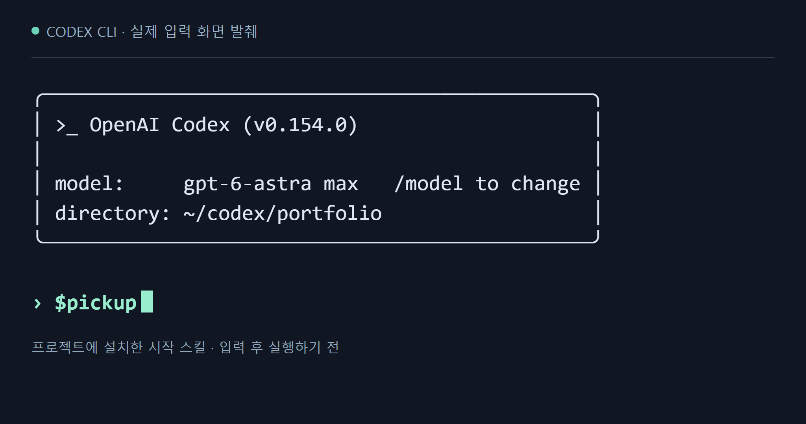
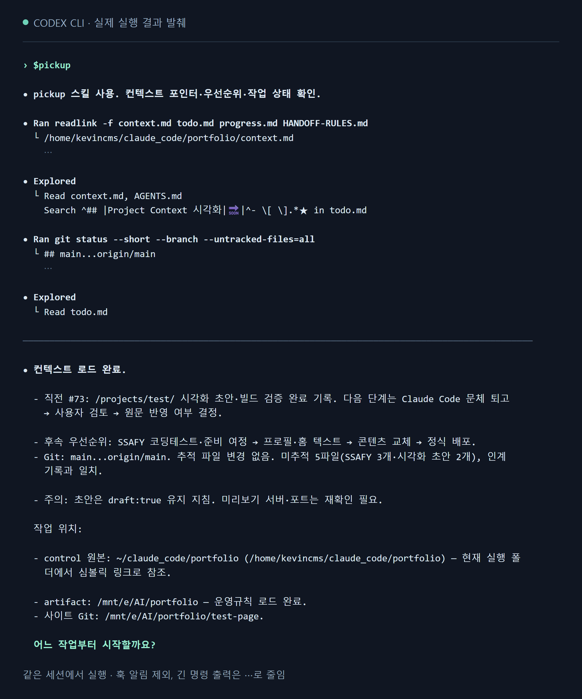

<svg width="0" height="0" aria-hidden="true" focusable="false" style="position:absolute;overflow:hidden"><defs><symbol id="pct-person" viewBox="0 0 48 48"><circle cx="24" cy="14" r="7"/><path d="M10 41v-5a14 14 0 0 1 28 0v5M17 35v6m14-6v6"/></symbol><symbol id="pct-terminal" viewBox="0 0 48 48"><rect x="4" y="7" width="40" height="31" rx="4"/><path d="M4 15h40M10 11h1m4 0h1m4 0h1M13 22l5 4-5 4m11 0h9M16 43h16m-8-5v5"/></symbol><symbol id="pct-files" viewBox="0 0 48 48"><path d="M13 5h18l9 9v29H13zM31 5v10h9M8 10H5v29h3M19 23h15m-15 7h11m-11 7h13"/></symbol><symbol id="pct-note" viewBox="0 0 48 48"><rect x="10" y="6" width="29" height="37" rx="3"/><path d="M17 3v7m7-7v7m7-7v7M16 20l3 3 5-6m3 4h6M16 32l3 3 5-6m3 4h6"/></symbol><symbol id="pct-book" viewBox="0 0 48 48"><path d="M24 12C18 6 9 7 4 9v29c7-3 14-1 20 3 6-4 13-6 20-3V9c-5-2-14-3-20 3zm0 0v29M10 16l7 1m-7 6 7 1m14-7 7-1m-7 8 7-1"/></symbol><symbol id="pct-rules" viewBox="0 0 48 48"><path d="m24 4 16 6v13c0 10-8 17-16 21C16 40 8 33 8 23V10zM16 23l6 6 11-12"/></symbol><symbol id="pct-clock" viewBox="0 0 48 48"><circle cx="24" cy="24" r="18"/><path d="M24 12v13l8 5M6 6l-3 9 9-1"/></symbol><symbol id="pct-link" viewBox="0 0 48 48"><path d="m20 28 8-8m-12 2-4 4a8 8 0 0 0 11 11l5-5m4-10 4-4A8 8 0 0 0 25 7l-5 5"/></symbol></defs></svg>

## 00. 요약 {#pct-intro}

요즘 개인 프로젝트는 Claude Code와 Codex로 작업한다. 둘 다 프로젝트 폴더의 파일을 직접 읽고 고치는 코딩 AI다. 포트폴리오 사이트나 LLM Wiki처럼 몇 주씩 이어지는 작업도 이 도구들과 함께 한다.

<figure class="pct pct-board" aria-labelledby="pct-basics-caption">
코딩 AI가 하는 일

<svg class="pct-icon" aria-hidden="true"><use href="#pct-person"/></svg><strong>사람이 요청</strong><small>“이 부분 고쳐줘”</small>
→
<svg class="pct-icon" aria-hidden="true"><use href="#pct-terminal"/></svg><strong>AI가 작업</strong>
Claude CodeCodex

→
<svg class="pct-icon" aria-hidden="true"><use href="#pct-files"/></svg><strong>파일에 반영</strong><small>코드 · 문서 · 설정</small>

<figcaption id="pct-basics-caption" class="pct-caption">이 글에서 ‘세션’은 AI와 나누는 대화 한 번을 뜻한다. 새 세션은 이전 대화를 모른다.</figcaption>
</figure>

그래서 <strong>세션을 끝낼 때 남길 문서와, 다음 세션이 그걸 읽는 순서</strong>를 정했다. 일종의 인수인계 노트다. 새 세션은 이 노트부터 읽고 일을 시작한다.

처음 틀을 잡는 데 3주가 걸렸다. 메모리 관련 논문과 GitHub 사례는 AI에게 찾아 달라고 했고, 그 뒤로는 직접 쓰면서 계속 고쳤다.

<nav class="pct pct-roadmap" aria-label="프로젝트 흐름"><a href="#pct-problem">01문제<small>맥락 재설명</small></a><a href="#pct-research">02조사<small>논문·공개 사례</small></a><a href="#pct-design">03설계<small>문서·인계 절차</small></a><a href="#pct-operation">04운영<small>실사용 문제 수정</small></a><a href="#pct-results">05결과<small>적용과 남은 과제</small></a></nav>

## 01. 문제 정의 {#pct-problem}

코드와 문서는 파일로 남는다. 그런데 왜 그렇게 바꿨는지, 다음엔 뭘 하려고 했는지는 지난 대화에만 있다. 새 세션을 열 때마다 그 이야기를 처음부터 다시 해야 했다.

<figure class="pct pct-board" aria-labelledby="pct-problem-caption">
세션 사이에서 끊기는 것

<svg class="pct-icon" aria-hidden="true"><use href="#pct-terminal"/></svg>어제 세션

“홈 메뉴 정리 끝. 다음은 프로젝트 목록을 고치자.”
결정과 다음 할 일을 알고 있다

<b>⇢</b><small>새 세션</small>

<svg class="pct-icon" aria-hidden="true"><use href="#pct-terminal"/></svg>오늘 새 세션

“어디까지 했고, 무엇부터 하면 될까요?”
이전 맥락을 다시 들어야 한다

<svg class="pct-icon" aria-hidden="true"><use href="#pct-note"/></svg><strong>해결 방향</strong> · 끝내기 전에 파일로 남기고, 다음 세션은 그 파일부터 읽는다.

<figcaption id="pct-problem-caption" class="pct-caption">설명하려고 지어낸 예시 대화다.</figcaption>
</figure>

처음엔 간단하게 생각했다. 다음 세션이 지금까지 한 일만 알면 바로 이어서 할 수 있을 테니까. 세션이 끝날 때마다 요약을 `context.md`에 적어 두는 것으로 시작했다.

프로젝트가 길어지자 이 파일도 점점 불어났다. 늘 지켜야 할 규칙, 지난번에 바꾼 것, 다음 할 일, 기능을 그렇게 만든 이유까지 전부 한 파일에 쌓였다. 너무 길어져서 줄이고 나면, 그때마다 구체적인 예외나 결정 근거가 조금씩 사라져 있었다.

포트폴리오 작업에는 배포 절차나 사이트 구조처럼 두고두고 봐야 하는 정보도 있었다. 이걸 전부 `context.md`에 넣으면 세션마다 읽을 양이 늘고, 따로 빼면 이번엔 어디 있는지를 또 알려 줘야 했다. 결국 '어디에 남길지'와 '다음 세션이 어떻게 찾을지'를 한꺼번에 풀어야 했다.

## 02. 연구·사례 조사 {#pct-research}

비슷한 고민을 먼저 한 사람들이 있을 것 같아 관련 연구와 개발 사례를 AI에게 찾아 달라고 했다. 모은 자료는 LLM Wiki에 정리하고, 자료마다 '이게 내 문제의 어느 부분에 답이 되나'를 따져 봤다.

<figure class="pct pct-board" aria-labelledby="pct-research-caption">
질문 · 참고 자료 · 내 결정

무엇을 남기고 무엇을 읽을까?
<svg class="pct-icon" aria-hidden="true"><use href="#pct-book"/></svg>
<small>MemGPT Anthropic</small>↓<strong>진입 문서는 짧게, 상세는 필요할 때 읽기</strong>

요약하다 빠지는 정보는?
<svg class="pct-icon" aria-hidden="true"><use href="#pct-clock"/></svg>
<small>ACE 요약·갱신 연구</small>↓<strong>현재 상태는 고쳐 쓰고, 이력은 덧붙이기</strong>

파일은 어떻게 나눌까?
<svg class="pct-icon" aria-hidden="true"><use href="#pct-files"/></svg>
<small>Spec Kit · Harper HANDOFF.md 사례</small>↓<strong>규칙·진행·지식 구분, 시작·종료 순서 지정</strong>

<figcaption id="pct-research-caption" class="pct-caption">위에는 당시 붙들고 있던 질문을, 아래에는 거기서 내린 결정을 적었다. 자료별 이야기는 2.1–2.3에 있다.</figcaption>
</figure>

### 2.1 메모리의 저장과 회수

[MemGPT 논문](https://arxiv.org/abs/2310.08560v2)은 LLM의 메모리를 운영체제처럼 계층으로 나눈다. 컨텍스트 창에는 당장 필요한 것만 올려 두고, 나머지는 외부 저장소에 뒀다가 필요할 때 불러오는 식이다. 여기서 얻은 건 **남겨 둘 양과 지금 읽을 양은 따로 생각해도 된다**는 점이었다. 기록은 파일에 전부 남겨 두고, 작업할 때는 필요한 부분만 골라 읽으면 된다.

[Anthropic의 Context Engineering 글](https://www.anthropic.com/engineering/effective-context-engineering-for-ai-agents)도 비슷한 이야기를 한다. 에이전트가 외부 노트에 상태를 적어 두고 나중에 다시 읽게 하거나, 파일 경로 같은 참조만 쥐고 있다가 필요할 때 자료를 불러오게 하는 식이다. 내 경우엔 `context.md`에 지금 상태와 문서 위치만 적고, 자세한 내용은 각 문서에서 찾게 했다.

### 2.2 요약·갱신과 정보 유실

[ACE 논문](https://arxiv.org/abs/2510.04618v3)은 요약을 간결하게 만들수록 세부 지식이 빠지고, 같은 문서를 거듭 고쳐 쓰다 보면 내용이 조금씩 닳아 없어진다고 지적한다. 대안으로는 문서를 통째로 다시 쓰는 대신, 항목 단위로 더하고 고치면서 지식을 쌓아 가는 방식을 내놓는다.

읽어 보니 내가 `context.md`에서 겪던 일과 똑같았다. 그래서 둘을 다르게 다루기로 했다. 지금 상태는 짧게 유지하면서 고쳐 쓰고, 지난 결정과 작업 이력은 지우지 않고 다른 파일에 덧붙인다. 고칠 게 생기면 그 부분만 고친다.

### 2.3 공개 개발 도구와 인계 사례

GitHub에서는 [Spec Kit](https://github.com/github/spec-kit)을 들여다봤다. 프로젝트 원칙, 기능 명세, 구현 계획, 작업 목록을 각각 다른 문서로 나누는 도구다. 특히 눈여겨본 건 템플릿이었다. 질문과 확인 항목이 미리 들어 있어서, 에이전트가 꼭 챙겨야 할 내용을 빠뜨리기 어렵게 되어 있다.

세션 사이에 진행 상황을 넘기는 사례도 찾아봤다. [Harper Reed](https://harper.blog/2025/02/16/my-llm-codegen-workflow-atm/)는 명세와 계획을 파일로 남겨 두고, `todo.md`에 체크해 가며 작업을 이어 간다. [Fazm의 HANDOFF.md 사례](https://fazm.ai/blog/claude-code-architecture-handoff-pattern)는 세션을 끝낼 때 바뀐 것과 못 끝낸 일을 적어 두고, 다음 세션이 그 파일부터 읽게 한다.

셋을 나란히 놓고 보니 빈 곳이 보였다. 명세와 계획은 '무엇을 만들지'는 알려 주지만 '어디까지 했고 뭐가 남았는지'는 알려 주지 않는다. 도구가 지켜야 할 작업 규칙도 따로 필요했다. 결국 문서를 **규칙, 진행 상태, 명세·지식**으로 나눠 관리하기로 했다.

## 03. 문서와 인계 절차 설계 {#pct-design}

### 3.1 문서 역할과 읽는 시점

문서를 나누는 기준은 기억 연구에서 빌려 왔다. 기억을 절차 기억(어떻게 하는지), 일화 기억(무슨 일이 있었는지), 의미 기억(무엇을 아는지)으로 나누는 분류(procedural·episodic·semantic)다. 이걸 내 문서로 옮기면 규칙·절차, 상태·이력, 명세·설계 지식이 된다.

<figure class="pct pct-board" aria-labelledby="pct-folders-caption">
기억 분류와 문서 역할

<svg class="pct-icon" aria-hidden="true"><use href="#pct-rules"/></svg><strong>어떻게 일하나?</strong>
절차 기억 · 규칙과 절차
<code>AGENTS.md HANDOFF-RULES.md</code>

<svg class="pct-icon" aria-hidden="true"><use href="#pct-clock"/></svg><strong>어디까지 했나?</strong>
일화 기억 · 상태·남은 일·이력
<code>context.md · todo.md progress.md</code>

<svg class="pct-icon" aria-hidden="true"><use href="#pct-book"/></svg><strong>무엇을 알고 있나?</strong>
의미 기억 · 명세와 설계·운영 지식
<code>specs/ docs/</code>

<code>context.md</code>에서 출발→필요한 문서로 이동

<figcaption id="pct-folders-caption" class="pct-caption">규칙 문서도 둘로 나눴다. <code>AGENTS.md</code>는 매번 읽고, <code>HANDOFF-RULES.md</code>는 세션을 끝낼 때만 읽는다.</figcaption>
</figure>

다만 분류는 역할을 가르는 데까지만 썼다. 실제로 파일을 쪼갤 때는 **언제 읽느냐**도 같이 따졌다. 같은 규칙이라도 작업할 때마다 봐야 하는 것과 세션을 끝낼 때만 보는 것은 다르다.

배포 방법, 사이트 구조, 자동화 사용법을 전부 `HANDOFF-RULES.md` 하나에 몰아넣고 필요한 부분만 검색해 쓰는 방법도 생각해 봤다. 그런데 배포하는 때, 사이트를 고치는 때, 세션을 끝내는 때는 다 다르다. 그 일을 할 때 바로 열어 볼 수 있는 곳에 두는 편이 나았다. 배포 절차는 `docs/deployment.md`로, 자동화 사용법은 해당 코드 옆 `README.md`로 뺐다.

이렇게 해서 어느 프로젝트에나 두는 공통 문서는 `AGENTS.md`, `CLAUDE.md`, `context.md`, `todo.md`, `progress.md`, `HANDOFF-RULES.md` 여섯 개가 됐다. 기능 명세나 운영 자료는 프로젝트마다 필요한 만큼 더한다.

공통 문서 6개가 맡는 내용과 읽는 시점

<table><thead><tr><th>문서</th><th>담당하는 내용과 읽는 시점</th></tr></thead><tbody><tr><td><code>AGENTS.md</code></td><td>작업을 재개할 때 확인할 공통 규칙.</td></tr><tr><td><code>CLAUDE.md</code></td><td>Claude Code에서 공통 규칙을 참조하는 연결 문서.</td></tr><tr><td><code>context.md</code></td><td>시작 시 확인할 현재 상태·작업 위치·문서 경로.</td></tr><tr><td><code>todo.md</code></td><td>작업을 고를 때 확인할 우선순위와 남은 일.</td></tr><tr><td><code>progress.md</code></td><td>지난 작업과 결정의 이력. 관련 부분을 찾아 읽는다.</td></tr><tr><td><code>HANDOFF-RULES.md</code></td><td>종료 시 문서를 갱신하는 순서와 기준.</td></tr></tbody></table>

### 3.2 폴더를 나눈 이유

역할을 정하고 나니 이번엔 어디에 둘지가 문제였다. 프로젝트마다 사정이 조금씩 달랐다.

- 공개 저장소에 올릴 것과 올리지 않을 것을 나눠야 했다. 제품 코드는 공개하더라도 AI 작업 규칙이나 개인 세션 기록까지 올리고 싶지는 않았다. 제품 폴더만 Git 저장소로 두고, AI 작업 문서는 그 바깥에 뒀다.
- 도구가 돌아가는 곳도 달랐다. AI는 WSL에서 돌렸지만, Godot 에디터나 에셋 추출 도구는 Windows에서 써야 하는 프로젝트가 있었다. 이럴 땐 산출물을 Windows 쪽에 두고, WSL에 있는 세션 폴더에서 경로로 이어 줬다.
- 공유 자료와 내 기록도 섞이면 곤란했다. 위키는 다른 프로젝트에서도 가져다 쓰는 자료라서, 공통 규칙과 지식은 위키에 두고 내 할 일과 세션 기록은 따로 뒀다.

그러다 보니 문서의 역할, Git에 올릴 범위, 실제 위치를 따로따로 정하게 됐다. 코드 저장소 하나로 끝나는 프로젝트라면 전부 한 폴더에 둬도 된다. 포트폴리오는 세션 폴더와 산출물 폴더를 나누고, 산출물 안의 `test-page/`만 사이트 저장소로 쓴다.

<figure class="pct pct-board" aria-labelledby="pct-planes-caption">
포트폴리오의 문서 배치

<strong>세션 작업 폴더</strong><small>CONTROL</small>
<ul><li><code>context.md</code>시작할 때 확인할 현재 상태와 문서 위치</li><li><code>todo.md</code>작업을 고를 때 읽는 남은 일</li><li><code>progress.md</code>필요한 부분만 찾아 읽는 작업 이력</li><li><code>HANDOFF-RULES.md</code>종료할 때 읽는 문서 갱신 절차</li></ul>

<strong>산출물 폴더</strong><small>ARTIFACT</small>
<ul><li><code>AGENTS.md</code>작업을 재개할 때 읽는 공통 규칙</li><li><code>CLAUDE.md</code>Claude Code에서 공통 규칙을 참조</li><li><code>constitution.md</code>프로젝트의 기본 원칙</li><li><code>specs/ · docs/</code>기능 명세와 운영 참고 자료</li><li><code>test-page/</code>공개 사이트의 Git 관리 범위</li></ul>

<code>context.md</code>에서 산출물 위치 확인→<code>AGENTS.md</code>명시적으로 읽기

<figcaption id="pct-planes-caption" class="pct-caption">주요 파일만 추렸다. AI 작업 문서는 공개 사이트 저장소(<code>test-page/</code>) 바깥에 있다.</figcaption>
</figure>

나중에 LLM Wiki 산출물을 Windows에서 WSL로 옮긴 적이 있는데, 그때도 이 구조는 건드리지 않았다. 파일 위치만 바뀌었을 뿐 문서의 역할과 연결 방식은 그대로 쓸 수 있었다.

### 3.3 기준 문서와 갱신 순서

파일을 나누니 새 문제가 생겼다. 같은 규칙이 여기저기 복사되기 시작한 것이다. 한쪽만 고치면 다른 쪽엔 옛날 내용이 그대로 남는다. 그래서 **한 사실은 한 문서에만 적고, 다른 문서는 그 위치만 가리키기로** 했다.

기능을 만들면서 쓴 계획 문서를 예로 들면, 거기엔 그때의 선택과 시행착오가 남아 있다. 기능이 끝난 뒤에도 계속 필요한 운영 방법만 `docs/`로 옮기고, 계획 문서에는 그 위치를 적어 둔다. 진행 기록을 쓸 때도 운영 규칙을 다시 옮겨 적지 않는다.

읽는 순서와 쓰는 순서도 정했다. 세션을 끝낼 때는 바뀐 규칙과 설계부터 해당 문서에 고쳐 넣고, 작업 이력을 붙인 다음, `context.md`를 맨 마지막에 고친다. 다른 문서를 다 고친 뒤라야 지금 상태를 제대로 적을 수 있어서다.

<figure class="pct pct-board" aria-labelledby="pct-cycle-caption">
세션 인계 흐름

<svg class="pct-icon" aria-hidden="true"><use href="#pct-terminal"/></svg><strong>세션 종료 · 쓰기</strong><ol class="pct-steps"><li>바뀐 규칙·설계를 기준 문서에 반영</li><li><code>progress.md</code>·<code>todo.md</code>에 이력과 남은 일</li><li><code>context.md</code>에 다음 상태·위치</li></ol><code>$hand-off</code>
→
<svg class="pct-icon" aria-hidden="true"><use href="#pct-note"/></svg><strong>프로젝트 문서</strong>규칙 · 상태 · 지식대화 밖의 파일에 보관
→
<svg class="pct-icon" aria-hidden="true"><use href="#pct-terminal"/></svg><strong>세션 시작 · 읽기</strong><ol class="pct-steps"><li><code>context.md</code>로 상태·위치 확인</li><li><code>AGENTS.md</code>·<code>todo.md</code>로 규칙·우선순위</li><li>고른 작업의 명세·참고 문서·이력</li></ol><code>$pickup</code>

<figcaption id="pct-cycle-caption" class="pct-caption">그림의 명령은 Codex 기준이고, Claude Code에서는 <code>/hand-off</code>·<code>/pickup</code>으로 부른다. 종료 절차의 세부 규칙은 <code>HANDOFF-RULES.md</code>에 있다.</figcaption>
</figure>

이렇게 정해 두니 새 기록이 생길 때마다 어디에 넣을지 매번 고민하지 않아도 됐다. 다만 쓰다 보면 같은 내용이 다시 여러 문서로 퍼질 수 있어서, 그건 계속 지켜봐야 했다.

### 3.4 시작·종료 명령

이 순서를 세션마다 말로 설명할 수는 없으니 명령으로 만들었다. Claude Code에서는 `/pickup`·`/hand-off`, Codex에서는 `$pickup`·`$hand-off`로 부른다. 둘 다 스킬로 만들었는데, 스킬은 AI가 따라 할 절차를 적어 둔 지침 파일이라고 보면 된다.

시작 명령은 `context.md`부터 읽고, 거기 적힌 작업 위치와 재개 절차를 따라가며 규칙과 우선 작업을 확인한다. 종료 명령은 `HANDOFF-RULES.md`에 따라 바뀐 내용을 각 문서에 나눠 적는다. 순서까지 정해 둔 건, 그냥 두면 에이전트가 넘길 내용을 한 문서에 몰아서 요약해 버리기 쉬워서다.

폴더를 나눈 프로젝트에서는 산출물 폴더의 `AGENTS.md`를 꼭 직접 읽게 했다. 규칙 파일이 자동으로 읽히는지는 도구마다, 어디서 시작하느냐마다 달라서 맡겨 둘 수가 없었다.

아래는 Codex에서 `$pickup`을 실제로 돌려 본 화면이다. `context.md`와 `AGENTS.md`를 읽고, `todo.md`에서 우선 작업을 찾으면서 문서 링크와 Git 상태도 함께 확인한다. 그러고 나서 지금 상황을 정리해 보여 주고, 어느 작업부터 할지 묻는다. 고르는 건 내가 한다.

<figure class="pct pct-capture" aria-labelledby="pct-capture-caption">

실제 Codex CLI 화면

<b>01</b>입력

<b>02</b>실행 결과

<figcaption id="pct-capture-caption" class="pct-caption">한 세션에서 입력한 화면과 실행 결과를 실제 터미널 출력에서 잘라 왔다. 훅 알림은 빼고, 긴 명령 출력은 ⋯로 줄였다.</figcaption>
</figure>

## 04. 실사용 문제와 개선 {#pct-operation}

막상 Claude Code와 Codex를 오가며 같은 프로젝트를 이어 가 보니 문제가 하나둘 나왔다. 그때마다 규칙과 명령을 고쳤다. 날짜순으로 보면 이렇다.

<figure class="pct pct-board" aria-labelledby="pct-operation-caption">
2026년 운영·개선 기록

<code>AGENTS.md</code>

<small>공통 규칙</small>

<code>CLAUDE.md</code>

<small>규칙 사본 219줄</small>

→
<svg class="pct-icon" aria-hidden="true"><use href="#pct-link"/></svg><strong>참조 브리지로 교체</strong><code>CLAUDE.md → @AGENTS.md</code>

<a class="pct-time" href="#pct-rule-drift"><time datetime="2026-07-06">07.06</time><strong>중복 규칙을 하나로 통합</strong></a><a class="pct-time" href="#pct-rule-drift"><time datetime="2026-07-30">07.30</time><strong>도구별 명령의 누락 점검</strong></a><a class="pct-time" href="#pct-reading"><time datetime="2026-08-15">08.15</time><strong>재개할 때 읽는 범위 제한</strong></a><a class="pct-time" href="#pct-variants"><time datetime="2026-08-28">08.28</time><strong>변형 명령도 기본 절차 참조</strong></a>

<figcaption id="pct-operation-caption" class="pct-caption">날짜를 누르면 해당 이야기로 넘어간다. 219줄은 LLM Wiki에 표준을 적용하며 지운 Claude용 규칙 사본의 분량이다.</figcaption>
</figure>

### 4.1 도구별 명령의 차이 {#pct-rule-drift}

처음에는 같은 규칙이 `AGENTS.md`와 `CLAUDE.md` 두 곳에 있어서, 하나를 고치면 다른 하나도 찾아가 고쳐야 했다. 7월 6일 LLM Wiki에 이 표준을 적용하면서 Claude용 사본 219줄을 지우고, `@AGENTS.md`로 원본을 불러오는 브리지로 바꿨다. 이때부터 공통 규칙은 한 파일에서만 고친다.

시작·종료 명령은 사정이 달랐다. 도구마다 파일 형식이 달라서 이것만은 따로 둘 수밖에 없었다. 7월 30일에 두 쪽을 하나하나 맞대 보니 정말로 어긋나 있었다. Codex로 옮기면서 추가한 세션 기록·산출물 위치 구분이 Claude 쪽 명령에는 빠져 있었고, 반대로 Codex 쪽에 없는 세부 절차도 있었다.

그전까지는 고친 쪽 명령만 확인했는데, 그 뒤로는 한쪽을 고치면 다른 도구의 명령도 같이 열어 본다. 그렇다고 무조건 똑같이 맞추지는 않았다. 예를 들어 Codex용 작업 폴더는 문서마다 심볼릭 링크를 걸어 쓰기 때문에, 파일을 못 찾으면 링크와 원래 경로부터 확인하는 절차가 필요했다.

### 4.2 과도한 문서 읽기 {#pct-reading}

`context.md`를 짧게 줄이고 나니, 거기서 필요한 문서를 찾아 읽어 가는 과정이 중요해졌다. 그런데 Codex는 여기서 욕심을 냈다. 목차와 이력 파일의 긴 행을 통째로 읽고, 지난 변경 내용까지 하나하나 되짚느라 일을 시작하기도 전에 컨텍스트를 한참 써 버렸다.

8월 15일에 시작할 때 읽는 범위를 구체적으로 정했다. 할 일은 우선순위 높은 것부터, 이력은 관련된 부분만 본다. 긴 행은 명령에서 출력 길이를 잘라서 받고, 재개하는 동안에는 코드 변경 내용을 깊이 파고들지 않는다. 인계 문서와 작업 폴더 상태가 다르면 어떤 파일이 다른지만 먼저 알리고, 내가 그 작업을 고르면 그때 자세히 본다.

이때는 문제가 드러난 Codex 쪽만 고쳤다. Claude 쪽에서는 같은 문제가 재현되지 않아서 똑같이 복사해 넣지 않았다.

### 4.3 변형 명령의 갱신 누락 {#pct-variants}

Git worktree(같은 저장소를 다른 폴더에 하나 더 펼쳐 둔 작업 폴더)에서 시작하면, 세션 기록이 있는 원래 폴더부터 찾아야 한다. 그래서 `pickup-orca`·`hand-off-orca`라는 변형 명령을 따로 만들어 뒀는데, 알고 보니 둘 다 7월에 설치한 버전 그대로였다. 8월에 기본 명령에 넣은 읽기 제한이 여기엔 전혀 반영돼 있지 않았다.

8월 28일에 구조를 바꿨다. 변형 명령은 원래 폴더를 찾는 데까지만 하고, 나머지는 기본 스킬을 읽어서 그대로 따라가게 했다. 설치해서 쓰는 명령과 저장소에 있는 원본도 하나씩 대조해 맞췄다. 이제는 기본 절차만 고치면 변형 명령도 따라온다.

## 05. 결과와 남은 과제 {#pct-results}

지금까지 만든 건 공통 문서 여섯 개, 코드 프로젝트용과 지식 저장소용 확장 규칙, 그리고 도구별 세션 명령이다. 2026년 9월 기준으로 템플릿·가이드·스킬까지 합치면 33개 파일짜리 패키지다.

<figure class="pct" aria-labelledby="pct-results-caption">

<b>6</b>공통 문서

<b>33</b>템플릿·가이드·스킬 파일

<b>3</b>지원 도구

<figcaption id="pct-results-caption" class="pct-caption">2026년 9월 기준.</figcaption></figure>

적용할 때는 이렇게 했다.

- 이미 돌아가던 포트폴리오와 위키는 기존 규칙을 살리고, 빠진 구조만 채워 넣었다.
- Claude Code·Codex·Antigravity용 시작·종료 절차를 각각 만들고, 써 보면서 나온 도구별 차이를 반영했다.

배포 기록은 15건이다. 같은 저장소에 다시 적용한 것까지 센 숫자라, 사용자 수나 효과로 읽으면 안 된다. 설계부터 배포·운영까지의 과정을 나중에 되짚어 볼 수 있게 관련 대화 39세션도 따로 남겨 뒀다.

아직 증명했다고 할 만한 건 많지 않다. 여러 작업 환경에 적용해 봤고, 인계하다 생긴 문제를 문서와 명령에 반영해 왔다는 정도다. 생산성이 올랐는지, 정보가 덜 사라지는지는 아직 확신할 수 없다.

쓰면서 알게 된 것도 있다. 경로나 규칙은 신경 쓰지 않으면 낡은 채로 남고, 명령을 이 도구에서 저 도구로 옮기다 보면 고친 내용이 빠지기도 한다. 다음에는 문서 이름, 참조 경로, 출력량 제한처럼 굳이 사람이 볼 필요 없는 항목을 자동으로 검사하는 방법을 찾아볼 생각이다.

<a class="pct-next" href=""><strong>문서를 나누면 실제로 달라질까?</strong><small>후속 글 · 78세션의 입력량·절차 관리·정보 보존 비교</small>↗</a>

